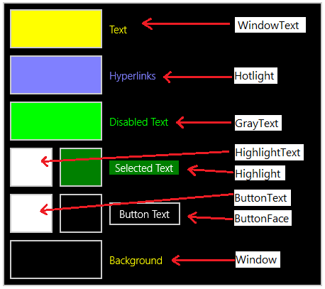
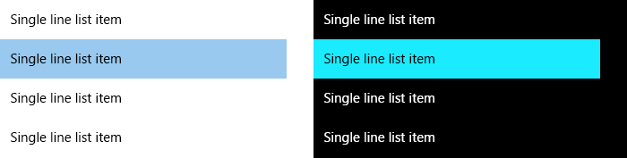
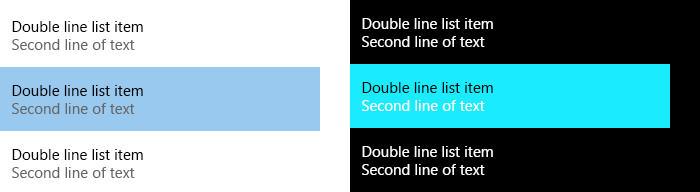
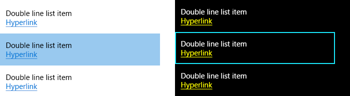

# <a name="high-contrast-themes"></a>Temas de alto contraste  

O Windows dá suporte para temas de alto contraste do sistema operacional e dos aplicativos que os usuários podem optar por habilitar. Os temas de alto contraste usam uma pequena paleta de cores contrastantes que deixa a interface mais fácil de ver.

**Figura 1. Calculadora mostrada no tema claro e no tema Preto em Alto Contraste.**


Você pode mudar para um tema de alto contraste usando *Configurações > Facilidade de acesso > Alto contraste*.

> [!NOTE]
> Não confunda temas de alto contraste com temas claros e escuros, que permitem uma paleta bem maior de cores que não é considerada de alto contraste. Para mais temas claros e escuros, consulte o artigo sobre [cor](../style/color.md).

Embora os controles comuns venham com suporte completo para alto contraste de graça, tenha cuidado ao personalizar sua interface do usuário. O bug de alto contraste mais comum é causado pela codificação de uma cor em um controle embutido.

```xaml
<!-- Don't do this! -->
<Grid Background="#E6E6E6">

<!-- Instead, create BrandedPageBackgroundBrush and do this. -->
<Grid Background="{ThemeResource BrandedPageBackgroundBrush}">
```

Quando a cor `#E6E6E6` é definida embutida no primeiro exemplo, a grade mantém essa cor de fundo em todos os temas. Se o usuário mudar para o tema Preto em Alto Contraste, ele vai esperar que seu aplicativo tenha uma tela de fundo preta. Como `#E6E6E6` é praticamente branco, alguns usuários podem não conseguir interagir com seu aplicativo.

No segundo exemplo, a [**extensão de marcação {ThemeResource}**](../xaml-platform/themeresource-markup-extension.md) é usada para fazer referência a uma cor na coleção de [**ThemeDictionaries**](https://msdn.microsoft.com/library/windows/apps/windows.ui.xaml.resourcedictionary.themedictionaries.aspx), uma propriedade dedicada de um elemento [**ResourceDictionary**](https://msdn.microsoft.com/library/windows/apps/BR208794). ThemeDictionaries permite que o XAML troque as cores automaticamente com base no tema atual do usuário.

## <a name="theme-dictionaries"></a>Dicionários de temas

Quando você precisar alterar uma cor padrão do sistema, crie uma coleção de ThemeDictionaries para seu aplicativo.

1. Comece criando o caminho adequado, caso ainda não exista. No App.xaml, crie uma coleção de ThemeDictionaries, incluindo no mínimo **Default** e **HighContrast**.
2. Em Default, crie o tipo de [Brush](http://msdn.microsoft.com/library/windows/apps/xaml/windows.ui.xaml.media.brush.aspx) de que você precisa, geralmente SolidColorBrush. Dê a ele um nome de x:Key específico para o que ele está sendo usado.
3. Atribua a cor desejada a ele.
4. Copie esse Brush em HighContrast.

``` xaml
<Application.Resources>
    <ResourceDictionary>
        <ResourceDictionary.ThemeDictionaries>
            <!-- Default is a fallback if a more precise theme isn't called
            out below -->
            <ResourceDictionary x:Key="Default">
                <SolidColorBrush x:Key="BrandedPageBackgroundBrush" Color="#E6E6E6" />
            </ResourceDictionary>

            <!-- Optional, Light is used in light theme.
            If included, Default will be used for Dark theme -->
            <ResourceDictionary x:Key="Light">
                <SolidColorBrush x:Key="BrandedPageBackgroundBrush" Color="#E6E6E6" />
            </ResourceDictionary>

            <!-- HighContrast is used in all high contrast themes -->
            <ResourceDictionary x:Key="HighContrast">
                <SolidColorBrush x:Key="BrandedPageBackgroundBrush" Color="#E6E6E6" />
            </ResourceDictionary>
        </ResourceDictionary.ThemeDictionaries>
    </ResourceDictionary>
</Application.Resources>
```

A última etapa é determinar a cor que será usada em alto contraste, o que é explicado na próxima seção.

> [!NOTE]
> HighContrast não é o único nome de chave disponível. Também há HighContrastBlack, HighContrastWhite e HighContrastCustom. Na maioria dos casos, HighContrast é tudo que você precisa.

## <a name="high-contrast-colors"></a>Cores de alto contraste

Na página *Configurações > Facilidade de acesso > Alto contraste*, há 4 temas de alto contraste por padrão. 

**Figura 2. Depois que o usuário seleciona uma opção, a página mostra uma visualização.**


**Figura 3. Cada amostra de cor na visualização pode ser clicado para alterar seu valor. Cada amostra também é mapeada diretamente para um recurso de cor XAML.**



Cada recurso `SystemColor*Color` é uma variável que atualiza a cor automaticamente quando o usuário muda os temas de alto contraste. As diretrizes a seguir explicam onde e quando usar cada recurso.

Recurso | Uso
-------- | -----
SystemColorWindowTextColor | Corpo do texto, títulos, listas; qualquer texto que não permita interação
SystemColorHotlightColor | Hiperlinks
SystemColorGrayTextColor | Interface do usuário desabilitada
SystemColorHighlightTextColor | Cor do primeiro plano do texto ou da interface do usuário que está em andamento, selecionado(a) ou interagindo
SystemColorHighlightColor | Cor da tela de fundo do texto ou da interface do usuário que está em andamento, selecionado(a) ou interagindo
SystemColorButtonTextColor | Cor do primeiro plano para botões; qualquer interface do usuário que permita interação
SystemColorButtonFaceColor | Cor da tela de fundo para botões; qualquer interface do usuário que permita interação
SystemColorWindowColor | Tela de fundo de páginas, painéis, pop-ups e barras
<br/>
Muitas vezes é útil procurar aplicativos existentes, Iniciar ou os controles comuns para ver como outras pessoas resolveram problemas de design de alto contraste similares aos seus.

**Você deve**

* Respeitar os pares de tela de fundo/primeiro plano sempre que possível.
* Testar os 4 temas de alto contraste enquanto seu aplicativo estiver em execução. O usuário não deve ter de reiniciar seu aplicativo quando mudar de tema.
* Ser consistente.

**Você não deve**

* Codificar uma cor do tema HighContrast; use os recursos `SystemColor*Color`.
* Escolher um recurso de cor por estética. Lembre-se de que elas mudam com o tema!
* Não use `SystemColorGrayTextColor` para o corpo do texto que é secundário ou atua como uma dica.


Para continuar o exemplo anterior, você precisa escolher um recurso para `BrandedPageBackgroundBrush`. Como o nome indica que ele será usado para uma tela de fundo, `SystemColorWindowColor` é uma boa opção.

``` xaml
<Application.Resources>
    <ResourceDictionary>
        <ResourceDictionary.ThemeDictionaries>
            <!-- Default is a fallback if a more precise theme isn't called
            out below -->
            <ResourceDictionary x:Key="Default">
                <SolidColorBrush x:Key="BrandedPageBackgroundBrush" Color="#E6E6E6" />
            </ResourceDictionary>

            <!-- Optional, Light is used in light theme.
            If included, Default will be used for Dark theme -->
            <ResourceDictionary x:Key="Light">
                <SolidColorBrush x:Key="BrandedPageBackgroundBrush" Color="#E6E6E6" />
            </ResourceDictionary>

            <!-- HighContrast is used in all high contrast themes -->
            <ResourceDictionary x:Key="HighContrast">
                <SolidColorBrush x:Key="BrandedPageBackgroundBrush" Color="{ThemeResource SystemColorWindowColor}" />
            </ResourceDictionary>
        </ResourceDictionary.ThemeDictionaries>
    </ResourceDictionary>
</Application.Resources>
```

Posteriormente em seu aplicativo, você pode definir a tela de fundo.

```xaml
<Grid Background="{ThemeResource BrandedPageBackgroundBrush}">
```

Observe como `{ThemeResource}` é usado duas vezes, uma vez para fazer referência a `SystemColorWindowColor` e novamente para fazer referência a `BrandedPageBackgroundBrush`. Ambos são necessários para seu aplicativo aplicar o tema corretamente no tempo de execução. Esse é um bom momento para testar a funcionalidade em seu aplicativo. A tela de fundo da grade será atualizada automaticamente quando você mudar para um tema de alto contraste. Ela também será atualizada ao alternar entre temas de alto contraste diferentes.

## <a name="when-to-use-borders"></a>Quando usar bordas

Páginas, painéis, pop-ups e barras devem usar `SystemColorWindowColor` para a tela de fundo em alto contraste. Adicione uma borda somente de alto contraste quando necessário para preservar limites importantes na interface do usuário.

**Figura 4. O painel de navegação e a página compartilham a mesma cor de tela de fundo em alto contraste. Uma borda somente de alto contraste para dividi-los é essencial.**


## <a name="list-items"></a>Itens de lista

Em alto contraste, os itens em [ListView](https://msdn.microsoft.com/library/windows/apps/windows.ui.xaml.controls.listview.aspx) têm a tela de fundo definida como `SystemColorHighlightColor` quando são focalizados, pressionados ou selecionados. Itens de lista complexos normalmente têm um bug em que o conteúdo do item de lista não inverte sua cor quando focalizado, pressionado ou selecionado. Isso torna o item impossível de ler.

**Figura 5. Uma lista simples no tema claro (à esquerda) e tema no Preto em Alto Contraste (à direita). O segundo item está selecionado; observe como a cor de seu texto é invertida em alto contraste.**




### <a name="list-items-with-colored-text"></a>Itens de lista com texto colorido

Um culpado é a definição de TextBlock.Foreground do [DataTemplate](https://msdn.microsoft.com/library/windows/apps/windows.ui.xaml.controls.itemscontrol.itemtemplate.aspx) de ListView. Normalmente, isso é feito para estabelecer a hierarquia visual. A propriedade Foreground é definida no [ListViewItem](https://msdn.microsoft.com/library/windows/apps/windows.ui.xaml.controls.listviewitem.aspx), e os TextBlocks no DataTemplate herdam a cor de primeiro plano correta quando o item é focalizado, pressionado ou selecionado. No entanto, definir a propriedade Foreground interrompe a herança.

**Figura 6. Lista complexa no tema claro (à esquerda) e tema no Preto em Alto Contraste (à direita). Observe que, em alto contraste, a segunda linha do item selecionado não foi invertida.**



Você pode contornar isso definindo a propriedade Foreground condicionalmente por meio de um estilo que esteja em uma coleção de ThemeDictionaries. Como a propriedade Foreground não é definida por SecondaryBodyTextBlockStyle em HighContrast, sua cor será invertida corretamente.

```xaml
<!-- In App.xaml... -->
<ResourceDictionary.ThemeDictionaries>
    <ResourceDictionary x:Key="Default">
        <Style
            x:Key="SecondaryBodyTextBlockStyle"
            TargetType="TextBlock"
            BasedOn="{StaticResource BodyTextBlockStyle}">
            <Setter Property="Foreground" Value="{StaticResource SystemControlForegroundBaseMediumBrush}" />
        </Style>
    </ResourceDictionary>

    <ResourceDictionary x:Key="Light">
        <Style
            x:Key="SecondaryBodyTextBlockStyle"
            TargetType="TextBlock"
            BasedOn="{StaticResource BodyTextBlockStyle}">
            <Setter Property="Foreground" Value="{StaticResource SystemControlForegroundBaseMediumBrush}" />
        </Style>
    </ResourceDictionary>

    <ResourceDictionary x:Key="HighContrast">
        <!-- The Foreground Setter is omitted in HighContrast -->
        <Style
            x:Key="SecondaryBodyTextBlockStyle"
            TargetType="TextBlock"
            BasedOn="{StaticResource BodyTextBlockStyle}" />
    </ResourceDictionary>
</ResourceDictionary.ThemeDictionaries>

<!-- Usage in your DataTemplate... -->
<DataTemplate>
    <StackPanel>
        <TextBlock Style="{StaticResource BodyTextBlockStyle}" Text="Double line list item" />

        <!-- Note how ThemeResource is used to reference the Style -->
        <TextBlock Style="{ThemeResource SecondaryBodyTextBlockStyle}" Text="Second line of text" />
    </StackPanel>
</DataTemplate>
```

### <a name="list-items-with-buttons-and-links"></a>Itens de lista com botões e links

Às vezes, os itens de lista têm controles mais complexos, como [HyperlinkButton](https://msdn.microsoft.com/library/windows/apps/windows.ui.xaml.controls.hyperlinkbutton.aspx) ou [Button](https://msdn.microsoft.com/library/windows/apps/windows.ui.xaml.controls.button.aspx). Esses controles têm seus próprios estados para focalizado, pressionado e, às vezes, selecionado, que não funcionam sobre um item de lista. Os hiperlinks também ficam amarelos no tema Preto em Alto Contraste, o que os torna difíceis de ler quando um item de lista é focalizado, pressionado ou selecionado.

**Figura 7. Observe como o hiperlink fica difícil de ler em alto contraste.**


Uma solução é definir a tela de fundo do DataTemplate como `SystemColorWindowColor` em alto contraste. Isso cria o efeito de borda em alto contraste.

```xaml
<!-- In App.xaml... -->
<ResourceDictionary.ThemeDictionaries>
    <ResourceDictionary x:Key="Default">
        <SolidColorBrush x:Key="HighContrastOnlyBackgroundBrush" Color="Transparent" />
    </ResourceDictionary>

    <ResourceDictionary x:Key="HighContrast">
        <SolidColorBrush x:Key="HighContrastOnlyBackgroundBrush" Color="{ThemeResource SystemColorWindowColor}" />
    </ResourceDictionary>
</ResourceDictionary.ThemeDictionaries>

<!-- Usage in your ListView... -->
<ListView>
    <ListView.ItemContainerStyle>
        <Style TargetType="ListViewItem">
            <!-- Causes the DataTemplate to fill the entire width and height
            of the list item -->
            <Setter Property="HorizontalContentAlignment" Value="Stretch" />
            <Setter Property="VerticalContentAlignment" Value="Stretch" />

            <!-- Padding is handled in the DataTemplate -->
            <Setter Property="Padding" Value="0" />
        </Style>
    </ListView.ItemContainerStyle>
    <ListView.ItemTemplate>
        <DataTemplate>
            <!-- Margin of 2px allows some of the ListViewItem's background
            to shine through. An additional left padding of 10px puts the
            content a total of 12px from the left edge -->
            <StackPanel
                Margin="2,2,2,2"
                Padding="10,0,0,0"
                Background="{ThemeResource HighContrastOnlyBackgroundBrush}">

                <!-- Foreground is explicitly set so that it doesn't
                disappear on hovered, pressed, or selected -->
                <TextBlock
                    Foreground="{ThemeResource SystemControlForegroundBaseHighBrush}"
                    Text="Double line list item" />

                <HyperlinkButton Content="Hyperlink" />
            </StackPanel>
        </DataTemplate>
    </ListView.ItemTemplate>
</ListView>
```
**Figura 8. O efeito de borda é uma boa opção quando você tem controles mais complexos em seus itens de lista.**




## <a name="detecting-high-contrast"></a>Detectando o alto contraste

Você pode verificar programaticamente se o tema atual é um tema de alto contraste usando membros da classe [**AccessibilitySettings**](https://msdn.microsoft.com/library/windows/apps/BR242237).

> [!NOTE]
> Certifique-se de chamar o construtor **AccessibilitySettings** de um escopo onde o aplicativo é inicializado e o conteúdo já esteja sendo exibido.

## <a name="related-topics"></a>Tópicos relacionados  
* [Acessibilidade](accessibility.md)
* [Amostra de configurações e contraste da interface do usuário](http://go.microsoft.com/fwlink/p/?linkid=231539)
* [Amostra de acessibilidade XAML](http://go.microsoft.com/fwlink/p/?linkid=238570)
* [Amostra de alto contraste XAML](http://go.microsoft.com/fwlink/p/?linkid=254993)
* [**AccessibilitySettings**](https://msdn.microsoft.com/library/windows/apps/BR242237)
