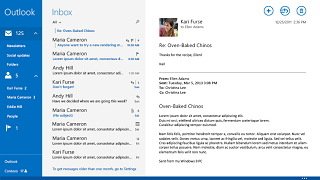

# Diretrizes da interface do usuário instrucional

Em algumas circunstâncias, pode ser útil ensinar o usuário sobre funções em seu aplicativo que podem não ser óbvias, como interações de toque específicas. Nesses casos, você precisa apresentar instruções para o usuário por meio da interface do usuário, para que ele possa usar esses recursos que talvez tenha ignorado.

## Quando usar a interface do usuário instrucional

A interface do usuário instrucional deve ser usada com cuidado. Quando usada em excesso, ela pode ser facilmente ignorada ou incomodar o usuário, tornando-se ineficaz.

A interface do usuário instrucional deve ser usada para ajudar o usuário a descobrir recursos importantes de seu aplicativo que não são óbvios, como gestos de toque ou configurações nos quais ele podem estar interessados. Também pode ser usada para informar os usuários sobre novos recursos ou alterações em seu aplicativo que, de outra maneira, podem ser ignorados.

A menos que seu aplicativo dependa de gestos de toque, interface do usuário instrucional não deve ser usada para ensinar os usuários os recursos fundamentais do seu aplicativo.

## Princípios de escrita da interface do usuário instrucional

Uma boa interface do usuário instrucional é relevante e educativa para o usuário e melhora a experiência do usuário. Ela deve ser:

-   **Simples:** os usuários não querem que sua experiência seja interrompida com informações complicadas
-   **Memorável:** os usuários não querem ver as mesmas instruções toda vez que tentarem executar uma tarefa, portanto, as instruções precisam ser algo de que se lembrarão.
-   **Imediatamente relevantes:** se a interface do usuário instrucional não ensinar um usuário sobre algo que ele deseja fazer imediatamente, ele não terá motivo para prestar atenção a ela.

Evite o uso excessivo de interface do usuário instrucional e certifique-se de escolher os tópicos certos. Não ensine:

-   **Recursos fundamentais:** se um usuário precisar de instruções para usar seu aplicativo, considere tornar o design do aplicativo mais intuitivo.
-   **Recursos óbvios:** se um usuário pode descobrir um recurso por conta própria sem instrução, a interface do usuário instrucional simplesmente só atrapalhará.
-   **Recursos complexos:** a interface do usuário instrucional deve ser concisa, e os usuários interessados em recursos complexos geralmente estarão dispostos a buscar instruções e não precisam que elas sejam fornecidas a eles.

Evite ser inconveniente para o usuário com sua interface do usuário instrucional. Não:

-   **Obscureça informações importantes:** a interface do usuário instrucional nunca deve atrapalhar outros recursos de seu aplicativo.
-   **Force os usuários a participar:** os usuários devem conseguir ignorar a interface do usuário instrucional e ainda usar bem o aplicativo.
-   **Exibindo informações repetidas:** não assedie o usuário com a interface do usuário instrucional, mesmo que ele a ignore na primeira vez. Adicionar uma configuração para exibir a interface do usuário instrucional novamente é a melhor solução.

## Exemplos de interface do usuário instrucional

Estas são algumas situações nas quais a interface do usuário instrucional pode ajudar seus usuários a aprender:

-   **Ajudando os usuários a descobrir interações por toque.** A captura de tela a seguir mostra uma interface do usuário instrucional ensinando um jogador a usar gestos de touch no jogo Cut the Rope.

    

-   **Causando uma ótima primeira impressão.** Quando o Editor de Vídeos é iniciado pela primeira vez, a interface do usuário instrucional solicita que o usuário comece a criar vídeos sem obstruir sua experiência.

    

-   **Orientando o usuário a realizar a próxima etapa de uma tarefa complicada.** No aplicativo Windows Mail, uma dica na parte inferior da Caixa de Entrada direciona os usuários até as **Configurações** para acessar mensagens mais antigas.

    

    Quando o usuário clica na mensagem, o submenu **Configurações** do aplicativo aparece no lado direito da tela, permitindo a conclusão da tarefa. Estas capturas de tela mostram o aplicativo Mail antes e depois de um usuário clicar na mensagem da interface do usuário instrucional.

    | Antes                                                               | Depois                                                                                                        |
    |----------------------------------------------------------------------|--------------------------------------------------------------------------------------------------------------|
    |  |  |

## Artigos relacionados

* [Diretrizes da ajuda do aplicativo](guidelines-for-app-help.md)

<!--HONumber=Jun16_HO4-->

