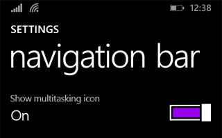
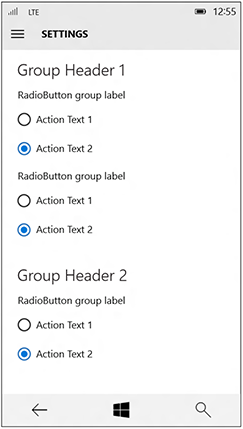

# Diretrizes para configurações de aplicativos

Configurações do aplicativo são as partes de seu aplicativo personalizáveis pelo usuário e as partes dinâmicas na página de configurações do aplicativo. Por exemplo, as configurações do aplicativo em um aplicativo leitor de notícias podem permitir que o usuário especifique quais fontes de notícias exibir ou a quantidade de colunas a serem exibidas na tela, enquanto as configurações de um aplicativo de previsão do tempo podem permitir que o usuário escolha entre Celsius e Fahrenheit como a unidade padrão de medida. Este artigo descreve as práticas recomendadas para criar e exibir as configurações do aplicativo.

## Devo incluir uma página de configurações em meu aplicativo?

Aqui estão exemplos de opções do aplicativo que pertencem a uma página de configurações do aplicativo: 

-   Opções de configuração que afetam o comportamento do aplicativo e que não necessitam de reajuste frequente, como a seleção entre Celsius ou Fahrenheit como a unidade padrão de temperatura em um aplicativo de previsão do tempo, a alteração das configurações da conta do aplicativo de email, as configurações de notificações ou opções de acessibilidade.
-   Opções que dependem das preferências do usuário, como músicas, efeitos sonoros ou temas de cores.
-   Informações sobre o aplicativo que não são acessadas com frequência, como a política de privacidade, a ajuda, a versão do aplicativo ou as informações de direitos autorais.

Os comandos que fazem parte do fluxo de trabalho normal do aplicativo (por exemplo, alterar o tamanho do pincel em um aplicativo de desenho) não devem estar na página de configurações. Para saber mais sobre o posicionamento de comandos, consulte [Noções básicas de design de comandos](https://msdn.microsoft.com/library/windows/apps/dn958433).

## Recomendações gerais

-   Mantenha as páginas de configurações simples e utilize controles binários (ativar/desativar). Os [botões de alternância](../controls-and-patterns/toggles.md) geralmente são o melhor controle para uma configuração binária.
-   Para configurações que permitem aos usuários escolher um item em um conjunto de até cinco opções relacionadas mutuamente exclusivas, use [botões de opção](../controls-and-patterns/radio-button.md).
-   Crie um ponto de entrada para todas as configurações do aplicativo na página de configurações de seu aplicativo.
-   Mantenha suas configurações simples. Defina padrões inteligentes e mantenha o número de configurações em um mínimo.
-   Quando um usuário muda uma configuração, o aplicativo deve refletir essa mudança imediatamente.
-   Não inclua comandos que fazem parte do fluxo de trabalho comum do aplicativo.

## Ponto de entrada

A maneira como os usuários acessam a página de configurações do aplicativo deve ser baseada no layout do aplicativo.

**Painel de navegação**

Para um layout de painel de navegação, as configurações do aplicativo devem ser o último item na lista de opções de navegação e serem fixadas na parte inferior:

**Barra de aplicativos**

Se você estiver usando uma barra de aplicativos ou uma barra de ferramentas, que normalmente faça parte de um layout de navegação de Hub ou de guias/pivôs, coloque o último item do ponto de entrada no menu do submenu "Mais". Se for importante para o aplicativo ter maior capacidade de descoberta do ponto de entrada de configurações, coloque-o diretamente na barra de aplicativos, e não no menu do submenu "Mais".

**Hub**

Se você estiver usando um layout de Hub, o ponto de entrada de configurações do aplicativo deve ser colocado no menu do submenu "Mais" de uma barra de aplicativos.

**Guias/pivôs**

Para um layout de guias ou pivôs, não recomendamos colocar o ponto de entrada das configurações do aplicativo como um dos primeiros itens da navegação. Em vez disso, o ponto de entrada das configurações do aplicativo deve ser colocado no menu do submenu "Mais" de uma barra de aplicativos.

**Mestre/detalhes**

Em vez de esconder totalmente o ponto de entrada das configurações do aplicativo em um painel de detalhes mestres, faça com que ele seja o último item fixado no nível superior do painel mestre.

## Layout

Tanto na área de trabalho quanto no celular, a janela de configurações do aplicativo deve ser aberta em tela inteira e preencher toda a janela. Se o menu de configurações do aplicativo tiver até quatro grupos de nível superior, esses grupos deverão estar em uma coluna de cascata para baixo.

Área de trabalho:

Celular:

## Seção "Sobre" e botão "Fornecer comentários"

Se você precisar de uma seção "Sobre este aplicativo" em seu aplicativo, crie uma página de configurações do aplicativo dedicada a isso. Se você desejar um botão "Fornecer comentários", coloque-o na parte inferior da página "Sobre este aplicativo".

"Termos de uso" e "Política de privacidade" devem ser [botões de hiperlink](../controls-and-patterns/hyperlinks.md) com texto de encapsulamento.

## Recomendações

## Conteúdo da página de configurações do aplicativo

Assim que você tiver uma lista de itens que deseja incluir na página de configurações do aplicativo, considere estas diretrizes:

-   Agrupe configurações semelhantes ou relacionadas em um rótulo de configurações.
-   Tente manter o número total de configurações em um máximo de quatro ou cinco.
-   Exiba as mesmas configurações, independentemente do contexto do aplicativo. Se algumas configurações não forem relevantes em determinado contexto, desabilite-as no submenu Configurações do aplicativo.
-   Use rótulos descritivos de uma palavra para configurações. Por exemplo, chame a configuração de "Contas" em vez de "Configurações de contas" para configurações relacionadas a contas. Se você deseja somente uma opção para as configurações e elas não permitirem um rótulo descritivo, use "Opções" ou "Padrões".
-   Se uma configuração se vincular diretamente à Web e não a um submenu, informe isso ao usuário com uma dica visual, como "Ajuda (online)" ou "Fóruns na Web" formatada como um [hiperlink](../controls-and-patterns/hyperlinks.md). Procure agrupar vários links para a Web em um submenu com uma única configuração. Por exemplo, uma configuração"Sobre" pode abrir um submenu com links para os termos de uso, a política de privacidade e o suporte do aplicativo.
-   Combine configurações menos utilizadas em uma única entrada para que as configurações mais comuns possam ter sua própria entrada. Coloque conteúdo ou links que incluam somente informações em uma configuração "Sobre".
-   Não duplique a funcionalidade no painel "Permissões". O Windows fornece esse painel por padrão e não é possível modificá-lo.

##  Adicionar conteúdo de configurações a submenus Configurações

-   Apresente o conteúdo de cima para baixo em uma única coluna, com rolagem, se necessário. Limite a rolagem para no máximo de duas vezes a altura da tela.
-   Use os seguintes controles para configurações do aplicativo:

    -   [Botões de alternância](../controls-and-patterns/toggles.md): para permitir que os usuários definam valores como "ativado" ou "desativado".
    -   [Botões de opção](../controls-and-patterns/radio-button.md): para permitir que os usuários escolham um item de um conjunto de até cinco opções relacionadas exclusivas.
    -   [Caixa de entrada de texto](../controls-and-patterns/text-block.md): para permitir que os usuários insiram texto. Use o tipo da caixa de entrada de texto que corresponde ao tipo de texto que você está obtendo do usuário, como um email ou senha.
    -   [Hiperlinks](../controls-and-patterns/hyperlinks.md): para conduzir o usuário para outra página dentro do aplicativo ou para um site externo. Quando um usuário clicar em um hiperlink, o submenu Configurações será ignorado.
    -   [Botões](../controls-and-patterns/buttons.md): para permitir que os usuários iniciem uma ação imediata sem ignorar o submenu Configurações atual.
-   Adicione uma mensagem descritiva se um dos controles estiver desativado. Coloque esta mensagem acima do controle desativado.
-   Anime o conteúdo e os controles como um bloco único depois que o submenu Configurações e o cabeçalho forem animados. Anime o conteúdo usando a animação [**enterPage**](https://msdn.microsoft.com/library/windows/apps/br212672) ou [**EntranceThemeTransition**](https://msdn.microsoft.com/library/windows/apps/br210288) com um deslocamento à esquerda de 100px.
-   Use cabeçalhos de seção, parágrafos e rótulos para ajudar a organizar e esclarecer conteúdo, se necessário.
-   Se for necessário repetir configurações, use um nível adicional da interface do usuário ou um modelo expandir/recolher, mas evite hierarquias com mais de dois níveis. Por exemplo, um aplicativo de previsão do tempo que disponibiliza configurações por cidade pode listar as cidades e deixar que o usuário toque na cidade para abrir um novo submenu ou expandir para mostrar as opções de configurações.
-   Se o carregamento de controles ou de conteúdo da Web for demorado, use um controle de progresso indeterminado para indicar aos usuários que as informações estão sendo carregadas. Para obter mais informações, consulte [Diretrizes de controles de progresso](https://msdn.microsoft.com/library/windows/apps/hh465469).
-   Não use botões para navegação ou para confirmar alterações. Use hiperlinks para navegar para outras páginas e, em vez de usar um botão para confirmar as mudanças, salve-as automaticamente nas configurações do aplicativo quando um usuário ignorar o submenu Configurações.

\[Este artigo contém informações que são específicas aos aplicativos UWP (Plataforma Universal do Windows) e do Windows�10. Para obter as diretrizes do Windows�8.1, baixe o [PDF de diretrizes do Windows�8.1](https://go.microsoft.com/fwlink/p/?linkid=258743).\]

## Tópicos relacionados

* [Noções básicas de design de comandos](https://msdn.microsoft.com/library/windows/apps/dn958433)
* [Diretrizes para controles de progresso](https://msdn.microsoft.com/library/windows/apps/hh465469)
            
          
            **para desenvolvedores (XAML)**
* [Armazenar e recuperar dados de aplicativo](https://msdn.microsoft.com/library/windows/apps/mt299098)
* [
              **EntranceThemeTransition**
            ](https://msdn.microsoft.com/library/windows/apps/br210288) �

�

<!--HONumber=Jun16_HO4-->

