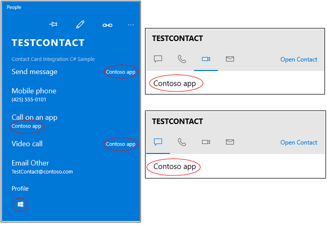

# <a name="connect-your-app-to-actions-on-a-contact-card"></a>Conectar seu app a ações em um cartão de contato

Seu aplicativo pode aparecer ao lado de ações em um cartão de contato ou um minicartão de contato. Os usuários podem escolher seu aplicativo para executar uma ação, como abrir uma página de perfil, fazer uma chamada ou enviar uma mensagem.



Para começar, localize os contatos existentes ou crie novos. Em seguida, crie uma *anotação* e algumas entradas de manifesto do pacote para descrever as ações que seu aplicativo aceita. Depois, escreva um código que execute as ações.

Para obter um exemplo mais completo, consulte o [Exemplo de integração com cartão de contato](https://github.com/Microsoft/Windows-universal-samples/tree/master/Samples/ContactCardIntegration).

## <a name="find-or-create-a-contact"></a>Localizar ou criar um contato

Se seu aplicativo ajuda as pessoas a interagir com outras pessoas, procure contatos no Windows e anote-os. Se seu aplicativo gerencia contatos, você pode adicioná-los a uma lista de contatos do Windows e anotá-los.

### <a name="find-a-contact"></a>Localizar um contato

Localize contatos por nome, endereço de email ou número de telefone.

```cs
ContactStore contactStore = await ContactManager.RequestStoreAsync();

IReadOnlyList<Contact> contacts = null;

contacts = await contactStore.FindContactsAsync(emailAddress);

Contact contact = contacts[0];
```

### <a name="create-a-contact"></a>Criar um contato

Se seu aplicativo for mais como uma agenda, crie contatos e depois adicione-os a uma lista de contatos.

```cs
Contact contact = new Contact();
contact.FirstName = "TestContact";

ContactEmail email = new ContactEmail();
email.Address = "TestContact@contoso.com";
email.Kind = ContactEmailKind.Other;
contact.Emails.Add(email);

ContactPhone phone = new ContactPhone();
phone.Number = "4255550101";
phone.Kind = ContactPhoneKind.Mobile;
contact.Phones.Add(phone);

ContactStore store = await
    ContactManager.RequestStoreAsync(ContactStoreAccessType.AppContactsReadWrite);

ContactList contactList;

IReadOnlyList<ContactList> contactLists = await store.FindContactListsAsync();

if (0 == contactLists.Count)
    contactList = await store.CreateContactListAsync("TestContactList");
else
    contactList = contactLists[0];

await contactList.SaveContactAsync(contact);

```

## <a name="tag-each-contact-with-an-annotation"></a>Marcar cada contato com uma anotação

Marque cada contato com uma lista de ações (operações) que seu aplicativo pode executar (por exemplo: chamadas de vídeo e mensagens).

Em seguida, associe a ID de um contato a uma ID que seu aplicativo usa internamente para identificar esse usuário.

```cs
ContactAnnotationStore annotationStore = await
   ContactManager.RequestAnnotationStoreAsync(ContactAnnotationStoreAccessType.AppAnnotationsReadWrite);

ContactAnnotationList annotationList;

IReadOnlyList<ContactAnnotationList> annotationLists = await annotationStore.FindAnnotationListsAsync();
if (0 == annotationLists.Count)
    annotationList = await annotationStore.CreateAnnotationListAsync();
else
    annotationList = annotationLists[0];

ContactAnnotation annotation = new ContactAnnotation();
annotation.ContactId = contact.Id;
annotation.RemoteId = "user22";

annotation.SupportedOperations = ContactAnnotationOperations.Message |
  ContactAnnotationOperations.AudioCall |
  ContactAnnotationOperations.VideoCall |
 ContactAnnotationOperations.ContactProfile;

await annotationList.TrySaveAnnotationAsync(annotation);
```

## <a name="register-for-each-operation"></a>Registrar para cada operação

No manifesto do pacote, registre-se para cada operação listada em sua anotação.

Registre adicionando manipuladores de protocolo ao elemento ``Extensions`` do manifesto.

```xml
<Extensions>
  <uap:Extension Category="windows.protocol">
    <uap:Protocol Name="ms-contact-profile">
      <uap:DisplayName>TestProfileApp</uap:DisplayName>
    </uap:Protocol>
  </uap:Extension>
  <uap:Extension Category="windows.protocol">
    <uap:Protocol Name="ms-ipmessaging">
      <uap:DisplayName>TestMsgApp</uap:DisplayName>
    </uap:Protocol>
  </uap:Extension>
  <uap:Extension Category="windows.protocol">
    <uap:Protocol Name="ms-voip-video">
      <uap:DisplayName>TestVideoApp</uap:DisplayName>
    </uap:Protocol>
  </uap:Extension>
  <uap:Extension Category="windows.protocol">
    <uap:Protocol Name="ms-voip-call">
      <uap:DisplayName>TestCallApp</uap:DisplayName>
    </uap:Protocol>
  </uap:Extension>
</Extensions>
```
Você também pode adicioná-los à guia **Declarações** do designer de manifesto no Visual Studio.


## <a name="find-your-app-next-to-actions-in-a-contact-card"></a>Localizar seu aplicativo ao lado de ações em um cartão de contato

Abra o aplicativo Pessoas. Seu aplicativo aparecerá ao lado de cada ação (operação) que você especificou na anotação e no manifesto do pacote.


Se o usuário escolher seu aplicativo para uma ação, ele aparecerá como o aplicativo padrão para essa ação na próxima vez que os usuários abrirem um cartão de contato.

## <a name="find-your-app-next-to-actions-in-a-mini-contact-card"></a>Localizar seu aplicativo ao lado de ações em um minicartão de contato

Nos minicartões de contato, seu aplicativo aparecerá em guias que representam ações.


Aplicativos como o **Email** abrem mincartões de contato. Seu aplicativo também pode abri-los. Este código mostra para você como fazer isso.

```cs
public async void OpenContactCard(object sender, RoutedEventArgs e)
{
    // Get the selection rect of the button pressed to show contact card.
    FrameworkElement element = (FrameworkElement)sender;

    Windows.UI.Xaml.Media.GeneralTransform buttonTransform = element.TransformToVisual(null);
    Windows.Foundation.Point point = buttonTransform.TransformPoint(new Windows.Foundation.Point());
    Windows.Foundation.Rect rect =
        new Windows.Foundation.Rect(point, new Windows.Foundation.Size(element.ActualWidth, element.ActualHeight));

   // helper method to find a contact just for illustrative purposes.
    Contact contact = await findContact("contoso@contoso.com");

    ContactManager.ShowContactCard(contact, rect, Windows.UI.Popups.Placement.Default);

}
```

Para ver mais exemplos com minicartões de contato, consulte o [Exemplo de cartões de contato](https://github.com/Microsoft/Windows-universal-samples/tree/master/Samples/ContactCards).

Assim como o cartão de contato, cada guia lembra o aplicativo que o usuário usou pela última vez para que seja fácil retornar ao seu aplicativo.

## <a name="perform-operations-when-users-select-your-app-in-a-contact-card"></a>Executar operações quando os usuários selecionam seu aplicativo em um cartão de contato

Substitua o método [Application.OnActivated](https://msdn.microsoft.com/library/windows/apps/br242330) em seu arquivo **App.cs** e direcione os usuários a uma página em seu aplicativo. O [Exemplo de integração de cartão de contato](https://github.com/Microsoft/Windows-universal-samples/tree/master/Samples/ContactCardIntegration) mostra uma maneira de fazer isso.

No arquivo code-behind da página, substitua o método [Page.OnNavigatedTo](https://msdn.microsoft.com/library/windows/apps/windows.ui.xaml.controls.page.onnavigatedto.aspx). O cartão de contato passa o nome da operação e a ID do usuário para esse método.

Para iniciar uma chamada de vídeo ou áudio, veja este exemplo: [Exemplo de VoIP](https://github.com/Microsoft/Windows-universal-samples/tree/master/Samples/VoIP). Você encontrará a API completa no namespace [WIndows.ApplicationModel.Calls](https://msdn.microsoft.com/library/windows/apps/windows.applicationmodel.calls.aspx).

Para facilitar a troca de mensagens, veja o namespace [Windows.ApplicationModel.Chat](https://msdn.microsoft.com/library/windows/apps/windows.applicationmodel.chat.aspx).

Você também pode iniciar outro aplicativo. É isso que este código faz.

```cs
protected override async void OnNavigatedTo(NavigationEventArgs e)
{
    base.OnNavigatedTo(e);

    var args = e.Parameter as ProtocolActivatedEventArgs;
    // Display the result of the protocol activation if we got here as a result of being activated for a protocol.

    if (args != null)
    {
        var options = new Windows.System.LauncherOptions();
        options.DisplayApplicationPicker = true;

        options.TargetApplicationPackageFamilyName = “ContosoApp”;

        string launchString = args.uri.Scheme + ":" + args.uri.Query;
        var launchUri = new Uri(launchString);
        await Windows.System.Launcher.LaunchUriAsync(launchUri, options);
    }
}
```

A propriedade ```args.uri.scheme``` contém o nome da operação, e a propriedade ```args.uri.Query``` contém a ID do usuário.
