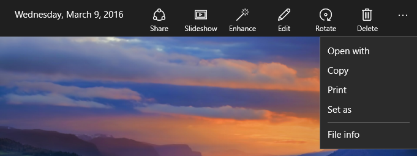
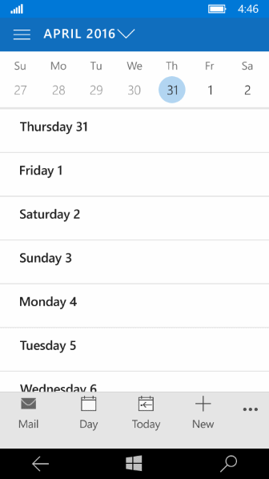
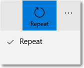

# Barra de aplicativos e barra de comandos

<link rel="stylesheet" href="https://az835927.vo.msecnd.net/sites/uwp/Resources/css/custom.css"> 

As barras de comandos (também conhecidas como "barras de aplicativos") dão aos usuários acesso fácil às tarefas mais comuns do aplicativo e podem ser usadas para mostrar comandos ou opções específicas ao contexto do usuário, como uma seleção de fotos ou o modo de desenho. Elas também podem ser usadas para navegação entre páginas ou seções do aplicativo. As barras de comandos podem ser usadas com qualquer padrão de navegação.


<div class="important-apis" >
<b>APIs importantes</b><br/>
<ul>
<li><a href="https://msdn.microsoft.com/library/windows/apps/windows.ui.xaml.controls.commandbar.aspx"><strong>CommandBar</strong></a></li>
<li><a href="https://msdn.microsoft.com/library/windows/apps/windows.ui.xaml.controls.appbarbutton.aspx"><strong>AppBarButton</strong></a></li>
<li><a href="https://msdn.microsoft.com/library/windows/apps/windows.ui.xaml.controls.appbartogglebutton.aspx"><strong>AppBarToggleButton</strong></a></li>
<li><a href="https://msdn.microsoft.com/library/windows/apps/windows.ui.xaml.controls.appbarseparator.aspx"><strong>AppBarSeparator</strong></a></li>
</ul>

</div>
</div>


## Este é o controle correto?

O controle CommandBar é um controle de finalidade geral, flexível e leve que pode exibir conteúdo complexo, como imagens ou blocos de texto, e comandos simples, como os controles [AppBarButton](https://msdn.microsoft.com/library/windows/apps/windows.ui.xaml.controls.appbarbutton.aspx), [AppBarToggleButton](https://msdn.microsoft.com/library/windows/apps/windows.ui.xaml.controls.appbartogglebutton.aspx) e [AppBarSeparator](https://msdn.microsoft.com/library/windows/apps/windows.ui.xaml.controls.appbarseparator.aspx).

XAML fornece os controles AppBar e CommandBar. Use AppBar somente quando você estiver atualizando um aplicativo Universal do Windows 8 que usa AppBar e precisar minimizar as alterações. Para novos aplicativos no Windows 10, recomendamos usar o controle CommandBar. Este documento pressupõe que você está usando o controle CommandBar.

## Exemplos
Uma barra de comandos expandida no aplicativo Fotos da Microsoft.



Uma barra de comandos no calendário do Outlook no Windows Phone.



## Anatomia

Por padrão, a barra de comandos mostra uma linha de botões de ícones e um botão "veja mais" opcional, que é representado por um sinal de reticências \[•••\]. Esta é a barra de comandos criada pelo código de exemplo mostrado mais adiante. Ela é mostrada em seu estado fechado e compacto.


A barra de comandos também pode ser mostrada em um estado fechado e minimizado com a seguinte aparência. Consulte a seção [Estados abertos e fechados](#open-and-closed-states) para obter mais informações.


Esta é a mesma barra de comandos em seu estado aberto. Os rótulos identificam as principais partes do controle.


A barra de comandos é dividida em 4 áreas principais:
- O botão "veja mais" \[•••\] é mostrado à direita da barra. Pressionar o botão "veja mais" \[•••\] tem 2 efeitos: revela os rótulos dos botões de comandos principais e abre o menu de estouro se quaisquer comandos secundários estiverem presentes. No SDK mais novo, o botão não ficará visível quando não houver comandos secundários nem rótulos ocultos. A propriedade [**OverflowButtonVisibility**](https://msdn.microsoft.com/library/windows/apps/windows.ui.xaml.controls.commandbar.overflowbuttonvisibility.aspx) permite que os aplicativos alterem esse comportamento de se ocultar automaticamente por padrão.
- A área de conteúdo está alinhada à esquerda da barra. Ela será mostrada se a propriedade [**Content**](https://msdn.microsoft.com/library/windows/apps/xaml/windows.ui.xaml.controls.contentcontrol.content.aspx) estiver preenchida.
- A área de comando principal está alinhada à direita da barra, próxima ao botão "veja mais" \[•••\]. Ela será mostrada se a propriedade [**PrimaryCommands**](https://msdn.microsoft.com/library/windows/apps/xaml/windows.ui.xaml.controls.commandbar.primarycommands.aspx) estiver preenchida.  
- O menu de estouro é mostrado somente quando a barra de comandos está aberta e a propriedade [**SecondaryCommands**](https://msdn.microsoft.com/library/windows/apps/xaml/windows.ui.xaml.controls.commandbar.secondarycommands.aspx) está preenchida. O novo comportamento de estouro dinâmico moverá automaticamente comandos principais para a área SecondaryCommands quando espaço é limitado.

O layout é invertido quando [FlowDirection](https://msdn.microsoft.com/library/windows/apps/windows.ui.xaml.frameworkelement.flowdirection.aspx) é **RightToLeft**.

## Criar uma barra de comandos
Este exemplo cria a barra de comandos mostrada anteriormente.

```xaml
<CommandBar>
    <AppBarToggleButton Icon="Shuffle" Label="Shuffle" Click="AppBarButton_Click" />
    <AppBarToggleButton Icon="RepeatAll" Label="Repeat" Click="AppBarButton_Click"/>
    <AppBarSeparator/>
    <AppBarButton Icon="Back" Label="Back" Click="AppBarButton_Click"/>
    <AppBarButton Icon="Stop" Label="Stop" Click="AppBarButton_Click"/>
    <AppBarButton Icon="Play" Label="Play" Click="AppBarButton_Click"/>
    <AppBarButton Icon="Forward" Label="Forward" Click="AppBarButton_Click"/>

    <CommandBar.SecondaryCommands>
        <AppBarButton Icon="Like" Label="Like" Click="AppBarButton_Click"/>
        <AppBarButton Icon="Dislike" Label="Dislike" Click="AppBarButton_Click"/>
    </CommandBar.SecondaryCommands>

    <CommandBar.Content>
        <TextBlock Text="Now playing..." Margin="12,14"/>
    </CommandBar.Content>
</CommandBar>
```

## Comandos e conteúdo
O controle CommandBar tem 3 propriedades que você pode usar para adicionar comandos e conteúdo: [**PrimaryCommands**](https://msdn.microsoft.com/library/windows/apps/xaml/windows.ui.xaml.controls.commandbar.primarycommands.aspx), [**SecondaryCommands**](https://msdn.microsoft.com/library/windows/apps/xaml/windows.ui.xaml.controls.commandbar.secondarycommands.aspx) e [**Content**](https://msdn.microsoft.com/library/windows/apps/xaml/windows.ui.xaml.controls.contentcontrol.content.aspx).


### Ações principais e estouro

Por padrão, os itens que você adiciona à barra de comandos são incluídos na coleção **PrimaryCommands**. Esses comandos são mostrados à esquerda do botão "veja mais" \[•••\], no que chamamos de espaço de ação. Coloque os comandos mais importantes, ou seja, aqueles que você deseja que permaneçam visíveis na barra, no espaço de ação. Nas telas menores (largura de 320 epx), um máximo de 4 itens caberá no espaço de ação da barra de comandos.

Você pode adicionar comandos à coleção **SecondaryCommands**, mas esses itens serão mostrados na área de excedentes. Coloque comandos menos importantes dentro da área de excedentes.

A área de excedentes padrão é estilizada para ser distinta da barra. Você pode ajustar o estilo definindo a propriedade [**CommandBarOverflowPresenterStyle**](https://msdn.microsoft.com/library/windows/apps/xaml/windows.ui.xaml.controls.commandbar.commandbaroverflowpresenterstyle.aspx) para um [estilo](https://msdn.microsoft.com/library/windows/apps/xaml/windows.ui.xaml.style.aspx) cujo destino seja [**CommandBarOverflowPresenter**](https://msdn.microsoft.com/library/windows/apps/xaml/windows.ui.xaml.controls.commandbaroverflowpresenter.aspx).

Você pode mover programaticamente comandos entre PrimaryCommands e SecondaryCommands conforme necessário. 

### Botões da barra de aplicativos

PrimaryCommands e SecondaryCommands podem ser preenchidos somente com os elementos de comando [**AppBarButton**](https://msdn.microsoft.com/library/windows/apps/xaml/windows.ui.xaml.controls.appbarbutton.aspx), [**AppBarToggleButton**](https://msdn.microsoft.com/library/windows/apps/xaml/windows.ui.xaml.controls.appbartogglebutton.aspx) e [**AppBarSeparator**](https://msdn.microsoft.com/library/windows/apps/xaml/windows.ui.xaml.controls.appbarseparator.aspx). Esses controles são otimizados para uso em uma barra de comandos, e sua aparência muda se o controle é usado no espaço de ação ou na área de excedentes.

Os controles de botão da barra de aplicativos são caracterizados por um ícone e um rótulo associado. Eles têm dois tamanhos: normal e compacto. Por padrão, o rótulo de texto é mostrado. Quando a propriedade [**IsCompact**](https://msdn.microsoft.com/library/windows/apps/xaml/windows.ui.xaml.controls.appbarbutton.iscompact.aspx) é definida como **true**, o rótulo de texto fica oculto. Quando usada em um controle CommandBar, a barra de comandos sobrescreve automaticamente a propriedade IsCompact do botão, conforme a barra de comandos é aberta ou fechada.

Para posicionar os rótulos dos botões da barra de aplicativos à direita do seus ícones, os aplicativos podem usar a nova propriedade [**DefaultLabelPosition**](https://msdn.microsoft.com/library/windows/apps/windows.ui.xaml.controls.commandbar.defaultlabelposition.aspx) do CommandBar.

```xaml
<CommandBar DefaultLabelPosition="Right">
    <AppBarToggleButton Icon="Shuffle" Label="Shuffle"/>
    <AppBarToggleButton Icon="RepeatAll" Label="Repeat"/>
</CommandBar>
```

O trecho de código acima é semelhante ao seguinte quando desenhado por um aplicativo.


Os botões individuais da barra de aplicativos não podem mover a posição de seu rótulo, isso deve ser feito na barra de comandos como um todo. Os botões da barra de aplicativos podem especificar que os rótulos jamais sejam mostrados definindo-se a nova propriedade [**LabelPosition**](https://msdn.microsoft.com/library/windows/apps/mt710920.aspx) como **Collapsed**. É recomendável limitar o uso dessa configuração para iconografia universalmente reconhecível como '+'.

Quando você colocar um botão de barra de aplicativos no menu de estouro (SecondaryCommands), ela será mostrada como somente texto. A **LabelPosition** dos botões da barra de aplicativos no estouro será ignorada. Este é o mesmo botão de alternância de barra de aplicativos mostrado no espaço de ação como um comando principal (superior) e na área de excedentes como um comando secundário (inferior).



- *Se houver um comando que deva aparecer consistentemente em várias páginas, é melhor manter esse comando em um local consistente.*
- *Recomendamos colocar os comandos Aceitar, Sim e OK à esquerda de Rejeitar, Não e Cancelar. A consistência dá aos usuários a confiança para se movimentar no sistema e os ajuda a transferir seu conhecimento da navegação no aplicativo de um produto para outro.*

### Rótulos de botão

É recomendável manter os rótulos de botões da barra do aplicativo curtos, preferencialmente com uma única palavra. Rótulos mais longos posicionados abaixo do ícone de um botão da barra de aplicativos serão ajustados em várias linhas, aumentando assim a altura geral da barra de comandos aberta. Você pode incluir um caractere de hífen condicional (0x00AD) no texto de um rótulo para indicar o limite do caractere onde uma quebra de palavra deve ocorrer. Em XAML, isso é expresso usando-se uma sequência de escape, como esta:

```xaml
<AppBarButton Icon="Back" Label="Areally&#x00AD;longlabel"/>
```

Quando o rótulo quebra automaticamente no local indicado, ele tem esta aparência.


### Outros tipos de conteúdo

Você pode adicionar qualquer elemento XAML à área de conteúdo definindo a propriedade **Content**. Se quiser adicionar mais de um elemento, você precisa colocá-los em um contêiner de painel e tornar o painel o único filho da propriedade Content.

Quando há comandos principais e o conteúdo, os comandos principais têm precedência e poderão recortar o conteúdo. 

Quando [**ClosedDisplayMode**](https://msdn.microsoft.com/library/windows/apps/xaml/windows.ui.xaml.controls.appbar.closeddisplaymode.aspx) é **Compact**, o conteúdo poderá ser recortado se for maior do que o tamanho compacto da barra de comandos. Você deve tratar os eventos [**Opening**](https://msdn.microsoft.com/library/windows/apps/xaml/windows.ui.xaml.controls.appbar.opening.aspx) e [**Closed**](https://msdn.microsoft.com/library/windows/apps/xaml/windows.ui.xaml.controls.appbar.closed.aspx) para mostrar ou ocultar partes da interface do usuário na área de conteúdo para que eles não sejam recortados. Consulte a seção [Estados abertos e fechados](#open-and-closed-states) para obter mais informações.

## Estados abertos e fechados

A barra de comandos pode estar aberta ou fechada. Um usuário pode alternar entre esses estados pressionando o botão "veja mais" \[•••\]. Você pode alternar entre eles programaticamente definindo a propriedade [**IsOpen**](https://msdn.microsoft.com/library/windows/apps/xaml/windows.ui.xaml.controls.appbar.isopen.aspx). Quando abertos, os botões de comando principal são mostrados com rótulos de texto e o menu de estouro será aberto se comandos secundários estiverem presentes, como mostrado anteriormente.

Você pode usar os eventos [**Opening**](https://msdn.microsoft.com/library/windows/apps/xaml/windows.ui.xaml.controls.appbar.opening.aspx), [**Opened**](https://msdn.microsoft.com/library/windows/apps/xaml/windows.ui.xaml.controls.appbar.opened.aspx), [**Closing**](https://msdn.microsoft.com/library/windows/apps/xaml/windows.ui.xaml.controls.appbar.closing.aspx) e [**Closed**](https://msdn.microsoft.com/library/windows/apps/xaml/windows.ui.xaml.controls.appbar.closed.aspx) para responder à abertura ou ao fechamento da barra de comandos.  
- Os eventos Opening e Closing ocorrem antes de começar a animação de transição.
- Os eventos Opened e Closed ocorrem após a conclusão da transição.

Neste exemplo, os eventos Opening e Closing são usados para alterar a opacidade da barra de comandos. Quando a barra de comandos está fechada, ela é semitransparente para que o plano de fundo do aplicativo apareça. Quando a barra de comandos está aberta, ela se torna opaca para que o usuário possa se concentrar nos comandos.

```xaml
<CommandBar Opening="CommandBar_Opening"
            Closing="CommandBar_Closing">
    <AppBarButton Icon="Accept" Label="Accept"/>
    <AppBarButton Icon="Edit" Label="Edit"/>
    <AppBarButton Icon="Save" Label="Save"/>
    <AppBarButton Icon="Cancel" Label="Cancel"/>
</CommandBar>
```

```csharp
private void CommandBar_Opening(object sender, object e)
{
    CommandBar cb = sender as CommandBar;
    if (cb != null) cb.Background.Opacity = 1.0;
}

private void CommandBar_Closing(object sender, object e)
{
    CommandBar cb = sender as CommandBar;
    if (cb != null) cb.Background.Opacity = 0.5;
}

```

### ClosedDisplayMode

Você pode controlar como a barra de comandos é mostrada em seu estado fechado definindo a propriedade [**ClosedDisplayMode**](https://msdn.microsoft.com/library/windows/apps/xaml/windows.ui.xaml.controls.appbar.closeddisplaymode.aspx). Há 3 modos de exibição fechada à sua escolha:
- **Compact**: o modo padrão. Mostra o conteúdo, os ícones de comando principal sem rótulos e o botão "veja mais" \[•••\].
- **Minimal**: mostra apenas uma barra fina que age como o botão "veja mais" \[•••\]. O usuário pode pressionar em qualquer lugar na barra para abri-lo.
- **Hidden**: a barra de comandos não é mostrada quando está fechada. Isso pode ser útil para mostrar os comandos contextuais com uma barra de comandos embutida. Nesse caso, você deve abrir a barra de comandos programaticamente definindo a propriedade **IsOpen** ou alterando ClosedDisplayMode para **Minimal** ou **Compact**.

Aqui, uma barra de comandos é usada para manter os comandos de formatação simples para um [RichEditBox](https://msdn.microsoft.com/library/windows/apps/xaml/windows.ui.xaml.controls.richeditbox.aspx). Quando a caixa de edição não tiver foco, os comandos de formatação podem distrair o usuário, por isso eles ficam ocultos. Quando a caixa de edição está sendo usada, ClosedDisplayMode da barra de comando é alterado para Compact para que os comandos de formatação fiquem visíveis.

```xaml
<StackPanel Width="300"
            GotFocus="EditStackPanel_GotFocus"
            LostFocus="EditStackPanel_LostFocus">
    <CommandBar x:Name="FormattingCommandBar" ClosedDisplayMode="Hidden">
        <AppBarButton Icon="Bold" Label="Bold" ToolTipService.ToolTip="Bold"/>
        <AppBarButton Icon="Italic" Label="Italic" ToolTipService.ToolTip="Italic"/>
        <AppBarButton Icon="Underline" Label="Underline" ToolTipService.ToolTip="Underline"/>
    </CommandBar>
    <RichEditBox Height="200"/>
</StackPanel>
```

```csharp
private void EditStackPanel_GotFocus(object sender, RoutedEventArgs e)
{
    FormattingCommandBar.ClosedDisplayMode = AppBarClosedDisplayMode.Compact;
}

private void EditStackPanel_LostFocus(object sender, RoutedEventArgs e)
{
    FormattingCommandBar.ClosedDisplayMode = AppBarClosedDisplayMode.Hidden;
}
```

>**Observação**&nbsp;&nbsp;A implementação dos comandos de edição está fora do escopo deste exemplo. Para obter mais informações, consulte o artigo [RichEditBox](rich-edit-box.md).

Embora os modos Minimal e Hidden sejam úteis em algumas situações, tenha em mente que os usuários poderão ficar confusos se todas as ações foram ocultadas.

A alteração de ClosedDisplayMode para fornecer mais ou menos dicas para o usuário afeta o layout dos elementos ao redor. Em contraste, quando CommandBar faz a transição entre fechada e aberta, ela não afeta o layout dos outros elementos.

### IsSticky

Depois de aberta a barra de comandos, se o usuário interagir com o aplicativo em qualquer lugar fora do controle, por padrão, o menu de estouro será ignorado e os rótulos serão ocultados. Esse modo de fechamento é chamado de *light dismiss*. Você pode controlar como a barra é ignorada definindo a propriedade [**IsSticky**](https://msdn.microsoft.com/library/windows/apps/xaml/windows.ui.xaml.controls.appbar.issticky.aspx). Quando a barra é fixa (`IsSticky="true"`), ela não é fechada por um gesto de light dismiss. A barra permanece aberta até que o usuário pressione o botão "veja mais" \[•••\] ou selecionar um item de menu de estouro. Recomendamos evitar barras de comandos fixas porque elas não estão em conformidade com as expectativas dos usuários em relação a light dismiss.

## O que fazer e o que não fazer

### Colocação

As barras de comandos podem ser colocadas na parte superior da janela do aplicativo, na parte inferior da janela do aplicativo e embutidas.


-   Para dispositivos portáteis pequenos, recomendamos o posicionamento das barras de comandos na parte inferior da tela para fácil acessibilidade.
-   Em dispositivos com telas maiores, se você estiver colocando apenas uma barra de comandos, recomendamos colocá-la perto do topo da janela.
Use a API [**DiagonalSizeInInches**](https://msdn.microsoft.com/library/windows/apps/windows.graphics.display.displayinformation.diagonalsizeininches.aspx) para determinar o tamanho da tela física.

As barras de comandos podem ser posicionadas nas seguintes regiões da tela, em telas de exibição única (exemplo à esquerda) e em telas com várias exibições (exemplo à direita). As barras de comandos embutidas podem ser colocadas em qualquer lugar no espaço de ação.


>**Dispositivos de toque**: caso seja necessário que a barra de comandos fique visível para o usuário quando o teclado virtual ou o painel de entrada virtual (SIP) for exibido, você poderá atribuir a barra de comandos à propriedade [BottomAppBar](https://msdn.microsoft.com/library/windows/apps/windows.ui.xaml.controls.page.bottomappbar.aspx) de uma página e ela será movida para permanecer visível quando o SIP estiver presente. Caso contrário, você deve colocar a barra de comandos embutida e posicionada em relação ao conteúdo do aplicativo.

### Ações

Priorize as ações na barra de comandos de acordo com sua visibilidade.

-   Coloque os comandos mais importantes, aqueles que devem ficar visíveis na barra, nos primeiros slots do espaço de ação. Nas telas menores (largura de 320 epx), entre 2 e 4 itens devem caber no espaço de ação da barra de comandos, dependendo da outra interface do usuário na tela.
-   Coloque comandos menos importantes no espaço de ação da barra ou dentro dos primeiros slots da área de excedentes. Esses comandos estarão visíveis quando a barra tiver espaço suficiente na tela, mas entrarão no menu suspenso da área de estouro quando não houver espaço suficiente.
-   Coloque os comandos menos importantes dentro da área de excedentes. Esses comandos sempre aparecerão no menu suspenso.

Se houver um comando que deva aparecer consistentemente em várias páginas, é melhor manter esse comando em um local consistente. Recomendamos colocar os comandos Aceitar, Sim e OK à esquerda de Rejeitar, Não e Cancelar. A consistência dá aos usuários a confiança para se movimentar no sistema e os ajuda a transferir seu conhecimento da navegação no aplicativo de um produto para outro.

Embora seja possível colocar todas as ações dentro da área de estouro para que somente o botão "veja mais" \[•••\] esteja visível na barra de comandos, lembre-se de que a ocultação de todas as ações pode confundir os usuários.

### Submenus da barra de comandos

Considere agrupamentos lógicos dos comandos como, por exemplo, colocar Responder, Responder a Todos e Encaminhar em um menu Responder. Em geral, embora um botão da barra do aplicativo ative um único comando, ele também pode ser usado para mostrar um [**MenuFlyout**](https://msdn.microsoft.com/library/windows/apps/windows.ui.xaml.controls.menuflyout.aspx) ou um [**Flyout**](https://msdn.microsoft.com/library/windows/apps/windows.ui.xaml.controls.flyout.aspx) com conteúdo personalizado.


### Menu de estouro


-   O menu de estouro é representado pelo botão "veja mais" \[•••\], o ponto de entrada visível do menu. Ele fica à extrema direita da barra de ferramentas, ao lado das ações principais.
-   A área de estouro é alocada para ações que são usadas com menos frequência.
-   As ações podem alternar entre o espaço de ação principal e o menu de estouro nos pontos de interrupção. Você também pode designar ações para sempre permanecer no espaço de ação principal, independentemente do tamanho da tela ou da janela do aplicativo.
-   Ações usadas com pouca frequência podem permanecer no menu estouro de mesmo quando a barra de aplicativos é expandida em telas maiores.

## Capacidade de adaptação

-   O mesmo número de ações na barra de aplicativos deve ficar visível na orientação retrato e na paisagem, reduzindo a carga cognitiva do usuário. O número de ações disponíveis deve ser determinado pela largura do dispositivo na orientação retrato.
-   Em telas pequenas que provavelmente serão usadas com uma única mão, barras de aplicativo devem ser posicionadas perto da parte inferior da tela.
-   Em telas maiores, colocar barras de aplicativo mais próxima ao topo da janela as torna mais perceptíveis e detectáveis.
-   Direcionando pontos de interrupção, você pode mover ações para dentro e para fora do menu à medida que o tamanho da janela muda.
-   Direcionando a tela na diagonal, você pode modificar a posição da barra do aplicativo com base no tamanho de tela do dispositivo.
-   Considere mover os rótulos para a direita dos ícones de botões da barra de aplicativos para melhorar a legibilidade. Os rótulos na parte inferior exigem que os usuários abram a barra de comandos para revelar rótulos, enquanto os rótulos à direita ficam visíveis mesmo quando a barra de comandos é fechada. Essa otimização funciona bem em janelas maiores.

## Artigos relacionados

**Para designers**
[Noções básicas de design de comando para aplicativos UWP](../layout/commanding-basics.md)

**Para desenvolvedores (XAML)**
[**CommandBar**](https://msdn.microsoft.com/library/windows/apps/dn279427)


<!--HONumber=Aug16_HO3-->


