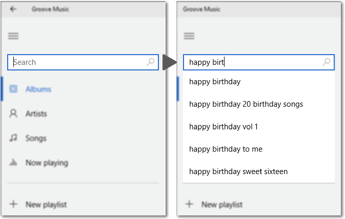
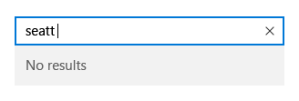

# Caixa de sugestão automática
Use uma AutoSuggestBox para fornecer uma lista de sugestões para um usuário selecionar conforme digita.


-   [**Classe AutoSuggestBox**](https://msdn.microsoft.com/library/windows/apps/xaml/windows.ui.xaml.controls.autosuggestbox.aspx)
-   [**Evento TextChanged**](https://msdn.microsoft.com/library/windows/apps/xaml/windows.ui.xaml.controls.autosuggestbox.textchanged.aspx)
-   [**Evento SuggestionChose**](https://msdn.microsoft.com/library/windows/apps/xaml/windows.ui.xaml.controls.autosuggestbox.suggestionchosen.aspx)
-   [**Evento QuerySubmitted**](https://msdn.microsoft.com/library/windows/apps/xaml/windows.ui.xaml.controls.autosuggestbox.querysubmitted.aspx)

## Este é o controle correto?

Se você quer um controle simples e personalizável que permita a pesquisa de texto com uma lista de sugestões, então escolha uma caixa de sugestão automática.

Para saber mais sobre como escolher o controle de texto certo, veja o artigo [Controles de texto](text-controls.md).

## Exemplos

Um caixa de sugestão automática no aplicativo Groove Música.



## Anatomia
O ponto de entrada para a caixa de sugestão automática consiste de um cabeçalho opcional e uma caixa de texto com texto de dica opcional:


A lista de resultados da sugestão automática é preenchida automaticamente depois que o usuário começa a inserir texto. A lista de resultados pode aparecer acima ou abaixo da caixa de entrada de texto. Um botão "limpar tudo" aparece:


## Criar uma caixa de sugestão automática

Para usar uma AutoSuggestBox, você precisa responder a três ações de usuário.

- Texto alterado - quando o usuário insere texto, atualiza a lista de sugestões.
- Sugestão escolhida – quando o usuário selecionar uma sugestão da lista, atualize a caixa de texto.
- Consulta enviada - quando o usuário envia uma consulta, mostra os resultados da consulta.

### Texto alterado

O evento [**TextChanged**](https://msdn.microsoft.com/library/windows/apps/xaml/windows.ui.xaml.controls.autosuggestbox.textchanged.aspx) ocorre sempre que o conteúdo da caixa de texto é atualizado. Use a propriedade [Reason](https://msdn.microsoft.com/library/windows/apps/xaml/windows.ui.xaml.controls.autosuggestboxtextchangedeventargs.reason.aspx) de argumentos de evento para determinar se a alteração foi causada por entrada de usuário. Se a razão da alteração for **UserInput**, filtre seus dados de acordo com a entrada. Depois, configure os dados filtrados como o [ItemsSource](https://msdn.microsoft.com/library/windows/apps/xaml/windows.ui.xaml.controls.itemscontrol.itemssource.aspx) da AutoSuggestBox, para atualizar a lista de sugestões.

Para controlar como os itens são exibidos na lista de sugestões, você pode usar [DisplayMemberPath](https://msdn.microsoft.com/library/windows/apps/xaml/windows.ui.xaml.controls.itemscontrol.displaymemberpath.aspx) ou [ItemTemplate](https://msdn.microsoft.com/library/windows/apps/xaml/windows.ui.xaml.controls.itemscontrol.itemtemplate.aspx).

- Para exibir o texto de uma única propriedade de seu item de dados, configure a propriedade DisplayMemberPath para escolher qual propriedade de seu objeto exibir na lista de sugestões.
- Para definir uma aparência personalizada para cada item na lista, use a propriedade ItemTemplate.

### Sugestão escolhida

Quando um usuário navega pela lista de sugestões usando o teclado, você precisa atualizar o texto na caixa de texto para corresponder.

Você pode configurar a propriedade [TextMemberPath](https://msdn.microsoft.com/library/windows/apps/xaml/windows.ui.xaml.controls.autosuggestbox.textmemberpath.aspx) para escolher qual propriedade de seu objeto de dados exibir na caixa de texto. Se você especificar um TextMemberPath, a caixa de texto será atualizada automaticamente. Geralmente, você deve especificar o mesmo valor para DisplayMemberPath e TextMemberPath, para que o texto seja o mesmo na lista de sugestões e na caixa de texto.

Se você precisa mostrar mais do que uma propriedade simples, manipule o evento [SuggestionChosen](https://msdn.microsoft.com/library/windows/apps/xaml/windows.ui.xaml.controls.autosuggestbox.suggestionchosen.aspx) para preencher a caixa de texto com texto personalizado com base no item selecionado.

### Consulta enviada

Manipule o evento [QuerySubmitted](https://msdn.microsoft.com/library/windows/apps/xaml/windows.ui.xaml.controls.autosuggestbox.querysubmitted.aspx) para executar uma ação de consulta adequada para seu aplicativo e mostre o resultado para o usuário.

O evento QuerySubmitted ocorre quando um usuário confirma uma cadeia de caracteres de consulta. O usuário pode confirmar uma consulta de uma das seguintes maneiras:
- Com o foco na caixa de texto, pressione Enter ou clique no ícone de consulta. A propriedade [ChosenSuggestion](https://msdn.microsoft.com/library/windows/apps/xaml/windows.ui.xaml.controls.autosuggestboxquerysubmittedeventargs.chosensuggestion.aspx) de argumentos de evento é **null**.
- Com o foco na lista de sugestões, pressione Enter, clique ou toque em um item. A propriedade ChosenSuggestion de argumentos de evento contém o item que foi selecionado da lista.

Em todos os casos, a propriedade [QueryText](https://msdn.microsoft.com/library/windows/apps/xaml/windows.ui.xaml.controls.autosuggestboxquerysubmittedeventargs.querytext.aspx) de argumentos de evento contém o texto da caixa de texto.

## Use a AutoSuggestBox para pesquisa

Use uma AutoSuggestBox para fornecer uma lista de sugestões para um usuário selecionar conforme digita.

Por padrão, a caixa de entrada de texto não tem um botão de consulta aparente. Você pode configurar a propriedade [QueryIcon](https://msdn.microsoft.com/library/windows/apps/xaml/windows.ui.xaml.controls.autosuggestbox.queryicon.aspx) para adicionar um botão com o ícone especificado no lado direito da caixa de texto. Por exemplo, para fazer com que a AutoSuggestBox se pareça com uma caixa de pesquisa típica, adicione um ícone de 'pesquisar' como este.

```xaml
<AutoSuggestBox QueryIcon="Find"/>
```

Aqui está uma AutoSuggestBox com um ícone de 'pesquisar'.


## Exemplos

Para ver exemplos práticos completos de AutoSuggestBox, consulte [AutoSuggestBox migration sample](http://go.microsoft.com/fwlink/p/?LinkId=619996) e [XAML UI Basics sample](http://go.microsoft.com/fwlink/p/?LinkId=619992).

Aqui está uma AutoSuggestBox simples com os manipuladores de evento exigidos.

```xaml
<AutoSuggestBox PlaceholderText="Search" QueryIcon="Find" Width="200"
                TextChanged="AutoSuggestBox_TextChanged"
                QuerySubmitted="AutoSuggestBox_QuerySubmitted"
                SuggestionChosen="AutoSuggestBox_SuggestionChosen"/>
```

```csharp
private void AutoSuggestBox_TextChanged(AutoSuggestBox sender, AutoSuggestBoxTextChangedEventArgs args)
{
    // Only get results when it was a user typing,
    // otherwise assume the value got filled in by TextMemberPath
    // or the handler for SuggestionChosen.
    if (args.Reason == AutoSuggestionBoxTextChangeReason.UserInput)
    {
        //Set the ItemsSource to be your filtered dataset
        //sender.ItemsSource = dataset;
    }
}


private void AutoSuggestBox_SuggestionChosen(AutoSuggestBox sender, AutoSuggestBoxSuggestionChosenEventArgs args)
{
    // Set sender.Text. You can use args.SelectedItem to build your text string.
}


private void AutoSuggestBox_QuerySubmitted(AutoSuggestBox sender, AutoSuggestBoxQuerySubmittedEventArgs args)
{
    if (args.ChosenSuggestion != null)
    {
        // User selected an item from the suggestion list, take an action on it here.
    }
    else
    {
        // Use args.QueryText to determine what to do.
    }
}
```

## O que fazer e o que não fazer

-   Quando for usar a caixa de sugestão automática para realizar pesquisas e não houver resultados de pesquisa para o texto inserido, exiba uma única linha "Nenhum resultado" como resultado, para que o usuário saiba que a solicitação de pesquisa executou:

    

{{> aside-internal content = "
## Lista de verificação de globalização e localização

<table>
<tr>
<th>Espaçamento vertical</th><td>Use caracteres não latinos para espaçamento vertical para garantir que scripts não latinos sejam exibidos corretamente, inclusive números.</td>
</tr>
<tr>
<th>Rolagem</th><td>Quando o texto de sugestão automática for selecionado, o usuário deverá ser capaz de rolar até o final da sequência.</td>
</tr>
</table>
"}}

## Artigos relacionados

- [Controles de texto](text-controls.md)
- [Verificação ortográfica](spell-checking-and-prediction.md)
- [Pesquisar](search.md)
- [**Classe TextBox**](https://msdn.microsoft.com/library/windows/apps/br209683)
- [**Classe Windows.UI.Xaml.Controls PasswordBox**](https://msdn.microsoft.com/library/windows/apps/br227519)
- [Propriedade String.Length](https://msdn.microsoft.com/library/system.string.length(v=vs.110).aspx)


<!--HONumber=Jun16_HO4-->


