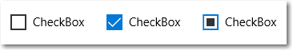
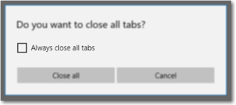
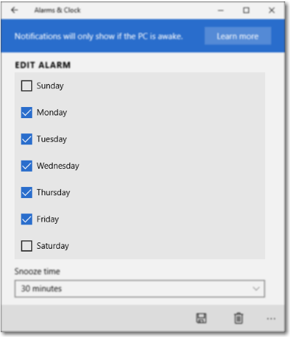
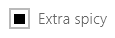

# Caixas de seleção

Uma caixa de seleção é usada para marcar ou desmarcar itens de ação. Ela pode ser usada para um único item ou para uma lista de vários itens que um usuário pode escolher. O controle possui três estados de seleção: não selecionado, selecionado e indeterminado. Use o estado indeterminado quando uma coleção de subopções tiver tanto o estado não selecionado quanto o estado selecionado.



<span class="sidebar_heading" style="font-weight: bold;">APIs importantes</span>
-   [**Classe CheckBox**](https://msdn.microsoft.com/library/windows/apps/br209316)
-   [**Evento Checked**](https://msdn.microsoft.com/library/windows/apps/windows.ui.xaml.controls.primitives.togglebutton.checked.aspx)
-   [**Propriedade IsChecked**](https://msdn.microsoft.com/library/windows/apps/windows.ui.xaml.controls.primitives.togglebutton.ischecked.aspx) 

## Este é o controle correto?

Use uma **única caixa de seleção** para uma opção de binário Sim/Não, como com um cenário de logon do tipo "Memorizar minhas informações?" ou com termos de um contrato de serviço.


Para uma opção binária, a principal diferença entre uma **caixa de seleção** e um **botão de alternância** é que a caixa de seleção serve para status, enquanto o botão de alternância serve para ação. Você pode atrasar a confirmação de uma interação de caixa de seleção (como parte do envio de um formulário, por exemplo), mas deve confirmar a interação do botão de alternância imediatamente. Além disso, apenas caixas de seleção permitem várias seleções.

Use **várias caixas de seleção** para cenários com seleções múltiplas em que um usuário escolhe um ou mais itens de um grupo de opções que não são mutuamente exclusivos.

Crie um grupo de caixas de seleção quando os usuários podem selecionar qualquer combinação de opções.


Quando opções podem ser agrupadas, você pode usar uma caixa de seleção indeterminada para representar o grupo inteiro. Use o estado indeterminate da caixa de seleção quando um usuário selecionar alguns subitens do grupo, mas não todos.


Ambos os controles de **caixa de seleção** e **botão de opção** permitem que o usuário selecione em uma lista de opções. Caixas de seleção permitem que o usuário selecione uma combinação de opções. Em contraste, botões de opção permitem que o usuário faça uma única escolha entre opções mutuamente exclusivas. Quando há mais de uma opção, mas apenas uma pode ser selecionada, use um botão de opção.

## Exemplos

Uma caixa de seleção em uma caixa de diálogo no navegador Microsoft Edge.



Caixas de seleção no aplicativo Alarmes e Relógio do Windows.



## Criar uma caixa de seleção

Para atribuir um rótulo à caixa de seleção, defina a propriedade [**Content**](https://msdn.microsoft.com/library/windows/apps/windows.ui.xaml.controls.contentcontrol.content.aspx). O rótulo é exibido perto da caixa de seleção.

Este XAML cria uma única caixa de seleção que é usada para aceitar os termos de serviço antes que um formulário possa ser enviado. 

```xaml
<CheckBox x:Name="termsOfServiceCheckBox" 
          Content="I agree to the terms of service."/>
```

Esta é a mesma caixa de seleção criada no código.

```csharp
CheckBox checkBox1 = new CheckBox();
checkBox1.Content = "I agree to the terms of service.";
```

### Associar a IsChecked

Use a propriedade [**IsChecked**](https://msdn.microsoft.com/library/windows/apps/windows.ui.xaml.controls.primitives.togglebutton.ischecked.aspx) para determinar se a caixa de seleção está marcada ou desmarcada. Você pode associar o valor da propriedade IsChecked a outro valor binário. No entanto, como IsChecked é um valor booliano [anulável](https://msdn.microsoft.com/library/windows/apps/b3h38hb0.aspx), você deve usar um conversor de valor para associá-la a um valor booliano.

Neste exemplo, a propriedade **IsChecked** da caixa de seleção para aceitar os termos de serviço está associada a [**IsEnabled**](https://msdn.microsoft.com/library/windows/apps/windows.ui.xaml.controls.control.isenabled.aspx) de um botão Enviar. O botão Enviar é habilitado apenas quando os termos de serviço são aceitos.

> Observação&nbsp;&nbsp;Mostramos apenas o código relevante aqui. Para saber mais sobre vinculação de dados e conversores de valor, consulte a [Visão geral da vinculação de dados](../data-binding/data-binding-quickstart.md).

```xaml
...
<Page.Resources>
    <local:NullableBooleanToBooleanConverter x:Key="NullableBooleanToBooleanConverter"/>
</Page.Resources>

...

<StackPanel Grid.Column="2" Margin="40">
    <CheckBox x:Name="termsOfServiceCheckBox" Content="I agree to the terms of service."/>
    <Button Content="Submit" 
            IsEnabled="{x:Bind termsOfServiceCheckBox.IsChecked, 
                        Converter={StaticResource NullableBooleanToBooleanConverter}, Mode=OneWay}"/>
</StackPanel>
```

```csharp
public class NullableBooleanToBooleanConverter : IValueConverter
{
    public object Convert(object value, Type targetType, object parameter, string language)
    {
        if (value is bool?)
        {
            return (bool)value;
        }
        return false;
    }

    public object ConvertBack(object value, Type targetType, object parameter, string language)
    {
        if (value is bool)
            return (bool)value;
        return false;
    }
}
```

### Manipular eventos Click e Checked

Para realizar uma ação quando o estado da caixa de seleção é alterado, você pode manipular o evento [**Click**](https://msdn.microsoft.com/library/windows/apps/windows.ui.xaml.controls.primitives.buttonbase.click.aspx) ou os eventos [**Checked**](https://msdn.microsoft.com/library/windows/apps/windows.ui.xaml.controls.primitives.togglebutton.checked.aspx) e [**Unchecked**](https://msdn.microsoft.com/library/windows/apps/windows.ui.xaml.controls.primitives.togglebutton.unchecked.aspx). 

O evento **Click** ocorre sempre que o estado marcado é modificado. Se você manipular o evento Click, use a propriedade **IsChecked** para determinar o estado da caixa de seleção.

Os eventos **Checked** e **Unchecked** ocorrem de maneira independente. Se você manipular esses eventos, deverá fazer isso em ambos para que eles respondam a mudanças de estado na caixa de seleção.

Nos exemplos a seguir, mostramos a manipulação do evento Click e dos eventos Checked e Unchecked. 

Várias caixas de seleção podem compartilhar o mesmo manipulador de eventos. Este exemplo cria quatro caixas de seleção para selecionar ingredientes de pizza. As quatro caixas de seleção compartilham o mesmo manipulador de eventos **Click** para atualizar a lista de ingredientes selecionados.

```XAML
<StackPanel Margin="40">
    <TextBlock Text="Pizza Toppings"/>
    <CheckBox Content="Pepperoni" x:Name="pepperoniCheckbox"
              Click="toppingsCheckbox_Click"/>
    <CheckBox Content="Beef" x:Name="beefCheckbox" 
              Click="toppingsCheckbox_Click"/>
    <CheckBox Content="Mushrooms" x:Name="mushroomsCheckbox"
              Click="toppingsCheckbox_Click"/>
    <CheckBox Content="Onions" x:Name="onionsCheckbox"
              Click="toppingsCheckbox_Click"/>

    <!-- Display the selected toppings. -->
    <TextBlock Text="Toppings selected:"/>
    <TextBlock x:Name="toppingsList"/>
</StackPanel>
```

Veja a seguir o manipulador de eventos para o evento Click. Sempre que uma caixa de seleção é clicada, ele examina as caixas de seleção para ver quais estão marcadas e atualizar a lista de ingredientes selecionados.

```csharp
private void toppingsCheckbox_Click(object sender, RoutedEventArgs e)
{
    string selectedToppingsText = string.Empty;
    CheckBox[] checkboxes = new CheckBox[] { pepperoniCheckbox, beefCheckbox,
                                             mushroomsCheckbox, onionsCheckbox };
    foreach (CheckBox c in checkboxes)
    {
        if (c.IsChecked == true)
        {
            if (selectedToppingsText.Length > 1)
            {
                selectedToppingsText += ", ";
            }
            selectedToppingsText += c.Content;
        }
    }
    toppingsList.Text = selectedToppingsText;
}
```

### Usar o estado indeterminado

O controle CheckBox herda de [ToggleButton](https://msdn.microsoft.com/library/windows/apps/windows.ui.xaml.controls.primitives.togglebutton.aspx) e pode ter três estados: 

Estado | Propriedade | Value
------|----------|------
marcado | IsChecked | **true** 
desmarcado | IsChecked | **false** 
indeterminado | IsChecked | **null** 

Para que a caixa de seleção para indique o estado indeterminado, você deve definir a propriedade [**IsThreeState**](https://msdn.microsoft.com/library/windows/apps/windows.ui.xaml.controls.primitives.togglebutton.isthreestate.aspx) como **true**. 

Quando opções podem ser agrupadas, você pode usar uma caixa de seleção indeterminada para representar o grupo inteiro. Use o estado indeterminate da caixa de seleção quando um usuário selecionar alguns subitens do grupo, mas não todos.

No exemplo a seguir, a caixa de seleção "Selecionar tudo" tem a propriedade IsThreeState definida como **true**. A caixa de seleção "Selecionar tudo" será marcada se todos os elementos filho forem marcadas, desmarcada se todos os elementos filho forem desmarcados e indeterminada em outros casos.

```xaml
<StackPanel>
    <CheckBox x:Name="OptionsAllCheckBox" Content="Select all" IsThreeState="True" 
              Checked="SelectAll_Checked" Unchecked="SelectAll_Unchecked" 
              Indeterminate="SelectAll_Indeterminate"/>
    <CheckBox x:Name="Option1CheckBox" Content="Option 1" Margin="24,0,0,0" 
              Checked="Option_Checked" Unchecked="Option_Unchecked" />
    <CheckBox x:Name="Option2CheckBox" Content="Option 2" Margin="24,0,0,0" 
              Checked="Option_Checked" Unchecked="Option_Unchecked" IsChecked="True"/>
    <CheckBox x:Name="Option3CheckBox" Content="Option 3" Margin="24,0,0,0"
              Checked="Option_Checked" Unchecked="Option_Unchecked" />
</StackPanel>
```

```csharp
private void Option_Checked(object sender, RoutedEventArgs e)
{
    SetCheckedState();
}

private void Option_Unchecked(object sender, RoutedEventArgs e)
{
    SetCheckedState();
}

private void SelectAll_Checked(object sender, RoutedEventArgs e)
{
    Option1CheckBox.IsChecked = Option2CheckBox.IsChecked = Option3CheckBox.IsChecked = true;
}

private void SelectAll_Unchecked(object sender, RoutedEventArgs e)
{
    Option1CheckBox.IsChecked = Option2CheckBox.IsChecked = Option3CheckBox.IsChecked = false;
}

private void SelectAll_Indeterminate(object sender, RoutedEventArgs e)
{
    // If the SelectAll box is checked (all options are selected), 
    // clicking the box will change it to its indeterminate state.
    // Instead, we want to uncheck all the boxes,
    // so we do this programatically. The indeterminate state should
    // only be set programatically, not by the user.

    if (Option1CheckBox.IsChecked == true &&
        Option2CheckBox.IsChecked == true &&
        Option3CheckBox.IsChecked == true)
    {
        // This will cause SelectAll_Unchecked to be executed, so
        // we don't need to uncheck the other boxes here.
        OptionsAllCheckBox.IsChecked = false;
    }
}

private void SetCheckedState()
{
    // Controls are null the first time this is called, so we just 
    // need to perform a null check on any one of the controls.
    if (Option1CheckBox != null)
    {
        if (Option1CheckBox.IsChecked == true &&
            Option2CheckBox.IsChecked == true &&
            Option3CheckBox.IsChecked == true)
        {
            OptionsAllCheckBox.IsChecked = true;
        }
        else if (Option1CheckBox.IsChecked == false &&
            Option2CheckBox.IsChecked == false &&
            Option3CheckBox.IsChecked == false)
        {
            OptionsAllCheckBox.IsChecked = false;
        }
        else
        {
            // Set third state (indeterminate) by setting IsChecked to null.
            OptionsAllCheckBox.IsChecked = null;
        }
    }
}
```

## O que fazer e o que não fazer

-   Verifique se a finalidade e o estado atual da caixa de seleção estão claros.
-   Limite o conteúdo do texto da caixa de seleção a no máximo duas linhas.
-   Formule o rótulo da caixa de seleção como uma afirmação de que a marca de seleção implica em verdadeiro, e a falta dela, em falso.
-   Use a fonte padrão, a menos que as diretrizes da marca o orientem de outra forma.
-   Se o conteúdo do texto for dinâmico, leve em consideração como o controle será redimensionado e o que acontecerá com a aparência ao seu redor.
-   Se houver duas ou mais opções mutuamente exclusivas para escolha, considere usar [botões de opção](radio-button.md).
-   Não coloque dois grupos de caixas de seleção próximos um do outro. Use rótulos para separar os grupos.
-   Não use uma caixa de seleção como controle ativar/desativar ou para executar um comando. Em vez disso, use um botão de alternância.
-   Não use uma caixa de seleção para exibir outros controles, como uma caixa de diálogo.
-   Use o estado indeterminado para indicar que uma opção está definida para algumas subopções, mas não todas.
-   Ao usar o estado indeterminado, use caixas de seleção subordinadas para mostrar as opções que estão e não estão selecionadas. Elabore a interface do usuário de forma que o usuário possa ver as subopções.
-   Não use o estado indeterminado para representar um terceiro estado. O estado indeterminado é usado para indicar que uma opção está definida para algumas subopções, mas não todas. Por isso, não permita que os usuários definam um estado indeterminado diretamente. Como um exemplo do que não fazer, esta caixa de seleção usa o estado indeterminado para indicar um tempero médio:

    

    Em vez disso, use um grupo de botões de opção com três opções: Não temperado, Temperado e Extra temperado.

    


## Artigos relacionados

-   [**Classe CheckBox**](https://msdn.microsoft.com/library/windows/apps/br209316) 


<!--HONumber=Jun16_HO3-->


