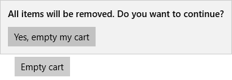

# <a name="dialogs-and-flyouts"></a>Caixas de diálogo e submenus

<link rel="stylesheet" href="https://az835927.vo.msecnd.net/sites/uwp/Resources/css/custom.css"> 

Caixas de diálogo e submenus são elementos transitórios da interface do usuário que aparecem quando acontece algo que requer notificação, aprovação ou informações adicionais do usuário.

<div class="important-apis" >
<b>APIs importantes</b><br/>
<ul>
<li>[Classe ContentDialog](https://msdn.microsoft.com/library/windows/apps/windows.ui.xaml.controls.contentdialog.aspx)</li>
<li>[Classe Flyout](https://msdn.microsoft.com/library/windows/apps/dn279496)</li>
</ul>
</div>


<div class="side-by-side">
<div class="side-by-side-content">
  <div class="side-by-side-content-left">
   <p><b>Caixas de diálogo</b> <br/><br/>
    </p>
<p>Caixas de diálogo são sobreposições de interface do usuário modais que fornecem informações contextuais do aplicativo. As caixas de diálogo bloqueiam interações com a janela do aplicativo até que sejam explicitamente ignoradas. Elas muitas vezes solicitam algum tipo de ação do usuário.   
</p><br/>

  </div>
  <div class="side-by-side-content-right">
   <p><b>Submenus</b> <br/><br/>
   </p>
<p>Um submenu é um pop-up contextual leve que exibe a interface do usuário relacionada ao que o usuário está fazendo. Ele inclui a lógica de colocação e dimensionamento, e pode ser usado para exibir um controle oculto, mostrar mais detalhes de um item ou pedir que o usuário confirme uma ação. 
</p><p>Ao contrário de uma caixa de diálogo, um submenu pode ser ignorado rapidamente tocando ou clicando em algum lugar fora do submenu, pressionando a tecla Escape ou botão Back, redimensionando a janela do aplicativo ou mudando a orientação do dispositivo.
</p><br/>

  </div>
</div>
</div>

## <a name="is-this-the-right-control"></a>Este é o controle correto?

* Use caixas de diálogo e submenus para notificar os usuários de informações importantes ou para solicitar a confirmação ou informações adicionais antes de uma ação ser concluída. 
* Não use um submenu no lugar de [tooltip](tooltips.md) ou [menu de contexto](menus.md). Use tooltip para mostrar uma breve descrição que fica oculta depois de um determinado tempo. Use um menu de contexto para ações contextuais relacionadas a um elemento da interface do usuário, como copiar e colar.  


Caixas de diálogo e submenus certificam-se de que os usuários estão cientes da informações importantes, mas eles também interrompem a experiência do usuário. Como caixas de diálogo são modais (bloqueando), elas interrompem os usuários, impedindo que façam algo até que interajam com a caixa. Submenus fornecem uma experiência menos desagradável, mas exibir muitos submenus pode ser uma decisão traiçoeira. 

Considere a importância das informações que você deseja compartilhar: é importante o suficiente para interromper o usuário? Considere também a frequência com que as informações precisam ser exibidas. Se você estiver mostrando uma caixa de diálogo ou notificação a cada poucos minutos, convém alocar espaço para essas informações na interface do usuário principal, em vez disso. Por exemplo, em um cliente de chat, em vez de mostrar um submenu sempre que um amigo entra, você pode exibir uma lista de amigos que estão online no momento e realçar amigos conforme eles entrarem. 

Caixas de diálogo e submenus são usados para confirmar uma ação (como excluir um arquivo) antes de executá-la. Se você espera que o usuário execute uma ação específica com frequência, considere fornecer uma maneira para que o usuário desfaça a ação se for um engano, em vez de forçar os usuários a confirmarem a ação toda vez. 


## <a name="dialogs-vs-flyouts"></a>Caixas de diálogo vs. submenus

Depois de determinar que você deseja usar uma caixa de diálogo ou menu suspenso, você precisa escolher qual usar. 

Considerando que as caixas de diálogo bloqueiam interações e os submenus não, as caixas de diálogo devem ser reservadas para situações em que você deseja que o usuário solte tudo para focar em uma informação específica ou responder a uma pergunta. Submenus, por outro lado, podem ser usados quando você deseja chamar a atenção para algo, mas terá problemas se o usuário desejar ignorá-lo. 

<div class="side-by-side">
<div class="side-by-side-content">
  <div class="side-by-side-content-left">
   <p><b>Use uma caixa de diálogo para...</b> <br/>
<ul>
<li>Expressar informações importantes que o usuário **deve** ler e confirmar antes de prosseguir. Os exemplos incluem:
<ul>
  <li>Quando a segurança do usuário pode ser comprometida</li>
  <li>Quando o usuário está prestes a alterar um ativo valioso de forma permanente</li>
  <li>Quando o usuário está prestes a excluir um ativo valioso</li>
  <li>Para confirmar uma compra no aplicativo</li>
</ul>

</li>
<li>Mensagens de erro que se aplicam ao contexto geral do aplicativo, como um erro de conectividade.</li>
<li>Perguntas, quando o aplicativo precisar fazer uma pergunta de bloqueio ao usuário, por exemplo, quando o aplicativo não puder escolher em nome do usuário. Uma pergunta de bloqueio não pode ser ignorada ou adiada e deve oferecer ao usuário opções bem-definidas.</li>
</ul> 
</p>
  </div>
  <div class="side-by-side-content-right">
   <p><b>Use um submenu para...</b> <br/>
<ul>
<li>Coletar informações adicionais necessárias para que uma ação possa ser concluída.</li>
<li>Exibir informações que são relevantes apenas algumas vezes. Por exemplo, em um aplicativo da galeria de fotos, quando o usuário clica em uma miniatura da imagem, você pode usar um submenu para exibir uma versão grande da imagem.</li>
<li>Avisos e confirmações, incluindo aqueles relacionados às ações potencialmente destrutivas.</li>
<li>Exibindo mais informações, como detalhes ou descrições mais longas de um item na página.</li>
</ul></p>
  </div>
</div>
</div>

<div class="microsoft-internal-note">
Os controles light dismiss prendem o foco do teclado ou gamepad dentro da interface do usuário transitória até serem ignorados. Para fornecer uma indicação visual para esse comportamento, os controles light dismiss no Xbox desenharão uma sobreposição que esmaece a visibilidade da interface do usuário fora do escopo. Esse comportamento pode ser modificado com a nova propriedade `LightDismissOverlayMode`. Por padrão, interfaces do usuário transitórias desenham a sobreposição light dismiss no Xbox, mas não em outras famílias de dispositivos, mas os aplicativos podem optar por forçar a sobreposição para estar sempre **Ativada** ou **Desativada**.

```xaml
<MenuFlyout LightDismissOverlayMode=\"Off\">
```
</div>

## <a name="dialogs"></a>Caixas de diálogo
### <a name="general-guidelines"></a>Diretrizes gerais

-   Identifique claramente o problema ou o objetivo do usuário na primeira linha do texto da caixa de diálogo.
-   O título da caixa de diálogo é a principal instrução e é opcional.
    -   Use um título curto para explicar o que as pessoas precisam fazer na caixa de diálogo. Títulos longos não terão quebra de linha e serão truncados.
    -   Se você está usando a caixa de diálogo para passar uma mensagem simples, de erro ou fazer uma pergunta, pode omitir o título. Utilize o texto do conteúdo para passar as informações principais.
    -   O título deve estar diretamente relacionado às opções de botão.
-   O conteúdo da caixa de diálogo contém o texto descritivo e é obrigatório.
    -   Apresente a mensagem, o erro ou a pergunta de bloqueio da maneira mais simples possível.
    -   Se um título da caixa de diálogo for usado, use a área de conteúdo para fornecer mais detalhes ou definir a terminologia. Não repita o título com palavras ligeiramente diferentes.
-   Pelo menos um botão da caixa de diálogo deve aparecer.
    -   Botões são o único mecanismo para que os usuários ignorem a caixa de diálogo.
    -   Use botões com texto que identifiquem respostas específicas para a instrução ou o conteúdo principal. Um exemplo é "Você permite que NomeDoAplicativo acesse o sua localização?", seguido pelos botões "Permitir" e "Bloquear". Respostas específicas podem ser entendidas mais rapidamente, resultando na tomada de decisão eficiente.
    - Apresente os botões de confirmação nesta ordem: 
        -   OK/[Faça]/Sim
        -   [Não faça]/Não
        -   Cancelar
        
        (onde [Faça] e [Não faça] são respostas específicas à instrução principal.)
   
-   Caixas de diálogo de erro exibem a mensagem de erro na caixa de diálogo, juntamente com quaisquer informações pertinentes. O único botão usado em uma caixa de diálogo de erro deve ser "Fechar" ou uma ação semelhante.
-   Não use caixas de diálogo para erros que são contextuais a um local específico da página, como erros de validação (em campos de senha, por exemplo). Use a própria tela do aplicativo para mostrar erros embutidos.

### <a name="confirmation-dialogs-okcancel"></a>Caixas de diálogo de confirmação (OK/Cancelar)
Uma caixa de diálogo de confirmação proporciona aos usuários a oportunidade de confirmar que desejam executar uma ação. Ele podem afirmar a ação, ou optar por cancelar.  
Uma caixa de diálogo de confirmação típica tem dois botões: um botão de afirmação ("OK") e um botão Cancelar.  

<ul>
    <li>
        <p>Em geral, o botão de afirmação fica à esquerda (o botão primário) e o botão Cancelar (o botão secundário) fica à direita.</p>
         
        
    </li>
    <li>Conforme observado na seção de recomendações gerais, use botões com texto que identifiquem respostas específicas para a instrução ou o conteúdo principal.
    </li>
</ul>

> Algumas plataformas colocam o botão de afirmação à direita em vez de à esquerda. Por que é recomendável colocá-lo no lado esquerdo?  Se você considerar que a maioria dos usuários é destra e eles seguram o telefone com essa mão, é realmente mais confortável pressionar o botão de afirmação quando ele está à esquerda, pois o botão tem mais chances de estar dentro do raio do polegar do usuário. Botões no lado direito da tela exigem que o usuário puxe o polegar para dentro para uma posição mais confortável.

### <a name="create-a-dialog"></a>Criar uma caixa de diálogo
Para criar uma caixa de diálogo, use a [classe ContentDialog](https://msdn.microsoft.com/library/windows/apps/windows.ui.xaml.controls.contentdialog.aspx). Você pode criar uma caixa de diálogo no código ou na marcação. Embora seja geralmente mais fácil definir os elementos de interface do usuário em XAML, no caso de uma caixa de diálogo simples, é realmente mais fácil usar apenas o código. Este exemplo cria uma caixa de diálogo para notificar o usuário que não há nenhuma conexão Wi-Fi e, em seguida, usa o método [ShowAsync](https://msdn.microsoft.com/en-us/library/windows/apps/windows.ui.xaml.controls.contentdialog.showasync.aspx) para exibi-la.

```csharp
private async void displayNoWifiDialog()
{
    ContentDialog noWifiDialog = new ContentDialog()
    {
        Title = "No wifi connection",
        Content = "Check connection and try again",
        PrimaryButtonText = "Ok"
    };

    ContentDialogResult result = await noWifiDialog.ShowAsync();
}
```

Quando o usuário clica em um botão de caixa de diálogo, o método [ShowAsync](https://msdn.microsoft.com/en-us/library/windows/apps/windows.ui.xaml.controls.contentdialog.showasync.aspx) retorna um [ContentDialogResult](https://msdn.microsoft.com/en-us/library/windows/apps/windows.ui.xaml.controls.contentdialogresult.aspx) para informar em qual botão o usuário clica. 

A caixa de diálogo neste exemplo faz uma pergunta e usa o [ContentDialogResult](https://msdn.microsoft.com/en-us/library/windows/apps/windows.ui.xaml.controls.contentdialogresult.aspx) retornado para determinar a resposta do usuário. 

```csharp
private async void displayDeleteFileDialog()
{
    ContentDialog deleteFileDialog = new ContentDialog()
    {
        Title = "Delete file permanently?",
        Content = "If you delete this file, you won't be able to recover it. Do you want to delete it?",
        PrimaryButtonText = "Delete",
        SecondaryButtonText = "Cancel"
    };

    ContentDialogResult result = await deleteFileDialog.ShowAsync();
    
    // Delete the file if the user clicked the primary button. 
    /// Otherwise, do nothing. 
    if (result == ContentDialogResult.Primary)
    {
        // Delete the file. 
    }
}
```

## <a name="flyouts"></a>Submenus
###  <a name="create-a-flyout"></a>Criar um submenu

Um submenu é um contêiner aberto que pode mostrar uma interface do usuário arbitrária como conteúdo. 

<div class="microsoft-internal-note">
Isso inclui submenus e menus de contexto, que podem ser aninhados dentro de outros submenus.
</div>

Submenus são anexados a controles específicos. Você pode usar a propriedade [Placement](https://msdn.microsoft.com/en-us/library/windows/apps/windows.ui.xaml.controls.primitives.flyoutbase.placement.aspx) para especificar onde o submenu aparece: parte superior, esquerda, inferior, direita ou inteira. Se você selecionar o [Modo de posicionamento completo](https://msdn.microsoft.com/en-us/library/windows/apps/windows.ui.xaml.controls.primitives.flyoutplacementmode.aspx), o aplicativo se estende o submenu e centraliza na janela do aplicativo. Quando visíveis, eles devem ser ancorados ao objeto de chamada e especificar sua posição relativa preferencial para o objeto: parte superior, esquerda, inferior ou direita. O submenu também tem um modo de posicionamento completo que tenta ampliá-lo e centralizá-lo dentro da janela do aplicativo. Alguns controles, como [Button](https://msdn.microsoft.com/library/windows/apps/windows.ui.xaml.controls.button.aspx), fornecem uma propriedade [Flyout](https://msdn.microsoft.com/library/windows/apps/windows.ui.xaml.controls.button.flyout.aspx) que você pode usar para associar um submenu. 

Este exemplo cria um submenu simples que exibe algum texto quando o botão é pressionado. 
````xaml
<Button Content="Click me">
  <Button.Flyout>
     <Flyout>
        <TextBlock Text="This is a flyout!"/>
     </Flyout>
  </Button.Flyout>
</Button>
````

Se o controle não tem uma propriedade flyout, você pode usar a propriedade [Flyoutbase](https://msdn.microsoft.com/en-us/library/windows/apps/windows.ui.xaml.controls.primitives.flyoutbase.attachedflyout.aspx) anexada em vez disso. Quando você fizer isso, você também precisará chamar o método [Showattachedflyout](https://msdn.microsoft.com/en-us/library/windows/apps/windows.ui.xaml.controls.primitives.flyoutbase.showattachedflyout) para mostrar o submenu. 

Este exemplo adiciona um submenu simples a uma imagem. Quando o usuário toca na imagem, o aplicativo mostra o submenu. 

````xaml
<Image Source="Assets/cliff.jpg" Width="50" Height="50" 
  Margin="10" Tapped="Image_Tapped">
  <FlyoutBase.AttachedFlyout>
    <Flyout>
      <TextBlock TextWrapping="Wrap" Text="This is some text in a flyout."  />
    </Flyout>        
  </FlyoutBase.AttachedFlyout>
</Image>
````

````csharp
private void Image_Tapped(object sender, TappedRoutedEventArgs e)
{
    FlyoutBase.ShowAttachedFlyout((FrameworkElement)sender);
}
````

Os exemplos anteriores definiram seus submenus embutido. Você pode também definir um submenu como um recurso estático e, em seguida, usá-lo com vários elementos. Este exemplo cria um submenu mais complicado que exibe uma versão maior de uma imagem quando sua miniatura é tocada. 

````xaml
<!-- Declare the shared flyout as a resource. -->
<Page.Resources>
    <Flyout x:Key="ImagePreviewFlyout" Placement="Right">
        <!-- The flyout's DataContext must be the Image Source 
             of the image the flyout is attached to. -->
        <Image Source="{Binding Path=Source}" 
            MaxHeight="400" MaxWidth="400" Stretch="Uniform"/>
        <Flyout.FlyoutPresenterStyle>
            <Style TargetType="FlyoutPresenter">
                <Setter Property="ScrollViewer.ZoomMode" Value="Enabled"/>
                <Setter Property="Background" Value="Black"/>
                <Setter Property="BorderBrush" Value="Gray"/>
                <Setter Property="BorderThickness" Value="5"/>
                <Setter Property="MinHeight" Value="300"/>
                <Setter Property="MinWidth" Value="300"/>
            </Style>
        </Flyout.FlyoutPresenterStyle>
    </Flyout>
</Page.Resources>
````

````xaml
<!-- Assign the flyout to each element that shares it. -->
<StackPanel>
    <Image Source="Assets/cliff.jpg" Width="50" Height="50" 
           Margin="10" Tapped="Image_Tapped" 
           FlyoutBase.AttachedFlyout="{StaticResource ImagePreviewFlyout}"
           DataContext="{Binding RelativeSource={RelativeSource Mode=Self}}"/>
    <Image Source="Assets/grapes.jpg" Width="50" Height="50" 
           Margin="10" Tapped="Image_Tapped" 
           FlyoutBase.AttachedFlyout="{StaticResource ImagePreviewFlyout}"
           DataContext="{Binding RelativeSource={RelativeSource Mode=Self}}"/>
    <Image Source="Assets/rainier.jpg" Width="50" Height="50" 
           Margin="10" Tapped="Image_Tapped" 
           FlyoutBase.AttachedFlyout="{StaticResource ImagePreviewFlyout}"
           DataContext="{Binding RelativeSource={RelativeSource Mode=Self}}"/>
</StackPanel>
````

````csharp
private void Image_Tapped(object sender, TappedRoutedEventArgs e)
{
    FlyoutBase.ShowAttachedFlyout((FrameworkElement)sender);  
}
````

### <a name="style-a-flyout"></a>Dê estilo ao submenu
Para estilizar um submenu, modifique o [FlyoutPresenterStyle](https://msdn.microsoft.com/library/windows/apps/windows.ui.xaml.controls.flyout.flyoutpresenterstyle.aspx). Este exemplo mostra um parágrafo de quebra de texto e torna o bloco de texto acessível para um leitor de tela.

````xaml
<Flyout>
  <Flyout.FlyoutPresenterStyle>
    <Style TargetType="FlyoutPresenter">
      <Setter Property="ScrollViewer.HorizontalScrollMode" 
          Value="Disabled"/>
      <Setter Property="ScrollViewer.HorizontalScrollBarVisibility" Value="Disabled"/>
      <Setter Property="IsTabStop" Value="True"/>
      <Setter Property="TabNavigation" Value="Cycle"/>
    </Style>
  </Flyout.FlyoutPresenterStyle>
  <TextBlock Style="{StaticResource BodyTextBlockStyle}" Text="Lorem ipsum dolor sit amet, consectetur adipiscing elit, sed do eiusmod tempor incididunt ut labore et dolore magna aliqua. Ut enim ad minim veniam, quis nostrud exercitation ullamco laboris nisi ut aliquip ex ea commodo consequat."/>
</Flyout>
````

## <a name="get-the-samples"></a>Obter os exemplos
*   [Noções básicas de interface do usuário XAML](https://github.com/Microsoft/Windows-universal-samples/blob/master/Samples/XamlUIBasics)<br/>
    Veja todos os controles XAML em um formato interativo.

## <a name="related-articles"></a>Artigos relacionados
- [Dicas de ferramenta](tooltips.md)
- [Menus e menu de contexto](menus.md)
- [**Classe Flyout**](https://msdn.microsoft.com/library/windows/apps/dn279496)
- [**Classe ContentDialog**](https://msdn.microsoft.com/library/windows/apps/windows.ui.xaml.controls.contentdialog.aspx)

