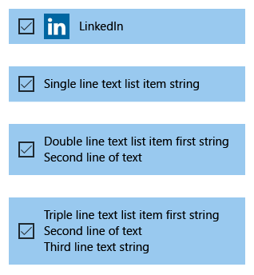
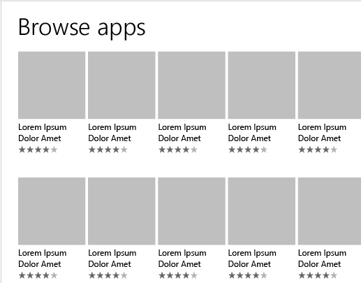
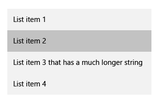

# Listas

Listas são exibidas e permitem interações com conteúdo baseado em coleção. Os quatro padrões de lista abordados neste artigo incluem:

-   Modos de exibição de lista, que são usados principalmente para exibir coleções de conteúdo com muito texto
-   Modos de exibição de grade, que são usados principalmente para exibir coleções de conteúdo com muitas imagens
-   Listas suspensas, que permitem que os usuários escolham um item em uma lista de expansão
-   Caixas de lista, que permitem que os usuários escolham um item ou vários itens em uma caixa que pode ser rolada

Diretrizes de design, recursos e exemplos são fornecidos para cada padrão de lista. No final do artigo há links para tópicos e APIs relacionados.

## APIs importantes

-   [**Classe ListView **](https://msdn.microsoft.com/library/windows/apps/br242878)
-   [**Classe GridView **](https://msdn.microsoft.com/library/windows/apps/br242705)
-   [**Classe ComboBox **](https://msdn.microsoft.com/library/windows/apps/br209348)

## Modos de exibição de lista

Modos de exibição de lista permitem que você classifique itens e atribua cabeçalhos de grupo, arraste e solte itens, corrija conteúdo e reordene os itens.

### Esse é o controle correto?

Use um modo de exibição de lista para:

-   Exiba uma coleção de conteúdos que consistem principalmente em texto.
-   Navegue em uma coleção de conteúdos única ou categorizada.
-   Crie o painel mestre no [padrão mestre/detalhes](master-details.md). Um padrão mestre/detalhes é usado com frequência em aplicativos de email, em que um painel (o mestre) tem uma lista de itens selecionáveis e o outro painel (detalhes) tem uma exibição detalhada do item selecionado.

### Exemplos

Ao usar um [padrão mestre/detalhes](master-details.md), você pode usar a exibição de lista para organizar o painel mestre. O painel mestre exibe uma lista de itens para seleção. Quando o usuário seleciona um item no painel mestre, outras informações sobre o item selecionado são exibidas no painel de detalhes. Muitas vezes, o painel de detalhes contém um modo de exibição de grade.

Você pode encadear várias listas para criar hierarquias mestre/detalhes complexas. Para saber mais, veja o [padrão mestre/detalhes](master-details.md).

O exemplo de um layout de lista possui cabeçalhos de grupo e é exibido como uma coluna única:

### Recomendações

-   Os itens em uma lista devem ter o mesmo comportamento.
-   Se a sua lista estiver dividida em grupos, você pode usar o [zoom semântico](semantic-zoom.md), para tornar mais fácil para os usuários navegarem pelo conteúdo agrupado.

## Exibições em grade

Modos de exibição de grade são adequados para organizar e navegar em coleções de conteúdos baseadas em imagens. Um layout de modo de exibição de grade rola verticalmente e faz movimento panorâmico na horizontal. Os itens são dispostos na ordem de leitura da esquerda para a direita, depois de cima para baixo.

### Esse é o controle correto?

Use um modo de exibição de lista para:

-   Exiba uma coleção de conteúdos que consista principalmente em imagens.
-   Exiba bibliotecas de conteúdo.
-   Formate os dois modos de exibição de conteúdo associados ao [zoom semântico](semantic-zoom.md).

### Exemplos

Este exemplo mostra um layout de modo de exibição de grade típico, neste caso, para navegar aplicativos. Metadados para itens de modo de exibição de grade são geralmente restritos a algumas linhas de texto e uma classificação de item.

Um modo de exibição de grade é a solução ideal para uma biblioteca de conteúdo, que geralmente é usada para apresentar mídia, como fotos e vídeos. Em uma biblioteca de conteúdo, os usuários esperam tocar em um item para invocar uma ação.

### Recomendações

-   Os itens em uma lista devem ter o mesmo comportamento.
-   Se a sua lista estiver dividida em grupos, você pode usar o [zoom semântico](semantic-zoom.md), para tornar mais fácil para os usuários navegarem pelo conteúdo agrupado.

## Listas suspensas

Listas suspensas, também conhecidas como caixas de combinação, começam em um estado compacto e se expandem para mostrar uma lista de itens selecionáveis. Uma lista suspensa aceita seleção única ou seleção múltipla. O item selecionado fica sempre visível, e os itens não visíveis podem ser exibidos quando o usuário tocar no item selecionado.

### Esse é o controle correto?

-   Use um controle de lista suspensa para permitir aos usuários selecionar um ou mais valores de um conjunto de itens que podem ser representados adequadamente com linhas de texto únicas.
-   Use um modo de exibição de lista ou de grade em vez de uma lista suspensa para exibir itens que contenham várias linhas de texto ou imagens.
-   Quando houver menos de cinco itens, considere a possibilidade de usar [botões de opção](radio-button.md) (se somente um item puder ser selecionado) [ou caixas de seleção](checkbox.md) (se vários itens puderem ser selecionados).
-   Use uma lista suspensa quando os itens de seleção forem de importância secundária no fluxo do seu aplicativo. Se a opção padrão for recomendada para a maioria dos usuários em grande parte das situações, mostrar todos os itens usando uma caixa de listagem pode chamar mais atenção para as opções do que o necessário. Você pode economizar espaço e minimizar a distração usando uma lista suspensa.

### Exemplos

Uma lista suspensa no estado compacto pode mostrar um cabeçalho.

Embora listas suspensas se expandam para dar suporte a tamanhos maiores de cadeia de caracteres, evite cadeias de caracteres excessivamente longas que são difíceis de ler.

Se a coleção em uma lista suspensa for grande o suficiente, será exibida uma barra de rolagem para acomodá-la. Agrupe itens logicamente na lista.

### Recomendações

-   Limite o conteúdo de texto do item de lista suspensa a uma única linha.
-   Classifique os itens em uma lista suspensa na ordem mais lógica. Agrupe opções relacionadas, coloque as opções mais comuns na parte superior e solicite itens em ordem alfabética. Classifique os nomes em ordem alfabética, os números em ordem numérica e as datas em ordem cronológica.

## Caixas de listagem

Uma caixa de listagem permite que o usuário escolha um único item ou vários itens de uma coleção. Caixas de listagem são semelhantes a listas suspensas, exceto que as caixas de listagem ficam sempre abertas: não há estado compacto (não expandido) para uma caixa de listagem. Pode-se fazer a rolagem pelos itens em uma lista se não houver espaço para mostrar tudo.

### Esse é o controle correto?

-   Uma caixa de listagem pode ser útil quando itens da lista são importantes o suficiente para serem exibidos em destaque e quando há espaço suficiente na tela para mostrar a lista completa.
-   Uma caixa de listagem deve chamar a atenção do usuário para todo o conjunto de alternativas em uma escolha importante. Por outro lado, uma lista suspensa inicialmente atrai a atenção do usuário para o item selecionado.
-   Evite usar uma caixa de listagem se:
    -   Houver um número muito pequeno de itens para a lista. Uma caixa de listagem que tem sempre as mesmas duas opções pode ser melhor apresentada como [botões de opção](radio-button.md). Considere também a possibilidade de usar botões de opção quando há três ou quatro itens estáticos na lista.
    -   A caixa de listagem é de seleção única e apresenta sempre as mesmas 2 opções, onde uma pode ser imposta como o contrário da outra, como “ligado” e “desligado”. Use uma única caixa de seleção ou um botão de alternância.
    -   Há um número muito grande de itens. Exibição de grade e exibição de lista são escolhas melhores para listas longas. Para listas muito longas de dados agrupados, prefere-se a aplicação de zoom semântico.
    -   Os itens são valores numéricos contíguos. Se esse for o caso, considere usar um [controle deslizante](slider.md).
    -   Os itens de seleção são de importância secundária no fluxo de seu aplicativo, ou a opção padrão é recomendada para a maioria dos usuários na maioria das situações. Utilize uma lista suspensa em vez disso.

### Recomendações

-   O intervalo ideal de itens em uma caixa de listagem é de 3 a 9.
-   Uma caixa de listagem funciona bem quando seus itens podem variar dinamicamente.
-   Se possível, defina o tamanho de uma caixa de listagem de modo que a lista de itens presente nela não precise de rolagem nem de aplicação de movimento panorâmico.
-   Verifique se está claro o propósito da caixa de listagem e quais itens estão selecionados atualmente.
-   Reserve efeitos visuais e animações para feedback referente a toque e para o estado selecionado dos itens.
-   Limite o conteúdo de texto do item da caixa de listagem a uma única linha. Se os itens forem elementos visuais, você poderá personalizar o tamanho. Se um item contém diversas linhas de texto ou imagens, utilize um modo de exibição de grade ou de lista em vez disso.
-   Use fonte padrão, a menos que as diretrizes da marca indiquem o contrário.
-   Não utilize uma caixa de listagem para executar comandos ou exibir ou ocultar dinamicamente outros controles.

## Modo de seleção

O modo de seleção permite que os usuários selecionem e executem ações em um item ou em vários itens. Ele pode ser invocado por meio de um menu de contexto usando CTRL+clique ou SHIFT+clique em um item ou rolando um destino em um item em um modo de exibição de galeria. Quando o modo de seleção está ativo, as caixas de seleção aparecem ao lado de cada item da lista, e as ações podem aparecer na parte superior ou inferior da tela.

Há três modos de seleção diferentes:

-   Única: o usuário pode selecionar apenas um item de cada vez.
-   Múltipla: o usuário pode selecionar vários itens sem usar um modificador.
-   Estendida: o usuário pode selecionar vários itens com um modificador, por exemplo, segurando a tecla SHIFT.

Tocar em qualquer lugar em um item seleciona-o. Tocar na ação da barra de comandos afeta todos os itens selecionados. Se nenhum item estiver selecionado, as ações da barra de comandos devem estar inativas, com exceção de "Selecionar Tudo".

O modo de seleção não tem um modelo light dismiss; tocar fora do quadro no qual o modo de seleção está ativo não cancelará o modo. Isso é para evitar a desativação acidental do modo. Clicar no botão Voltar ignora o modo de seleção múltipla.

Mostre uma confirmação visual quando uma ação for selecionada. Considere exibir uma caixa de diálogo de confirmação para determinadas ações, especialmente ações destrutivas, como excluir.

O modo de seleção está limitado à página na qual ele está ativo e não pode afetar os itens fora da página.

O ponto de entrada para o modo de seleção deve estar justaposto em relação ao conteúdo que ele afeta.

Veja recomendações sobre a barra de comandos em [Diretrizes de barras de comandos](app-bars.md).

## Lista de verificação de globalização e localização

<table>
<tr>
<th>Disposição</th><td>Deixe duas linhas para o rótulo de lista.</td>
</tr>
<tr>
<th>Expansão horizontal</th><td>Verifique se os campos podem acomodar a expansão de texto e são roláveis.</td>
</tr>
<tr>
<th>Espaçamento vertical</th><td>Use caracteres não latinos para espaçamento vertical para garantir que scripts não latinos sejam exibidos corretamente.</td>
</tr>
</table>

## Artigos relacionados

- [Hub](hub.md)
- [Mestre/detalhes](master-details.md)
- [Painel de navegação](nav-pane.md)
- [Zoom semântico](semantic-zoom.md)

**Para desenvolvedores**
- [**Classe ListView**](https://msdn.microsoft.com/library/windows/apps/br242878)
- [**Classe GridView**](https://msdn.microsoft.com/library/windows/apps/br242705)
- [**Classe ComboBox**](https://msdn.microsoft.com/library/windows/apps/br209348)
- [**Classe ListBox**](https://msdn.microsoft.com/library/windows/apps/br242868)
- [Adicionando caixas de combinação e caixas de listagem](https://msdn.microsoft.com/library/windows/apps/xaml/hh780616)

<!--HONumber=Jun16_HO3-->

