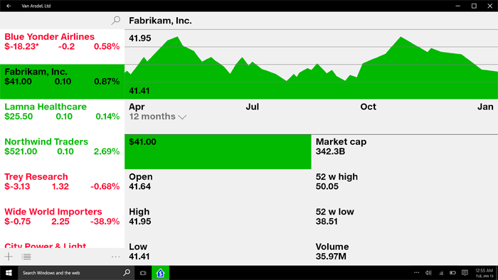
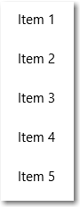
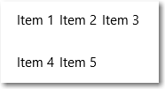
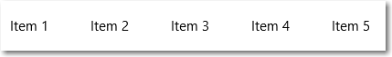
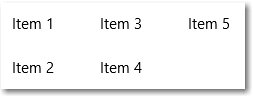

# ListView e GridView

A maioria dos aplicativos manipula e exibe conjuntos de dados, como uma galeria de imagens ou um conjunto de mensagens de email. A estrutura da IU XAML fornece controles ListView e GridView que tornam mais fácil exibir e manipular dados em seu aplicativo.  

Os controles ListView e GridView são derivados da classe ListViewBase, portanto, eles têm a mesma funcionalidade, mas exibem dados de modo diferente. Neste artigo, ao falarmos sobre ListView, as informações se aplicam aos controles ListView e GridView, a menos que especificado de outra forma. Poderemos nos referir a classes, como ListView ou ListViewItem, mas o prefixo "List" poderá ser substituído por "Grid" para o equivalente a grade correspondente (GridView ou GridViewItem). 

<span class="sidebar_heading" style="font-weight: bold;">APIs importantes</span>

-   [**Classe ListView**](https://msdn.microsoft.com/library/windows/apps/windows.ui.xaml.controls.listview.aspx)
-   [**Classe GridView**](https://msdn.microsoft.com/library/windows/apps/windows.ui.xaml.controls.gridview.aspx)
-   [**Propriedade ItemsSource**](https://msdn.microsoft.com/library/windows/apps/windows.ui.xaml.controls.itemscontrol.itemssource.aspx)
-   [**Propriedade ItemTemplate**](https://msdn.microsoft.com/library/windows/apps/windows.ui.xaml.controls.itemscontrol.itemtemplate.aspx)

## Esse é o controle correto?

O ListView exibe dados empilhados verticalmente em uma única coluna. Ele é frequentemente usado para mostrar uma lista ordenada de itens, como uma lista de emails ou resultados de pesquisa. Também é útil em cenários de [detalhes mestre](master-details.md), no qual os itens da lista só contêm uma pequena quantidade de informações e os detalhes do item selecionado são mostrados separadamente. 



O controle GridView apresenta uma coleção de itens em linhas e colunas, que podem ser roladas verticalmente. Os dados são empilhados horizontalmente até preencherem as colunas e, em seguida, passam para a próxima linha. Ele é frequentemente usado quando você precisa mostrar uma visualização rica de cada item que ocupa mais espaço, como uma galeria de fotos. 


Para obter uma comparação mais detalhada e orientação sobre qual controle usar, consulte [Listas](lists.md).

## Criar um modo de exibição de lista

Modo de exibição de lista é um [ItemsControl](https://msdn.microsoft.com/library/windows/apps/windows.ui.xaml.controls.itemscontrol.aspx) e, por isso, pode conter uma coleção de itens de qualquer tipo. Ele deve ter itens em sua coleção de [**itens**](https://msdn.microsoft.com/library/windows/apps/windows.ui.xaml.controls.itemscontrol.items.aspx) para mostrar algo na tela. Para popular a exibição, você pode adicionar itens diretamente à coleção de [**itens**](https://msdn.microsoft.com/library/windows/apps/windows.ui.xaml.controls.itemscontrol.items.aspx) ou definir a propriedade [**ItemsSource**](https://msdn.microsoft.com/library/windows/apps/windows.ui.xaml.controls.itemscontrol.itemssource.aspx) como uma fonte de dados. 

**Importante**
            &nbsp;&nbsp;Você pode usar Items ou ItemsSource para popular a lista, mas não pode usar os dois ao mesmo tempo. Se você definir a propriedade ItemsSource e adicionar um item em XAML, o item adicionado será ignorado. Se você definir a propriedade ItemsSource e adicionar um item à coleção Items no código, uma exceção será gerada.

> **Observação**&nbsp;&nbsp;Em muitos exemplos deste artigo, a coleção **Items** é preenchida diretamente para simplificar. No entanto, é mais comum que os itens de uma lista sejam provenientes de uma fonte dinâmica, como uma lista de livros de um banco de dados online. Você usa a propriedade **ItemsSource** para essa finalidade. 

### Adicionar itens à coleção Items

Você pode adicionar itens à coleção [**Items**](https://msdn.microsoft.com/library/windows/apps/windows.ui.xaml.controls.itemscontrol.items.aspx) usando XAML ou código. Normalmente, você adiciona itens dessa maneira quando tem um pequeno número de itens que não mudam e são facilmente definidos no XAML ou ao gerar os itens em código no tempo de execução. 

Veja a seguir uma exibição de lista com itens definidos embutidos em XAML. Quando você define os itens em XAML, eles também são adicionados automaticamente à coleção Items.

**XAML**
```xaml
<ListView x:Name="listView1"> 
   <x:String>Item 1</x:String> 
   <x:String>Item 2</x:String> 
   <x:String>Item 3</x:String> 
   <x:String>Item 4</x:String> 
   <x:String>Item 5</x:String> 
</ListView>  
```

Veja a seguir a exibição de lista criada em código. A lista resultante é igual à criada anteriormente em XAML.

**C#**
```csharp
// Create a new ListView and add content. 
ListView listView1 = new ListView(); 
listView1.Items.Add("Item 1"); 
listView1.Items.Add("Item 2"); 
listView1.Items.Add("Item 3"); 
listView1.Items.Add("Item 4"); 
listView1.Items.Add("Item 5");
 
// Add the ListView to a parent container in the visual tree. 
stackPanel1.Children.Add(listView1); 
```

O ListView tem a aparência a seguir.



### Definir a origem de itens

Geralmente, você usa uma exibição de lista para exibir dados de uma fonte, como um banco de dados ou a Internet. Para popular uma exibição de lista em uma fonte de dados, defina sua propriedade [**ItemsSource**](https://msdn.microsoft.com/library/windows/apps/xaml/windows.ui.xaml.controls.itemscontrol.itemssource.aspx) como uma coleção de itens de dados.

Aqui, o ItemsSource da exibição de lista está definido em código diretamente como uma instância de uma coleção.

**C#**
```csharp 
// Instead of hard coded items, the data could be pulled 
// asynchronously from a database or the internet.
ObservableCollection<string> listItems = new ObservableCollection<string>();
listItems.Add("Item 1");
listItems.Add("Item 2");
listItems.Add("Item 3");
listItems.Add("Item 4");
listItems.Add("Item 5");

// Create a new list view, add content, 
ListView itemListView = new ListView();
itemListView.ItemsSource = listItems;

// Add the list view to a parent container in the visual tree.
stackPanel1.Children.Add(itemListView);
```

Você também pode associar a propriedade ItemsSource a uma coleção em XAML. Para saber mais, consulte [Vinculação de dados com XAML](../data-binding/data-binding-quickstart.md).

Aqui, o ItemsSource está associado a uma propriedade pública denominada `Items` que expõe a coleção de dados privados da página.

**XAML**
```xaml
<ListView x:Name="itemListView" ItemsSource="{x:Bind Items}"/>
```

**C#**
```csharp
private ObservableCollection<string> _items = new ObservableCollection<string>();

public ObservableCollection<string> Items
{
    get { return this._items; }
}

protected override void OnNavigatedTo(NavigationEventArgs e)
{
    base.OnNavigatedTo(e);

    // Instead of hard coded items, the data could be pulled 
    // asynchronously from a database or the internet.
    Items.Add("Item 1");
    Items.Add("Item 2");
    Items.Add("Item 3");
    Items.Add("Item 4");
    Items.Add("Item 5");
}
```

Se você precisar mostrar dados agrupados em sua exibição de lista, deverá associar a um [ **CollectionViewSource**](https://msdn.microsoft.com/library/windows/apps/xaml/windows.ui.xaml.data.collectionviewsource.aspx). O CollectionViewSource age como um proxy para a classe da coleção em XAML e habilita o suporte a agrupamento. Para saber mais, consulte a [**CollectionViewSource**](https://msdn.microsoft.com/library/windows/apps/xaml/windows.ui.xaml.data.collectionviewsource.aspx).

## Modelo de dados

Um modelo de dados de um item define como os dados são visualizados. Por padrão, o item de dados aparece na exibição de lista como a representação em cadeia de caracteres do objeto de dados ao qual ele está associado. Você pode mostrar a representação em cadeia de caracteres de uma propriedade específica do item de dados definindo [**DisplayMemberPath**](https://msdn.microsoft.com/library/windows/apps/xaml/windows.ui.xaml.controls.itemscontrol.displaymemberpath.aspx) como essa propriedade.

No entanto, você geralmente quer mostrar uma apresentação mais sofisticada de seus dados. Para especificar exatamente como os itens aparecem na exibição de lista, você cria um [**DataTemplate**](https://msdn.microsoft.com/library/windows/apps/xaml/windows.ui.xaml.datatemplate.aspx). O XAML no DataTemplate define o layout e a aparência dos controles usados para exibir cada item. Os controles no layout podem ser associados a propriedades de um objeto de dados ou ter conteúdo estático definido embutido. Você atribui o DataTemplate à propriedade [**ItemTemplate**](https://msdn.microsoft.com/library/windows/apps/xaml/windows.ui.xaml.controls.itemscontrol.itemtemplate.aspx) do controle de lista.

Neste exemplo, o item de dados é uma cadeia de caracteres simples. Você usa um DataTemplate para adicionar uma imagem à esquerda da cadeia de caracteres e mostra a cadeia em azul.  

> **Observação**&nbsp;&nbsp;Ao usar a [extensão de marcação x:Bind](https://msdn.microsoft.com/windows/uwp/xaml-platform/x-bind-markup-extension) em um DataTemplate, você precisa especificar o DataType (`x:DataType`) no DataTemplate. Para definir `x:DataType="System:String"`, como neste exemplo, você precisa adicionar a `xmlns:System="using:System"` [declaração de namespace XAML](https://msdn.microsoft.com/windows/uwp/xaml-platform/xaml-overview#xaml-namespaces) à sua página.

**XAML**
```XAML
<ListView x:Name="listView1">
    <ListView.ItemTemplate>
        <DataTemplate x:DataType="System:String">
            <Grid>
                <Grid.ColumnDefinitions>
                    <ColumnDefinition Width="54"/>
                    <ColumnDefinition/>
                </Grid.ColumnDefinitions>
                <Image Source="Assets/placeholder.png" Width="44" Height="44" 
                       HorizontalAlignment="Left"/>
                <TextBlock Text="{x:Bind}" Foreground="Blue" 
                           FontSize="36" Grid.Column="1"/>
            </Grid> 
        </DataTemplate>
    </ListView.ItemTemplate>
    <x:String>Item 1</x:String>
    <x:String>Item 2</x:String>
    <x:String>Item 3</x:String>
    <x:String>Item 4</x:String>
    <x:String>Item 5</x:String>
</ListView>
```

Veja a seguir a aparência dos itens de dados quando exibidos com este modelo de dados.


Os modelos de dados são a principal maneira de definir a aparência de sua exibição de lista. Eles também poderão causar um impacto significativo no desempenho se sua lista exibir um grande número de itens. Neste artigo, vamos usar dados de cadeia de caracteres simples na maioria dos exemplos e não especificar um modelo de dados. Para obter mais informações e exemplos de como usar DataTemplates e contêineres de itens para definir a aparência dos itens em sua lista ou grade, consulte *Modificar a aparência dos itens de lista*. 

## Alterar o layout dos itens

Quando você adiciona itens a uma exibição de lista ou grade, o controle encapsula automaticamente cada item de um contêiner de itens e, em seguida, dispõe todos os contêineres. A forma como esses contêineres de itens são dispostos depende do [ **ItemsPanel** ](https://msdn.microsoft.com/library/windows/apps/windows.ui.xaml.controls.itemscontrol.itemspanel.aspx) do controle.  
- Por padrão, **ListView** usa um [ **ItemsStackPanel**](https://msdn.microsoft.com/library/windows/apps/windows.ui.xaml.controls.itemsstackpanel.aspx), que gera uma lista vertical, como esta.


- O **GridView** usa um [ **ItemsWrapGrid**](https://msdn.microsoft.com/library/windows/apps/windows.ui.xaml.controls.itemswrapgrid.aspx), que adiciona itens horizontalmente, encapsula e rola verticalmente, da seguinte maneira.



Você pode modificar o layout dos itens ajustando as propriedades no painel de itens ou substituir o painel padrão por outro painel.

> Observação&nbsp;&nbsp;Tenha cuidado para não desabilitar a virtualização se alterar o ItemsPanel. O **ItemsStackPanel** e o **ItemsWrapGrid** dão suporte à virtualização, portanto, é seguro usá-los. Ao usar qualquer outro painel, talvez você desabilite a virtualização e degrade o desempenho da exibição de lista. Para obter mais informações, consulte os artigos sobre exibição de lista em [Desempenho](https://msdn.microsoft.com/windows/uwp/debug-test-perf/performance-and-xaml-ui). 

Este exemplo mostra como fazer uma **ListView** dispor seus contêineres de itens em uma lista horizontal alterando a propriedade [**Orientação** ](https://msdn.microsoft.com/library/windows/apps/windows.ui.xaml.controls.itemsstackpanel.orientation.aspx) do **ItemsStackPanel**.
Como a exibição de lista rola verticalmente por padrão, você também precisa ajustar algumas propriedades no [ **ScrollViewer**](https://msdn.microsoft.com/library/windows/apps/windows.ui.xaml.controls.scrollviewer.aspx) interno para fazê-la rolar horizontalmente.
- [ScrollViewer.HorizontalScrollMode](https://msdn.microsoft.com/library/windows/apps/windows.ui.xaml.controls.scrollviewer.horizontalscrollmode.aspx) para **Habilitado** ou **Automático**
- [ScrollViewer.HorizontalScrollBarVisibility](https://msdn.microsoft.com/library/windows/apps/windows.ui.xaml.controls.scrollviewer.horizontalscrollbarvisibility.aspx) para **Automático** 
- [ScrollViewer.VerticalScrollMode](https://msdn.microsoft.com/library/windows/apps/windows.ui.xaml.controls.scrollviewer.verticalscrollmode.aspx) para **Desabilitado** 
- [ScrollViewer.VerticalScrollBarVisibility](https://msdn.microsoft.com/library/windows/apps/windows.ui.xaml.controls.scrollviewer.verticalscrollbarvisibility.aspx) para **Oculto** 

> **Observação**
            &nbsp;&nbsp;Esses exemplos são mostrados com a largura da exibição de lista irrestrita, para que as barras de rolagem horizontais não sejam mostradas. Se você executar esse código, poderá definir `Width="180"` no ListView para mostrar as barras de rolagem.

**XAML**
```xaml
<ListView Height="60" 
          ScrollViewer.HorizontalScrollMode="Enabled" 
          ScrollViewer.HorizontalScrollBarVisibility="Auto"
          ScrollViewer.VerticalScrollMode="Disabled"
          ScrollViewer.VerticalScrollBarVisibility="Hidden">
    <ListView.ItemsPanel>
        <ItemsPanelTemplate>
            <ItemsStackPanel Orientation="Horizontal"/>
        </ItemsPanelTemplate>
    </ListView.ItemsPanel>
    <x:String>Item 1</x:String>
    <x:String>Item 2</x:String>
    <x:String>Item 3</x:String>
    <x:String>Item 4</x:String>
    <x:String>Item 5</x:String>
</ListView>
```

A lista resultante tem esta aparência.



 No próximo exemplo, o **ListView** dispõe os itens em uma lista de encapsulamento vertical usando um **ItemsWrapGrid** em vez de um **ItemsStackPanel**. 
 
> **Observação**
            &nbsp;&nbsp;A altura da exibição de lista deve ser restrita para forçar o controle a encapsular os contêineres.

**XAML**
```xaml
<ListView Height="100"
          ScrollViewer.HorizontalScrollMode="Enabled" 
          ScrollViewer.HorizontalScrollBarVisibility="Auto"
          ScrollViewer.VerticalScrollMode="Disabled"
          ScrollViewer.VerticalScrollBarVisibility="Hidden">
    <ListView.ItemsPanel>
        <ItemsPanelTemplate>
            <ItemsWrapGrid/>
        </ItemsPanelTemplate>
    </ListView.ItemsPanel>
    <x:String>Item 1</x:String>
    <x:String>Item 2</x:String>
    <x:String>Item 3</x:String>
    <x:String>Item 4</x:String>
    <x:String>Item 5</x:String>
</ListView>
```

A lista resultante tem esta aparência.



Se você mostrar os dados agrupados em sua exibição de lista, o ItemsPanel determinará como os grupos de itens, e não os itens individuais, estão dispostos. Por exemplo, se o ItemsStackPanel horizontal mostrado anteriormente for usado para mostrar os dados agrupados, os grupos serão organizados horizontalmente, mas os itens em cada grupo ainda serão empilhados verticalmente, conforme mostrado aqui.


## Interação e seleção de itens

Você pode escolher entre várias maneiras de permitir que um usuário interaja com uma exibição de lista. Por padrão, um usuário pode selecionar um único item. Você pode alterar a propriedade [**SelectionMode**](https://msdn.microsoft.com/library/windows/apps/windows.ui.xaml.controls.listviewbase.selectionmode.aspx) para habilitar a multisseleção ou desabilitar a seleção. É possível definir a propriedade [**IsItemClickEnabled**](https://msdn.microsoft.com/library/windows/apps/windows.ui.xaml.controls.listviewbase.isitemclickenabled.aspx) para que um usuário clique em um item em vez de selecioná-lo para invocar uma ação (como um botão).

> **Observação**&nbsp;&nbsp;Tanto o ListView quanto o GridView usam a enumeração [**ListViewSelectionMode**](https://msdn.microsoft.com/library/windows/apps/windows.ui.xaml.controls.listviewselectionmode.aspx) para suas propriedades SelectionMode. IsItemClickEnabled é **Falso** por padrão, portanto, você precisa defini-lo para apenas habilitar o modo de clique.

Esta tabela mostra as maneiras como um usuário pode interagir com uma exibição de lista e como você pode responder à interação.

Para habilitar essa interação: | Use estas configurações: | Manipule este evento: | Para esta propriedade para obter o item selecionado:
----------------------------|---------------------|--------------------|--------------------------------------------
Nenhuma interação | [SelectionMode](https://msdn.microsoft.com/library/windows/apps/windows.ui.xaml.controls.listviewbase.selectionmode.aspx)
             = 
            **Nenhum**, [IsItemClickEnabled](https://msdn.microsoft.com/library/windows/apps/windows.ui.xaml.controls.listviewbase.isitemclickenabled.aspx) = **Falso** | N/A | N/A 
Seleção única | SelectionMode = **Único**, IsItemClickEnabled = **Falso** | [SelectionChanged](https://msdn.microsoft.com/library/windows/apps/windows.ui.xaml.controls.primitives.selector.selectionchanged.aspx) | [SelectedItem](https://msdn.microsoft.com/library/windows/apps/windows.ui.xaml.controls.primitives.selector.selecteditem.aspx), [SelectedIndex](https://msdn.microsoft.com/library/windows/apps/windows.ui.xaml.controls.primitives.selector.selectedindex.aspx)  
Seleção múltipla | SelectionMode = **Múltiplo**, IsItemClickEnabled = **Falso** | [SelectionChanged](https://msdn.microsoft.com/library/windows/apps/windows.ui.xaml.controls.primitives.selector.selectionchanged.aspx) | [SelectedItems](https://msdn.microsoft.com/library/windows/apps/windows.ui.xaml.controls.listviewbase.selecteditems.aspx)  
Seleção estendida | SelectionMode = **Estendido**, IsItemClickEnabled = **Falso** | [SelectionChanged](https://msdn.microsoft.com/library/windows/apps/windows.ui.xaml.controls.primitives.selector.selectionchanged.aspx) | [SelectedItems](https://msdn.microsoft.com/library/windows/apps/windows.ui.xaml.controls.listviewbase.selecteditems.aspx)  
Clicar | SelectionMode = **Nenhum**, IsItemClickEnabled = **Verdadeiro** | [ItemClick](https://msdn.microsoft.com/library/windows/apps/windows.ui.xaml.controls.listviewbase.itemclick.aspx) | N/A 

> **Observação**
            &nbsp;&nbsp;A partir do Windows 10, você pode habilitar IsItemClickEnabled para disparar um evento ItemClick enquanto SelectionMode também está definido como Único, Múltiplo ou Estendido. Se você fizer isso, o evento ItemClick será gerado primeiro e, em seguida, o evento SelectionChanged será acionado. Em alguns casos, como se você estivesse navegando para outra página no manipulador de eventos ItemClick, o evento SelectionChanged não é gerado e o item não é selecionado.

Você pode definir essas propriedades em XAML ou em código, conforme mostrado aqui.

**XAML**
```xaml
<ListView x:Name="myListView" SelectionMode="Multiple"/>

<GridView x:Name="myGridView" SelectionMode="None" IsItemClickEnabled="True"/> 
```

**C#**
```csharp
myListView.SelectionMode = ListViewSelectionMode.Multiple; 

myGridView.SelectionMode = ListViewSelectionMode.None;
myGridView.IsItemClickEnabled = true;
```

### Somente leitura

É possível definir a propriedade SelectionMode como **ListViewSelectionMode.None** para desabilitar a seleção de itens. Isso coloca o controle no modo somente leitura, para ser usado para exibição de dados, mas não para interação. O próprio controle não está desabilitado, somente a seleção de itens está desabilitada.

### Seleção única

Esta tabela descreve as interações com o teclado, o mouse e de toque quando o SelectionMode está definido como **Único**.

Tecla modificadora | Interação
-------------|------------
Nenhuma | <li>Um usuário pode selecionar um único item usando a barra de espaço, um clique do mouse ou um toque.</li>
Ctrl | <li>Um usuário pode desmarcar um único item usando a barra de espaço, um clique do mouse ou um toque.</li><li>Com as teclas de seta, um usuário pode mover o foco independentemente da seleção.</li>

Quando SelectionMode está definido como **Único**, você pode obter o item de dados selecionado a partir da propriedade [ **SelectedItem**](https://msdn.microsoft.com/library/windows/apps/windows.ui.xaml.controls.primitives.selector.selecteditem.aspx). Você pode obter o índice na coleção do item selecionado com a propriedade [**SelectedIndex**](https://msdn.microsoft.com/library/windows/apps/windows.ui.xaml.controls.primitives.selector.selectedindex.aspx). Se nenhum item estiver selecionado, SelectedItem será **nulo** e SelectedIndex será -1. 
 
Se você tentar definir um item que não está na coleção **Items** como o **SelectedItem**, a operação será ignorada e o SelectedItem será **nulo**. No entanto, se você tentar definir o **SelectedIndex** como um índice fora do intervalo de **Items** na lista, ocorrerá uma exceção **ArgumentException**. 

### Seleção múltipla

Esta tabela descreve as interações com o teclado, o mouse e de toque quando o SelectionMode está definido como **Múltiplo**.

Tecla modificadora | Interação
-------------|------------
Nenhuma | <li>Um usuário pode selecionar vários itens usando a barra de espaço, um clique do mouse ou um toque para alternar a seleção do item focalizado.</li><li>Com as teclas de seta, um usuário pode mover o foco independentemente da seleção.</li>
Shift | <li>Um usuário pode selecionar vários itens adjacentes clicando ou tocando no primeiro item da seleção e, em seguida, no último item da seleção.</li><li>Com as teclas de seta, um usuário pode criar uma seleção contígua começando com o item selecionado quando Shift é pressionada.</li>

### Seleção estendida

Esta tabela descreve as interações com o teclado, o mouse e de toque quando o SelectionMode está definido como **Estendido**.

Tecla modificadora | Interação
-------------|------------
Nenhuma | <li>O comportamento é o mesmo que da seleção **Único**.</li>
Ctrl | <li>Um usuário pode selecionar vários itens usando a barra de espaço, um clique do mouse ou um toque para alternar a seleção do item focalizado.</li><li>Com as teclas de seta, um usuário pode mover o foco independentemente da seleção.</li>
Shift | <li>Um usuário pode selecionar vários itens adjacentes clicando ou tocando no primeiro item da seleção e, em seguida, no último item da seleção.</li><li>Com as teclas de seta, um usuário pode criar uma seleção contígua começando com o item selecionado quando Shift é pressionada.</li>

Quando SelectionMode está definido como **Múltiplo** ou **Estendido**, você pode obter os itens de dados selecionados a partir da propriedade [**SelectedItems**](https://msdn.microsoft.com/library/windows/apps/windows.ui.xaml.controls.listviewbase.selecteditems.aspx). 

As propriedades **SelectedIndex**, **SelectedItem** e **SelectedItems** são sincronizadas. Por exemplo, se você definir SelectedIndex como -1, SelectedItem será definido como **nulo** e SelectedItems ficará em branco. Se você definir SelectedItem como **nulo**, SelectedIndex será definido como -1 e SelectedItems ficará em branco.

No modo de seleção múltipla, **SelectedItem** contém o item que foi selecionado primeiro, e **Selectedindex** contém o índice do item que foi selecionado primeiro. 

### Responder a alterações de seleção

Para responder às alterações de seleção em uma exibição de lista, manipule o evento [**SelectionChanged**](https://msdn.microsoft.com/library/windows/apps/windows.ui.xaml.controls.primitives.selector.selectionchanged.aspx). No código do manipulador de eventos, você pode obter a lista de itens selecionados a partir da propriedade [**SelectionChangedEventArgs.AddedItems**](https://msdn.microsoft.com/library/windows/apps/windows.ui.xaml.controls.selectionchangedeventargs.addeditems.aspx). Você pode obter todos os itens que foram desmarcados a partir da propriedade [**SelectionChangedEventArgs.RemovedItems**](https://msdn.microsoft.com/library/windows/apps/windows.ui.xaml.controls.selectionchangedeventargs.removeditems.aspx). As coleções AddedItems e RemovedItems contêm, no máximo, 1 item, a menos que o usuário selecione um intervalo de itens mantendo pressionada a tecla Shift.

Este exemplo mostra como manipular o evento **SelectionChanged** e acessar as diversas coleções de itens.

**XAML**
```xaml
<StackPanel HorizontalAlignment="Right">
    <ListView x:Name="listView1" SelectionMode="Multiple" 
              SelectionChanged="ListView1_SelectionChanged">
        <x:String>Item 1</x:String>
        <x:String>Item 2</x:String>
        <x:String>Item 3</x:String>
        <x:String>Item 4</x:String>
        <x:String>Item 5</x:String>
    </ListView>
    <TextBlock x:Name="selectedItem"/>
    <TextBlock x:Name="selectedIndex"/>
    <TextBlock x:Name="selectedItemCount"/>
    <TextBlock x:Name="addedItems"/>
    <TextBlock x:Name="removedItems"/>
</StackPanel> 
```

**C#**
```csharp
private void ListView1_SelectionChanged(object sender, SelectionChangedEventArgs e)
{
    if (listView1.SelectedItem != null)
    {
        selectedItem.Text = 
            "Selected item: " + listView1.SelectedItem.ToString();
    }
    else
    {
        selectedItem.Text = 
            "Selected item: null";
    }
    selectedIndex.Text = 
        "Selected index: " + listView1.SelectedIndex.ToString();
    selectedItemCount.Text = 
        "Items selected: " + listView1.SelectedItems.Count.ToString();
    addedItems.Text = 
        "Added: " + e.AddedItems.Count.ToString();
    removedItems.Text = 
        "Removed: " + e.RemovedItems.Count.ToString();
}
```

### Modo de clique

Você pode alterar a exibição de lista para que um usuário clique em itens como botões em vez de selecioná-los. Por exemplo, isso é útil quando o seu aplicativo navega para uma nova página quando o seu usuário clica em um item em uma lista ou grade. 
Para habilitar esse comportamento:
- Defina **SelectionMode** como **Nenhum**.
- Defina **IsItemClickEnabled** como **verdadeiro**.
- Manipule o evento **ItemClick** para fazer algo quando o usuário clicar em um item.

Veja a seguir uma exibição de lista com itens clicáveis. O código no manipulador de eventos ItemClick navega para uma nova página.

**XAML**
```xaml
<ListView SelectionMode="None"
          IsItemClickEnabled="True" 
          ItemClick="ListView1_ItemClick">
    <x:String>Page 1</x:String>
    <x:String>Page 2</x:String>
    <x:String>Page 3</x:String>
    <x:String>Page 4</x:String>
    <x:String>Page 5</x:String>
</ListView>
```

**C#**
```csharp
private void ListView1_ItemClick(object sender, ItemClickEventArgs e)
{
    switch (e.ClickedItem.ToString())
    {
        case "Page 1":
            this.Frame.Navigate(typeof(Page1));
            break;

        case "Page 2":
            this.Frame.Navigate(typeof(Page2));
            break;

        case "Page 3":
            this.Frame.Navigate(typeof(Page3));
            break;

        case "Page 4":
            this.Frame.Navigate(typeof(Page4));
            break;

        case "Page 5":
            this.Frame.Navigate(typeof(Page5));
            break;

        default:
            break;
    }
}
```

### Selecionar um intervalo de itens de forma programática

Às vezes, você precisa manipular a seleção de itens de uma exibição de lista de modo programático. Por exemplo, você pode ter um botão **Selecionar tudo** para permitir que o usuário selecione todos os itens de uma lista. Nesse caso, geralmente, não é muito eficiente adicionar e remover itens da coleção SelectedItems individualmente. Cada alteração de itens provoca a ocorrência de um evento SelectionChanged, e quando você trabalha com os itens diretamente em vez de trabalhar com valores de índice, o item é desvirtualizado.

Os métodos [**SelectAll**](https://msdn.microsoft.com/library/windows/apps/windows.ui.xaml.controls.listviewbase.selectall.aspx), [**SelectRange**](https://msdn.microsoft.com/library/windows/apps/windows.ui.xaml.controls.listviewbase.selectrange.aspx) e [**DeselectRange**](https://msdn.microsoft.com/library/windows/apps/windows.ui.xaml.controls.listviewbase.deselectrange.aspx) proporcionam uma forma mais eficiente de modificar a seleção do que a propriedade SelectedItems. Esses métodos selecionam ou desmarcam usando intervalos de índices de itens. Os itens virtualizados permanecem virtualizados, pois somente o índice é usado. Todos os itens do intervalo especificado são selecionados (ou desmarcados), independentemente do estado de seleção original. O evento SelectionChanged ocorre somente uma vez para cada chamada desses métodos.

> **Importante**
            &nbsp;&nbsp;Você deve chamar esses métodos apenas quando a propriedade SelectionMode for definida como Múltiplo ou Estendido. Se você chamar SelectRange quando SelectionMode for Único ou Nenhum, uma exceção será gerada.

Quando você selecionar itens usando intervalos de índice, use a propriedade [**SelectedRanges**](https://msdn.microsoft.com/library/windows/apps/windows.ui.xaml.controls.listviewbase.selectedranges.aspx) para obter todos os intervalos selecionados na lista.

Se o ItemsSource implementar [**IItemsRangeInfo**](https://msdn.microsoft.com/library/windows/apps/windows.ui.xaml.data.iitemsrangeinfo.aspx), e você usar esses métodos para modificar a seleção, as propriedades **AddedItems** e **RemovedItems** não serão definidas no SelectionChangedEventArgs. Definir essas propriedades requer a desvirtualização do objeto de item. Use a propriedade **SelectedRanges** para obter os itens.

Você pode selecionar todos os itens de uma coleção chamando o método SelectAll. No entanto, não há nenhum método correspondente para desmarcar todos os itens. Você pode desmarcar todos os itens chamando DeselectRange e transmitindo um [**ItemIndexRange**](https://msdn.microsoft.com/library/windows/apps/windows.ui.xaml.data.itemindexrange.aspx) com um valor de [**FirstIndex**](https://msdn.microsoft.com/library/windows/apps/windows.ui.xaml.data.itemindexrange.firstindex.aspx) de 0 e um valor de [**Length**](https://msdn.microsoft.com/library/windows/apps/windows.ui.xaml.data.itemindexrange.length.aspx) equivalente ao número de itens da coleção. 

**XAML**
```xaml
<StackPanel Width="160">
    <Button Content="Select all" Click="SelectAllButton_Click"/>
    <Button Content="Deselect all" Click="DeselectAllButton_Click"/>
    <ListView x:Name="listView1" SelectionMode="Multiple">
        <x:String>Item 1</x:String>
        <x:String>Item 2</x:String>
        <x:String>Item 3</x:String>
        <x:String>Item 4</x:String>
        <x:String>Item 5</x:String>
    </ListView>
</StackPanel>
```

**C#**
```csharp
private void SelectAllButton_Click(object sender, RoutedEventArgs e)
{
    if (listView1.SelectionMode == ListViewSelectionMode.Multiple ||
        listView1.SelectionMode == ListViewSelectionMode.Extended)
    {
        listView1.SelectAll();
    }
}

private void DeselectAllButton_Click(object sender, RoutedEventArgs e)
{
    if (listView1.SelectionMode == ListViewSelectionMode.Multiple ||
        listView1.SelectionMode == ListViewSelectionMode.Extended)
    {
        listView1.DeselectRange(new ItemIndexRange(0, (uint)listView1.Items.Count));
    }
}
```


## Artigos relacionados

- [Listas](lists.md)


<!--HONumber=May16_HO2-->


