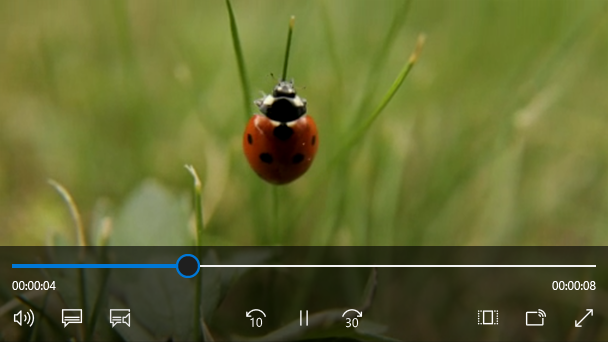
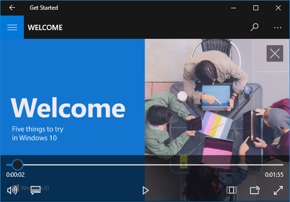
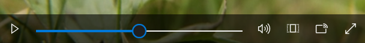
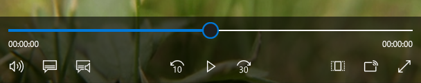

# Media player

<link rel="stylesheet" href="https://az835927.vo.msecnd.net/sites/uwp/Resources/css/custom.css">

O media player é usado para exibir e ouvir vídeo e áudio. A reprodução de mídia pode ser embutida (inserida em uma página ou com um grupo de outros controles) ou em um modo de exibição de tela inteira dedicado. Você pode modificar o conjunto de botões do player, alterar a tela de fundo da barra de controle e organizar os layouts como quiser. Apenas lembre-se de que os usuários esperam um conjunto básico de controles (reproduzir/pausar, retroceder, avançar).



<div class="important-apis" >
<b>APIs Importantes</b><br/>
<ul>
<li><a href="https://msdn.microsoft.com/library/windows/apps/windows.ui.xaml.controls.mediaplayerelement.aspx"><strong>Classe MediaPlayerElement</strong></a></li>
<li><a href="https://msdn.microsoft.com/library/windows/apps/windows.ui.xaml.controls.mediatransportcontrols"><strong>Classe MediaTransportControls</strong></a></li>
</ul>

</div>
</div>


> **Observação**&nbsp;&nbsp; **MediaPlayerElement** só está disponível no Windows 10, versão 1607, e posterior. Se estiver desenvolvendo um aplicativo para uma versão anterior do Windows 10, você precisará usar [**MediaElement**](https://msdn.microsoft.com/library/windows/apps/br242926). Todas as recomendações nesta página também se aplicam a MediaElement.

## Esse é o controle correto?

Use um media player quando você quiser reproduzir áudio ou vídeo em seu aplicativo. Para exibir uma coleção de imagens, use um [Modo de exibição de inversão](flipview.md).

## Exemplos

Um player de mídia no aplicativo Introdução do Windows 10.



## Criar um media player
Adicione mídia ao aplicativo criando um objeto [**MediaPlayerElement**](https://msdn.microsoft.com/library/windows/apps/windows.ui.xaml.controls.mediaplayerelement.aspx) em XAML e defina uma [**Source**](https://msdn.microsoft.com/library/windows/apps/windows.ui.xaml.controls.mediaplayerelement.source.aspx) como uma [**MediaSource**](https://msdn.microsoft.com/en-us/library/windows/apps/windows.media.core.mediasource.aspx) que aponta para um arquivo de áudio ou vídeo.

Este XAML cria o [**MediaPlayerElement**](https://msdn.microsoft.com/library/windows/apps/windows.ui.xaml.controls.mediaplayerelement.aspx) e define sua propriedade [**Source**](https://msdn.microsoft.com/library/windows/apps/windows.ui.xaml.controls.mediaplayerelement.source.aspx) como o URI de um arquivo de vídeo que seja local para o aplicativo. O **MediaPlayerElement** começa quando a página é carregada. É possível suprimir a reprodução imediata de mídia definindo a propriedade [**AutoPlay**](https://msdn.microsoft.com/library/windows/apps/windows.ui.xaml.controls.mediaplayerelement.autoplay.aspx) como **false**.

```xaml
<MediaPlayerElement x:Name="mediaSimple"
                    Source="Videos/video1.mp4"
                    Width="400" AutoPlay="True"/>
```

Este XAML cria um [**MediaPlayerElement**](https://msdn.microsoft.com/library/windows/apps/windows.ui.xaml.controls.mediaplayerelement.aspx) com os controles de transporte internos habilitados e a propriedade [**AutoPlay**](https://msdn.microsoft.com/library/windows/apps/windows.ui.xaml.controls.mediaplayerelement.autoplay.aspx) definida como **false**.


```xaml
<MediaPlayerElement x:Name="mediaPlayer"
                    Source="Videos/video1.mp4"
                    Width="400"
                    AutoPlay="False"
                    AreTransportControlsEnabled="True"/>
```

### Controles de transporte de mídia
[**MediaPlayerElement**] ((https://msdn.microsoft.com/library/windows/apps/windows.ui.xaml.controls.mediaplayerelement.aspx) tem controles de transporte internos que manipulam executar, parar, pausar, volume, mudo, procurar/progresso, legendas ocultas e seleção da faixa de áudio. Para habilitar esses controles, defina [**AreTransportControlsEnabled**](https://msdn.microsoft.com/library/windows/apps/windows.ui.xaml.controls.mediaplayerelement.AreTransportControlsEnabled.aspx) como **true**. Para desabilitá-los, defina **AreTransportControlsEnabled** como **false**. Os controles de transporte são representados pela classe [**MediaTransportControls**](https://msdn.microsoft.com/library/windows/apps/dn831962). Você pode usar os controles de transporte como estão ou personalizá-los de várias maneiras. Para obter mais informações, consulte a referência de classe [**MediaTransportControls**](https://msdn.microsoft.com/library/windows/apps/dn831962) e [Criar controles personalizados de transporte](custom-transport-controls.md).

Os controles de transporte dão suporte a layouts de linha única e dupla. O primeiro exemplo é um layout de linha única, com o botão Reproduzir/Pausar localizado à esquerda da linha do tempo de mídia. Este layout é mais reservado para telas de reprodução de mídia embutidas e compactas.



O layout de controles de linha dupla (abaixo) é recomendado para a maioria dos cenários de uso, especialmente em telas maiores. Esse layout oferece mais espaço para controles e facilita a operação da linha do tempo pelo usuário.



**Controles de transporte de mídia do sistema**

[**MediaPlayerElement**](https://msdn.microsoft.com/library/windows/apps/windows.ui.xaml.controls.mediaplayerelement.aspx) é integrado automaticamente aos controles de transporte de mídia do sistema. Os controles de transporte de mídia do sistema são os controles exibidos quando teclas de mídia de hardware são pressionadas, como os botões de mídia em teclados. Para obter mais informações, consulte [**SystemMediaTransportControls**](https://msdn.microsoft.com/library/windows/apps/dn278677).

> **Observação**&nbsp;&nbsp; [**MediaElement**](https://msdn.microsoft.com/library/windows/apps/br242926) não se integra automaticamente aos controles de transporte de mídia do sistema, logo, você deve conectá-los por conta própria. Para obter mais informações, consulte [Controles de transporte de mídia do sistema](https://msdn.microsoft.com/library/windows/apps/mt228338).


### Definir a origem da mídia
Para reproduzir arquivos na rede ou arquivos inseridos com o aplicativo, defina a propriedade [**Source**](https://msdn.microsoft.com/library/windows/apps/windows.ui.xaml.controls.mediaplayerelement.source.aspx) como uma [**MediaSource**](https://msdn.microsoft.com/en-us/library/windows/apps/windows.media.core.mediasource.aspx) com o caminho do arquivo.

**Dica**  Para abrir arquivos da Internet, você precisa declarar a funcionalidade **Internet (Client)** no manifesto do aplicativo (Package.appxmanifest). Para obter mais informações sobre como declarar recursos, consulte [Declarações de recursos de aplicativos](https://msdn.microsoft.com/library/windows/apps/mt270968).

 

Esse código tenta definir a propriedade [**Source**](https://msdn.microsoft.com/library/windows/apps/windows.ui.xaml.controls.mediaplayerelement.source.aspx) do [**MediaPlayerElement**](https://msdn.microsoft.com/library/windows/apps/windows.ui.xaml.controls.mediaplayerelement.aspx) definida em XAML como o caminho de um arquivo inserido em uma [**TextBox**](https://msdn.microsoft.com/library/windows/apps/br209683).

```xaml
<TextBox x:Name="txtFilePath" Width="400"
         FontSize="20"
         KeyUp="TxtFilePath_KeyUp"
         Header="File path"
         PlaceholderText="Enter file path"/>
```

```csharp
private void TxtFilePath_KeyUp(object sender, KeyRoutedEventArgs e)
{
    if (e.Key == Windows.System.VirtualKey.Enter)
    {
        TextBox tbPath = sender as TextBox;

        if (tbPath != null)
        {
            LoadMediaFromString(tbPath.Text);
        }
    }
}

private void LoadMediaFromString(string path)
{
    try
    {
        Uri pathUri = new Uri(path);
        mediaPlayer.Source = MediaSource.CreateFromUri(pathUri);
    }
    catch (Exception ex)
    {
        if (ex is FormatException)
        {
            // handle exception.
            // For example: Log error or notify user problem with file
        }
    }
}
```

Para definir a origem da mídia para um arquivo de mídia inserido no aplicativo, inicialize um [**Uri**](https://msdn.microsoft.com/library/windows/apps/br226017) com o caminho com o prefixo **ms-appx:///**, crie uma [**MediaSource**](https://msdn.microsoft.com/en-us/library/windows/apps/windows.media.core.mediasource.aspx) com o Uri e defina a [**Source**](https://msdn.microsoft.com/library/windows/apps/windows.ui.xaml.controls.mediaplayerelement.source.aspx) como o Uri. Por exemplo, para um arquivo chamado **video1. mp4** que está em uma subpasta **Videos**, o caminho ficaria: **ms-appx:///Videos/video1.mp4**

Esse código define a propriedade [**Source**](https://msdn.microsoft.com/library/windows/apps/windows.ui.xaml.controls.mediaplayerelement.source.aspx) do [**MediaPlayerElement**](https://msdn.microsoft.com/library/windows/apps/windows.ui.xaml.controls.mediaplayerelement.aspx) definido anteriormente em XAML para **ms-appx:///Videos/video1.mp4**.

```csharp
private void LoadEmbeddedAppFile()
{
    try
    {
        Uri pathUri = new Uri("ms-appx:///Videos/video1.mp4");
        mediaPlayer.Source = MediaSource.CreateFromUri(pathUri);
    }
    catch (Exception ex)
    {
        if (ex is FormatException)
        {
            // handle exception.
            // For example: Log error or notify user problem with file
        }
    }
}
```

### Abrir arquivos de mídia local
Para abrir arquivos no sistema local ou no OneDrive, você pode usar o [**FileOpenPicker**](https://msdn.microsoft.com/library/windows/apps/br207847) para obter o arquivo e [**Source**](https://msdn.microsoft.com/library/windows/apps/windows.ui.xaml.controls.mediaplayerelement.source.aspx) para definir a origem da mídia, ou ainda acessar programaticamente as pastas de mídia do usuário.

Se o aplicativo precisar ter acesso sem a interação do usuário com as pastas **Música** ou **Vídeo**, por exemplo, se você precisar enumerar todos os arquivos de música ou vídeo na coleção do usuário e exibi-los em seu aplicativo, declare os recursos **Biblioteca de Músicas** e **Biblioteca de Vídeos**. Para obter mais informações, consulte [Files and folders in the Music, Pictures, and Videos libraries](https://msdn.microsoft.com/library/windows/apps/mt188703).

O [**FileOpenPicker**](https://msdn.microsoft.com/library/windows/apps/br207847) não precisa de recursos especiais para acessar os arquivos no sistema de arquivos local, como as pastas **Música** ou **Vídeo** do usuário, já que o usuário tem controle total sobre qual arquivo está sendo acessado. Em relação à segurança e à privacidade, é melhor minimizar as funcionalidades que seu aplicativo usa.

**Para abrir a mídia local usando FileOpenPicker**

1.  Chame [**FileOpenPicker**](https://msdn.microsoft.com/library/windows/apps/br207847) para permitir que o usuário escolha um arquivo de mídia.

    Use a classe [**FileOpenPicker**](https://msdn.microsoft.com/library/windows/apps/br207847) para escolher um arquivo de mídia. Defina o [**FileTypeFilter**](https://msdn.microsoft.com/library/windows/apps/br207850) para especificar quais tipos de arquivo o **FileOpenPicker** exibe. Chame [**PickSingleFileAsync**](https://msdn.microsoft.com/library/windows/apps/jj635275) para iniciar o seletor de arquivos e obter o arquivo.

2.  Use uma [**MediaSource**](https://msdn.microsoft.com/en-us/library/windows/apps/windows.media.core.mediasource.aspx) para definir o arquivo de mídia escolhido como o [**MediaPlayerElement.Source**](https://msdn.microsoft.com/library/windows/apps/windows.ui.xaml.controls.mediaplayerelement.source.aspx).

    Para usar a [**StorageFile**](https://msdn.microsoft.com/library/windows/apps/br227171) retornada da [**FileOpenPicker**](https://msdn.microsoft.com/library/windows/apps/br207847), você precisa chamar o método [**CreateFromStorageFile**](https://msdn.microsoft.com/en-us/library/windows/apps/windows.media.core.mediasource.createfromstoragefile.aspx) em [**MediaSource**](https://msdn.microsoft.com/en-us/library/windows/apps/windows.media.core.mediasource.aspx) e defini-lo como a [**Source**](https://msdn.microsoft.com/library/windows/apps/windows.ui.xaml.controls.mediaplayerelement.source.aspx) de [**MediaPlayerElement**](https://msdn.microsoft.com/library/windows/apps/windows.ui.xaml.controls.mediaplayerelement.aspx). Em seguida, chame [**Play**](https://msdn.microsoft.com/en-us/library/windows/apps/windows.media.playback.mediaplayer.play.aspx) no [**MediaPlayerElement.MediaPlayer**](https://msdn.microsoft.com/library/windows/apps/windows.ui.xaml.controls.mediaplayerelement.mediaplayer.aspx) para iniciar a mídia.


Este exemplo mostra como usar o [**FileOpenPicker**](https://msdn.microsoft.com/library/windows/apps/br207847) para escolher um arquivo e definir o arquivo como o [**Source**](https://msdn.microsoft.com/library/windows/apps/windows.ui.xaml.controls.mediaplayerelement.source.aspx) de um [**MediaPlayerElement**](https://msdn.microsoft.com/library/windows/apps/windows.ui.xaml.controls.mediaplayerelement.aspx).

```xaml
<MediaPlayerElement x:Name="mediaPlayer"/>
...
<Button Content="Choose file" Click="Button_Click"/>
```

```csharp
private async void Button_Click(object sender, RoutedEventArgs e)
{
    await SetLocalMedia();
}

async private System.Threading.Tasks.Task SetLocalMedia()
{
    var openPicker = new Windows.Storage.Pickers.FileOpenPicker();

    openPicker.FileTypeFilter.Add(".wmv");
    openPicker.FileTypeFilter.Add(".mp4");
    openPicker.FileTypeFilter.Add(".wma");
    openPicker.FileTypeFilter.Add(".mp3");

    var file = await openPicker.PickSingleFileAsync();

    // mediaPlayer is a MediaPlayerElement defined in XAML
    if (file != null)
    {
        mediaPlayer.Source = MediaSource.CreateFromStorageFile(file);

        mediaPlayer.MediaPlayer.Play();
    }
}
```

### Definir a origem do cartaz
Você pode usar a propriedade [**PosterSource**](https://msdn.microsoft.com/library/windows/apps/windows.ui.xaml.controls.mediaplayerelement.PosterSource.aspx) para fornecer seu [**MediaPlayerElement**](https://msdn.microsoft.com/library/windows/apps/windows.ui.xaml.controls.mediaplayerelement.aspx) com uma representação visual antes de a mídia ser carregada. Uma **PosterSource** é uma imagem, como uma captura de tela ou poster de filme, que é exibida no lugar da mídia. A **PosterSource** é exibida nas seguintes situações:

-   Quando uma fonte válida não está definida. Por exemplo, [**Source**](https://msdn.microsoft.com/library/windows/apps/windows.ui.xaml.controls.mediaplayerelement.source.aspx) não está definido, i **Source** estava definida como **Null**, ou a origem é inválida (como quando um evento [**MediaFailed**](https://msdn.microsoft.com/en-us/library/windows/apps/windows.media.playback.mediaplayer.mediafailed.aspx) ocorre).
-   Enquanto a mídia está sendo carregada. Por exemplo, uma origem válida está definida, mas o evento [**MediaOpened**](https://msdn.microsoft.com/en-us/library/windows/apps/windows.media.playback.mediaplayer.mediaopened.aspx) ainda não ocorreu.
-   Quando há streaming de mídia para outro dispositivo.
-   Quando a mídia é somente áudio.

Aqui está um [**MediaPlayerElement**](https://msdn.microsoft.com/library/windows/apps/windows.ui.xaml.controls.mediaplayerelement.aspx) com seu [**Source**](https://msdn.microsoft.com/library/windows/apps/windows.ui.xaml.controls.mediaplayerelement.source.aspx) definido como uma faixa de álbum, e [**PosterSource**](https://msdn.microsoft.com/library/windows/apps/windows.ui.xaml.controls.mediaplayerelement.PosterSource.aspx) definido como uma imagem da capa do álbum.

```xaml
<MediaPlayerElement Source="Media/Track1.mp4" PosterSource="Media/AlbumCover.png"/>
```

### Mantenha a tela do dispositivo ativa
Normalmente, um dispositivo reduz a luminosidade da tela (e depois a desliga) para economizar bateria quando o usuário está longe, mas os aplicativos de vídeo precisam manter a tela ligada para que o usuário possa vê-lo. Para evitar que a exibição seja desativada quando não for mais detectada atividade de usuário, como quando um aplicativo estiver reproduzindo um vídeo, você pode chamar [**DisplayRequest.RequestActive**](https://msdn.microsoft.com/library/windows/apps/br241818). A classe [**DisplayRequest**](https://msdn.microsoft.com/library/windows/apps/br241816) permite que você informe ao Windows que mantenha a tela ligada para que o usuário possa ver o vídeo.

Para economizar energia e a vida útil da bateria, chame [**DisplayRequest.RequestRelease**](https://msdn.microsoft.com/library/windows/apps/br241819) para liberar a solicitação de exibição quando ela não for mais necessária. O Windows desativa automaticamente as solicitações de exibição ativas do aplicativo quando o aplicativo for movido para fora da tela e as reativa quando ele voltar ao primeiro plano.

Consulte algumas situações em que você deve liberar a solicitação de exibição:

-   Por exemplo, a reprodução do vídeo foi pausada por uma ação do usuário, buffer ou ajuste devido à largura de banda limitada.
-   A reprodução foi interrompida. Por exemplo, a reprodução do vídeo ou a apresentação acabou.
-   Erro na reprodução. Por exemplo, problemas com a conectividade de rede ou um arquivo corrompido.

> **Observação**&nbsp;&nbsp; Se [**MediaPlayerElement.IsFullWindow**](https://msdn.microsoft.com/library/windows/apps/windows.ui.xaml.controls.mediaplayerelement.IsFullWindow.aspx) for definido como true e a mídia estiver em execução, a exibição será automaticamente impedida de desativar.

**Para manter a tela ativa**

1.  Crie uma variável [**DisplayRequest**](https://msdn.microsoft.com/library/windows/apps/br241816) global. Inicialize-a com nulo.
```csharp
// Create this variable at a global scope. Set it to null.
private DisplayRequest appDisplayRequest = null;
```

2.  Chame [**RequestActive**](https://msdn.microsoft.com/library/windows/apps/br241818) para notificar o Windows que o aplicativo requer que a tela fique ligada.

3.  Chame [**RequestRelease**](https://msdn.microsoft.com/library/windows/apps/br241819) para liberar a solicitação de exibição sempre que a reprodução do vídeo por parada, pausada ou interrompida por um erro de reprodução. Quando o seu aplicativo não tem mais solicitações de exibição ativas, o Windows economiza a duração da bateria ao reduzir a luminosidade da tela (e, depois, desligando-a) quando o dispositivo não estiver em uso.

    Cada [**MediaPlayerElement.MediaPlayer**](https://msdn.microsoft.com/library/windows/apps/windows.ui.xaml.controls.mediaplayerelement.mediaplayer.aspx) tem uma [**PlaybackSession**](https://msdn.microsoft.com/en-us/library/windows/apps/windows.media.playback.mediaplayer.playbacksession.aspx) do tipo [**MediaPlaybackSession**](https://msdn.microsoft.com/en-us/library/windows/apps/windows.media.playback.mediaplaybacksession.aspx) que controla diversos aspectos da reprodução de mídia como [**PlaybackRate**](https://msdn.microsoft.com/en-us/library/windows/apps/windows.media.playback.mediaplaybacksession.playbackrate.aspx), [**PlaybackState**](https://msdn.microsoft.com/en-us/library/windows/apps/windows.media.playback.mediaplaybacksession.playbackstate.aspx) e [**Position**](https://msdn.microsoft.com/en-us/library/windows/apps/windows.media.playback.mediaplaybacksession.position.aspx). Aqui, você usa o evento [**PlaybackStateChanged**](https://msdn.microsoft.com/en-us/library/windows/apps/windows.media.playback.mediaplaybacksession.playbackstatechanged.aspx) em [**MediaPlayer.PlaybackSession**](https://msdn.microsoft.com/en-us/library/windows/apps/windows.media.playback.mediaplayer.playbacksession.aspx) para detectar situações em que deve liberar a solicitação de exibição. Em seguida, use a propriedade [**NaturalVideoHeight**](https://msdn.microsoft.com/en-us/library/windows/apps/windows.media.playback.mediaplaybacksession.naturalvideoheight.aspx) para determinar se um arquivo de áudio ou vídeo está sendo executado, e mantenha a tela ativa somente se o vídeo estiver sendo executado.
    ```xaml
<MediaPlayerElement x:Name="mpe" Source="Media/video1.mp4"/>
    ```

    ```csharp
    protected override void OnNavigatedTo(NavigationEventArgs e)
    {
        mpe.MediaPlayer.PlaybackSession.PlaybackStateChanged += MediaPlayerElement_CurrentStateChanged;
        base.OnNavigatedTo(e);
    }

    private void MediaPlayerElement_CurrentStateChanged(object sender, RoutedEventArgs e)
    {
        MediaPlaybackSession playbackSession = sender as MediaPlaybackSession;
        if (playbackSession != null && playbackSession.NaturalVideoHeight != 0)
        {
            if(playbackSession.PlaybackState == MediaPlaybackState.Playing)
            {
                if(appDisplayRequest == null)
                {
                    // This call creates an instance of the DisplayRequest object
                    appDisplayRequest = new DisplayRequest();
                    appDisplayRequest.RequestActive();
                }
            }
            else // PlaybackState is Buffering, None, Opening or Paused
            {
                if(appDisplayRequest != null)
                {
                      // Deactivate the displayr request and set the var to null
                      appDisplayRequest.RequestRelease();
                      appDisplayRequest = null;
                }
            }
        }

    }
    ```

### Controlar o media player de forma programática
[**MediaPlayerElement**](https://msdn.microsoft.com/library/windows/apps/windows.ui.xaml.controls.mediaplayerelement.aspx) oferece inúmeras propriedades, métodos e eventos para controlar a reprodução de áudio e vídeo por meio da propriedade [**MediaPlayerElement.MediaPlayer**](https://msdn.microsoft.com/library/windows/apps/windows.ui.xaml.controls.mediaplayerelement.mediaplayer.aspx). Para uma listagem completa de propriedades, métodos e eventos, consulte página de referência do [**MediaPlayer**](https://msdn.microsoft.com/en-us/library/windows/apps/windows.media.playback.mediaplayer.aspx).

### Cenários de reprodução de mídia avançada
Para cenários de reprodução de mídia mais complexos como a execução de uma playlist, alternar idiomas de áudio ou criar faixas de metadados personalizadas define [**MediaPlayerElement.Source**](https://msdn.microsoft.com/library/windows/apps/windows.ui.xaml.controls.mediaplayerelement.source.aspx) como [**MediaPlaybackItem**](https://msdn.microsoft.com/en-us/library/windows/apps/windows.media.playback.mediaplaybackitem.aspx) ou [**MediaPlaybackList**](https://msdn.microsoft.com/en-us/library/windows/apps/windows.media.playback.mediaplaybacklist.aspx). Consulte a página [**Reprodução de mídia**](https://msdn.microsoft.com/en-us/windows/uwp/audio-video-camera/media-playback-with-mediasource) no Centro de Desenvolvimento para obter mais informações sobre como habilitar diversas funcionalidades de mídia avançada.

### Habilitar a renderização de vídeo da janela inteira

Defina a propriedade [**IsFullWindow**](https://msdn.microsoft.com/library/windows/apps/windows.ui.xaml.controls.mediaplayerelement.isfullwindow.aspx) para habilitar ou desabilitar a renderização de janela inteira. Ao definir de forma programática a renderização de janela inteira em seu aplicativo, você sempre deve usar **IsFullWindow** em vez de fazer isso manualmente. **IsFullWindow** garante que as otimizações em nível de sistema sejam executadas, o que melhora o desempenho e a duração da bateria. Se a renderização de janela inteira não estiver configurada corretamente, essas otimizações não poderão ser habilitadas.

Este código cria um [**AppBarButton**](https://msdn.microsoft.com/library/windows/apps/dn279244) que alterna a renderização da janela inteira.

```xaml
<AppBarButton Icon="FullScreen"
              Label="Full Window"
              Click="FullWindow_Click"/>>
```

```csharp
private void FullWindow_Click(object sender, object e)
{
    mediaPlayer.IsFullWindow = !media.IsFullWindow;
}
```

### Redimensionar e ampliar vídeo

Use a propriedade [**Stretch**](https://msdn.microsoft.com/library/windows/apps/windows.ui.xaml.controls.mediaplayerelement.stretch.aspx) para mudar a forma como o conteúdo e/ou a [**PosterSource**](https://msdn.microsoft.com/library/windows/apps/windows.ui.xaml.controls.mediaplayerelement.postersource.aspx) preenche seu contêiner. Isso redimensiona e amplia o vídeo de acordo com o valor de [**Stretch**](https://msdn.microsoft.com/library/windows/apps/br242968). Os estados de **Stretch** são parecidos com as configurações de tamanho de imagem em aparelhos de TV. Você pode enganchá-la em um botão para que o usuário possa escolher a configuração de sua preferência.

-   [**None**](https://msdn.microsoft.com/library/windows/apps/br242968) mostra a resolução nativa do conteúdo em seu tamanho original.
-   [**Uniform**](https://msdn.microsoft.com/library/windows/apps/br242968) preenche o máximo do espaço possível, mantendo a taxa de proporção e o conteúdo da imagem. Isso pode produzir barras pretas horizontais ou verticais nas bordas do vídeo. Isso é semelhante aos modos widescreen.
-   [**UniformToFill**](https://msdn.microsoft.com/library/windows/apps/br242968) preenche todo o espaço, mantendo a taxa de proporção. Isso pode fazer parte da imagem ser cortada. Isso é semelhante aos modos de tela inteira.
-   [**Fill**](https://msdn.microsoft.com/library/windows/apps/br242968) preenche todo o espaço, mas não mantém a taxa de proporção. A imagem não é cortada, mas pode ocorrer um alongamento. Isso é semelhante aos modos de alongamento.


Aqui, um [**AppBarButton**](https://msdn.microsoft.com/library/windows/apps/dn279244) é usado para percorrer as opções de [**Stretch**](https://msdn.microsoft.com/library/windows/apps/br242968). Uma declaração **switch** verifica o estado atual da propriedade [**Stretch**](https://msdn.microsoft.com/library/windows/apps/br227422) e o define para o próximo valor na enumeração de **Stretch**. Isso permite ao usuário circular pelos vários estados de ampliação.

```xaml
<AppBarButton Icon="Switch"
              Label="Resize Video"
              Click="PictureSize_Click" />
```

```csharp
private void PictureSize_Click(object sender, RoutedEventArgs e)
{
    switch (mediaPlayer.Stretch)
    {
        case Stretch.Fill:
            mediaPlayer.Stretch = Stretch.None;
            break;
        case Stretch.None:
            mediaPlayer.Stretch = Stretch.Uniform;
            break;
        case Stretch.Uniform:
            mediaPlayer.Stretch = Stretch.UniformToFill;
            break;
        case Stretch.UniformToFill:
            mediaPlayer.Stretch = Stretch.Fill;
            break;
        default:
            break;
    }
}
```

### Habilitar a reprodução de baixa latência

Defina a propriedade [**RealTimePlayback**](https://msdn.microsoft.com/en-us/library/windows/apps/windows.media.playback.mediaplayer.realtimeplayback.aspx) como **true** em um [**MediaPlayerElement.MediaPlayer**](https://msdn.microsoft.com/library/windows/apps/windows.ui.xaml.controls.mediaplayerelement.mediaplayer.aspx) para habilitar o elemento do player de mídia a fim de reduzir a latência inicial da reprodução. Isso é essencial para aplicativos de comunicação bidirecionais e pode ser aplicável a alguns cenários de jogos. Esse modo consome mais recursos e energia.

Este exemplo cria um [**MediaPlayerElement**](https://msdn.microsoft.com/library/windows/apps/windows.ui.xaml.controls.mediaplayerelement.aspx) e define [**RealTimePlayback**](https://msdn.microsoft.com/en-us/library/windows/apps/windows.media.playback.mediaplayer.realtimeplayback.aspx) como **true**.


```csharp
MediaPlayerElement mp = new MediaPlayerElement();
mp.MediaPlayer.RealTimePlayback = true;
```

## Recomendações

O player de mídia dá suporte a temas claras e escuros, mas o tema escuro proporciona uma experiência melhor para a maioria dos cenários de entretenimento. A tela de fundo escura oferece melhor contraste, particularmente em condições com pouca luz, e limita a interferência da barra de controle na experiência de visualização.

Durante a execução de conteúdo em vídeo, incentive uma experiência de visualização dedicada ao promover o modo de tela inteira em vez do modo embutido. A experiência de visualização em tela inteira é ideal, e as opções são restritas no modo embutido.

Se você tiver o estado real da tela ou estiver projetando para a experiência de 10 pés, acompanhe o layout de linha dupla. Ele oferece mais espaço para controles do que o layout de linha única compacto e é mais fácil de navegar com gamepad de 10 pés.

> **Observação**&nbsp;&nbsp; Visite o artigo [Projetando para TV e Xbox](../input-and-devices/designing-for-tv.md) para obter mais informações sobre como otimizar o aplicativo para a experiência de 10 pés.

Embora os controles padrão tenham sido otimizados para reprodução de mídia, você tem a capacidade de adicionar opções personalizadas de que precisa ao player de mídia para proporcionar a melhor experiência ao aplicativo. Visite [Criar controles personalizados de transporte](custom-transport-controls.md) para saber mais sobre como adicionar controles personalizados.

## Artigos relacionados

- [Noções básicas de design de comandos para aplicativos UWP](https://msdn.microsoft.com/library/windows/apps/dn958433)
- [Noções básicas de design de conteúdo para aplicativos UWP](https://msdn.microsoft.com/library/windows/apps/dn958434)


<!--HONumber=Aug16_HO3-->


