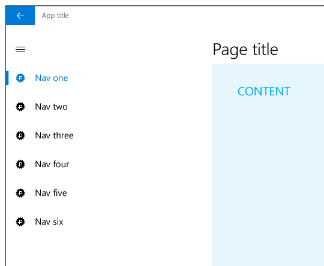

# Painéis de navegação

Um painel de navegação é um padrão que permite muitos itens de navegação de nível superior sem ocupar o espaço da tela. O painel de navegação é bastante usado em aplicativos móveis, mas também funciona bem em telas maiores. Quando usado como uma sobreposição, o painel permanece recolhido e oculto até o usuário pressionar o botão, o que é útil em telas menores. Quando usado no modo encaixado, o painel permanece aberto, o que garante maior utilidade se não houver espaço suficiente na tela.

**APIs importantes**

* [**Classe SplitView**](https://msdn.microsoft.com/library/windows/apps/dn864360)

## Este é o padrão certo?

O painel de navegação funciona bem em:

-   Aplicativos com muitos itens de navegação de nível superior que são de tipo similar. Por exemplo, um aplicativo de esportes com categorias como Futebol, Beisebol, Basquete, etc.
-   Fornecendo uma experiência de navegação consistente em todos os aplicativos. Painel de navegação deve incluir somente elementos de navegação, não ações.
-   Um número de médio a alto (entre 5 e 10, ou mais) de categorias de navegação de nível superior.
-   Preservar o estado real da tela (como uma sobreposição).
-   Itens de navegação que são acessados com pouca frequência. (como uma sobreposição).

## Criando um painel de navegação

O padrão do painel de navegação consiste em um painel para categorias de navegação, uma área de conteúdo e um botão opcional para abrir ou fechar o painel. A maneira mais fácil de criar um painel de navegação é com um [controle de modo de exibição dividido](split-view.md), que vem com um painel vazio e uma área de conteúdo que é sempre visível.

Para experimentar o código que implementa esse padrão, baixe a [Solução de navegação XAML](https://github.com/Microsoft/Windows-universal-samples/tree/master/Samples/XamlNavigation) do GitHub.

### Painel

Cabeçalhos para categorias de navegação entram no painel. Pontos de entrada para as configurações do aplicativo e o gerenciamento de contas, se aplicáveis, também entram no painel. Cabeçalhos de navegação geralmente são uma lista de itens para o usuário escolher.

### Área de conteúdo

A área de conteúdo é onde as informações do local de navegação selecionado são exibidas. Ela pode conter elementos individuais ou outra navegação de nível inferior.

### Botão

Quando presente, o botão permite aos usuários abrir e fechar o painel. O botão permanece visível em uma posição fixa e não se move com o painel. Recomendamos colocar o botão no canto superior esquerdo do seu aplicativo. O botão do painel de navegação é visualizado como três linhas horizontais empilhadas e é conhecido como o botão "hambúrguer".

O botão geralmente está associado a uma cadeia de caracteres de texto. No nível superior do aplicativo, o título do aplicativo pode ser exibido ao lado do botão. Em níveis inferiores do aplicativo, a cadeia de caracteres de texto pode ser o título da página em que o usuário está no momento.

## Variações do painel de navegação

O painel de navegação tem três modos: sobreposição, compacto e embutido. Uma sobreposição é recolhida ou expandida conforme necessário. Quando compacto, o painel sempre é exibido como um fragmento estreito que pode ser expandido. Um painel embutido permanece aberto por padrão.

### Sobreposição

-   Uma sobreposição pode ser usada em qualquer tamanho de tela e na orientação retrato ou paisagem. Em seu estado padrão (recolhido), a sobreposição não ocupa estado real, com apenas com o botão mostrado.
-   Fornece navegação sob demanda que preserva o estado real da tela. Ideal para aplicativos em telefones e phablets.
-   O painel fica oculto por padrão, somente com o botão visível.
-   Pressionar o botão do painel de navegação abre e fecha a sobreposição.
-   O estado expandido é transitório, sendo ignorado quando uma seleção é feita, quando o botão Voltar é usado ou quando o usuário toca fora do painel.
-   A sobreposição fica sobre o conteúdo e não reorganiza o conteúdo.

### Compacto

-   O modo compacto pode ser especificado como `CompactOverlay`, que sobrepõe o conteúdo quando aberto, ou `CompactInline`, que tira o conteúdo do caminho. Recomendamos usar CompactOverlay.
-   Os painéis compactos fornecem alguma indicação da localização selecionada enquanto usa uma pequena quantidade do estado real da tela.
-   Esse modo é mais adequado para telas médias como tablets.
-   Por padrão, o painel é fechado com apenas os ícones de navegação e o botão visível.
-   Pressionar o botão do painel de navegação abre e fecha o painel, que se comporta como sobreposição ou embutido dependendo do modo de exibição especificado.
-   A seleção deve ser mostrada nos ícones da lista para realçar onde o usuário está na árvore de navegação.

### Embutido

-   O painel de navegação permanece aberto. Esse modo é mais adequado para telas maiores.
-   Dá suporte a cenários de arrastar e soltar de e para o painel.
-   O botão do painel de navegação não é necessário para esse estado. Se o botão for usado, a área de conteúdo será enviada por push e o conteúdo dessa área será reorganizado.
-   A seleção deve ser mostrada nos itens da lista para realçar onde o usuário está na árvore de navegação.

## Capacidade de adaptação

Para aumentar a usabilidade em uma variedade de dispositivos, recomendamos usar [pontos de interrupção](../layout/screen-sizes-and-breakpoints-for-responsive-design.md) e ajustar o modo do painel de navegação com base na largura da sua janela de aplicativo.
-   Janela pequena
   -   Menor ou igual a 640 px de largura.
   -   O painel de navegação deve estar no modo de sobreposição, fechado por padrão.
-   Janela média
   -   Maior que 640 px e menor ou igual a 1007 px.
   -   O painel de navegação deve estar no modo de fragmento, fechado por padrão.
-   Janela grande
   -   Maior do que 1007 px.
   -   O painel de navegação deve estar no modo encaixado, aberto por padrão.

## Adaptação

Para otimizar a [experiência de 3 metros](http://go.microsoft.com/fwlink/?LinkId=760736) do seu aplicativo, considere adaptar o painel de navegação, mudando a aparência visual de seus elementos de navegação. Dependendo do contexto de interação, pode ser mais importante chamar a atenção do usuário para o item de navegação selecionado ou para o item de navegação focado. Para a experiência de 3 metros, onde o gamepad é o dispositivo de entrada mais comum, garantir que o usuário possa manter facilmente o controle do local do item atualmente focalizado na tela é particularmente importante.

## Tópicos relacionados

* [Controle de modo de exibição dividido](split-view.md)
* [Mestre/detalhes](master-details.md)
* [Noções básicas de navegação](https://msdn.microsoft.com/library/windows/apps/dn958438)
 

 
