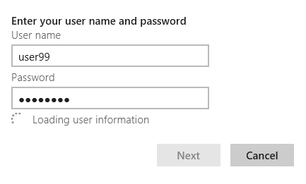
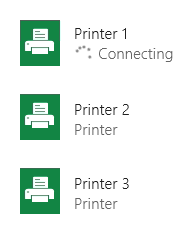

# Controles de progresso

Um controle de progresso oferece feedback ao usuário que uma operação de execução longa está em andamento. Uma barra de progresso *determinado* mostra a porcentagem de conclusão de uma operação. Uma barra de progresso *indeterminado* ou um anel de progresso mostra que uma operação está em andamento.

Um controle de progresso é apenas lido; não é interativo.

<span class="sidebar_heading" style="font-weight: bold;">APIs importantes</span>

-   [**Classe ProgressBar**](https://msdn.microsoft.com/library/windows/apps/xaml/windows.ui.xaml.controls.progressbar.aspx)
-   [**Propriedade IsIndeterminate**](https://msdn.microsoft.com/library/windows/apps/xaml/windows.ui.xaml.controls.progressbar.isindeterminate.aspx)
-   [**Classe ProgressRing**](https://msdn.microsoft.com/library/windows/apps/xaml/windows.ui.xaml.controls.progressring.aspx)
-   [**Propriedade IsActive**](https://msdn.microsoft.com/library/windows/apps/xaml/windows.ui.xaml.controls.progressring.isactive.aspx)


Aplicativo do Windows: barra de progresso indeterminado, anel de progresso e barra de progresso determinado


Aplicativo do Windows Phone: indicador do progresso da barra de status e barras de progresso

## Exemplos

Este é um exemplo de um controle de anel de progresso em uma tela inicial.


Uma barra de progresso também é um bom indicador de estado ou posição. Uma barra de progresso usada para uma faixa musical corresponde a linha do tempo da música: o valor da barra é a posição da música; o estado pausado indica que a reprodução foi pausada.


## Esse é o controle correto?

Nem sempre é necessário mostrar um controle de progresso. Às vezes, o progresso de uma tarefa é suficientemente óbvio por si só, ou a tarefa é concluída tão rapidamente que a exibição de um controle de progresso seria distrativa. Veja a seguir alguns pontos a serem considerados ao determinar se você deve mostrar um controle de progresso.

-   **A operação leva mais de dois segundos para ser concluída?**

    Em caso afirmativo, mostre um controle do progresso, assim a operação começar. Se uma operação demora mais de dois segundos para concluir na maioria das vezes, mas, às vezes, conclui em menos de dois segundos, aguarde 500ms antes de mostrar o controle para evitar cintilação.

-   **A operação está aguardando que o usuário execute uma tarefa?**

    Em caso afirmativo, não use uma barra de progresso. Barras de progresso servem para o progresso do computador, e não para progresso do usuário.

-   **O usuário precisa saber que algo está acontecendo?**

    Por exemplo, se o aplicativo está baixando alguma coisa em tela de fundo, e o usuário não iniciou o download, o usuário não precisa saber disso.

-   **A operação é uma atividade em tela de fundo que não bloqueia a atividade do usuário e é de interesse mínimo (porém existente) para o usuário?**

    Use texto e elipse quando seu aplicativo estiver executando tarefas que não precisam estar visíveis todo o tempo, mas cujo status você ainda precisa mostrar.

    

    Use elipse para indicar que a tarefa está em andamento. Se houver várias tarefas ou itens, você poderá indicar o número de tarefas restantes. Quando todas as tarefas estiverem concluídas, descarte o indicador.

-   **Você pode utilizar o conteúdo da operação para visualizar o progresso?**

    Se for o caso, não mostre um controle de progresso. Por exemplo, quando exibir/src/assets carregados a partir do disco, /src/assets aparecem na tela um por um conforme são carregados. Exibir um controle de progresso não ofereceria benefício algum, apenas bagunçaria a IU.

-   **Você pode determinar, de forma relativa, quanto do trabalho total está concluído enquanto a operação está em progresso?**

    Se sim, use uma barra de progresso determinado, especialmente para operações que bloqueiam o usuário. Use uma barra de progresso indeterminado ou um anel de progresso, de outra forma. Mesmo que tudo o que o usuário saiba é que algo está acontecendo, ainda assim é útil.

## Criar um controle de progresso determinado

Uma barra de progresso determinado mostra quanto progresso o aplicativo já fez. Conforme o trabalho progride, a barra enche. Se você puder estimar o trabalho restante em tempo, bytes, arquivos ou alguma outra unidade de medida quantificável, use uma barra de progresso determinado.

A barra de progresso determinado oferece várias propriedades para definir e determinar o progresso:
- [
              **IsIndeterminate**
            ](https://msdn.microsoft.com/library/windows/apps/xaml/windows.ui.xaml.controls.progressbar.isindeterminate.aspx): especifica se a barra de progresso é indeterminada. Defina para **false** para criar uma barra de progresso determinado.
- [
              **Minimum**
            ](https://msdn.microsoft.com/library/windows/apps/xaml/windows.ui.xaml.controls.primitives.rangebase.minimum.aspx): o início do intervalo de valores. O padrão 0.0.
- [
              **Maximum**
            ](https://msdn.microsoft.com/library/windows/apps/xaml/windows.ui.xaml.controls.primitives.rangebase.maximum.aspx): o final do intervalo de valores. O padrão é 1.0. 
- [
              **Value**
            ](https://msdn.microsoft.com/library/windows/apps/xaml/windows.ui.xaml.controls.primitives.rangebase.value.aspx): um número que especifica o progresso atual. Se você estiver mostrando o progresso do download de um arquivo, tal valor pode ser o número de bytes baixados (e, assim, defina Maximum para o número total de bytes a serem baixados).
 
O exemplo a seguir mostra uma barra de progresso determinado baseada em valor. 

```xaml
<ProgressBar IsIndeterminate="False" Maximum="100" Width="200"/>
```

```csharp
ProgressBar progressBar1 = new ProgressBar();
progressBar1.IsIndeterminate = false;
progressBar1.Maximum = 100;
progressBar1.Width = 200;

// Add the button to a parent container in the visual tree.
stackPanel1.Children.Add(progressBar1);
```

Normalmente, você não especifica o valor de uma barra de progresso na marcação. Em vez disso, usa-se um código de procedimentos ou vinculação de dados para atualizar o valor da barra de progresso como resposta a algum indicador de progresso. Por exemplo, se a sua barra de progresso indicar quantos arquivos foram baixados, atualize o valor cada vez que outro arquivo for baixado.

## Criar um controle de progresso indeterminado

Quando não puder estimar quanto trabalho falta para concluir uma tarefa e a tarefa não bloqueia a interação do usuário, use uma barra de progresso indeterminado ou anel de pregresso. Em vez de mostrar uma barra que seja preenchida conforme o progresso é concluído, uma barra de progresso indeterminado mostra uma animação de pontos movendo-se da esquerda para a direita. Um anel de progresso indeterminado mostra uma sequência de pontos movendo-se em círculo. 

Para fazer uma barra de progresso indeterminado, defina sua propriedade [**IsIndeterminate**](https://msdn.microsoft.com/library/windows/apps/xaml/windows.ui.xaml.controls.progressbar.isindeterminate.aspx) como **true**.

```xaml
<ProgressBar IsIndeterminate="True" Width="200"/>
```

```csharp
ProgressBar progressBar1 = new ProgressBar();
progressBar1.IsIndeterminate = true;
progressBar1.Width = 200;

// Add the button to a parent container in the visual tree.
stackPanel1.Children.Add(progressBar1);
```

Para mostrar um anel de progresso em seu aplicativo, defina sua propriedade [**IsActive**](https://msdn.microsoft.com/library/windows/apps/xaml/windows.ui.xaml.controls.progressring.isactive.aspx) como **true**.

```xaml
<ProgressRing IsActive="True"/>
```

```csharp
ProgressRing progressRing1 = new ProgressRing();
progressRing1.IsActive = true;

// Add the button to a parent container in the visual tree.
stackPanel1.Children.Add(progressRing1);
```

## Recomendações

-   Use a barra de progresso determinado quando uma tarefa for determinada, isto é, quando ela tiver uma duração bem definida ou um fim previsível. Por exemplo, se você puder estimar a quantidade de trabalho restante em termos de tempo, bites, arquivos ou alguma outra unidade quantificável de medida, use uma barra de progresso determinado. Eis alguns exemplos de tarefas determinadas:

    -   O aplicativo está baixando uma foto de 500 kb e recebeu 100 kb até o momento.
    -   O aplicativo está exibindo um anúncio de 15 segundos e se passaram dois segundos.

    

-   Use o anel de progresso indeterminado para tarefas que não são determinadas e são modais (bloqueiam a interação do usuário).

    

-   Use a barra de progresso indeterminado para tarefas que não são determinadas e não são modais (não bloqueiam a interação com o usuário).

    

-   Trate parcialmente tarefas modais como não modais se o estado modal durar mais que dois segundos. Algumas tarefas bloqueiam a interação até que algum progresso seja feito, e então o usuário pode começar a interagir com o aplicativo novamente. Por exemplo, quando o usuário executa uma consulta de pesquisa, a interação é bloqueada até que o primeiro resultado seja exibido. Trate tarefas como essas como não modais e utilize o estilo de barra de progresso indeterminado se o estado modal durar menos de 2 segundos. Se o estado modal puder durar mais de 2 segundos, utilize o anel de progresso indeterminado para a fase modal da tarefa e utiize a barra de progresso indeterminado para a fase não modal.
-   Considere oferecer uma forma de cancelar ou pausar a operação que está em progresso, particularmente quando o usuário for bloqueado enquanto estiver esperando a conclusão da operação e tiver uma boa ideia de por quanto a operação ainda será executada.
-   Não use o "cursor de espera" para indicar atividade, porque os usuário que usam touch para interagir com o sistema não o verão e os que usam mouse não precisam de duas formas de visualizar atividade (o cursos e o controle de progresso).
-   Mostre um controle de progresso único para múltiplas tarefas ativas relacionadas. Se houver múltiplos itens relacionados na tela que tudo estiver executando algum tipo de atividade, não mostre controles de progresso múltiplos. Em vez disso, mostre um controle que termine quando a última tarefa for concluída. Por exemplo, se o aplicativo baixar várias fotografias, mostre um único controle de progresso, em vez de mostrar um para cada foto.
-   Não altere o local nem o tamanho do controle de progresso enquanto a tarefa estiver sendo executada.

### Diretrizes para tarefas determinadas

-   Se a operação for modal (bloquear a interação com o usuário) e demorar mais de 10 segundos, ofereça uma forma de cancelá-la. A opção para cancelar deve estar disponível quando a operação começar.
-   O espaço de progresso é atualizado uniformemente. Evite situações em que o progresso aumenta além de 80% e depois para por um longo período. Você deseja agilizar o progresso até o fim, e não retardá-lo. Evite saltos drásticos, como de 0% para 90%.
-   Depois de definir o progresso como 100%, aguarde até o fim da animação da barra de progresso determinado antes de a ocultar.
-   Se a sua tarefa for interrompida (por um usuário ou condições externas), mas o usuário puder continuá-la, indique de forma visual que o progresso está pausado. Em aplicativos JavaScript, você faz isso usando o estilo CSS de Windows pausado. Em aplicativos C\#/C++/VB, você faz isso definindo a propriedade ShowPaused como verdadeira. Forneça o texto de status sob a barra de progresso que informa ao usuário o que está acontecendo.
-   Se a tarefa for parada e não puder ser continuada ou tem que ser reiniciada do começo, indique visualmente que há um erro. Em aplicativos JavaScript, você faz isso usando o estilo CSS de erro no Windows. Em aplicativos C\#/C++/VB, você faz isso definindo a propriedade ShowError como verdadeira. Substitua o texto de status (sob a barra) por uma mensagem que informa o usuário o que aconteceu e como corrigir o problema (se possível).
-   Se for necessário tempo (ou uma ação) para você poder oferecer um progresso determinado, use a barra indeterminada primeiro e depois alterne para a barra determinada. Por exemplo, se a primeira etapa de uma tarefa de download for se conectar a um servidor, você não poderá estimar quanto tempo isso irá demorar. Depois que a conexão for estabelecida, alterne para a barra de progresso determinado para mostrar o progresso do download. Mantenha a barra de progresso exatamente no mesmo lugar e com o mesmo tamanho após a alternância.

    

-   Se você tiver uma lista de itens, como de impressoras, e certas ações puderem iniciar uma operação em itens de tal lista (como instalar um driver em uma das impressoras), mostre uma barra de progresso determinado próximo ao item.

    Mostre o assunto (rótulo) da tarefa acima da barra de progresso e o status abaixo. Não forneça texto de status se o que está acontecendo for óbvio. Quando a tarefa estiver concluída, oculte a barra de progresso. Use o texto de status para comunicar o novo estado de um item.

    

-   Para mostrar uma lista de tarefas, alinhe o conteúdo em uma grade para que os usuários possam ver o status facilmente. Mostre barras de progresso para todos os itens, mesmo para aqueles que estão pendentes.

    Como o objetivo dessa lista é mostrar as operações em andamento, remova as operações da lista quando forem concluídas.

    

-   Se um usuário tiver iniciado uma tarefa a partir da barra de aplicativos e esta bloquear a interação com o usuário, mostre o controle de progresso na barra do aplicativo.

    Se estiver claro a que progresso se refere a barra de progresso, você pode alinhar a barra de progresso ao topo da barra do aplicativo e omitir o rótulo e o status. Do contrário, forneça um texto de rótulo e status.

    Para desabilitar a interação durante a tarefa, desative os controles na barra do aplicativo e ignore a entrada na área de conteúdo.

-   Não decremente o progresso. Sempre incremente o valor do progresso. Se você precisar reverter uma ação, mostre o progresso da reversão assim como mostraria o progresso de qualquer outra ação.
-   Não reinicie o progresso (de 100% a 0%), a menos que seja óbvio ao usuário que uma tarefa ou tarefa atual não é o última. Por exemplo, suponha que uma tarefa tenha duas partes: download de alguns dados e, em seguida, processar e exibir os dados. Quando o download for concluído, redefina a barra de progresso como 0% e comece a mostrar o progresso do processamento dos dados. Se não estiver claro para os usuários que há várias etapas em uma tarefa, recolha as tarefas em uma única escala 0-100% e atualize o texto de status conforme passa de uma tarefa para outra.

### Diretrizes para tarefas modais, indeterminadas que usam o anel de progresso

-   Exiba o anel de progresso no contexto da ação: mostre-o próximo à localização onde o usuário iniciou a ação ou onde os dados resultantes serão exibidos.
-   Forneça o texto de status à direita do anel de progresso.
-   Deixe o anel de progresso com a mesma cor do texto de status.
-   Desabilite os controles com os quais o usuário não deve interagir enquanto a tarefa estiver sendo executada.
-   Se a tarefa resultar em um erro, oculte o indicador de progresso e o texto de status e exiba uma mensagem de erro em seu lugar.
-   Em uma caixa de diálogo, se uma operação deve ser concluída antes de você passar para a próxima tela, posicione o anel de progresso bem acima da área de botões, alinhado à esquerda com o conteúdo da caixa de diálogo.

    

-   Em uma janela do aplicativo com controles alinhados à direita, coloque o anel de progresso à esquerda ou logo acima do controle que causou a ação. Alinhe o anel de progresso com o conteúdo relacionado.

    

-   Em uma janela de aplicativo com controle alinhados à esquerda, posicione o anel de progresso à direita ou bem abaixo do controle que causou a ação.

    

    

-   Se você estiver exibindo vários itens, posicione o anel de progresso e o texto de status abaixo do título do item. Se ocorrer um erro, substitua o anel de progresso e o texto de status com texto de erro.

    

### Diretrizes para tarefas não modais, indeterminadas que usem a barra de progresso

-   Se você mostrar progresso em um submenu, coloque a barra de progresso indeterminado na parte superior do submenu e defina sua largura de forma que ela abranja todo o submenu. Esse posicionamento minimiza a distração, mas ainda comunica a atividade em andamento. Não dê um título para o submenu, porque um título impede que você coloque a barra de progresso na parte superior do submenu.

    

-   Se você mostrar progresso em uma janela de aplicativo, posicione a barra de progresso indeterminado no topo da janela de aplicativo, ocupando toda a janela.

    

### Diretrizes para texto de status

-   Ao usar a barra de progresso determinado, não mostre a porcentagem de progresso no texto de status. O controle já fornece essas informações.
-   Se você usar texto para indicar atividade sem um controle de progresso, use elipses para transmitir que a atividade está em andamento.
-   Se você usar um controle de progresso, não utilize elipses no texto de status, pois o controle de progresso já indica que a operação está em andamento.

### Diretrizes para aparência e layout

-   Uma barra de progresso determinado aparece como uma barra colorida que cresce para preencher uma barra cinza em segundo plano. A proporção do comprimento total colorido indica, de forma relativa, quanto da operação está concluído.
-   Uma barra de progresso indeterminado ou um toque de processo é feito a partir de pontos coloridos em movimento contínuo.
-   Escolha a localização do controle de progresso e proeminência com base em sua importância.

    Controles importantes de progresso podem servir como um plano de ação, dizendo ao usuário para continuar uma determinada operação após o sistema ter realizado seu trabalho. Alguns aplicativos internos do Windows Phone usam o indicador de progresso da barra de status na parte superior da tela para casos importantes. Você pode fazer isso também e configurá-los para serem determinados ou indeterminados.

    Casos que forem menos críticos, como durante o download, aparecem menores e são restritos a uma visualização.

-   Use o rótulo para mostrar o valor do progresso ou descrever o progresso em andamento ou para indica que a operação foi interrompida. Um rótulo é opcional, mas é altamente recomendável.

    Para descrever o progresso em andamento, use gerúndio (um verbo com o final ndo),por exemplo, "conectando", "baixando" ou "enviando".

    Para indicar se o progresso está pausado ou encontrou uma exceção, um particípio passado, por exemplo, "pausado", "falha no arquivo baixado" ou "cancelado".

-   Determinar barra de progresso com rótulo e status

    

-   Várias barras de progresso

    

-   Anel de progresso indeterminado com texto de status

    

-   Barra de progresso indeterminado

    

## Diretrizes de uso adicionais

### Árvore de decisões para escolher um estilo de progresso

-   **O usuário precisa saber que algo está acontecendo?**

    Se a resposta for não, não mostre um controle de progresso.

-   **A informação sobre o tempo necessário para concluir a tarefa está disponível?**
    -   **Sim:**
             **a tarefa leva mais de dois segundos para ser concluída?**
        -   **Sim:** use uma barra de progresso determinado. Para tarefas que levam mais de 10 segundos, ofereça uma maneira de cancelar a tarefa.
        -   **Não:** não mostre um controle de progresso.

    -   **Não:**
             **os usuários são impedidos de interagir com a IU até que a tarefa seja concluída?**
        -   **Sim:** **essa tarefa é parte de um processo de várias etapas em que o usuário precisa saber detalhes específicos sobre a operação?**
            -   **Sim:** use um anel de progresso indeterminado com texto de status centralizado horizontalmente na tela.
            -   **Não:** use um anel de progresso indeterminado sem texto no centro da tela.
        -   **Não:**
             **é uma atividade primária?**
            -   **Sim:**
             **o progresso está relacionado a apenas um elemento específico da IU?**
                -   **Sim:** use um anel de progresso indeterminado embutido com texto de status próximo ao elemento de IU a que se refere.
                -   **Não:**
            **há uma quantidade grande de dados sendo carregados em uma lista?**
                    -   **Sim:** use a barra de progresso indeterminado no topo com espaços reservados para representar conteúdo recebido.
                    -   **Não:** use a barra de progresso indeterminado no topo da tela ou superfície.
            -   **Não:** use texto de status no canto superior da tela.

## Artigos relacionados


- [**Classe ProgressBar**](https://msdn.microsoft.com/library/windows/apps/br227529)
- [**Classe ProgressRing**](https://msdn.microsoft.com/library/windows/apps/br227538)

**Para desenvolvedores (XAML)**
- [Adicionando controles de progresso](https://msdn.microsoft.com/library/windows/apps/xaml/hh780651)
- [Como criar uma barra de progresso indeterminado personalizada para Windows Phone](http://go.microsoft.com/fwlink/p/?LinkID=392426)


<!--HONumber=Jun16_HO4-->


