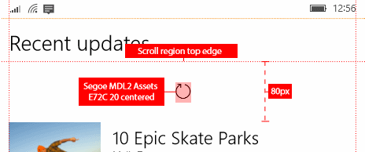

# <a name="pull-to-refresh"></a>Puxar para atualizar

<link rel="stylesheet" href="https://az835927.vo.msecnd.net/sites/uwp/Resources/css/custom.css"> 

O padrão puxar para atualizar permite a um usuário extrair uma lista de dados com toque para recuperar mais dados. O padrão puxar para atualizar é amplamente usado em aplicativos móveis, mas é útil em qualquer dispositivo com tela touch. Você pode manipular [eventos de manipulação](../input-and-devices/touch-interactions.md#manipulation-events) implementar o padrão puxar para atualizar em seu aplicativo.

> **APIs importantes**: [classe ListView](https://msdn.microsoft.com/library/windows/apps/windows.ui.xaml.controls.listview.aspx), [classe GridView](https://msdn.microsoft.com/library/windows/apps/windows.ui.xaml.controls.gridview.aspx)

O [exemplo de puxar para atualizar](http://go.microsoft.com/fwlink/p/?LinkId=620635) mostra como estender um controle [ListView](https://msdn.microsoft.com/library/windows/apps/windows.ui.xaml.controls.listview.aspx) para dar suporte a esse padrão. Neste artigo, usamos este exemplo para explicar os pontos-chave da implementação do padrão puxar para atualizar.


## <a name="is-this-the-right-pattern"></a>Este é o padrão certo?

Use o padrão puxar para atualizar quando você tiver uma lista ou uma grade de dados que o usuário talvez queira atualizar regularmente, e é provável que seu aplicativo seja executado em dispositivos móveis touch-first.

## <a name="implement-pull-to-refresh"></a>Implementar o padrão puxar para atualizar

Para implementar o padrão puxar para atualizar, você precisa manipular eventos de manipulação para detectar quando um usuário extraiu a lista, fornecer feedback visual e atualizar os dados. Aqui, analisaremos como isso é feito [exemplo do padrão puxar para atualizar](http://go.microsoft.com/fwlink/p/?LinkId=620635). Não mostramos o código aqui, portanto, você deve baixar o exemplo ou exibir o código em GitHub.

O exemplo de puxar para atualizar cria um controle personalizado chamado `RefreshableListView` que estende o controle **ListView**. Esse controle adiciona um indicador de atualização para fornecer feedback visual e manipula os eventos de manipulação no visualizador de rolagem interno da exibição de lista. Ele também adiciona dois eventos para notificar você quando a lista é extraída e quando os dados devem ser atualizados. RefreshableListView fornece apenas a notificação de que os dados devem ser atualizados. Você precisa manipular o evento em seu aplicativo para atualizar os dados, e esse código será diferente para cada aplicativo.

RefreshableListView fornece um modo de "atualização automática" que determina quando a atualização é solicitada e quando o indicador de atualização sai da exibição. A atualização automática pode estar ativada ou desativada.
- Desativada: uma atualização só será solicitada se a lista for liberada ao ultrapassar `PullThreshold`. O indicador sai da exibição quando o usuário libera o controle de rolagem. O indicador de barra de status será mostrado se ele estiver disponível (no telefone).
- Ativada: uma atualização é solicitada assim que o `PullThreshold` é excedido, esteja ou não liberado. O indicador permanece na exibição até os novos dados serem recuperados e, em seguida, sai da exibição. Um objeto **Deferral** é usado para notificar o aplicativo quando a busca dos dados é concluída.

> **Observação**&nbsp;&nbsp;O código no exemplo também é aplicável a um [GridView](https://msdn.microsoft.com/library/windows/apps/windows.ui.xaml.controls.gridview.aspx). Para modificar um GridView, gere a classe personalizada de GridView em vez de ListView e modifique o modelo padrão de GridView.

## <a name="add-a-refresh-indicator"></a>Adicionar um indicador de atualização

É importante fornecer feedback visual ao usuário para que ele saiba que seu aplicativo dá suporte ao padrão puxar para atualizar. RefreshableListView tem uma propriedade `RefreshIndicatorContent` que permite definir o indicador visual no XAML. Ele também inclui um indicador de texto padrão que será usado se você não definir o `RefreshIndicatorContent`.

Veja a seguir as diretrizes recomendadas para o indicador de atualização.



**Modificar o modelo de exibição de lista**

No exemplo do padrão puxar para atualizar, o modelo do controle `RefreshableListView` modifica o modelo **ListView** padrão adicionando um indicador de atualização. O indicador de atualização é colocado em uma [Grade](https://msdn.microsoft.com/library/windows/apps/windows.ui.xaml.controls.grid.aspx) acima do [ItemsPresenter](https://msdn.microsoft.com/library/windows/apps/windows.ui.xaml.controls.itemspresenter.aspx), que é a parte que mostra os itens da lista.

> **Observação**&nbsp;&nbsp;A caixa de texto `DefaultRefreshIndicatorContent` fornece um indicador de fallback de texto que só será mostrado se a propriedade `RefreshIndicatorContent` não for definida	.

Veja a seguir a parte do modelo de controle que é modificada do modelo padrão ListView.

**XAML**
```xaml
<!-- Styles/Styles.xaml -->
<Grid x:Name="ScrollerContent" VerticalAlignment="Top">
    <Grid.RowDefinitions>
        <RowDefinition Height="Auto"/>
        <RowDefinition Height="*"/>
        <RowDefinition Height="Auto"/>
    </Grid.RowDefinitions>
    <Border x:Name="RefreshIndicator" VerticalAlignment="Top" Grid.Row="1">
        <Grid>
            <TextBlock x:Name="DefaultRefreshIndicatorContent" HorizontalAlignment="Center" 
                       Foreground="White" FontSize="20" Margin="20, 35, 20, 20"/>
            <ContentPresenter Content="{TemplateBinding RefreshIndicatorContent}"></ContentPresenter>
        </Grid>
    </Border>
    <ItemsPresenter FooterTransitions="{TemplateBinding FooterTransitions}" 
                    FooterTemplate="{TemplateBinding FooterTemplate}" 
                    Footer="{TemplateBinding Footer}" 
                    HeaderTemplate="{TemplateBinding HeaderTemplate}" 
                    Header="{TemplateBinding Header}" 
                    HeaderTransitions="{TemplateBinding HeaderTransitions}" 
                    Padding="{TemplateBinding Padding}"
                    Grid.Row="1"
                    x:Name="ItemsPresenter"/>
</Grid>
```

**Definir o conteúdo em XAML**

Você pode definir o conteúdo do indicador de atualização no XAML para a exibição de lista. O conteúdo XAML que você definir é exibido pelo [ContentPresenter](https://msdn.microsoft.com/library/windows/apps/windows.ui.xaml.controls.contentpresenter.aspx) (`<ContentPresenter Content="{TemplateBinding RefreshIndicatorContent}">`) do indicador de atualização. Se você não definir esse conteúdo, o indicador de texto padrão será mostrado.

**XAML**
```xaml
<!-- MainPage.xaml -->
<c:RefreshableListView
    <!-- ... See sample for removed code. -->
    AutoRefresh="{x:Bind Path=UseAutoRefresh, Mode=OneWay}"
    ItemsSource="{x:Bind Items}"
    PullProgressChanged="listView_PullProgressChanged"
    RefreshRequested="listView_RefreshRequested">

    <c:RefreshableListView.RefreshIndicatorContent>
        <Grid Height="100" Background="Transparent">
            <FontIcon
                Margin="0,0,0,30"
                HorizontalAlignment="Center"
                VerticalAlignment="Bottom"
                FontFamily="Segoe MDL2 Assets"
                FontSize="20"
                Glyph="&#xE72C;"
                RenderTransformOrigin="0.5,0.5">
                <FontIcon.RenderTransform>
                    <RotateTransform x:Name="SpinnerTransform" Angle="0" />
                </FontIcon.RenderTransform>
            </FontIcon>
        </Grid>
    </c:RefreshableListView.RefreshIndicatorContent>
    
    <!-- ... See sample for removed code. -->

</c:RefreshableListView>
```

**Animar o controle giratório**

Quando a lista é extraída, ocorre o evento `PullProgressChanged` do RefreshableListView. Você pode manipular esse evento em seu aplicativo para controlar o indicador de atualização. No exemplo, este storyboard é iniciado para animar o [RotateTransform](https://msdn.microsoft.com/library/windows/apps/windows.ui.xaml.media.rotatetransform.aspx) do indicador e girar o indicador de atualização. 

**XAML**
```xaml
<!-- MainPage.xaml -->
<Storyboard x:Name="SpinnerStoryboard">
    <DoubleAnimation
        Duration="00:00:00.5"
        FillBehavior="HoldEnd"
        From="0"
        RepeatBehavior="Forever"
        Storyboard.TargetName="SpinnerTransform"
        Storyboard.TargetProperty="Angle"
        To="360" />
</Storyboard>
```

## <a name="handle-scroll-viewer-manipulation-events"></a>Manipular eventos de manipulação do visualizador de rolagem

O modelo de controle de exibição de lista inclui um [ScrollViewer](https://msdn.microsoft.com/library/windows/apps/windows.ui.xaml.controls.scrollviewer.aspx) interno que permite ao usuário percorrer os itens da lista. Para implementar o padrão puxar para atualizar, você precisa manipular os eventos de manipulação no visualizador de rolagem integrado, bem como vários eventos relacionados. Para saber mais sobre eventos de manipulação, consulte [Interações por toque](../input-and-devices/touch-interactions.md).

** OnApplyTemplate**

Para obter acesso ao visualizador de rolagem e outras partes do modelo a fim de adicionar manipuladores de eventos e chamá-los posteriormente em seu código, é necessário substituir o método [OnApplyTemplate](https://msdn.microsoft.com/library/windows/apps/windows.ui.xaml.frameworkelement.onapplytemplate.aspx). Em OnApplyTemplate, chame [GetTemplateChild](https://msdn.microsoft.com/library/windows/apps/windows.ui.xaml.controls.control.gettemplatechild.aspx) para obter uma referência a uma parte nomeada no modelo de controle, que você pode salvar para usar posteriormente em seu código.

No exemplo, as variáveis usadas para armazenar as partes do modelo são declaradas na região Variáveis Particulares. Depois que eles são recuperados no método OnApplyTemplate, os manipuladores de eventos são adicionados aos eventos [DirectManipulationStarted](https://msdn.microsoft.com/library/windows/apps/windows.ui.xaml.controls.scrollviewer.directmanipulationstarted.aspx), [DirectManipulationCompleted](https://msdn.microsoft.com/library/windows/apps/windows.ui.xaml.controls.scrollviewer.directmanipulationcompleted.aspx), [ViewChanged](https://msdn.microsoft.com/library/windows/apps/windows.ui.xaml.controls.scrollviewer.viewchanged.aspx) e [PointerPressed](https://msdn.microsoft.com/library/windows/apps/windows.ui.xaml.uielement.pointerpressed.aspx).

**DirectManipulationStarted**

Para iniciar uma ação de puxar para atualizar, é necessário rolar o conteúdo para a parte superior do visualizador de rolagem quando o usuário inicia a extração. Caso contrário, presume-se que o usuário esteja efetuando pull para fazer um movimento panorâmico na lista. O código nesse manipulador determina se a manipulação foi iniciada com o conteúdo na parte superior do visualizador de rolagem e pode resultar na atualização da lista. O status "atualizável" do controle é definido corretamente. 

Se for possível atualizar o controle, os manipuladores de eventos para as animações também serão adicionados.

**DirectManipulationCompleted**

Quando o usuário para de extrair a lista, o código nesse manipulador verifica se uma atualização foi ativada durante a manipulação. Se uma atualização foi ativada, o evento `RefreshRequested` será gerado e o comando `RefreshCommand` será executado.

Os manipuladores de eventos para animações também serão removidos.

Com base no valor da propriedade `AutoRefresh`, a lista pode voltar para cima imediatamente ou aguardar até que a atualização seja concluída e, em seguida, voltar para cima. Um objeto [Deferral](https://msdn.microsoft.com/library/windows/apps/windows.foundation.deferral.aspx) é usado para marcar a conclusão da atualização. Nesse ponto, o indicador de atualização da interface do usuário fica oculto.

Essa parte do manipulador de eventos DirectManipulationCompleted aciona o evento `RefreshRequested` e, se necessário, obtém o objeto Deferral.

**C#**
```csharp
if (this.RefreshRequested != null)
{
    RefreshRequestedEventArgs refreshRequestedEventArgs = new RefreshRequestedEventArgs(
        this.AutoRefresh ? new DeferralCompletedHandler(RefreshCompleted) : null);
    this.RefreshRequested(this, refreshRequestedEventArgs);
    if (this.AutoRefresh)
    {
        m_scrollerContent.ManipulationMode = ManipulationModes.None;
        if (!refreshRequestedEventArgs.WasDeferralRetrieved)
        {
            // The Deferral object was not retrieved in the event handler.
            // Animate the content up right away.
            this.RefreshCompleted();
        }
    }
}
```

**ViewChanged**

Dois casos são tratados no manipulador de eventos ViewChanged.

Primeiro, se a exibição for alterada devido ao zoom do visualizador de rolagem, o status "atualizável" do controle será cancelado.

Segundo, se o conteúdo terminar a animação no final de uma atualização automática, os retângulos de preenchimento ficarão ocultos, as interações por toque com o visualizador de rolagem serão reativados e o [VerticalOffset](https://msdn.microsoft.com/library/windows/apps/windows.ui.xaml.controls.scrollviewer.verticaloffset.aspx) será definido como 0.

**PointerPressed**

A ação de puxar para atualizar só ocorre quando a lista é extraída por uma manipulação por toque. No manipulador de eventos PointerPressed, o código verifica qual tipo de ponteiro causou o evento e define uma variável (`m_pointerPressed`) para indicar se era um ponteiro de toque. Essa variável é usada no manipulador de eventos DirectManipulationStarted. Se o ponteiro não for um ponteiro de toque, o manipulador de eventos DirectManipulationStarted retornará sem fazer nada.

## <a name="add-pull-and-refresh-events"></a>Adicionar eventos de puxar e atualizar

"RefreshableListView" adiciona dois eventos que você pode manipular em seu aplicativo para atualizar os dados e gerenciar o indicador de atualização.

Para saber mais sobre eventos, consulte [Visão geral de eventos e eventos roteados](https://msdn.microsoft.com/windows/uwp/xaml-platform/events-and-routed-events-overview).

**RefreshRequested**

O evento "RefreshRequested" avisa o aplicativo que o usuário efetuou pull na lista para atualizá-la. Você manipula esse evento para buscar novos dados e atualizar sua lista.

Veja a seguir o manipulador de eventos do exemplo. O importante a observar é que ele verifica a propriedade `AutoRefresh` da exibição de lista e se for **true** obterá um objeto Deferral. Com um objeto Deferral, o indicador de atualização não é interrompido e não fica oculto até a atualização ser concluída.

**C#**
```csharp
private async void listView_RefreshRequested(object sender, RefreshableListView.RefreshRequestedEventArgs e)
{
    using (Deferral deferral = listView.AutoRefresh ? e.GetDeferral() : null)
    {
        await FetchAndInsertItemsAsync(_rand.Next(1, 5));

        if (SpinnerStoryboard.GetCurrentState() != Windows.UI.Xaml.Media.Animation.ClockState.Stopped)
        {
            SpinnerStoryboard.Stop();
        }
    }
}
```

**PullProgressChanged**

No exemplo, o conteúdo para o indicador de atualização é fornecido e controlado pelo aplicativo. O evento "PullProgressChanged" avisa seu aplicativo quando o usuário está efetuando pull na lista para que você possa iniciar, parar e redefinir o indicador de atualização. 

## <a name="composition-animations"></a>Animações de composição

Por padrão, o conteúdo em um visualizador de rolagem é interrompido quando a barra de rolagem atinge a parte superior. Para permitir que o usuário continue a extrair a lista, você precisa acessar a camada visual e animar o conteúdo da lista. O exemplo usa [animações de composição](https://msdn.microsoft.com/windows/uwp/composition/composition-animation) para isso. Especificamente, [animações de expressão](https://msdn.microsoft.com/windows/uwp/composition/composition-animation#expression-animations).

No exemplo, esse trabalho é feito principalmente no manipulador de eventos `CompositionTarget_Rendering` e no método`UpdateCompositionAnimations`.

## <a name="related-articles"></a>Artigos relacionados

- [Aplicando estilos a controles](styling-controls.md)
- [Interações por toque](../input-and-devices/touch-interactions.md)
- [Exibição de lista e exibição de grade](listview-and-gridview.md)
- [Modelos de item de exibição de lista](listview-item-templates.md)
- [Animações de expressão](https://msdn.microsoft.com/windows/uwp/composition/composition-animation#expression-animations)