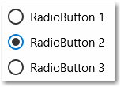
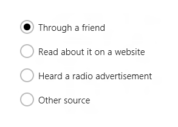

# Botões de opção
Botões de opção permitem que os usuários selecionem uma opção entre duas ou mais escolhas. Cada opção é representada por um botão de opção; um usuário pode selecionar apenas um botão de opção em um grupo de botões de opção.

(Se você tem curiosidade em saber a origem do nome, os botões de opção, também conhecidos como botões de rádio, receberam esse nome por causa dos botões predefinidos de canais em um rádio.



<span class="sidebar_heading" style="font-weight: bold;">APIs importantes</span>

-   [**Classe RadioButton**](https://msdn.microsoft.com/library/windows/apps/br227544)
-   [**Evento Checked**](https://msdn.microsoft.com/library/windows/apps/windows.ui.xaml.controls.primitives.togglebutton.checked.aspx)
-   [**Propriedade IsChecked**](https://msdn.microsoft.com/library/windows/apps/windows.ui.xaml.controls.primitives.togglebutton.ischecked.aspx)

## Esse é o controle correto?

Use botões de opção para apresentar aos usuários duas ou mais opções mutuamente exclusivas, conforme ilustrado aqui.


Os botões acrescentam claridade e peso a opções importantes em seu aplicativo. Use botões de opção quando as opções sendo apresentadas forem importantes o bastante para comandar mais espaço na tela e em que a claridade da escolha demande opções muito explícitas.

Os botões de opção enfatizam todas as opções da mesma forma e isso pode chamar mais atenção para as opções que o necessário. Considere usar outros controles, a menos que as opções mereçam atenção adicional do usuário. Por exemplo, se a opção padrão for recomendada para a maioria dos usuários na maioria das situações, use uma [lista suspensa](lists.md).

Se houver apenas duas opções mutuamente exclusivas, combine-as em uma única [caixa de seleção](checkbox.md) ou [botão de alternância](toggles.md). Por exemplo, use uma caixa de seleção para "Concordo" em vez de dois botões de opção para "Concordo" e "Não concordo".


Quando o usuário puder selecionar várias opções, use um controle de [caixa de seleção](checkbox.md) ou [caixa de listagem](lists.md).


Não use botões de opção quando as opções forem números que possuem etapas fixas, como 10, 20, 30. Em vez disso, use um controle [deslizante](slider.md).

Se houver mais que oito opções, use uma [lista suspensa](lists.md), uma [caixa de listagem](lists.md) de seleção única ou uma [caixa de listagem](lists.md) em vez disso.

Se as opções disponíveis estiverem baseadas no contexto atual do aplicativo ou, de outra forma, variar dinamicamente use uma [caixa de listagem](lists.md) de seleção única em vez disso.

## Exemplo
Botões de opção nas configurações do navegador Microsoft Edge.


## Criar um botão de opção

Botões de opção funcionam em grupos. Há 2 maneiras de agrupar controles de botão de opção:
- Colocá-los dentro do mesmo contêiner pai.
- Defina a propriedade [**GroupName**](https://msdn.microsoft.com/library/windows/apps/windows.ui.xaml.controls.radiobutton.groupname.aspx) em cada botão de opção como o mesmo valor.

> **Observação**
            &nbsp;&nbsp;Um grupo de botões de opção se comportam como um controle único quando acessados pelo teclado. Apenas a opção selecionada pode ser acessada usando a tecla Tab, mas os usuários podem alternar pelo grupo usando as teclas de seta.

Neste exemplo, o primeiro grupo de botões de opção é implicitamente agrupado por estar no painel empilhado. O segundo grupo é dividido entre 2 painéis empilhados e, portanto, são explicitamente agrupados por GroupName.

```xaml
<StackPanel>
    <StackPanel>
        <TextBlock Text="Background" Style="{ThemeResource BaseTextBlockStyle}"/>
        <StackPanel Orientation="Horizontal">
            <RadioButton Content="Green" Tag="Green" Checked="BGRadioButton_Checked"/>
            <RadioButton Content="Yellow" Tag="Yellow" Checked="BGRadioButton_Checked"/>
            <RadioButton Content="Blue" Tag="Blue" Checked="BGRadioButton_Checked"/>
            <RadioButton Content="White" Tag="White" Checked="BGRadioButton_Checked" IsChecked="True"/>
        </StackPanel>
    </StackPanel>
    <StackPanel>
        <TextBlock Text="BorderBrush" Style="{ThemeResource BaseTextBlockStyle}"/>
        <StackPanel Orientation="Horizontal">
            <StackPanel>
                <RadioButton Content="Green" GroupName="BorderBrush" Tag="Green" Checked="BorderRadioButton_Checked"/>
                <RadioButton Content="Yellow" GroupName="BorderBrush" Tag="Yellow" Checked="BorderRadioButton_Checked" IsChecked="True"/>
            </StackPanel>
            <StackPanel>
                <RadioButton Content="Blue" GroupName="BorderBrush" Tag="Blue" Checked="BorderRadioButton_Checked"/>
                <RadioButton Content="White" GroupName="BorderBrush" Tag="White"  Checked="BorderRadioButton_Checked"/>
            </StackPanel>
        </StackPanel>
    </StackPanel>
    <Border x:Name="BorderExample1" BorderThickness="10" BorderBrush="#FFFFD700" Background="#FFFFFFFF" Height="50" Margin="0,10,0,10"/>
</StackPanel>
```

```csharp
private void BGRadioButton_Checked(object sender, RoutedEventArgs e)
{
    RadioButton rb = sender as RadioButton;

    if (rb != null && BorderExample1 != null)
    {
        string colorName = rb.Tag.ToString();
        switch (colorName)
        {
            case "Yellow":
                BorderExample1.Background = new SolidColorBrush(Colors.Yellow);
                break;
            case "Green":
                BorderExample1.Background = new SolidColorBrush(Colors.Green);
                break;
            case "Blue":
                BorderExample1.Background = new SolidColorBrush(Colors.Blue);
                break;
            case "White":
                BorderExample1.Background = new SolidColorBrush(Colors.White);
                break;
        }
    }
}

private void BorderRadioButton_Checked(object sender, RoutedEventArgs e)
{
    RadioButton rb = sender as RadioButton;

    if (rb != null && BorderExample1 != null)
    {
        string colorName = rb.Tag.ToString();
        switch (colorName)
        {
            case "Yellow":
                BorderExample1.BorderBrush = new SolidColorBrush(Colors.Gold);
                break;
            case "Green":
                BorderExample1.BorderBrush = new SolidColorBrush(Colors.DarkGreen);
                break;
            case "Blue":
                BorderExample1.BorderBrush = new SolidColorBrush(Colors.DarkBlue);
                break;
            case "White":
                BorderExample1.BorderBrush = new SolidColorBrush(Colors.White);
                break;
        }
    }
}
```

Os grupos de botões de opção têm a seguinte aparência.


Um botão de opção tem dois estados: *marcado* ou *desmarcado*. Quando um botão de opção está marcado, sua propriedade [**IsChecked**](https://msdn.microsoft.com/library/windows/apps/windows.ui.xaml.controls.primitives.togglebutton.ischecked.aspx) é **true**. Quando um botão de opção está desmarcado, sua propriedade **IsChecked** é **false**. Um botão de opção pode ser desmarcado clicando em outro botão de opção no mesmo grupo, mas não pode ser desmarcado com um novo clique nele. No entanto, você pode desmarcar um botão de opção programaticamente, definindo sua propriedade IsChecked como **false**.

## Recomendações

-   Certifique-se de que a finalidade e o estado atual de um conjunto de botões de opção seja clara.
-   Sempre faça um comentário visual quando o usuário tocar um botão de opção.
-   Dê o comentário visual conforme o usuário interagir com os botões de opção. Normal, pressionado, verificado e desativado são exemplos de estados do botão de opção. Um usuário toca em botões de opção para ativar a opção relacionada. Tocar em uma opção ativada não a desativa, mas tocar em outra opção transfere a ativação àquela opção.
-   Reserve efeitos visuais e animações para o comentário de toque e para o estado verificado; no estado não verificado, os controles do botão de opção devem aparecer como não usados ou inativos (mas não desativados).
-   Limite o conteúdo em texto do botão de opção para uma única linha. Você pode personalizar os elementos visuais do botão de opção para exibir uma descrição da opção em uma fonte em tamanho menos abaixo da linha principal do texto.
-   Se o conteúdo do texto for dinâmico, considere como o botão redimensionará e o que acontecerá com os elementos visuais ao redor dele.
-   Use fonte padrão, a menos que as diretrizes da marca o orientem de outra forma.
-   Inclua o botão de opção em um elemento de rótulo para que o toque no rótulo selecione o botão de opção.
-   Coloque o texto do rótulo após o botão de opção, não antes ou acima dele.
-   Considere personalizar seus botões de opção. Por padrão, um botão de opção consiste em dois círculos concêntricos, o de dentro preenchido (e mostrado quando o botão de opção for assinalado) e o de fora com um traço, e com algum conteúdo em texto. Incentivamos a criatividade. Os usuários se sentem confortáveis ao interagir diretamente com o conteúdo de um aplicativo. Portanto, você pode escolher mostrar o conteúdo real em aberto, seja apresentado em gráficos ou com botões de alternância de texto sutis.
-   Não coloque mais que oito opções em um grupo de botão de opção. Quando for necessário apresentar mais opções, use uma [lista suspensa](lists.md), [caixa de listagem](lists.md)ou um [modo de exibição de lista](lists.md) em vez disso.
-   Não coloque dois grupos de botão de opção próximos um do outro. Quando dois grupos de botão de opção estão próximos um do outro é difícil determinar quais botões pertencem a qual grupo. Use rótulos de grupos para separá-los.

## Diretriz de uso adicional

Esta ilustração mostra a maneira correta de posicionar e espaçar os botões de opção.


## Tópicos relacionados

**Para designers**
- [Diretrizes de botões](buttons.md)
- [Diretrizes de botões de alternância](toggles.md)
- [Diretrizes de caixas de seleção](checkbox.md)
- [Diretrizes para listas suspensas](lists.md)
- [Diretrizes para modo de exibição de lista e controles de exibição de grade](lists.md)
- [Diretrizes de controles deslizantes](slider.md)
- [Diretrizes do controle de seleção](lists.md)


**Para desenvolvedores (XAML)**
- [**Classe Windows.UI.Xaml.Controls RadioButton**](https://msdn.microsoft.com/library/windows/apps/br227544)


<!--HONumber=May16_HO2-->


