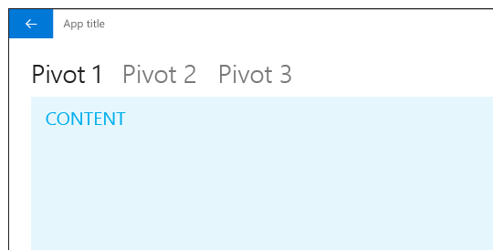
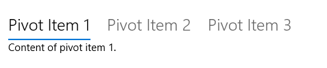
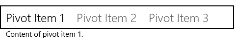

# <a name="pivot-and-tabs"></a>Guias e pivôs

<link rel="stylesheet" href="https://az835927.vo.msecnd.net/sites/uwp/Resources/css/custom.css"> 

O controle Pivô e o padrão de guias relacionadas são usados para navegar em categorias de conteúdo distintas, acessadas com frequência. Os pivôs possibilitam a navegação entre dois ou mais painéis de conteúdo e dependem de cabeçalhos de texto para articular as diferentes seções de conteúdo.



As guias são uma variante visual do Pivô que usam uma combinação de ícones e texto ou apenas ícones para articular o conteúdo da seção. As guias são criadas usando-se o controle [**Pivot**](https://msdn.microsoft.com/library/windows/apps/xaml/windows.ui.xaml.controls.pivot.aspx). A [**amostra Pivot**](http://go.microsoft.com/fwlink/p/?LinkId=619903) mostra como personalizar o controle Pivot segundo o padrão das guias.

<div class="important-apis" >
<b>APIs importantes</b><br/>
<ul>
<li>[**Classe Pivot**](https://msdn.microsoft.com/library/windows/apps/dn608241)</li>
</ul>
</div>


## <a name="the-pivot-pattern"></a>O padrão de pivô

Durante a compilação de um app usando-se um pivô, há algumas variáveis de design importantes a serem levadas em consideração.

- **Rótulos do cabeçalho.**  Cabeçalhos podem ter um ícone com texto, somente ícone ou somente texto.
- **Alinhamento do cabeçalho.**  Cabeçalhos podem ser justificados à esquerda ou centralizados.
- **Navegação de nível superior ou inferior.**  Pivôs podem ser usados em qualquer nível de navegação. O [painel de navegação](nav-pane.md) também pode servir como o nível principal com pivôs funcionando como o nível secundário.
- **Suporte a gestos de toque.**  Para dispositivos que deem suporte a gestos de toque, é possível usar um dos dois conjuntos de interação para navegar entre as categorias de conteúdo:
    1. Toque em um cabeçalho de guia/pivô para navegar para a categoria.
    2. Passe o dedo para a esquerda ou direita na área de conteúdo para navegar para a categoria adjacente.

## <a name="examples"></a>Exemplos

Controle de pivô no telefone.


Padrão de guias no aplicativo Alarmes e Relógio.


## <a name="create-a-pivot-control"></a>Criar um controle de pivô

O controle [**Pivot**](https://msdn.microsoft.com/library/windows/apps/xaml/windows.ui.xaml.controls.pivot.aspx) é fornecido com a funcionalidade básica descrita nesta seção.

Este XAML cria um controle de pivô básico com três seções de conteúdo.

```xaml
<Pivot x:Name="rootPivot" Title="Pivot Title">
    <PivotItem Header="Pivot Item 1">
        <!--Pivot content goes here-->
        <TextBlock Text="Content of pivot item 1."/>
    </PivotItem>
    <PivotItem Header="Pivot Item 2">
        <!--Pivot content goes here-->
        <TextBlock Text="Content of pivot item 2."/>
    </PivotItem>
    <PivotItem Header="Pivot Item 3">
        <!--Pivot content goes here-->
        <TextBlock Text="Content of pivot item 3."/>
    </PivotItem>
</Pivot>
```

### <a name="pivot-items"></a>Item de pivô

Pivô é um [**ItemsControl**](https://msdn.microsoft.com/library/windows/apps/xaml/windows.ui.xaml.controls.itemscontrol.aspx) e, por isso, pode conter uma coleção de itens de qualquer tipo. Qualquer item que você adicionar ao Pivô que não seja explicitamente um [**PivotItem**](https://msdn.microsoft.com/library/windows/apps/xaml/windows.ui.xaml.controls.pivotitem.aspx) será implicitamente encapsulado em um PivotItem. Como uma tabela dinâmica é frequentemente usada para navegar entre as páginas de conteúdo, é comum preencher a coleção [**Items**](https://msdn.microsoft.com/library/windows/apps/xaml/windows.ui.xaml.controls.itemscontrol.items.aspx) diretamente com elementos de XAML UI. Você também pode definir a propriedade [**ItemsSource**](https://msdn.microsoft.com/library/windows/apps/xaml/windows.ui.xaml.controls.itemscontrol.itemssource.aspx) para uma fonte de dados. Itens vinculados a ItemsSource podem ser de qualquer tipo, mas se eles não forem explicitamente PivotItems, você deverá definir um [**ItemTemplate**](https://msdn.microsoft.com/library/windows/apps/xaml/windows.ui.xaml.controls.itemscontrol.itemtemplate.aspx) e [**HeaderTemplate**](https://msdn.microsoft.com/library/windows/apps/xaml/windows.ui.xaml.controls.pivot.headertemplate.aspx) para especificar como os itens são exibidos.

Você pode usar a propriedade [**SelectedItem**](https://msdn.microsoft.com/library/windows/apps/xaml/windows.ui.xaml.controls.pivot.selecteditem.aspx) para obter ou definir o item ativo do pivô. Use a propriedade [**SelectedIndex**](https://msdn.microsoft.com/library/windows/apps/xaml/windows.ui.xaml.controls.pivot.selectedindex.aspx) para obter ou definir o índice do item ativo.

### <a name="pivot-headers"></a>Cabeçalhos de pivô

Você pode usar as propriedades [**LeftHeader**](https://msdn.microsoft.com/library/windows/apps/xaml/windows.ui.xaml.controls.pivot.leftheader.aspx) e [**RightHeader**](https://msdn.microsoft.com/library/windows/apps/xaml/windows.ui.xaml.controls.pivot.rightheader.aspx) para adicionar outros controles ao cabeçalho do pivô.

### <a name="pivot-interaction"></a>Interação de pivô

O controle apresenta estas interações de gesto de toque:

-   Tocar em um item de pivô navega para o conteúdo da seção do cabeçalho.
-   Passar o dedo para a direita ou para a esquerda em um item de pivô navega para a seção adjacente.
-   Passar o dedo para a direita ou para a esquerda no conteúdo da seção navega para a seção adjacente.


O controle é fornecido em dois modos:

**Estático**

-   Pivôs são estáticos quando todos os cabeçalhos cabem dentro do espaço permitido.
-   Tocar em um rótulo do pivô navega para a página correspondente, embora o próprio pivô não se mova. O pivô ativo é realçado.

<div class="microsoft-internal-note">
Recomendamos especialmente evitar que itens girem em um ambiente de 10 pés. Defina a nova propriedade `IsHeaderItemsCarouselEnabled` como False se o app for executado no Xbox.
</div>

**Carrossel**

-   Pivôs giram quando todos os cabeçalhos não cabem no espaço permitido.
-   Tocar em um rótulo do pivô navega para a página correspondente, e o rótulo do pivô ativo gira para a primeira posição.
-   Os itens de pivô em um loop de carrossel da última à primeira seção de pivô.

<div class="microsoft-internal-note">
### Foco do pivô

Por padrão, o foco do teclado em um cabeçalho de pivô é representado com um sublinhado.



Aplicativos que personalizaram Pivot e incorporam o sublinhado em elementos visuais de seleção do cabeçalho podem usar a nova propriedade `HeaderFocusVisualPlacement` para alterar o padrão. Quando `HeaderFocusVisualPlacement=\"ItemHeaders\"`, o foco será desenhado ao redor de todo o painel do cabeçalho.


</div>

## <a name="recommendations"></a>Recomendações

-   Baseie o alinhamento de cabeçalhos de guia/pivô no tamanho da tela. Para larguras de tela abaixo de 720 epx, o alinhamento central geralmente funciona melhor, enquanto o alinhamento à esquerda para larguras de tela acima de 720 epx é recomendado na maioria dos casos.
-   Evite usar mais do que cinco cabeçalhos ao usar o modo de carrossel (viagem de ida e volta), pois ter um número maior pode gerar confusão.
-   Use o padrão de guias somente se os itens de pivô tiverem ícones diferentes.
-   Inclua texto em cabeçalhos de item de pivô para ajudar os usuários a entender o significado de cada seção de pivô. Ícones não são necessariamente autoexplicativos para todos os usuários.

## <a name="get-the-sample-code"></a>Obter o código de exemplo
- [Amostra Pivot](http://go.microsoft.com/fwlink/p/?LinkId=619903)<br/>
    Veja como personalizar o controle Pivot para o padrão de guias.
- [Amostra de noções básicas de interface do usuário XAML](https://github.com/Microsoft/Windows-universal-samples/blob/master/Samples/XamlUIBasics)<br/>
    Veja todos os controles XAML em um formato interativo.

## <a name="related-topics"></a>Tópicos relacionados
- [Noções básicas de design de navegação](../layout/navigation-basics.md)
- [**Amostra Pivot**](http://go.microsoft.com/fwlink/p/?LinkId=619903)

