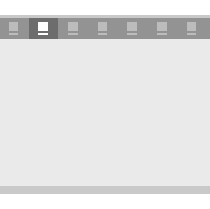

# Guias e pivôs

Controles de pivô e padrão de guias são usados para navegar em categorias de conteúdo distintas, acessadas com frequência. Os pivôs e as guias são compostos de dois ou mais painéis de conteúdo com cabeçalhos de categoria correspondentes. Os cabeçalhos persistem na tela e têm um estado de seleção exibido claramente para que os usuários sempre saibam em qual categoria estão.


Guias são uma variação visual de pivô e são criados usando o controle [**Pivô**](https://msdn.microsoft.com/library/windows/apps/xaml/windows.ui.xaml.controls.pivot.aspx). [
              **Um exemplo de código**
            ](https://github.com/Microsoft/Windows-universal-samples/tree/master/Samples/XamlPivot) mostrando como personalizar o pivô está disponível no GitHub.

<span class="sidebar_heading" style="font-weight: bold;">APIs importantes</span>

-   [**Classe Pivot**](https://msdn.microsoft.com/library/windows/apps/dn608241)

## O padrão de guia/pivô

Ao criar um aplicativo com o padrão de guia/pivô, há algumas variáveis de design importantes a serem consideradas.

- **Rótulos do cabeçalho.**  Cabeçalhos podem ter um ícone com texto ou somente texto.
- **Alinhamento do cabeçalho.**  Cabeçalhos podem ser justificados à esquerda ou centralizados.
- **Navegação de nível superior ou inferior.**  Guias/pivôs podem ser usados para qualquer nível de navegação. Opcionalmente, o [painel de navegação](nav-pane.md) pode servir como o nível principal com guias/pivôs atuando como o nível secundário.
- **Suporte a gestos de toque.**  Para dispositivos que oferecem suporte a gestos de toque, você pode usar um dos dois conjuntos de interação para navegar entre as categorias de conteúdo:
    1. Toque em um cabeçalho de guia/pivô para navegar para a categoria.
    2. Passe o dedo para a esquerda ou direita na área de conteúdo para navegar para a categoria adjacente.

## Exemplos

Controle de pivô padrão no lembretes da Cortana.


Padrão de guias no aplicativo Alarmes e Relógio.


## Criar um controle de pivô

O controle [**Pivô**](https://msdn.microsoft.com/library/windows/apps/xaml/windows.ui.xaml.controls.pivot.aspx)é fornecido com a funcionalidade básica descrita nesta seção.

Este XAML cria um controle de pivô básico com três seções de conteúdo.

```xaml
<Pivot x:Name="rootPivot" Title="Pivot Title">
    <PivotItem Header="Pivot Item 1">
        <!--Pivot content goes here-->
        <TextBlock Text="Content of pivot item 1."/>
    </PivotItem>
    <PivotItem Header="Pivot Item 2">
        <!--Pivot content goes here-->
        <TextBlock Text="Content of pivot item 2."/>
    </PivotItem>
    <PivotItem Header="Pivot Item 3">
        <!--Pivot content goes here-->
        <TextBlock Text="Content of pivot item 3."/>
    </PivotItem>
</Pivot>
```

### Item de pivô

Pivô é um [**ItemsControl**](https://msdn.microsoft.com/library/windows/apps/xaml/windows.ui.xaml.controls.itemscontrol.aspx) e, por isso, pode conter uma coleção de itens de qualquer tipo. Qualquer item que você adicionar ao Pivô que não seja explicitamente um [ **PivotItem** ](https://msdn.microsoft.com/library/windows/apps/xaml/windows.ui.xaml.controls.pivotitem.aspx) será implicitamente encapsulado em um PivotItem. Como uma tabela dinâmica é frequentemente usada para navegar entre as páginas de conteúdo, é comum preencher a coleção [**Items**](https://msdn.microsoft.com/library/windows/apps/xaml/windows.ui.xaml.controls.itemscontrol.items.aspx) diretamente com elementos de XAML UI. Você também pode definir a propriedade [**ItemsSource**](https://msdn.microsoft.com/library/windows/apps/xaml/windows.ui.xaml.controls.itemscontrol.itemssource.aspx) para uma fonte de dados. Itens vinculados a ItemsSource podem ser de qualquer tipo, mas se eles não forem explicitamente PivotItems, você deverá definir um [**ItemTemplate**](https://msdn.microsoft.com/library/windows/apps/xaml/windows.ui.xaml.controls.itemscontrol.itemtemplate.aspx) e [**HeaderTemplate**](https://msdn.microsoft.com/library/windows/apps/xaml/windows.ui.xaml.controls.pivot.headertemplate.aspx) para especificar como os itens são exibidos.

Você pode usar a propriedade [**SelectedItem**](https://msdn.microsoft.com/library/windows/apps/xaml/windows.ui.xaml.controls.pivot.selecteditem.aspx) para obter ou definir o item ativo do pivô. Use a propriedade [**SelectedIndex**](https://msdn.microsoft.com/library/windows/apps/xaml/windows.ui.xaml.controls.pivot.selectedindex.aspx) para obter ou definir o índice do item ativo.

### Cabeçalhos de pivô

Você pode usar as propriedades [**LeftHeader**](https://msdn.microsoft.com/library/windows/apps/xaml/windows.ui.xaml.controls.pivot.leftheader.aspx) e [**RightHeader**](https://msdn.microsoft.com/library/windows/apps/xaml/windows.ui.xaml.controls.pivot.rightheader.aspx) para adicionar outros controles ao cabeçalho do pivô.

### Interação de pivô

O controle apresenta estas interações de gesto de toque:

-   Tocar em um item de pivô navega para o conteúdo da seção do cabeçalho.
-   Passar o dedo para a direita ou para a esquerda em um item de pivô navega para a seção adjacente.
-   Passar o dedo para a direita ou para a esquerda no conteúdo da seção navega para a seção adjacente.

O controle é fornecido em dois modos:

**Estático**

-   Pivôs são estáticos quando todos os cabeçalhos cabem dentro do espaço permitido.
-   Tocar em um rótulo do pivô navega para a página correspondente, embora o próprio pivô não se mova. O pivô ativo é realçado.

**Carrossel**

-   Pivôs giram quando todos os cabeçalhos não cabem no espaço permitido.
-   Tocar em um rótulo do pivô navega para a página correspondente, e o rótulo do pivô ativo gira para a primeira posição.
-   Os itens de pivô em um loop de carrossel da última à primeira seção de pivô.

## Recomendações

-   Baseie o alinhamento de cabeçalhos de guia/pivô no tamanho da tela. Para larguras de tela abaixo de 720 epx, o alinhamento central geralmente funciona melhor, enquanto o alinhamento à esquerda para larguras de tela acima de 720 epx é recomendado na maioria dos casos.
-   Evite usar mais do que cinco cabeçalhos ao usar o modo de carrossel (viagem de ida e volta), pois ter um número maior pode gerar confusão.
-   Use o padrão de guias somente se os itens de pivô tiverem ícones diferentes.
-   Inclua texto em cabeçalhos de item de pivô para ajudar os usuários a entender o significado de cada seção de pivô. Ícones não são necessariamente autoexplicativos para todos os usuários.


## Tópicos relacionados

[Noções básicas de design de navegação](https://msdn.microsoft.com/library/windows/apps/dn958438)


<!--HONumber=Jun16_HO3-->


