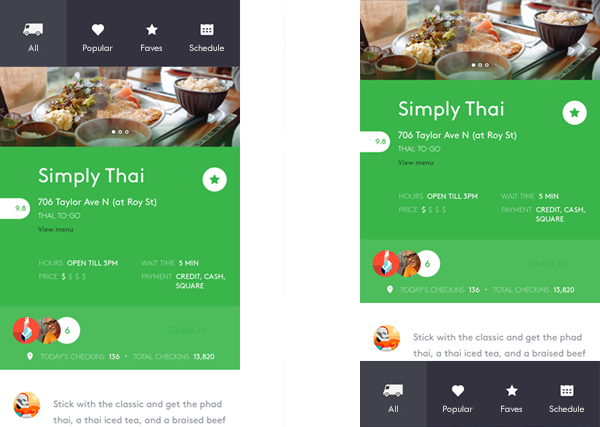

# Guias e pivôs

Guias e pivôs são usados para navegar em categorias de conteúdo distintas, acessadas com frequência. O padrão de guia/pivô é composto de dois ou mais painéis de conteúdo com cabeçalhos de categoria correspondentes. Os cabeçalhos persistem na tela e têm um estado de seleção exibido claramente para que os usuários sempre saibam em qual categoria estão.


Guias e pivôs têm efetivamente o mesmo padrão, e ambos são criados usando o controle [**Pivot**](https://msdn.microsoft.com/library/windows/apps/xaml/windows.ui.xaml.controls.pivot.aspx). A funcionalidade básica do controle de pivô é descrita mais adiante neste artigo.

<span class="sidebar_heading" style="font-weight: bold;">APIs importantes</span>

-   [**Classe Pivot**](https://msdn.microsoft.com/library/windows/apps/dn608241)

## O padrão de guia/pivô

Ao criar um aplicativo com o padrão de guias/pivôs, há algumas variáveis de design importantes a serem consideradas com base no conjunto de recursos configuráveis do padrão.

- **Posicionamento do cabeçalho.**   Cabeçalhos podem ser colocados na parte superior ou inferior da tela.
    
    **Observação**&nbsp;&nbsp;Colocar cabeçalhos na parte inferior da tela requer remodelagem do controle Pivot.
- **Rótulos do cabeçalho.**  Cabeçalhos podem ter um ícone com texto, somente texto ou somente ícone.
- **Alinhamento do cabeçalho.**  Cabeçalhos podem ser justificados à esquerda ou centralizados.
- **Navegação de nível superior ou inferior.**  Guias/pivôs podem ser usados para qualquer nível de navegação e empilhados em um padrão de nível superior/inferior. Quando há dois níveis de guias/pivôs, os cabeçalhos de nível superior e inferior devem ter diferenciação visual suficiente para que os usuários possam separar claramente os dois.
- **Suporte a gestos de toque.**  Para dispositivos que oferecem suporte a gestos de toque, você pode usar um dos dois conjuntos de interação para navegar entre as categorias de conteúdo:
    1. Toque em um cabeçalho de guia/pivô para navegar para a categoria, ou passe o dedo na área de conteúdo para navegar para a categoria adjacente.
    2. Toque em um cabeçalho de guia/pivô para navegar para a categoria (sem passar o dedo).

### Configurações de padrão

A disposição ideal do padrão de guia/pivô depende do cenário de interação e dos dispositivos nos quais seu aplicativo será exibido. Esta tabela descreve alguns dos principais cenários e configurações de padrão.

Cenário de interação|Configuração recomendada
--------------------|-------------------------
Movimento lateral entre 2 e 5 categorias de conteúdo de modo de exibição de grade ou lista de nível superior em um telefone ou phablet|Guia/pivôs: colocados na parte superior da tela, centralizados
|Rótulos do cabeçalho: ícones + texto
|Passar o dedo na área de conteúdo: habilitado
Movimento entre uma variedade de categorias de conteúdo em um telefone ou phablet no qual passar o dedo em uma área de conteúdo não é prático para navegação|Guia/pivôs: colocados na parte inferior da tela, centralizados
|Rótulos do cabeçalho: ícones + texto
|Passar o dedo na área de conteúdo: desabilitado
Navegação de nível superior com mouse e teclado|Guia/pivôs: colocados na parte superior da tela, alinhados à esquerda
 *ou*|Rótulos do cabeçalho: somente texto
 Navegação no nível de página em um dispositivo de toque|Passar o dedo na área de conteúdo: desabilitado

## Exemplos

Este design de um aplicativo de trailers de comida mostra a aparência dos cabeçalhos de guia/pivô colocados na parte superior ou inferior. Em dispositivos móveis, posicioná-los na parte inferior funciona bem para fins de acessibilidade.



O design de aplicativo de trailers de comida em cabeçalhos somente com texto de recursos de notebook/área de trabalho. Usar ícones com texto para cabeçalhos ajuda a seleção por área de toque, mas, para mouse e teclado, cabeçalhos com somente texto funcionam bem.


## Criar um controle de pivô

O padrão de navegação de guia/pivô é criado usando o controle [**Pivot**](https://msdn.microsoft.com/library/windows/apps/xaml/windows.ui.xaml.controls.pivot.aspx). O controle é fornecido com a funcionalidade básica descrita nesta seção.

Este XAML cria um controle de pivô básico com três seções de conteúdo.

```xaml
<Pivot x:Name="rootPivot" Title="PIVOT TITLE">
    <PivotItem Header="Pivot Item 1">
        <!--Pivot content goes here-->
        <TextBlock Text="Content of pivot item 1."/>
    </PivotItem>
    <PivotItem Header="Pivot Item 2">
        <!--Pivot content goes here-->
        <TextBlock Text="Content of pivot item 2."/>
    </PivotItem>
    <PivotItem Header="Pivot Item 3">
        <!--Pivot content goes here-->
        <TextBlock Text="Content of pivot item 3."/>
    </PivotItem>
</Pivot>
```

**Item de pivô**

Pivô é um [**ItemsControl**](https://msdn.microsoft.com/library/windows/apps/xaml/windows.ui.xaml.controls.itemscontrol.aspx) e, por isso, pode conter uma coleção de itens de qualquer tipo. Qualquer item que você adicionar ao Pivô que não seja explicitamente um [ **PivotItem** ](https://msdn.microsoft.com/library/windows/apps/xaml/windows.ui.xaml.controls.pivotitem.aspx) será implicitamente encapsulado em um PivotItem. Como uma tabela dinâmica é frequentemente usada para navegar entre as páginas de conteúdo, é comum preencher a coleção [**Items**](https://msdn.microsoft.com/library/windows/apps/xaml/windows.ui.xaml.controls.itemscontrol.items.aspx) diretamente com elementos de XAML UI. Você também pode definir a propriedade [**ItemsSource**](https://msdn.microsoft.com/library/windows/apps/xaml/windows.ui.xaml.controls.itemscontrol.itemssource.aspx) para uma fonte de dados. Itens vinculados a ItemsSource podem ser de qualquer tipo, mas se eles não forem explicitamente PivotItems, você deverá definir um [**ItemTemplate**](https://msdn.microsoft.com/library/windows/apps/xaml/windows.ui.xaml.controls.itemscontrol.itemtemplate.aspx) e [**HeaderTemplate**](https://msdn.microsoft.com/library/windows/apps/xaml/windows.ui.xaml.controls.pivot.headertemplate.aspx) para especificar como os itens são exibidos.

Você pode usar a propriedade [**SelectedItem**](https://msdn.microsoft.com/library/windows/apps/xaml/windows.ui.xaml.controls.pivot.selecteditem.aspx) para obter ou definir o item ativo do pivô. Use a propriedade [**SelectedIndex**](https://msdn.microsoft.com/library/windows/apps/xaml/windows.ui.xaml.controls.pivot.selectedindex.aspx) para obter ou definir o índice do item ativo. 

**Cabeçalhos de pivô**

Você pode usar as propriedades [**LeftHeader**](https://msdn.microsoft.com/library/windows/apps/xaml/windows.ui.xaml.controls.pivot.leftheader.aspx) e [**RightHeader**](https://msdn.microsoft.com/library/windows/apps/xaml/windows.ui.xaml.controls.pivot.rightheader.aspx) para adicionar outros controles ao cabeçalho do pivô. 

### Interação de pivô

O controle apresenta estas interações de gesto de toque:

-   Tocar em um cabeçalho navega para o conteúdo da seção do cabeçalho.
-   Passar o dedo para a direita ou para a esquerda em um cabeçalho navega para a seção/cabeçalho adjacente.
-   Passar o dedo para a direita ou para a esquerda no conteúdo da seção navega para a seção/cabeçalho adjacente.

O controle é fornecido em dois modos:

**Estático**

-   Pivôs são estáticos quando todos os cabeçalhos cabem dentro do espaço permitido.
-   Tocar em um rótulo do pivô navega para a página correspondente, embora o próprio pivô não se mova. O pivô ativo é realçado.

**Carrossel**

-   Pivôs giram quando todos os cabeçalhos não cabem no espaço permitido.
-   Tocar em um rótulo do pivô navega para a página correspondente, e o rótulo do pivô ativo gira para a primeira posição.

O controle tem funcionalidade de ponto de interrupção interna, que é baseada no número de cabeçalhos e no comprimento da cadeia de caracteres dos rótulos.

## Recomendações

-   Baseie o alinhamento de cabeçalhos de guia/pivô no tamanho da tela. Para larguras de tela abaixo de 720 epx, o alinhamento central geralmente funciona melhor, enquanto o alinhamento à esquerda para larguras de tela acima de 720 epx é recomendado na maioria dos casos.
-   Ao redimensionar uma janela, quando o número de cabeçalhos de guias/pivôs excede o espaço disponível, comece empurrando cabeçalhos para a área de excedentes.
-   Guias/pivôs podem ser usados em qualquer orientação da tela, mas lembre-se de manter o mesmo número total de cabeçalhos (visíveis e ocultos) nas orientações retrato e paisagem.
-   Evite usar mais de 5 cabeçalhos no modo carrossel (tempo de resposta), pois ter um número maior pode fazer com que o usuário perca a orientação.
-   Em dispositivos móveis, colocar guias/pivôs na parte inferior funciona bem para fins de acessibilidade, caso o gesto de passar o dedo seja usado em outra parte da interface do usuário, e evita que a interface do usuário fique pesada na parte superior.
-   Quando o teclado virtual é implantado, os cabeçalhos podem sair da tela para preservar o espaço.

\[Este artigo contém informações que são específicas dos aplicativos UWP (Plataforma Universal do Windows) e do Windows 10. Para obter as diretrizes do Windows 8.1, baixe o [PDF de diretrizes do Windows 8.1](https://go.microsoft.com/fwlink/p/?linkid=258743).\]

## Tópicos relacionados

[Noções básicas de design de navegação](https://msdn.microsoft.com/library/windows/apps/dn958438)


<!--HONumber=Mar16_HO1-->


