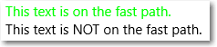

# Bloco de texto
 Bloco de texto é o controle principal para exibir texto somente leitura em aplicativos. Você pode usá-lo para exibir texto de linha única ou de várias linhas, hiperlinks embutidos e texto com formatação, como negrito, itálico ou sublinhado.

<span class="sidebar_heading" style="font-weight: bold;">APIs importantes</span>

-   [**Classe TextBlock**](https://msdn.microsoft.com/library/windows/apps/xaml/windows.ui.xaml.controls.textblock.aspx)
-   [**Propriedade Text**](https://msdn.microsoft.com/library/windows/apps/xaml/windows.ui.xaml.controls.textblock.text.aspx)
-   [**Propriedade Inlines**](https://msdn.microsoft.com/library/windows/apps/xaml/windows.ui.xaml.controls.textblock.inlines.aspx)

## Este é o controle correto?

Um bloco de texto geralmente é mais fácil de usar e fornece melhor desempenho na renderização de texto do que um bloco Rich Text, por isso é o preferido para a maioria do texto da interface do usuário de aplicativo. Você pode facilmente acessar e usar o texto de um bloco de texto em seu aplicativo, obtendo o valor da propriedade [Text](https://msdn.microsoft.com/library/windows/apps/xaml/windows.ui.xaml.controls.textblock.text.aspx). Também fornece muitas das mesmas opções de formatação para personalizar como o texto será renderizado. 

Embora você possa colocar quebras de linha no texto, o bloco de texto é projetado para exibir um único parágrafo e não oferece suporte a recuo de texto. Use um **RichTextBlock** quando precisar de suporte para vários parágrafos, texto com várias colunas ou outros layouts de texto complexos ou elementos de interface do usuário embutidos como imagens.

Para obter mais informações sobre como escolher o controle de texto certo, consulte o artigo [Text controls](text-controls.md).

## Exemplos


## Criar um bloco de texto

Consulte aqui como definir um controle TextBlock simples e configurar sua propriedade Text para uma cadeia de caracteres.

```xaml
<TextBlock Text="Hello, world!" />
```

```csharp
TextBlock textBlock1 = new TextBlock();
textBlock1.Text = "Hello, world!";
```

    <TextBlock Text="Hello, world!" />

    TextBlock textBlock1 = new TextBlock();
    textBlock1.Text = "Hello, world!";

### Modelo de conteúdo

Há duas propriedades que você pode usar para adicionar conteúdo a um TextBlock: [Text](https://msdn.microsoft.com/library/windows/apps/xaml/windows.ui.xaml.controls.textblock.text.aspx) e [Inlines](https://msdn.microsoft.com/library/windows/apps/xaml/windows.ui.xaml.controls.textblock.inlines.aspx).

A maneira mais comum de exibir texto é definir a propriedade Text como um valor da cadeia de caracteres, conforme mostrado no exemplo anterior.

Você também pode adicionar conteúdo ao colocar elementos de conteúdo de fluxo embutidos na propriedade TextBox.Inlines, dessa forma.
```xaml
<TextBlock><Run>Text can be <Bold>bold</Bold>, <Italic>italic</Italic>, or <Bold><Italic>both</Italic></Bold>.</Run></TextBlock>
```

Elementos derivados da classe Inline, como Bold, Italic, Run, Span e LineBreak, permitem formatações diferentes para diferentes partes do texto. Para obter mais informações, consulte a seção [Formatação do texto](). O elemento Hyperlink embutido permite adicionar um hiperlink ao seu texto. No entanto, usar Inlines também desabilita a renderização de texto de caminho rápido, que será discutida na próxima seção.


## Considerações sobre desempenho

Sempre que possível, o XAML usa um caminho de código mais eficiente para texto de layout. Esse caminho rápido reduz o uso de memória em geral e reduz consideravelmente o tempo da CPU para medir e organizar o texto. Esse caminho rápido aplica-se somente ao TextBlock. Portanto, sempre que possível, ele deve ter preferência sobre RichTextBlock.

Determinadas condições exigem que o TextBlock faça fallback em caminho de código com mais recursos e uso intenso de CPU para renderização de texto. Para manter a renderização de texto no caminho rápido, siga estas diretrizes para configurar as propriedades listadas aqui.
- [**Text**](https://msdn.microsoft.com/library/windows/apps/xaml/windows.ui.xaml.controls.textblock.text.aspx): a condição mais importante é que o caminho rápido seja usado somente quando você definir o texto configurando explicitamente a propriedade Text, em XAML ou em código (como mostrado nos exemplos anteriores). Definir o texto pela coleção Inlines do TextBlock (como `<TextBlock>Inline text</TextBlock>`) desabilitará o caminho rápido, devido à complexidade potencial de vários formatos.
- [**CharacterSpacing**](https://msdn.microsoft.com/library/windows/apps/xaml/windows.ui.xaml.controls.textblock.characterspacing.aspx): somente o valor padrão de 0 é o caminho rápido.
- [**Typography**](https://msdn.microsoft.com/library/windows/apps/xaml/windows.ui.xaml.documents.typography.aspx): apenas os valores padrão das diversas propriedades Typography são o caminho rápido.
- [**TextTrimming**](https://msdn.microsoft.com/library/windows/apps/xaml/windows.ui.xaml.controls.textblock.texttrimming.aspx): somente os valores **None**, **CharacterEllipsis** e **WordEllipsis** são o caminho rápido. O valor **Clip** desabilita o caminho rápido.
- [**LineStackingStrategy**](https://msdn.microsoft.com/library/windows/apps/xaml/windows.ui.xaml.controls.textblock.linestackingstrategy.aspx): se [LineHeight](https://msdn.microsoft.com/library/windows/apps/xaml/windows.ui.xaml.controls.textblock.lineheight.aspx) não for 0, os valores **BaselineToBaseline** e **MaxHeight** desabilitarão o caminho rápido.
- [**IsTextSelectionEnabled**](https://msdn.microsoft.com/library/windows/apps/xaml/windows.ui.xaml.controls.textblock.istextselectionenabled.aspx): somente **false** é o caminho rápido. Configurar essa propriedade como **true** desabilita o caminho rápido.

Você pode configurar a propriedade [DebugSettings.IsTextPerformanceVisualizationEnabled](https://msdn.microsoft.com/library/windows/apps/xaml/windows.ui.xaml.debugsettings.istextperformancevisualizationenabled.aspx) como **true** durante a depuração para determinar se o texto está usando a renderização de caminho rápido. Quando essa propriedade é configurada como true, o texto que está no caminho rápido aparece na cor verde-claro. 

>**Dica**&nbsp;&nbsp;Esse recurso é explicado detalhadamente nesta sessão da compilação 2015- [Desempenho XAML: técnicas para maximizar experiências de aplicativos universais do Windows criados com XAML.](https://channel9.msdn.com/Events/Build/2015/3-698).

 

Você geralmente define as configurações de depuração na substituição do método [OnLaunched](https://msdn.microsoft.com/library/windows/apps/xaml/windows.ui.xaml.application.onlaunched.aspx) na página code-behind, desta forma.
```csharp
protected override void OnLaunched(LaunchActivatedEventArgs e)
{
#if DEBUG
    if (System.Diagnostics.Debugger.IsAttached)
    {
        this.DebugSettings.IsTextPerformanceVisualizationEnabled = true;
    }
#endif

// ...

}
```

Neste exemplo, o primeiro TextBlock é renderizado usando o caminho rápido, enquanto o segundo não é.
```xaml
<StackPanel>
    <TextBlock Text="This text is on the fast path."/>
    <TextBlock>This text is NOT on the fast path.</TextBlock>
<StackPanel/>
```

Quando você executa esse XAML no modo de depuração com IsTextPerformanceVisualizationEnabled configurado como true, o resultado é semelhante a este.



>**Cuidado**&nbsp;&nbsp;A cor do texto que não está no caminho rápido não é alterada. Se você tiver texto em seu aplicativo com a cor especificada como verde brilhante, ele ainda será exibido em verde brilhante quando estiver no caminho de renderização mais lento. Tome cuidado para não confundir o texto definido como verde no aplicativo com o texto que está no caminho rápido e verde devido às configurações de depuração.

## Formatação do texto

Embora a propriedade Text armazene texto sem formatação, você pode aplicar várias opções de formatação no controle TextBlock para personalizar como o texto será renderizado em seu aplicativo. Você pode definir propriedades de controle padrão como FontFamily, FontSize, FontStyle, Foreground e CharacterSpacing para alterar a aparência do texto. Você também pode usar os elementos de texto embutidos e propriedades anexadas Typography para formatar seu texto. Essas opções afetam apenas como TextBlock exibe o texto localmente, portanto, se você copiar e colar o texto em um controle rich text, por exemplo, nenhuma formatação será aplicada.

>**Observação**&nbsp;&nbsp;Lembre-se de que, conforme observado na seção anterior, elementos de texto embutidos e valores de tipografia não padrão não são renderizados no caminho rápido.
 

### Elementos embutidos

O namespace [Windows.UI.Xaml.Documents](https://msdn.microsoft.com/library/windows/apps/xaml/windows.ui.xaml.documents.aspx) fornece uma variedade de elementos de texto embutidos que você pode usar para formatar o texto, como Bold, Italic, Run, Span e LineBreak. 

Você pode exibir uma série de cadeias de caracteres em um TextBlock, em que cada cadeia tem formatação diferente. É possível fazer isso usando um elemento Run para exibir cada cadeia com a sua formatação e separando cada elemento Run com um elemento LineBreak.

Consulte como definir algumas cadeias de caracteres de texto formatadas diferentemente em um TextBlock usando Run objetos separados com um LineBreak.
```xaml
<TextBlock FontFamily="Arial" Width="400" Text="Sample text formatting runs">
    <LineBreak/>
    <Run Foreground="Gray" FontFamily="Courier New" FontSize="24"> 
        Courier New 24 
    </Run>
    <LineBreak/>
    <Run Foreground="Teal" FontFamily="Times New Roman" FontSize="18" FontStyle="Italic"> 
        Times New Roman Italic 18 
    </Run>
    <LineBreak/>
    <Run Foreground="SteelBlue" FontFamily="Verdana" FontSize="14" FontWeight="Bold"> 
        Verdana Bold 14 
    </Run>
</TextBlock>
```

Consulte o resultado.


### Typography

As propriedades anexadas da classe [Typography](https://msdn.microsoft.com/library/windows/apps/xaml/windows.ui.xaml.documents.typography.aspx) fornecem acesso a um conjunto de propriedades de tipografia Microsoft OpenType. Você pode definir essas propriedades anexadas em TextBlock ou nos elementos de texto embutidos individuais. Estes exemplos mostram ambos.
```xaml
<TextBlock Text="Hello, world!"
           Typography.Capitals="SmallCaps"
           Typography.StylisticSet4="True"/>
```

```csharp
TextBlock textBlock1 = new TextBlock();
textBlock1.Text = "Hello, world!";
Windows.UI.Xaml.Documents.Typography.SetCapitals(textBlock1, FontCapitals.SmallCaps);
Windows.UI.Xaml.Documents.Typography.SetStylisticSet4(textBlock1, true);
```

```xaml
<TextBlock>12 x <Run Typography.Fraction="Slashed">1/3</Run> = 4.</TextBlock>
```

## Recomendações


\[Este artigo contém informações que são específicas dos aplicativos UWP (Plataforma Universal do Windows) e do Windows 10. Para obter as diretrizes do Windows 8.1, baixe o [PDF de diretrizes do Windows 8.1](https://go.microsoft.com/fwlink/p/?linkid=258743).\]

## Artigos relacionados

[Controles de texto](text-controls.md)

**Para designers**
- [Diretrizes para verificação ortográfica](spell-checking-and-prediction.md)
- [Adicionando pesquisa](https://msdn.microsoft.com/library/windows/apps/hh465231)
- [Diretrizes para entrada de texto](text-controls.md)

**Para desenvolvedores (XAML)**
- [**Classe TextBox**](https://msdn.microsoft.com/library/windows/apps/br209683)
- [**Classe Windows.UI.Xaml.Controls PasswordBox**](https://msdn.microsoft.com/library/windows/apps/br227519)


**Para desenvolvedores (outros)**
- [Propriedade String.Length](https://msdn.microsoft.com/library/system.string.length(v=vs.110).aspx)


<!--HONumber=Mar16_HO1-->


