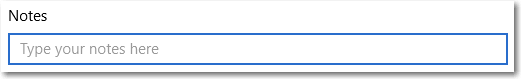
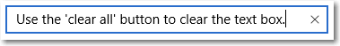
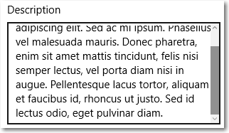
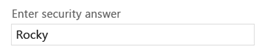

# Caixa de texto

<link rel="stylesheet" href="https://az835927.vo.msecnd.net/sites/uwp/Resources/css/custom.css"> 

O controle TextBox permite que um usuário digite texto em um aplicativo. Em geral, ele é usado para capturar uma única linha de texto, mas pode ser configurado para capturar várias linhas de texto. O texto é exibido na tela em um formato simples, uniforme e sem formatação.

O controle TextBox tem vários recursos que podem simplificar a entrada de texto. Ele é fornecido com um menu de contexto familiar, integrado, com suporte para copiar e colar texto. O botão "Limpar tudo" permite que um usuário exclua rapidamente todo o texto que foi digitado. Ele também tem recursos de verificação ortográfica integrados e habilitados por padrão.

<div class="important-apis" >
<b>APIs importantes</b><br/>
<ul>
<li><a href="https://msdn.microsoft.com/library/windows/apps/xaml/windows.ui.xaml.controls.textbox.aspx"><strong>Classe TextBox</strong></a></li>
<li><a href="https://msdn.microsoft.com/library/windows/apps/xaml/windows.ui.xaml.controls.textbox.text.aspx"><strong>Propriedade Text</strong></a></li>
</ul>

</div>
</div>


## Esse é o controle correto?

Use o controle **TextBox** para permitir que o usuário digite e edite texto não formatado, como em um formulário. Você pode usar a propriedade [Text](https://msdn.microsoft.com/library/windows/apps/xaml/windows.ui.xaml.controls.textbox.text.aspx) para obter e definir o texto em um TextBox.

Você pode tornar um TextBox somente leitura, mas deve ser um estado temporário e condicional. Se o texto nunca for editável, considere usar um [ **TextBlock** ](text-block.md).

Use o controle [**PasswordBox**](password-box.md) para receber uma senha ou outros dados particulares, como um número de CPF. Uma caixa de senha é semelhante a uma caixa para entrada de texto, exceto pelo fato de gerar marcadores no lugar do texto inserido.

Use o controle [**AutoSuggestBox**](auto-suggest-box.md) para permitir que o usuário insira termos de pesquisa ou para mostrar ao usuário uma lista de sugestões das quais escolher ao digitarem.

Use [ **RichEditBox** ](rich-edit-box.md) para exibir e editar arquivos Rich Text.

Para obter mais informações sobre como escolher o controle de texto certo, consulte o artigo [Text controls](text-controls.md).

## Exemplos


## Criar uma caixa de texto

Aqui está o XAML para uma caixa de texto simples com um texto de cabeçalho e espaço reservado.

```xaml
<TextBox Width="500" Header="Notes" PlaceholderText="Type your notes here"/>
```

```csharp
TextBox textBox = new TextBox();
textBox.Width = 500;
textBox.Header = "Notes";
textBox.PlaceholderText = "Type your notes here";
// Add the TextBox to the visual tree.
rootGrid.Children.Add(textBox);
```

Consulte a caixa de texto resultante desse XAML.



### Use uma caixa de texto para entrada de dados em um formulário

É comum usar uma caixa de texto para aceitar a entrada de dados em um formulário e usar a propriedade [Text](https://msdn.microsoft.com/library/windows/apps/xaml/windows.ui.xaml.controls.textbox.text.aspx) para obter a cadeia de caracteres de texto completa da caixa de texto. Em geral, é usado um evento, como um clique no botão Enviar, para acessar a propriedade Text, mas você poderá manipular o evento [TextChanged](https://msdn.microsoft.com/library/windows/apps/xaml/windows.ui.xaml.controls.textbox.textchanged.aspx) ou [TextChanging](https://msdn.microsoft.com/library/windows/apps/xaml/windows.ui.xaml.controls.textbox.textchanging.aspx) se precisar fazer algo quando o texto for alterado.

Você pode adicionar um [Header](https://msdn.microsoft.com/library/windows/apps/xaml/windows.ui.xaml.controls.textbox.header.aspx) (ou rótulo) e [PlaceholderText](https://msdn.microsoft.com/library/windows/apps/xaml/windows.ui.xaml.controls.textbox.placeholdertext.aspx) (ou marca d'água) à caixa de texto para fornecer ao usuário uma indicação da finalidade da caixa de texto. Para personalizar a aparência do cabeçalho, você pode definir a propriedade [HeaderTemplate](https://msdn.microsoft.com/library/windows/apps/xaml/windows.ui.xaml.controls.textbox.headertemplate.aspx) em vez de Header. *Para obter informações de design, consulte Diretrizes para rótulos*.

Você pode restringir o número de caracteres que o usuário pode digitar definindo a propriedade [MaxLength](https://msdn.microsoft.com/library/windows/apps/xaml/windows.ui.xaml.controls.textbox.maxlength.aspx). No entanto, MaxLength não restringe o comprimento do texto colado. Use o evento [Paste](https://msdn.microsoft.com/library/windows/apps/xaml/windows.ui.xaml.controls.textbox.paste.aspx) para modificar o texto colado se isso for importante para o seu aplicativo.

A caixa de texto inclui um botão Limpar tudo ("X") que aparece quando o texto é digitado na caixa. Quando um usuário clicar no "X", o texto na caixa será limpo. Ela terá a aparência a seguir.



O botão Limpar tudo é mostrado somente para caixas de texto de linha única editáveis, que contêm texto e tem foco.

O botão Limpar tudo não é mostrado em nenhum destes casos:
- **IsReadOnly** é **true**
- **AcceptsReturn** é **true**
- **TextWrap** tem um valor diferente de **NoWrap**

### Tornar uma caixa de texto somente leitura

Você pode tornar uma caixa de texto somente leitura definindo a propriedade [IsReadOnly](https://msdn.microsoft.com/library/windows/apps/xaml/windows.ui.xaml.controls.textbox.isreadonly.aspx) como **true**. Em geral, você alterna essa propriedade no código do aplicativo com base nas condições em seu aplicativo. Se precisar que o texto seja sempre somente leitura, considere usar TextBlock.

Você pode tornar um TextBox somente leitura definindo a propriedade IsReadOnly como true. Por exemplo, você pode ter um TextBox para o usuário inserir comentários que seja habilitada apenas em determinadas condições. É possível tornar o TextBox somente leitura até que as condições sejam atendidas. Se você só precisar exibir texto, considere usar TextBlock ou RichTextBlock.

Uma caixa de texto somente leitura tem a mesma aparência que uma caixa de texto de leitura/gravação, portanto, pode ser confuso para o usuário.
Um usuário pode selecionar e copiar texto.
IsEnabled


### Habilitar a entrada de várias linhas

Há duas propriedades que você pode usar para determinar se a caixa de texto exibe texto em mais de uma linha. Em geral, as duas propriedades são definidas para fazer uma caixa de texto de várias linhas.
- Para que a caixa de texto permita e exiba os caracteres newline ou return, defina a propriedade [**AcceptsReturn**](https://msdn.microsoft.com/library/windows/apps/xaml/windows.ui.xaml.controls.textbox.acceptsreturn.aspx) como **true**.
- Para habilitar o encapsulamento de texto, defina a propriedade [**TextWrapping**](https://msdn.microsoft.com/library/windows/apps/xaml/windows.ui.xaml.controls.textbox.textwrapping.aspx) como **Wrap**. Isso faz com que o texto seja encapsulado ao atingir a borda da caixa de texto, independente dos caracteres separadores de linha.

> **Observação**&nbsp;&nbsp;TextBox e RichEditBox não dão suporte ao valor **WrapWholeWords** para suas propriedades TextWrapping. Se você tentar usar WrapWholeWords como um valor para TextBox.TextWrapping ou RichEditBox.TextWrapping, será gerada uma exceção de argumento inválido.

Uma caixa de texto de várias linhas continuará a aumentar verticalmente à medida que o texto for inserido, a menos que seja restringida por sua propriedade [Height](https://msdn.microsoft.com/library/windows/apps/xaml/windows.ui.xaml.frameworkelement.height.aspx) ou [MaxHeight](https://msdn.microsoft.com/library/windows/apps/xaml/windows.ui.xaml.frameworkelement.maxheight.aspx) ou por um contêiner pai. Você deve confirmar que uma caixa de texto de várias linhas não ultrapasse a área visível e, se isso acontecer, restringir seu crescimento. Recomendamos que você sempre especifique uma altura apropriada para uma caixa de texto de várias linhas e não a deixe aumentar de tamanho enquanto o usuário digita.

A rolagem usando uma roda de rolagem ou toque é habilitada automaticamente quando necessário. No entanto, as barras de rolagem verticais não são visíveis por padrão. Você pode mostrar as barras de rolagem verticais definindo [ScrollViewer.VerticalScrollBarVisibility](https://msdn.microsoft.com/library/windows/apps/xaml/windows.ui.xaml.controls.scrollviewer.verticalscrollbarvisibility.aspx) como **Auto** no ScrollViewer incorporado, conforme mostrado aqui.

```xaml
<TextBox AcceptsReturn="True" TextWrapping="Wrap"
         MaxHeight="172" Width="300" Header="Description"
         ScrollViewer.VerticalScrollBarVisibility="Auto"/>
```

```csharp
TextBox textBox = new TextBox();
textBox.AcceptsReturn = true;
textBox.TextWrapping = TextWrapping.Wrap;
textBox.MaxHeight = 172;
textBox.Width = 300;
textBox.Header = "Description";
ScrollViewer.SetVerticalScrollBarVisibility(textBox, ScrollBarVisibility.Auto);
```

A caixa de texto tem a seguinte aparência depois que texto é adicionado.



### Formatar a exibição de texto

Use a propriedade [TextAlignment]() para alinhar o texto em uma caixa de texto. Para alinhar a caixa de texto ao layout da página, use as propriedades [HorizontalAlignment](https://msdn.microsoft.com/library/windows/apps/xaml/windows.ui.xaml.frameworkelement.horizontalalignment.aspx) e [VerticalAlignment](https://msdn.microsoft.com/library/windows/apps/xaml/windows.ui.xaml.frameworkelement.verticalalignment.aspx).

Embora a caixa de texto seja compatível apenas com texto não formatado, você pode personalizar como o texto é exibido na caixa para corresponder à sua marca. Você pode definir propriedades [Control](https://msdn.microsoft.com/library/windows/apps/xaml/windows.ui.xaml.controls.control.aspx) padrão, como [FontFamily](https://msdn.microsoft.com/library/windows/apps/xaml/windows.ui.xaml.controls.control.fontfamily.aspx), [FontSize](https://msdn.microsoft.com/library/windows/apps/xaml/windows.ui.xaml.controls.control.fontsize.aspx), [FontStyle](https://msdn.microsoft.com/library/windows/apps/xaml/windows.ui.xaml.controls.control.fontstyle.aspx), [Background](https://msdn.microsoft.com/library/windows/apps/xaml/windows.ui.xaml.controls.control.background.aspx), [Foreground](https://msdn.microsoft.com/library/windows/apps/xaml/windows.ui.xaml.controls.control.foreground.aspx) e [CharacterSpacing](https://msdn.microsoft.com/library/windows/apps/xaml/windows.ui.xaml.controls.control.characterspacing.aspx), para alterar a aparência do texto. Essas propriedades afetam apenas como a caixa de texto exibe o texto localmente, portanto, se você copiar e colar o texto em um controle Rich Text, por exemplo, nenhuma formatação será aplicada.

Este exemplo mostra uma caixa de texto somente leitura com várias propriedades definidas para personalizar a aparência do texto.

```xaml
<TextBox Text="Sample Text" IsReadOnly="True"
         FontFamily="Verdana" FontSize="24"
         FontWeight="Bold" FontStyle="Italic"
         CharacterSpacing="200" Width="300"
         Foreground="Blue" Background="Beige"/>
```

```csharp
TextBox textBox = new TextBox();
textBox.Text = "Sample Text";
textBox.IsReadOnly = true;
textBox.FontFamily = new FontFamily("Verdana");
textBox.FontSize = 24;
textBox.FontWeight = Windows.UI.Text.FontWeights.Bold;
textBox.FontStyle = Windows.UI.Text.FontStyle.Italic;
textBox.CharacterSpacing = 200;
textBox.Width = 300;
textBox.Background = new SolidColorBrush(Windows.UI.Colors.Beige);
textBox.Foreground = new SolidColorBrush(Windows.UI.Colors.Blue);
// Add the TextBox to the visual tree.
rootGrid.Children.Add(textBox);
```

A caixa de texto resultante tem esta aparência.


### Modificar o menu de contexto

Por padrão, os comandos mostrados no menu de contexto da caixa de texto dependem do estado da caixa. Por exemplo, os comandos a seguir podem ser mostrados quando a caixa de texto é editável.

Comando | Mostrado quando...
------- | -------------
Copiar | texto selecionado.
Recortar | texto selecionado.
Colar | a área de transferência contém texto.
Selecionar tudo | a TextBox contém texto.
Desfazer | texto foi alterado.

Para modificar os comandos mostrados no menu de contexto, manipule o evento [ContextMenuOpening](https://msdn.microsoft.com/library/windows/apps/xaml/windows.ui.xaml.controls.textbox.contextmenuopening.aspx). Para obter um exemplo disso, consulte o cenário 2 do [exemplo de ContextMenu](http://go.microsoft.com/fwlink/p/?linkid=234891). Para obter informações de design, consulte Diretrizes para ver os menus de contexto.

### Selecionar, copiar e colar

Você pode obter ou definir o texto selecionado em uma caixa de texto usando a propriedade [SelectedText](https://msdn.microsoft.com/library/windows/apps/xaml/windows.ui.xaml.controls.textbox.selectedtext.aspx). Use as propriedades [SelectionStart](https://msdn.microsoft.com/library/windows/apps/xaml/windows.ui.xaml.controls.textbox.selectionstart.aspx) e [SelectionLength](https://msdn.microsoft.com/library/windows/apps/xaml/windows.ui.xaml.controls.textbox.selectionlength.aspx) e os métodos [Select](https://msdn.microsoft.com/library/windows/apps/xaml/windows.ui.xaml.controls.textbox.select.aspx) e [SelectAll](https://msdn.microsoft.com/library/windows/apps/xaml/windows.ui.xaml.controls.textbox.selectall.aspx) para manipular a seleção de texto. Manipule o evento [SelectionChanged](https://msdn.microsoft.com/library/windows/apps/xaml/windows.ui.xaml.controls.textbox.selectionchanged.aspx) para fazer algo quando o usuário selecionar ou desmarcar texto. Você pode alterar a cor usada para realçar o texto selecionado, definindo a propriedade [SelectionHighlightColor](https://msdn.microsoft.com/library/windows/apps/xaml/windows.ui.xaml.controls.textbox.selectionhighlightcolor.aspx).

A TextBox dá suporte às ações de copiar e colar por padrão. Você pode fornecer tratamento personalizado do evento [Paste](https://msdn.microsoft.com/library/windows/apps/xaml/windows.ui.xaml.controls.textbox.paste.aspx) em controles de texto editáveis em seu aplicativo Por exemplo, é possível remover as quebras de linha de um endereço de vários linhas ao colá-lo em uma caixa de pesquisa de linha única. Você também pode verificar o comprimento do texto colado e avisar o usuário se ele exceder o tamanho máximo que pode ser salvo em um banco de dados. Para obter mais informações e exemplos, consulte o evento [Paste](https://msdn.microsoft.com/library/windows/apps/xaml/windows.ui.xaml.controls.textbox.paste.aspx).

Aqui, nós temos um exemplo destas propriedades e métodos em uso. Quando você selecionar texto na primeira caixa de texto, o texto selecionado será exibido na segunda caixa, que é somente leitura. Os valores das propriedades [SelectionLength](https://msdn.microsoft.com/library/windows/apps/xaml/windows.ui.xaml.controls.textbox.selectionlength.aspx) e [SelectionStart](https://msdn.microsoft.com/library/windows/apps/xaml/windows.ui.xaml.controls.textbox.selectionstart.aspx) são mostrados em dois blocos de texto. Isso é feito usando o evento [SelectionChanged](https://msdn.microsoft.com/library/windows/apps/xaml/windows.ui.xaml.controls.textbox.selectionchanged.aspx).

```xaml
<StackPanel>
   <TextBox x:Name="textBox1" Height="75" Width="300" Margin="10"
         Text="The text that is selected in this TextBox will show up in the read only TextBox below."
         TextWrapping="Wrap" AcceptsReturn="True"
         SelectionChanged="TextBox1_SelectionChanged" />
   <TextBox x:Name="textBox2" Height="75" Width="300" Margin="5"
         TextWrapping="Wrap" AcceptsReturn="True" IsReadOnly="True"/>
   <TextBlock x:Name="label1" HorizontalAlignment="Center"/>
   <TextBlock x:Name="label2" HorizontalAlignment="Center"/>
</StackPanel>
```

```csharp
private void TextBox1_SelectionChanged(object sender, RoutedEventArgs e)
{
    textBox2.Text = textBox1.SelectedText;
    label1.Text = "Selection length is " + textBox1.SelectionLength.ToString();
    label2.Text = "Selection starts at " + textBox1.SelectionStart.ToString();
}
```

Este é o resultado deste código.


## Escolha o teclado correto para o controle de texto

Para ajudar os usuários a inserir dados usando o teclado virtual ou SIP (Soft Input Panel), você pode configurar o escopo de entrada do controle de texto para corresponder ao tipo de dado que se espera que o usuário insira.

O teclado virtual pode ser usado para entrada de texto, quando o aplicativo é executado em um dispositivo com tela sensível ao toque. O teclado virtual é invocado quando o usuário toca em um campo de entrada editável, como um TextBox ou um RichEditBox. Você pode tornar a entrada de dados muito mais rápida e fácil para os usuários em seu aplicativo definindo o escopo de entrada do controle de texto para corresponder ao tipo de dados que o usuário deve inserir. O escopo de entrada oferece uma dica para o sistema sobre o tipo de entrada de texto esperado pelo controle, para que o sistema possa fornecer um layout de teclado virtual especializado para o tipo de entrada.

Por exemplo, se uma caixa de texto for usada somente para a inserção de um PIN de 4 dígitos, defina a propriedade [InputScope](https://msdn.microsoft.com/library/windows/apps/xaml/windows.ui.xaml.controls.textbox.inputscope.aspx) como **Number**. Isso informa o sistema para mostrar o layout do teclado numérico, facilitando a inserção do PIN.

> **Importante**&nbsp;&nbsp;O escopo de entrada não faz com que validações de entrada sejam executadas e não impede que o usuário forneça entradas por meio de um teclado de hardware nem de outro dispositivo de entrada. Você ainda é o responsável pela validação da entrada em seu código, conforme necessário.

Outras propriedades que afetam o teclado virtual são [IsSpellCheckEnabled](https://msdn.microsoft.com/library/windows/apps/xaml/windows.ui.xaml.controls.textbox.isspellcheckenabled.aspx), [IsTextPredictionEnabled](https://msdn.microsoft.com/library/windows/apps/xaml/windows.ui.xaml.controls.textbox.istextpredictionenabled.aspx) e [PreventKeyboardDisplayOnProgrammaticFocus](https://msdn.microsoft.com/library/windows/apps/xaml/windows.ui.xaml.controls.textbox.preventkeyboarddisplayonprogrammaticfocus.aspx). (IsSpellCheckEnabled também afeta o TextBox quando um teclado de hardware é usado.)

Para obter mais informações e exemplos, consulte [Usar o escopo de entrada para alterar o teclado virtual](https://msdn.microsoft.com/library/windows/apps/mt280229) e a documentação de propriedade.

## Recomendações

-   Use um texto de rótulo ou espaço reservado se a finalidade da caixa de texto não for clara. Um rótulo fica visível, independentemente da caixa de entrada de texto ter ou não um valor. O texto de espaço reservado é exibido dentro da caixa de entrada de texto e desaparece uma vez que um valor tiver sido inserido.
-   Defina uma largura apropriada para a caixa de texto para o intervalo de valores que podem ser inseridos. O comprimento da palavra varia entre os idiomas, então leve em conta a localização se quiser que seu aplicativo esteja preparado para uso internacional.
-   Uma caixa de entrada de texto tem normalmente uma única linha (`TextWrap = "NoWrap"`). Quando os usuários precisam inserir ou editar uma cadeia longa, defina a caixa de entrada de texto como de várias linhas (`TextWrap = "Wrap"`).
-   Geralmente, uma caixa de entrada de texto é usada para texto editável. Mas você pode tornar uma caixa de entrada de texto somente-leitura, de modo que seu conteúdo possa ser lido, selecionado e copiado, mas não editado.
-   Se você precisar reduzir a desorganização em uma visualização, considere a possibilidade de fazer um conjunto de caixas de entrada de texto aparecerem somente quando uma caixa de seleção de controle está selecionada. Você também pode associar o estado habilitado de uma caixa de entrada de texto a um controle como uma caixa de seleção.
-   Considere como deseja que uma caixa de entrada de texto se comporte quando contém um valor e o usuário toca nela. O comportamento padrão é adequado para editar o valor em vez de substituí-lo; o ponto de inserção é colocado entre palavras e nada é selecionado. Se substituição é o caso de uso mais comum para uma determinada caixa de entrada de texto, você pode selecionar todo o texto no campo sempre que o controle recebe foco e a digitação substitui a seleção.

**Caixas de entrada de linha única**

-   Use diversas caixas de entrada de linha única para capturar fragmentos muitos pequenos de informação de texto. Se as caixas de texto são relacionadas quanto à sua natureza, você deve agrupá-las.

-   Torne as caixas de texto de linha única um pouco mais largas do que a entrada mais comprida antecipada. Se isso deixar o controle muito largo, separe-o em dois controles. Por exemplo, você pode dividir uma entrada de endereço única em "Linha de endereço 1" e "Linha de endereço 2".
-   Defina um comprimento máximo de caracteres que podem ser inseridos. Se a fonte de dados de backup não permitir uma cadeia de entrada longa, limite a entrada e use um pop-up de validação para que os usuários saibam quando chegaram ao limite.
-   Use controles de entrada de texto de linha única para coletar pequenos textos dos usuários.

    O exemplo a seguir mostra uma caixa de texto de linha única para capturar uma resposta a uma pergunta de segurança. A resposta deve ser curta, e uma caixa de texto de linha única é apropriada aqui.

    

-   Use um conjunto de controles de entrada de texto curtos, de tamanho fixo e de linha única para inserir dados com um formato específico.

    

-   Use um controle de entrada de texto irrestrito e de linha única para inserir ou editar cadeias, combinado com um botão de comando que ajuda os usuários a selecionarem valores válidos.

    


**Controles de entrada de texto de várias linhas**

-   Quando você cria uma caixa de texto Rich Text, forneça botões de estilo e implemente as ações comandadas por eles.
-   Use uma fonte que seja consistente com o estilo de seu aplicativo.
-   Faça com que a altura do controle de texto seja suficiente para acomodar entradas típicas.
-   Ao capturar longos trechos de texto com um número máximo de caracteres ou contagem de palavras, use uma caixa de texto sem formatação e forneça um contador de movimento ativo para mostrar ao usuário quantos caracteres ou palavras ele deixou antes de atingir o limite. Você precisará criar o contador sozinho; coloque-o abaixo da caixa de texto e atualize-o dinamicamente à medida que o usuário inserir cada caractere ou palavra.

    

-   Não deixe que seus controles de entrada de texto aumentem de tamanho enquanto os usuários digitam.
-   Não use uma caixa de texto multilinha quando os usuários só precisarem de uma linha única.
-   Não use um controle Rich Text se um controle de texto sem formatação for adequado.


## Artigos relacionados

[Controles de texto](text-controls.md)

**Para designers**
- [Diretrizes para verificação ortográfica](spell-checking-and-prediction.md)
- [Adicionando pesquisa](https://msdn.microsoft.com/library/windows/apps/hh465231)
- [Diretrizes para entrada de texto](text-controls.md)

**Para desenvolvedores (XAML)**
- [**Classe TextBox**](https://msdn.microsoft.com/library/windows/apps/br209683)
- [**Classe Windows.UI.Xaml.Controls PasswordBox**](https://msdn.microsoft.com/library/windows/apps/br227519)


**Para desenvolvedores (outros)**
- [Propriedade String.Length](https://msdn.microsoft.com/library/system.string.length(v=vs.110).aspx)


<!--HONumber=Aug16_HO3-->


