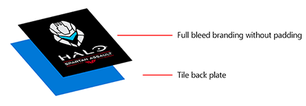
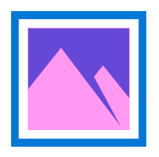
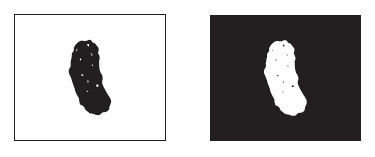

# <a name="guidelines-for-tile-and-icon-assets"></a>Diretrizes para ativos de bloco e ícone

<link rel="stylesheet" href="https://az835927.vo.msecnd.net/sites/uwp/Resources/css/custom.css"> 


Ativos de ícone de aplicativo, exibidos em várias formas em todo o sistema operacional Windows 10, são os cartões de chamada do seu aplicativo da Plataforma Universal do Windows (UWP). Estas diretrizes detalham onde os ativos de ícone de aplicativo são exibidos no sistema e fornecem dicas de design aprofundadas sobre como criar os ícones mais elaborados.


## <a name="adaptive-scaling"></a>Dimensionamento adaptável


Primeiro, uma breve visão geral sobre dimensionamento adaptável para entender melhor como o dimensionamento funciona com ativos. O Windows 10 apresenta uma evolução do modelo de dimensionamento existente. Além do dimensionamento de conteúdo com vetor, há um conjunto de fatores de escala unificado que fornece um tamanho consistente para os elementos de interface do usuário em uma variedade de tamanhos e resoluções de tela. Os fatores de escala também são compatíveis com os fatores de escala de outros sistemas operacionais, como iOS e Android, o que torna mais fácil compartilhar ativos entre essas plataformas.

A Loja seleciona os ativos a serem baixados com base, em parte, no DPI do dispositivo. Apenas os ativos que melhor correspondem ao dispositivo são baixados.

## <a name="tile-elements"></a>Elementos do bloco


Os componentes básicos de um bloco Iniciar consistem em um fundo, um ícone, uma barra de identidade visual e um título de aplicativo:


A barra de identidade visual na parte inferior de um bloco é onde o nome do aplicativo, os selos e o contador (se usado) são exibidos:


A altura da barra de identidade visual se baseia no fator de escala do dispositivo em que ele é exibido:

| Fator de escala | Pixels |
|--------------|--------|
| 100%         | 32     |
| 125%         | 40     |
| 150%         | 48     |
| 200%         | 64     |
| 400%         | 128    |

 

O sistema define as margens do bloco e elas não podem ser modificadas. A maior parte do conteúdo aparece dentro das margens, como visto neste exemplo:


A largura da margem se baseia no fator de escala do dispositivo em que ele é exibido:

| Fator de escala | Pixels |
|--------------|--------|
| 100%         | 8      |
| 125%         | 10     |
| 150%         | 12     |
| 200%         | 16     |
| 400%         | 32     |

 

## <a name="tile-assets"></a>Ativos de bloco


Cada ativo de bloco tem o mesmo tamanho do bloco no qual ele é colocado. Você pode marcar os blocos do seu aplicativo com duas representações diferentes de um ativo:

1. Um ícone ou um logotipo centralizado com preenchimento. Isso permite que se veja através da cor de fundo:


2. Um bloco em sangramento completo, com marca e sem preenchimento:



Tendo-se em vista a consistência entre dispositivos, cada tamanho de bloco (pequeno, médio, largo e grande) tem sua própria relação de dimensionamento. Para obter um posicionamento de ícone consistente entre os blocos, recomendamos algumas diretrizes de preenchimento básicas para os tamanhos de bloco a seguir. A área onde as duas sobreposições roxas têm intersecção representa a superfície ideal para um ícone. Embora ícones nem sempre caibam na superfície, o volume visual de um ícone deve ser aproximadamente o equivalente aos exemplos fornecidos.

Dimensionamento de bloco pequeno:


Dimensionamento de bloco médio:


Dimensionamento de bloco largo:


Dimensionamento de bloco grande:


Neste exemplo, o ícone é muito grande para o bloco:


Neste exemplo, o ícone é muito pequeno para o bloco:


As razões de preenchimento a seguir são ideais para ícones orientados horizontal ou verticalmente.

Para blocos pequenos, limite a largura do ícone e a altura a 66% do tamanho do bloco:


Para blocos médios, limite a largura do ícone a 66% e a altura a 50% do tamanho do bloco. Isso evita a sobreposição de elementos na barra de identidade visual:


Para blocos largos, limite a largura do ícone a 66% e a altura a 50% do tamanho do bloco. Isso evita a sobreposição de elementos na barra de identidade visual:


Para blocos grandes, limite a largura do ícone e a altura a 50% do tamanho do bloco:


Alguns ícones foram projetados para serem orientados horizontal ou verticalmente, e outros têm formas mais complexas que os impedem de se ajustar de maneira centralizada dentro das dimensões desejadas. Ícones que aparentam estar centralizados podem estar pensos para um lado. Nesse caso, partes de um ícone podem travar fora da superfície recomendada, pois ele ocupa a mesma espessura visual de um ícone centralizado por igual:


Com ativos com sangramento completo, leve em conta elementos que interajam dentro das margens e das bordas dos blocos. Mantenha margens de pelo menos 16% da altura ou da largura do bloco. Essa porcentagem representa duas vezes a largura das margens nos tamanhos de bloco menores:


Neste exemplo, as margens estão muito apertadas:


## <a name="tile-assets-in-list-views"></a>Ativos de bloco em modos de exibição de lista


Os blocos também podem ser exibidos em um modo de exibição de lista. As diretrizes de dimensionamento para ativos de bloco mostrados em modos de exibição de lista são um pouco diferentes das diretrizes dos ativos de bloco descritas anteriormente. Esta seção detalha essas especificações de dimensionamento.


Limite a largura e a altura do ícone a 75% do tamanho do bloco:


Para formatos de ícone verticais e horizontais, limite a largura e a altura a 75% do tamanho do bloco:


Para arte final com sangramento completo de elementos de marca importantes, mantenha margens de pelo menos 12,5%:


Neste exemplo, o ícone é muito grande dentro de seu bloco:



Neste exemplo, o ícone é muito pequeno dentro de seu bloco:


## <a name="target-based-assets"></a>Ativos baseados no destino


Os ativos baseados no destino são para ícones e blocos que aparecem na barra de tarefas do Windows, na visão de tarefas, em ALT+TAB, no Assistente de Ajuste e no canto inferior direito dos blocos em Iniciar. Você não precisa adicionar preenchimento a esses ativos; o Windows adicionará o preenchimento, se necessário. Esses ativos devem levar em conta uma superfície mínima de 16 pixels. Aqui está um exemplo desses ativos conforme eles aparecem em ícones da barra de tarefas do Windows:


Embora essa interface do usuário use um ativo baseado no destino sobre um fundo colorido por padrão, você também pode usar um ativo sem fundo baseado no destino. Os ativos sem fundo devem ser criados com a possibilidade de que possam ser exibidos em diversas cores da tela de fundo:


Estas são recomendações de tamanho para ativos baseados no destino, em escala de 100%:


**Ativos de aplicativo de modelo icônico**

O modelo icônico (também conhecido como o modelo "IconWithBadge") permite que você exiba uma imagem pequena no centro do bloco. O Windows 10 dá suporte ao modelo em telefone e tablet/desktop. (Saiba como criar blocos icônicos no [artigo sobre modelos de blocos especiais](tiles-and-notifications-special-tile-templates-catalog.md).)

Os aplicativos que usam o modelo icônico, como Mensagens, Telefone e Loja, têm ativos baseados no destino que podem apresentar um selo (com o contador dinâmico). Assim como acontece com outros ativos baseados no destino, nenhum preenchimento é necessário. Ativos icônicos não fazem parte do manifesto do aplicativo, e sim de uma carga de bloco dinâmico. Os ativos são dimensionados para que caibam e sejam centralizados em um contêiner de razão 3:2.


Para ativos quadrados, ocorre a centralização automática dentro do contêiner:


Para ativos não quadrados, ocorrem a centralização horizontal/vertical automática e o ajuste à largura/altura do contêiner:


## <a name="splash-screen-assets"></a>Ativos de tela inicial


A imagem da tela inicial pode ser fornecida como um caminho direto para um arquivo de imagem ou como um recurso. Usando uma referência de recurso, você pode fornecer imagens de escalas diferentes, para que o Windows possa escolher o melhor tamanho para o dispositivo e a resolução de tela. Você também pode fornecer imagens de alto contraste para acessibilidade e imagens traduzidas para corresponder a diferentes idiomas da interface do usuário.

Se você abrir "Package.appxmanifest" em um editor de texto, o elemento [**SplashScreen**](https://msdn.microsoft.com/library/windows/apps/br211467) aparecerá como um filho do elemento [**VisualElements**](https://msdn.microsoft.com/library/windows/apps/br211471). O marcador da tela inicial padrão no arquivo de manifesto aparece assim eu editor de texto:

```XML
<uap:SplashScreen Image="Assets\SplashScreen.png" /></code></pre></td>
</tr>
</tbody>
</table>
```

O ativo de tela inicial é centralizado por qualquer dispositivo no qual seja exibido:


## <a name="high-contrast-assets"></a>Ativos de alto contraste


O modo de alto contraste usa conjuntos de ativos separados para branco de alto contraste (plano de fundo branco com texto preto) e preto de alto contraste (plano de fundo preto com texto branco). Se você não fornecer ativos de alto contraste para seu aplicativo, serão usados ativos padrão.

Caso ativos padrão do seu aplicativo ofereçam uma experiência de visualização aceitável quando renderizado em um plano de fundo preto e branco, seu aplicativo deve parecer pelo menos satisfatório em modo de alto contraste. Caso seus ativos padrão não ofereçam uma experiência de visualização aceitável quando renderizado em um plano de fundo preto e branco, considere incluir especificamente ativos de alto contraste. Estes exemplos ilustram os dois tipos de ativos de alto contraste:



Caso opte por fornecer ativos de alto contraste, você precisa incluir dois conjuntos – branco sobre preto e preto sobre branco. Incluindo esses ativos em seu pacote, você pode criar uma pasta "preto de contraste" para ativos de branco sobre preto e uma pasta "branco de contraste" para ativos de preto sobre branco.

## <a name="asset-size-tables"></a>Tabelas de tamanho do ativo


É altamente recomendável, no mínimo, que você forneça ativos para os fatores de escala 100, 200 e 400. Fornecer ativos para todos os fatores de escala proporcionará a experiência ideal do usuário.

**Ativos baseados na escala**

| Categoria             | Nome do elemento      | Em escala de 100% | Em escala de 125% | Em escala de 150% | Em escala de 200% | Em escala de 400% |
|----------------------|-------------------|---------------|---------------|---------------|---------------|---------------|
| Pequeno                | Square71x71Logo   | 71x71         | 89x89         | 107x107       | 142x142       | 284x284       |
| Médio               | Square150x150Logo | 150x150       | 188x188       | 225x225       | 300x300       | 600x600       |
| Largo                 | Square310x150Logo | 310x150       | 388x188       | 465x225       | 620x300       | 1240x600      |
| Largo (somente desktop) | Square310x310Logo | 310x310       | 388x388       | 465x465       | 620x620       | 1240x1240     |
| Lista de aplicativos (ícone)      | Square44x44Logo   | 44x44         | 55x55         | 66x66         | 88x88         | 176x176       |

 

**Exemplos de nome de arquivo para ativos baseados na escala**

| Categoria             | Nome do elemento      | Em escala de 100%                  | Em escala de 125%                  | Em escala de 150%                  |
|----------------------|-------------------|--------------------------------|--------------------------------|--------------------------------|
| Pequeno                | Square71x71Logo   | AppNameSmallTile.scale-100.png | AppNameSmallTile.scale-125.png | AppNameSmallTile.scale-150.png |
| Médio               | Square150x150Logo | AppNameMedTile.scale-100.png   | AppNameMedTile.scale-125.png   | AppNameMedTile.scale-150.png   |
| Largo                 | Square310x150Logo | AppNameWideTile.scale-100.png  | AppNameWideTile.scale-125.png  | AppNameWideTile.scale-150.png  |
| Largo (somente desktop) | Square310x310Logo | AppNameLargeTile.scale-100.png | AppNameLargeTile.scale-125.png | AppNameLargeTile.scale-150.png |
| Lista de aplicativos (ícone)      | Square44x44Logo   | AppNameLargeTile.scale-100.png | AppNameLargeTile.scale-125.png | AppNameLargeTile.scale-150.png |

 

| Categoria             | Nome do elemento      | Em escala de 200%                  | Em escala de 400%                  |
|----------------------|-------------------|--------------------------------|--------------------------------|
| Pequeno                | Square71x71Logo   | AppNameSmallTile.scale-200.png | AppNameSmallTile.scale-400.png |
| Médio               | Square150x150Logo | AppNameMedTile.scale-200.png   | AppNameMedTile.scale-400.png   |
| Largo                 | Square310x150Logo | AppNameWideTile.scale-200.png  | AppNameWideTile.scale-400.png  |
| Largo (somente desktop) | Square310x310Logo | AppNameLargeTile.scale-200.png | AppNameLargeTile.scale-400.png |
| Lista de aplicativos (ícone)      | Square44x44Logo   | AppNameLargeTile.scale-200.png | AppNameLargeTile.scale-400.png |

 

**Ativos baseados no destino**

Os ativos baseados no destino são usados em vários fatores de escala. O nome do elemento dos ativos baseados no destino é **Square44x44Logo**. É altamente recomendável enviar pelo menos os seguintes ativos:

16x16, 24x24, 32x32, 48x48, 256x256

A seguinte tabela lista todos os tamanhos de ativos baseados no destino e os exemplos de nome de arquivo correspondentes:

| Tamanho do ativo | Exemplo de nome de arquivo                 |
|------------|-----------------------------------|
| 16x16\*    | AppNameAppList.targetsize-16.png  |
| 24x24\*    | AppNameAppList.targetsize-24.png  |
| 32x32\*    | AppNameAppList.targetsize-32.png  |
| 48x48\*    | AppNameAppList.targetsize-48.png  |
| 256x256\*  | AppNameAppList.targetsize-256.png |
| 20x20      | AppNameAppList.targetsize-20.png  |
| 30x30      | AppNameAppList.targetsize-30.png  |
| 36x36      | AppNameAppList.targetsize-36.png  |
| 40x40      | AppNameAppList.targetsize-40.png  |
| 60x60      | AppNameAppList.targetsize-60.png  |
| 64x64      | AppNameAppList.targetsize-64.png  |
| 72x72      | AppNameAppList.targetsize-72.png  |
| 80x80      | AppNameAppList.targetsize-80.png  |
| 96x96      | AppNameAppList.targetsize-96.png  |

 

\* Enviar esses tamanhos de ativos como uma linha de base

## <a name="asset-types"></a>Tipos de ativo


Estão listados aqui todos os tipos de ativos, seus usos e nomes de arquivo recomendados.

**Ativos de bloco**

-   Os ativos centralizados costumam ser usados em Iniciar para demonstrar seu aplicativo.
-   Formato do nome do arquivo: \*Tile.scale-\*.PNG
-   Aplicativos afetados: todos os aplicativos UWP
-   Usos:
    -   Blocos Iniciar padrão (desktop e dispositivos móveis)
    -   Central de Ações (desktop e dispositivos móveis)
    -   Alternador de Tarefas (dispositivos móveis)
    -   Seletor de compartilhamento (dispositivos móveis)
    -   Seletor (dispositivos móveis)
    -   Loja

**Ativos de lista escalonáveis com fundo**

-   Esses ativos são usados em superfícies que solicitam fatores de escala. Os ativos recebem o fundo do sistema ou vêm com sua própria cor da tela de fundo caso o aplicativo a inclua.
-   Formato do nome do arquivo: \*AppList.scale-\*.PNG
-   Aplicativos afetados: todos os aplicativos UWP
-   Usos:
    -   Iniciar lista de todos os aplicativos (desktop)
    -   Iniciar lista dos mais usados (desktop)
    -   Gerenciador de tarefas (desktop)
    -   Resultados de pesquisa da Cortana
    -   Iniciar a lista de todos os aplicativos (dispositivos móveis)
    -   Configurações

**Ativos da lista de tamanho desejado com fundo**

-   Esses são tamanhos de ativos corrigidos sem escala com níveis de ajuste. Usados principalmente para experiências herdadas. Os ativos são verificados pelo sistema.
-   Formato do nome do arquivo: \*AppList.targetsize-\*.PNG
-   Aplicativos afetados: todos os aplicativos UWP
-   Usos:
    -   Iniciar a lista de atalhos (desktop)
    -   Iniciar o canto inferior do bloco (desktop)
    -   Atalhos (desktop)
    -   Painel de Controle (desktop)

**Ativos da lista de tamanho desejado sem fundo**

-   Esses são ativos que não recebem fundo ou escala do sistema.
-   Formato do nome do arquivo: \*AppList.targetsize-\*_altform-unplated.PNG
-   Aplicativos afetados: todos os aplicativos UWP
-   Usos:
    -   Barra de tarefas e miniatura da barra de tarefas (área de trabalho)
    -   Lista de atalhos da barra de tarefas
    -   Visão de tarefas
    -   ALT+TAB

**Ativos de extensão de arquivo**

-   Esses são ativos específicos para extensões de arquivo. Eles são exibidos ao lado de ícones de associação de arquivo no estilo Win32 no Explorador de Arquivos e devem ser independentes de tema. O dimensionamento é diferente em plataformas desktop e de dispositivos móveis.
-   Formato do nome do arquivo: \*LogoExtensions.targetsize-\*.PNG
-   Aplicativos afetados: Música, Vídeo, Fotos, Microsoft Edge, Microsoft Office
-   Usos:
    -   Explorador de Arquivos
    -   Cortana
    -   Diversas superfícies de IU (desktop)

**Tela inicial**

-   O ativo exibido na tela inicial do aplicativo. Dimensiona automaticamente em plataformas desktop e de dispositivos móveis.
-   Formato do nome do arquivo: \*SplashScreen.screen-100.PNG
-   Aplicativos afetados: todos os aplicativos UWP
-   Usos:
    -   Tela inicial do aplicativo

**Ativos de bloco icônico**

-   Esses são os ativos para aplicativos que usam o modelo icônico.
-   Formato do nome do arquivo: não aplicável
-   Aplicativos afetados: Mensagens, Telefone, Loja, mais
-   Usos:
    -   Bloco icônico


## <a name="related-topics"></a>Tópicos relacionados


* [Modelos de blocos especiais](tiles-and-notifications-special-tile-templates-catalog.md)
 

 


