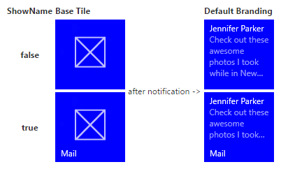
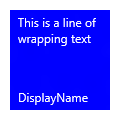
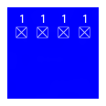
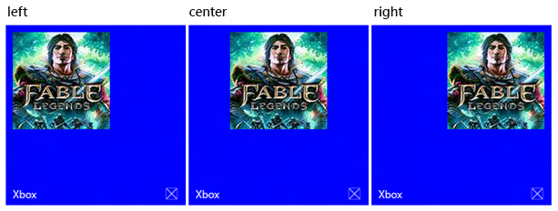
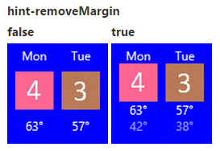
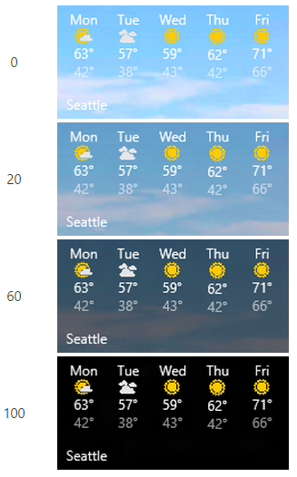

# Criar blocos adaptáveis


Modelos de blocos adaptáveis são um novo recurso no Windows 10, permitindo que você elabore seu próprio conteúdo de notificação de bloco usando uma linguagem de marcação simples e flexível que se adapte a densidades de tela diferentes. Este artigo explica como criar blocos dinâmicos adaptáveis para seu aplicativo da Plataforma Universal do Windows (UWP). Para obter a lista completa de elementos e atributos adaptáveis, consulte o [Esquema de blocos adaptáveis](tiles-and-notifications-adaptive-tiles-schema.md).

(Se quiser, ainda pode usar os modelos predefinidos do [Catálogo de modelos de blocos do Windows 8](https://msdn.microsoft.com/library/windows/apps/hh761491) durante a criação de notificações para o Windows 10.)

## <span id="Getting_started"></span><span id="getting_started"></span><span id="GETTING_STARTED"></span>Noções básicas


**Instale NotificationsExtensions.** Se quiser usar C# em vez de XML para gerar notificações, instale o pacote NuGet denominado [NotificationsExtensions](https://github.com/WindowsNotifications/NotificationsExtensions/wiki). Os exemplos em C# fornecidos neste artigo usam NotificationsExtensions.

**Instale o Visualizador de notificações.** Esse aplicativo UWP gratuito ajuda você a criar blocos dinâmicos adaptáveis, fornecendo uma visualização instantânea de seu bloco enquanto você o edita, semelhante ao modo de exibição de editor/design XAML do Visual Studio. Você pode ler [esta postagem no blog](http://blogs.msdn.com/b/tiles_and_toasts/archive/2015/09/22/introducing-notifications-visualizer-for-windows-10.aspx) para obter mais informações e pode baixar o Visualizador de Notificações [aqui](https://www.microsoft.com/store/apps/notifications-visualizer/9nblggh5xsl1).

## <span id="Usage_guidance"></span><span id="usage_guidance"></span><span id="USAGE_GUIDANCE"></span>Diretriz de uso


Os modelos adaptáveis são projetados para funcionar em diferentes fatores forma e tipos de notificação. Elementos como grupo e subgrupo vinculam conteúdo e não indicam um determinado comportamento visual próprio. A aparência final de uma notificação deve ser baseada no dispositivo específico no qual ela aparecerá, seja um telefone, tablet, desktop ou outro dispositivo.

Dicas são atributos opcionais que podem ser adicionados aos elementos para obter um comportamento visual específico. As dicas podem ser específicas ao dispositivo ou à notificação.

## <span id="A_basic_example"></span><span id="a_basic_example"></span><span id="A_BASIC_EXAMPLE"></span>Um exemplo básico


Este exemplo demonstra o que os modelos de blocos adaptáveis podem produzir.

```XML
<tile>
  <visual>
  
    <binding template="TileMedium">
      ...
    </binding>
  
    <binding template="TileWide">
      <text hint-style="subtitle">Jennifer Parker</text>
      <text hint-style="captionSubtle">Photos from our trip</text>
      <text hint-style="captionSubtle">Check out these awesome photos I took while in New Zealand!</text>
    </binding>
  
    <binding template="TileLarge">
      ...
    </binding>
  
  </visual>
</tile>
```

```CSharp
TileContent content = new TileContent()
{
    Visual = new TileVisual()
    {
        TileMedium = ...
  
        TileWide = new TileBinding()
        {
            Content = new TileBindingContentAdaptive()
            {
                Children =
                {
                    new TileText()
                    {
                        Text = "Jennifer Parker",
                        Style = TileTextStyle.Subtitle
                    },
  
                    new TileText()
                    {
                        Text = "Photos from our trip",
                        Style = TileTextStyle.CaptionSubtle
                    },
  
                    new TileText()
                    {
                        Text = "Check out these awesome photos I took while in New Zealand!",
                        Style = TileTextStyle.CaptionSubtle
                    }
                }
            }
        },
  
        TileLarge = ...
    }
};
```

**Resultado:**


## <span id="Tile_sizes"></span><span id="tile_sizes"></span><span id="TILE_SIZES"></span>Tamanhos de bloco


O conteúdo de cada tamanho de bloco é especificado individualmente em elementos [&lt;binding&gt;](tiles-and-notifications-adaptive-tiles-schema.md) separados no conteúdo XML. Escolha o tamanho de destino definindo o atributo template com um dos seguintes valores:

-   TileSmall
-   TileMedium
-   TileWide
-   TileLarge (somente para desktop)

Para o conteúdo XML de notificação de um único bloco, forneça elementos &lt;binding&gt; para cada tamanho de bloco para o qual você gostaria de oferecer suporte, conforme mostrado neste exemplo:

```XML
<tile>
  <visual>
  
    <binding template="TileSmall">
      <text>Small</text>
    </binding>
  
    <binding template="TileMedium">
      <text>Medium</text>
    </binding>
  
    <binding template="TileWide">
      <text>Wide</text>
    </binding>
  
    <binding template="TileLarge">
      <text>Large</text>
    </binding>
  
  </visual>
</tile>
```

```CSharp
TileContent content = new TileContent()
{
    Visual = new TileVisual()
    {
        TileSmall = new TileBinding()
        {
            Content = new TileBindingContentAdaptive()
            {
                Children =
                {
                    new TileText() { Text = "Small" }
                }
            }
        },
  
        TileMedium = new TileBinding()
        {
            Content = new TileBindingContentAdaptive()
            {
                Children =
                {
                    new TileText() { Text = "Medium" }
                }
            }
        },
  
        TileWide = new TileBinding()
        {
            Content = new TileBindingContentAdaptive()
            {
                Children =
                {
                    new TileText() { Text = "Wide" }
                }
            }
        },
  
        TileLarge = new TileBinding()
        {
            Content = new TileBindingContentAdaptive()
            {
                Children =
                {
                    new TileText() { Text = "Large" }
                }
            }
        }
    }
};
```

**Resultado:**


## <span id="Branding"></span><span id="branding"></span><span id="BRANDING"></span>Identidade visual


Você pode controlar a identidade visual na parte inferior de um bloco dinâmico (o nome de exibição e o logotipo de canto) usando o atributo branding no conteúdo da notificação. Você pode optar por exibir "none", somente "name", somente "logo", ou ambos, com "nameAndLogo".

**Observação**  O Windows Phone não aceita o logotipo de canto, então "logo" e "nameAndLogo" são definidos como o padrão "name" no telefone.

 

```XML
<visual branding="logo">
  ...
</visual>
```

```CSharp
new TileVisual()
{
    Branding = TileBranding.Logo,
    ...
}

new TileVisual()
{
    Branding = TileBranding.Logo,
    ...
}
```

**Resultado:**


A identidade visual pode ser aplicada para tamanhos de bloco específicos de uma destas maneiras:

1. Aplicando o atributo no elemento [&lt;binding&gt;](tiles-and-notifications-adaptive-tiles-schema.md)
2. Na aplicação do atributo ao elemento [&lt;visual&gt;](tiles-and-notifications-adaptive-tiles-schema.md), que afeta a carga de notificação inteira Se você não especificar a identidade visual para uma associação, ele usará a identidade visual fornecida no elemento visual.

```XML
<tile>
  <visual branding="nameAndLogo">
 
    <binding template="TileMedium" branding="logo">
      ...
    </binding>
 
    <!--Inherits branding from visual-->
    <binding template="TileWide">
      ...
    </binding>
 
  </visual>
</tile>
```

```CSharp
TileContent content = new TileContent()
{
    Visual = new TileVisual()
    {
        Branding = TileBranding.NameAndLogo,
 
        TileMedium = new TileBinding()
        {
            Branding = TileBranding.Logo,
            ...
        },
 
        // Inherits branding from Visual
        TileWide = new TileBinding()
        {
            ...
        }
    }
};
```

**Resultado de identidade visual padrão:**



Se você não especificar a identidade visual no conteúdo da notificação, as propriedades do bloco base determinarão a identidade visual. Se o bloco base mostrar o nome de exibição, a identidade visual padrão será "name". Caso contrário, a identidade visual padrão será "none" se o nome de exibição não for mostrado.

**Observação**   Isso é uma mudança do Windows 8.x, no qual a identidade visual padrão era "logo".

 

## <span id="Display_name"></span><span id="display_name"></span><span id="DISPLAY_NAME"></span>Nome de exibição


Você pode substituir o nome de exibição de uma notificação digitando a cadeia de caracteres de texto de sua escolha com o atributo **displayName**. Assim como na identidade visual, você pode especificar isso no elemento [&lt;visual&gt;](tiles-and-notifications-adaptive-tiles-schema.md), que afeta todo o conteúdo da notificação, ou no elemento [&lt;binding&gt;](tiles-and-notifications-adaptive-tiles-schema.md), que afeta somente blocos individuais.

```XML
<tile>
  <visual branding="nameAndLogo" displayName="Wednesday 22">
 
    <binding template="TileMedium" displayName="Wed. 22">
      ...
    </binding>
 
    <!--Inherits displayName from visual-->
    <binding template="TileWide">
      ...
    </binding>
 
  </visual>
</tile>
```

```CSharp
TileContent content = new TileContent()
{
    Visual = new TileVisual()
    {
        Branding = TileBranding.NameAndLogo,
        DisplayName = "Wednesday 22",
 
        TileMedium = new TileBinding()
        {
            DisplayName = "Wed. 22",
            ...
        },
 
        // Inherits DisplayName from Visual
        TileWide = new TileBinding()
        {
            ...
        }
    }
};
```

**Resultado:**


## <span id="Text"></span><span id="text"></span><span id="TEXT"></span>Text


O elemento [&lt;text&gt;](tiles-and-notifications-adaptive-tiles-schema.md) é usado para exibir texto. Você pode usar dicas para modificar a aparência do texto.

```XML
<text>This is a line of text</text></code></pre></td>
</tr>
</tbody>
</table>
```

<span codelanguage="CSharp"></span>
```CSharp
<colgroup>
<col width="100%" />
</colgroup>
<thead>
<tr class="header">
<th align="left">C#</th>
</tr>
</thead>
<tbody>
<tr class="odd">
new TileText()
{
    Text = "This is a line of text"
};
```

**Resultado:**


## <span id="Text_wrapping"></span><span id="text_wrapping"></span><span id="TEXT_WRAPPING"></span>Disposição do texto


Por padrão, o texto não é encapsulado e ultrapassa a borda do bloco. Use o atributo **hint-wrap** para definir a disposição do texto em um elemento de texto. Você também pode controlar o número mínimo e máximo de linhas usando **hint-minLines** e **hint-maxLines**, que aceitam números inteiros positivos.

```XML
<text hint-wrap="true">This is a line of wrapping text</text></code></pre></td>
</tr>
</tbody>
</table>
```

<span codelanguage="CSharp"></span>
```CSharp
<colgroup>
<col width="100%" />
</colgroup>
<thead>
<tr class="header">
<th align="left">C#</th>
</tr>
</thead>
<tbody>
<tr class="odd">
new TileText()
{
    Text = "This is a line of wrapping text",
    Wrap = true
};
```

**Resultado:**



## <span id="Text_styles"></span><span id="text_styles"></span><span id="TEXT_STYLES"></span>Estilos de texto


Os estilos controlam o tamanho, a cor e a espessura da fonte dos elementos de texto. Há uma série de estilos disponíveis, incluindo uma variação "sutil" de cada estilo que define a opacidade em 60%, que geralmente torna a cor do texto um tom de cinza-claro.

```XML
<text hint-style="base">Header content</text>
<text hint-style="captionSubtle">Subheader content</text>
```

```CSharp
new TileText()
{
    Text = "Header content",
    Style = TileTextStyle.Base
},
 
new TileText()
{
    Text = "Subheader content",
    Style = TileTextStyle.CaptionSubtle
}
```

**Resultado:**


**Observação**  O estilo padrão é caption quando hint-style é especificado.

 

**Estilos de texto básicos**

|                                |                           |             |
|--------------------------------|---------------------------|-------------|
| &lt;text hint-style="\*" /&gt; | Altura da fonte               | Espessura da fonte |
| caption                        | 12 pixels efetivos (epx) | Regular     |
| body                           | 15 epx                    | Regular     |
| base                           | 15 epx                    | Semibold    |
| subtitle                       | 20 epx                    | Regular     |
| title                          | 24 epx                    | Semilight   |
| subheader                      | 34 epx                    | Light       |
| header                         | 46 epx                    | Light       |

 

**Variações numéricas de estilo de texto**

Essas variações reduzem a altura da linha para que o conteúdo acima e abaixo se aproxime bem do texto.

|                  |
|------------------|
| titleNumeral     |
| subheaderNumeral |
| headerNumeral    |

 

**Variações sutis de estilo de texto**

Cada estilo tem uma variação sutil que oferece ao texto uma opacidade de 60%, o que geralmente torna a cor do texto um tom de cinza-claro.

|                        |
|------------------------|
| captionSubtle          |
| bodySubtle             |
| baseSubtle             |
| subtitleSubtle         |
| titleSubtle            |
| titleNumeralSubtle     |
| subheaderSubtle        |
| subheaderNumeralSubtle |
| headerSubtle           |
| headerNumeralSubtle    |

 

## <span id="Text_alignment"></span><span id="text_alignment"></span><span id="TEXT_ALIGNMENT"></span>Alinhamento do texto


O texto pode ser alinhamento horizontalmente à esquerda, ao centro ou à direita. Em idiomas da esquerda para a direita como o inglês, o padrão de texto é alinhado à esquerda. Em idiomas da direita para a esquerda como o árabe, o padrão de texto é alinhado à direita. Você pode definir manualmente o alinhamento com o atributo **hint-align** nos elementos.

```XML
<text hint-align="center">Hello</text></code></pre></td>
</tr>
</tbody>
</table>
```

<span codelanguage="CSharp"></span>
```CSharp
<colgroup>
<col width="100%" />
</colgroup>
<thead>
<tr class="header">
<th align="left">C#</th>
</tr>
</thead>
<tbody>
<tr class="odd">
new TileText()
{
    Text = "Hello",
    Align = TileTextAlign.Center
};
```

**Resultado:**


## <span id="Groups_and_subgroups"></span><span id="groups_and_subgroups"></span><span id="GROUPS_AND_SUBGROUPS"></span>Grupos e subgrupos


Os grupos permitem declarar semanticamente que o conteúdo dentro do grupo está relacionado e deve ser exibido em sua totalidade para o conteúdo fazer sentido. Por exemplo, você pode ter dois elementos de texto, um cabeçalho e um subcabeçalho, e não faz sentido que apenas o cabeçalho seja mostrado. Agrupando esses elementos dentro de um subgrupo, todos os elementos serão exibidos (se couberem) ou nenhum elemento será exibido (porque não cabem).

Para proporcionar a melhor experiência em dispositivos e telas, forneça vários grupos. Ter vários grupos permite que seu bloco se adapte a telas maiores.

**Observação**  O único filho válido de um grupo é somente um subgrupo.

 

```XML
...
<binding template="TileWide" branding="nameAndLogo">
  <group>
    <subgroup>
      <text hint-style="subtitle">Jennifer Parker</text>
      <text hint-style="captionSubtle">Photos from our trip</text>
      <text hint-style="captionSubtle">Check out these awesome photos I took while in New Zealand!</text>
    </subgroup>
  </group>
 
  <text />
 
  <group>
    <subgroup>
      <text hint-style="subtitle">Steve Bosniak</text>
      <text hint-style="captionSubtle">Build 2015 Dinner</text>
      <text hint-style="captionSubtle">Want to go out for dinner after Build tonight?</text>
    </subgroup>
  </group>
</binding>
...
```

```CSharp
...
 
TileWide = new TileBinding()
{
    Branding = TileBranding.NameAndLogo,
    Content = new TileBindingContentAdaptive()
    {
        Children =
        {
            CreateGroup(
                from: "Jennifer Parker",
                subject: "Photos from our trip",
                body: "Check out these awesome photos I took while in New Zealand!"),
 
            // For spacing
            new TileText(),
 
            CreateGroup(
                from: "Steve Bosniak",
                subject: "Build 2015 Dinner",
                body: "Want to go out for dinner after Build tonight?")
        }
    }
}
 
...
 
 
private static TileGroup CreateGroup(string from, string subject, string body)
{
    return new TileGroup()
    {
        Children =
        {
            new TileSubgroup()
            {
                Children =
                {
                    new TileText()
                    {
                        Text = from,
                        Style = TileTextStyle.Subtitle
                    },
 
                    new TileText()
                    {
                        Text = subject,
                        Style = TileTextStyle.CaptionSubtle
                    },
 
                    new TileText()
                    {
                        Text = body,
                        Style = TileTextStyle.CaptionSubtle
                    }
                }
            }
        }
    };
}
```

**Resultado:**


## <span id="Subgroups__columns_"></span><span id="subgroups__columns_"></span><span id="SUBGROUPS__COLUMNS_"></span>Subgrupos (colunas)


Os subgrupos também permitem que você divida dados em seções semânticas dentro de um grupo. Para blocos dinâmicos, isso se traduz visualmente em colunas.

O atributo **hint-weight** permite que você controle as larguras das colunas. O valor de **hint-weight** é expresso como uma proporção ponderada de espaço disponível, o que é idêntico ao comportamento de **GridUnitType.Star**. Para colunas de mesma largura, atribua cada peso a 1.

<table>
<colgroup>
<col width="50%" />
<col width="50%" />
</colgroup>
<tbody>
<tr class="odd">
<td align="left">hint-weight</td>
<td align="left">Porcentagem de largura</td>
</tr>
<tr class="even">
<td align="left">1</td>
<td align="left">25%</td>
</tr>
<tr class="odd">
<td align="left">1</td>
<td align="left">25%</td>
</tr>
<tr class="even">
<td align="left">1</td>
<td align="left">25%</td>
</tr>
<tr class="odd">
<td align="left">1</td>
<td align="left">25%</td>
</tr>
<tr class="even">
<td align="left">Espessura total: 4</td>
<td align="left"></td>
</tr>
</tbody>
</table>

 



Para tornar uma coluna duas vezes maior que outra coluna, atribua à coluna menor uma espessura de 1 e à coluna maior uma espessura de 2.

<table>
<colgroup>
<col width="50%" />
<col width="50%" />
</colgroup>
<tbody>
<tr class="odd">
<td align="left">hint-weight</td>
<td align="left">Porcentagem de largura</td>
</tr>
<tr class="even">
<td align="left">1</td>
<td align="left">33,3%</td>
</tr>
<tr class="odd">
<td align="left">2</td>
<td align="left">66,7%</td>
</tr>
<tr class="even">
<td align="left">Espessura total: 3</td>
<td align="left"></td>
</tr>
</tbody>
</table>

 


Se quiser que sua primeira coluna ocupe 20% da largura total e sua segunda coluna ocupe 80% da largura total, atribua a espessura da primeira a 20 e a segunda espessura a 80. Se o total de espessuras for igual a 100, os valores atuarão como porcentagens.

<table>
<colgroup>
<col width="50%" />
<col width="50%" />
</colgroup>
<tbody>
<tr class="odd">
<td align="left">hint-weight</td>
<td align="left">Porcentagem de largura</td>
</tr>
<tr class="even">
<td align="left">20</td>
<td align="left">20%</td>
</tr>
<tr class="odd">
<td align="left">80</td>
<td align="left">80%</td>
</tr>
<tr class="even">
<td align="left">Espessura total: 100</td>
<td align="left"></td>
</tr>
</tbody>
</table>

 


**Observação**  Uma margem de 8 pixels é automaticamente adicionada entre as colunas.

 

Quando houver mais de dois subgrupos, você deverá especificar **hint-weight**, que aceita somente números inteiros positivos. Se você não especificar hint-weight para o primeiro subgrupo, ele será atribuído a uma espessura de 50. O próximo subgrupo que não tiver um atributo hint-weight especificado será atribuído a uma espessura igual a 100 menos a soma das espessuras anteriores, ou a 1 se o resultado for zero. Os subgrupos restantes que não tiverem atributos hint-weights especificados serão atribuídos a uma espessura de 1.

Este é um código de exemplo para um bloco de previsão do tempo que mostra como você pode obter um bloco com cinco colunas de mesma largura:

```XML
...
<binding template="TileWide" displayName="Seattle" branding="name">
  <group>
    <subgroup hint-weight="1">
      <text hint-align="center">Mon</text>
      <image src="Assets\Weather\Mostly Cloudy.png" hint-removeMargin="true"/>
      <text hint-align="center">63°</text>
      <text hint-align="center" hint-style="captionsubtle">42°</text>
    </subgroup>
    <subgroup hint-weight="1">
      <text hint-align="center">Tue</text>
      <image src="Assets\Weather\Cloudy.png" hint-removeMargin="true"/>
      <text hint-align="center">57°</text>
      <text hint-align="center" hint-style="captionsubtle">38°</text>
    </subgroup>
    <subgroup hint-weight="1">
      <text hint-align="center">Wed</text>
      <image src="Assets\Weather\Sunny.png" hint-removeMargin="true"/>
      <text hint-align="center">59°</text>
      <text hint-align="center" hint-style="captionsubtle">43°</text>
    </subgroup>
    <subgroup hint-weight="1">
      <text hint-align="center">Thu</text>
      <image src="Assets\Weather\Sunny.png" hint-removeMargin="true"/>
      <text hint-align="center">62°</text>
      <text hint-align="center" hint-style="captionsubtle">42°</text>
    </subgroup>
    <subgroup hint-weight="1">
      <text hint-align="center">Fri</text>
      <image src="Assets\Weather\Sunny.png" hint-removeMargin="true"/>
      <text hint-align="center">71°</text>
      <text hint-align="center" hint-style="captionsubtle">66°</text>
    </subgroup>
  </group>
</binding>
...
```

```CSharp
...
TileWide = new TileBinding()
{
    DisplayName = "Seattle",
    Branding = TileBranding.Name,
    Content = new TileBindingContentAdaptive()
    {
        Children =
        {
            new TileGroup()
            {
                Children =
                {
                    CreateSubgroup("Mon", "Mostly Cloudy.png", "63°", "42°"),
 
                    CreateSubgroup("Tue", "Cloudy.png", "57°", "38°"),
 
                    CreateSubgroup("Wed", "Sunny.png", "59°", "43°"),
 
                    CreateSubgroup("Thu", "Sunny.png", "62°", "42°"),
 
                    CreateSubgroup("Fri", "Sunny.png", "71°", "66°")
                }
            }
        }
    }
}
...
 
 
private static TileSubgroup CreateSubgroup(string day, string image, string highTemp, string lowTemp)
{
    return new TileSubgroup()
    {
        Weight = 1,
 
        Children =
        {
            new TileText()
            {
                Text = day,
                Align = TileTextAlign.Center
            },
 
            new TileImage()
            {
                Source = new TileImageSource("Assets/Weather/" + image),
                RemoveMargin = true
            },
 
            new TileText()
            {
                Text = highTemp,
                Align = TileTextAlign.Center
            },
 
            new TileText()
            {
                Text = lowTemp,
                Align = TileTextAlign.Center,
                Style = TileTextStyle.CaptionSubtle
            }
        }
    };
}
```

**Resultado:**


## <span id="Images"></span><span id="images"></span><span id="IMAGES"></span>Imagens


O elemento &lt;image&gt; é usado para exibir imagens na notificação do bloco. As imagens podem ser embutidas no conteúdo do bloco (padrão), como uma imagem de plano de fundo atrás do conteúdo, ou como uma imagem de "espiar" animada na parte superior da notificação.

**Observação**   Há [restrições sobre o tamanho do arquivo e as dimensões das imagens](https://msdn.microsoft.com/library/windows/apps/hh781198).

 

Com nenhum comportamento extra especificado, as imagens se encolherão ou expandirão uniformemente para preencher a largura disponível. O exemplo abaixo mostra um bloco com duas colunas e imagens embutidas. As imagens embutidas se ampliam para preencher a largura da coluna.

```XML
...
<binding template="TileMedium" displayName="Seattle" branding="name">
  <group>
    <subgroup>
      <text hint-align="center">Mon</text>
      <image src="Assets\Apps\Weather\Mostly Cloudy.png" hint-removeMargin="true"/>
      <text hint-align="center">63°</text>
      <text hint-style="captionsubtle" hint-align="center">42°</text>
    </subgroup>
    <subgroup>
      <text hint-align="center">Tue</text>
      <image src="Assets\Apps\Weather\Cloudy.png" hint-removeMargin="true"/>
      <text hint-align="center">57°</text>
      <text hint-style="captionSubtle" hint-align="center">38°</text>
    </subgroup>
  </group>
</binding>
...
```

```CSharp
...
TileMedium = new TileBinding()
{
    DisplayName = "Seattle",
    Branding = TileBranding.Name,
    Content = new TileBindingContentAdaptive()
    {
        Children =
        {
            new TileGroup()
            {
                Children =
                {
                    CreateSubgroup("Mon", "Mostly Cloudy.png", "63°", "42°"),
 
                    CreateSubgroup("Tue", "Cloudy.png", "57°", "38°")
                }
            }
        }
    }
}
...
 
 
private static TileSubgroup CreateSubgroup(string day, string image, string highTemp, string lowTemp)
{
    return new TileSubgroup()
    {
        Children =
        {
            new TileText()
            {
                Text = day,
                Align = TileTextAlign.Center
            },
 
            new TileImage()
            {
                Source = new TileImageSource("Assets/Weather/" + image),
                RemoveMargin = true
            },
 
            new TileText()
            {
                Text = highTemp,
                Align = TileTextAlign.Center
            },
 
            new TileText()
            {
                Text = lowTemp,
                Align = TileTextAlign.Center,
                Style = TileTextStyle.CaptionSubtle
            }
        }
    };
}
```

**Resultado:**


As imagens posicionadas na raiz de &lt;binding&gt;, ou no primeiro grupo, também se ampliarão para caber na altura disponível.

### <span id="Image_alignment"></span><span id="image_alignment"></span><span id="IMAGE_ALIGNMENT"></span>Alinhamento das imagens

As imagens podem ser definidas para alinhamento à esquerda, ao centro ou à direita com o atributo **hint-align**. Isso também fará com que as imagens sejam exibidas em sua resolução nativa, em vez de ampliadas para preencher a largura.

```XML
...
<binding template="TileLarge">
  <image src="Assets/fable.jpg" hint-align="center"/>
</binding>
...
```

```CSharp
...
TileLarge = new TileBinding()
{
    Content = new TileBindingContentAdaptive()
    {
        Children =
        {
            new TileImage()
            {
                Source = new TileImageSource("Assets/fable.jpg"),
                Align = TileImageAlign.Center
            }
        }
    }
}
...
```

**Resultado:**



### <span id="Image_margins"></span><span id="image_margins"></span><span id="IMAGE_MARGINS"></span>Margens de imagem

Por padrão, as imagens embutidas têm uma margem de 8 pixels entre qualquer conteúdo acima ou abaixo da imagem. Essa margem pode ser removida usando o atributo **hint-removeMargin** na imagem. Entretanto, as imagens sempre retêm a margem de 8 pixels da borda do bloco, e os subgrupos (colunas) sempre retêm o preenchimento de 8 pixels entre colunas.

```XML
...
<binding template="TileMedium" branding="none">
  <group>
    <subgroup>
      <text hint-align="center">Mon</text>
      <image src="Assets\Numbers\4.jpg" hint-removeMargin="true"/>
      <text hint-align="center">63°</text>
      <text hint-style="captionsubtle" hint-align="center">42°</text>
    </subgroup>
    <subgroup>
      <text hint-align="center">Tue</text>
      <image src="Assets\Numbers\3.jpg" hint-removeMargin="true"/>
      <text hint-align="center">57°</text>
      <text hint-style="captionsubtle" hint-align="center">38°</text>
    </subgroup>
  </group>
</binding>
...
```

```CSharp
...
 
TileMedium = new TileBinding()
{
    Branding = TileBranding.None,
    Content = new TileBindingContentAdaptive()
    {
        Children =
        {
            new TileGroup()
            {
                Children =
                {
                    CreateSubgroup("Mon", "4.jpg", "63°", "42°"),
 
                    CreateSubgroup("Tue", "3.jpg", "57°", "38°")
                }
            }
        }
    }
}
 
...
 
 
private static TileSubgroup CreateSubgroup(string day, string image, string highTemp, string lowTemp)
{
    return new TileSubgroup()
    {
        Weight = 1,
 
        Children =
        {
            new TileText()
            {
                Text = day,
                Align = TileTextAlign.Center
            },
 
            new TileImage()
            {
                Source = new TileImageSource("Assets/Numbers/" + image),
                RemoveMargin = true
            },
 
            new TileText()
            {
                Text = highTemp,
                Align = TileTextAlign.Center
            },
 
            new TileText()
            {
                Text = lowTemp,
                Align = TileTextAlign.Center,
                Style = TileTextStyle.CaptionSubtle
            }
        }
    };
}
```



### <span id="Image_cropping"></span><span id="image_cropping"></span><span id="IMAGE_CROPPING"></span>Corte de imagem

As imagens podem ser cortadas em círculo usando o atributo **hint-crop**, que atualmente aceita apenas os valores de "none" (padrão) ou "circle".

```XML
...
<binding template="TileLarge" hint-textStacking="center">
  <group>
    <subgroup hint-weight="1"/>
    <subgroup hint-weight="2">
      <image src="Assets/Apps/Hipstame/hipster.jpg" hint-crop="circle"/>
    </subgroup>
    <subgroup hint-weight="1"/>
  </group>
 
  <text hint-style="title" hint-align="center">Hi,</text>
  <text hint-style="subtitleSubtle" hint-align="center">MasterHip</text>
</binding>
...
```

```CSharp
...
TileLarge = new TileBinding()
{
    Content = new TileBindingContentAdaptive()
    {
        TextStacking = TileTextStacking.Center,
 
        Children =
        {
            new TileGroup()
            {
                Children =
                {
                    new TileSubgroup() { Weight = 1 },
 
                    new TileSubgroup()
                    {
                        Weight = 2,
                        Children =
                        {
                            new TileImage()
                            {
                                Source = new TileImageSource("Assets/Apps/Hipstame/hipster.jpg"),
                                Crop = TileImageCrop.Circle
                            }
                        }
                    },
 
                    new TileSubgroup() { Weight = 1 }
                }
            },
 
 
            new TileText()
            {
                Text = "Hi,",
                Style = TileTextStyle.Title,
                Align = TileTextAlign.Center
            },
 
            new TileText()
            {
                Text = "MasterHip",
                Style = TileTextStyle.SubtitleSubtle,
                Align = TileTextAlign.Center
            }
        }
    }
}
...
```

**Resultado:**


### <span id="Background_image"></span><span id="background_image"></span><span id="BACKGROUND_IMAGE"></span>Imagem de plano de fundo

Para definir uma imagem de plano de fundo, coloque um elemento de imagem na raiz de &lt;binding&gt; e defina o atributo de posicionamento como "background".

```XML
...
<binding template="TileWide">
  <image src="Assets\Mostly Cloudy-Background.jpg" placement="background"/>
  <group>
    <subgroup hint-weight="1">
      <text hint-align="center">Mon</text>
      <image src="Assets\Weather\Mostly Cloudy.png" hint-removeMargin="true"/>
      <text hint-align="center">63°</text>
      <text hint-align="center" hint-style="captionsubtle">42°</text>
    </subgroup>
    ...
  </group>
</binding>
...
```

```CSharp
...
TileWide = new TileBinding()
{
    Content = new TileBindingContentAdaptive()
    {
        BackgroundImage = new TileBackgroundImage()
        {
            Source = new TileImageSource("Assets/Mostly Cloudy-Background.jpg")
        },
 
        Children =
        {
            new TileGroup()
            {
                Children =
                {
                    CreateSubgroup("Mon", "Mostly Cloudy.png", "63°", "42°")
                    ...
                }
            }
        }
    }
}
...
 
 
private static TileSubgroup CreateSubgroup(string day, string image, string highTemp, string lowTemp)
{
    return new TileSubgroup()
    {
        Weight = 1,
 
        Children =
        {
            new TileText()
            {
                Text = day,
                Align = TileTextAlign.Center
            },
 
            new TileImage()
            {
                Source = new TileImageSource("Assets/Weather/" + image),
                RemoveMargin = true
            },
 
            new TileText()
            {
                Text = highTemp,
                Align = TileTextAlign.Center
            },
 
            new TileText()
            {
                Text = lowTemp,
                Align = TileTextAlign.Center,
                Style = TileTextStyle.CaptionSubtle
            }
        }
    };
}
```

**Resultado:**


Além disso, você pode definir uma sobreposição preta em sua imagem de plano de fundo usando **hint-overlay**, que aceita inteiros de 0 a 100, sendo 0 nenhuma sobreposição e 100 uma sobreposição total preta. O valor padrão é 20.

```XML
...
<binding template="TileWide" hint-overlay="60">
  <image src="Assets\Mostly Cloudy-Background.jpg" placement="background"/>
  ...
</binding>
...
```

```CSharp
...
 
TileWide = new TileBinding()
{
    Content = new TileBindingContentAdaptive()
    {
        BackgroundImage = new TileBackgroundImage()
        {
            Source = new TileImageSource("Assets/Mostly Cloudy-Background.jpg"),
            Overlay = 60
        },
 
        ...
    }
}
 
...
```

**Resultado de hint-overlay:**



### <span id="Peek_image"></span><span id="peek_image"></span><span id="PEEK_IMAGE"></span>Imagem de "espiar"

Você pode especificar uma imagem que "espie" a parte superior do bloco. A imagem de "espiar" usa uma animação para deslizar para baixo/para cima a partir da parte superior do bloco, espiando a visualização, e depois deslizar de volta para revelar o conteúdo principal no bloco. Para definir uma imagem de "espiar", coloque um elemento de imagem na raiz de &lt;binding&gt; e defina o atributo de posicionamento como "peek".

```XML
...
<binding template="TileMedium" branding="name">
  <image placement="peek" src="Assets/Apps/Hipstame/hipster.jpg"/>
  <text>New Message</text>
  <text hint-style="captionsubtle" hint-wrap="true">Hey, have you tried Windows 10 yet?</text>
</binding>
...
```

```CSharp
...
 
TileWide = new TileBinding()
{
    Branding = TileBranding.Name,
 
    Content = new TileBindingContentAdaptive()
    {
        PeekImage = new TilePeekImage()
        {
            Source = new TileImageSource("Assets/Apps/Hipstame/hipster.jpg")
        },
 
        Children =
        {
            new TileText()
            {
                Text = "New Message"
            },
 
            new TileText()
            {
                Text = "Hey, have you tried Windows 10 yet?",
                Style = TileTextStyle.CaptionSubtle,
                Wrap = true
            }
        }
    }
}
 
...
```


**Corte em círculo para imagens dinâmicas e de plano de fundo**

Use o seguinte atributo em imagens dinâmicas e de plano de fundo para fazer um corte em círculo:

hint-crop="circle"

O resultado ficará assim:


**Usar imagem dinâmica e de plano de fundo**

Para usar uma imagem dinâmica e de plano de fundo em uma notificação de bloco, especifique uma imagem dinâmica e uma imagem de plano de fundo em sua carga de notificação.

O resultado ficará assim:


**Use hint-overlay em uma imagem de "espiar"**

Você pode usar **hint-overlay** em uma imagem de "espiar" para adicionar opacidade e tornar o nome de exibição do bloco mais legível. Se você especificar **hint-overlay** no elemento &lt;binding&gt;, a sobreposição será aplicada a ambas as imagens, de plano de fundo e "espiar".

Você também pode aplicar **hint-overlay** a um elemento &lt;image&gt; que tenha placement="peek" ou placement="background", para ter níveis de opacidade distintos para cada uma dessas imagens. Se você não especificar uma sobreposição, serão aplicados os padrões de opacidade de imagem de plano de fundo de 20% e de opacidade de imagem dinâmica de 0%.

Este exemplo mostra uma imagem de plano de fundo com opacidade de 20% (esquerda) e opacidade de 0% (direita):


## <span id="Vertical_alignment__text_stacking_"></span><span id="vertical_alignment__text_stacking_"></span><span id="VERTICAL_ALIGNMENT__TEXT_STACKING_"></span>Alinhamento vertical (empilhamento de texto)


Você pode controlar o alinhamento vertical do conteúdo em seu bloco usando o atributo **hint-textStacking** nos elementos  [&lt;binding&gt;](tiles-and-notifications-adaptive-tiles-schema.md) e [&lt;subgroup&gt;](tiles-and-notifications-adaptive-tiles-schema.md). Por padrão, tudo é alinhado verticalmente à parte superior, mas você também pode alinhar o conteúdo à parte inferior ou ao centro.

### <span id="Text_stacking_on_binding_element"></span><span id="text_stacking_on_binding_element"></span><span id="TEXT_STACKING_ON_BINDING_ELEMENT"></span>Empilhamento de texto no elemento binding

Quando aplicado no nível [&lt;enviar&gt;](tiles-and-notifications-adaptive-tiles-schema.md), o empilhamento de texto define o alinhamento vertical do conteúdo da notificação como um todo, alinhando no espaço vertical disponível acima da área de identidade visual/notificação.

```XML
...
<binding template="TileMedium" hint-textStacking="center" branding="logo">
  <text hint-style="base" hint-align="center">Hi,</text>
  <text hint-style="captionSubtle" hint-align="center">MasterHip</text>
</binding>
...
```

```CSharp
...
 
TileMedium = new TileBinding()
{
    Branding = TileBranding.Logo,
 
    Content = new TileBindingContentAdaptive()
    {
        TextStacking = TileTextStacking.Center,
 
        Children =
        {
            new TileText()
            {
                Text = "Hi,",
                Style = TileTextStyle.Base,
                Align = TileTextAlign.Center
            },
 
            new TileText()
            {
                Text = "MasterHip",
                Style = TileTextStyle.CaptionSubtle,
                Align = TileTextAlign.Center
            }
        }
    }
}
 
...
```


### <span id="Text_stacking_on_subgroup_element"></span><span id="text_stacking_on_subgroup_element"></span><span id="TEXT_STACKING_ON_SUBGROUP_ELEMENT"></span>Empilhamento de texto no elemento subgroup

Quando aplicado no nível [&lt;subgroup&gt;](tiles-and-notifications-adaptive-tiles-schema.md), o empilhamento de texto define o alinhamento vertical do conteúdo do subgrupo (coluna), alinhando no espaço vertical disponível dentro do grupo inteiro.

```XML
...
<binding template="TileWide" branding="nameAndLogo">
  <group>
    <subgroup hint-weight="33">
      <image src="Assets/Apps/Hipstame/hipster.jpg" hint-crop="circle"/>
    </subgroup>
    <subgroup hint-textStacking="center">
      <text hint-style="subtitle">Hi,</text>
      <text hint-style="bodySubtle">MasterHip</text>
    </subgroup>
  </group>
</binding>
...
```

```CSharp
...
 
TileWide = new TileBinding()
{
    Branding = TileBranding.NameAndLogo,
 
    Content = new TileBindingContentAdaptive()
    {
        Children =
        {
            new TileGroup()
            {
                Children =
                {
                    // Image column
                    new TileSubgroup()
                    {
                        Weight = 33,
                        Children =
                        {
                            new TileImage()
                            {
                                Source = new TileImageSource("Assets/Apps/Hipstame/hipster.jpg"),
                                Crop = TileImageCrop.Circle
                            }
                        }
                    },
 
                    // Text column
                    new TileSubgroup()
                    {
                        // Vertical align its contents
                        TextStacking = TileTextStacking.Center,
 
                        Children =
                        {
                            new TileText()
                            {
                                Text = "Hi,",
                                Style = TileTextStyle.Subtitle
                            },
 
                            new TileText()
                            {
                                Text = "MasterHip",
                                Style = TileTextStyle.BodySubtle
                            }
                        }
                    }
                }
            }
        }
    }
}
 
...
```

## <span id="related_topics"></span>Tópicos relacionados


* [Esquema de blocos adaptáveis](tiles-and-notifications-adaptive-tiles-schema.md)
* [NotificationsExtensions em GitHub](https://github.com/WindowsNotifications/NotificationsExtensions/wiki)
* [Catálogo de modelos de bloco especial](tiles-and-notifications-special-tile-templates-catalog.md)
 

 


<!--HONumber=May16_HO2-->


