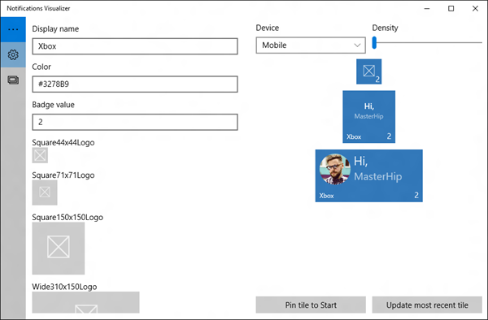

# Visualizador de notificações

Visualizador de Notificações é um novo aplicativo da Plataforma Universal do Windows (UWP) na [Loja](https://www.microsoft.com/store/apps/notifications-visualizer/9nblggh5xsl1) que ajuda os desenvolvedores no design de blocos dinâmicos adaptáveis para Windows 10.

## Visão geral

O aplicativo Visualizador de Notificações oferece visualizações visuais instantâneas do bloco à medida que você edita, semelhante ao modo de exibição editor/design XAML do Visual Studio. O aplicativo também verifica se há erros, o que garante que você crie uma carga de bloco válida.

Esta captura de tela do aplicativo mostra a carga XML e como tamanhos de bloco são exibidos em um dispositivo selecionado:

 

Com o Visualizador de Notificações, é possível criar e testar cargas de bloco adaptável sem que seja necessário editar e implantar o aplicativo propriamente dito. Depois que tiver criado uma carga com resultados visuais ideais, você pode integrá-la ao aplicativo. Consulte [Enviar uma notificação de bloco local](tiles-and-notifications-sending-a-local-tile-notification.md) para saber mais.

**Observação**   A simulação do Visualizador de Notificações do menu Iniciar do Windows nem sempre é totalmente precisa e não dá suporte a algumas propriedades de carga como [baseUri](https://msdn.microsoft.com/library/windows/apps/br208712). Quando tiver o design de bloco que você deseja, teste-o fixando o bloco no menu Iniciar real para verificar se ele é exibido como você deseja.

 

## Recursos

Visualizador de Notificações acompanha várias cargas de exemplo para demonstrar o que é possível com blocos dinâmicos adaptáveis e ajudar na introdução. É possível testar todas as opções de texto diferente, grupos/subgrupos, imagens de plano de fundo, e você pode ver como o bloco se adapta a dispositivos e telas diferentes. Depois que tiver feito alterações, você poderá salvar a carga atualizada em um arquivo para uso futuro.

O editor fornece e erros e avisos em tempo real. Por exemplo, caso a carga do aplicativo esteja limitada a menos de 5 KB (uma limitação da plataforma), o Visualizador de Notificações avisa se a carga excede esse limite. Ele apresenta avisos para nomes de atributo ou valores incorretos, o que ajuda a depurar problemas visuais.

É possível controlar propriedades do bloco de controle, como nome de exibição, cor, logotipos, ShowName, valor de notificação. Essas opções ajudam a entender instantaneamente como propriedades e cargas de notificação de blocos interagem, além dos resultados que elas produzem.

Esta captura de tela do aplicativo mostra o editor de blocos:

 

## Tópicos relacionados

* [Obtenha o Visualizador de Notificações na Loja](https://www.microsoft.com/store/apps/notifications-visualizer/9nblggh5xsl1)
* [Criar blocos adaptáveis](tiles-and-notifications-create-adaptive-tiles.md)
* [Modelos de blocos adaptáveis: esquema e documentação](tiles-and-notifications-adaptive-tiles-schema.md)
* [Blocos e notificações do sistema (blog MSDN)](http://blogs.msdn.com/b/tiles_and_toasts/)
* [Biblioteca NotificationsExtensions (blog MSDN)](http://blogs.msdn.com/b/tiles_and_toasts/archive/2015/08/20/introducing-notificationsextensions-for-windows-10.aspx)
 

 

<!--HONumber=Jun16_HO4-->

