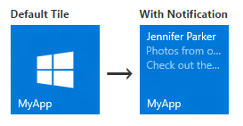

<link rel="stylesheet" href="https://az835927.vo.msecnd.net/sites/uwp/Resources/css/custom.css"> 
# Enviar uma notificação de bloco local


Os blocos dos aplicativos primários no Windows 10 são definidos no manifesto do aplicativo, e os blocos secundários são criados e definidos programaticamente pelo código do aplicativo. Este artigo descreve como enviar uma notificação de bloco local para um bloco primário e um bloco secundário usando modelos de bloco adaptável. (Notificação local é aquela que é enviada pelo código do aplicativo, e não uma enviada por push ou obtida em um servidor Web.)



**Observação**   Saiba mais sobre [como criar blocos adaptáveis](tiles-and-notifications-create-adaptive-tiles.md) e [esquema de modelo de bloco adaptável](tiles-and-notifications-adaptive-tiles-schema.md).

 

## Instalar o pacote NuGet


Recomendamos instalar o [Pacote NuGet NotificationsExtensions](https://www.nuget.org/packages/NotificationsExtensions.Win10/), que simplifica as coisas gerando cargas de bloco com objetos, em vez de XML bruto.

Os exemplos de código embutido neste artigo são para C# com o pacote NuGet [NotificationsExtensions](https://github.com/WindowsNotifications/NotificationsExtensions/wiki) instalado. (Caso prefira criar o próprio XML, você pode encontrar exemplos de código sem [NotificationsExtensions](https://github.com/WindowsNotifications/NotificationsExtensions/wiki) ao final do artigo.)

## Adicionar declarações de namespace


Para acessar as APIs de bloco, inclua o namespace [**Windows.UI.Notifications**](https://msdn.microsoft.com/library/windows/apps/br208661). Também recomendamos incluir o namespace **NotificationsExtensions.Tiles** de maneira que seja possível usufruir nossas APIs auxiliares de bloco (você deve instalar o pacote NuGet [NotificationsExtensions](https://github.com/WindowsNotifications/NotificationsExtensions/wiki) para acessar essas APIs).

```
using Windows.UI.Notifications;
using NotificationsExtensions.Tiles; // NotificationsExtensions.Win10
```

## Criar o conteúdo da notificação


No Windows 10, as cargas de bloco são definidas usando-se modelos de bloco adaptável, que permitem criar layouts visuais personalizados para as notificações. (Para saber o que é possível com blocos adaptáveis, consulte os artigos [Criar blocos adaptáveis](tiles-and-notifications-create-adaptive-tiles.md) e [Modelos de bloco adaptável](tiles-and-notifications-adaptive-tiles-schema.md).)

Este exemplo de código cria conteúdo de bloco adaptável para blocos médios e largos.

```
// In a real app, these would be initialized with actual data
string from = "Jennifer Parker";
string subject = "Photos from our trip";
string body = "Check out these awesome photos I took while in New Zealand!";
 
 
// Construct the tile content
TileContent content = new TileContent()
{
    Visual = new TileVisual()
    {
        TileMedium = new TileBinding()
        {
            Content = new TileBindingContentAdaptive()
            {
                Children =
                {
                    new TileText()
                    {
                        Text = from
                    },
 
                    new TileText()
                    {
                        Text = subject,
                        Style = TileTextStyle.CaptionSubtle
                    },
 
                    new TileText()
                    {
                        Text = body,
                        Style = TileTextStyle.CaptionSubtle
                    }
                }
            }
        },
 
        TileWide = new TileBinding()
        {
            Content = new TileBindingContentAdaptive()
            {
                Children =
                {
                    new TileText()
                    {
                        Text = from,
                        Style = TileTextStyle.Subtitle
                    },
 
                    new TileText()
                    {
                        Text = subject,
                        Style = TileTextStyle.CaptionSubtle
                    },
 
                    new TileText()
                    {
                        Text = body,
                        Style = TileTextStyle.CaptionSubtle
                    }
                }
            }
        }
    }
};
```

O conteúdo da notificação se parece com o seguinte quando exibido em um bloco médio:


## Criar a notificação


Depois de ter o conteúdo da notificação, você precisará criar um novo [**TileNotification**](https://msdn.microsoft.com/library/windows/apps/br208616). O construtor **TileNotification** utiliza um objeto[**XmlDocument**](https://msdn.microsoft.com/library/windows/apps/br208620) do Windows Runtime, que é possível obter no método **TileContent.GetXml** caso você esteja usando [NotificationsExtensions](https://github.com/WindowsNotifications/NotificationsExtensions/wiki).

Este exemplo de código cria uma notificação para um novo bloco.

```
// Create the tile notification
var notification = new TileNotification(content.GetXml());
```

## Definir um tempo de expiração para a notificação (opcional)


Por padrão, as notificações locais de bloco e selo não expiram, enquanto as notificações por push, periódicas e agendadas expiram após três dias. Como o conteúdo do bloco não deve persistir por mais tempo do que o necessário, é melhor prática definir um tempo de expiração que faça sentido para o aplicativo, especialmente em notificações de bloco e selo locais.

Este exemplo de código cria uma notificação que expira e será removida do bloco após dez minutos.

```
tileNotification.ExpirationTime = DateTimeOffset.UtcNow.AddMinutes(10);</code></pre></td>
</tr>
</tbody>
</table>
```

## Enviar a notificação


Embora o envio local de uma notificação de bloco seja simples, enviar a notificação para um bloco primário ou secundário é um pouco diferente.

**Bloco primário**

Para enviar uma notificação a um bloco primário, use o [**TileUpdateManager**](https://msdn.microsoft.com/library/windows/apps/br208622) para criar um atualizador de bloco para o bloco primário e envie a notificação chamando "Update". Independentemente de estar visível, o bloco primário do aplicativo sempre existe, logo, é possível enviar notificações para ele, mesmo quando não está fixado. Se o usuário fixar o bloco primário posteriormente, as notificações que você enviou serão exibidas depois.

Este exemplo de código envia uma notificação para um bloco primário.


```
<colgroup>
<col width="100%" />
</colgroup>
<tbody>
<tr class="odd">
// And send the notification
TileUpdateManager.CreateTileUpdaterForApplication().Update(notification);
```

**Bloco secundário**

Para enviar uma notificação para um bloco secundário, primeiro assegure-se de que o bloco secundário exista. Se você tentar criar um atualizador de bloco para um bloco secundário que não existe (por exemplo, se o usuário desafixou o bloco secundário), uma exceção será acionada. É possível usar [**SecondaryTile.Exists**](https://msdn.microsoft.com/library/windows/apps/br242205) (tileId) para descobrir se o bloco secundário está fixado, criar um atualizador para o bloco secundário e enviar a notificação.

Este exemplo de código envia uma notificação para um bloco secundário.

```
// If the secondary tile is pinned
if (SecondaryTile.Exists("MySecondaryTile"))
{
    // Get its updater
    var updater = TileUpdateManager.CreateTileUpdaterForSecondaryTile("MySecondaryTile");
 
    // And send the notification
    updater.Update(notification);
}
```


## Limpar notificações no bloco (opcional)


Na maioria dos casos, você deverá limpar uma notificação assim que o usuário tiver interagido com esse conteúdo. Por exemplo, quando o usuário inicia o aplicativo, convém limpar todas as notificações do bloco. Caso as notificações estejam associadas ao tempo, recomendamos definir um tempo de expiração na notificação, em vez de limpar explicitamente a notificação.

Este exemplo de código limpa a notificação de bloco.

```
TileUpdateManager.CreateTileUpdaterForApplication().Clear();</code></pre></td>
</tr>
</tbody>
</table>
```

Em um bloco com a fila de notificação habilitada e notificações na fila, chamar o método Clear esvazia a fila. No entanto, você não pode limpar uma notificação por meio do servidor de aplicativos; somente o código do aplicativo local pode limpar notificações.

Notificações periódicas ou enviadas por push só podem adicionar novas notificações ou substituir notificações existentes. Uma chamada local para o método Clear limpará o bloco independentemente das notificações propriamente ditas chegarem via push, serem periódicas ou locais. Notificações agendadas que ainda não foram exibidas não são apagadas por esse método.


## Próximas etapas


**Como usar a fila de notificações**

Agora que concluiu a primeira atualização do bloco, você pode expandir a funcionalidade do título habilitando uma [fila de notificação](https://msdn.microsoft.com/library/windows/apps/xaml/hh868234).

**Outros métodos de entrega da notificação**

Este artigo mostra como enviar a atualização do bloco como uma notificação. Para explorar outros métodos de entrega da notificação, inclusive agendadas, periódicas e enviadas por push, consulte [Entrega de notificações](tiles-and-notifications-choosing-a-notification-delivery-method.md).

**Método de entrega XmlEncode**

Caso você não esteja usando [NotificationsExtensions](https://github.com/WindowsNotifications/NotificationsExtensions/wiki), esse método de entrega da notificação é outra alternativa.


```
<colgroup>
<col width="100%" />
</colgroup>
<tbody>
<tr class="odd">
public string XmlEncode(string text)
{
    StringBuilder builder = new StringBuilder();
    using (var writer = XmlWriter.Create(builder))
    {
        writer.WriteString(text);
    }

    return builder.ToString();
}
```

## Exemplos de código sem NotificationsExtensions


Caso você prefira trabalhar com XML bruto, em vez do pacote NuGet [NotificationsExtensions](https://github.com/WindowsNotifications/NotificationsExtensions/wiki), use esses exemplos de código alternativos para os três primeiros exemplos fornecidos neste artigo. O restante dos exemplos de código podem ser usados com [NotificationsExtensions](https://github.com/WindowsNotifications/NotificationsExtensions/wiki) ou com XML bruto.

Adicionar declarações de namespace

```
using Windows.UI.Notifications;
using Windows.Data.Xml.Dom;
```

Criar o conteúdo da notificação

```
// In a real app, these would be initialized with actual data
string from = "Jennifer Parker";
string subject = "Photos from our trip";
string body = "Check out these awesome photos I took while in New Zealand!";
 
 
// TODO - all values need to be XML escaped
 
 
// Construct the tile content as a string
string content = $@"
<tile>
    <visual>
 
        <binding template=&#39;TileMedium&#39;>
            <text>{from}</text>
            <text hint-style=&#39;captionSubtle&#39;>{subject}</text>
            <text hint-style=&#39;captionSubtle&#39;>{body}</text>
        </binding>
 
        <binding template=&#39;TileWide&#39;>
            <text hint-style=&#39;subtitle&#39;>{from}</text>
            <text hint-style=&#39;captionSubtle&#39;>{subject}</text>
            <text hint-style=&#39;captionSubtle&#39;>{body}</text>
        </binding>
 
    </visual>
</tile>";
```

Criar a notificação

```
// Load the string into an XmlDocument
XmlDocument doc = new XmlDocument();
doc.LoadXml(content);
 
// Then create the tile notification
var notification = new TileNotification(doc);
```

## Tópicos relacionados


* [Criar blocos adaptáveis](tiles-and-notifications-create-adaptive-tiles.md)
* [Modelos de blocos adaptáveis: esquema e documentação](tiles-and-notifications-adaptive-tiles-schema.md)
* [NotificationsExtensions.Win10 (pacote NuGet)](https://www.nuget.org/packages/NotificationsExtensions.Win10/)
* [NotificationsExtensions em GitHub](https://github.com/WindowsNotifications/NotificationsExtensions/wiki)
* [Amostra de código completo em GitHub](https://github.com/WindowsNotifications/quickstart-sending-local-tile-win10)
* [**Namespace Windows.UI.Notifications**](https://msdn.microsoft.com/library/windows/apps/br208661)
* [Como usar a fila de notificações (XAML)](https://msdn.microsoft.com/library/windows/apps/xaml/hh868234)
* [Entrega de notificações](tiles-and-notifications-choosing-a-notification-delivery-method.md)
 

 


<!--HONumber=Aug16_HO3-->


