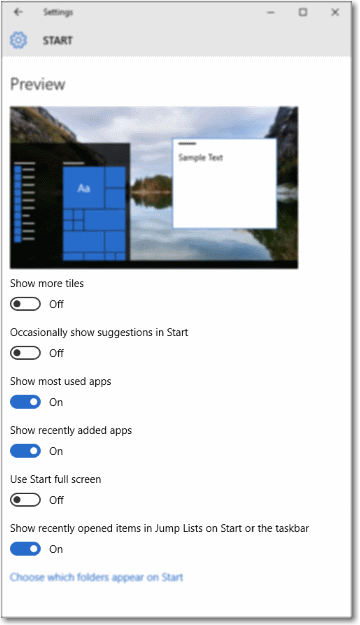

# Switches de alternância

O switch de alternância representa um comutador físico que permite aos usuários ativar ou desativar itens. Use controles **ToggleSwitch** para apresentar aos usuários exatamente duas opções mutuamente excludentes (como ligar/desligar), em que a escolha de uma opção resulta em uma ação imediata.

<span class="sidebar_heading" style="font-weight: bold;">APIs importantes</span>

-   [**Classe ToggleSwitch**](https://msdn.microsoft.com/library/windows/apps/windows.ui.xaml.controls.toggleswitch.aspx)
-   [**Propriedade IsOn**](https://msdn.microsoft.com/library/windows/apps/windows.ui.xaml.controls.toggleswitch.ison.aspx)
-   [**Evento Toggled**](https://msdn.microsoft.com/library/windows/apps/windows.ui.xaml.controls.toggleswitch.toggled.aspx)

## Esse é o controle correto?

Use um switch de alternância para operações binárias que entram em vigor logo depois que o usuário gira o switch. Por exemplo, use um botão de alternância para ativar ou desativar serviços ou componentes de hardware, como o Wi-Fi:


Se um comutador físico funcionaria para a ação, um switch de alternância é provavelmente o melhor controle a ser usado.

Depois que o usuário ativa ou desativa o botão, é recomendável que a ação correspondente seja imediatamente executada.

### Escolhendo entre o botão de alternância e a caixa de seleção

Para algumas ações, uma caixa de seleção ou um switch de alternância pode funcionar. Para decidir qual controle funcionaria melhor, siga estas dicas:

-   Use um botão de alternância para configurações binárias quando as alterações são efetivadas imediatamente depois que o usuário as altera.

    

    No exemplo acima, está claro pelo switch de alternância que a rede sem fio está "Ativada". Mas, pela caixa de seleção, o usuário precisa pensar se a rede sem fio está ativada ou se ele precisa marcar a caixa para ativá-la.

-   Use uma caixa de seleção quando o usuário precisar executar etapas extras para que as alterações sejam efetivadas. Por exemplo, se o usuário precisar clicar no botão "enviar" ou "avançar" para aplicar as alterações, use uma caixa de seleção.

    

-   Use caixas de seleção ou uma [caixa de listagem](lists.md) quando o usuário puder selecionar vários itens:

    

## Exemplos

Switches de alternância nas configurações gerais do aplicativo de notícias.


Switches de alternância nas configurações do menu Iniciar no Windows.



## Criar um botão de alternância

Veja a seguir como criar um switch de alternância simples. Este XAML cria o switch de alternância WiFi mostrado anteriormente.

```xaml
<ToggleSwitch x:Name="wiFiToggle" Header="Wifi"/>
```
Veja como criar o mesmo switch de alternância em código.

```csharp
ToggleSwitch wiFiToggle = new ToggleSwitch();
wiFiToggle.Header = "WiFi";

// Add the toggle switch to a parent container in the visual tree.
stackPanel1.Children.Add(wiFiToggle);
```

### IsOn

O switch pode ser ativado ou desativado. Use a propriedade [**IsOn**](https://msdn.microsoft.com/library/windows/apps/windows.ui.xaml.controls.toggleswitch.ison.aspx) para determinar o estado do switch. Quando o switch é usado para controlar o estado de outra propriedade binária, você pode usar uma associação, conforme mostrado aqui.

```
<StackPanel Orientation="Horizontal">
    <ToggleSwitch x:Name="ToggleSwitch1" IsOn="True"/>
    <ProgressRing IsActive="{x:Bind ToggleSwitch1.IsOn, Mode=OneWay}" Width="130"/>
</StackPanel>
```

### Toggled

Em outros casos, você pode manipular o evento [**Toggled**](https://msdn.microsoft.com/library/windows/apps/windows.ui.xaml.controls.toggleswitch.toggled.aspx) para responder a alterações no estado.

Este exemplo mostra como adicionar um manipulador de evento Toggled no XAML e no código. O evento Toggled é manipulado para ativar ou desativar a um anel de progresso e alterar sua visibilidade.

```xaml
<ToggleSwitch x:Name="toggleSwitch1" IsOn="True" 
              Toggled="ToggleSwitch_Toggled"/>
```

Veja como criar o mesmo switch de alternância em código.

```csharp
// Create a new toggle switch and add a Toggled event handler.
ToggleSwitch toggleSwitch1 = new ToggleSwitch();
toggleSwitch1.Toggled += ToggleSwitch_Toggled;

// Add the toggle switch to a parent container in the visual tree.
stackPanel1.Children.Add(toggleSwitch1);
```

Aqui está o manipulador para o evento Toggled.

```csharp
private void ToggleSwitch_Toggled(object sender, RoutedEventArgs e)
{
    ToggleSwitch toggleSwitch = sender as ToggleSwitch;
    if (toggleSwitch != null)
    {
        if (toggleSwitch.IsOn == true)
        {
            progress1.IsActive = true;
            progress1.Visibility = Visibility.Visible;
        }
        else
        {
            progress1.IsActive = false;
            progress1.Visibility = Visibility.Collapsed;
        }
    }
}
```

### Rótulos Ligar/desligar

Por padrão, o switch de alternância inclui rótulos Ligar/desligar literais, que são localizados automaticamente. Você pode substituir esses rótulos definindo as propriedades [**OnContent**](https://msdn.microsoft.com/library/windows/apps/windows.ui.xaml.controls.toggleswitch.oncontent.aspx) e [**OffContent**](https://msdn.microsoft.com/library/windows/apps/windows.ui.xaml.controls.toggleswitch.offcontent.aspx).

Este exemplo substitui os rótulos Ligar/desligar por rótulos Mostrar/ocultar.  

```xaml
<ToggleSwitch x:Name="imageToggle" Header="Show images"
              OffContent="Show" OnContent="Hide" 
              Toggled="ToggleSwitch_Toggled"/>
```

Você também pode usar conteúdo mais complexo, definindo as propriedades [**OnContentTemplate**](https://msdn.microsoft.com/library/windows/apps/windows.ui.xaml.controls.toggleswitch.oncontenttemplate.aspx) e [ **OffContentTemplate**](https://msdn.microsoft.com/library/windows/apps/windows.ui.xaml.controls.toggleswitch.offcontenttemplate.aspx).

## Recomendações

-   Substitua os rótulos Ligar e Desligar quando houver rótulos mais específicos para a configuração. Se houver rótulos curtos (3 a 4 caracteres) que representem opostos binários que são mais apropriados para uma determinada configuração, use-os. Por exemplo, use "Mostrar/ocultar" se a configuração é "Mostrar imagens". Usar rótulos mais específicos pode ajudar na localização da interface do usuário.
-   Evite substituir os rótulos Ligar e Desligar a menos que seja necessário; use os rótulos padrão a menos que a situação peça rótulos personalizados.
-   Os rótulos devem conter no máximo 4 caracteres.

## Artigos relacionados

[**ToggleSwitch**](https://msdn.microsoft.com/library/windows/apps/hh701411)
- [Botões de opção](radio-button.md)
- [Switches de alternância](toggles.md)
- [Caixas de seleção](checkbox.md)

**Para desenvolvedores (XAML)**
- [**Classe ToggleSwitch**](https://msdn.microsoft.com/library/windows/apps/br209712)


<!--HONumber=May16_HO2-->


