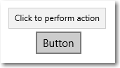

# Dicas de ferramentas

\[ Atualizado para aplicativos UWP no Windows 10. Para ler artigos do Windows 8.x, consulte o [arquivo morto](http://go.microsoft.com/fwlink/p/?linkid=619132) \]

Dica de ferramenta é uma breve descrição vinculada a outro controle ou objeto. Dicas de ferramenta ajudam os usuários a entender objetos desconhecidos que não estão descritos diretamente na UI. Eles são exibidos automaticamente quando o usuário move o foco, pressiona e mantém ou passa o ponteiro do mouse sobre um controle. A dica de ferramenta desaparece após alguns segundos, ou quando o usuário move o foco do dedo, do ponteiro ou do teclado/gamepad.

APIs importantes

-   [**Classe ToolTip**](https://msdn.microsoft.com/library/windows/apps/br227608)
-   [**Classe ToolTipService**](https://msdn.microsoft.com/library/windows/apps/windows.ui.xaml.controls.tooltipservice)

## Este é o controle correto?

Use uma dica de ferramenta para descobrir mais informações sobre um controle antes de solicitar que o usuário execute uma ação. As dicas de ferramenta devem ser usadas de forma comedida e apenas quando são valiosas para o usuário que está tentando executar uma tarefa. Uma regra prática é que, se as informações estiverem disponíveis em outro lugar na mesma experiência, você não precisa de uma dica de ferramenta. Uma dica de ferramenta útil esclarece uma ação que não é clara.

Quando devo usar uma dica de ferramenta? Para decidir, considere estas perguntas:

-   **Informações devem se tornar visíveis com base no foco do ponteiro?**
    Se não, use outro controle. Exiba dicas apenas como resultado da interação do usuário; nunca as exiba por conta própria.

-   **Um controle tem um rótulo de texto?**
    Se não, use uma dica de ferramenta para fornecer o rótulo. É uma boa prática de design de UX rotular a maioria dos controles em linha, e para isso você não precisa de dicas de ferramenta. Controles de barra de ferramentas e botões de comando que mostrem apenas ícones precisam de dicas de ferramentas.

-   **Um objeto se beneficia de uma descrição ou informações adicionais?**
    Se sim, use uma dica de ferramenta. Mas o texto deve ser complementar, ou seja, não essencial às tarefas principais. Se for essencial, coloque-o diretamente na interface do usuário para que os usuários não precisem procurar nem buscá-lo.

-   **As informações complementares são um erro, aviso ou status?**
    Se sim, use outro elemento da interface do usuário, como um menu suspenso.

-   **Os usuários precisam interagir com a dica?**
    Se sim, use outro controle. Os usuários não podem interagir com dicas porque mover o mouse faz com que elas desapareçam.

-   **Os usuários precisam imprimir as informações complementares?**
    Se sim, use outro controle.

-   **Os usuários irão considerar as dicas incômodas ou distrativas?**
    Se sim, considere usar outra solução, incluindo não fazer nada. Se você usar dicas onde elas possam distrair os usuários, deixe que eles as ative ou desative.

## Exemplo

Uma dica de ferramenta no aplicativo Bing Mapas.

## Recomendações

-   Use dicas de ferramentas com moderação (ou não as use). Dicas de ferramentas são uma interrupção. Uma dica de ferramenta pode distrair tanto quanto um pop-up, portanto não os utilize, a menos que eles adicionem valor significativo.
-   Mantenha o texto de dica de ferramenta conciso. Dicas de ferramentas são perfeitas para frases curtas e fragmentos de frases. Grandes blocos de texto podem ser complicados, e a dica de ferramenta pode expirar antes de o usuário terminar a leitura.
-   Crie textos de dica de ferramenta que sejam úteis e adicionem algo. O texto da dica de ferramenta deve ser informativo. Não crie um texto óbvio nem repita apenas o que já está na tela. Como o texto de dica de ferramenta nem sempre fica visível, devem ser informações complementares que os usuários não precisam ler. Comunique informações importantes usando rótulos de controle autoexplicativos ou texto complementar in-loco.
-   Use imagens quando for apropriado. Às vezes é melhor usar uma imagem em uma dica de ferramenta. Por exemplo, quando o usuário passar o ponteiro do mouse sobre um hiperlink, você poderá usar uma dica de ferramenta para mostrar uma prévia da página vinculada.
-   Não use uma dica de ferramenta para exibir texto já visível na interface do usuário. Por exemplo, não coloque uma dica de ferramenta em um botão que mostre o mesmo texto do botão.
-   Não coloque controles interativos dentro da dica de ferramenta.
-   Não coloque imagens que pareçam interativas dentro da dica de ferramenta.

Tópicos relacionados
-----------------------------------------------

* [**Classe ToolTip**](https://msdn.microsoft.com/library/windows/apps/br227608)

<!--HONumber=Mar16_HO4-->

