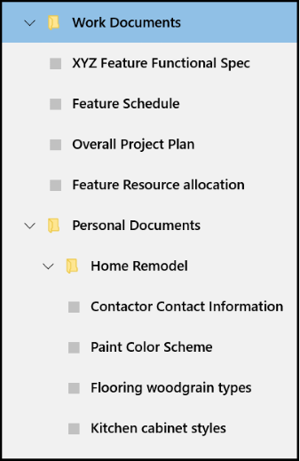

# <a name="hierarchical-layout-with-treeview"></a>Layout hierárquico com TreeView
<link rel="stylesheet" href="https://az835927.vo.msecnd.net/sites/uwp/Resources/css/custom.css"> 

<div class="microsoft-internal-note">
As linhas vermelhas para TreeView estão no Design Depot: http://designdepotweb1/DesignDepot.FrontEnd/#/Dashboard/856
</div>

TreeView é um padrão de lista hierárquica com nós de expansão e recolhimento que contêm itens aninhados. Os itens aninhados podem ser nós adicionais ou itens de lista normais. Você pode usar um [ListView](https://msdn.microsoft.com/library/windows/apps/windows.ui.xaml.controls.listview.aspx) para criar um modo de exibição de árvore para ilustrar uma estrutura de pastas ou relacionamentos aninhados em sua interface do usuário.

O [Exemplo de TreeView](http://go.microsoft.com/fwlink/?LinkId=785018) é uma implementação de referência criada usando **ListView**. Não é um controle autônomo. O TreeView visto no Painel de Favoritos no navegador Microsoft Edge usa essa implementação de referência.

O exemplo dá suporte a:
- Aninhamento de nível N
- Expansão/recolhimento de nós
- Ações de arrastar e soltar nós no TreeView
- Acessibilidade integrada

 | 
-- | --
Exemplo de referência de TreeView | TreeView no navegador Edge

## <a name="is-this-the-right-pattern"></a>Este é o padrão certo?

- Use um TreeView quando os itens tiverem itens de lista aninhados e se for importante ilustrar a relação hierárquica dos itens para seus colegas e nós.

- Evite usar TreeView se realçar o relacionamento aninhado de um item não for prioridade. Para a maioria dos cenários detalhados, um modo de exibição de lista normal é apropriado

## <a name="treeview-ui-structure"></a>Estrutura da interface do usuário do TreeView

Você pode usar ícones para representar nós em um TreeView. Uma combinação de recuo e ícones pode ser usada para representar a relação aninhada entre nós de pasta/pai e nós que não sejam de pasta/filho. Veja a seguir as orientações sobre como fazer isso.

### <a name="icons"></a>Ícones

Use ícones para indicar que um item é um nó, bem como o estado em que o nó está (expandido ou recolhido).

#### <a name="chevron"></a>Divisa

Para manter a consistência, os nós recolhidos devem usar uma divisa que aponte para a direita, e os nós expandidos devem usar uma divisa que aponte para baixo.


#### <a name="folder"></a>Pasta

Use um ícone de pasta somente para representações literais de pastas.


#### <a name="chevron-and-folder"></a>Divisa e pasta

A combinação de uma divisa e uma pasta deverá ser usada somente se os itens de lista que não forem nós no TreeView também tiverem ícones.


#### <a name="redlines-for-indentation-of-folders-and-non-folder-nodes"></a>Linhas vermelhas para recuo de pastas e nós que não são de pasta

Use as linhas vermelhas na captura de tela abaixo para recuo de nós de pasta e que não são de pasta.


## <a name="building-a-treeview"></a>Criando um TreeView

O TreeView tem as seguintes classes principais. Todas elas estão definidas e foram incluídos na implementação de referência.

> **Observação**&nbsp;&nbsp;O TreeView está implementado como um [componente do Tempo de Execução do Windows](https://msdn.microsoft.com/windows/uwp/winrt-components/index) escrito em C++, então, ele pode ser referenciado por um aplicativo UWP em qualquer linguagem. No exemplo, o código de TreeView está localizado na pasta *cpp/Control*. Não há nenhuma pasta *cs/Control* correspondente para C#.

- A classe `TreeNode` implementa o layout hierárquico para o TreeView. Ela também mantém os dados que serão associados a ela no modelo de itens.
- A classe `TreeView` eventos de classe para ItemClick, expansão/recolhimento de pastas e início da ação de arrastar.
- A classe `TreeViewItem` implementa os eventos para a operação de soltar.
- A classe `ViewModel` mescla a lista de TreeViewItems para que as operações como navegação de teclado e arrastar e soltar possam ser herdadas de ListView.

## <a name="create-a-data-template-for-your-treeviewitem"></a>Criar um modelo de dados para seu TreeViewItem

Leia a seguir a seção do XAML que configura o modelo de dados para itens do tipo pasta e que não são pasta.
- Para especificar um ListViewItem como uma pasta, você precisará definir explicitamente a propriedade [AllowDrop](https://msdn.microsoft.com/library/windows/apps/windows.ui.xaml.uielement.allowdrop.aspx) como **true** nesse ListViewItem. Este XAML mostra uma maneira de fazer isso.
- Para especificar um ListViewItem como item que não seja pasta, você não precisa especificar nenhuma propriedade no ListViewItem. Basta definir a propriedade AllowDrop como True no ListView.
- Você pode usar os ícones de pasta expandida/recolhida ou divisas para indicar visualmente se uma pasta está expandida ou recolhida.
- Você pode usar conversores para escolher os diferentes ícones necessários para o estado expandido versus recolhido conforme visto neste exemplo.

```xaml
<!-- MainPage.xaml -->
<DataTemplate x:Key="TreeViewItemDataTemplate">
    <StackPanel Orientation="Horizontal" Height="40" Margin="{Binding Depth, Converter={StaticResource IntToIndConverter}}" AllowDrop="{Binding Data.IsFolder}">
        <FontIcon x:Name="expandCollapseChevron"
                  Glyph="{Binding IsExpanded, Converter={StaticResource expandCollapseGlyphConverter}}"
                  Visibility="{Binding Data.IsFolder, Converter={StaticResource booleanToVisibilityConverter}}"                           
                  FontSize="12"
                  Margin="12,8,12,8"
                  FontFamily="Segoe MDL2 Assets"                          
                  />
        <Grid>
            <FontIcon x:Name ="expandCollapseFolder"
                      Glyph="{Binding IsExpanded, Converter={StaticResource folderGlyphConverter}}"
                      Foreground="#FFFFE793"
                      FontSize="16"
                      Margin="0,8,12,8"
                      FontFamily="Segoe MDL2 Assets"
                      Visibility="{Binding Data.IsFolder, Converter={StaticResource booleanToVisibilityConverter}}"
                      />

            <FontIcon x:Name ="nonFolderIcon"
                      Glyph="&#xE160;"
                      Foreground="{ThemeResource SystemControlForegroundBaseLowBrush}"
                      FontSize="12"
                      Margin="20,8,12,8"
                      FontFamily="Segoe MDL2 Assets"
                      Visibility="{Binding Data.IsFolder, Converter={StaticResource inverseBooleanToVisibilityConverter}}"
                      />

            <FontIcon x:Name ="expandCollapseFolderOutline"
                      Glyph="{Binding IsExpanded, Converter={StaticResource folderOutlineGlyphConverter}}"
                      Foreground="#FFECC849"
                      FontSize="16"
                      Margin="0,8,12,8"
                      FontFamily="Segoe MDL2 Assets"
                      Visibility="{Binding Data.IsFolder, Converter={StaticResource booleanToVisibilityConverter}}"/>
        </Grid>

        <TextBlock Text="{Binding Data.Name}"
                   HorizontalAlignment="Stretch"
                   VerticalAlignment="Center"  
                   FontWeight="Medium"
                   FontFamily="Segoe MDL2 Assests"                           
                   Style="{ThemeResource BodyTextBlockStyle}"/>
    </StackPanel>
</DataTemplate>
```

## <a name="set-up-the-data-in-your-treeview"></a>Configurar os dados em seu TreeView

Veja a seguir o código que configura os dados no exemplo de TreeView.

```csharp
 public MainPage()
 {
     this.InitializeComponent();

     TreeNode workFolder = CreateFolderNode("Work Documents");
     workFolder.Add(CreateFileNode("Feature Functional Spec"));
     workFolder.Add(CreateFileNode("Feature Schedule"));
     workFolder.Add(CreateFileNode("Overall Project Plan"));
     workFolder.Add(CreateFileNode("Feature Resource allocation"));
     sampleTreeView.RootNode.Add(workFolder);

     TreeNode remodelFolder = CreateFolderNode("Home Remodel");
     remodelFolder.IsExpanded = true;
     remodelFolder.Add(CreateFileNode("Contactor Contact Information"));
     remodelFolder.Add(CreateFileNode("Paint Color Scheme"));
     remodelFolder.Add(CreateFileNode("Flooring woodgrain types"));
     remodelFolder.Add(CreateFileNode("Kitchen cabinet styles"));

     TreeNode personalFolder = CreateFolderNode("Personal Documents");
     personalFolder.IsExpanded = true;
     personalFolder.Add(remodelFolder);

     sampleTreeView.RootNode.Add(personalFolder);
 }

 private static TreeNode CreateFileNode(string name)
 {
     return new TreeNode() { Data = new FileSystemData(name) };
 }

 private static TreeNode CreateFolderNode(string name)
 {
     return new TreeNode() { Data = new FileSystemData(name) { IsFolder = true } };
 }
```

Depois de concluir as etapas acima, você terá um layout de TreeView/hierárquico totalmente preenchido com aninhamento de nível n, suporte integrado para expansão/recolhimento de pastas, ações arrastar e soltar entre pastas e acessibilidade.

Para fornecer ao usuário a capacidade de adicionar/remover itens do TreeView, recomendamos que você adicione um menu de contexto para expor essas opções para o usuário.


## <a name="related-articles"></a>Artigos relacionados

- [Exemplo de TreeView](http://go.microsoft.com/fwlink/?LinkId=785018)
- [**ListView**](https://msdn.microsoft.com/library/windows/apps/windows.ui.xaml.controls.listview.aspx)
- [ListView e GridView](listview-and-gridview.md)


<!--HONumber=Dec16_HO2-->


