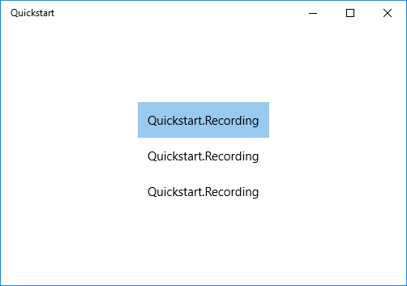

# <a name="data-binding-overview"></a>Visão geral da associação de dados

Este tópico mostra como associar um controle (ou outro elemento da interface do usuário) a um único item ou um controle de itens a uma coleção de itens em um aplicativo UWP (Plataforma Universal do Windows). Este tópico também mostra como controlar a renderização de itens, implementar uma exibição de detalhes com base em uma seleção e converter dados para exibição. Para saber mais detalhes, consulte [Vinculação de dados em detalhes](data-binding-in-depth.md).

## <a name="prerequisites"></a>Pré-requisitos

Este tópico pressupõe que você saiba como criar um aplicativo UWP básico. Para obter instruções sobre como criar seu primeiro aplicativo UWP, consulte [Introdução aos aplicativos do Windows](https://developer.microsoft.com/windows/getstarted).

## <a name="create-the-project"></a>Criar o projeto

Crie um novo projeto **Aplicativo em branco (universal do Windows)**. Nomeie-o como "Início rápido".

## <a name="binding-to-a-single-item"></a>Associação a um único item

Cada associação consiste em um destino da associação e uma origem de associação. Normalmente, o destino é uma propriedade de um controle ou outro elemento de interface do usuário, e a origem é uma propriedade de uma instância de classe (um modelo de dados ou um modelo de exibição). Este exemplo mostra como associar um controle a um único item. O destino é a propriedade **Text** de um **TextBlock**. A origem é uma instância de uma classe simples denominada **Recording** que representa uma gravação de áudio. Primeiro, vamos examinar a classe.

Se você estiver usando c# ou C++ c++ /CX, em seguida, adicione uma nova classe ao seu projeto e nomeie a classe de **gravação**.

Se você estiver usando [C++ c++ WinRT](/windows/uwp/cpp-and-winrt-apis/intro-to-using-cpp-with-winrt), em seguida, adicionar novos itens de **Midl File (. idl)** para o projeto, chamado conforme mostrado no C++ c++ WinRT abaixo de listagem de exemplo de código. Substitua o conteúdo desses novos arquivos com o código de [MIDL 3.0](/uwp/midl-3/intro) mostrada na listagem, compile o projeto para gerar `Recording.h` e `.cpp` e `RecordingViewModel.h` e `.cpp`e, em seguida, adicione o código para os arquivos gerados para corresponder a listagem. Para obter mais informações sobre esses arquivos gerados e como copiá-los em seu projeto, consulte [controles XAML; associar a C++ c++ WinRT propriedade](/windows/uwp/cpp-and-winrt-apis/binding-property).

```csharp
namespace Quickstart
{
    public class Recording
    {
        public string ArtistName { get; set; }
        public string CompositionName { get; set; }
        public DateTime ReleaseDateTime { get; set; }
        public Recording()
        {
            this.ArtistName = "Wolfgang Amadeus Mozart";
            this.CompositionName = "Andante in C for Piano";
            this.ReleaseDateTime = new DateTime(1761, 1, 1);
        }
        public string OneLineSummary
        {
            get
            {
                return $"{this.CompositionName} by {this.ArtistName}, released: "
                    + this.ReleaseDateTime.ToString("d");
            }
        }
    }
    public class RecordingViewModel
    {
        private Recording defaultRecording = new Recording();
        public Recording DefaultRecording { get { return this.defaultRecording; } }
    }
}
```

```cppwinrt
// Recording.idl
namespace Quickstart
{
    runtimeclass Recording
    {
        Recording(String artistName, String compositionName, Windows.Globalization.Calendar releaseDateTime);
        String ArtistName{ get; };
        String CompositionName{ get; };
        Windows.Globalization.Calendar ReleaseDateTime{ get; };
        String OneLineSummary{ get; };
    }
}

// RecordingViewModel.idl
import "Recording.idl";

namespace Quickstart
{
    runtimeclass RecordingViewModel
    {
        RecordingViewModel();
        Quickstart.Recording DefaultRecording{ get; };
    }
}

// Recording.h
// Add these fields:
...
#include <sstream>
...
private:
    std::wstring m_artistName;
    std::wstring m_compositionName;
    Windows::Globalization::Calendar m_releaseDateTime;
...

// Recording.cpp
// Implement like this:
...
Recording::Recording(hstring const& artistName, hstring const& compositionName, Windows::Globalization::Calendar const& releaseDateTime) :
    m_artistName{ artistName.c_str() },
    m_compositionName{ compositionName.c_str() },
    m_releaseDateTime{ releaseDateTime } {}

hstring Recording::ArtistName(){ return hstring{ m_artistName }; }
hstring Recording::CompositionName(){ return hstring{ m_compositionName }; }
Windows::Globalization::Calendar Recording::ReleaseDateTime(){ return m_releaseDateTime; }

hstring Recording::OneLineSummary()
{
    std::wstringstream wstringstream;
    wstringstream << m_compositionName.c_str();
    wstringstream << L" by " << m_artistName.c_str();
    wstringstream << L", released: " << m_releaseDateTime.MonthAsNumericString().c_str();
    wstringstream << L"/" << m_releaseDateTime.DayAsString().c_str();
    wstringstream << L"/" << m_releaseDateTime.YearAsString().c_str();
    return hstring{ wstringstream.str().c_str() };
}
...

// RecordingViewModel.h
// Add this field:
...
#include "Recording.h"
...
private:
    Quickstart::Recording m_defaultRecording{ nullptr };
...

// RecordingViewModel.cpp
// Implement like this:
...
Quickstart::Recording RecordingViewModel::DefaultRecording()
{
    Windows::Globalization::Calendar releaseDateTime;
    releaseDateTime.Year(1761);
    releaseDateTime.Month(1);
    releaseDateTime.Day(1);
    m_defaultRecording = winrt::make<Recording>(L"Wolfgang Amadeus Mozart", L"Andante in C for Piano", releaseDateTime);
    return m_defaultRecording;
}
...
```

```cppcx
// Recording.h
#include <sstream>
namespace Quickstart
{
    public ref class Recording sealed
    {
    private:
        Platform::String^ artistName;
        Platform::String^ compositionName;
        Windows::Globalization::Calendar^ releaseDateTime;
    public:
        Recording(Platform::String^ artistName, Platform::String^ compositionName,
            Windows::Globalization::Calendar^ releaseDateTime) :
            artistName{ artistName },
            compositionName{ compositionName },
            releaseDateTime{ releaseDateTime } {}
        property Platform::String^ ArtistName
        {
            Platform::String^ get() { return this->artistName; }
        }
        property Platform::String^ CompositionName
        {
            Platform::String^ get() { return this->compositionName; }
        }
        property Windows::Globalization::Calendar^ ReleaseDateTime
        {
            Windows::Globalization::Calendar^ get() { return this->releaseDateTime; }
        }
        property Platform::String^ OneLineSummary
        {
            Platform::String^ get()
            {
                std::wstringstream wstringstream;
                wstringstream << this->CompositionName->Data();
                wstringstream << L" by " << this->ArtistName->Data();
                wstringstream << L", released: " << this->ReleaseDateTime->MonthAsNumericString()->Data();
                wstringstream << L"/" << this->ReleaseDateTime->DayAsString()->Data();
                wstringstream << L"/" << this->ReleaseDateTime->YearAsString()->Data();
                return ref new Platform::String(wstringstream.str().c_str());
            }
        }
    };
    public ref class RecordingViewModel sealed
    {
    private:
        Recording ^ defaultRecording;
    public:
        RecordingViewModel()
        {
            Windows::Globalization::Calendar^ releaseDateTime = ref new Windows::Globalization::Calendar();
            releaseDateTime->Year = 1761;
            releaseDateTime->Month = 1;
            releaseDateTime->Day = 1;
            this->defaultRecording = ref new Recording{ L"Wolfgang Amadeus Mozart", L"Andante in C for Piano", releaseDateTime };
        }
        property Recording^ DefaultRecording
        {
            Recording^ get() { return this->defaultRecording; };
        }
    };
}

// Recording.cpp
#include "pch.h"
#include "Recording.h"
```

Em seguida, exponha a classe de origem de associação na classe que representa a página de marcação. Fazemos isso adicionando uma propriedade do tipo **RecordingViewModel** a **MainPage**.

Se você estiver usando [C++ c++ WinRT](/windows/uwp/cpp-and-winrt-apis/intro-to-using-cpp-with-winrt), em seguida, primeira atualização `MainPage.idl`. Compile o projeto para gerar `MainPage.h` e `.cpp`e mesclar as alterações nesses arquivos gerados com aqueles do seu projeto.

```csharp
namespace Quickstart
{
    public sealed partial class MainPage : Page
    {
        public MainPage()
        {
            this.InitializeComponent();
            this.ViewModel = new RecordingViewModel();
        }
        public RecordingViewModel ViewModel{ get; set; }
    }
}
```

```cppwinrt
// MainPage.idl
// Add this property:
import "RecordingViewModel.idl";
...
RecordingViewModel ViewModel{ get; };
...

// MainPage.h
// Add this property and this field:
...
#include "RecordingViewModel.h"
...
    Quickstart::RecordingViewModel ViewModel();

private:
    Quickstart::RecordingViewModel m_viewModel{ nullptr };
...

// MainPage.cpp
// Implement like this:
...
MainPage::MainPage()
{
    InitializeComponent();
    m_viewModel = winrt::make<RecordingViewModel>();
}
Quickstart::RecordingViewModel MainPage::ViewModel()
{
    return m_viewModel;
}
...
```

```cppcx
// MainPage.h
...
#include "Recording.h"

namespace Quickstart
{
    public ref class MainPage sealed
    {
    private:
        RecordingViewModel ^ viewModel;
    public:
        MainPage();

        property RecordingViewModel^ ViewModel
        {
            RecordingViewModel^ get() { return this->viewModel; };
        }
    };
}

// MainPage.cpp
...
MainPage::MainPage()
{
    InitializeComponent();
    this->viewModel = ref new RecordingViewModel();
}
```

A última parte é associar um **TextBlock** à propriedade **ViewModel.DefaultRecording.OneLiner**.

```xml
<Page x:Class="Quickstart.MainPage" ... >
    <Grid Background="{ThemeResource ApplicationPageBackgroundThemeBrush}">
        <TextBlock Text="{x:Bind ViewModel.DefaultRecording.OneLineSummary}"
    HorizontalAlignment="Center"
    VerticalAlignment="Center"/>
    </Grid>
</Page>
```

Se você estiver usando [C++ c++ WinRT](/windows/uwp/cpp-and-winrt-apis/intro-to-using-cpp-with-winrt), em seguida, você precisará remover a função de **MainPage:: clickHandler** na ordem para o projeto compilar.

Consulte o resultado.


## <a name="binding-to-a-collection-of-items"></a>Associação a uma coleção de itens

Um cenário comum é associar a uma coleção de objetos comerciais. No C# e no Visual Basic, a classe genérica [**ObservableCollection&lt;T&gt;**](https://msdn.microsoft.com/library/windows/apps/xaml/ms668604.aspx) é uma boa escolha de coleção para a vinculação de dados, porque ela implementa as interfaces [**INotifyPropertyChanged**](https://msdn.microsoft.com/library/windows/apps/xaml/system.componentmodel.inotifypropertychanged.aspx) e [**INotifyCollectionChanged**](https://msdn.microsoft.com/library/windows/apps/xaml/system.collections.specialized.inotifycollectionchanged.aspx). Essas interfaces fornecem notificação de alteração para associações quando itens são adicionados ou removidos ou uma propriedade da lista muda. Se você quiser que os controles associados sejam atualizados com alterações em propriedades de objetos na coleção, o objeto comercial também deve implementar **INotifyPropertyChanged**. Para obter mais informações, consulte [Vinculação de dados em detalhes](data-binding-in-depth.md).

Se você estiver usando [C++ c++ WinRT](/windows/uwp/cpp-and-winrt-apis/intro-to-using-cpp-with-winrt), em seguida, você pode saber mais sobre a associação a uma coleção observável no [controles de itens XAML; associar a C++ c++ WinRT coleção](/windows/uwp/cpp-and-winrt-apis/binding-collection). Se você ler esse tópico primeiro, em seguida, a intenção do C++ c++ listagem de código do WinRT mostrada abaixo será mais clara.

O exemplo seguinte associa [**ListView**](https://msdn.microsoft.com/library/windows/apps/BR242878) a uma coleção de objetos `Recording`. Vamos começar adicionando a coleção ao nosso modelo de exibição. Basta adicionar esses novos membros à classe **RecordingViewModel**.

```csharp
public class RecordingViewModel
{
    ...
    private ObservableCollection<Recording> recordings = new ObservableCollection<Recording>();
    public ObservableCollection<Recording> Recordings{ get{ return this.recordings; } }
    public RecordingViewModel()
    {
        this.recordings.Add(new Recording(){ ArtistName = "Johann Sebastian Bach",
            CompositionName = "Mass in B minor", ReleaseDateTime = new DateTime(1748, 7, 8) });
        this.recordings.Add(new Recording(){ ArtistName = "Ludwig van Beethoven",
            CompositionName = "Third Symphony", ReleaseDateTime = new DateTime(1805, 2, 11) });
        this.recordings.Add(new Recording(){ ArtistName = "George Frideric Handel",
            CompositionName = "Serse", ReleaseDateTime = new DateTime(1737, 12, 3) });
    }
}
```

```cppwinrt
// RecordingViewModel.idl
// Add this property:
...
Windows.Foundation.Collections.IVector<IInspectable> Recordings{ get; };
...

// RecordingViewModel.h
// Change the constructor declaration, and add this property and this field:
...
    RecordingViewModel();
    Windows::Foundation::Collections::IVector<Windows::Foundation::IInspectable> Recordings();

private:
    Windows::Foundation::Collections::IVector<Windows::Foundation::IInspectable> m_recordings;
...

// RecordingViewModel.cpp
// Implement like this:
...
RecordingViewModel::RecordingViewModel()
{
    std::vector<Windows::Foundation::IInspectable> recordings;

    Windows::Globalization::Calendar releaseDateTime;
    releaseDateTime.Month(7); releaseDateTime.Day(8); releaseDateTime.Year(1748);
    recordings.push_back(winrt::make<Recording>(L"Johann Sebastian Bach", L"Mass in B minor", releaseDateTime));

    releaseDateTime = Windows::Globalization::Calendar{};
    releaseDateTime.Month(11); releaseDateTime.Day(2); releaseDateTime.Year(1805);
    recordings.push_back(winrt::make<Recording>(L"Ludwig van Beethoven", L"Third Symphony", releaseDateTime));

    releaseDateTime = Windows::Globalization::Calendar{};
    releaseDateTime.Month(3); releaseDateTime.Day(12); releaseDateTime.Year(1737);
    recordings.push_back(winrt::make<Recording>(L"George Frideric Handel", L"Serse", releaseDateTime));

    m_recordings = winrt::single_threaded_observable_vector<Windows::Foundation::IInspectable>(std::move(recordings));
}

Windows::Foundation::Collections::IVector<Windows::Foundation::IInspectable> RecordingViewModel::Recordings() { return m_recordings; }
...
```

```cppcx
// Recording.h
...
public ref class RecordingViewModel sealed
{
private:
    ...
    Windows::Foundation::Collections::IVector<Recording^>^ recordings;
public:
    RecordingViewModel()
    {
        ...
        releaseDateTime = ref new Windows::Globalization::Calendar();
        releaseDateTime->Year = 1748;
        releaseDateTime->Month = 7;
        releaseDateTime->Day = 8;
        Recording^ recording = ref new Recording{ L"Johann Sebastian Bach", L"Mass in B minor", releaseDateTime };
        this->Recordings->Append(recording);
        releaseDateTime = ref new Windows::Globalization::Calendar();
        releaseDateTime->Year = 1805;
        releaseDateTime->Month = 2;
        releaseDateTime->Day = 11;
        recording = ref new Recording{ L"Ludwig van Beethoven", L"Third Symphony", releaseDateTime };
        this->Recordings->Append(recording);
        releaseDateTime = ref new Windows::Globalization::Calendar();
        releaseDateTime->Year = 1737;
        releaseDateTime->Month = 12;
        releaseDateTime->Day = 3;
        recording = ref new Recording{ L"George Frideric Handel", L"Serse", releaseDateTime };
        this->Recordings->Append(recording);
    }
    ...
    property Windows::Foundation::Collections::IVector<Recording^>^ Recordings
    {
        Windows::Foundation::Collections::IVector<Recording^>^ get()
        {
            if (this->recordings == nullptr)
            {
                this->recordings = ref new Platform::Collections::Vector<Recording^>();
            }
            return this->recordings;
        };
    }
};
```

E, em seguida, associar uma [**ListView**](https://msdn.microsoft.com/library/windows/apps/BR242878) à propriedade **ViewModel.Recordings**.

```xml
<Page x:Class="Quickstart.MainPage" ... >
    <Grid Background="{ThemeResource ApplicationPageBackgroundThemeBrush}">
        <ListView ItemsSource="{x:Bind ViewModel.Recordings}"
        HorizontalAlignment="Center" VerticalAlignment="Center"/>
    </Grid>
</Page>
```

Ainda não fornecemos um modelo de dados para a classe **Recording**, portanto o melhor que a estrutura da IU pode fazer é chamar [**ToString**](https://msdn.microsoft.com/library/windows/apps/system.object.tostring.aspx) para cada item na [**ListView**](https://msdn.microsoft.com/library/windows/apps/BR242878). A implementação padrão do **ToString** é retornar o nome do tipo.



Para corrigir isso, ou substituímos [**ToString**](https://msdn.microsoft.com/library/windows/apps/system.object.tostring.aspx) para retornar o valor de **OneLineSummary**ou podemos fornecer um modelo de dados. A opção de modelo de dados é uma solução mais comuns e uma mais flexível. Você especifica um modelo de dados usando a propriedade [**ContentTemplate**](https://msdn.microsoft.com/library/windows/apps/BR209369) de um controle de conteúdo ou a propriedade [**ItemTemplate**](https://msdn.microsoft.com/library/windows/apps/BR242830) de um controle de itens. Aqui estão duas maneiras de criar um modelo de dados para **Recording** com uma ilustração do resultado.

```xml
<ListView ItemsSource="{x:Bind ViewModel.Recordings}"
HorizontalAlignment="Center" VerticalAlignment="Center">
    <ListView.ItemTemplate>
        <DataTemplate x:DataType="local:Recording">
            <TextBlock Text="{x:Bind OneLineSummary}"/>
        </DataTemplate>
    </ListView.ItemTemplate>
</ListView>
```


```xml
<ListView ItemsSource="{x:Bind ViewModel.Recordings}"
HorizontalAlignment="Center" VerticalAlignment="Center">
    <ListView.ItemTemplate>
        <DataTemplate x:DataType="local:Recording">
            <StackPanel Orientation="Horizontal" Margin="6">
                <SymbolIcon Symbol="Audio" Margin="0,0,12,0"/>
                <StackPanel>
                    <TextBlock Text="{x:Bind ArtistName}" FontWeight="Bold"/>
                    <TextBlock Text="{x:Bind CompositionName}"/>
                </StackPanel>
            </StackPanel>
        </DataTemplate>
    </ListView.ItemTemplate>
</ListView>
```


Para obter mais informações sobre a sintaxe XAML, consulte [Criar uma interface do usuário com XAML](https://msdn.microsoft.com/library/windows/apps/Mt228349). Para obter mais informações sobre o layout de controle, consulte [Definir layouts com XAML](https://msdn.microsoft.com/library/windows/apps/Mt228350).

## <a name="adding-a-details-view"></a>Adicionando uma visão de detalhes

Você pode optar por exibir todos os detalhes dos objetos **Recording** nos itens [**ListView**](https://msdn.microsoft.com/library/windows/apps/BR242878). Mas isso ocupa muito espaço. Em vez disso, você pode mostrar apenas dados suficientes no item para identificá-lo e, em seguida, quando o usuário fizer uma seleção, pode exibir todos os detalhes do item selecionado em um componente separado da interface do usuário conhecido como o modo de exibição de detalhes. Além disso, esse esquema também é conhecido como um modo de exibição mestre/detalhado, ou um modo de exibição de lista/detalhes.

Há duas maneiras de lidar com isso. Você pode associar o modo de exibição de detalhes à propriedade [**SelectedItem**](https://msdn.microsoft.com/library/windows/apps/BR209770) do [**ListView**](https://msdn.microsoft.com/library/windows/apps/BR242878). Ou você pode usar um [**CollectionViewSource**](https://msdn.microsoft.com/library/windows/apps/BR209833), nesse caso, você pode associar o **ListView** e a exibição de detalhes a **CollectionViewSource** (fazendo afirmativo cuida do item atualmente selecionado para você). Ambas as técnicas são mostradas abaixo, e ambas geram os mesmos resultados (mostrados na ilustração).

> [!NOTE]
> Até agora neste tópico só usamos a [extensão de marcação {x:Bind}](https://msdn.microsoft.com/library/windows/apps/Mt204783), mas ambas as técnicas mostradas abaixo requerem a [extensão de marcação {Binding}](https://msdn.microsoft.com/library/windows/apps/Mt204782) mais flexível (mas menos eficiente).

Se você estiver usando C++ c++ extensões de componente WinRT ou VisualC + + (C++ c++ /CX), para usar a extensão de marcação [{Binding}](https://msdn.microsoft.com/library/windows/apps/Mt204782) , você precisará adicionar o atributo [**BindableAttribute**](https://msdn.microsoft.com/library/windows/apps/Hh701872) a qualquer classe de tempo de execução que você deseja associar a. Para usar [{x: Bind}](https://msdn.microsoft.com/library/windows/apps/Mt204783), você não precisará desse atributo.

> [!IMPORTANT]
> Se você estiver usando [C++ c++ WinRT](/windows/uwp/cpp-and-winrt-apis/intro-to-using-cpp-with-winrt), o atributo [**BindableAttribute**](https://msdn.microsoft.com/library/windows/apps/Hh701872) estará disponível se você instalou o SDK do Windows versão 10.0.17763.0 (Windows 10, versão 1809), ou posterior. Sem esse atributo, você precisará implementar as interfaces [ICustomPropertyProvider](/uwp/api/windows.ui.xaml.data.icustompropertyprovider) e [ICustomProperty](/uwp/api/windows.ui.xaml.data.icustomproperty) para ser capaz de usar a extensão de marcação [{Binding}](https://msdn.microsoft.com/library/windows/apps/Mt204782) .

Primeiro, a técnica [**SelectedItem**](https://msdn.microsoft.com/library/windows/apps/BR209770).

```csharp
// No code changes necessary for C#.
```

```cppwinrt
// Recording.idl
// Add this attribute:
...
[Windows.UI.Xaml.Data.Bindable]
runtimeclass Recording
...
```

```cppcx
[Windows::UI::Xaml::Data::Bindable]
public ref class Recording sealed
{
    ...
};
```

A única outra alteração necessária é na marcação.

```xml
<Page x:Class="Quickstart.MainPage" ... >
    <Grid Background="{ThemeResource ApplicationPageBackgroundThemeBrush}">
        <StackPanel HorizontalAlignment="Center" VerticalAlignment="Center">
            <ListView x:Name="recordingsListView" ItemsSource="{x:Bind ViewModel.Recordings}">
                <ListView.ItemTemplate>
                    <DataTemplate x:DataType="local:Recording">
                        <StackPanel Orientation="Horizontal" Margin="6">
                            <SymbolIcon Symbol="Audio" Margin="0,0,12,0"/>
                            <StackPanel>
                                <TextBlock Text="{x:Bind CompositionName}"/>
                            </StackPanel>
                        </StackPanel>
                    </DataTemplate>
                </ListView.ItemTemplate>
            </ListView>
            <StackPanel DataContext="{Binding SelectedItem, ElementName=recordingsListView}"
            Margin="0,24,0,0">
                <TextBlock Text="{Binding ArtistName}"/>
                <TextBlock Text="{Binding CompositionName}"/>
                <TextBlock Text="{Binding ReleaseDateTime}"/>
            </StackPanel>
        </StackPanel>
    </Grid>
</Page>
```

Para a técnica [**CollectionViewSource**](https://msdn.microsoft.com/library/windows/apps/BR209833), primeiro adicione um **CollectionViewSource** como um recurso de página.

```xml
<Page.Resources>
    <CollectionViewSource x:Name="RecordingsCollection" Source="{x:Bind ViewModel.Recordings}"/>
</Page.Resources>
```

E, em seguida, ajuste as associações no [**ListView**](https://msdn.microsoft.com/library/windows/apps/BR242878) (que não precisa mais ser chamado) e no modo de exibição de detalhes para usar o [**CollectionViewSource**](https://msdn.microsoft.com/library/windows/apps/BR209833). Observe que, associando o modo de exibição de detalhes diretamente a **CollectionViewSource**, você está indicando que deseja associar ao item atual em associações em que o caminho não pode ser encontrado na coleção em si. Não é necessário especificar a propriedade **CurrentItem** como o caminho para a associação, embora você possa fazer isso se houver ambiguidade.

```xml
...
<ListView ItemsSource="{Binding Source={StaticResource RecordingsCollection}}">
...
<StackPanel DataContext="{Binding Source={StaticResource RecordingsCollection}}" ...>
...
```

E aqui está o resultado idêntico em cada caso.

> [!NOTE]
> Se você estiver usando C++, em seguida, a interface do usuário não parecer exatamente como a ilustração a seguir: a renderização da propriedade **ReleaseDateTime** é diferente. Consulte a seção a seguir para obter mais informações sobre isso.


## <a name="formatting-or-converting-data-values-for-display"></a>Formatação ou conversão de valores de dados para exibição

Há um problema com a renderização acima. A propriedade **ReleaseDateTime** não é apenas uma data, é um [**DateTime**](/uwp/api/windows.foundation.datetime) (se você estiver usando C++, então é um [**calendário**](/uwp/api/windows.globalization.calendar)). Portanto, em c#, que está sendo exibida com precisão maior do que precisamos. E, em C++ que esteja sendo renderizado como um nome de tipo. Uma solução é adicionar uma propriedade de cadeia de caracteres para a classe de **gravação** que retorna o equivalente a `this.ReleaseDateTime.ToString("d")`. Chamar essa propriedade **ReleaseDate** indica que ela retorna uma data e não uma data e hora. Chamar **ReleaseDateAsString** indica ainda mais que ela retorna uma string.

Uma solução mais flexível é usar algo conhecido como um conversor de valor. Consulte um exemplo de como criar seu próprio conversor de valor. Adicione este código ao seu arquivo de código-fonte Recording.cs.

```csharp
public class StringFormatter : Windows.UI.Xaml.Data.IValueConverter
{
    // This converts the value object to the string to display.
    // This will work with most simple types.
    public object Convert(object value, Type targetType,
        object parameter, string language)
    {
        // Retrieve the format string and use it to format the value.
        string formatString = parameter as string;
        if (!string.IsNullOrEmpty(formatString))
        {
            return string.Format(formatString, value);
        }

        // If the format string is null or empty, simply
        // call ToString() on the value.
        return value.ToString();
    }

    // No need to implement converting back on a one-way binding
    public object ConvertBack(object value, Type targetType,
        object parameter, string language)
    {
        throw new NotImplementedException();
    }
}
```

```cppwinrt
// StringFormatter.idl
namespace Quickstart
{
    runtimeclass StringFormatter : Windows.UI.Xaml.Data.IValueConverter
    {
        StringFormatter();
    }
}

// StringFormatter.h
#pragma once

#include "StringFormatter.g.h"
#include <sstream>

namespace winrt::Quickstart::implementation
{
    struct StringFormatter : StringFormatterT<StringFormatter>
    {
        StringFormatter() = default;

        Windows::Foundation::IInspectable Convert(Windows::Foundation::IInspectable const& value, Windows::UI::Xaml::Interop::TypeName const& targetType, Windows::Foundation::IInspectable const& parameter, hstring const& language);
        Windows::Foundation::IInspectable ConvertBack(Windows::Foundation::IInspectable const& value, Windows::UI::Xaml::Interop::TypeName const& targetType, Windows::Foundation::IInspectable const& parameter, hstring const& language);
    };
}

namespace winrt::Quickstart::factory_implementation
{
    struct StringFormatter : StringFormatterT<StringFormatter, implementation::StringFormatter>
    {
    };
}

// StringFormatter.cpp
#include "pch.h"
#include "StringFormatter.h"

namespace winrt::Quickstart::implementation
{
    Windows::Foundation::IInspectable StringFormatter::Convert(Windows::Foundation::IInspectable const& value, Windows::UI::Xaml::Interop::TypeName const& /* targetType */, Windows::Foundation::IInspectable const& /* parameter */, hstring const& /* language */)
    {
        // Retrieve the value as a Calendar.
        Windows::Globalization::Calendar valueAsCalendar{ value.as<Windows::Globalization::Calendar>() };

        std::wstringstream wstringstream;
        wstringstream << L"Released: ";
        wstringstream << valueAsCalendar.MonthAsNumericString().c_str();
        wstringstream << L"/" << valueAsCalendar.DayAsString().c_str();
        wstringstream << L"/" << valueAsCalendar.YearAsString().c_str();
        return winrt::box_value(hstring{ wstringstream.str().c_str() });
    }

    Windows::Foundation::IInspectable StringFormatter::ConvertBack(Windows::Foundation::IInspectable const& /* value */, Windows::UI::Xaml::Interop::TypeName const& /* targetType */, Windows::Foundation::IInspectable const& /* parameter */, hstring const& /* language */)
    {
        throw hresult_not_implemented();
    }
}
```

```cppcx
...
public ref class StringFormatter sealed : Windows::UI::Xaml::Data::IValueConverter
{
public:
    virtual Platform::Object^ Convert(Platform::Object^ value, TypeName targetType, Platform::Object^ parameter, Platform::String^ language)
    {
        // Retrieve the value as a Calendar.
        Windows::Globalization::Calendar^ valueAsCalendar = dynamic_cast<Windows::Globalization::Calendar^>(value);

        std::wstringstream wstringstream;
        wstringstream << L"Released: ";
        wstringstream << valueAsCalendar->MonthAsNumericString()->Data();
        wstringstream << L"/" << valueAsCalendar->DayAsString()->Data();
        wstringstream << L"/" << valueAsCalendar->YearAsString()->Data();
        return ref new Platform::String(wstringstream.str().c_str());
    }

    // No need to implement converting back on a one-way binding
    virtual Platform::Object^ ConvertBack(Platform::Object^ value, TypeName targetType, Platform::Object^ parameter, Platform::String^ language)
    {
        throw ref new Platform::NotImplementedException();
    }
};
...
```

Agora podemos adicionar uma instância de **StringFormatter** como um recurso de página e usá-lo em nossa associação.

```xml
<Page.Resources>
    <local:StringFormatter x:Key="StringFormatterValueConverter"/>
</Page.Resources>
...
<TextBlock Text="{Binding ReleaseDateTime,
    Converter={StaticResource StringFormatterValueConverter},
    ConverterParameter=Released: \{0:d\}}"/>
...
```

Como você pode ver acima, para flexibilidade de formatação usamos a marcação para passar uma cadeia de caracteres de formato para o conversor por meio do parâmetro do conversor. Nos exemplos de código mostrados neste tópico, somente o c# conversor de valor faz usar desse parâmetro. Mas você pode facilmente passar uma cadeia de caracteres de formato de estilo C++ como o parâmetro do conversor e usar que o conversor de valor com uma função de formatação, como **wprintf** ou **swprintf**.

Consulte o resultado.


> [!NOTE]
> A partir do Windows 10, versão 1607, a estrutura XAML fornece um conversor de valor booliano para visibilidade interno. O conversor mapeia **true** para o valor de enumeração **Visibility** e **false** para **Collapsed** para que você possa associar uma propriedade de visibilidade a um booliano sem criar um conversor. Para usar o conversor integrado, a versão do SDK de alvo mínimo do seu aplicativo deve ser 14393 ou posterior. Você não poderá usá-lo se seu aplicativo for voltado para versões anteriores do Windows 10. Para obter mais informações sobre as versões de destino, consulte [código adaptável de versão](https://msdn.microsoft.com/windows/uwp/debug-test-perf/version-adaptive-code).

## <a name="see-also"></a>Consulte também
* [Vinculação de dados](index.md)
