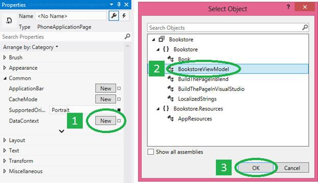

<a name="sample-data-on-the-design-surface-and-for-prototyping"></a>Dados de exemplo na superfície de design e para a criação de protótipo
=============================================================================================


**Observação**o grau ao qual você precisa de dados de exemplo — e quanto ele ajudará você — depende de suas associações usarem a [extensão de marcação {Binding}](https://msdn.microsoft.com/library/windows/apps/Mt204782) ou a [extensão de marcação {x: Bind}](https://msdn.microsoft.com/library/windows/apps/Mt204783). As técnicas descritas neste tópico se baseiam no uso de um [**DataContext**](https://msdn.microsoft.com/library/windows/apps/BR208713) e, portanto, apenas são apropriadas para **{Binding}**. Porém, se você estiver usando **{x:Bind}**, suas associações mostrarão pelo menos valores de espaço reservado na superfície de design (até mesmo para controles de itens) e, portanto, a necessidade de usar dados de amostra não é tão grande.

Pode ser impossível ou indesejado (talvez por motivos de privacidade ou desempenho) que seu aplicativo exiba dados dinâmicos na superfície de design no Microsoft Visual Studio ou no Blend for Visual Studio. Para que seus controles sejam populados com dados (e você possa trabalhar no layout, nos modelos e em outras propriedades visuais do seu aplicativo), há várias maneiras de usar dados de amostra de tempo de design. Os dados de exemplo também podem ser muito úteis e economizar tempo se você estiver criando um aplicativo de esboço (ou protótipo). Você pode usar dados de exemplo em seu esboço ou protótipo em tempo de execução para ilustrar suas ideias sem a necessidade de conexão com dados reais e dinâmicos.

**Aplicativos de amostra que demonstram {Binding}**

-   Baixe o aplicativo [Bookstore1](http://go.microsoft.com/fwlink/?linkid=532950).
-   Baixe o aplicativo [Bookstore2](http://go.microsoft.com/fwlink/?linkid=532952).

<a name="setting-datacontext-in-markup"></a>Definindo DataContext na marcação
-----------------------------

Uma prática bastante comum entre os desenvolvedores é usar um código imperativo (no code-behind) para definir uma página ou o [**DataContext**](https://msdn.microsoft.com/library/windows/apps/BR208713) de um controle de usuário para visualizar uma instância de modelo.

``` csharp
public MainPage()
{
    InitializeComponent();
    this.DataContext = new BookstoreViewModel();
}
```

Porém, se você fizer isso, sua página não será tão "projetável" quanto poderia ser. O motivo disso é que, quando a sua página XAML é aberta no Visual Studio ou no Blend for Visual Studio, o código imperativo que atribui o valor de **DataContext** nunca é executado (na verdade, nenhuma parte do seu code-behind é executada). As ferramentas XAML analisam sua marcação e instanciam os objetos declarados nela, mas não instanciam o tipo da página em si. O resultado é que você não verá os dados em seus controles ou na caixa de diálogo **Criar Associação de Dados**, e será um desafio maior criar o estilo e o layout de sua página.


A primeira solução que pode ser tentada é assinalar como comentário essa atribuição de **DataContext** e, em vez disso, definir o **DataContext** na marcação da sua página. Dessa maneira, seus dados dinâmicos aparecerão em tempo de design e também em tempo de execução. Para isso, primeiro abra sua página XAML. Em seguida, na janela **Estrutura de Tópicos do Documento**, clique no elemento raiz designável (em geral, com o rótulo **\[Page\]**) para selecioná-lo. Na janela **Propriedades**, localize a propriedade **DataContext** (dentro da categoria Comum) e depois clique em **Novo**. Clique no seu tipo de modelo de exibição na caixa de diálogo **Selecionar Objeto** e depois em **OK**.



Consulte a aparência da marcação resultante.

``` xaml
<Page ... >
    <Page.DataContext>
        <local:BookstoreViewModel/>
    </Page.DataContext>
```

Consulte também a aparência da superfície de design agora que suas associações podem ser resolvidas. Perceba que o seletor de **Caminho** na caixa de diálogo **Criar Associação de Dados** está agora preenchido, com base no tipo de **DataContext** e nas propriedades com as quais é possível criar uma associação.


A caixa de diálogo **Criar Associação de Dados** precisa somente de um tipo para trabalhar, mas as associações precisam das propriedades para ser inicializadas com valores. Se você não quiser acessar seu serviço de nuvem em tempo de design (devido ao desempenho, pagamento pela transferência de dados, problemas de privacidade etc.), o código de inicialização pode verificar se seu aplicativo é executado em uma ferramenta de design (como o Visual Studio ou o Blend for Visual Studio) e, nesse caso, carregar dados de exemplo para uso somente em tempo de design.

``` csharp
if (Windows.ApplicationModel.DesignMode.DesignModeEnabled)
{
    // Load design-time books.
}
else
{
    // Load books from a cloud service.
}
```

Você pode usar um localizador de modelo de exibição se for necessário passar parâmetros para o código de inicialização. Um localizador de modelo de exibição é uma classe que você pode colocar nos recursos do aplicativo. Ela tem uma propriedade que expõe o modelo de exibição, e o **DataContext** se associa a essa propriedade. Outro padrão que o localizador ou o modelo de exibição pode usar é a injeção de dependências, que pode construir um provedor de dados em tempo de design ou de execução (cada um deles implementa uma interface comum), conforme aplicável.

<a name="sample-data-from-class-and-design-time-attributes"></a>"Dados de exemplo da classe" e atributos de tempo de design
---------------------------------------------------------------------------------------

Se, por qualquer motivo, nenhuma das opções na seção anterior funcionar para você, ainda há diversas opções de dados de tempo de design disponíveis por meio de recursos de ferramentas XAML e atributos de tempo de design. Uma boa opção é o recurso **Criar Dados de Exemplo da Classe** no Blend for Visual Studio. Você pode encontrar esse comando em um dos botões na parte superior do painel **Dados**.

Basta especificar uma classe para o comando usar. O comando executa duas ações importantes para você. Primeiramente, ele gera um arquivo XAML que contém dados de exemplo adequados para recuperar uma instância da classe escolhida e todos os seus membros, recursivamente (na verdade, as ferramentas funcionam igualmente bem com arquivos XAML ou JSON). Em segundo lugar, ele preenche o painel **Dados** com o esquema da sua classe escolhida. Em seguida, você pode arrastar membros do painel **Dados** até a superfície de design para realizar várias tarefas. Dependendo do conteúdo que você arrasta e de onde esse conteúdo é solto, é possível adicionar associações a controles existentes (usando **{Binding}**) ou criar novos controles e associá-los ao mesmo tempo. Seja qual for o caso, a operação também define um contexto de dados em tempo de design (**d:DataContext**) para você (se ainda não houver um definido) na raiz de layout da sua página. Esse contexto de dados em tempo de design usa o atributo **d:DesignData** para obter seus dados de amostra do arquivo XAML que foi gerado (que, a propósito, você tem a opção de encontrar no seu projeto e editar de forma que ele contenha os dados de amostra desejados).

``` xaml
<Page ...
    xmlns:d="http://schemas.microsoft.com/expression/blend/2008"
    xmlns:mc="http://schemas.openxmlformats.org/markup-compatibility/2006"
    mc:Ignorable="d">
    <Grid ... d:DataContext="{d:DesignData /SampleData/RecordingViewModelSampleData.xaml}"/>
        <ListView ItemsSource="{Binding Recordings}" ... />
        ...
    </Grid>
</Page>
```

As várias declarações xmlns significam que atributos com o prefixo **d:** são interpretados apenas em tempo de design e são ignorados em tempo de execução. Portanto, o atributo **d:DataContext** afeta somente o valor da propriedade [**DataContext**](https://msdn.microsoft.com/library/windows/apps/BR208713) em tempo de design, não tendo qualquer efeito em tempo de execução. Se quiser, você pode até mesmo definir tanto **d:DataContext** quanto **DataContext** na marcação. **d:DataContext** será substituído em tempo de design, enquanto a propriedade **DataContext** será substituída em tempo de execução. Essas mesmas regras de substituição se aplicam a todos os atributos em tempo de design e em tempo de execução.

O atributo **d:DataContext** e todos os outros atributos em tempo de design estão documentados no tópico sobre [atributos em tempo de design](http://go.microsoft.com/fwlink/p/?LinkId=272504), que ainda é válido para aplicativos UWP (Plataforma Universal do Windows).

[**CollectionViewSource**](https://msdn.microsoft.com/library/windows/apps/BR209833) não tem uma propriedade **DataContext**, mas tem uma propriedade **Source**. Consequentemente, há uma propriedade **d:Source** que você pode usar para definir dados de amostra somente em tempo de design em um **CollectionViewSource**.

``` xaml
    <Page.Resources>
        <CollectionViewSource x:Name="RecordingsCollection" Source="{Binding Recordings}"
            d:Source="{d:DesignData /SampleData/RecordingsSampleData.xaml}"/>
    </Page.Resources>

    ...

        <ListView ItemsSource="{Binding Source={StaticResource RecordingsCollection}}" ... />
    ...
```

Para que isso funcione, é necessária uma classe denominada `Recordings : ObservableCollection<Recording>`, e você pode editar o arquivo XAML dos dados de amostra para que ele contenha apenas um objeto **Recordings** (com objetos **Recording** dentro dele), conforme mostrado aqui.

``` xml
<Quickstart:Recordings xmlns:Quickstart="using:Quickstart">
    <Quickstart:Recording ArtistName="Mollis massa" CompositionName="Cubilia metus"
        OneLineSummary="Morbi adipiscing sed" ReleaseDateTime="01/01/1800 15:53:17"/>
    <Quickstart:Recording ArtistName="Vulputate nunc" CompositionName="Parturient vestibulum"
        OneLineSummary="Dapibus praesent netus amet vestibulum" ReleaseDateTime="01/01/1800 15:53:17"/>
    <Quickstart:Recording ArtistName="Phasellus accumsan" CompositionName="Sit bibendum"
        OneLineSummary="Vestibulum egestas montes dictumst" ReleaseDateTime="01/01/1800 15:53:17"/>
</Quickstart:Recordings>
```

Se você usar um arquivo de dados de amostra JSON em vez da XAML, deverá definir a propriedade **Type**.

``` xaml
    d:Source="{d:DesignData /SampleData/RecordingsSampleData.json, Type=local:Recordings}"
```

Até agora, usamos **d:DesignData** para carregar dados de amostra em tempo de design de um arquivo XAML ou JSON. Uma alternativa é a extensão de marcação **d:DesignInstance**, que indica que a origem em tempo de design baseia-se na classe especificada pela propriedade **Type**. Aqui está um exemplo.

``` xaml
    <CollectionViewSource x:Name="RecordingsCollection" Source="{Binding Recordings}"
        d:Source="{d:DesignInstance Type=local:Recordings, IsDesignTimeCreatable=True}"/>
```

A propriedade **IsDesignTimeCreatable** indica que a ferramenta de design deve, na verdade, criar uma instância da classe, o que sugere que a classe tem um construtor público padrão e que é populada com dados (reais ou de exemplo). Se você não definir **IsDesignTimeCreatable** (ou se definir como **False**), os dados de exemplo não serão exibidos na superfície de design. Tudo o que a ferramenta de design faz nesse caso é a classe para suas propriedades associáveis e exibi-los no painel de **dados** e na caixa de diálogo **Criar associação de dados** .

<a name="sample-data-for-prototyping"></a>Dados de exemplo para criação de protótipo
--------------------------------------------------------

Para a criação de protótipo, você quer dados de exemplo em tempo de design e em tempo de execução. Para esse caso de uso, o Blend for Visual Studio tem o recurso **Novos Dados de Exemplo**. Você pode encontrar esse comando em um dos botões na parte superior do painel **Dados**.

Em vez de especificar uma classe, você pode projetar o esquema da fonte de dados de exemplo diretamente no painel **Dados** . Você também pode editar valores de dados de exemplo no painel **Dados**: não é necessário abrir e editar um arquivo (embora você ainda possa fazer isso se preferir).

O recurso **Novos Dados de Exemplo** usa [**DataContext**](https://msdn.microsoft.com/library/windows/apps/BR208713) e não **d:DataContext**, para que os dados de exemplo estejam disponíveis quando você executar seu esboço ou protótipo e durante a criação. E o painel **Dados** realmente acelera as tarefas de design e associação. Por exemplo, basta arrastar uma propriedade de coleção do painel **Dados** para a superfície de design para gerar um controle de itens de ligação de dados e os modelos necessários, tudo pronto para compilação e execução.


