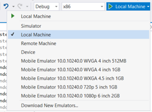
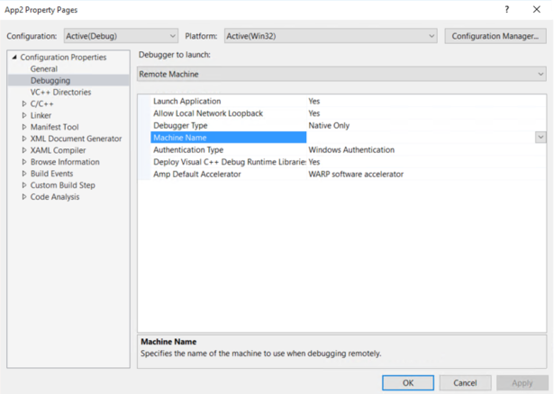
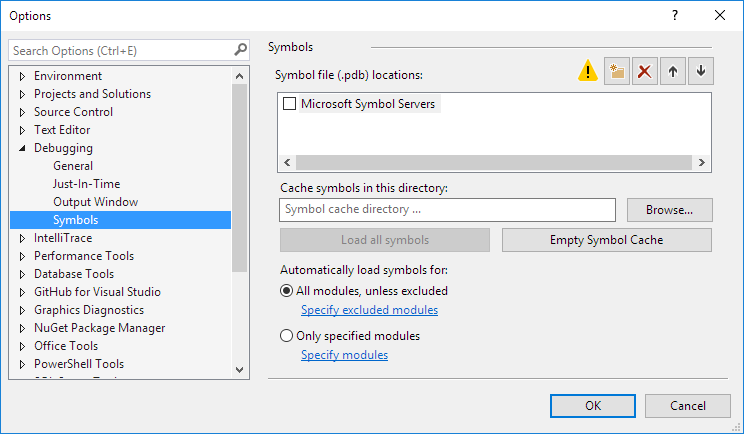

# <a name="deploying-and-debugging-uwp-apps"></a>Implantando e depurando aplicativos UWP


Este artigo apresenta as etapas para abordar vários destinos de depuração e implantação.

Microsoft Visual Studio permite que você implantar e depurar seus aplicativos da plataforma Universal do Windows (UWP) em uma variedade de dispositivos Windows 10. O Visual Studio manipulará o processo de criação e registro do aplicativo no dispositivo de destino.

## <a name="picking-a-deployment-target"></a>Selecionando um destino de implantação

Para escolher um destino, vá para a lista suspensa de destino de depuração próxima ao botão **Iniciar Depuração** e escolha um destino onde você deseja implantar seu aplicativo. Depois que o destino for selecionado, selecione **Iniciar Depuração (F5)** para implantar e depurar no alvo, ou selecione **Ctrl+F5** para implementar apenas nesse destino.



-   **Simulador** implantará o aplicativo em um ambiente simulado em seu computador de desenvolvimento atual. Essa opção estará disponível apenas se a **Versão Mínima da Plataforma de Destino** de seu aplicativo for menor ou igual ao sistema operacional no computador de desenvolvimento.
-   **Máquina Local** implantará o aplicativo no computador de desenvolvimento atual. Essa opção estará disponível apenas se a **Versão Mínima da Plataforma de Destino** de seu aplicativo for menor ou igual ao sistema operacional no computador de desenvolvimento.
-   A **Máquina Remota** permitirá que você especifique um destino remoto para implantar o aplicativo. Mais informações sobre a implantação em um computador remoto podem ser encontradas em [Especificando um dispositivo remoto](#specifying-a-remote-device).
-   O **Dispositivo** implantará o aplicativo em um dispositivo conectado USB. O dispositivo deve ser desbloqueado pelo desenvolvedor e ter a tela desbloqueada.
-   Um destino de **Emulador** será inicializado e implantará o aplicativo em um emulador com a configuração especificada no nome. Emuladores estão apenas disponíveis no Hyper-V habilitada computadores que executam o Windows 8.1 ou posterior.


## <a name="debugging-deployed-apps"></a>Depurando aplicativos implantados
O Visual Studio também pode ser anexado a qualquer processo de aplicativo UWP em execução com a seleção de **Depurar** e, depois, **Anexar ao Processo**. Anexar a um processo em execução não exige o projeto do Visual Studio original, mas o carregamento dos [símbolos](#symbols) do processo ajudarão significativamente durante a depuração de um processo para o qual você não tem o código original.  

Além disso, qualquer pacote do aplicativo instalado pode ser anexado e depurado com a seleção de **Depurar**, **Outros** e, depois, **Depurar Pacotes do Aplicativo Instalados**.   

   

A seleção de **Não iniciar, mas sim depurar meu código quando iniciar** fará com que o depurador do Visual Studio seja anexado ao seu aplicativo UWP quando você o iniciar em um horário personalizado. Essa é uma forma eficiente de depurar caminhos de controle de [métodos de inicialização diferentes](../xbox-apps/automate-launching-uwp-apps.md), como a ativação de protocolo com parâmetros personalizados.  

Os aplicativos UWP podem ser desenvolvidos e compilados no Windows 8.1 ou posterior, mas exigem que o Windows 10 seja executado. Se você estiver desenvolvendo um aplicativo UWP em um computador Windows 8.1, poderá depurar remotamente um aplicativo UWP em execução em outro dispositivo Windows 10, desde que os computadores host e de destino estejam na mesma LAN. Para fazer isso, baixe e instale as [Ferramentas Remotas para Visual Studio](https://www.visualstudio.com/downloads/) em ambos os computadores. A versão instalada deve corresponder à versão existente do Visual Studio que você instalou, e a arquitetura que você selecionar (x86, x64) também deverá corresponder à do aplicativo de destino.   

## <a name="package-layout"></a>Layout de pacote
A partir do Visual Studio 2015 atualização 3, adicionamos a opção para desenvolvedores especificar o caminho de layout para seus aplicativos UWP. Isso determina onde o layout de pacote é copiado para o disco quando você compila seu aplicativo. Por padrão, essa propriedade é definida em relação ao diretório raiz do projeto. Se você não modificar essa propriedade, o comportamento permanecerá o mesmo para versões anteriores do Visual Studio.

Esta propriedade pode ser modificada na propriedade **Debug** do projeto.

Se quiser incluir todos os arquivos de layout em seu pacote quando criar um pacote para o seu aplicativo, você deve adicionar a propriedade do projeto `<IncludeLayoutFilesInPackage>true</IncludeLayoutFilesInPackage>`.

Para adicionar esta propriedade:

1. Clique com o botão direito do mouse no projeto e selecione **Descarregar Projeto**.
2. Clique com botão direito do projeto e selecione **Editar [NomeDoProjeto].xxproj** (.xxproj mudará dependendo do idioma do projeto).
3. Adicione a propriedade e recarregue o projeto.

## <a name="specifying-a-remote-device"></a>Especificando um dispositivo remoto

### <a name="c-and-microsoft-visual-basic"></a>C# e Microsoft Visual Basic

Para especificar um computador remoto para aplicativos do C# ou Microsoft Visual Basic, selecione **Computador Remoto** na lista suspensa de destino de depuração. A caixa de diálogo **Conexões Remotas** aparecerá o que permitirá que você especifique um endereço IP ou selecione um dispositivo descoberto. Por padrão, o modo de autenticação **Universal** é selecionado. Para determinar qual modo de autenticação usar, consulte [Modos de autenticação](#authentication-modes).


Para retornar a essa caixa de diálogo, você pode abrir as propriedades do projeto e vá para a guia **depuração** . A partir daí, selecione **Localizar** lado **máquina remota:**


Para implantar um aplicativo em um computador remoto pré-atualização dos criadores, você também precisará baixar e instalar as Ferramentas Remotas do Visual Studio para no computador de destino. A fim de obter instruções completas, consulte [Instruções para computador remoto](#remote-pc-instructions).  No entanto, a partir da atualização dos criadores, o computador também dá suporte a implantação remota.  

### <a name="c-and-javascript"></a>C++ e JavaScript

Para especificar um destino de máquina remota para um aplicativo C++ ou JavaScriptUWP:

1. No **Gerenciador de Soluções**, clique com o botão direito do mouse no projeto e escolha **Propriedades**.
2. Acesse as configurações de **Depuração** e em **Depurador a iniciar**, selecione **Computador Remoto**.
3. Preencha o **Nome do Computador** (ou clique em **Localizar** para encontrar um) e, em seguida, defina a propriedade **Tipo de Autenticação**.



Depois que o computador for especificado, você pode selecionar **Computador Remoto** na lista suspensa de destino de depuração para retornar ao computador especificado. Somente um computador remoto pode ser selecionado por vez.

### <a name="remote-pc-instructions"></a>Instruções para computador remoto

> [!NOTE]
> Essas instruções só serão necessárias para versões mais antigas do Windows 10.  A partir da atualização de criadores, um computador pode ser tratado como um Xbox.  Ou seja, habilitando a descoberta de dispositivos no menu Configurações do Desenvolvedor do computador e usando a Autenticação Universal para emparelhamento com o uso de um PIN e para conexão com o computador. 

Para implantar em um computador remoto pré-atualização dos criadores, o computador de destino deve ter as Ferramentas Remotas do Visual Studio instaladas. O computador remoto também deve estar executando uma versão do Windows que seja maior ou igual à propriedade **Versão Mínima da Plataforma de Destino** de seus aplicativos. Após instalar as ferramentas remotas, você deve iniciar o depurador remoto no computador de destino.

Para fazer isso, pesquise **Depurador Remoto** no menu **Iniciar**, inicie-o e, se solicitado, permita que o depurador defina as configurações de firewall. Por padrão, o depurador é iniciado com a autenticação do Windows. Isso requer credenciais de usuário, caso o usuário conectado não seja o mesmo em ambos os computadores.

Para alterá-lo para **nenhuma autenticação**, em **Depurador Remoto**, acesse **Ferramentas** -&gt; **Opções** e, em seguida, selecione **Nenhuma autenticação**. Depois que o depurador remoto estiver configurado, você também deve garantir que você configurou o dispositivo host para [Modo de Desenvolvedor](https://msdn.microsoft.com/windows/uwp/get-started/enable-your-device-for-development). Depois disso, você poderá implementar do seu computador de desenvolvimento.

Para obter mais informações, consulte a página [Centro de Download Visual Studio](https://www.visualstudio.com/downloads/).

## <a name="passing-command-line-debug-arguments"></a>Como passar argumentos de depuração de linha de comando 
No Visual Studio de 2017, você pode passar argumentos de depuração de linha de comando quando inicia a depuração de aplicativos UWP. Você pode acessar os argumentos de depuração de linha de comando do parâmetro *args* no método **OnLaunched** da classe [**Application**](https://docs.microsoft.com/en-us/uwp/api/windows.ui.xaml.application). Para especificar os argumentos de depuração de linha de comando, abra as propriedades do projeto e navegue até a guia **Depuração**. 

> [!NOTE]
> Isso está disponível no Visual Studio 2017 (versão 15.1) para C#, VB e C++. O JavaScript está disponível em versões posteriores do Visual Studio 2017. Os argumentos de depuração de linha de comando estão disponíveis para todos os tipos de implantação, exceto para o Simulador.

Para projetos UWP em C# e VB, você verá um campo **Argumentos da linha de comando:** em **Opções iniciais**. 


Para projetos UWP em C++ e JS, você verá **Argumentos de Linha de Comando** como um campo nas **Propriedades de Depuração**.


Depois que você especificar os argumentos de linha de comando, poderá acessar o valor do argumento no método **OnLaunched** do App. Os *args* do objeto [**LaunchActivatedEventArgs**](https://docs.microsoft.com/en-us/uwp/api/windows.applicationmodel.activation.launchactivatedeventargs) terão uma propriedade **Arguments** com o valor definido como o texto do campo **Argumentos de Linha de Comando**. 


## <a name="authentication-modes"></a>Modos de autenticação

Há três modos de autenticação para implantação de computadores remotos:

- **Universal (protocolo não criptografado)**: use esse modo de autenticação sempre que você estiver implantando em um dispositivo remoto. Atualmente, isso é para dispositivos IoT, dispositivos Xbox e dispositivos HoloLens, bem como para atualização dos criadores ou computadores mais recentes. Universal (protocolo não criptografado) só deve ser usado em redes confiáveis. A conexão de depuração é vulnerável a usuários mal-intencionados que podem interceptar e alterar dados passados entre o desenvolvimento e o computador remoto.
- **Windows**: esse modo de autenticação apenas se destina a ser usado para um computador remoto (desktop ou notebook) executando as Ferramentas Remotas para Visual Studio. Use esse modo de autenticação quando você tiver acesso às credenciais do usuário conectado no computador de destino. Esse é o canal mais seguro para a implantação remota.
- **Nenhum(a)**: esse modo de autenticação apenas se destina a ser usado para um computador remoto (desktop ou notebook) executando as Ferramentas Remotas para Visual Studio. Use esse modo de autenticação quando você tiver uma configuração de computador de teste em um ambiente que tenha uma conta de teste conectada e você não possa inserir as credenciais. Certifique-se de que as configurações do depurador remoto estão definidas para aceitar Sem Autenticação.

## <a name="advanced-remote-deployment-options"></a>Opções de implementação remota avançadas
Como da versão do Visual Studio 2015 atualização 3 e atualização de aniversário do Windows 10, existem nova implementação remota avançada opções para certos dispositivos Windows 10. As opções de implementação remota avançada podem ser encontradas no menu **Depuração** das propriedades do projeto.

As novas propriedades incluem:
* Tipo de implementação
* Caminho do registro do pacote
* Mantenha todos os arquivos no dispositivo, mesmo aqueles que não fazem parte do layout

### <a name="requirements"></a>Requisitos
Para utilizar as opções de implementação remota avançada, você deve satisfazer os requisitos a seguir:
* Ter o Visual Studio 2015 atualização 3 ou alguns Visual Studio versão posterior instalado com o Windows 10 Tools 1.4.1 ou posterior (que inclui o SDK de atualização de aniversário do Windows 10), recomendamos que você use a versão mais recente do Visual Studio com atualizações para garantir que você obtenha todos os o recursos de desenvolvimento e segurança mais recentes.
* Foque em um dispositivo remoto Xbox da Atualização de Aniversário do Windows 10 ou computador com a Atualização do Windows 10 para Criadores. 
* Use o modo de Autenticação Universal

### <a name="properties-pages"></a>Páginas de propriedades
Para um aplicativo UWP C# ou Visual Basic, a página de propriedades será exibida como a seguir.


Para um aplicativo UWP em C++, a página de propriedades será exibida como a seguir.


### <a name="copy-files-to-device"></a>Copie arquivos para o dispositivo
**Copiar arquivos para o dispositivo** irá transferir fisicamente os arquivos através da rede para o dispositivo remoto. Ele irá copiar e registrar o layout de pacote que foi criado para o **caminho da pasta de Layout**. O Visual Studio manterá os arquivos que são copiados para o dispositivo em sincronia com os arquivos em seu projeto do Visual Studio. No entanto, há uma opção para **manter todos os arquivos no dispositivo, mesmo aqueles que não fazem parte do seu layout**. Selecionar essa opção significa que todos os arquivos que já foram copiados para o dispositivo remoto, mas não fazem parte do seu projeto, permanecerá no dispositivo remoto.

O **caminho do pacote de registro** especificado quando você **copiar arquivos para o dispositivo** é o local físico do dispositivo remoto onde os arquivos são copiados. Esse caminho pode ser especificado como qualquer caminho relativo. O local onde os arquivos são implementados será relacionado a uma raiz de arquivos de desenvolvimento que variam de acordo com o dispositivo de destino. Especificar esse caminho é útil para vários desenvolvedores compartilharem o mesmo dispositivo e trabalhar em pacotes com alguma variação de compilação.

> [!NOTE]
> **Copiar arquivos para o dispositivo** é atualmente suportado no Xbox executando a Atualização de Aniversário do Windows 10 e os computadores executando a Atualização do Windows 10 para Criadores.

No dispositivo remoto, o layout é copiado no seguinte local padrão: `\\MY-DEVKIT\DevelopmentFiles\PACKAGE-REGISTRATION-PATH`

### <a name="register-layout-from-network"></a>Registrar o layout de rede
Quando você optar por registrar o layout da rede, você pode criar o layout do pacote para um compartilhamento de rede e, em seguida, registrar o layout do dispositivo remoto diretamente da rede. Isso requer que você especifique um caminho de pasta de layout (um compartilhamento de rede) que é acessível a partir do dispositivo remoto. A propriedade **Caminho da pasta de Layout** é o caminho definido relacionado ao computador executando o Visual Studio, enquanto a propriedade **Caminho do pacote de registro** é o mesmo caminho, mas especificado em relação ao dispositivo remoto.

Para registrar com êxito o layout da rede, você deverá primeiro torna o **Caminho da pasta de Layout** uma pasta de rede compartilhada. Para fazer isso, clique com botão direito na pasta no Explorador de Arquivos, selecione **Compartilhar com > Pessoas específicas**e, em seguida, escolha os usuários com quem você gostaria de compartilhar a pasta. Quando você tentar registrar o layout da rede, será solicitado credenciais para garantir que você está se registrando como um usuário com acesso ao compartilhamento.

Para obter ajuda com isso, consulte os exemplos a seguir:

- Exemplo 1 (pasta local do layout, acessível como um compartilhamento de rede):
  * **Caminho da pasta de layout** = `D:\Layouts\App1`
  * **Caminho do registro do pacote** = `\\NETWORK-SHARE\Layouts\App1`

- Exemplo 2 (pasta de layout de rede):
  * **Caminho da pasta de layout** = `\\NETWORK-SHARE\Layouts\App1`
  * **Caminho do registro do pacote** = `\\NETWORK-SHARE\Layouts\App1`

Quando você registra pela primeira vez o layout da rede, suas credenciais serão ser armazenados em cache no dispositivo de destino para que você não precise entrar repetidamente. Para remover as credenciais armazenadas em cache, você pode usar a [ferramenta WinAppDeployCmd.exe](https://msdn.microsoft.com/windows/uwp/packaging/install-universal-windows-apps-with-the-winappdeploycmd-tool) do SDK do Windows 10 com o comando **deletecreds**.

Você não pode selecionar **manter todos os arquivos no dispositivo** ao registrar o layout da rede, pois não há arquivos fisicamente que são copiados para o dispositivo remoto.

> [!NOTE]
> **Registrar o layout de rede** é atualmente suportado no Xbox executando a Atualização de Aniversário do Windows 10 e os computadores executando a Atualização do Windows 10 para Criadores.

O dispositivo remoto, o layout é registrado no seguinte local padrão dependendo da família: `Xbox: \\MY-DEVKIT\DevelopmentFiles\XrfsFiles` - esse é um link simbólico para o **caminho do pacote de registro** do computador não usa um link simbólico e em vez disso, registra diretamente o pacote ** caminho do registro**


## <a name="debugging-options"></a>Opções de depuração

No Windows 10, o desempenho de inicialização dos aplicativos UWP é melhorado iniciando proativamente e, em seguida, suspendendo os aplicativos em uma técnica chamada de [pré-inicialização](https://msdn.microsoft.com/library/windows/apps/Mt593297). Muitos aplicativos não precisam fazer nada especial para trabalhar nesse modo, mas alguns aplicativos talvez precisem ajustar seu comportamento. Para ajudar a depurar problemas nesses caminhos de código, você pode iniciar o aplicativo do Visual Studio no modo de pré-inicialização.

Há suporte para depuração de um projeto do Visual Studio (**Depurar** -&gt; **Outros Destinos de Depuração** -&gt; **Depurar Pré-inicialização de Aplicativo Universal do Windows**) e para aplicativos já instalados no computador (**Depurar** -&gt; **Outros Destinos de Depuração** -&gt; **Depurar Pacote do Aplicativo Instalado**, selecionando **Ativar Aplicativos com Pré-inicialização**). Para obter mais informações, consulte [Depurar pré-inicialização de UWP](http://go.microsoft.com/fwlink/p/?LinkId=717245).

Você pode definir as seguintes opções de implementação na página da propriedade de **depuração** do projeto de inicialização:

- **Permitir loopback de rede local**

  Por motivos de segurança, um aplicativo UWP que foi instalado de modo padrão não pode fazer chamadas de rede para o dispositivo em que estiver instalado. Por padrão, a implantação do Visual Studio cria uma isenção da regra para o aplicativo implantado. Esse isolamento permite que você teste procedimentos de comunicação em uma única máquina. Antes de enviar seu aplicativo na Microsoft Store, você deve testar seu aplicativo sem a isenção.

  Para remover a isenção de loopback de rede do aplicativo:

  -   Na página de propriedades em c# e Visual Basic**Depurar** , desmarque a caixa de seleção **Permitir loopback de rede local** .
  -   Na página da propriedade **Depuração** do JavaScript e do C++, defina o valor **Permitir Loopback de Rede Local** como **Não**.

- **Não iniciar, mas depurar meu código quando ele é iniciado/Iniciar aplicativo**

  Para configurar a implantação para iniciar uma sessão de depuração quando o aplicativo for iniciado automaticamente:

  -   Na página de propriedades em c# e Visual Basic**Depurar** , marque a caixa de seleção **não iniciar, mas sim depurar meu código quando ele for iniciado** .
  -   Na página de propriedades **Depuração** do JavaScript e do C++, defina o valor de **Iniciar Aplicativo** como **Sim**.

## <a name="symbols"></a>Símbolos

Os arquivos de símbolos contêm uma variedade de dados muito úteis na depuração de código, como variáveis, nomes de funções e endereços de ponto de entrada, permitindo que você compreenda melhor as exceções e a ordem de execução da pilha de chamadas. Os símbolos da maioria das variantes do Windows estão disponíveis no [servidor de símbolos da Microsoft](http://msdl.microsoft.com/download/symbols), ou podem ser baixados para que as pesquisas offline fiquem mais rápidas em [Baixar pacotes de símbolos do Windows](http://aka.ms/winsymbols).

Para definir opções de símbolos para o Visual Studio, selecione **Ferramentas > Opções** e vá para **Depuração > Símbolos** na janela da caixa de diálogo.



Para carregar símbolos em uma sessão de depuração com [WinDbg](#windbg), defina a variável **sympath** para o local do pacote de símbolos. Por exemplo, executar o comando a seguir carregará símbolos do servidor de símbolos da Microsoft e, em seguida, os armazenará em cache no diretório C:\Symbols:

```
.sympath SRV*C:\Symbols*http://msdl.microsoft.com/download/symbols
.reload
```

Você pode adicionar mais caminhos usando o delimitador `‘;’` ou usar o comando `.sympath+`. Para operações de símbolos mais avançadas que usam WinDbg, consulte [Símbolos públicos e privados](https://msdn.microsoft.com/library/windows/hardware/ff553493).

## <a name="windbg"></a>WinDbg

WinDbg é um depurador avançado fornecido como parte do conjunto de Ferramentas de Depuração para Windows, que está incluído no [SDK do Windows](http://go.microsoft.com/fwlink/p/?LinkID=271979). A instalação do SDK do Windows permite que você instale as Ferramentas de Depuração para Windows como um produto autônomo. Embora seja altamente útil para a depuração de código nativo, não recomendamos o WinDbg para aplicativos escritos em código gerenciado ou HTML5.

Para usar o WinDbg com aplicativos UWP, você precisará primeiro desabilitar o PLM (Gerenciamento do Tempo de Vida do Processo) para o pacote do aplicativo usando o PLMDebug, conforme descrito em [Testando e depurando ferramentas para PLM (Gerenciamento do Tempo de Vida do Processo)](testing-debugging-plm.md).

```
plmdebug /enableDebug [PackageFullName] ""C:\Program Files\Debugging Tools for Windows (x64)\WinDbg.exe\" -server npipe:pipe=test"
```

Em contraste com o Visual Studio, a maior parte da funcionalidade central do WinDbg depende de fornecer comandos à janela de comando. Os comandos fornecidos permitem que você veja o estado de execução, investigue despejos de memória do modo de usuário e depure em diversos modos.

Um dos comandos mais populares no WinDbg é `!analyze -v`, que é usado para recuperar uma quantidade detalhada de informações sobre a exceção atual, incluindo:

- FAULTING_IP: ponteiro de instrução no momento da falha
- EXCEPTION_RECORD: endereço, código e sinalizadores da exceção atual
- STACK_TEXT: rastreamento de pilha antes da exceção

Para obter uma lista completa de todos os comandos WinDbg, consulte [Comandos do depurador](https://msdn.microsoft.com/library/ff540507).

## <a name="related-topics"></a>Tópicos relacionados
- [Testando e depurando ferramentas para PLM (Gerenciamento do Tempo de Vida do Processo)](testing-debugging-plm.md)
- [Depuração, teste e desempenho](index.md)
