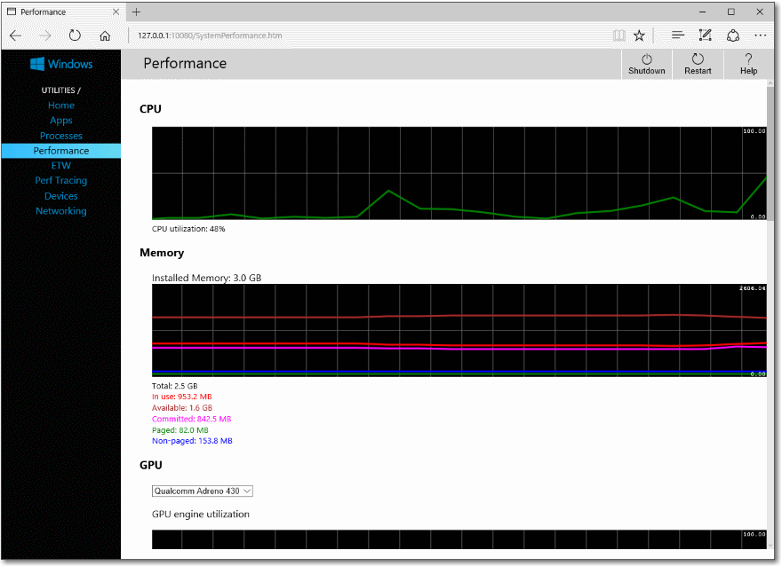

# <a name="windows-device-portal-overview"></a>Visão geral do Windows Device Portal

O Windows Device Portal permite que você configure e gerencie seu dispositivo remotamente por uma rede ou conexão USB. Ele também fornece ferramentas avançadas de diagnóstico para ajudar você a solucionar problemas e exibir o desempenho em tempo real do seu dispositivo Windows.

Windows Device Portal é um servidor web em seu dispositivo que você pode se conectar usando um navegador da web em um computador. Se o dispositivo tiver um navegador da web, você também pode conectar localmente com o navegador no dispositivo.

Windows Device Portal está disponível em cada família de dispositivos, mas os recursos e a instalação variam com base nos requisitos de cada dispositivo. Este artigo fornece uma descrição geral do Windows Device Portal e links para artigos com informações mais específicas para cada família de dispositivos.

A funcionalidade do Windows Device Portal é implementada com [APIs REST](device-portal-api-core.md) que você pode usar diretamente para acessar dados e controlar seu dispositivo de forma programática.

## <a name="setup"></a>Instalação

Cada dispositivo possui instruções específicas para se conectar ao Device Portal, mas estas etapas gerais são necessárias em todos:
1. Habilite o modo de desenvolvedor e o Device Portal em seu dispositivo (configurado no aplicativo configurações).
2. Conecte o dispositivo e o computador por meio de uma rede local ou com USB.
3. Navegue até a página do Device Portal em seu navegador. Esta tabela mostra as portas e protocolos usados por cada família de dispositivos.

Família de dispositivos | Ativado por padrão? | HTTP | HTTPS | USB
--------------|----------------|------|-------|----
HoloLens | Sim, no Modo de Desenvolvedor | 80 (padrão) | 443 (padrão) | http://127.0.0.1:10080
IoT | Sim, no Modo de Desenvolvedor | 8080 | Habilitar por meio da regkey | N/D
Xbox | Habilitar dentro do Modo de Desenvolvedor | Desabilitado | 11443 | N/D
Área de trabalho| Habilitar dentro do Modo de Desenvolvedor | 50080\* | 50043\* | N/D
Telefone | Habilitar dentro do Modo de Desenvolvedor | 80| 443 | http://127.0.0.1:10080

\* Esse nem sempre é o caso, já que o Device Portal na área de trabalho declara portas no intervalo efêmero (>50.000) para evitar colisões com declarações de portas existentes no dispositivo. Para saber mais, consulte a seção [Configurações de porta](device-portal-desktop.md#registry-based-configuration-for-device-portal) para área de trabalho.  

Para obter instruções de instalação específicas ao dispositivo, consulte:
- [Device Portal para HoloLens](https://docs.microsoft.com/windows/uwp/debug-test-perf/device-portal-hololens)
- [Device Portal para IoT](https://go.microsoft.com/fwlink/?LinkID=616499)
- [Device Portal para celulares](device-portal-mobile.md)
- [Device Portal para Xbox](device-portal-xbox.md)
- [Device Portal para desktop](device-portal-desktop.md#set-up-device-portal-on-windows-desktop)

## <a name="features"></a>Recursos

### <a name="toolbar-and-navigation"></a>Barra de ferramentas e navegação

A barra de ferramentas na parte superior da página fornece acesso a recursos comumente usados.
- **Ligar/desligar**: acessar opções de energia.
  - **Desligar**: desativa o dispositivo.
  - **Reiniciar**: repete o ciclo de energia no dispositivo.
- **Ajuda**: abre a página de ajuda.

Use os links no painel de navegação ao lado esquerdo da página para navegar até as ferramentas de gerenciamento e monitoramento disponíveis para seu dispositivo.

As ferramentas que são comuns em famílias de dispositivos são descritas aqui. Talvez haja outras opções disponíveis dependendo do dispositivo. Para obter mais informações, consulte a página específica para o tipo de dispositivo.

### <a name="apps-manager"></a>Gerente de aplicativos

O Gerenciador de aplicativos fornece instalação/desinstalação e funcionalidade de gerenciamento de aplicativo pacotes e pacotes no dispositivo host.


- **Aplicativos instalados**: Use o menu suspenso para remover ou iniciar aplicativos que estão instalados no dispositivo. Instale um novo aplicativo clicando em **Adicionar**. Isso inicia o experiência do usuário para implantar aplicativos empacotados no local de instalação, rede ou web hospeda e registre arquivos soltos de compartilhamentos de rede.
- **Aplicativos em execução**: obter informações sobre os aplicativos que estão sendo executados e fechá-los conforme necessário.

#### <a name="install-an-app"></a>Instalar um aplicativo

1.  Quando tiver criado um pacote do aplicativo, você poderá instalá-lo remotamente em seu dispositivo. Após a compilação no Visual Studio, uma pasta de saída será gerada.
  
2.  Na seção de Gerenciador de aplicativos do Device Portal, clique em **Adicionar** e selecione o **pacote de aplicativo do armazenamento local de instalação**.
3.  Clique em **Procurar** e localize o pacote do aplicativo.
3.  Clique em **Procurar** e localize o arquivo de certificado (_. cer_) (não necessário em todos os dispositivos.)
4.  Caixas de seleção o respectivas se você deseja instalar opcional ou pacotes de estrutura juntamente com a instalação do aplicativo. Se você tiver mais de uma, adicione cada uma delas individualmente.     
5.  Clique em **Avançar** para ir para a etapa de Avançar e **instalar** para iniciar a instalação. 

#### <a name="uninstall-an-app"></a>Desinstalar um aplicativo
1.  Certifique-se de que seu aplicativo não esteja em execução. 
2.  Se estiver, vá para **aplicativos em execução** e feche-o. Se você tentar desinstalar enquanto o aplicativo é executado, isso causará problemas ao tentar reinstalar o aplicativo. 
3.  Selecione o aplicativo na lista suspensa e clique em **Remover**.

### <a name="running-processes"></a>Processos em execução

Esta página mostra detalhes sobre processos em execução no dispositivo host. Isso inclui aplicativos e processos do sistema. Em algumas plataformas (área de trabalho, IoT e HoloLens), você pode encerrar processos.


### <a name="file-explorer"></a>Explorador de Arquivos

Esta página permite que você exiba e manipule arquivos armazenados por qualquer aplicativos de sideload. Consulte o blog [usando o Explorador de arquivos de aplicativo](https://blogs.windows.com/buildingapps/2016/06/08/using-the-app-file-explorer-to-see-your-app-data/) postagem para saber mais sobre o Explorador de arquivos e como usá-lo. 


### <a name="performance"></a>Desempenho

A página de desempenho mostra gráficos em tempo real das informações de diagnóstico do sistema como o uso de energia, taxa de quadros, e a carga da CPU.

Estas são as métricas disponíveis:
- **CPU**: porcentagem do total de utilização da CPU disponível
- **Memória**: Total, em uso, disponível confirmado, paginado e não paginada
- **E/s**: as quantidades de dados de leitura e gravação
- **Rede**: recepção e envio de dados
- **GPU**: utilização de mecanismo % de GPU disponível total




### <a name="event-tracing-for-windows-etw-logging"></a>Log de eventos de rastreamento para Windows (ETW)

A página de registro em log do ETW gerencia informações de rastreamento de eventos para Windows (ETW) em tempo real no dispositivo.


Marque **Ocultar provedores** para mostrar apenas a lista de eventos.
- **Provedores registrados**: selecione o provedor de eventos e o nível de rastreamento. O nível de rastreamento é um destes valores:
  1. Saída anormal ou encerramento
  2. Erros graves
  3. Avisos
  4. Avisos que não são de erro
  5. Rastreamento detalhado

  Clique ou toque em **Habilitar** para iniciar o rastreamento. O provedor é adicionado à lista suspensa **Provedores Habilitados**.
- **Provedores personalizados**: selecione um provedor ETW personalizado e o nível de rastreamento. Identifique o provedor pelo GUID. Não inclua colchetes no GUID.
- **Provedores de Enabled**: lista os provedores habilitados. Selecione um provedor da lista suspensa e clique ou toque em **Desabilitar** para parar o rastreamento. Clique ou toque em **Parar todos** para suspender todo o rastreamento.
- **Histórico de provedores**: mostra os provedores ETW que foram habilitados durante a sessão atual. Clique ou toque em **Habilitar** para ativar um provedor que foi desabilitado. Clique ou toque em **Limpar** para limpar o histórico.
- **Filtros / eventos**: A seção de **eventos** lista eventos ETW dos provedores selecionados no formato de tabela. A tabela é atualizada em tempo real. Use o menu **filtros** para configurar filtros personalizados para que eventos serão exibidos. Clique no botão **Limpar** para excluir todos os eventos ETW da tabela. Isso não desabilita os provedores. Você pode clicar em **Salvar no arquivo** para exportar os atuais eventos ETW coletados para um arquivo CSV local.

Para obter mais detalhes sobre como usar o registro em log do ETW, consulte a postagem do blog do [Portal de dispositivos de uso para exibir logs de depuração](https://blogs.windows.com/buildingapps/2016/06/10/using-device-portal-to-view-debug-logs-for-uwp/) . 

### <a name="performance-tracing"></a>Rastreamento de desempenho

A página de rastreamento de desempenho permite que você para exibir os rastreamentos de [Windows Performance Recorder (WPR)](https://msdn.microsoft.com/library/hh448205.aspx) do dispositivo host.


- **Perfis disponíveis**: selecione o perfil WPR na lista suspensa e clique ou toque em **Iniciar** para iniciar o rastreamento.
- **Perfis personalizados**: clique ou toque em **Procurar** para escolher um perfil WPR do seu computador. Clique ou toque em **Carregar e iniciar** para iniciar o rastreamento.

Para interromper o rastreamento, clique em **Parar**. Fique nesta página até que o arquivo de rastreamento (. ETL) download for concluído.

Capturado. Arquivos ETL podem ser abertos para análise no [Windows Performance Analyzer](https://msdn.microsoft.com/library/windows/desktop/hh448170.aspx).

### <a name="device-manager"></a>Gerenciador de dispositivos

A página do Gerenciador de dispositivos enumera todos os periféricos conectados ao seu dispositivo. Você pode clicar nos ícones de configurações para exibir as propriedades de cada um.


### <a name="networking"></a>Rede

A página de rede gerencia conexões de rede no dispositivo. A menos que você esteja conectado ao Device Portal por meio de USB, alterar essas configurações provavelmente desconectarão você do Device Portal.
- **Redes disponíveis**: mostra as redes Wi-Fi disponíveis para o dispositivo. Clicar ou tocar em uma rede permitirá que você se conecte a ela e forneça uma chave de acesso, se necessário. Portal de dispositivo ainda não oferece suporte para autenticação de empresa. Você também pode usar a lista suspensa **perfis** para tentar se conectar a qualquer um dos perfis de Wi-Fi conhecidos para o dispositivo.
- **Configuração de IP**: mostra informações de endereço sobre cada host portas de rede do dispositivo.


## <a name="service-features-and-notes"></a>Notas e recursos de serviço

### <a name="dns-sd"></a>DNS-SD

O Device Portal anuncia sua presença na rede local usando DNS-SD. Todas as instâncias do Device Portal, independentemente do tipo de dispositivo, anunciam em "WDP._wdp._tcp.local". Os registros TXT para a instância do serviço fornecem o seguinte:

Chave | Tipo | Descrição 
----|------|-------------
S | int | Porta segura para o Device Portal. Se 0 (zero), o Device Portal não está escutando conexões HTTPS. 
D | string | Tipo de dispositivo. Isso estará no formato "Windows.*", por exemplo, Windows.Xbox ou Windows.Desktop
A | string | Arquitetura do dispositivo. Isso será ARM, x86 ou AMD64.  
T | lista de cadeias de caracteres delineadas de caracteres nulos | Marcas aplicadas pelo usuário para o dispositivo. Consulte as Marcas API de REST para saber como usá-las. A lista é encerrada com duplo nulo.  

É recomendável estabelecer conexão na porta HTTPS, pois nem todos os dispositivos estão ouvindo na porta HTTP anunciada pelo registro DNS SD. 

### <a name="csrf-protection-and-scripting"></a>Proteção contra CSRF e scripts

Para proteger-se contra [ataques CSRF](https://wikipedia.org/wiki/Cross-site_request_forgery), um token exclusivo é necessário em todas as solicitações não GET. Esse token, o cabeçalho de solicitação X-CSRF-Token, é derivado de um cookie de sessão, o CSRF-Token. Na interface do usuário Web do Device Portal, o cookie CSRF-Token é copiado no cabeçalho X-CSRF-Token em cada solicitação.

> [!IMPORTANT]
> Essa proteção impede o uso de APIs REST a partir de um cliente autônomo (por exemplo, utilitários de linha de comando). Isso pode ser resolvido de três modos: 
> - Use um nome de usuário "auto-". Os clientes que têm o prefixo "auto-" no nome de usuário serão ignorados pela proteção contra CSRF. É importante que esse nome de usuário não seja usado para fazer logon no Device Portal por meio do navegador, pois ele abrirá o serviço para ataques CSRF. Exemplo: se o nome de usuário do Device Portal for "admin", ```curl -u auto-admin:password <args>``` deverá ser usado para ignorar a proteção contra CSRF. 
> - Implemente o esquema cookie-para-cabeçalho no cliente. Isso exige uma solicitação GET para estabelecer o cookie de sessão e, em seguida, a inclusão do cabeçalho e o cookie em todas as solicitações subsequentes. 
> - Desabilite a autenticação e use HTTP. A proteção contra CSRF só se aplica a pontos de extremidade HTTPS, portanto, as conexões em pontos de extremidade HTTP não precisam fazer nada do que é mencionado acima. 

#### <a name="cross-site-websocket-hijacking-cswsh-protection"></a>Proteção de Cross-Site WebSocket Hijacking (CSWSH)

Para se proteger contra [ataques CSWSH](https://www.christian-schneider.net/CrossSiteWebSocketHijacking.html), todos os clientes que abrem uma conexão WebSocket com o Device Portal também devem fornecer um cabeçalho Origin que corresponda ao cabeçalho Host. Isso prova para o Device Portal que a solicitação vem da interface do usuário do Device Portal ou um aplicativo cliente válido. Sem o cabeçalho Origin, sua solicitação será rejeitada. 
