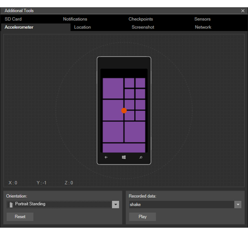
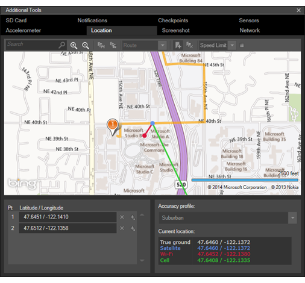
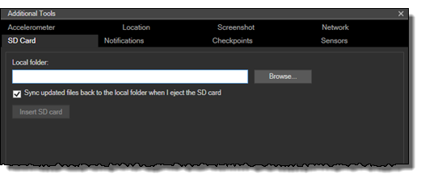
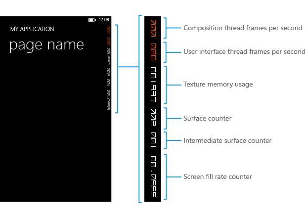

# <a name="test-with-the-microsoft-emulator-for-windows-10-mobile"></a>Testar com o Emulador Microsoft para Windows 10 Mobile

Simule a interação do mundo real com um dispositivo e teste os recursos de seu aplicativo usando as ferramentas incluídas no Emulador Microsoft para Windows 10 Mobile. O emulador é um aplicativo da área de trabalho que emula um dispositivo móvel que executa o Windows 10. Ele oferece um ambiente virtualizado no qual você pode depurar e testar aplicativos do Windows sem um dispositivo físico. Além disso, ele oferece um ambiente isolado para seus protótipos de aplicativos.

O emulador foi projetado para oferecer um desempenho comparável a um dispositivo real. No entanto, antes de publicar seu aplicativo na Microsoft Store, recomendamos que você teste seu aplicativo em um dispositivo físico.

Você pode testar seu aplicativo universal usando uma imagem exclusiva de emulador do Windows 10 Mobile para várias configurações de tamanho e de resolução de tela. Você pode simular a interação do mundo real com um dispositivo e testar vários recursos do seu aplicativo usando as ferramentas incluídas no Emulador da Microsoft.

## <a name="system-requirements"></a>Requisitos do sistema

Seu computador deve atender aos seguintes requisitos:

CPU (dessas configurações, se estiver disponível, podem ser habilitadas no BIOS)

-   Virtualização assistida por hardware ([Verificar a compatibilidade](https://www.microsoft.com/download/details.aspx?id=592)).
-   Conversão de Endereços de Segundo Nível (SLAT).
-   Prevenção de Execução de Dados baseados em hardware (DEP).

RAM

-   4 GB ou mais.

Sistema operacional

-   Windows 8 ou superior (Windows 10 altamente recomendável)
-   64 bits
-   Edição Pro ou superior

Para verificar os requisitos de BIOS, confira [Como habilitar Hyper-V para o emulador para Windows Phone 8](https://msdn.microsoft.com/library/windows/apps/xaml/jj863509.aspx).

Para verificar os requisitos de RAM e do sistema operacional, no Painel de Controle, selecione **Sistema e Segurança**e, em seguida, selecione **Sistema**.

Microsoft Emulator para Windows Mobile de 10 requer o Visual Studio 2015 ou posterior; não é compatível com versões anteriores com versões anteriores do Visual Studio.

O Emulador da Microsoft para Windows 10 Mobile não pode carregar aplicativos direcionados à versão de sistema operacional do Windows Phone que seja anterior ao Windows Phone 7.1.

## <a name="installing-uninstalling-and-running-the-emulator"></a>Instalar, desinstalar e executando o emulador

### <a name="installing"></a>Instalando
O Emulador da Microsoft para Windows 10 Mobile é fornecido como parte do SDK do Windows 10. O SDK do Windows 10 e o emulador podem ser instalados como parte da instalação do Visual Studio. Confira a [Página de transferência do Visual Studio](https://go.microsoft.com/fwlink/p/?LinkId=534785).

Você também pode instalar o Emulador Microsoft para Windows 10 Mobile usando a [Instalação do Emulador da Microsoft](https://go.microsoft.com/fwlink/p/?LinkID=615095).

### <a name="uninstalling"></a>Desinstalando

Você pode desinstalar o Emulador da Microsoft para Windows 10 Mobile usando a opção instalar/reparar do Visual Studio. Ou você pode usar a opção **Programas e Recursos** no **Painel de Controle** para remover o emulador.

Quando você desinstala o Emulador da Microsoft para Windows 10 Mobile, o adaptador Ethernet Hyper-V Virtual que foi criado para o emulador usar não é removido automaticamente. Você pode remover manualmente esse adaptador virtual a partir de **Conexões de Rede** no **Painel de Controle**.

### <a name="running"></a>Running

Para executar um aplicativo no emulador, basta selecione um dispositivo emulado no menu suspenso **Executar** no Visual Studio.


## <a name="whats-new-in-microsoft-emulator-for-windows-10-mobile"></a>Novidades do Emulador Microsoft para Windows 10 Mobile

Além de oferecer suporte à Plataforma Universal do Windows (UWP), o emulador adicionou a seguinte funcionalidade:

-   Suporte ao modo de entrada por mouse para diferenciar entre entrada por mouse e por toque único.
-   Suporte à NFC (comunicação a curta distância) O emulador permite simular a NFC e possibilita testar e desenvolver aplicativos universais habilitados para NFC/proximidade.
-   A aceleração de hardware nativo melhora o desempenho gráfico no emulador usando a placa gráfica local. Você deve ter uma placa gráfica compatível instalada e habilitar a aceleração na guia **Sensores** da interface do usuário de configurações **Ferramentas Adicionais** do emulador para usar a aceleração.

## <a name="features-that-you-can-test-in-the-emulator"></a>Recursos que você pode testar no emulador

Além dos novos recursos mencionados na seção anterior, você pode testar os recursos normalmente usados a seguir no Emulador Microsoft para Windows 10 Mobile.

-   **Resolução de tela, tamanho da tela e memória** Obtenha um mercado amplo para o seu aplicativo, o testando em diversas imagens do emulador para simular várias resoluções de tela, tamanhos físicos e restrições de memória.


-   **Configuração de tela**. Altere o emulador do modo retrato para paisagem. Altere as configurações de zoom para ajustar o emulador à tela da área de trabalho.

-   **Rede**. O suporte de rede é integrado ao Emulador do Windows Phone. A rede é habilitada por padrão. Você não precisa instalar drivers de rede para o Emulador do Windows Phone ou configure as opções de rede manualmente na maioria dos ambientes.

    O emulador utiliza a conexão de rede do computador host. Isto não aparece como um dispositivo separado na rede. Isto elimina algumas das questões que os usuários enfrentam com o emulador Windows Phone SDK 8.0.

-   **Configurações de idioma e região**. Prepare seu aplicativo para um mercado internacional alterando as configurações de idioma e de região da interface no Emulador do Windows Phone.

    No emulador que está sendo executado, vá ao aplicativo **Configurações**, selecione as configurações do **sistema** e, em seguida, selecione **idioma** ou **região**. Altere as configurações que você deseja testar. Se for solicitado, clique em **reiniciar telefone** para aplicar a nova configuração e reiniciar o emulador.

-   **Ciclo de vida do aplicativo e marcação para exclusão**. Teste o comportamento ou seu aplicativo quando este estiver desativado ou marcado para exclusão ao alterar o valor da opção **Marcar para exclusão mediante desabilitação ao depurar** na página **Depurar** das propriedades do projeto.

-   **Pasta de armazenamento local (anteriormente conhecida como um armazenamento isolado)**. Os dados no armazenamento isolado persistem enquanto o emulador está sendo executado, mas são perdidos logo que o emulador se fecha.

-   **Microfone**. Requer e utiliza o microfone no computador host.

-   **Teclado do telefone**. O emulador dá suporte a mapeamento do teclado de hardware no computador de desenvolvimento para o teclado em um Windows Phone. O comportamento das chaves é o mesmo que em um dispositivo Windows Phone

-   **Tela de bloqueio**. Com o emulador aberto, pressione F12 duas vezes no teclado de seu computador. A tecla F12 emula o botão de energia no telefone. A primeira tecla pressionada desliga a tela. A segunda liga novamente a tela com a tela de bloqueio habilitada. Desbloqueie a tela usando o mouse para deslizar a tela de bloqueio para cima.

## <a name="features-that-you-cant-test-in-the-emulator"></a>Recursos que você pode testar no emulador

Teste os seguintes recursos apenas em um dispositivo físico.

-   Bússola
-   Giroscópio
-   Controle de vibração
-   Brilho. O nível do brilho do emulador é sempre Alto.
-   Vídeo em alta resolução. Vídeos com uma resolução superior à resolução VGA (640 x 480) não podem ser exibidos com confiança, especialmente em imagens do emulador com somente 512 MB de memória.

## <a name="mouse-input"></a>Entrada por mouse

Simule entradas por mouse usando o mouse físico ou o trackpad em seu computador Windows e o botão de entrada por mouse na barra de ferramentas do emulador. Esse recurso é útil se seu aplicativo der ao usuário uma capacidade de utilizar um mouse emparelhado com seu dispositivo Windows 10 para fornecer entradas.

Toque no botão de entrada por mouse na barra de ferramentas do emulador para habilitar a entrada por mouse. Quaisquer eventos de clique dentro do Chrome do emulador agora serão enviados ao sistema operacional Windows Mobile 10 em execução dentro da VM do emulador como eventos de mouse.


A tela do emulador com a entrada por mouse habilitada.


O botão de entrada por mouse na barra de ferramentas do emulador.

## <a name="keyboard-input"></a>Entrada por teclado

O emulador dá suporte a mapeamento do teclado de hardware no computador de desenvolvimento para o teclado em um Windows Phone. O comportamento das chaves é o mesmo que em um dispositivo Windows Phone. 

Por padrão, o teclado de hardware não está habilitado. Essa implementação é equivalente a um teclado deslizante que deve ser implantado para ser possível usá-lo. Antes de ativar o teclado de hardware, o emulador aceita a entrada de tecla somente das chaves de controle.

Caracteres especiais no teclado de uma versão localizada de um computador de desenvolvimento do Windows não são compatíveis com o emulador. Para inserir caracteres especiais que estão presentes em um teclado localizado, use o Painel de Entrada Virtual (SIP). 

Para usar o teclado de seu computador no emulador, pressione F4.

Para parar de usar o teclado de seu computador no emulador, pressione F4.

A tabela a seguir lista as teclas em um teclado de hardware que você pode usar para emular os botões e outros controles em um Windows Phone.

Observe que, no Emulador Compilação 10.0.14332, o mapeamento de teclas de hardware do computador foi alterado. Os valores na segunda coluna da tabela a seguir representam essas novas teclas. 

Teclas de hardware do computador (Emulador Compilação 10.0.14295 e versões anteriores) | Teclas de hardware do computador (Emulador Compilação 10.0.14332 e mais recente) | Botão de hardware do Windows Phone | Observações
--------------------- | ------------------------- | ----------------------------- | -----
F1 | WIN + ESC | BACK | Os pressionamentos longos funcionam conforme o esperado.
F2 | WIN + F2 | INICIAR | Os pressionamentos longos funcionam conforme o esperado.
F3 | WIN + F3 | PESQUISAR |  
F4 | F4 (nenhuma alteração) | Alterna entre usar e não usar o teclado do computador local. | 
F6 | WIN + F6 | CAMERA HALF | Botão de câmera dedicado que é pressionado até a metade.
F7 | WIN + F7 | CAMERA FULL | Botão de câmera dedicado.
F9 | WIN + F9 | AUMENTAR VOLUME | 
F10 | WIN + F10 | DIMINUIR VOLUME | 
F12 | WIN + F12 | ENERGIA | Pressione a tecla F12 duas vezes para habilitar a tela de bloqueio. Os pressionamentos longos funcionam conforme o esperado.
ESC | WIN + ESC | BACK | Os pressionamentos longos funcionam conforme o esperado.
 


## <a name="near-field-communications-nfc"></a>Comunicação a Curta Distância (NFC)

Compile e teste aplicativos que usam recursos habilitados para Comunicação a Curta Distância (NFC) no Windows 10 Mobile usando a guia **NFC** do menu **Ferramentas Adicionais** do emulador. A NFC é útil para uma série de cenários que variam de cenários de proximidade (como tocar para compartilhar) à emulação de cartão (como tocar para pagar).

Você pode testar seu aplicativo simulando dois telefones tocando um no outro usando um par de emuladores, ou pode testar seu aplicativo simulando um toque em uma marca. Além disso, no Windows 10, os dispositivos móveis são habilitados com o recurso HCE (emulação de cartão de host) e, usando o emulador de telefone, você pode simular o toque em seu dispositivo em um terminal de pagamento para tráfego de resposta a comando de APDU.

A guia NFC suporta três modos:

-   Modo de Proximidade
-   Modo de Emulação de Cartão de Host (HCE)
-   Modo de Leitor de Cartão Inteligente

Em todos os modos, a janela do emulador tem três áreas de interesse.

-   A parte superior esquerda é específica para o modo selecionado. Os recursos desta seção dependem do modo e são detalhados nas seções específicas aos modos abaixo.
-   A parte superior direita lista os logs. Quando você toca um dispositivo no outro (ou toca em um terminal de PDV), o evento de toque é registrado; quando os dispositivos são separados, o evento de cancelamento de toque é registrado. Esta seção também registra se seu aplicativo respondeu antes de a conexão ser interrompida, ou qualquer outra ação que você tenha executado na interface do usuário do emulador com carimbos de data/hora. Os logs são persistentes entre as alternâncias de modos, e você pode limpá-los a qualquer momento clicando no botão **Limpar** situado acima da tela de **Logs**.
-   A metade inferior da tela é o log de mensagens e mostra a transcrição de todas as mensagens enviadas ou recebidas pela conexão selecionada no momento, dependendo do modo selecionado.

> **Importante**  Ao iniciar a ferramenta de toque pela primeira vez, você receberá uma solicitação do Firewall do Windows. Você deve selecionar todas as três caixas de seleção e permitir que a ferramenta atravesse o firewall, ou a ferramenta silenciosamente deixará de funcionar.

Depois de iniciar o instalador de início rápido, certifique-se de seguir as instruções acima e marque todas as três caixas de seleção na solicitação do firewall. Além disso, a ferramenta de toque deve ser instalada e usada no mesmo computador host físico que o Emulador da Microsoft.

### <a name="proximity-mode"></a>Modo de Proximidade

Para simular um telefone tocando um no outro, você precisará iniciar um par de emuladores do Windows Phone 8. Como o Visual Studio não é compatível com a execução de dois emuladores idênticos ao mesmo tempo, você precisará selecionar resoluções diferentes para cada um dos emuladores a fim de contornar essa situação.


Quando você marca a caixa de seleção **Habilitar a descoberta de dispositivos pares**, a caixa suspensa do **Dispositivo par** mostra os Emuladores da Microsoft (em execução no mesmo computador host físico ou na rede local), bem como os computadores Windows executando o driver do simulador (em execução no mesmo computador ou na rede local).

Depois que ambos os emuladores estiverem em execução:

-   Selecione o emulador que você gostaria de acessar a partir da lista **Dispositivo par**.
-   Selecione o botão de opção **Enviar ao dispositivo par**.
-   Clique no botão **Tocar**. Isso simulará os dispositivos tocando um no outro, e você deverá ouvir o som de notificação de toque da NFC
-   Para desconectar os dois dispositivos, simplesmente toque no botão **Cancelar toque**.

Como alternativa, você pode habilitar a caixa de seleção **Cancelar toque automaticamente em (segundos)**, onde você pode especificar o tempo em segundos que deseja que os dispositivos permaneçam em contato, e o cancelamento será automático após o tempo especificado (simulando o que seria esperado de um usuário na vida real; eles mantém seus telefones juntos por um curto período de tempo). Observe, porém, que atualmente o log de mensagens não estará disponível depois que a conexão for cancelada.

Para simular a leitura de mensagens de uma marca ou receber mensagens de outro dispositivo:

-   Selecione o botão de opção **Enviar para si mesmo** para testar cenários que exigem somente um dispositivo habilitado para NFC.
-   Clique no botão **Tocar**. Isso simulará o toque de um dispositivo em uma marca, e você deverá ouvir o som de notificação de toque da NFC
-   Para desconectar, simplesmente toque no botão **Cancelar toque**.

Usando o modo de proximidade, você pode injetar mensagens como se viessem de uma marca ou de outro dispositivo par. A ferramenta permite que você envie mensagens dos tipos a seguir.

-   WindowsURI
-   WindowsMime
-   WritableTag
-   Pairing:Bluetooth
-   NDEF
-   NDEF:MIME
-   NDEF:URI
-   NDEF:WKT. U

Você pode criar essas mensagens editando as janelas de **Conteúdo** ou fornecendo-as em um arquivo. Para saber mais sobre esses tipos e como usá-los, consulte a seção de Comentários da página de referência [**ProximityDevice.PublishBinaryMessage**](https://msdn.microsoft.com/library/windows/apps/Hh701129).

O Kit de Driver do Windows 8 (WDK) inclui uma amostra de driver que expõe o mesmo protocolo que o emulador do Windows Phone 8. Você precisará baixar o DDK, criar esse driver de amostra, instalá-lo em um dispositivo Windows 8 e, em seguida, adicionar o nome de host ou endereço IP do dispositivo Windows 8 à lista de dispositivos e tocar nele com outro dispositivo Windows 8 ou com um emulador do Windows Phone 8.

### <a name="host-card-emulation-hce-mode"></a>Modo de Emulação de Cartão de Host (HCE)

No modo de Emulação de Cartão de Host (HCE), você pode testar seu aplicativo de emulação de cartão com base em HCE escrevendo seus próprios scripts personalizados para simular um terminal de leitor de cartão inteligente, como um terminal de ponto de venda (PDV). Essa ferramenta pressupõe que você esteja familiarizado com os pares de comando-resposta (em conformidade com o ISO-7816-4) que são enviados entre um terminal de leitura (por exemplo, PDV, leitor de crachás ou leitor de cartão de transporte público) e o cartão inteligente (que você está emulando no seu aplicativo).


-   Crie um novo script clicando no botão **Adicionar** na seção de editor de script. Você pode fornecer um nome para seu script e, depois de concluir a edição, pode salvá-lo usando o botão **Salvar**.
-   Seus scripts salvos estarão disponíveis na próxima vez em que você iniciar o emulador.
-   Execute os scripts. Basta clicar no botão **Reproduzir** na janela do editor de scripts. Essa ação resulta na simulação de tocar seu telefone no terminal e no envio de comandos escritos em seu script. Como alternativa, você pode clicar no botão **Tocar** e depois no botão **Reproduzir**. O script não será executado até que você clique em **Reproduzir**.
-   Pare de enviar comandos clicando no botão **Parar**, que para de enviar os comandos para seu aplicativo mas os dispositivos permanecem juntos até que você clique no botão **Cancelar toque**.
-   Exclua seus scripts selecionando o script no menu suspenso e clicando no botão **Excluir**.
-   A ferramenta do emulador não verifica a sintaxe dos scripts até que você execute o script usando o botão **Reproduzir**. As mensagens enviadas pelo script dependem da implementação do seu aplicativo de emulação de cartão.

Você também pode usar a ferramenta de simulador de terminal da MasterCard ([https://www.terminalsimulator.com/](https://www.terminalsimulator.com/ )) para o teste de aplicativos de pagamentos.

-   Marque a caixa de seleção de ouvinte **Habilitar MasterCard** abaixo das janelas do editor de script e inicie o simulador da MasterCard.
-   Usando a ferramenta, você pode gerar comandos que são retransmitidos ao seu aplicativo em execução no emulador por meio da ferramenta de NFC.

Para saber mais sobre o suporte à HCE e como desenvolver aplicativos HCE no Windows 10 Mobile, confira o [Blog da equipe de NFC da Microsoft](http://go.microsoft.com/fwlink/?LinkId=534749).

### <a name="how-to-create-scripts-for-hce-testing"></a>Como criar scripts para testes de HCE

Os scripts são gravados como código C#, e o método Run do script é chamado quando você clica no botão **Reproduzir**. Esse método aceita uma interface IScriptProcessor que é usada para transmitir e receber comandos de APDU, a saída para a janela de log e o controle do tempo limite para aguardar uma resposta da APDU do telefone.

A seguir, uma referência para a qual a funcionalidade está disponível:

```csharp     
        public interface IScriptProcessor
        {
            // Sends an APDU command given as a hex-encoded string, and returns the APDU response
            string Send(string s);

            // Sends an APDU command given as a byte array, and returns the APDU response
            byte[] Send(byte[] s);

            // Logs a string to the log window
            void Log(string s);

            // Logs a byte array to the log window
            void Log(byte[] s);

            // Sets the amount of time the Send functions will wait for an APDU response, after which
            // the function will fail
            void SetResponseTimeout(double seconds);
        }
```

### <a name="smart-card-reader-mode"></a>Modo de Leitor de Cartão Inteligente

O emulador pode ser conectado a um dispositivo de leitor de cartão inteligente no computador host, de modo que cartões inteligentes inseridos ou tocados apareçam em seu aplicativo de telefone e possam ter comunicação com as APDUs, usando a classe [**Windows.Devices.SmartCards.SmartCardConnection**](https://msdn.microsoft.com/library/windows/apps/Dn608002). Para que isso funcione, você precisará de um dispositivo de leitor de cartão inteligente compatível conectado ao computador. Leitores de cartão inteligente USB (NFC/sem contato e de inserção/contato) estão amplamente disponíveis. Para habilitar o emulador a funcionar com um leitor de cartão inteligente conectado, escolha primeiramente o modo **Leitor de Cartão Inteligente**, que deve mostrar uma caixa suspensa listando todos os leitores de cartão inteligente compatíveis conectados ao sistema host. Em seguida, escolha o dispositivo de leitor de cartão inteligente com o qual gostaria de conectar-se.

Observe que nem todos os leitores de cartão inteligente compatíveis com NFC dão suporte a todos os tipos de cartões NFC, e alguns não dão suporte a comandos de APDU dos cartões de armazenamento padrão PC/SC.

## <a name="multi-point-input"></a>Entrada multiponto

Simule uma entrada multitoque para reduzir e ampliar, girar e ajustar objetos usando o botão de **Entrada multitoque** na barra de ferramentas do emulador. Este recurso é útil se seu aplicativo exibe fotos, mapas ou outros elementos visuais que os usuários podem reduzir e ampliar, girar ou ajustar.

1.  Toque no botão **Entrada multitoque** na barra de ferramentas do emulador para habilitar a entrada multitoque. Dois pontos de toque aparecem na tela do emulador ao redor de um ponto central.
2.  Clique com o botão direito e arraste um dos pontos de toque para posicioná-los sem tocar na tela.
3.  Clique com o botão esquerdo e arraste um dos pontos de toque para simular a redução e aumento, rotação ou ajuste.
4.  Toque no botão **Entrada de ponto simples** na barra de ferramentas do emulador para restaurar a entrada normal.

A tela a seguir mostra a entrada multitoque.

1.  A imagem menor à esquerda mostra o botão de **Entrada multitoque** na barra de ferramentas do emulador.
2.  A imagem central mostra a tela do emulador após tocar no botão **Entrada multitoque** na barra de ferramentas do emulador.
3.  A imagem à direita mostra a tela do emulador após arrastar os pontos de toque para ampliar a imagem.


## <a name="accelerometer"></a>Acelerômetro

Teste aplicativos que rastreiam o movimento do telefone usando a aba **Acelerômetro** das **Ferramentas adicionais** do emulador.

Você pode testar o sensor do acelerômetro com os dados ao vivo ou os dados pré-gravados. O único tipo de dado gravado que está disponível simula a vibração do telefone. Você não pode gravar ou salvar suas próprias simulações para o acelerômetro.

1.  Selecione a orientação de início desejado na lista **Orientação**.

2.  -   Selecione o tipo de entrada.

        **Para executar a simulação com a entrada ao vivo**

        Na metade do simulador acelerômetro, arraste o ponto colorido para simular o movimento do dispositivo em um plano 3D.

        Mover o ponto no acesso horizontal gira o simulador de um lado para o outro. Mover o ponto no acesso vertical gira o simulador sentido contrário, girando ao redor do eixo x. Conforme você arrasta o ponto X, Y, e Z, as coordenadas são atualizadas com base nos cálculos de rotação. Você não pode mover o ponto para fora do limite circular na área de toque.

        Opcionalmente, clique em **Reiniciar** para restaurar a orientação de início.

    -   **Para executar a simulação com os dados gravados**

        Na seção **Dados gravados** clique no botão **Reproduzir** para começar a reproduzir os dados simulados. A única opção disponível na lista **Dados gravados** está desabilitada. O simulador não se move na tela quando os dados estão sendo reproduzidos.



## <a name="location-and-driving"></a>Localização e direção

Teste aplicativos que usam navegação ou cerca geográfica usando a aba **Localização** das **Ferramentas adicionais** do emulador. Este recurso é útil para simular carros, bicicletas ou caminhadas em condições similares ao mundo real.

Você pode testar seu aplicativo enquanto simula a mudança de uma localização a outra em diferentes velocidades e com diferentes precisões de perfis. O simulador de localização pode ajudá-lo a identificar mudanças em seu uso da localização do uso de APIs que melhoram a experiência do usuário. Por exemplo, a ferramenta pode ajudá-lo a identificar se você tem que ajustar parâmetros de cerca geográfica como tamanho e duração de testes, para detectar as cercas geográficas bem sucedidas em diferentes cenários.

A aba **Localização** suporta três modos. Em todos os modos, quando o emulador recebe uma nova posição, esta posição está disponível para lançar [**PositionChanged**](https://msdn.microsoft.com/library/windows/apps/BR225540) o evento ou responder a uma [**GetGeopositionAsync**](https://msdn.microsoft.com/library/windows/apps/Hh973536) chamada em seu aplicativo de localização.

-   No modo **Pin** você coloca pinos de pressão no mapa. Quando você clica em **Tocar todos os pontos**, o simulador de localização de cada pin para o emulador um depois do outro, no intervalo especificado na caixa de texto **Segundos por pin**.

-   No modo **Ao vivo** você coloca pinos de pressão no mapa. O simulador de localização envia a localização de cada pin ao emulador imediatamente, enquanto você os coloca no mapa.

-   No modo **Rota** você coloca pinos de pressão no mapa para indicar pontos de rotas e o simulador de localização calcula automaticamente a rota. A rota inclui pins invisíveis em intervalos de um segundo ao longo da rota. Por exemplo, se você selecionou o perfil de velocidade **Caminhada** que assume uma velocidade de 5 km/h, então os pins invisíveis são gerados em intervalos de 1,39 metros. Quando você clica em **Tocar todos os pontos**, o simulador de localização envia a localização de cada pin de um emulador para outro, no intervalo determinado pelo perfil de velocidade na lista suspensa.

Em todos os modos do simulador de localização, você pode fazer as seguintes coisas.

-   Você pode procurar por uma localização usando a caixa **Procurar**.

-   Você pode **Ampliar** e **Reduzir** no mapa.

-   Você pode salvar o conjunto de pontos de dados atual para um arquivo XML e carregar o arquivo posteriormente para reutilizá-lo nos mesmos pontos de dados.

-   Você pode **Habilitar/ desabilitar o modo de pressão de pontos** e **Limpar todos os pontos**.

No modo Pressão e Rota, você também pode fazer as seguintes coisas.

-   Salvar uma rota que você criou para usá-la depois.

-   Carregar uma rota criada anteriormente. Você também pode carregar arquivos criados em versões anteriores da ferramenta.

-   Modificar uma rota ao deletar pontos de pressão (no modo Pressão) ou pontos de rotas (no modo Rota).

**Perfis de precisão**

Em todos os modos do simulador de localização, você pode selecionar os seguintes perfis de precisão na lista suspensa **Perfis de precisão**.

| Perfil  | Descrição                                        |
|----------|----------------------------------------------------|
| Pinpoint | Assume perfeitamente a leitura precisa da localização. Esta configuração não é realística, mas é útil para testar a lógica de seu aplicativo.  |
| Urbano    | Assume que os prédios estão restringindo o número de visualizações de satélites, mas sempre há uma alta densidade de torres de celulares e pontos de acesso de Wi-Fi que podem ser usados para posicionar. |
| Suburbano | Assume que o posicionamento do satélite é relativamente bom e há uma boa densidade de torres de celulares, mas a densidade dos pontos de acesso de Wi-Fi não é boa.  |
| Rural    | Assume que o posicionamento de satélite é bom, mas há uma baixa densidade de torres de celulares e quase nenhum ponto de acesso Wi-Fi que possa ser usado para posicionar. |

**Velocidade dos perfis**

No modo **Rota** você pode selecionar um dos seguintes perfis de velocidade na lista suspensa.

| Perfil | Velocidade por hora               | Velocidade por segundo | Descrição | 
|---------|------------------------------|------------------|-------------|
| Limite de velocidade | Limite de velocidade da rota | Não aplicável   | Atravessa a rota no limite de velocidade postado. |
| Caminhada     | 5 km/h                   | 1,39 m           | Atravessa a rota em um passo de caminhada natural de 5 km/h. |
| Pedalando      | 25 km/h                  | 6,94 m           | Atravessa a rota em uma pedalada natural de 25 km/h. |
| Rápido        |                          |                  |Atravessa a rota mais rápido do que o limite de velocidade postado. | 

**Modo de rota**

O modo de rota tem os seguintes recursos e limitações.

-   O modo de rota requer uma conexão com a internet.

-   Quando o perfil de precisão Urbano, Suburbano ou Rural é selecionado, o simulador de localização calcula uma posição simulada com base em satélite, uma posição simulada de Wi-Fi e uma posição de celular simulada para cada ponto. Seu aplicativo recebe apenas uma destas posições. Os três conjuntos de coordenadas para a atual localização são exibidos em diferentes cores no mapa e na lista **Localização atual**.

-   A precisão dos pontos de rota em rota não é uniforme. Alguns dos pontos usam precisão de satélite, alguns usam a precisão de Wi-Fi e alguns usam a precisão de celular.

-   Você não pode selecionar mais do que 20 pontos de rotas para a rota.

-   Posições para os pontos visíveis e invisíveis do mapa são gerados apenas uma vez, quando você seleciona um novo perfil de precisão. Quando você executa a rota mais que uma vez com o mesmo perfil de precisão durante a mesma sessão do emulador, as posições geradas anteriormente são reutilizadas.

A tela a seguir mostra ao modo Rota. A linha laranja indica a rota. O ponto azul indica a localização precisa do carro determinado pelo posicionamento baseado em satélite. Os pontos vermelhos e verdes indicam localizações menos precisas calculadas ao utilizar o posicionamento Wi-Fi e celular e o perfil de precisão Suburbano. As três localizações calculadas também são exibidas na lista **Localização atual**.



**Mais informações sobre o simulador de localização**

-   Você pode requerer uma posição com a precisão definida como Padrão. Uma limitação que existia na versão do Windows Phone 8 do simulador de localização e requer que você requeira uma posição com a precisão definida como Alta foi fixada.

-   Quando você teste a localização geográfica no emulador, crie uma simulação que dê ao motor de localização geográfica um período "aquecido" para aprender e ajustar aos padrões de movimento.

-   A única posição de propriedade que são simuladas são a Latitude, Longitude, Precisão e Fonte de Posicionamento. O simulador de localização não simula outras propriedades como Velocidade, Liderança e assim por diante.

## <a name="network"></a>Rede

Teste seu aplicativo com velocidades de rede diferentes e forças de sinas diferentes usando a aba **Rede** das **Ferramentas adicionais** do emulador. Este recurso é útil se suas chamadas de aplicativos de serviços Web ou dados de transferência.

O recurso de simulação de rede lhe ajuda a ter certeza de que seu aplicativo roda bem no mundo real. O Emulador do Windows Phone roda em um computador que geralmente tem uma conexão Wi-Fi ou Ethernet rápida. No entanto, seu aplicativo roda em telefones que são tipicamente conectados sobre uma conexão de celular mais lenta.

1.  Verifique **Habilitar a simulação de rede** para testar seu aplicativo com velocidades de rede diferentes e forças de sinal diferentes.
2.  Na lista suspensa, **Velocidade de rede** selecione uma das seguintes opções:
    -   Na rede
    -   2G
    -   3G
    -   4G

3.  Na lista suspensa, **Força do sinal**, selecione uma das seguintes opções:
    -   Bom
    -   Médio
    -   Pobre

4.  Limpe o **Habilitar a simulação de rede** para restaurar o comportamento padrão, que utiliza as configurações de rede de seu computador de desenvolvimento.

Você também pode revisar as configurações de rede atuais na aba **Rede**.


## <a name="sd-card"></a>Cartão SD

Teste seu aplicativo com um cartão SD removível usando a aba **Cartão SD** nas **Ferramentas adicionais** do emulador. Este recurso é útil se seu aplicativo lê ou escreve arquivos.



A aba **cartão SD** utiliza uma pasta no computador de desenvolvimento para simular um cartão SD removível no telefone.

1.  **Selecione uma pasta**.

    Clique em **Navegador** para selecionar uma pasta no computador de desenvolvimento para assegurar o conteúdo do cartão SD simulado.

2.  **Inserir o cartão SD**.

    Após selecionar uma pasta, clique em **Inserir cartão SD**. Quando você inserir o cartão SD, as seguintes coisas acontecem:

    -   Se você não especificar uma pasta ou a pasta não for válida, um erro ocorre.
    -   Os arquivos na pasta especificada do computador de desenvolvimento são copiadas para a pasta raiz do cartão SD simulado no emulador. Uma barra de progresso indica o progresso da operação de sincronização.
    -   O botão **Inserir cartão SD** muda para **Ejetar cartão SD**.
    -   Se você clicar em **Ejetar cartão SD** enquanto a operação de sincronização está em progresso, a operação é cancelada.

3.  Opcionalmente, selecione ou limpe **arquivos atualizados sincronizados para a pasta local quando eu ejeto o cartão SD**.

    A opção está habilitada por padrão. Quando esta opção está habilitada, os arquivos são sincronizados do emulador para a pasta no computador de desenvolvimento quando você ejeta o cartão SD.

4.  **Ejetar o cartão SD**.

    Clique em **Ejetar o cartão SD**. Quando você ejetar o cartão SD, as seguintes coisas acontecem:

    -   Se você selecionou **Sincronizar arquivos atualizados de novo para a pasta local quando eu ejeto o cartão SD**, as seguintes coisas acontecem:
        -   Os arquivos no cartão SD simulado no emulador são copiados para a pasta especificada no computador de desenvolvimento. Uma barra de progresso indica o progresso da operação de sincronização.
        -   O botão **Ejetar cartão SD** altera para **Cancelar sincronização**.
        -   Se você clicar em **Cancelar sincronização** enquanto a operação de sincronização está em progresso, o cartão é ejetado e os resultados da operação de sincronização são incompletas.
    -   O botão **Ejetar cartão SD** altera para **Inserir cartão SD**.

> **Observação**  Como um cartão SD usado pelo telefone é formatado com um sistema de arquivos FAT32, 32 GB é o tamanho máximo.

A velocidade de leitura e escrita para o cartão SD simulado é projetada para imitar as velocidades do mundo real. Acessar o cartão SD é mais lento do que acessar o disco rígido do computador.

## <a name="notifications"></a>Notificações

Envie notificações por push para seu aplicativo usando a aba **Notificações** nas **Ferramentas adicionais** no emulador. Este recurso é útil se seu aplicativo recebe notificações por push.

Você pode testar facilmente as notificações por push sem criar o serviço de nuvem que é requerido após você publicar seu aplicativo.

1.  **Habilitar simulação.**

    Após selecionar **Habilitado**, todos os aplicativos implantados no emulador usam o motor de simulação em vez do serviço WNS ou MPN até que você desabilite a simulação.

2.  **Selecione um aplicativo para receber notificações.**

    A lista **Id de aplicativo** é automaticamente preenchida com todos os aplicativos implantados para o emulador que são habilitados para notificações por push. Selecione um aplicativo na lista suspensa.

    Se você implantar outro aplicativo habilitado por push após habilitar a simulação, clique em **Atualizar** para adicionar o aplicativo à lista.

3.  **Selecione um canal de notificação.**

    Após a seleção de um aplicativo na lista **AppId**, a lista**URI** é automaticamente populada com todos os canais de notificação registrados para o aplicativo selecionado. Selecione um canal de notificação na lista suspensa.

4.  **Selecione um tipo de notificação.**

    Após selecionar um canal de notificação no **URI** a lista **Tipo de notificação** é automaticamente preenchida com todos os tipos disponíveis para o serviço de notificação. Selecione um tipo de notificação na lista suspensa.

    O simulador utiliza um formato Uri do canal de notificação para determinar se o aplicativo está usando notificações por push WNS ou MPN.

    A simulação suporta todos os tipos de notificação. O tipo de notificação padrão é **Tile**.

    -   As seguintes notificações WNS são suportados.

        -   Bruta
        -   Notificação do sistema

            Quando seu aplicativo usa notificações WNS e você seleciona o tipo de notificação **Notificação do sistema** a aba simulação exibe a **Tag** e os campos **Grupo**. Você pode selecionar estas opções e inserir os valores **Tag** e **Grupo** para gerenciar as notificações do sistema no Centro de Notificações.

        -   Bloco
        -   Notificação

    -   As seguintes notificações MPN são suportadas.

        -   Bruta
        -   Notificação do sistema
        -   Bloco

5.  **Selecione um modelo de notificação.**

    Após selecionar o tipo de notificação na lista **Tipo de Notificação** a lista **Modelos** é automaticamente preenchida com todos os modelos disponíveis para o tipo de notificação. Selecione um modelo na lista suspensa.

    A simulação suporta todos os tipos de modelos.

6.  **Opcionalmente, mude a carga útil de notificação.**

    Após selecionar um modelo na lista **Modelos** a caixa de texto **Carga útil de notificação** é automaticamente preenchida com uma amostra de carga útil para o modelo. Revise a amostra de carga útil na caixa de texto **Carga útil de notificação**.

    -   Você pode enviar a carga útil da amostra sem alterá-la.

    -   Você pode editar a carga útil da amostra na caixa de texto.

    -   Você pode clicar em **Carregar** para carregar uma carga útil de um texto ou arquivo XML.

    -   Você pode clicar em **Salvar** para salvar o texto XML da carga útil para usá-la novamente.

    O simulador não valida o texto XML da carga útil.

7.  **Enviar notificações por push.**

    Clique em **Enviar** para entregar a notificação por push para o aplicativo selecionado.

    A tela exibe uma mensagem para indicar o sucesso ou falha.


## <a name="sensors"></a>Sensores

Teste como seu aplicativo funciona em telefones de baixo custo que não tenham todos os sensores opcionais ou recursos da câmera usando a aba **Sensores** das **Ferramentas adicionais** do emulador. Este recurso é útil caso seu aplicativo utilize a câmera ou alguns dos sensores de telefone e você deseja que seu aplicativo para atingir o mercado mais amplo possível.

-   Por padrão, todos os sensores estão habilitados na lista **Sensores opcionais**. Selecione ou desabilite as caixas de seleção para ativar ou desativar sensores individuais.
-   Após mudar suas seleções, clique em **Aplicar**. Então você deve reiniciar o emulador.
-   Se você fizer alterações e então mudar de aba ou fechar a janela **Ferramentas adicionais** sem clicar em **Aplicar**, suas alterações são descartadas.
-   Suas configurações são persistentes entre a sessão do emulador até que você os altere ou reinicie. Se você capturar um ponto de verificação, as configurações são salvas com o ponto de verificação. As configurações são persistentes apenas para o emulador específico que você está usando – por exemplo, **Emulador 8.1 WVGA 4" 512 MB**.


**Opções de sensores**

Você pode habilitar ou desabilitar os seguintes hardwares de sensores opcionais:

-   Sensor de luz ambiente
-   Câmera frontal
-   Girômetro
-   Bússola (magnetômetro)
-   NFC
-   Botões de software (apenas em imagens de emuladores de alta resolução)

**Opções de câmera**

Você pode habilitar ou desabilitar a câmera frontal opcional ao selecionar ou limpar a caixa de seleção na lista **Sensores opcionais**.

Você também pode selecionar um dos seguintes perfis de câmera na lista suspensa **Câmera**.

-   Câmera do Windows Phone 8.0.
-   Câmera do Windows Phone 8.1.

Aqui está a lista de recursos da câmera suportados por cada um dos perfis.

| Recurso            | Câmera do Windows Phone 8.0 | Câmera do Windows Phone 8.1  |
|--------------------|--------------------------|---------------------------|
| Resolução         | 640 x 480 (VGA)          | 640 x 480 (VGA) ou superior |
| Auto foco          | Sim                      | Sim                       |
| Flash              | Não                       | Sim                       |
| Zoom               | 2x (digital ou óptico)  | 2x (digital ou óptico)   |
| Resolução de vídeo   | 640 x 480 (VGA)          | 640 x 480 (VGA) ou superior |
| Resolução de pré-visualização | 640 x 480 (VGA)          | 640 x 480 (VGA)           |

## <a name="frame-rate-counters"></a>Taxa de fotogramas

Use as taxas de fotogramas do emulador do Windows Phone para monitorar o desempenho de seu aplicativo executado.



**Descrições da taxa de fotogramas**

O seguinte quadro descreve cada taxa de fotogramas.

| Taxa de fotogramas                           | Descrição        |
|----------------------------------------------|--------------------|
| Composição (Restituição) Thread Frame Rate (FPS) | A taxa na qual a tela é atualizada.  |
| Interface do Usuário Thread Frame Rate (FPS)       | A taxa na qual a interface do usuário está sendo executada.    |
| Uso da Memória Textual                         | As cópias da memória de vídeo e da memória do sistema de textos sendo usados no aplicativo.    |
| Contador de superfície                              | O número de superfícies explícitas sendo passado para a GPU para o processamento.     |
| Contador de superfície intermediária                 | O número de superfícies implícitas geradas como um resultado de superfícies em cache.    |
| Contador de taxa de preenchimento de tela                     | O número de pixels sendo pintado por quadro em termos de tela. Um valor de 1 representa o número de pixels na resolução de tela atual – por exemplo, 480 x 800 pixels. |

**Habilitando e desabilitando as taxas de fotogramas**

Você pode habilitar ou desabilitar a tela das taxas de fotogramas em seu código. Quando você cria um projeto de aplicativo do Windows Phone em Visual Studio, o seguinte código para habilitar as taxas de fotogramas é adicionado por padrão no arquivo App.xaml.cs. Para desabilitar os contadores de taxa de quadros, defina **EnableFrameRateCounter** como **false** ou comente a linha de código.

> [!div class="tabbedCodeSnippets"]
>```csharp
>// Show graphics profiling information while debugging.
>if (System.Diagnostics.Debugger.IsAttached)
>{
>    // Display the current frame rate counters.
>    Application.Current.Host.Settings.EnableFrameRateCounter = true;
>    
>    // other code…
>}
>```
>```vb
>' Show graphics profiling information while debugging.
>If System.Diagnostics.Debugger.IsAttached Then
>
>    ' Display the current frame rate counters.
>    Application.Current.Host.Settings.EnableFrameRateCounter = True
>
>    ' other code...
>End If
>```

## <a name="known-issues"></a>Problemas conhecidos

A seguir estão os problemas conhecidos com o emulador, com as formas sugeridas de contornar problemas se você se deparar com eles.

### <a name="error-message-failed-while-removing-virtual-ethernet-switch"></a>Mensagem de erro: "Falha ao remover o comutador Ethernet virtual"

Em determinadas situações, inclusive depois de atualizar para uma nova versão de pré-lançamento do Windows 10, um comutador de rede virtual associado ao emulador pode entrar em um estado no qual ele não pode ser excluído pela interface do usuário.

Para recuperar o sistema dessa situação, execute "netcfg -d" em um prompt de comando de administrador: `C:\Program Files (x86)\Microsoft XDE\<version>\XdeCleanup.exe`. Quando a execução do comando for concluída, reinicie o computador para concluir o processo de recuperação.

**Observação**  Esse comando excluirá todos os dispositivos em rede, não apenas aqueles associados ao emulador. Quando o computador for reiniciado, todos os dispositivos de hardware em rede serão descobertos automaticamente.
 
### <a name="unable-to-launch-the-emulators"></a>Não é possível iniciar os emuladores

O Emulador Microsoft inclui o arquivo XDECleanup.exe, uma ferramenta que exclui todas as VMs, discos diff e comutadores de rede específicos ao emulador, e já inclui os binários do emulador (XDE). Você deve usar essa ferramenta para limpar VMs do emulador caso elas entrem em um estado inválido. Execute a ferramenta em um prompt de comando de administrador:`C:\Program Files (x86)\Microsoft XDE\<version>\XdeCleanup.exe`

> **Observação**  XDECleanup.exe exclui todas as VMs do Hyper-V específicas ao emulador e também exclui todos os pontos de verificação de VM ou estados salvos.

### <a name="uninstall-windows-10-for-mobile-image"></a>Desinstalar a imagem do Windows 10 para dispositivos móveis

Quando você instala o emulador, uma imagem VHD do Windows 10 para dispositivos móveis é instalada, a qual recebe sua própria entrada na lista **Programas e Recursos** no Painel de Controle. Se desejar desinstalar a imagem, procure o item **Windows 10 for Mobile Image - <version>** na lista de programas instalados, clique com botão direito nele e escolha **Desinstalar**.

Na versão atual, você deve, em seguida, excluir manualmente o arquivo VHD do emulador. Se você instalou o emulador no caminho padrão, o arquivo VHD está em C:\\Arquivos de Programas (x86)\\Windows Kits\\10\\Emulation\Mobile\\<version>\\flash.vhd.

### <a name="how-to-disable-hardware-accelerated-graphics"></a>Como desabilitar elementos gráficos acelerados de hardware

Por padrão, o Windows 10 Mobile Emulator usa elementos gráficos acelerados de hardware. Se você tiver problemas ao iniciar o emulador com aceleração de hardware habilitada, poderá desativá-lo definindo um valor do Registro.

Para desativar a aceleração de hardware:

1. Inicie o Editor do registro.
2. Crie a subchave de Registro se ela não existir: HKEY_LOCAL_MACHINE\SOFTWARE\Wow6432Node\Microsoft\Xde\10.0
3. Clique com o botão direito na pasta 10.0, aponte para **Novo** e clique em **Valor DWORD**.
4. Clique em **DisableRemoteFx** e pressione Enter.
5. Clique duas vezes em **DisableRemoteFx**, digite 1 na caixa de dados **Valor**, selecione a opção **Decimal** e, em seguida, clique em **OK**.
6. Feche o Editor do Registro.

**Observação:** depois de definir esse valor de Registro, você deve excluir a máquina virtual no Gerenciador do Hyper-V para a configuração que iniciou no Visual Studio e, em seguida, reiniciar o emulador com elementos gráficos renderizados de software.

## <a name="support-resources"></a>Recursos de suporte

Para encontrar respostas e resolver problemas ao começar a trabalhar com as ferramentas do Windows 10, visite o [Fórum das ferramentas do Windows 10](http://go.microsoft.com/fwlink/?LinkId=534765). Para ver todos os fóruns sobre o desenvolvimento do Windows 10, acesse [este link](http://go.microsoft.com/fwlink/?LinkId=535000).

## <a name="related-topics"></a>Tópicos relacionados

* [Executar aplicativos do Windows Phone no emulador](https://msdn.microsoft.com/library/windows/apps/xaml/dn632391.aspx)
* [Arquivo morto do SDK do Windows e do Windows Phone](https://dev.windows.com/downloads/sdk-archive)
 

