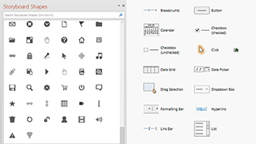
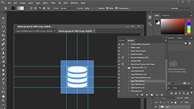
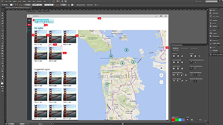

<link rel="stylesheet" href="https://az835927.vo.msecnd.net/sites/uwp/Resources/css/custom.css"> 

# Downloads de design para aplicativos UWP

Esta seção contém downloads relacionados a design e à interface do usuário para aplicativos UWP. Para ferramentas adicionais, como o Visual Studio, consulte [nossa página principal de downloads](https://developer.microsoft.com/downloads). 

## Modelos de design

  

    
<b>PowerPoint</b> 
Este conjunto contém tudo o que você precisa para simular rapidamente esboços para aplicativos UWP, inclusive controles e layouts. [Baixar os modelos de design para PowerPoint](https://go.microsoft.com/fwlink/p/?LinkId=534632)

  

  

  

  

            
<b>Adobe Illustrator</b> 
Estes modelos do Adobe Illustrator fornecem controles e layouts para o design de aplicativos UWP. [Baixar os modelos de design para Adobe Illustrator](https://go.microsoft.com/fwlink/p/?LinkId=534634)
    
  

  

  

  

            
<b>Adobe Photoshop</b> 
Os controles e layouts para criar aplicativos UWP no Adobe Photoshop. [Baixar os modelos de design para Adobe Photoshop](http://go.microsoft.com/fwlink/p/?LinkId=626453)
    
  

  

  

## Ferramentas

  

            
<b>Gerador de bloco e ícone para o Adobe Photoshop</b> 
Esse conjunto de ações para o Adobe Photoshop gera os 68 ativos recomendados de bloco e o ícone de apenas 7 arquivos.  [Baixe o gerador de bloco e ícone](http://go.microsoft.com/fwlink/p/?LinkId=760394)
    
  

  

  

  

            
<b>Ferramenta Redliner para o Adobe Illustrator</b> 
Gera sem esforço linhas vermelhas dos seus protótipos do Illustrator.  [Baixar a ferramenta Redliner para o Adobe Illustrator](https://go.microsoft.com/fwlink/p/?LinkId=534641)
    
  

  

  

## Exemplos

  

            
<b>Aplicativo de compartilhamento de fotos</b>  
Este aplicativo de amostra demonstra o compartilhamento de fotos com as mídias sociais da realidade. Ele demonstra design responsivo, compra no aplicativo, serviços do Azure, notificações por push e muito mais.  [Baixe a amostra do aplicativo de compartilhamento de fotos](http://go.microsoft.com/fwlink/p/?LinkId=760402) [Leia mais sobre o PhotoSharingApp](http://go.microsoft.com/fwlink/p/?LinkId=760401)
    
  

  

  

  

            
<b>Hue Lights </b> 
Esta amostra se integra aos recursos do Windows com a automação doméstica inteligente. Especificamente, mostra como você pode usar a Cortana e o Bluetooth de Baixa Energia (Bluetooth LE) para criar uma experiência interativa com o Phillips Hue Lights (um sistema de iluminação ativado por Wi-Fi).  [Baixe a amostra do Hue Lights](https://github.com/Microsoft/Windows-appsample-huelightcontroller/archive/master.zip) [Leia mais sobre a amostra do Hue Lights](https://github.com/Microsoft/Windows-appsample-huelightcontroller)
    
  

  

  

<b>Quer mais código?</b> Confira a página de exemplo do Windows para obter uma lista completa de todos as nossas amostras de aplicativos UWP. [Acesse o portal de amostras](https://developer.microsoft.com/samples)

<!--HONumber=Jul16_HO1-->

