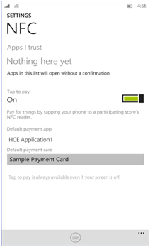

# <a name="create-an-nfc-smart-card-app"></a>Criar um aplicativo de cartão inteligente NFC


**Importante**este tópico se aplica somente ao Windows 10 Mobile.

O Windows Phone 8.1 dava suporte a aplicativos de emulação de cartão NFC usando um elemento seguro baseado em SIM, mas esse modelo exigia que aplicativos de pagamento seguro estivessem rigidamente acoplados a MNO (operadoras de rede móvel). Isso limitava a variedade de soluções de pagamento possíveis por outros comerciantes ou desenvolvedores que não estão associados a MNOs. No Windows 10 Mobile, apresentamos uma nova tecnologia de emulação de cartão, chamada emulação de cartão Host (HCE). A tecnologia HCE permite que seu aplicativo se comunique diretamente com um leitor de cartão NFC. Este tópico ilustra como a emulação de cartão de Host (HCE) funciona em dispositivos Windows 10 Mobile e como você pode desenvolver um aplicativo HCE para que os clientes possam acessar seus serviços de telefone, em vez de um cartão físico sem colaborar com uma MNO.

## <a name="what-you-need-to-develop-an-hce-app"></a>O que você precisa para desenvolver um aplicativo HCE


Para desenvolver um aplicativo de emulação de cartão baseado em HCE para Windows 10 Mobile, você precisará obter sua configuração do ambiente de desenvolvimento. Você pode Prepare-se ao instalar o Microsoft Visual Studio2015, que inclui as ferramentas de desenvolvedor do Windows e o emulador do Windows 10 Mobile com suporte à emulação de NFC. Para obter mais informações sobre a obtenção da configuração, consulte [Prepare-se para começar](https://msdn.microsoft.com/library/windows/apps/Dn726766)

Opcionalmente, se você quiser testar com um dispositivo Windows 10 Mobile real em vez do emulador do Windows 10 Mobile incluído, você também precisará os itens a seguir.

-   Um dispositivo Windows 10 Mobile com suporte a HCE NFC. Atualmente, o Lumia 730, 830, 640 e o 640 XL têm hardware com suporte a aplicativos HCE NFC.
-   Um terminal leitor que dê suporte a protocolos ISO/IEC 14443-4 e ISO/IEC 7816-4

Windows 10 Mobile implementa um serviço HCE que fornece as seguintes funcionalidades.

-   Os aplicativos podem registrar os AIDs (identificadores de miniaplicativos) dos cartões que desejam emular.
-   Resolução de conflitos e roteamento do comando APDU (unidade de dados do protocolo de aplicativo) e de pares de respostas para um dos aplicativos registrados com base na seleção de cartão leitor externo e na preferência do usuário.
-   Manipulação de eventos e notificações aos aplicativos como resultado de ações do usuário.

Windows 10 oferece suporte à emulação de cartões inteligentes que se baseiam em ISO-DEP (ISO-IEC 14443-4) e se comunicam usando APDUs conforme definido no ISO-IEC 7816-4 especificação. Windows 10 dá suporte à ISO/IEC 14443-4 tipo A tecnologia para aplicativos HCE. As tecnologias tipo B, tipo F e não ISO-DEP (por exemplo, MIFARE) são roteadas para o SIM por padrão.

Apenas os dispositivos Windows 10 Mobile são habilitados com o recurso de emulação de cartão. Emulação de cartão com base em HCE e SIM não está disponível em outras versões do Windows 10.

A arquitetura do suporte para emulação de cartão baseada em HCE e SIM é mostrada no diagrama abaixo.


## <a name="app-selection-and-aid-routing"></a>Seleção de aplicativos e roteamento AID

Para desenvolver um aplicativo HCE, você deve entender como dispositivos Windows 10 Mobile encaminham AIDs para um aplicativo específico porque os usuários podem instalar vários aplicativos HCE diferentes. Cada aplicativo pode registrar vários HCE e cartões baseados em SIM. Aplicativos Windows Phone 8.1 herdados que são baseados em SIM continuarão a funcionar no Windows 10 Mobile, desde que o usuário escolha a opção "Cartão SIM" como seu cartão de pagamento padrão no menu de configuração NFC. Isso é definido por padrão quando o dispositivo é ajustado pela primeira vez.

Quando o usuário toca no dispositivo Windows 10 Mobile em um terminal, os dados automaticamente são roteados para o aplicativo adequado instalado no dispositivo. Esse roteamento é baseado nos AIDs, que são identificadores de 5 a 16 bytes. Durante um toque, o terminal externo transmitirá um comando SELECT APDU para especificar o AID para o qual ele gostaria que todos os comandos APDU subsequentes fossem roteados. Os comandos SELECT subsequentes mudarão o roteamento novamente. Com base nos AIDs registrados pelos aplicativos e configurações do usuário, o tráfego da APDU é roteado para um aplicativo específico, que enviará uma resposta à APDU. Lembre-se de que um terminal talvez queira se comunicar com vários aplicativos diferentes durante o mesmo toque. Portanto, você deve garantir que a tarefa em segundo plano do seu aplicativo seja encerrada o mais rápido possível quando desativada para dar espaço para a tarefa em segundo plano do outro aplicativo responder à APDU. Discutiremos as tarefas em segundo plano mais adiante neste tópico.

Os aplicativos HCE devem se registrar com AIDs específicos que possam manipular, portanto receberão APDUs para um AID. Os aplicativos declaram AIDs usando grupos de AIDs. Um grupo de AIDs é conceitualmente equivalente a um cartão físico individual. Por exemplo, um cartão de crédito é declarado com um grupo de AIDs e um segundo cartão de crédito de um banco diferente é declarado com um grupo de AIDs diferente, mesmo que ambos possam ter o mesmo AID.

## <a name="conflict-resolution-for-payment-aid-groups"></a>Resolução do conflitos de grupos de AIDs de pagamento

Quando um aplicativo registra cartões físicos (grupos de AIDs), ele pode declarar a categoria do grupo de AIDs como "Pagamento" ou "Outros". Embora possa haver vários grupos de AIDs de pagamento registrados em um determinado momento, apenas um desses grupos de AIDs de pagamento poderá ser habilitado para Tocar e Pagar por vez, o que é selecionado pelo usuário. Esse comportamento existe porque o usuário espera estar no controle de conscientemente escolher um único pagamento, cartão de crédito ou débito a ser usado, para que ele não pague com um cartão diferente sem querer ao tocar o dispositivo em um terminal.

No entanto, vários grupos de AIDs registrados como "Outros" podem ser habilitados ao mesmo tempo sem a interação do usuário. Esse comportamento existe porque espera-se que outros tipos de cartões, como fidelidade, cupons ou transporte público, funcionem sem qualquer esforço ou notificação sempre que o usuário toca no telefone.

Todos os grupos de AIDs registrados como "Pagamento" aparecem na lista de cartões na página de Configurações do NFC, onde o usuário pode selecionar seu cartão de pagamento padrão. Quando um cartão de pagamento padrão é selecionado, o aplicativo que registrou esse grupo de AIDs de pagamento se torna o aplicativo de pagamento padrão. Os aplicativos de pagamento padrão podem habilitar ou desabilitar qualquer um de seus grupos de AIDs sem a interação do usuário. Se o usuário recusar o prompt do aplicativo de pagamento padrão, o aplicativo de pagamento padrão atual (se houver) continuará sendo o padrão. A captura de tela a seguir mostra a página NFC Settings.



Usando a captura de tela de exemplo acima, se o usuário alterar o cartão de pagamento padrão para outro cartão que não esteja registrado por "HCE Application 1", o sistema criará um prompt de confirmação para obter o consentimento do usuário. Entretanto, se o usuário alterar seu cartão de pagamento padrão para outro cartão que esteja registrado pelo "HCE Application 1", o sistema não criará um prompt de confirmação para o usuário, pois "HCE Application1" já é o aplicativo de pagamento padrão.

## <a name="conflict-resolution-for-non-payment-aid-groups"></a>Resolução de conflitos de grupos de AIDs de não pagamento

Os cartões de não pagamento categorizados como "Outros" não aparecem na página de configurações de NFC.

Seu aplicativo pode criar, registrar e habilitar grupos de AIDs de não pagamento da mesma maneira que os grupos de AIDs de pagamento. A principal diferença é que, para grupos de AIDs de não pagamento, a categoria de emulação é definida como "Outros", em oposição a "Pagamento". Depois de registrar o grupo de AIDs no sistema, você precisa habilitar o grupo para receber o tráfego de NFC. Quando você tenta habilitar um grupo de AIDs de não pagamento para receber tráfego, o usuário não recebe um prompt de confirmação, a menos que haja um conflito com um dos AIDs já registrados no sistema por um aplicativo diferente. Se houver um conflito, o usuário será solicitado a fornecer informações sobre o cartão e o aplicativo associado que serão desabilitados se ele optar por habilitar o grupo de AIDs recém-registrado.

**Coexistência com cartão SIM baseado em aplicativos de NFC**

No Windows 10 Mobile, o sistema configura a tabela de roteamento controlador NFC que é usada para tomar decisões de roteamento na camada do controlador. A tabela contém informações de roteamento para os itens a seguir.

-   Rotas de AIDs individuais.
-   Rota baseada em protocolo (ISO-DEP).
-   Roteamento baseado em tecnologia (NFC-A/B/F).

Quando um leitor externo envia um comando "SELECT AID", o controlador NFC primeiro procura uma correspondência nas rotas de AIDs na tabela de roteamento. Se não houver nenhuma correspondência, ele usará a rota baseada em protocolo como a rota padrão para o tráfego ISO-DEP (14443-4-A). Para qualquer outro tráfego que não seja ISO-DEP, ele usará o roteamento baseado em tecnologia.

Windows 10 Mobile oferece uma opção de menu "Cartão SIM" na página de configurações de NFC para continuar a usar aplicativos baseados em SIM do Windows Phone 8.1 herdados, que não registram AIDs no sistema. Se o usuário selecionar "Cartão SIM" como seu cartão de pagamento padrão, a rota ISO-DEP será definida como UICC; para todas as outras seleções no menu suspenso, a rota ISO-DEP será para o host.

A rota ISO-DEP é definida como "Cartão SIM" para dispositivos que têm um SE habilitado cartão SIM quando o dispositivo é inicializado pela primeira vez com o Windows 10 Mobile. Quando o usuário instalar um aplicativo habilitado para HCE e esse aplicativo habilitar quaisquer registros de grupos de AIDs HCE, a rota ISO-DEP será apontada para o host. Os novos aplicativos baseados em SIM precisam registrar os AIDs no SIM para que as rotas de AIDs específicas sejam populadas na tabela de roteamento do controlador.

## <a name="creating-an-hce-based-app"></a>Criando um aplicativo baseado em HCE

Seu aplicativo HCE tem duas partes.

-   O aplicativo em primeiro plano principal para a interação do usuário.
-   Uma tarefa em segundo plano que é disparada pelo sistema para processar APDUs para um determinado AID.

Devido aos requisitos de desempenho extremamente rigorosos para carregar sua tarefa em segundo plano em resposta a um toque NFC, recomendamos que toda a sua tarefa em segundo plano seja implementada em código nativo C++/CX (incluindo quaisquer dependências, referências ou bibliotecas das quais você depende) em vez de C# ou código gerenciado. Embora o C# e o código gerenciado normalmente tenham um bom desempenho, há uma sobrecarga, como o carregamento do CLR .NET, que pode ser evitada com a gravação em C++/CX.
## <a name="create-and-register-your-background-task"></a>Criar e registrar sua tarefa em segundo plano

Você precisa criar uma tarefa em segundo plano em seu aplicativo HCE para processar e responder às APDUs roteadas para ele pelo sistema. Na primeira vez em que seu aplicativo é iniciado, o primeiro plano registra uma tarefa em segundo plano de HCE que implementa a interface [**IBackgroundTaskRegistration**](https://msdn.microsoft.com/library/windows/apps/BR224803) conforme mostrado no código a seguir.

```csharp
var taskBuilder = new BackgroundTaskBuilder();
taskBuilder.Name = bgTaskName;
taskBuilder.TaskEntryPoint = taskEntryPoint;
taskBuilder.SetTrigger(new SmartCardTrigger(SmartCardTriggerType.EmulatorHostApplicationActivated));
bgTask = taskBuilder.Register();
```

Observe que o gatilho da tarefa é definido como [**SmartCardTriggerType**](https://msdn.microsoft.com/library/windows/apps/Dn608017). **EmulatorHostApplicationActivated**. Isso significa que, sempre que um comando APDU SELECT AID for recebido pelo sistema operacional sendo resolvido para o seu aplicativo, sua tarefa em segundo plano será iniciada.

## <a name="receive-and-respond-to-apdus"></a>Receber e responder a APDUs

Quando houver uma APDU dirigida ao seu aplicativo, o sistema iniciará sua tarefa em segundo plano. Sua tarefa em segundo plano recebe a APDU passada por meio da propriedade [**CommandApdu**](https://msdn.microsoft.com/library/windows/apps/windows.devices.smartcards.smartcardemulatorapdureceivedeventargs.commandapdu.aspx) do objeto [**SmartCardEmulatorApduReceivedEventArgs**](https://msdn.microsoft.com/library/windows/apps/Dn894640) e responde à APDU usando o método [**TryRespondAsync**](https://msdn.microsoft.com/library/windows/apps/mt634299.aspx) do mesmo objeto. Considere manter sua tarefa em segundo plano para operações leves por motivos de desempenho. Por exemplo, responda às APDUs imediatamente e saia de sua tarefa em segundo plano quando todo o processamento estiver concluído. Devido à natureza das transações NFC, os usuários tendem a encostar seus dispositivos no leitor por um período muito curto de tempo. Sua tarefa em segundo plano continuará a receber tráfego do leitor até que a conexão seja desativada. Nesse caso, você receberá um objeto [**SmartCardEmulatorConnectionDeactivatedEventArgs**](https://msdn.microsoft.com/library/windows/apps/Dn894644). Sua conexão pode ser desativada pelos motivos a seguir, conforme indicado na propriedade [**SmartCardEmulatorConnectionDeactivatedEventArgs.Reason**](https://msdn.microsoft.com/library/windows/apps/windows.devices.smartcards.smartcardemulatorconnectiondeactivatedeventargs.reason).

-   Se a conexão for desativada com o valor **ConnectionLost**, isso significará que o usuário afastou seu dispositivo do leitor. Se o seu aplicativo precisar que o usuário toque no terminal por mais tempo, considere solicitar seus comentários. Você deve encerrar sua tarefa em segundo plano rapidamente (concluindo o adiamento) para garantir que, se o usuário tocar novamente, ela não ficará aguardando a tarefa em segundo plano anterior ser encerrada.
-   Se a conexão for desativada com **ConnectionRedirected**, isso significará que o terminal enviou um novo comando APDU SELECT AID dirigido a um AID diferente. Nesse caso, seu aplicativo deverá encerrar a tarefa em segundo plano imediatamente (concluindo o adiamento) para permitir a execução de outra tarefa em segundo plano.

A tarefa em segundo plano também deve se registrar no [**Evento cancelado**](https://msdn.microsoft.com/library/windows/apps/BR224798) em [**IBackgroundTaskInstance interface**](https://msdn.microsoft.com/library/windows/apps/BR224797) e, da mesma forma, encerrar a tarefa em segundo plano rapidamente (concluindo o adiamento) porque esse evento é disparado pelo sistema quando é concluído com sua tarefa em segundo plano. Abaixo está o código que demonstra uma tarefa em plano de fundo do aplicativo HCE.

```csharp
void BgTask::Run(
    IBackgroundTaskInstance^ taskInstance)
{
    m_triggerDetails = static_cast<SmartCardTriggerDetails^>(taskInstance->TriggerDetails);
    if (m_triggerDetails == nullptr)
    {
        // May be not a smart card event that triggered us
        return;
    }

    m_emulator = m_triggerDetails->Emulator;
    m_taskInstance = taskInstance;

    switch (m_triggerDetails->TriggerType)
    {
    case SmartCardTriggerType::EmulatorHostApplicationActivated:
        HandleHceActivation();
        break;

    case SmartCardTriggerType::EmulatorAppletIdGroupRegistrationChanged:
        HandleRegistrationChange();
        break;

    default:
        break;
    }
}

void BgTask::HandleHceActivation()
{
 try
 {
        auto lock = m_srwLock.LockShared();
        // Take a deferral to keep this background task alive even after this "Run" method returns
        // You must complete this deferal immediately after you have done processing the current transaction
        m_deferral = m_taskInstance->GetDeferral();

        DebugLog(L"*** HCE Activation Background Task Started ***");

        // Set up a handler for if the background task is cancelled, we must immediately complete our deferral
        m_taskInstance->Canceled += ref new Windows::ApplicationModel::Background::BackgroundTaskCanceledEventHandler(
            [this](
            IBackgroundTaskInstance^ sender,
            BackgroundTaskCancellationReason reason)
        {
            DebugLog(L"Cancelled");
            DebugLog(reason.ToString()->Data());
            EndTask();
        });

        if (Windows::Phone::System::SystemProtection::ScreenLocked)
        {
            auto denyIfLocked = Windows::Storage::ApplicationData::Current->RoamingSettings->Values->Lookup("DenyIfPhoneLocked");
            if (denyIfLocked != nullptr && (bool)denyIfLocked == true)
            {
                // The phone is locked, and our current user setting is to deny transactions while locked so let the user know
                // Denied
                DoLaunch(Denied, L"Phone was locked at the time of tap");

                // We still need to respond to APDUs in a timely manner, even though we will just return failure
                m_fDenyTransactions = true;
            }
        }
        else
        {
            m_fDenyTransactions = false;
        }

        m_emulator->ApduReceived += ref new TypedEventHandler<SmartCardEmulator^, SmartCardEmulatorApduReceivedEventArgs^>(
            this, &BgTask::ApduReceived);

        m_emulator->ConnectionDeactivated += ref new TypedEventHandler<SmartCardEmulator^, SmartCardEmulatorConnectionDeactivatedEventArgs^>(
                [this](
                SmartCardEmulator^ emulator,
                SmartCardEmulatorConnectionDeactivatedEventArgs^ eventArgs)
            {
                DebugLog(L"Connection deactivated");
                EndTask();
            });

  m_emulator->Start();
        DebugLog(L"Emulator started");
 }
 catch (Exception^ e)
 {
        DebugLog(("Exception in Run: " + e->ToString())->Data());
        EndTask();
 }
}
```
## <a name="create-and-register-aid-groups"></a>Criar e registrar grupos de AIDs

Durante a primeira inicialização do seu aplicativo quando o cartão está sendo provisionado, você criará e registrará grupos de AIDs no sistema. O sistema determina o aplicativo com o qual um leitor externo gostaria de conversar e faz o roteamento de APDUs de acordo com os AIDs registrados e as configurações do usuário.

A maioria dos cartões de pagamento se registra para o mesmo AID (que é o AID PPSE) junto com os AIDs adicionais específicos ao cartão da rede de pagamento. Cada grupo de AIDs representa um cartão e, quando o usuário habilita o cartão, todos os AIDs do grupo são habilitados. Da mesma forma, quando o usuário desativa o cartão, todos os AIDs do grupo são desabilitados.

Para registrar um grupo de AIDs, você precisa criar um objeto [**SmartCardAppletIdGroup**](https://msdn.microsoft.com/library/windows/apps/Dn910955) e definir suas propriedades para refletir que se trata de um cartão de pagamento baseado em HCE. Seu nome de exibição deve ser descritivo do usuário porque ele será exibido no menu de configurações NFC e nos prompts do usuário. Para cartões de pagamento HCE, a propriedade [**SmartCardEmulationCategory**](https://msdn.microsoft.com/library/windows/apps/windows.devices.smartcards.smartcardappletidgroup.smartcardemulationcategory.aspx) deve ser definida como **Payment**, e a propriedade [**SmartCardEmulationType**](https://msdn.microsoft.com/library/windows/apps/windows.devices.smartcards.smartcardappletidgroup.smartcardemulationtype) deve ser definida como **Host**.

```csharp
public static byte[] AID_PPSE =
        {
            // File name "2PAY.SYS.DDF01" (14 bytes)
            (byte)'2', (byte)'P', (byte)'A', (byte)'Y',
            (byte)'.', (byte)'S', (byte)'Y', (byte)'S',
            (byte)'.', (byte)'D', (byte)'D', (byte)'F', (byte)'0', (byte)'1'
        };

var appletIdGroup = new SmartCardAppletIdGroup(
                        "Example DisplayName",
                                new List<IBuffer> {AID_PPSE.AsBuffer()},
                                SmartCardEmulationCategory.Payment,
                                SmartCardEmulationType.Host);
```

Para cartões de não pagamento HCE, a propriedade [**SmartCardEmulationCategory**](https://msdn.microsoft.com/library/windows/apps/windows.devices.smartcards.smartcardappletidgroup.smartcardemulationcategory.aspx) deve ser definida como **Other**, e a propriedade [**SmartCardEmulationType**](https://msdn.microsoft.com/library/windows/apps/windows.devices.smartcards.smartcardappletidgroup.smartcardemulationtype) deve ser definida como **Host**.

```csharp
public static byte[] AID_OTHER =
        {
            (byte)'1', (byte)'2', (byte)'3', (byte)'4',
            (byte)'5', (byte)'6', (byte)'7', (byte)'8',
            (byte)'O', (byte)'T', (byte)'H', (byte)'E', (byte)'R'
        };

var appletIdGroup = new SmartCardAppletIdGroup(
                        "Example DisplayName",
                                new List<IBuffer> {AID_OTHER.AsBuffer()},
                                SmartCardEmulationCategory.Other,
                                SmartCardEmulationType.Host);
```

Você pode incluir até 9 AIDs (de 5 a 16 bytes cada) por grupo de AIDs.

Use o método [**RegisterAppletIdGroupAsync**](https://msdn.microsoft.com/library/windows/apps/Dn894656) para registrar seu grupo de AIDs no sistema, o que retornará um objeto [**SmartCardAppletIdGroupRegistration**](https://docs.microsoft.com/en-us/uwp/api/windows.devices.smartcards.smartcardappletidgroupregistration). Por padrão, a propriedade [**ActivationPolicy**](https://docs.microsoft.com/en-us/uwp/api/windows.devices.smartcards.smartcardappletidgroupregistration) do objeto de registro é definida como **Disabled**. Isso significa que, embora seus AIDs estejam registrados no sistema, eles não estão habilitados ainda e não receberão tráfego.

```csharp
reg = await SmartCardEmulator.RegisterAppletIdGroupAsync(appletIdGroup);
```

Você pode habilitar seus cartões registrados (grupos de AIDs) usando o método [**RequestActivationPolicyChangeAsync**](https://docs.microsoft.com/en-us/uwp/api/windows.devices.smartcards.smartcardappletidgroupregistration) da classe [**SmartCardAppletIdGroupRegistration**](https://docs.microsoft.com/en-us/uwp/api/windows.devices.smartcards.smartcardappletidgroupregistration) conforme mostrado a seguir. Como apenas um cartão de pagamento de cada vez pode ser habilitado no sistema, definir o [**ActivationPolicy**](https://docs.microsoft.com/en-us/uwp/api/windows.devices.smartcards.smartcardappletidgroupregistration) de um grupo de AIDs de pagamento como **Enabled** é o mesmo que definir o cartão de pagamento padrão. O usuário será solicitado a autorizar esse cartão como um cartão de pagamento padrão, independentemente do fato de haver um cartão de pagamento padrão já selecionado ou não. Esta instrução não será true se o aplicativo já for o aplicativo de pagamento padrão, e estará simplesmente alternando entre seus próprios grupos de AIDs. Você pode registrar até 10 grupos de AIDs por aplicativo.

```csharp
reg.RequestActivationPolicyChangeAsync(AppletIdGroupActivationPolicy.Enabled);
```

É possível consultar seus grupos de AIDs do seu aplicativo registrados no sistema operacional e verificar sua política de ativação usando o método [**GetAppletIdGroupRegistrationsAsync**](https://msdn.microsoft.com/library/windows/apps/Dn894654).

Os usuários serão avisados quando você alterar a política de ativação de um cartão de pagamento de **Disabled** para **Enabled**, somente se seu aplicativo ainda não for o aplicativo de pagamento padrão. Os usuários só serão avisados quando você alterar a política de ativação de um cartão de não pagamento de **Disabled** para **Enabled** se houver um conflito de AID.

```csharp
var registrations = await SmartCardEmulator.GetAppletIdGroupRegistrationsAsync();
    foreach (var registration in registrations)
    {
registration.RequestActivationPolicyChangeAsync (AppletIdGroupActivationPolicy.Enabled);
    }
```

**Notificação de evento quando a política de ativação muda**

Em sua tarefa em segundo plano, você pode se registrar para receber eventos para quando a política de ativação de um de seus grupos de AIDs mudar fora do aplicativo. Por exemplo, o usuário pode alterar o aplicativo de pagamento padrão no menu de configurações de NFC de um dos cartões para outro cartão hospedado por outro aplicativo. Se seu aplicativo precisar saber sobre essa alteração de configuração interna, como a atualização de blocos dinâmicos, você poderá receber notificações de eventos para essa alteração e agir da forma adequada no aplicativo.

```csharp
var taskBuilder = new BackgroundTaskBuilder();
taskBuilder.Name = bgTaskName;
taskBuilder.TaskEntryPoint = taskEntryPoint;
taskBuilder.SetTrigger(new SmartCardTrigger(SmartCardTriggerType.EmulatorAppletIdGroupRegistrationChanged));
bgTask = taskBuilder.Register();
```

## <a name="foreground-override-behavior"></a>Comportamento de substituição em primeiro plano

Você pode alterar o [**ActivationPolicy**](https://docs.microsoft.com/en-us/uwp/api/windows.devices.smartcards.smartcardappletidgroupregistration) de qualquer um dos seus registros de grupo de AIDs para **ForegroundOverride** enquanto seu aplicativo estiver em primeiro plano sem avisar o usuário. Quando o usuário toca no dispositivo em um terminal enquanto seu aplicativo está em primeiro plano, o tráfego é roteado para o aplicativo, mesmo que nenhum de seus cartões de pagamento tenha sido escolhido pelo usuário como o cartão de pagamento padrão. Quando você altera a política de ativação de um cartão para **ForegroundOverride**, essa alteração é temporária somente até o aplicativo sair do primeiro plano, e não mudará o cartão de pagamento padrão atual definido pelo usuário. Você pode alterar o **ActivationPolicy** de seus cartões de pagamento ou de não pagamento de seu aplicativo em primeiro plano conforme explicado a seguir. Observe que o método [**RequestActivationPolicyChangeAsync**](https://docs.microsoft.com/en-us/uwp/api/windows.devices.smartcards.smartcardappletidgroupregistration) só pode ser chamado de um aplicativo em primeiro plano, e não de uma tarefa em segundo plano.

```csharp
reg.RequestActivationPolicyChangeAsync(AppletIdGroupActivationPolicy.ForegroundOverride);
```

Além disso, você pode registrar um grupo de AIDs que consiste em um único AID de comprimento 0 que fará o sistema rotear todas as APDUs, independentemente do AID e incluindo quaisquer APDUs de comando enviadas antes de um comando SELECT AID ser recebido. Entretanto, esse grupo de AIDs funciona apenas enquanto seu aplicativo está em primeiro plano, pois ele só pode ser definido como **ForegroundOverride** e não pode ser habilitado permanentemente. Além disso, esse mecanismo funciona para os valores **Host** e **UICC** da enumeração [**SmartCardEmulationType**](https://msdn.microsoft.com/library/windows/apps/Dn894639) para rotear todo o tráfego para sua tarefa em segundo plano de HCE ou para o cartão SIM.

```csharp
public static byte[] AID_Foreground =
        {};

var appletIdGroup = new SmartCardAppletIdGroup(
                        "Example DisplayName",
                                new List<IBuffer> {AID_Foreground.AsBuffer()},
                                SmartCardEmulationCategory.Other,
                                SmartCardEmulationType.Host);
reg = await SmartCardEmulator.RegisterAppletIdGroupAsync(appletIdGroup);
reg.RequestActivationPolicyChangeAsync(AppletIdGroupActivationPolicy.ForegroundOverride);
```

## <a name="check-for-nfc-and-hce-support"></a>Verifique se há suporte para NFC e HCE

Seu aplicativo deve verificar se um dispositivo tem hardware NFC, oferece suporte ao recurso de emulação de cartão e oferece suporte à emulação de cartão do host antes de oferecer esses recursos ao usuário.

O recurso de emulação de cartão inteligente NFC é habilitado apenas no Windows 10 Mobile, portanto, a tentativa de usar APIs do emulador cartão inteligente em outras versões do Windows 10, causará erros. Você pode verificar se há suporte para a API do cartão inteligente no trecho de código a seguir.

```csharp
Windows.Foundation.Metadata.ApiInformation.IsTypePresent("Windows.Devices.SmartCards.SmartCardEmulator");
```

Além disso, você pode verificar se o dispositivo tem o hardware NFC com capacidade para alguma forma de emulação de cartão verificando se o método [**SmartCardEmulator.GetDefaultAsync**](https://msdn.microsoft.com/library/windows/apps/Dn608008) retorna null. Se tiver, nenhuma emulação de cartão NFC será compatível com o dispositivo.

```csharp
var smartcardemulator = await SmartCardEmulator.GetDefaultAsync();<
```

O suporte para roteamento UICC baseado em AID e HCE está disponível apenas em dispositivos lançados recentemente, como Lumia 730, 830, 640 e 640 XL. Quaisquer novos dispositivos compatíveis com NFC que executam o Windows 10 Mobile e posteriores devem dar suporte a HCE. Seu aplicativo pode verificar se há suporte a HCE como se segue.

```csharp
Smartcardemulator.IsHostCardEmulationSupported();
```

## <a name="lock-screen-and-screen-off-behavior"></a>Comportamento da tela de bloqueio e da tela desligada

Windows 10 Mobile tem configurações de emulação de cartão de nível de dispositivo, que podem ser definidas pela operadora móvel ou o fabricante do dispositivo. Por padrão, a alternância de "tocar para pagar" é desabilitada e a "política de capacitação em nível de dispositivo" é definida como "Sempre", a menos que o OEM ou o MO substitua esses valores.

Seu aplicativo pode consultar o valor de [**EnablementPolicy**](https://msdn.microsoft.com/library/windows/apps/Dn608006) no nível do dispositivo e executar uma ação para cada caso, dependendo do comportamento desejado de seu aplicativo em cada estado.

```csharp
SmartCardEmulator emulator = await SmartCardEmulator.GetDefaultAsync();

switch (emulator.EnablementPolicy)
{
case Never:
// you can take the user to the NFC settings to turn "tap and pay" on
await Windows.System.Launcher.LaunchUriAsync(new Uri("ms-settings-nfctransactions:"));
break;

 case Always:
return "Card emulation always on";

 case ScreenOn:
 return "Card emulation on only when screen is on";

 case ScreenUnlocked:
 return "Card emulation on only when screen unlocked";
}
```

A tarefa em segundo plano do seu aplicativo será iniciada mesmo se o telefone estiver bloqueado e/ou a tela estiver desligada somente se o leitor externo selecionar um AID que seja resolvido para o seu aplicativo. Você pode responder aos comandos do leitor na sua tarefa em segundo plano, mas, se precisar de qualquer entrada do usuário ou se quiser mostrar uma mensagem ao usuário, você poderá iniciar seu aplicativo em primeiro plano com alguns argumentos. Sua tarefa em segundo plano pode iniciar seu aplicativo em primeiro plano com o comportamento a seguir.

-   Sob a tela de bloqueio do dispositivo (o usuário verá seu aplicativo em primeiro plano somente depois de desbloquear o dispositivo)
-   Acima da tela de bloqueio do dispositivo (depois que o usuário ignora o seu aplicativo, o dispositivo ainda está em estado bloqueado)

```csharp
        if (Windows::Phone::System::SystemProtection::ScreenLocked)
        {
            // Launch above the lock with some arguments
            var result = await eventDetails.TryLaunchSelfAsync("app-specific arguments", SmartCardLaunchBehavior.AboveLock);
        }
```

## <a name="aid-registration-and-other-updates-for-sim-based-apps"></a>Registro de AID e outras atualizações para aplicativos baseados em SIM

Os aplicativos de emulação de cartão que usam o SIM como o elemento seguro podem se registrar no serviço Windows para declarar os AIDs com suporte no SIM. Esse registro é muito semelhante ao registro de um aplicativo baseado em HCE. A única diferença é o [**SmartCardEmulationType**](https://msdn.microsoft.com/library/windows/apps/Dn894639) que deve ser definido como UICC para aplicativos baseados em SIM. Como resultado do registro de cartão de pagamento, o nome de exibição do cartão também será populado no menu de configuração NFC.

```csharp
var appletIdGroup = new SmartCardAppletIdGroup(
                        "Example DisplayName",
                                new List<IBuffer> {AID_PPSE.AsBuffer()},
                                SmartCardEmulationCategory.Payment,
                                SmartCardEmulationType.Uicc);
```

* * Importante * * o suporte de intercepção SMS binário herdado no Windows Phone 8.1 foi removido e substituído pelo novo suporte mais amplo de SMS no Windows 10 Mobile, mas os aplicativos Windows Phone 8.1 herdados que dependem disso devem ser atualizados para usar o novo Windows 10 Mobile SMS APIs.
