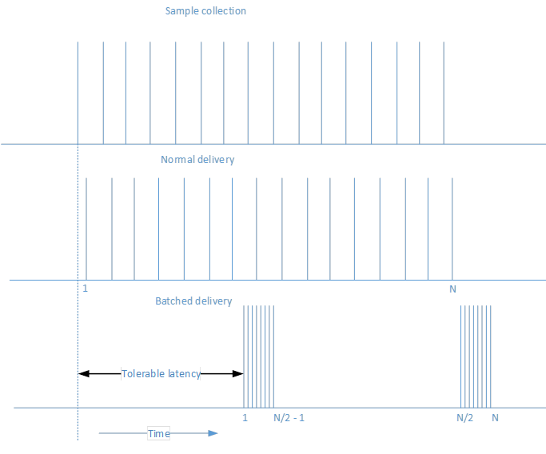
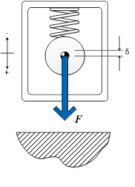
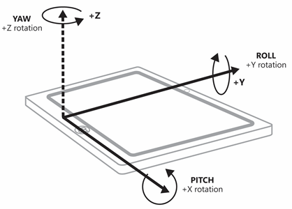

# Sensores

Os sensores permitem ao aplicativo identificar a relação entre um dispositivo e o mundo físico ao redor dele. Os sensores podem informar ao aplicativo a direção, a orientação e o movimento do dispositivo. Esses sensores podem ajudar a melhorar a utilidade e a interatividade de jogos, aplicativos de realidade aumentada e aplicativos utilitários, fornecendo uma forma exclusiva de entrada – por exemplo, uso do movimento do dispositivo para organizar os caracteres na tela ou para simular que o usuário está em uma cabine e usando o dispositivo como o volante.

Como regra geral, decida desde o princípio se o seu aplicativo irá depender exclusivamente dos sensores ou se os sensores apenas oferecerão um mecanismo de controle adicional ao aplicativo. Por exemplo, um jogo de corrida usando um dispositivo como um volante virtual pode, alternativamente, ser controlado pela GUI na tela. Desse modo, o aplicativo funciona independentemente de os sensores estarem disponíveis no sistema. Por outro lado, um jogo do tipo marble tilt maze pode ser codificado para funcionar somente em sistemas que tenham os sensores apropriados. Você precisa decidir estrategicamente se irá depender dos sensores. Observe que um esquema de controle de mouse/toque lida com imersão para proporcionar um controle maior.

| Tópico                                                       | Descrição  |
|-------------------------------------------------------------|--------------|
| [Calibrar sensores](calibrate-sensors.md)                   | Sensores em um dispositivo baseado no magnetômetro (bússola, inclinômetro e sensor de orientação) podem precisar de calibragem devido a fatores ambientais. A enumeração [<strong>MagnetometerAccuracy</strong>](https://msdn.microsoft.com/library/windows/apps/Dn297552) pode ajudar a determinar um curso de ação quando seu dispositivo precisar de calibração. |
| [Orientação do sensor](sensor-orientation.md)                 | Os dados do sensor das classes [<strong>OrientationSensor</strong>](https://msdn.microsoft.com/library/windows/apps/BR206371) e são definidos por seus eixos de referência. Esses eixos são definidos pela orientação paisagem do dispositivo e giram com o dispositivo conforme o usuário o vira. |
| [Usar o acelerômetro](use-the-accelerometer.md)           | Saiba como usar o acelerômetro para responder ao movimento do usuário. |
| [Usar a bússola](use-the-compass.md)                       | Saiba como usar a bússola para determinar a direção atual. |
| [Usar o girômetro](use-the-gyrometer.md)                   | Saiba como usar o girômetro para detectar mudanças no movimento do usuário. | 
| [Usar o inclinômetro](use-the-inclinometer.md)             | Saiba como usar o inclinômetro para determinar a rotação sobre o eixo x, a rolagem e a rotação sobre o eixo y. |
| [Usar o sensor de luz](use-the-light-sensor.md)             | Aprenda a usar o sensor de luz ambiente para detectar alterações na iluminação. |
| [Usar sensor de orientação](use-the-orientation-sensor.md) | Saiba como usar os sensores de orientação para determinar a orientação do dispositivo.|

## Envio em lote de sensor

Alguns sensores oferecem suporte ao conceito de envio em lote. Isso varia dependendo do sensor individual disponível. Quando um sensor implementa o envio em lote, ele coleta vários pontos de dados durante um intervalo de tempo especificado e transfere todos esses dados de uma só vez. Isso é diferente do comportamento normal em que um sensor relata suas conclusões assim que executa uma leitura. Considere o diagrama a seguir, que mostra como os dados são coletados e entregues, primeiro com entrega normal e depois com entrega em lote.

A principal vantagem do envio em lote de sensor é o prolongamento da vida útil da bateria. Quando os dados não são enviados imediatamente, isso economiza energia do processador e acaba com a necessidade de processar os dados imediatamente. Partes do sistema podem ficar em suspensão até que sejam necessárias, o que gera uma economia significativa de energia.

Você pode influenciar a frequência com que o sensor envia lotes ajustando a latência. Por exemplo, o sensor [**Accelerometer**](https://msdn.microsoft.com/library/windows/apps/BR225687) tem a propriedade [**ReportLatency**](https://msdn.microsoft.com/library/windows/apps/windows.devices.sensors.accelerometer.reportlatency). Quando essa propriedade é definida para um aplicativo, o sensor envia dados após o período de tempo especificado. Você pode controlar a quantidade de dados que é acumulada durante uma determinada latência definindo a propriedade [**ReportInterval**](https://msdn.microsoft.com/library/windows/apps/windows.devices.sensors.accelerometer.reportinterval).

Há algumas limitações que devem ser consideradas em relação à definição da latência. A primeira limitação é que cada sensor tem um [**MaxBatchSize**](https://msdn.microsoft.com/library/windows/apps/windows.devices.sensors.accelerometer.maxbatchsize.aspx) ao qual ele pode oferecer suporte com base no próprio sensor. Este é o número de eventos que o sensor pode armazenar em cache antes que ele seja forçado a enviá-los. Multiplique **MaxBatchSize** por [**ReportInterval**](https://msdn.microsoft.com/library/windows/apps/windows.devices.sensors.accelerometer.reportinterval) para determinar o valor máximo de [**ReportLatency**](https://msdn.microsoft.com/library/windows/apps/windows.devices.sensors.accelerometer.reportlatency). Se você especificar um valor maior que esse, a latência máxima será usada para que você não perca dados. Além disso, vários aplicativos podem, cada um, definir uma latência desejada. Para atender às necessidades de todos os aplicativos, o período mais curto de latência será usado. Devido a esses fatos, a latência definida em seu aplicativo pode não corresponder à latência observada.

Se um sensor estiver usando relatório em lote, chamar [**GetCurrentReading**](https://msdn.microsoft.com/library/windows/apps/windows.devices.sensors.accelerometer.getcurrentreading) limpará o lote atual de dados e iniciará um novo período de latência.

## Acelerômetro

O sensor [**Accelerometer**](https://msdn.microsoft.com/library/windows/apps/BR225687) mede os valores da força G nos eixos X, Y e Z do dispositivo e é excelente para aplicativos simples baseados em movimento. Observe que os valores de força G incluem aceleração devido à gravidade. Se o dispositivo tiver [**SimpleOrientation**](https://msdn.microsoft.com/library/windows/apps/BR206399) de **FaceUp** em uma tabela, o acelerômetro lerá -1 G no eixo Z. Portanto, os acelerômetros não necessariamente medem apenas a aceleração coordenada – a taxa de alteração de velocidade. Ao usar um acelerômetro, lembre-se de diferenciar o vetor gravitacional da gravidade e o vetor de aceleração linear do movimento. Observe que o vetor gravitacional deve normalizar em 1 para um dispositivo imóvel.

O diagrama a seguir ilustra:

-   V1 = Vetor 1 = Força devido a gravidade
-   V2 = Vetor 2 = Eixo -Z do chassi do dispositivo (pontos da parte traseira da tela)
-   Θi = Ângulo de inclinação = ângulo entre o eixo –Z axis do chassi do dispositivo e o vetor de gravidade

Os aplicativos que possivelmente usem um acelerômetro incluem um jogo em que uma bola de gude rola na tela, na direção em que o dispositivo é inclinado (vetor gravitacional). Esse tipo de funcionalidade espelha bastante bem a funcionalidade do [**Inclinometer**](https://msdn.microsoft.com/library/windows/apps/BR225766) e também pode ser usada com esse sensor, por meio de uma combinação de rotação sobre o eixo x e rolagem. O uso do vetor de gravidade do acelerômetro simplifica um pouco isso ao fornecer um vetor manipulado matemática e facilmente para a inclinação do dispositivo. Outro exemplo é um aplicativo que faz um som de estalo de chicote quando o usuário sacode o dispositivo no ar (vetor de aceleração linear).

Para obter um exemplo de implementação, consulte o [exemplo de acelerômetro](https://github.com/Microsoft/Windows-universal-samples/tree/master/Samples/Accelerometer).

## Sensor de atividade

O sensor [**Activity**](https://msdn.microsoft.com/library/windows/apps/Dn785096) determina o status atual do dispositivo conectado ao sensor. Esse sensor é usado com frequência em aplicativos de exercícios físicos para controlar quando o usuário que está com o dispositivo está correndo ou caminhando. Consulte [**ActivityType**](https://msdn.microsoft.com/library/windows/apps/Dn785128) para obter uma lista de possíveis atividades que podem ser detectadas por essa API de sensor.

Para obter um exemplo de implementação, consulte o [exemplo de sensor de atividade](https://github.com/Microsoft/Windows-universal-samples/tree/master/Samples/ActivitySensor).

## Altímetro

O sensor [**Altimeter**](https://msdn.microsoft.com/library/windows/apps/Dn858893) retorna um valor que indica a altitude do sensor. Isso permite que você mantenha o controle de uma alteração na altitude em termos de metros acima do nível do mar. Um exemplo de um aplicativo que pode usar isso seria um aplicativo de corrida que controla as mudanças de elevação durante uma corrida para calcular as calorias queimadas. Nesse caso, os dados desse sensor podem ser combinados com o sensor [**Activity**](https://msdn.microsoft.com/library/windows/apps/Dn785096) para fornecer informações de controle mais precisas.

Para obter um exemplo de implementação, consulte o [exemplo de altímetro](https://github.com/Microsoft/Windows-universal-samples/tree/master/Samples/Altimeter).

## Barômetro

O sensor [**Barometer**](https://msdn.microsoft.com/library/windows/apps/Dn872405) permite que um aplicativo obtenha leituras barométricas. Um aplicativo de previsão do tempo pode usar essas informações para fornecer a pressão atmosférica atual. Isso pode ser usado para fornecer informações mais detalhadas e prever possíveis mudanças na previsão do tempo.

Para obter um exemplo de implementação, consulte o [exemplo de barômetro](https://github.com/Microsoft/Windows-universal-samples/tree/master/Samples/Barometer).

## Bússola

O sensor [**Compass**](https://msdn.microsoft.com/library/windows/apps/BR225705) retorna uma direção 2D em relação ao Norte magnético, baseado no plano horizontal da terra. O sensor da bússola não deve ser usado para determinar a orientação específica do dispositivo ou para fazer representações no espaço 3D. Os recursos geográficos podem causar declinação na direção, então alguns sistemas dão suporte para ambos [**HeadingMagneticNorth**](https://msdn.microsoft.com/library/windows/apps/windows.devices.sensors.compassreading.headingmagneticnorth.aspx) e [**HeadingTrueNorth**](https://msdn.microsoft.com/library/windows/apps/windows.devices.sensors.compassreading.headingtruenorth.aspx) . Pense em qual é a preferencial para o seu aplicativo, mas lembre-se de que nem todos os sistemas irão reportar o valor de Norte verdadeiro. Os sensores do girômetro e o magnetômetro (um dispositivo que mede a amplitude da força magnética) combina seus dados para produzir a direção da bússola, que tem um efeito líquido de estabilização dos dados (a força do campo magnético é muito instável, devido aos componentes do sistema elétrico).

Os aplicativos que devem exibir uma bússola ou navegar em um mapa geralmente usam um sensor de bússola.

Para obter um exemplo de implementação, consulte o [exemplo da bússola](https://github.com/Microsoft/Windows-universal-samples/tree/master/Samples/Compass).

## Girômetro

O sensor [**Gyrometer**](https://msdn.microsoft.com/library/windows/apps/BR225718) mede as velocidades angulares ao longo dos eixos X, Y e Z. Eles são muito úteis em aplicativos baseados em movimento simples que não levam em consideração a orientação do dispositivo, e sim a rotação do dispositivo em diferentes velocidades. Os girômetros podem ser afetados por ruídos nos dados ou por uma tendência constante ao longo de um ou mais eixos. Você deve consultar o acelerômetro para verificar se o dispositivo está se movimentando e assim determinar se o girômetro é afetado por uma tendência; então, faça a devida compensação no aplicativo.

Um exemplo de aplicativo que poderia usar o sensor girômetro é um jogo que gira uma roleta com base em uma rápida sacudida rotacional do dispositivo.

Para obter um exemplo de implementação, consulte o [exemplo de girômetro](https://github.com/Microsoft/Windows-universal-samples/tree/master/Samples/Gyrometer).

## Inclinômetro

O sensor [**Inclinometer**](https://msdn.microsoft.com/library/windows/apps/BR225766) especifica que os valores de rotação sobre o eixo y, rolagem e rotação sobre o eixo x de um dispositivo e funciona melhor com aplicativos que levam em consideração como o dispositivo está situado no espaço. A rotação sobre o eixo x e a rolagem são derivadas ao se tomar o vetor de gravidade do acelerômetro e ao integrar os dados do girômetro. A rotação sobre o eixo y é estabelecida a partir dos dados do magnetômetro e do girômetro (semelhante à direção da bússola). Os inclinômetros oferecem dados de orientação avançados de uma maneira fácil e compreensível. Usar inclinômetros quando precisar da orientação do dispositivo, mas não precisar manipular os dados do sensor.

Os aplicativos que alteram sua exibição para corresponder à orientação do dispositivo podem usar o sensor do inclinômetro. Além disso, um aplicativo que exibe um avião que corresponde à rotação sobre o eixo y, rotação sobre o eixo x e rolagem do dispositivo devem usar também as leituras do inclinômetro.

Para um exemplo de implementação, consulte o exemplo de inclinômetro [https://github.com/Microsoft/Windows-universal-samples/tree/master/Samples/Inclinometer](https://github.com/Microsoft/Windows-universal-samples/tree/master/Samples/Inclinometer).

## Sensor de luz

O sensor [**Light**](https://msdn.microsoft.com/library/windows/apps/BR225790) é capaz de determinar a luz ambiente ao redor do sensor. Isso permite que um aplicativo determine quando a configuração de iluminação ao redor de um dispositivo foi alterada. Por exemplo, um usuário com um dispositivo slate pode sair de um ambiente fechado para o ar livre em um dia ensolarado. Um aplicativo inteligente pode usar esse valor para aumentar o contraste entre o plano de fundo e a fonte renderizada. Isso tornaria o conteúdo ainda legível na configuração mais brilhante para o ar livre.

Para obter um exemplo de implementação, consulte o [exemplo de sensor de luz](https://github.com/Microsoft/Windows-universal-samples/tree/master/Samples/LightSensor).

## Sensor de orientação

A orientação do dispositivo é expressa através das matrizes de quaternião e rotação. O [**OrientationSensor**](https://msdn.microsoft.com/library/windows/apps/BR206371) oferece um alto grau de precisão na determinação de como o dispositivo está situado no espaço com relação à direção absoluta. Os dados de **OrientationSensor** são derivados do acelerômetro, girômetro e magnetômetro. Assim, ambos os sensores de bússola e inclinômetro podem ser derivados dos valores de quaternião. As matrizes de quaternião e rotação se prestam muito bem à manipulação matemática avançada e são frequentemente usados na programação gráfica. Aplicativos que usam manipulação complexa devem se beneficiar do sensor de orientação, pois muitas transformações são extraídas das matrizes de quaternião e rotação.

O sensor de orientação é geralmente usado nos aplicativos de realidade aumentada que criam uma sobreposição no ambiente ao redor, com base na direção apontada pela parte traseira do dispositivo.

Para obter um exemplo de implementação, consulte o [exemplo de sensor de orientação](https://github.com/Microsoft/Windows-universal-samples/tree/master/Samples/OrientationSensor).

## Podômetro

O sensor [**Pedometer**](https://msdn.microsoft.com/library/windows/apps/Dn878203) controla o número de passos dados pelo usuário que está usando o dispositivo conectado. O sensor está configurado para controlar o número de passos por determinado período. Vários aplicativos de exercícios físicos gostam de controlar o número de passos dados para ajudar o usuário a definir e alcançar vários objetivos. Essas informações podem ser coletadas e armazenadas para mostrar o progresso ao longo do tempo.

Para obter um exemplo de implementação, consulte o [exemplo de podômetro](https://github.com/Microsoft/Windows-universal-samples/tree/master/Samples/Pedometer).

## Sensor de proximidade

O sensor [**Proximity**](https://msdn.microsoft.com/library/windows/apps/Dn872427) pode ser usado para indicar se objetos são detectados ou não pelo sensor. Além de determinar se um objeto está dentro ou não do alcance do dispositivo, o sensor de proximidade também pode determinar a distância em relação ao objeto detectado. Um exemplo de onde isso pode ser usado com um aplicativo que quer surgir de um estado de suspensão quando um usuário entra em um intervalo especificado. O dispositivo pode ficar em um estado de suspensão de baixa energia até que o sensor de proximidade detecte um objeto e, em seguida, pode entrar em um estado mais ativo.

Para obter um exemplo de implementação, consulte o [exemplo de sensor de proximidade](https://github.com/Microsoft/Windows-universal-samples/tree/master/Samples/ProximitySensor).

## Orientação simples

O [**SimpleOrientationSensor**](https://msdn.microsoft.com/library/windows/apps/windows.devices.sensors.simpleorientationsensor.aspx) detecta a orientação quadrante atual do dispositivo especificado ou seu enquadramento de frente ou enquadramento para baixo. Ele tem seis estados possíveis [**SimpleOrientation**](https://msdn.microsoft.com/library/windows/apps/BR206399) (**NotRotated**, **Rotated90**, **Rotated180**, **Rotated270**, **FaceUp** e **FaceDown**).

Um aplicativo de leitura que altera sua exibição com base no dispositivo sendo segurado em paralelo ou perpendicular ao chão usará os valores de SimpleOrientationSensor para determinar como o dispositivo está sendo segurado.

Para obter um exemplo de implementação, consulte o [exemplo de sensor de orientação simples](https://github.com/Microsoft/Windows-universal-samples/tree/master/Samples/SimpleOrientationSensor).
