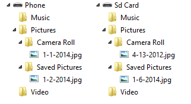

# Arquivos e pastas nas bibliotecas Música, Fotos e Vídeos


\[ Atualizado para aplicativos UWP no Windows 10. Para ler artigos sobre o Windows 8.x, consulte o [arquivo](http://go.microsoft.com/fwlink/p/?linkid=619132) \]


Adicione pastas existentes de música, fotos ou vídeos às bibliotecas correspondentes. Você também pode remover pastas de bibliotecas, obter a lista de pastas em uma biblioteca e descobrir fotos, músicas e vídeos armazenados.

Uma biblioteca é uma coleção virtual de pastas, que contém uma pasta conhecida por padrão, além de outras pastas que o usuário tiver adicionado à biblioteca usando seu aplicativo ou um dos aplicativos nativos. Por exemplo, a biblioteca Imagens inclui a pasta Imagens conhecida por padrão. O usuário pode adicionar pastas ou removê-las da biblioteca Imagens usando seu aplicativo ou o aplicativo Fotos nativo.

## Pré-requisitos


-   **Entender a programação assíncrona para aplicativos da Plataforma Universal do Windows (UWP)**

    Você pode aprender a escrever aplicativos assíncronos em C# ou Visual Basic, consulte [Chamar APIs assíncronas em C# ou Visual Basic](https://msdn.microsoft.com/library/windows/apps/mt187337). Para saber como escrever aplicativos assíncronos em C++, consulte [Programação assíncrona em C++](https://msdn.microsoft.com/library/windows/apps/mt187334).

-   **Acessar permissões ao local**

    No Visual Studio, abra o arquivo de manifesto do aplicativo no Designer de Manifesto. Na página **Recursos**, selecione as bibliotecas que seu aplicativo gerencia.

    -   **Biblioteca de Músicas**
    -   **Biblioteca de Imagens**
    -   **Biblioteca de Vídeos**

    Para saber mais, consulte [Permissões de acesso a arquivo](file-access-permissions.md).

## Obtenha uma referência a uma biblioteca


**Observação**  Lembre-se de declarar a funcionalidade apropriada.
 

Para obter uma referência à biblioteca Música, Imagens ou Vídeo do usuário, chame o método [**StorageLibrary.GetLibraryAsync**](https://msdn.microsoft.com/library/windows/apps/dn251725). Forneça o valor correspondente da enumeração [**KnownLibraryId**](https://msdn.microsoft.com/library/windows/apps/dn298399).

-   [**KnownLibraryId.Music**](https://msdn.microsoft.com/library/windows/apps/br227155)
-   [**KnownLibraryId.Pictures**](https://msdn.microsoft.com/library/windows/apps/br227156)
-   [**KnownLibraryId.Videos**](https://msdn.microsoft.com/library/windows/apps/br227159)

```CSharp
    var myPictures = await Windows.Storage.StorageLibrary.GetLibraryAsync
        (Windows.Storage.KnownLibraryId.Pictures);
```

## Obter a lista de pastas em uma biblioteca


Para obter a lista de pastas em uma biblioteca, obtenha o valor da propriedade [**StorageLibrary.Folders**](https://msdn.microsoft.com/library/windows/apps/dn251724).

```CSharp
    using Windows.Foundation.Collections;

    // ...
            
    IObservableVector<Windows.Storage.StorageFolder> myPictureFolders = myPictures.Folders;
```

## Obter a pasta em uma biblioteca onde os novos arquivos são salvos por padrão


Para obter a pasta em uma biblioteca onde os novos arquivos são salvos por padrão, obtenha o valor da propriedade [**StorageLibrary.SaveFolder**](https://msdn.microsoft.com/library/windows/apps/dn251728).

```CSharp
    Windows.Storage.StorageFolder savePicturesFolder = myPictures.SaveFolder;
```

## Adicionar uma pasta existente a uma biblioteca


Para adicionar uma pasta a uma biblioteca, chame [**StorageLibrary.RequestAddFolderAsync**](https://msdn.microsoft.com/library/windows/apps/dn251726). Considerando a biblioteca Imagens como um exemplo, chamar esse método faz com que um seletor de pasta seja mostrado para o usuário com um botão **Adicionar essa pasta a Imagens** . Se o usuário seleciona uma pasta, essa pasta permanecerá em seu local original no disco e se tornará um item na propriedade [**StorageLibrary.Folders**](https://msdn.microsoft.com/library/windows/apps/dn251724) (e no aplicativo Fotos nativo), mas a pasta não aparecerá como filho da pasta Imagens no Explorador de Arquivos.


```CSharp
    Windows.Storage.StorageFolder newFolder = await myPictures.RequestAddFolderAsync();
```

## Remover uma pasta de uma biblioteca


Para remover uma pasta de uma biblioteca, chame o método [**StorageLibrary.RequestRemoveFolderAsync**](https://msdn.microsoft.com/library/windows/apps/dn251727) e especifique a pasta a ser removida. Você pode usar [**StorageLibrary.Folders**](https://msdn.microsoft.com/library/windows/apps/dn251724) e um controle [**ListView**](https://msdn.microsoft.com/library/windows/apps/br242878) (ou semelhante) para o usuário selecionar uma pasta para remover.

Quando você chama [**StorageLibrary.RequestRemoveFolderAsync**](https://msdn.microsoft.com/library/windows/apps/dn251727), o usuário vê uma caixa de diálogo de confirmação dizendo que a pasta "não aparecerá mais em Imagens, mas não será excluída". Isso significa que a pasta permanece em seu local original no disco, é removida da propriedade [**StorageLibrary.Folders**](https://msdn.microsoft.com/library/windows/apps/dn251724) e não será mais incluída no aplicativo Fotos nativo.

O exemplo a seguir supõe que o usuário selecionou a pasta a ser removida em um [**ListView**](https://msdn.microsoft.com/library/windows/apps/br242878) controle chamado **lvPictureFolders**.


```CSharp
    bool result = await myPictures.RequestRemoveFolderAsync(folder);
```

## Receber notificações sobre mudanças na lista de pastas de uma biblioteca


Para ser notificado sobre mudanças na lista de pastas de uma biblioteca, registre um manipulador para o evento [**StorageLibrary.DefinitionChanged**](https://msdn.microsoft.com/library/windows/apps/dn251723) da biblioteca.


```CSharp
    myPictures.DefinitionChanged += MyPictures_DefinitionChanged;
    // ...

void HandleDefinitionChanged(Windows.Storage.StorageLibrary sender, object args)
{
    // ...
}
```

## Pastas de bibliotecas de mídia


Um dispositivo fornece cinco locais predefinidos para usuários e aplicativos armazenarem arquivos de mídia. Aplicativos internos armazenam mídia baixada e mídia criada por usuários nesses locais.

Os locais são:

-   Pasta **Imagens**. Contém imagens.

    -   Pasta **Imagens da Câmera**. Contém fotos e vídeo da câmera interna.

    -   Pasta **Imagens Salvas**. Contém imagens que o usuário salvou de outros aplicativos.

-   Pasta **Música**. Contém músicas, podcasts e áudio livros.

-   Pasta **Vídeo**. Contém vídeos.

Usuários e aplicativos também armazenam arquivos de mídia fora das pastas de bibliotecas de mídia no cartão SD. Para localizar um arquivo de mídia confiavelmente no cartão SD, examine o conteúdo do cartão SD ou solicite ao usuário que localize o arquivo usando um seletor de arquivos. Para saber mais, consulte [Acessar o cartão SD](access-the-sd-card.md).

## Consultando as bibliotecas de mídia


### Os resultados da consulta incluem armazenamento interno e removível

Os usuários podem escolher armazenar arquivos de forma padrão no cartão SD opcional. Os aplicativos, entretanto, podem optar por não permitir que os arquivos sejam armazenados no cartão SD. Com isso, as bibliotecas de mídia podem ficar divididas entre o armazenamento interno do dispositivo e o cartão SD.

Não é necessário gravar código adicional para ter essa possibilidade. Os métodos no namespace [**Windows.Storage**](https://msdn.microsoft.com/library/windows/apps/br227346) que consultam pastas conhecidas, combinam de forma transparente os resultados da consulta dos dois locais. Você também não precisa especificar o recurso **removableStorage** no arquivo de manifesto do aplicativo para obter esses resultados combinados.

Considere o estado do armazenamento do dispositivo mostrado na imagem a seguir:


Se você consultar o conteúdo da Biblioteca de imagens chamando o `await KnownFolders.PicturesLibrary.GetFilesAsync()`, os resultados incluem ambos, internalPic.jpg e SDPic.jpg.

### Consultas avançadas

Utilize as consultas avançadas para enumerar rapidamente todo o conteúdo de uma biblioteca de mídia.

As consultas avançadas retornam apenas os arquivos do tipo de mídia especificado. Por exemplo, se você consultar a Biblioteca de Músicas com uma consulta avançada, os resultados da consulta não incluirão nenhum arquivo de imagem encontrado pelo pesquisa na pasta Música.

Nos dispositivos em que a câmera salva imagens de baixa resolução e de alta resolução de cada imagem, as consultas avançadas retornam apenas a imagem de baixa resolução.

As Imagens da câmera e a pasta Imagens salvas não oferecem suporte a consultas avançadas.

As consultas avançadas a seguir estão disponíveis:

**Biblioteca de imagens**

-   `GetFilesAsync(CommonFileQuery.OrderByDate)`

**Biblioteca de música**

-   `GetFilesAsync(CommonFileQuery.OrderByName)`
-   `GetFoldersAsync(CommonFolderQuery.GroupByArtist)`
-   `GetFoldersAysnc(CommonFolderQuery.GroupByAlbum)`
-   `GetFoldersAysnc(CommonFolderQuery.GroupByAlbumArtist)`
-   `GetFoldersAsync(CommonFolderQuery.GroupByGenre)`

**Biblioteca de vídeo**

-   `GetFilesAsync(CommonFileQuery.OrderByDate)`

### Consultas simples

Para obter uma lista completa de todos os arquivos e pastas da biblioteca, chame `GetFilesAsync(CommonFileQuery.DefaultQuery)`. Este método retorna todos os arquivos na biblioteca, independentemente do tipo. Esta é uma consulta superficial, assim, você tem que enumerar os conteúdos das subpastas de forma repetitiva se o usuário tiver criado subpastas na biblioteca.

Use consultas simples para retornar arquivos de mídia dos tipos que não são reconhecidos pelas consultas internas, ou para retornar todos os arquivos em uma biblioteca, incluindo os que não são do tipo especificado. Por exemplo, se você consultar a Biblioteca de Músicas com uma consulta simples, os resultados da consulta incluirão quaisquer arquivos de imagem encontrados pelo pesquisa na pasta Música.

### Consultas de exemplo

Suponha que o dispositivo e seu cartão SD opcional contenham as pastas e os arquivos mostrados na imagem a seguir:



Estes são alguns exemplos de consultas e os resultados que retornam.

| Consulta | Resultados |
|--------------------------------------------------------------------------|-------------------------------------------------------------------------------------------------------|
| KnownFolders.PicturesLibrary.GetItemsAsync();  | - Pasta de Imagens da câmera do armazenamento interno <br>- Pasta de Imagens da câmera do cartão SD <br>- Pasta de Imagens salvas do armazenamento interno <br>- Pasta de Imagens salvas do cartão SD <br><br>Esta é uma consulta simples, assim, somente são retornados os resultados diretos da pasta Imagens. |
| KnownFolders.PicturesLibrary.GetFilesAsync();  | Nenhum resultado. <br><br>Esta é uma consulta simples e a pasta Imagens não contém quaisquer arquivos como resultados diretos. |
| KnownFolders.PicturesLibrary.GetFilesAsync(CommonFileQuery.OrderByDate); | - Arquivo 4-3-2012.jpg do cartão SD <br>- Arquivo 1-1-2014.jpg do armazenamento interno <br>- Arquivo 1-2-2014.jpg do armazenamento interno <br>- Arquivo 1-6-2014.jpg do cartão SD <br><br>Esta é uma consulta avançada, para que o conteúdo da pasta Imagens e suas pastas filho seja retornado. |
| KnownFolders.CameraRoll.GetFilesAsync(); | - Arquivo 1-1-2014.jpg do armazenamento interno <br>- Arquivo 4-3-2012.jpg do cartão SD <br><br>Trata-se de uma consulta simples. A ordenação dos resultados não é garantida. |

 
## Recursos da biblioteca de mídia e tipos de arquivos


Aqui estão os recursos que você pode especificar no arquivo de manifesto de aplicativo para acessar arquivos de mídia em seu aplicativo.

-   **Música**. Especifique o recurso **Biblioteca de Músicas** no arquivo de manifesto do aplicativo para permitir que seu aplicativo consulte e acesse arquivos dos seguintes tipos:

    -   .qcp
    -   .wav
    -   .mp3
    -   .m4r
    -   .m4a
    -   .aac
    -   .amr
    -   .wma
    -   .3g2
    -   .3gp
    -   .mp4
    -   .wm
    -   .asf
    -   .3gpp
    -   .3gp2
    -   .mpa
    -   .adt
    -   .adts
    -   .pya
-   **Fotos**. Especifique o recurso **Biblioteca de Imagens** no arquivo de manifesto do aplicativo para permitir que seu aplicativo consulte e acesse arquivos dos seguintes tipos:

    -   .jpeg
    -   .jpe
    -   .jpg
    -   .gif
    -   .tiff
    -   .tif
    -   .png
    -   .bmp
    -   .wdp
    -   .jxr
    -   .hdp
-   **Vídeos**. Especifique o recurso **Biblioteca de Vídeos** no arquivo de manifesto do aplicativo para permitir que seu aplicativo consulte e acesse arquivos dos seguintes tipos:

    -   .wm
    -   .m4v
    -   .wmv
    -   .asf
    -   .mov
    -   .mp4
    -   .3g2
    -   .3gp
    -   .mp4v
    -   .avi
    -   .pyv
    -   .3gpp
    -   .3gp2

## Trabalhando com fotos


Nos dispositivos em que a câmera salva imagens de baixa resolução e de alta resolução de cada imagem, as consultas avançadas retornam apenas a imagem de baixa resolução.

As Imagens da câmera e a pasta Imagens salvas não oferecem suporte a consultas avançadas.

**Abrir uma foto no aplicativo em que foi capturada**

Se quiser permitir que o usuário abra novamente uma foto no aplicativo em que foi capturada, você pode salvar a **CreatorAppId** com os metadados da foto usando um código similar ao exemplo seguinte. Neste exemplo, **testPhoto** é um [**StorageFile**](https://msdn.microsoft.com/library/windows/apps/br227171).

```CSharp
  IDictionary<string, object> propertiesToSave = new Dictionary<string, object>();

  propertiesToSave.Add("System.CreatorOpenWithUIOptions", 1);
  propertiesToSave.Add("System.CreatorAppId", appId);
 
  testPhoto.Properties.SavePropertiesAsync(propertiesToSave).AsyncWait();   
```

## Usar métodos de fluxo para adicionar um arquivo a uma biblioteca de mídia


Ao acessar uma biblioteca de mídia usando uma pasta conhecida, como a **KnownFolders.PictureLibrary**, e utilizar métodos de fluxo para adicionar um arquivo a uma biblioteca de mídia, você deve certificar-se de fechar todos os fluxos que seu código abre. Caso contrário, esses métodos falham ao adicionar um arquivo à biblioteca de mídia, pois ao menos uma transmissão ainda tem um identificador ao arquivo.

Como exemplo, ao executar o código a seguir, o arquivo não é adicionado à biblioteca de mídia. Na linha do código, `using (var destinationStream = (await destinationFile.OpenAsync(FileAccessMode.ReadWrite)).GetOutputStreamAt(0))`, os métodos **OpenAsync** e **GetOutputStreamAt** abrem um fluxo. No entanto, somente o fluxo aberto pelo método **GetOutputStreamAt** é descartada como um resultado da instrução **using**. O outro fluxo permanece aberto e impede que o arquivo seja salvo.

```CSharp
StorageFolder testFolder = await StorageFolder.GetFolderFromPathAsync(@"C:\test");
StorageFile sourceFile = await testFolder.GetFileAsync("TestImage.jpg");
StorageFile destinationFile = await KnownFolders.CameraRoll.CreateFileAsync("MyTestImage.jpg");
using (var sourceStream = (await sourceFile.OpenReadAsync()).GetInputStreamAt(0))
{
    using (var destinationStream = (await destinationFile.OpenAsync(FileAccessMode.ReadWrite)).GetOutputStreamAt(0))
    {
        await RandomAccessStream.CopyAndCloseAsync(sourceStream, destinationStream);
    }
}

```

Para usar métodos de transmissão com êxito ao adicionar um arquivo à biblioteca de mídia, certifique-se de fechar todos os fluxos abertos pelo seu código, como é mostrado no exemplo a seguir.

```CSharp
StorageFolder testFolder = await StorageFolder.GetFolderFromPathAsync(@"C:\test");
StorageFile sourceFile = await testFolder.GetFileAsync("TestImage.jpg");
StorageFile destinationFile = await KnownFolders.CameraRoll.CreateFileAsync("MyTestImage.jpg");

using (var sourceStream = await sourceFile.OpenReadAsync())
{
    using (var sourceInputStream = sourceStream.GetInputStreamAt(0))
    {
        using (var destinationStream = await destinationFile.OpenAsync(FileAccessMode.ReadWrite))
        {
            using (var destinationOutputStream = destinationStream.GetOutputStreamAt(0))
            {
                await RandomAccessStream.CopyAndCloseAsync(sourceInputStream, destinationStream);
            }
        }
    }
}
```

 

 


<!--HONumber=Jun16_HO4-->


