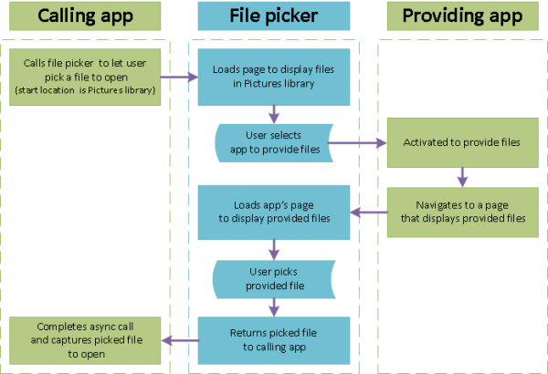

# <a name="open-files-and-folders-with-a-picker"></a>Abrir arquivos e pastas com um seletor

**APIs importantes**

-   [**FileOpenPicker**](https://docs.microsoft.com/uwp/api/Windows.Storage.Pickers.FileOpenPicker)
-   [**FolderPicker**](https://docs.microsoft.com/uwp/api/Windows.Storage.Pickers.FolderPicker)
-   [**StorageFile**](https://docs.microsoft.com/uwp/api/Windows.Storage.StorageFile)

Acesse arquivos e pastas permitindo que o usuário interaja com um seletor. É possível usar as classes [**FileOpenPicker**](https://docs.microsoft.com/uwp/api/Windows.Storage.Pickers.FileOpenPicker) e [**FileSavePicker**](https://docs.microsoft.com/uwp/api/Windows.Storage.Pickers.FileSavePicker) para obter acesso a arquivos e [**FolderPicker**](https://docs.microsoft.com/uwp/api/Windows.Storage.Pickers.FolderPicker) para obter acesso a uma pasta.

> [!NOTE]
> Para obter um exemplo completo, veja o [Exemplo de seletor de arquivos](https://github.com/Microsoft/Windows-universal-samples/tree/master/Samples/FilePicker).

## <a name="prerequisites"></a>Pré-requisitos


-   **Entender a programação assíncrona para aplicativos UWP (Plataforma Universal do Windows)**

    Você pode aprender a escrever aplicativos assíncronos em C# ou Visual Basic, consulte [Chamar APIs assíncronas em C# ou Visual Basic](https://docs.microsoft.com/windows/uwp/threading-async/call-asynchronous-apis-in-csharp-or-visual-basic). Para saber como escrever aplicativos assíncronos em C++, consulte [Programação assíncrona em C++](https://docs.microsoft.com/windows/uwp/threading-async/asynchronous-programming-in-cpp-universal-windows-platform-apps).

-   **Permissões de acesso ao local**

    Consulte [Permissões de acesso a arquivo](file-access-permissions.md).

## <a name="file-picker-ui"></a>Interface do usuário do seletor de arquivos


Um seletor de arquivos exibe informações para orientar os usuários e proporcionar uma experiência consistente durante a abertura ou a gravação de arquivos.

Essas informações incluem:

-   A localização atual
-   O item ou itens que o usuário selecionou
-   Uma árvore de locais em que o usuário pode navegar. Esses locais incluem os locais do sistema de arquivos — como a pasta Músicas ou Downloads — e aplicativos que implementam o contrato do seletor de arquivos (como Câmera, Fotos e Microsoft OneDrive).

Um aplicativo de email pode exibir um seletor de arquivos para que o usuário selecione anexos.


## <a name="how-pickers-work"></a>Como os seletores funcionam


Usando um seletor, o aplicativo pode acessar, procurar e salvar arquivos e pastas no sistema do usuário. Seu aplicativo recebe essas seleções como objetos [**StorageFile**](https://docs.microsoft.com/uwp/api/Windows.Storage.StorageFile) e [**StorageFolder**](https://docs.microsoft.com/uwp/api/Windows.Storage.StorageFolder), nos quais você pode operar em seguida.

O seletor usa uma única interface unificada para permitir que o usuário selecione arquivos e pastas no sistema de arquivos ou em outros aplicativos. Os arquivos selecionados a partir de outros aplicativos são como arquivos do sistema de arquivos: eles são retornados como objetos [**StorageFile**](https://docs.microsoft.com/uwp/api/Windows.Storage.StorageFile). Em geral, o aplicativo pode operar neles da mesma maneira que em outros objetos. Outros aplicativos tornam arquivos disponíveis ao participar de contratos do seletor de arquivos. Se quiser que o aplicativo forneça arquivos, um local de salvamento ou atualizações de arquivos para outros aplicativos, consulte [Integrando contratos de seletor de arquivos](https://docs.microsoft.com/previous-versions/windows/apps/hh465192(v=win.10)).

Por exemplo, você pode chamar o seletor de arquivos em seu aplicativo, dessa forma seu usuário poderá abrir um arquivo. Isso torna seu aplicativo o aplicativo de chamada. O seletor de arquivos interage com o sistema e/ou com outros aplicativos para permitir que o usuário navegue e selecione o arquivo. Quando o usuário escolhe um arquivo, o seletor de arquivos retorna esse arquivo para o seu aplicativo. Aqui está o processo caso em o usuário escolha um arquivo de um aplicativo fornecedor, como OneDrive.



## <a name="pick-a-single-file-complete-code-listing"></a>Selecionar um arquivo: preencher a listagem de códigos


```cs
var picker = new Windows.Storage.Pickers.FileOpenPicker();
picker.ViewMode = Windows.Storage.Pickers.PickerViewMode.Thumbnail;
picker.SuggestedStartLocation = Windows.Storage.Pickers.PickerLocationId.PicturesLibrary;
picker.FileTypeFilter.Add(".jpg");
picker.FileTypeFilter.Add(".jpeg");
picker.FileTypeFilter.Add(".png");

Windows.Storage.StorageFile file = await picker.PickSingleFileAsync();
if (file != null)
{
    // Application now has read/write access to the picked file
    this.textBlock.Text = "Picked photo: " + file.Name;
}
else
{
    this.textBlock.Text = "Operation cancelled.";
}
```

## <a name="pick-a-single-file-step-by-step"></a>Selecionar um único arquivo: passo a passo


Usar um seletor de arquivos envolve criar e personalizar um objeto de seletor de arquivos e mostrar o seletor de arquivos para que o usuário possa selecionar um item ou mais itens.

1.  **Criar e personalizar um FileOpenPicker**

    ```cs
    var picker = new Windows.Storage.Pickers.FileOpenPicker();
    picker.ViewMode = Windows.Storage.Pickers.PickerViewMode.Thumbnail;
    picker.SuggestedStartLocation = Windows.Storage.Pickers.PickerLocationId.PicturesLibrary;
    picker.FileTypeFilter.Add(".jpg");
    picker.FileTypeFilter.Add(".jpeg");
    picker.FileTypeFilter.Add(".png");
    ```
    Defina propriedades no objeto do seletor de arquivos relevantes para os usuários e o aplicativo.

    Este exemplo cria uma exibição visual de qualidade das imagens em um local conveniente que o usuário pode escolher configurando três propriedades: [**ViewMode**](https://docs.microsoft.com/uwp/api/windows.storage.pickers.fileopenpicker.viewmode), [**SuggestedStartLocation**](https://docs.microsoft.com/uwp/api/windows.storage.pickers.fileopenpicker.suggestedstartlocation) e [**FileTypeFilter**](https://docs.microsoft.com/uwp/api/windows.storage.pickers.fileopenpicker.filetypefilter).

    -   A configuração de [**ViewMode**](https://docs.microsoft.com/uwp/api/windows.storage.pickers.fileopenpicker.viewmode) como o valor de enumeração [**PickerViewMode**](https://docs.microsoft.com/uwp/api/Windows.Storage.Pickers.PickerViewMode) **Thumbnail** cria uma exibição visual de qualidade usando miniaturas de imagem para representar arquivos no seletor de arquivos. Faça isso para selecionar arquivos visuais, como imagens ou vídeos. Caso contrário, use [**PickerViewMode.List**](https://docs.microsoft.com/uwp/api/Windows.Storage.Pickers.PickerViewMode). Um aplicativo de email hipotético com os recursos **Anexar Foto ou Vídeo** e **Anexar Documento** configuraria o **ViewMode** apropriado para o recurso antes de mostrar o seletor de arquivos.

    -   Configurar [**SuggestedStartLocation**](https://docs.microsoft.com/uwp/api/windows.storage.pickers.fileopenpicker.suggestedstartlocation) para Imagens usando [**PickerLocationId.PicturesLibrary**](https://docs.microsoft.com/uwp/api/Windows.Storage.Pickers.PickerLocationId) permite que o usuário inicie em um local onde provavelmente encontrará imagens. Configure **SuggestedStartLocation** para um local apropriado para o tipo de arquivo selecionado, como Música, Imagens, Vídeos ou Documentos. A partir do local inicial, o usuário pode navegar para outros locais.

    -   Usar [**FileTypeFilter**](https://docs.microsoft.com/uwp/api/windows.storage.pickers.fileopenpicker.filetypefilter) para especificar tipos de arquivos mantém o usuário focado na seleção dos arquivos relevantes. Para substituir os tipos de arquivos anteriores no **FileTypeFilter** por novas entradas, use [**ReplaceAll**](https://docs.microsoft.com/uwp/api/windows.storage.pickers.fileextensionvector.replaceall) em vez de [**Add**](https://docs.microsoft.com/uwp/api/windows.storage.pickers.fileextensionvector.append).

2.  **Mostrar o FileOpenPicker**

    - **Para selecionar um único arquivo**

        ```cs
        Windows.Storage.StorageFile file = await picker.PickSingleFileAsync();
        if (file != null)
        {
            // Application now has read/write access to the picked file
            this.textBlock.Text = "Picked photo: " + file.Name;
        }
        else
        {
            this.textBlock.Text = "Operation cancelled.";
        }
        ```

    - **Para selecionar vários arquivos**  

        ```cs
        var files = await picker.PickMultipleFilesAsync();
        if (files.Count > 0)
        {
            StringBuilder output = new StringBuilder("Picked files:\n");
    
            // Application now has read/write access to the picked file(s)
            foreach (Windows.Storage.StorageFile file in files)
            {
                output.Append(file.Name + "\n");
            }
            this.textBlock.Text = output.ToString();
        }
        else
        {
            this.textBlock.Text = "Operation cancelled.";
        }
        ```

## <a name="pick-a-folder-complete-code-listing"></a>Selecionar uma pasta: preencher a listagem de códigos


```cs
var folderPicker = new Windows.Storage.Pickers.FolderPicker();
folderPicker.SuggestedStartLocation = Windows.Storage.Pickers.PickerLocationId.Desktop;
folderPicker.FileTypeFilter.Add("*");

Windows.Storage.StorageFolder folder = await folderPicker.PickSingleFolderAsync();
if (folder != null)
{
    // Application now has read/write access to all contents in the picked folder
    // (including other sub-folder contents)
    Windows.Storage.AccessCache.StorageApplicationPermissions.
    FutureAccessList.AddOrReplace("PickedFolderToken", folder);
    this.textBlock.Text = "Picked folder: " + folder.Name;
}
else
{
    this.textBlock.Text = "Operation cancelled.";
}
```

> [!TIP]
> Sempre que o aplicativo acessar um arquivo ou uma pasta por meio de um seletor, adicione-o a [**FutureAccessList**](https://docs.microsoft.com/uwp/api/windows.storage.accesscache.storageapplicationpermissions.futureaccesslist) ou [**MostRecentlyUsedList**](https://docs.microsoft.com/uwp/api/windows.storage.accesscache.storageapplicationpermissions.mostrecentlyusedlist) do seu aplicativo para rastreá-lo. Você pode saber mais sobre o uso dessas listas em [Como rastrear arquivos e pastas usados recentemente](how-to-track-recently-used-files-and-folders.md).