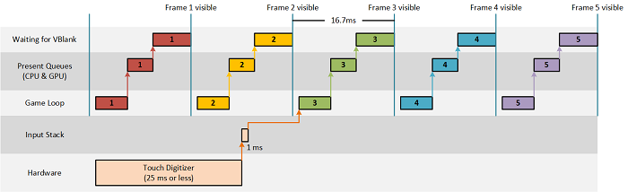

#  <a name="optimize-input-latency-for-universal-windows-platform-uwp-directx-games"></a>Otimizar a latência de entrada para jogos em DirectX da Plataforma Universal do Windows (UWP)


A latência de entrada pode afetar significativamente a experiência de um jogo, e a sua otimização pode tornar um jogo mais bem acabado. Além disso, a otimização adequada dos eventos de entrada pode aumentar a vida útil da bateria. Aprenda como escolher as opções de processamento de evento de entrada CoreDispatcher certas para garantir que seu jogo manipule a entrada o mais fluidamente possível.

## <a name="input-latency"></a>Latência de entrada


Latência de entrada é o tempo que o sistema demora para responder à entrada do usuário. A resposta geralmente é uma mudança no que é exibido na tela ou o que é ouvido pelo comentário de áudio.

Cada evento de entrada, seja ele um ponteiro sensível ao toque, um ponteiro do mouse ou um teclado, gera uma mensagem a ser processada por um manipulador de eventos. Digitalizadores de toque e periféricos de jogo modernos reportam os eventos de entrada a um mínimo de 100 Hz por ponteiro, o que significa que os aplicativos podem receber 100 eventos ou mais por segundo por ponteiro (ou pressionamento de tecla). Essa taxa de atualizações é amplificada se vários ponteiros estiverem acontecendo concorrentemente ou se um dispositivo de entrada de precisão mais elevada for usado (por exemplo, um mouse para jogos). A fila de mensagens de eventos pode ser preenchida muito rapidamente.

É importante entender que as exigências de latência de entrada de seu jogo, para que os eventos sejam processados da melhor maneira para a situação. Não há uma única solução para todos os jogos.

## <a name="power-efficiency"></a>Eficiência de energia


No contexto da latência de entrada, "eficiência de energia" refere-se a como um jogo usa a GPU. Um jogo que usa menos recursos de GPU é mais eficiente energeticamente e proporciona uma duração da bateria mais longa. Isso também é válido para a CPU.

Se um jogo pode desenhar a tela inteira em menos de 60 quadros por segundo (atualmente, a velocidade máxima de renderização na maioria das exibições) sem diminuir a experiência do usuário, o consumo de energia será menor se ele desenhar com menos frequência. Alguns jogos atualizam a tela apenas em resposta à entrada do usuário, portanto esses jogos não devem desenhar o mesmo conteúdo várias vezes em 60 quadros por segundo.

## <a name="choosing-what-to-optimize-for"></a>Escolhendo o que otimizar


Ao projetar um aplicativo DirectX, você precisa fazer algumas escolhas. O aplicativo precisa renderizar 60 quadros por segundo para apresentar animação suave ou ele precisa renderizar apenas em resposta à entrada? Ele precisa ter a mais baixa latência de entrada possível ou pode tolerar um pouco de atraso? Meus usuários esperarão que meu aplicativo seja prudente sobre o uso de bateria?

As respostas a estas perguntas provavelmente alinharão seu aplicativo com um dos seguintes cenários:

1.  Renderizar sob demanda. Jogos nesta categoria somente precisam atualizar a tela em resposta a tipos específicos de entrada. A eficiência de energia é excelente porque o aplicativo não renderiza quadros idênticos repetidamente e a latência de entrada é baixa porque o aplicativo passa a maior parte de seu tempo esperando a entrada. Os jogos de tabuleiro e leitores de notícias são exemplos de aplicativos que podem estar nessa categoria.
2.  Renderizar sob demanda com animações transitórias. Este cenário é idêntico ao primeiro cenário, exceto pelo fato de que certos tipos de entrada iniciarão uma animação que não é dependente da entrada subsequente do usuário. A eficiência de energia é boa porque o jogo não renderiza quadros idênticos repetidamente e a latência de entrada é baixa, enquanto o jogo não está animando. Jogos infantis interativos e jogos de tabuleiro que animam cada movimento são exemplos de aplicativos que podem estar nessa categoria.
3.  Renderizar 60 quadros por segundo. Nessa situação, o jogo atualiza constantemente a tela. A eficiência de energia é fraca porque renderiza o número máximo de quadros que a tela pode apresentar. A latência de entrada é alta porque o DirectX bloqueia o thread enquanto o conteúdo está sendo apresentado. Isso impede que o thread envie mais quadros para a tela do que ela pode exibir para o usuário. Os jogos de tiro em primeira pessoa, os jogos de estratégia em tempo real e os jogos baseados na física são exemplos de aplicativos que podem estar nessa categoria.
4.  Renderizar 60 quadros por segundo e atingir a mais baixa latência possível de entrada. Semelhante ao cenário 3, o aplicativo está constantemente atualizando a tela, de modo a eficiência de energia será fraca. A diferença é que o jogo responde à entrada em um thread separado, para que o processamento da entrada não seja bloqueado ao apresentar os gráficos para exibição. Jogos multijogador online, jogos de luta ou jogos de ritmo/timing podem se encaixar nessa categoria, pois oferecem suporte para entradas de movimento em janelas de evento extremamente apertadas.

## <a name="implementation"></a>Implementação


A maioria dos jogos em DirectX é direcionada pelo conhecido loop de jogos. O algoritmo básico é para executar estas etapas até o usuário sair do jogo ou do aplicativo:

1.  Processar a entrada
2.  Atualizar o estado do jogo
3.  Desenhar o conteúdo do jogo

Quando o conteúdo de um jogo do DirectX é renderizado e está pronto para ser apresentado na tela, o loop de jogos aguarda até a GPU estar pronta para receber um novo quadro antes de ativar para processar a entrada novamente.

Mostraremos a implementação do loop de jogos para cada um dos cenários mencionados anteriormente pela iteração de um simples quebra-cabeça. Os pontos de decisão, os benefícios e as compensações abordadas em cada implementação podem servir como um guia para ajudá-lo a otimizar seus aplicativos para a entrada de baixa latência e a eficiência de energia.

## <a name="scenario-1-render-on-demand"></a>Cenário 1: Renderizar sob demanda


A primeira iteração do jogo de quebra-cabeça apenas atualiza a tela quando um usuário move uma peça do quebra-cabeça. Um usuário pode arrastar uma peça do quebra-cabeça ou encaixá-la no lugar selecionando-a e depois tocando no destino correto. No segundo caso, a peça pulará para o destino sem nenhuma animação ou efeito.

O código tem um loop de jogo de thread único dentro do método [**IFrameworkView::Run**](https://msdn.microsoft.com/library/windows/apps/hh700505) que usa **CoreProcessEventsOption::ProcessOneAndAllPending**. Usar essa opção despacha todos os eventos atualmente disponíveis na fila. Se nenhum evento estiver pendente, o loop de jogos aguarda até um aparecer.

``` syntax
void App::Run()
{
    
    while (!m_windowClosed)
    {
        // Wait for system events or input from the user.
        // ProcessOneAndAllPending will block the thread until events appear and are processed.
        CoreWindow::GetForCurrentThread()->Dispatcher->ProcessEvents(CoreProcessEventsOption::ProcessOneAndAllPending);

        // If any of the events processed resulted in a need to redraw the window contents, then we will re-render the
        // scene and present it to the display.
        if (m_updateWindow || m_state->StateChanged())
        {
            m_main->Render();
            m_deviceResources->Present();

            m_updateWindow = false;
            m_state->Validate();
        }
    }
}
```

## <a name="scenario-2-render-on-demand-with-transient-animations"></a>Cenário 2: Renderizar sob demanda com animações transitórias


Na segunda iteração, o jogo é modificado para que quando um usuário selecionar uma peça do quebra-cabeça e, em seguida, tocar no destino correto para essa peça, uma animação seja exibida na tela até a peça chegar a seu destino.

Como antes, o código tem um loop de jogo de thread único que usa **ProcessOneAndAllPending** para despachar os eventos de entrada na fila. Agora, a diferença é que, durante a animação, o loop muda para usar **CoreProcessEventsOption::ProcessAllIfPresent**, de modo que ele não fica esperando para novos eventos de entrada. Se não houver eventos pendentes, [**ProcessEvents**](https://msdn.microsoft.com/library/windows/apps/br208215) retorna imediatamente e permite que o aplicativo apresente o próximo quadro na animação. Quando a animação está completa, o loop volta para **ProcessOneAndAllPending**, para limitar as atualizações de tela.

``` syntax
void App::Run()
{

    while (!m_windowClosed)
    {
        // 2. Switch to a continuous rendering loop during the animation.
        if (m_state->Animating())
        {
            // Process any system events or input from the user that is currently queued.
            // ProcessAllIfPresent will not block the thread to wait for events. This is the desired behavior when
            // you are trying to present a smooth animation to the user.
            CoreWindow::GetForCurrentThread()->Dispatcher->ProcessEvents(CoreProcessEventsOption::ProcessAllIfPresent);

            m_state->Update();
            m_main->Render();
            m_deviceResources->Present();
        }
        else
        {
            // Wait for system events or input from the user.
            // ProcessOneAndAllPending will block the thread until events appear and are processed.
            CoreWindow::GetForCurrentThread()->Dispatcher->ProcessEvents(CoreProcessEventsOption::ProcessOneAndAllPending);

            // If any of the events processed resulted in a need to redraw the window contents, then we will re-render the
            // scene and present it to the display.
            if (m_updateWindow || m_state->StateChanged())
            {
                m_main->Render();
                m_deviceResources->Present();

                m_updateWindow = false;
                m_state->Validate();
            }
        }
    }
}
```

Para dar suporte à transição entre **ProcessOneAndAllPending** e **ProcessAllIfPresent**, o aplicativo deve rastrear o estado para saber se está animando. No aplicativo de quebra-cabeça, você faz isso adicionando um novo método que pode ser chamado durante o loop de jogo na classe GameState. A ramificação de animação no loop de jogos direciona atualizações no estado da animação chamando o novo método Update de GameState.

## <a name="scenario-3-render-60-frames-per-second"></a>Cenário 3: Renderizar 60 quadros por segundo


Na terceira iteração, o aplicativo exibe um temporizador que mostra ao usuário quanto tempo ele está trabalhando no quebra-cabeça. Como ele exibe o tempo decorrido até o milissegundo, deve renderizar 60 quadros por segundo para manter a exibição atualizada.

Como nos cenários 1 e 2, o aplicativo tem um loop de jogos com thread único. A diferença nessa situação é porque ele está sempre renderizando, não é mais necessário rastrear as alterações no estado de jogo como foi feito nas duas primeiras situações. Como resultado, pode deixar de usar **ProcessAllIfPresent** para processar eventos. Se não houver eventos pendentes, **ProcessEvents** retorna imediatamente e continua renderizando o próximo quadro.

``` syntax
void App::Run()
{

    while (!m_windowClosed)
    {
        if (m_windowVisible)
        {
            // 3. Continuously render frames and process system events and input as they appear in the queue.
            // ProcessAllIfPresent will not block the thread to wait for events. This is the desired behavior when
            // trying to present smooth animations to the user.
            CoreWindow::GetForCurrentThread()->Dispatcher->ProcessEvents(CoreProcessEventsOption::ProcessAllIfPresent);

            m_state->Update();
            m_main->Render();
            m_deviceResources->Present();
        }
        else
        {
            // 3. If the window isn't visible, there is no need to continuously render.
            // Process events as they appear until the window becomes visible again.
            CoreWindow::GetForCurrentThread()->Dispatcher->ProcessEvents(CoreProcessEventsOption::ProcessOneAndAllPending);
        }
    }
}
```

Esse método é a maneira mais fácil de gravar um jogo, pois não há necessidade de controlar o estado adicional para determinar quando renderizar. Ele atinge a mais rápida renderização possível, juntamente com a capacidade de resposta de entrada razoável em um intervalo do temporizador.

No entanto, essa facilidade de desenvolvimento tem um preço. A renderização a 60 quadros por segundo usa mais energia do que a renderização por demanda. É melhor usar **ProcessAllIfPresent** quando o jogo muda o que está sendo exibido a cada quadro. Isso também aumenta a latência de entrada em até 16,7 ms, porque o aplicativo agora bloqueia o loop de jogo no intervalo de sincronia da exibição em vez de no **ProcessEvents**. Alguns eventos de entrada podem ser reduzidos, porque a fila é processada apenas uma vez por quadro (60 Hz).

## <a name="scenario-4-render-60-frames-per-second-and-achieve-the-lowest-possible-input-latency"></a>Cenário 4: Renderizar 60 quadros por segundo e atingir a mais baixa latência possível de entrada


Alguns jogos podem conseguir ignorar ou compensar o aumento na latência de entrada observada no cenário 3. No entanto, se a baixa latência de entrada for crítica para a experiência do jogo e para a detecção dos comentários do jogador, os jogos que renderizam 60 quadros por segundo precisam processar a entrada em um thread separado.

A quarta iteração do jogo de quebra-cabeça cria o cenário 3 dividindo o processamento de entrada e a renderização de gráficos do loop de jogos para os threads separados. Ter threads separados para cada um garante que a entrada nunca seja atrasada pela saída de elementos gráficos; entretanto, o código se torna mais complexo como resultado. Na situação 4, o thread de entrada chama [**ProcessEvents**](https://msdn.microsoft.com/library/windows/apps/br208215) com [**CoreProcessEventsOption::ProcessUntilQuit**](https://msdn.microsoft.com/library/windows/apps/br208217), que espera por novos eventos e despacha todos os eventos disponíveis. Esse comportamento continua até a janela ser fechada ou o jogo chamar [**CoreWindow::Close**](https://msdn.microsoft.com/library/windows/apps/br208260).

``` syntax
void App::Run()
{
    // 4. Start a thread dedicated to rendering and dedicate the UI thread to input processing.
    m_main->StartRenderThread();

    // ProcessUntilQuit will block the thread and process events as they appear until the App terminates.
    CoreWindow::GetForCurrentThread()->Dispatcher->ProcessEvents(CoreProcessEventsOption::ProcessUntilQuit);
}

void JigsawPuzzleMain::StartRenderThread()
{
    // If the render thread is already running, then do not start another one.
    if (IsRendering())
    {
        return;
    }

    // Create a task that will be run on a background thread.
    auto workItemHandler = ref new WorkItemHandler([this](IAsyncAction^ action)
    {
        // Notify the swap chain that this app intends to render each frame faster
        // than the display's vertical refresh rate (typically 60 Hz). Apps that cannot
        // deliver frames this quickly should set this to 2.
        m_deviceResources->SetMaximumFrameLatency(1);

        // Calculate the updated frame and render once per vertical blanking interval.
        while (action->Status == AsyncStatus::Started)
        {
            // Execute any work items that have been queued by the input thread.
            ProcessPendingWork();

            // Take a snapshot of the current game state. This allows the renderers to work with a
            // set of values that won't be changed while the input thread continues to process events.
            m_state->SnapState();

            m_sceneRenderer->Render();
            m_deviceResources->Present();
        }

        // Ensure that all pending work items have been processed before terminating the thread.
        ProcessPendingWork();
    });

    // Run the task on a dedicated high priority background thread.
    m_renderLoopWorker = ThreadPool::RunAsync(workItemHandler, WorkItemPriority::High, WorkItemOptions::TimeSliced);
}
```

O modelo de **aplicativo XAML (Universal Windows) DirectX 11 e** no Microsoft Visual Studio2015 separa o loop de jogo em vários threads de modo semelhante. Ele usa o objeto [**Windows::UI::Core::CoreIndependentInputSource**](https://msdn.microsoft.com/library/windows/apps/dn298460) para iniciar um thread dedicado a manipular a entrada e também cria um thread de renderização independente do thread de interface do usuário XAML. Para obter mais detalhes sobre esses modelos, leia [Create a Universal Windows Platform and DirectX game project from a template](user-interface.md).

## <a name="additional-ways-to-reduce-input-latency"></a>Maneiras adicionais de reduzir a latência de entrada


### <a name="use-waitable-swap-chains"></a>Use cadeias de troca de espera

Os jogos em DirectX respondem à entrada do usuário atualizando o que o usuário vê na tela. Em um monitor de 60 Hz, a tela atualiza a cada 16,7 ms (1 segundo/60 quadros). A Figura 1 mostra o ciclo de vida útil aproximado e a resposta a um evento de entrada relativo ao sinal de atualização de 16,7 ms (VBlank) para um aplicativo que renderiza 60 quadros por segundo:

Figura 1


No Windows 8.1, DXGI introduziu o sinalizador **DXGI\_SWAP\_CHAIN\_FLAG\_FRAME\_LATENCY\_WAITABLE\_OBJECT** para a cadeia de troca, que permite que os aplicativos reduzam essa latência sem exigir que implementem heurísticas para manter a fila presente vazia. As cadeias de troca criadas com esse sinalizador são referidas como cadeias de troca de espera. A Figura 2 mostra o ciclo de vida aproximado e a resposta a um evento de entrada ao usar cadeias de troca de espera:

Figura 2



O que vemos nesses diagramas é que os jogos têm o potencial de reduzir a latência de entrada em dois quadros de forem capazes de renderizar e apresentar cada quadro dentro do orçamento de 16,7 ms definido pela taxa de atualização do visor. O exemplo do quebra-cabeça usa cadeias de troca esperáveis e controla o limite da fila Presente chamando:` m_deviceResources->SetMaximumFrameLatency(1);`

 

 


