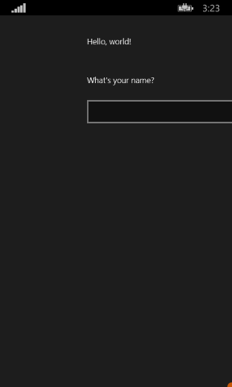

# Criar um aplicativo "hello world" em C++ (Windows 10)

Com o Microsoft Visual Studio 2015, você pode usar C++ para desenvolver um aplicativo que é executado no Windows 10, inclusive em telefones que executam o Windows 10. Esses aplicativos têm uma interface do usuário definida em linguagem XAML.

Para desenvolver um aplicativo que seja executado no Windows 8.1 e no Windows Phone 8.1, use o Microsoft Visual Studio 2013 Atualização 3 ou posterior e siga as etapas descritas [aqui](https://msdn.microsoft.com/library/windows/apps/Dn263168). A diferença mais significativa é que, para Windows 8.1 e Windows Phone 8.1, você usa uma solução com três projetos, um para a área de trabalho (ou dispositivo tablet), um para o telefone e outro para o código compartilhado. Para o desenvolvimento do Windows 10, todo o código compartilha o mesmo projeto.

Para tutoriais em outras linguagens de programação, consulte:

-   [Crie seu primeiro aplicativo da Windows Store em JavaScript](https://msdn.microsoft.com/library/windows/apps/BR211385)

-   [Crie seu primeiro aplicativo da Windows Store em C# ou Visual Basic](https://msdn.microsoft.com/library/windows/apps/Hh974581)

## Antes de começar...

-   Para concluir este tutorial, você deve usar o Visual Studio2015 Community ou posterior, ou uma das versões que não seja Community do Visual Studio 2015, em um computador que executa o Windows 10 ou o Windows 8.1. Para baixá-los, veja [Obter as ferramentas](http://go.microsoft.com/fwlink/p/?LinkId=532666).
-   Instale o [SDK](http://go.microsoft.com/fwlink/?LinkId=533049) adequado para desenvolvimento da Plataforma Universal do Windows.
-   Pressupomos que você tem uma compreensão básica de C++ padrão, XAML e dos conceitos apresentados na [Visão geral de XAML](https://msdn.microsoft.com/library/windows/apps/Mt185595).
-   Pressupomos que você esteja usando o layout de janela padrão no Visual Studio. Para redefinir o layout padrão, na barra de menus, escolha **Janela** > **Redefinir Layout da Janela**.
-   Há um problema conhecido no Visual Studio 2015 que pode resultar em um NullReferenceException durante o carregamento do designer XAML. Esse problema impede algumas das etapas deste tutorial, a menos que você aplique a solução alternativa. Para obter detalhes sobre esse problema e a solução alternativa, consulte [esta postagem no fórum MSDN](http://go.microsoft.com/fwlink/p/?LinkId=624036).

## Comparando aplicativos da área de trabalho em C++ com aplicativos do Windows

Se você tiver experiência em programação da área de trabalho do Windows em C++, provavelmente alguns aspectos da programação de aplicativos da Windows Store e do Windows Phone parecerão familiares, mas outros exigirão algum aprendizado.

### O que é igual?

-   Você pode usar a STL, a CRT (com algumas exceções) e qualquer outra biblioteca C++, enquanto o código não tentar chamar as funções do Windows que não são acessíveis a partir do ambiente do Windows Runtime.

-   Se você estiver acostumado a designers visuais, ainda é possível usar o designer incorporado ao Microsoft Visual Studio ou o Blend for Visual Studio mais completo. Se estiver acostumado a codificar interfaces do usuário manualmente, poderá escrever código XAML dessa forma.

-   Você continuará criando aplicativos que usam tipos de sistemas operacionais Windows e seus próprios tipos personalizados.

-   Você continuará usando o depurador e o criador de perfil do Visual Studio e outras ferramentas de desenvolvimento.

-   Você continuará criando aplicativos compilados para código de máquina nativo pelo compilador do Visual C++. Os aplicativos da Windows Store em C++ não são executados em um ambiente de tempo de execução gerenciado.

### Quais são as novidades?

-   Os princípios de design para aplicativos da Windows Store e Aplicativos Universais do Windows são muito diferentes daqueles para os aplicativos de área de trabalho. Bordas de janela, rótulos, caixas de diálogo etc. não são o foco principal. O mais importante é o conteúdo. Os excelentes Aplicativos Universais do Windows incorporam esses princípios desde o começo da fase de planejamento.

-   Você usa XAML para definir toda a IU. A separação entre a IU e a lógica principal do programa fica muito mais clara em um Aplicativo Universal do Windows do que em um aplicativo MFC ou Win32. Outras pessoas podem trabalhar na aparência da IU no arquivo XAML enquanto você trabalha no comportamento, no arquivo de código.

-   Você está basicamente programando em uma nova API fácil de navegar e orientada a objetos, o Windows Runtime, embora o Win32 de dispositivos Windows ainda esteja disponível para certas funcionalidades.

-   Use o C++/CX para consumir e criar objetos do Windows Runtime. O C++/CX permite a manipulação de exceções C++, representantes, eventos e contagem de referências automática de objetos criados dinamicamente. Quando você usa C++/CX, os detalhes da arquitetura COM subjacente e do Windows permanecem ocultos no código do aplicativo. Para saber mais, veja [Referência da linguagem C++/CX](https://msdn.microsoft.com/library/windows/apps/hh699871.aspx).

-   O aplicativo é compilado em um pacote que também contém metadados sobre os tipos contidos no aplicativo, os recursos que ele usa e os recursos que ele exige (acesso a arquivos, à Internet, à câmera e assim por diante).

-   Na Windows Store e no Windows Phone, o aplicativo é verificado como seguro por um processo de certificação e se torna disponível para milhões de clientes em potencial.

## Aplicativo Hello World da Store em C++

Nosso primeiro aplicativo é um "Hello World" que demonstra alguns recursos básicos de interatividade, layout e estilos. Vamos criar um aplicativo com base no modelo de projeto de Aplicativo Universal do Windows. Se você já desenvolveu aplicativos para Windows 8.1 e Windows Phone 8.1, deve se lembrar de que foram necessários três projetos no Visual Studio, um para o aplicativo do Windows, um para o aplicativo do telefone e outro com código compartilhado. A Plataforma Universal do Windows (UWP) do Windows 10 torna possível ter apenas um projeto, que é executado em todos os dispositivos, inclusive computadores desktop e laptop com Windows 10, dispositivos como tablets, telefones celulares etc.

Começaremos com os conceitos básicos:

-   Como criar um projeto Universal Windows no Visual Studio 2015 ou posterior.

-   Como entender os projetos e arquivos criados.

-   Como entender as extensões nas extensões de componentes do VisualC++ (C++/CX) e quando usá-las.

**Primeiro, crie uma solução no Visual Studio**

1.  No Visual Studio, na barra de menus, selecione **Arquivo** > **Novo** > **Projeto**.

2.  Na caixa de diálogo **Novo Projeto**, no painel esquerdo, expanda **Instalado** > **Visual C++** > **Windows** > **Universal**.

3.  No painel central, selecione **Aplicativo em Branco (Universal Windows)**.

   (Se você não vir essas opções, verifique se tem as ferramentas de desenvolvimento de aplicativo Universal do Windows instaladas. Consulte [Prepare-se para começar](get-set-up.md) para saber mais.)

4.  Insira um nome para o projeto. Vamos chamá-lo de HelloWorld.

 

5.  Escolha o botão **OK**.

   Se esse for o primeiro projeto UWP que você criou, e você ainda não tiver habilitado o modo de desenvolvedor em seu computador, a caixa de diálogo Habilitar Desenvolvedor será exibida. Clique no link para exibir a página de configurações que permite definir o modo de desenvolvedor. O Modo de Desenvolvedor permite que seus aplicativos sejam implantados e executados localmente.

   Os arquivos do seu projeto são criados.

Antes de continuar, vamos examinar o que compõe a solução.


### Sobre os arquivos do projeto

Cada arquivo .xaml em uma pasta de projeto tem um arquivo .xaml.h e .xaml.cpp correspondente na mesma pasta e um arquivo .g e .g.hpp na pasta Arquivos Gerados, que está no disco, mas não faz parte do projeto. Você pode modificar os arquivos XAML para criar elementos de interface do usuário e conectá-los a fontes de dados (DataBinding). Você modificar os arquivos .h e .cpp para adicionar lógica personalizada a manipuladores de eventos. Os arquivos gerados automaticamente representam a transformação da marcação de XAML em C++. Não modifique esses arquivos, mas os estude para entender melhor como funciona o code-behind. Basicamente, o arquivo gerado contém uma definição de classe parcial para um elemento raiz XAML. Essa classe é a mesma classe que você modifica nos arquivos \*.xaml.h e .cpp. Os arquivos gerados declaram os elementos filhos da interface do usuário XAML como membros da classe para que você possa fazer referência a eles no código que você escreve. No momento da compilação, o código gerado e seu código são mesclados em uma definição de classe completa e, em seguida, compilados.

Primeiro, vamos examinar os arquivos de projeto.

-   
              **App.xaml, App.xaml.h, App.xaml.cpp:** representam o objeto do aplicativo, que é o ponto de entrada de um aplicativo. O App.xaml não contém uma marcação de interface do usuário específica, mas você pode adicionar estilos de interface do usuário e outros elementos que quer que sejam acessíveis de qualquer página. Os arquivos code-behind contém manipuladores para os eventos **OnLaunched** e **OnSuspending**. Normalmente, você adiciona o código personalizado aqui para inicializar o aplicativo quando ele iniciar e executar a limpeza quando ele for suspenso ou encerrado.
-   
              **MainPage.xaml, MainPage.xaml.h, MainPage.xaml.cpp:**contêm uma marcação XAML e code-behind para a página "inicial" padrão em um aplicativo. Ele não possui suporte para navegação ou controles internos.
-   
              **pch.h, pch.cpp:** um arquivo de cabeçalho pré-compilado e o arquivo que o inclui no seu projeto. No pch.h, você pode incluir quaisquer cabeçalhos que não mudam com frequência e estão incluídos em outros arquivos na solução.
-   
              **Package.appxmanifest:** um arquivo XML que descreve os recursos do dispositivo que seu aplicativo requer, bem como a informação de versão do aplicativos e outros metadados. Para abrir esse arquivo no **Criador de Manifestos**, basta clicar duas vezes nele.
-   
              **HelloWorld\_TemporaryKey.pfx:**uma chave que permite a implementação do aplicativo nessa máquina, por meio do Visual Studio.

## Primeira análise do código

Se você examinar o código em App.xaml.h, App.xaml.cpp no projeto compartilhado, você observará que a maior parte do código está em C++ e parece familiar. No entanto, alguns elementos de sintaxe podem não ser muito familiares se você for iniciante nos aplicativos do Windows Runtime ou se tiver trabalhado com C++/CLI. Aqui estão os elementos de sintaxe não padrão mais comuns que você verá em C++/CX:

-   **Classes ref**

Quase todas as classes do Windows Runtime, o que inclui todos os tipos na API do Windows (controles XAML, as páginas em seu aplicativo, a própria classe App, todos os objetos de dispositivo e de rede, todos os tipos de contêineres) são declaradas como uma **classe ref **. (Alguns tipos do Windows são **classe de valor** ou **estrutura de valor**). Uma classe ref é consumível de qualquer linguagem. No C++, o tempo de vida desses tipos é controlado pela contagem de referências automáticas (não pela coleta de lixo), assim, você nunca exclui explicitamente esses objetos. Você também pode criar suas próprias classes ref.

```cpp
    namespace HelloWorld
    {
        /// <summary>
        /// An empty page that can be used on its own or navigated to within a Frame.
        /// </summary>
        public ref class MainPage sealed
        {
        public:
            MainPage();

        };
    }
```    

Todos os tipos do Windows Runtime devem ser declarados dentro de um namespace e ao contrário do ISO C++, os tipos por eles próprios têm um modificador de acessibilidade. O modificador **public** torna visível a classe para componentes do Tempo de Execução do Windows fora do namespace. A palavra-chave **sealed** significa que a classe não pode servir como uma classe base. Quase todas as classes ref são seladas. A herança de classe não é amplamente usada, pois o Javascript não entende isso.

-   
              **ref new** e **^ (hats)**

 Você declara uma variável de uma classe ref usando o operador ^ (chapéu) e instancia o objeto com a nova palavra-chave ref. A partir daí você acessa métodos da instância do objeto com o operador -> como um ponteiro C++. Os métodos estáticos são acessados com o operador :: assim como no ISO C++.

 No código a seguir, usamos o nome totalmente qualificado para instanciar um objeto e usamos o operador -> para chamar um método de instância.

 ```cpp
    Windows::UI::Xaml::Media::Imaging::BitmapImage^ bitmapImage =
        ref new Windows::UI::Xaml::Media::Imaging::BitmapImage();
      
    bitmapImage->SetSource(fileStream);
    ```

   Normalmente, em um arquivo .cpp, poderíamos adicionar uma diretiva `using namespace  Windows::UI::Xaml::Media::Imaging` e a palavra-chave automática, assim o mesmo código ficaria assim:

```cpp
    auto bitmapImage = ref new BitmapImage();
    bitmapImage->SetSource(fileStream);
```

-   **Propriedades**

   Uma classe ref pode ter propriedades, que, assim como em linguagens gerenciadas, são funções especiais para membros que aparecem como campos para consumir o código.

```cpp
    public ref class SaveStateEventArgs sealed
            {
            public:

                // Declare the property
                property Windows::Foundation::Collections::IMap<Platform::String^, Platform::Object^>^ PageState
                {
                    Windows::Foundation::Collections::IMap<Platform::String^, Platform::Object^>^ get();
                }
    ...
    };

    ...
    // consume the property like a public field
    void PhotoPage::SaveState(Object^ sender, Common::SaveStateEventArgs^ e)
    {    
        if (mruToken != nullptr && !mruToken->IsEmpty())
        {
            e->PageState->Insert("mruToken", mruToken);
        }
    }
```

-   **Delegados**

   Assim como em linguagens gerenciadas, um representante é um tipo de referência que encapsula uma função com uma assinatura específica. Eles são mais frequentemente usados com eventos e manipuladores de eventos

```cpp
    // Delegate declaration (within namespace scope)
    public delegate void LoadStateEventHandler(Platform::Object^ sender, LoadStateEventArgs^ e);

    // Event declaration (class scope)
    public ref class NavigationHelper sealed
    {
      public:
        event LoadStateEventHandler^ LoadState;
    };

    // Create the event handler in consuming class
    MainPage::MainPage()
    {
        auto navigationHelper = ref new Common::NavigationHelper(this);
        navigationHelper->LoadState += ref new Common::LoadStateEventHandler(this, &MainPage::LoadState);
    }
```

## Adicionando conteúdo ao aplicativo

Vamos adicionar algum conteúdo ao aplicativo.

**Etapa 1: modifique a página inicial**

1.  No **Gerenciador de Soluções**, abra MainPage.xaml.cs.
2.  Crie controles para a interface do usuário adicionando o XAML a seguir à [**Grid**](https://msdn.microsoft.com/library/windows/apps/BR242704) raiz, imediatamente antes da marca de fechamento dela. Ele contém um [**StackPanel**](https://msdn.microsoft.com/library/windows/apps/BR209635) com um [**TextBlock**](https://msdn.microsoft.com/library/windows/apps/BR209652) que solicita o nome do usuário, um elemento [**TextBox**](https://msdn.microsoft.com/library/windows/apps/BR209683) que aceita o nome do usuário, um [**Button**](https://msdn.microsoft.com/library/windows/apps/BR209265) e outro elemento **TextBlock**.

```xml
    <StackPanel x:Name="contentPanel" Margin="120,30,0,0">
        <TextBlock HorizontalAlignment="Left" Text="Hello World" FontSize="36"/>
        <TextBlock Text="What's your name?"/>
        <StackPanel x:Name="inputPanel" Orientation="Horizontal" Margin="0,20,0,20">
            <TextBox x:Name="nameInput" Width="300" HorizontalAlignment="Left"/>
            <Button x:Name="inputButton" Content="Say \"Hello\""/>
        </StackPanel>
        <TextBlock x:Name="greetingOutput"/>
    </StackPanel>
```

Falaremos mais sobre o layout XAML no artigo [Navegação, layout e modos de exibição](https://msdn.microsoft.com/library/windows/apps/Dn263172).

3.  Neste ponto, você criou um Aplicativo Universal do Windows muito simples. Para ver a aparência do aplicativo UWP, pressione F5 para compilar, implantar e executar o aplicativo no modo de depuração.

A tela inicial padrão será exibida primeiro. Ela tem uma imagem (Assets\\SplashScreen.scale-100.png) e uma cor da tela de fundo que são especificadas no arquivo de manifesto do aplicativo. Para saber como personalizar a tela inicial, veja [Adicionando uma tela inicial](https://msdn.microsoft.com/library/windows/apps/Hh465332).

Após a tela inicial desaparecer, seu aplicativo aparece. Ele exibe a página principal do aplicativo.

Pressione a tecla Windows ou clique no botão Iniciar para ir ao menu Iniciar e observe que a implantação do aplicativo o adiciona à lista de aplicativos instalados do menu Iniciar. Ela também aparece quando você clica no link Novo ao lado do botão Todos os Aplicativos. Para executar o aplicativo novamente, basta tocar ou clicar em seu bloco, pressionar F5 ou Ctrl + F5 no Visual Studio como de costume.

 

   Parabéns! Você criou seu primeiro aplicativo da Plataforma Universal do Windows, embora ele ainda seja muito simples.

   Para interromper a depuração e encerrar o aplicativo, retorne ao Visual Studio e pressione Shift+F5.

   Para mais informações, consulte [Executar um aplicativo da Loja por meio do Visual Studio](http://go.microsoft.com/fwlink/p/?LinkId=619619).

   No aplicativo, você pode digitar no [**TextBox**](https://msdn.microsoft.com/library/windows/apps/BR209683), mas clicar no [**Button**](https://msdn.microsoft.com/library/windows/apps/BR209265) não fará nada. Nas etapas seguintes, você criará um manipulador de eventos para o evento [**Click**](https://msdn.microsoft.com/library/windows/apps/BR227737) do botão para exibir uma saudação personalizada.

## Iniciar o aplicativo em um emulador de dispositivo móvel


Seu aplicativo é executado em qualquer dispositivo do Windows 10, portanto vamos ver sua aparência em um Windows Phone. Esta seção requer um Windows Phone com Windows 10 ou acesso a um emulador do Windows Phone, e requer que o Visual Studio seja executado em um computador físico (não uma máquina virtual) com HyperV suportado e habilitado.

Além das opções para depurar em um dispositivo da área de trabalho, o Visual Studio fornece opções para implantar e depurar seu aplicativo em um dispositivo móvel físico conectado ao computador, ou em um emulador de dispositivo móvel. Você pode escolher entre emuladores para dispositivos com diferentes configurações de memória e exibição.

-   **Dispositivo**
-   **Emulador 10.0.0.0 WVGA de 4 polegadas e 512 MB**
-   Vários emuladores em outras configurações

(Se você não vir os emuladores, verifique se tem as ferramentas de desenvolvimento de aplicativo Universal do Windows instaladas. Consulte [Prepare-se para começar](get-set-up.md) para saber mais.)

É recomendável testar o aplicativo em um dispositivo com tela pequena e memória limitada. Portanto, use a opção **Emulador 10.0.0.0 WVGA de 4 polegadas e 512 MB**.

              **Dica**  Para obter mais informações sobre o uso do emulador do Windows Phone, consulte [Executar os aplicativos Windows Phone no emulador](http://go.microsoft.com/fwlink/p/?LinkId=394233).

 

Para depurar seu aplicativo em um dispositivo físico, você deve ter um dispositivo registrado para desenvolvimento. Para saber mais, consulte [Registre seu Windows Phone](https://msdn.microsoft.com/library/windows/apps/Dn614128).

**Para iniciar a depuração em um emulador de dispositivo móvel**

1.  No menu do dispositivo de destino () na barra de ferramentas **Padrão**, escolha **Emulador 10.0.0.0 WVGA de 4 polegadas e 512 MB**.
2.  Clique no botão **Iniciar depuração** () na barra de ferramentas.

   –ou–

   No menu **Depurar**, clique em **Iniciar Depuração**.

   –ou–

   Pressione F5.

No emulador do dispositivo móvel, o aplicativo tem a seguinte aparência.



O Visual Studio inicia o emulador selecionado e, em seguida, implanta e inicia o aplicativo. A primeira coisa que você observará é que a margem esquerda de 120 pixels que é exibida corretamente no computador local empurra o conteúdo para fora da tela menor de um dispositivo móvel. Mais para frente neste tutorial, você aprenderá a adaptar a interface do usuário aos diferentes tamanhos de tela para que seu aplicativo sempre tenha uma boa aparência.

## Etapa 2: crie um manipulador de eventos

1.  No MainPage.xaml, no modo de exibição XAML ou de design, selecione o [**Botão**](https://msdn.microsoft.com/library/windows/apps/BR209265) "Diga "Olá" no [**StackPanel**](https://msdn.microsoft.com/library/windows/apps/BR209635) que você adicionou anteriormente.
2.  Abra a **Janela Propriedades** pressionando Alt+Enter e, em seguida, escolha o botão Eventos ().
3.  Encontre o evento [**Click**](https://msdn.microsoft.com/library/windows/apps/BR227737). Na caixa de texto dele, digite o nome da função que manipula o evento **Click**. Para este exemplo, digite "Button\_Click".


4.  Pressione Enter. O método do manipulador de eventos é criado no MainPage.xaml.cpp e aberto no editor de código para que você possa adicionar o código que é executado quando o evento ocorre.

   Ao mesmo tempo, no MainPage.xaml, o XAML do  [**Button**](https://msdn.microsoft.com/library/windows/apps/BR209265) é atualizado para declarar o manipulador de eventos [**Click**](https://msdn.microsoft.com/library/windows/apps/BR227737), deste modo:

```xml
    <Button Content="Say \"Hello\"" Click="Button_Click"/>
```

Também bastaria adicionar isso ao código xaml manualmente, o que poderá ser útil se o designer não for carregado. Caso você insira isso manualmente, digite "Clique" e deixe que o IntelliSense abrir o pop-up com a opção para adicionar um novo manipulador de eventos. Dessa forma, o Visual Studio cria a declaração de método necessária e o stub.

O designer não será carregado se ocorrer uma exceção sem tratamento durante a renderização. A renderização no designer envolve a execução de uma versão em tempo de design da página. Pode ser útil desabilitar a execução do código do usuário. Você pode fazer isso alterando a configuração na caixa de diálogo **Ferramentas, Opções**. Em **Designer XAML**, desmarque **Executar o código do projeto no XAML Designer (se houver suporte)**.

5.  Em MainPage.xaml.cpp, adicione o seguinte código para o manipulador de eventos **Button\_Click** que você acabou de criar. Esse código recupera o nome do usuário do controle `nameInput` [**TextBox**](https://msdn.microsoft.com/library/windows/apps/BR209683) e o utiliza para criar uma saudação. O `greetingOutput` [**TextBlock**](https://msdn.microsoft.com/library/windows/apps/BR209652) exibe o resultado.

```cpp
    void HelloWorld::MainPage::Button_Click(Platform::Object^ sender, Windows::UI::Xaml::RoutedEventArgs^ e)
    {
        greetingOutput->Text = "Hello, " + nameInput->Text + "!";
    }
```

6.  Defina o projeto como a inicialização e, em seguida, pressione F5 para criar e executar o aplicativo. Quando você digitar um nome na caixa de texto e clicar no botão, o aplicativo exibirá uma saudação personalizada.


## Etapa 3: Estilizar a página inicial

### Escolhendo um tema

É fácil personalizar a aparência do aplicativo. Por padrão, seu aplicativo usa recursos que têm um estilo claro. Os recursos do sistema também incluem um tema claro. Vamos experimentá-lo para ver sua aparência.

**Para alternar para o tema escuro**

1.  Abra App.xaml.
2.  Na marca [**Application**](https://msdn.microsoft.com/library/windows/apps/BR242324) de abertura, edite a propriedade [**RequestedTheme**](https://msdn.microsoft.com/library/windows/apps/windows.ui.xaml.application.requestedtheme) e defina o valor dela como **Dark**:

```xml
   RequestedTheme="Light"
```

Veja a marca [**Application**](https://msdn.microsoft.com/library/windows/apps/BR242324) com o tema escuro:

```xml 
        <Application
        x:Class="HelloWorld.App"
        xmlns="http://schemas.microsoft.com/winfx/2006/xaml/presentation"
        xmlns:x="http://schemas.microsoft.com/winfx/2006/xaml"
        xmlns:local="using:HelloWorld" 
        RequestedTheme="Dark">
```

3.  Pressione F5 para compilá-lo e executá-lo. Observe que ele usa o tema escuro.


Qual tema você deve usar? Fica a seu critério. Em nossa perspectiva, para aplicativos que exibem sobretudo imagens ou vídeo, recomendamos o uso do tema escuro. Já para aplicativos que contêm muito texto, recomendamos o uso do tema claro. Se você estiver usando um esquema de cores personalizado, use o tema que combina melhor com a aparência do seu aplicativo. No restante deste tutorial, usamos o tema claro nas capturas de tela.


              **Observação**  O tema é aplicado quando o aplicativo é iniciado e não poderá ser alterado enquanto o aplicativo estiver sendo executado.

### Usando estilos do sistema

No momento, no aplicativo do Windows, o texto está muito pequeno e difícil de ler. Consertaremos isso aplicando um estilo do sistema.

**Para alterar o estilo de um elemento**

1.  No projeto do Windows, abra MainPage.xaml.
2.  No modo de exibição XAML ou de design, selecione o [**TextBlock**](https://msdn.microsoft.com/library/windows/apps/BR209652) "Qual é o seu nome?" que você adicionou previamente.
3.  Na janela **Propriedades** (**F4**), selecione o botão Propriedades () na parte superior direita.
4.  Expanda o grupo **Texto** e defina o tamanho da fonte como 18 px.
5.  Expanda o grupo **Diversos** e localize a propriedade **Estilo**.
6.  Clique no marcador de propriedade (caixa verde à direita da propriedade **Estilo**), em seguida, no menu, selecione **Recurso do Sistema** > **BaseTextBlockStyle**.

 
              **BaseTextBlockStyle** é um recurso que é definido no [**ResourceDictionary**](https://msdn.microsoft.com/library/windows/apps/BR208794) em <root>\\Program Files\\Windows Kits\\10\\Include\\winrt\\xaml\\design\\generic.xaml.


 Na área de design do XAML, a aparência do texto muda. No editor de XAML, o XAML do [**TextBlock**](https://msdn.microsoft.com/library/windows/apps/BR209652) é atualizado:

```xml
   <TextBlock Text="What's your name?" Style="{StaticResource BasicTextStyle}"/><
```

7.  Repita o processo para definir o tamanho da fonte e atribua **BaseTextBlockStyle** para o elemento `greetingOutput` [**TextBlock**](https://msdn.microsoft.com/library/windows/apps/BR209652).

  
              **Dica**  Embora não exista texto neste [**TextBlock**](https://msdn.microsoft.com/library/windows/apps/BR209652), quando você passa o ponteiro sobre a área de design do XAML, um contorno azul mostra onde ele está, para que você possa selecioná-lo.  

  Agora, o XAML terá a seguinte aparência:

```xml
    <StackPanel x:Name="contentPanel" Margin="120,30,0,0">
        <TextBlock Style="{ThemeResource BaseTextBlockStyle}" FontSize="16" Text="What's your name?"/>
        <StackPanel x:Name="inputPanel" Orientation="Horizontal" Margin="0,20,0,20">
            <TextBox x:Name="nameInput" Width="300" HorizontalAlignment="Left"/>
            <Button x:Name="inputButton" Content="Say \"Hello\"" Click="Button_Click"/>
        </StackPanel>
        <TextBlock Style="{ThemeResource BaseTextBlockStyle}" FontSize="16" x:Name="greetingOutput"/>
    </StackPanel>
```

8.  Pressione F5 para compilar e executar o aplicativo. Agora ele terá esta aparência:

 

### Etapa 4: adapte a interface do usuário a diferentes tamanhos de janela

Agora faremos a interface do usuário se adaptar a diferentes tamanhos de tela para que ela tenha uma boa aparência em dispositivos móveis. Para isso, adicione um [**VisualStateManager**](https://msdn.microsoft.com/library/windows/apps/BR209021) e defina as propriedades aplicadas a diferentes estados visuais.

**Para ajustar o layout da interface do usuário**

1.  No editor XAML, adicione este bloco de XAML após a marca de abertura do elemento [**Grid**](https://msdn.microsoft.com/library/windows/apps/BR242704) raiz.

```xml
    <VisualStateManager.VisualStateGroups>
        <VisualStateGroup>
            <VisualState x:Name="wideState">
                <VisualState.StateTriggers>
                    <AdaptiveTrigger MinWindowWidth="641" />
                </VisualState.StateTriggers>
            </VisualState>
            <VisualState x:Name="narrowState">
                <VisualState.StateTriggers>
                    <AdaptiveTrigger MinWindowWidth="0" />
                </VisualState.StateTriggers>
                <VisualState.Setters>
                    <Setter Target="contentPanel.Margin" Value="20,30,0,0"/>
                    <Setter Target="inputPanel.Orientation" Value="Vertical"/>
                    <Setter Target="inputButton.Margin" Value="0,4,0,0"/>
                </VisualState.Setters>
            </VisualState>
        </VisualStateGroup>
    </VisualStateManager.VisualStateGroups>
```

2.  Depure o aplicativo no computador local. Observe que a interface do usuário terá a mesma aparência de antes, a menos que a janela seja mais estreita do que 641 DIPs (pixels independentes de dispositivo).
3.  Depure o aplicativo no emulador do dispositivo móvel. Observe que a interface do usuário usa as propriedades definidas no `narrowState` e é exibida corretamente na tela pequena.


Se você usou um [**VisualStateManager**](https://msdn.microsoft.com/library/windows/apps/BR209021) nas versões anteriores do XAML, poderá notar que o XAML aqui usa uma sintaxe simplificada.

O [**VisualState**](https://msdn.microsoft.com/library/windows/apps/BR209007) denominado `wideState` tem um [**AdaptiveTrigger**](https://msdn.microsoft.com/library/windows/apps/Dn890382) com a propriedade [**MinWindowWidth**](https://msdn.microsoft.com/library/windows/apps/windows.ui.xaml.adaptivetrigger.minwindowwidth) definida como 641. Isso significa que o estado deverá ser aplicado somente quando a largura da janela não for menor que o mínimo de 641 DIPs. Se você não definir objetos [**Setter**](https://msdn.microsoft.com/library/windows/apps/BR208817) para esse estado, ele usará as propriedades de layout definidas no XAML para o conteúdo da página.

O segundo [**VisualState**](https://msdn.microsoft.com/library/windows/apps/BR209007), `narrowState`, tem um [**AdaptiveTrigger**](https://msdn.microsoft.com/library/windows/apps/Dn890382) com a propriedade [**MinWindowWidth**](https://msdn.microsoft.com/library/windows/apps/windows.ui.xaml.adaptivetrigger.minwindowwidth) definida como 0. Esse estado é aplicado quando a largura da janela for maior que 0, mas menor que 641 DIPs. (Em 641 DIPs, o `wideState` é aplicado.) Nesse estado, você define alguns objetos [**Setter**](https://msdn.microsoft.com/library/windows/apps/BR208817) para alterar as propriedades de layout dos controles da interface do usuário:

-   Reduza a margem esquerda do elemento `contentPanel` de 120 para 20.
-   Você altera a [**Orientação**](https://msdn.microsoft.com/library/windows/apps/windows.ui.xaml.controls.stackpanel.orientation) do elemento `inputPanel` de **Horizontal** para **Vertical**.
-   Você adiciona uma margem superior de 4 DIPs para o elemento `inputButton`.

### Resumo

Parabéns! Você concluiu o primeiro tutorial. Ele mostrou como adicionar conteúdo a Aplicativos Universais do Windows, como adicionar interatividade a eles e como mudar a aparência.

## Próximas etapas

Se você tem um projeto de Aplicativo Universal do Windows destinado ao Windows 8.1 e/ou Windows Phone 8.1, pode portá-lo para o Windows 10. Não há nenhum processo automático para isso, mas é possível fazê-lo manualmente com um pouco de esforço. Comece com um novo projeto universal do Windows para obter a estrutura de sistema e os arquivos de manifesto mais recentes do projeto, copie seus arquivos de código para a estrutura de diretório do projeto, adicione os itens ao seu projeto e reescreva o XAML usando o [**VisualStateManager**](https://msdn.microsoft.com/library/windows/apps/BR209021) de acordo com as orientações neste tópico. Para obter mais informações, consulte [Portabilidade de um projeto do Windows Runtime 8 para um projeto da Plataforma Universal do Windows (UWP)](https://msdn.microsoft.com/library/windows/apps/Mt188203) e [Portabilidade para a Plataforma Universal do Windows (C++)](http://go.microsoft.com/fwlink/p/?LinkId=619525).

Se você tiver um código C++ existente que deseja integrar com um aplicativo UWP, como para criar uma nova interface UWP para um aplicativo existente, consulte [Como: usar código C++ existente em um projeto do Windows Universal](http://go.microsoft.com/fwlink/p/?LinkId=619623).


<!--HONumber=Jul16_HO2-->


