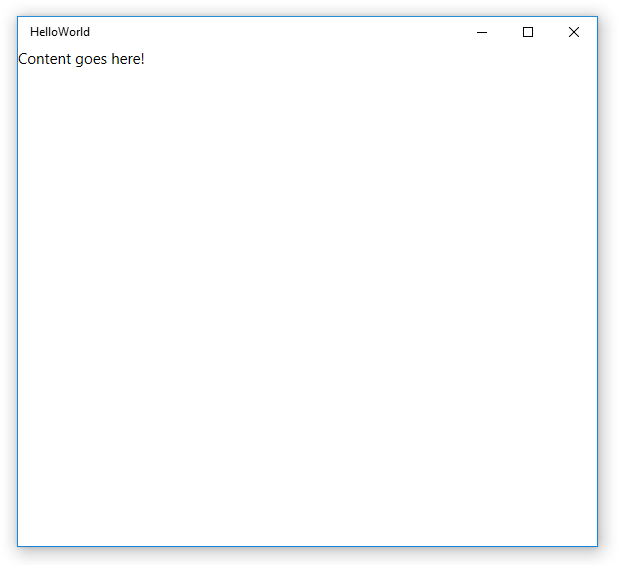
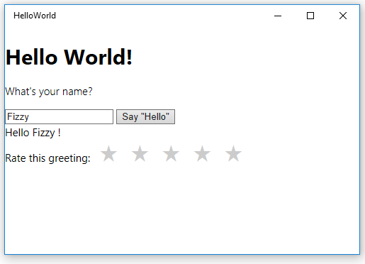

# <a name="create-a-hello-world-app-js"></a>Criar um aplicativo "Hello, world" (JS)

Este tutorial ensina a usar JavaScript e HTML para criar um aplicativo "Hello, world" simples segmentado para a Plataforma Universal do Windows (UWP) no Windows 10. Com um único projeto no Microsoft Visual Studio, você pode compilar um aplicativo que seja executado em qualquer dispositivo do Windows 10.

Aqui, você aprenderá a:

-   Criar um novo projeto do **Visual Studio 2015** direcionado ao **Windows 10** e à **UWP**.
-   Adicionar conteúdo HTML à página inicial
-   Tratar a entrada de toque, caneta e mouse
-   Executar o projeto na área de trabalho local e no emulador do telefone no Visual Studio
-   Usar um controle de Biblioteca do Windows para JavaScript

## <a name="before-you-start"></a>Antes de começar...

-   [O que é um aplicativo Universal do Windows](whats-a-uwp.md)?
-   Para concluir este tutorial, você precisa do Windows 10 e do Visual Studio 2015. [Prepare-se para começar](get-set-up.md).
-   Também pressupomos que você esteja usando o layout de janela padrão no Visual Studio. Se você alterar o layout padrão, poderá redefini-lo no menu **Janela** usando o comando **Redefinir Layout da Janela**.

## <a name="step-1-create-a-new-project-in-visual-studio"></a>Etapa 1: crie um novo projeto no Visual Studio.

Criaremos um novo aplicativo chamado `HelloWorld`. Este é o procedimento:
1.  Inicie o Visual Studio 2015.

2.  No menu **Arquivo**, selecione **Novo > Projeto...** para abrir a caixa de diálogo *Novo Projeto*.

3.  Na lista de modelos no lado esquerdo, expanda **Instalado > Modelos > JavaScript > Windows** e, em seguida, escolha **Universal** para ver a lista de modelos do projeto de UWP. Escolha **Aplicativo WinJS (Universal do Windows)**.

    

    Para este tutorial, usaremos o modelo **Aplicativo WinJS**. Esse modelo cria um aplicativo UWP básico que pode ser compilado e executado, mas que não contém controles de interface do usuário nem dados. Você adicionará controles e dados ao aplicativo ao longo desses tutoriais.

   (Se você não vir essas opções, verifique se tem as ferramentas de desenvolvimento de aplicativo Universal do Windows instaladas. Consulte [Prepare-se para começar](get-set-up.md) para saber mais.)

4.  Na caixa de texto **Nome**, digite "HelloWorld".
5.  Clique em **OK** para criar o projeto.
6.  Você será solicitado a selecionar uma **Versão de Destino** e uma **Versão Mínima** do Windows para dar suporte. As configurações padrão estão corretas, então, clique em **OK**.

    O Visual Studio criará seu projeto e o exibirá no **Gerenciador de Soluções**.

    

Embora o **Aplicativo WinJS** seja um modelo mínimo, ele ainda contém vários arquivos:

-   Um arquivo de manifesto (package.appxmanifest) que descreve o aplicativo (nome, descrição, bloco, página inicial, tela inicial etc.) e lista os arquivos que ele contém.
-   Um conjunto de imagens de logotipo (images/Square150x150Logo.scale-200.png, images/Square44x44Logo.scale-200.png, and images/Wide310x150Logo.scale-200.png) para exibir no menu Iniciar.
-   Uma imagem (images/StoreLogo.png) para representar o aplicativo na Windows Store.
-   Uma tela inicial (images/SplashScreen.scale-200.png) para ser mostrada quando o aplicativo é iniciado.
-   Uma página inicial (index.html) e um arquivo JavaScript correspondente (main.js) que são executados quando o aplicativo é iniciado.

Para exibir e editar os arquivos, clique duas vezes no arquivo no **Gerenciador de Soluções**.

Esses arquivos são essenciais para todos os aplicativos UWP em JavaScript. Eles fazem parte de qualquer projeto criado no Visual Studio.

## <a name="step-2-launch-the-app"></a>Etapa 2: inicie o aplicativo


Neste ponto, você criou um aplicativo muito simples. Este é um bom momento para compilar, implantar e iniciar seu aplicativo e verificar sua aparência. Você pode depurar o aplicativo no computador local, em um simulador ou emulador, ou em um dispositivo remoto. Aqui está o menu do dispositivo de destino no Visual Studio.


### <a name="start-the-app-on-a-desktop-device"></a>Inicie o aplicativo em um dispositivo da área de trabalho

Por padrão, o aplicativo é executado no computador local. O menu do dispositivo de destino fornece várias opções para depurar seu aplicativo em dispositivos da família de dispositivos da área de trabalho.

-   **Simulador**
-   **Computador local**
-   **Computador remoto**

**Para iniciar a depuração no computador local.**

1.  No menu do dispositivo de destino () na barra de ferramentas **Padrão**, verifique se **Computador Local** está selecionado. (Esta é a seleção padrão.)
2.  Clique no botão **Iniciar depuração** () na barra de ferramentas.

   –ou–

   No menu **Depurar**, clique em **Iniciar Depuração**.

   –ou–

   Pressione F5.

O aplicativo é aberto em uma janela, e uma tela inicial padrão aparece primeiro. A tela inicial é definida por uma imagem (SplashScreen.png) e uma cor da tela de fundo (especificada no arquivo de manifesto do aplicativo).

A tela inicial desaparecerá, e o aplicativo será exibido em seguida. Ele conterá uma tela preta com o texto "O conteúdo vai aqui".



Pressione a tecla Windows para abrir o menu **Iniciar** e exibir todos os aplicativos. Observe que implantar o aplicativo localmente adiciona seu bloco ao menu **Iniciar**. Para executar o aplicativo novamente (não no modo de depuração), toque ou clique no bloco no menu **Iniciar**.

Ele ainda não faz muita coisa, mas parabéns! Você criou seu primeiro aplicativo UWP!

**Para parar a depuração**

-   Clique no botão **Parar Depuração** () na barra de ferramentas.

   –ou–

   No menu **Depurar**, clique em **Parar depuração**.

   –ou–

   Feche a janela do aplicativo.

### <a name="start-the-app-on-a-mobile-device-emulator"></a>Iniciar o aplicativo em um emulador de dispositivo móvel

Seu aplicativo é executado em qualquer dispositivo do Windows 10, portanto vamos ver sua aparência em um Windows Phone.

Além das opções para depurar em um dispositivo da área de trabalho, o Visual Studio fornece opções para implantar e depurar seu aplicativo em um dispositivo móvel físico conectado ao computador, ou em um emulador de dispositivo móvel. Você pode escolher entre emuladores para dispositivos com diferentes configurações de memória e exibição.

-   **Dispositivo**
-   **Emulador <SDK version> WVGA de 4 polegadas e 512 MB**
-   **Emulador <SDK version> WVGA de 4 polegadas e 1 GB**
-   etc. (Diversos emuladores em outras configurações)

(Se você não vir os emuladores, verifique se tem as ferramentas de desenvolvimento de aplicativo Universal do Windows instaladas. Consulte [Prepare-se para começar](get-set-up.md) para saber mais.)

É recomendável testar o aplicativo em um dispositivo com tela pequena e memória limitada, portanto use a opção **Emulator 10.0.14393.0 WVGA 4 inch 512MB**.

**Para iniciar a depuração em um emulador de dispositivo móvel**

1.  No menu do dispositivo de destino () na barra de ferramentas **Padrão**, escolha **Emulador 10.0.10240.0 WVGA de 4 polegadas e 512 MB**.
2.  Clique no botão **Iniciar depuração** () na barra de ferramentas.

   –ou–

   No menu **Depurar**, clique em **Iniciar Depuração**.


O Visual Studio inicia o emulador selecionado e, em seguida, implanta e inicia o aplicativo. Durante a primeira inicialização, o emulador pode demorar um pouco para iniciar. Talvez você veja um erro relativo a HyperV. Clicar em **Repetir** deve resolver esse problema. No emulador do dispositivo móvel, o aplicativo tem a seguinte aparência.


## <a name="step-3-modify-your-start-page"></a>Etapa 3: Modifique a página inicial

Um dos arquivos que o Visual Studio criou é **index.html**, a página inicial de seu aplicativo. Quando o aplicativo for executado, exibirá o conteúdo da página inicial. A página inicial também contém referências aos arquivos de código e às folhas de estilo do aplicativo. Veja a seguir a página inicial que o Visual Studio criou para você:

```html
<!DOCTYPE html>
<html>
<head>
    <meta charset="utf-8" />
    <title>HelloWorld</title>

    <!-- WinJS references -->
    <link href="lib/winjs-4.0.1/css/ui-light.css" rel="stylesheet" />
    <script src="lib/winjs-4.0.1/js/base.js"></script>
    <script src="lib/winjs-4.0.1/js/ui.js"></script>

    <!-- HelloWorld references -->
    <link href="/css/default.css" rel="stylesheet" />
    <script src="/js/main.js"></script>
</head>
<body class="win-type-body">
    <div>Content goes here!</div>
</body>
</html>
```

Adicionaremos novo conteúdo ao arquivo default.html. Assim como qualquer outro arquivo HTML, o conteúdo deve ser adicionado ao elemento [body](https://msdn.microsoft.com/library/windows/apps/Hh453011). Você pode usar elementos HTML5 para criar o aplicativo (com [algumas exceções](https://msdn.microsoft.com/library/windows/apps/Hh465380)). Isso significa que você pode usar elementos HTML5 como [h1](https://msdn.microsoft.com/library/windows/apps/Hh441078), [p](https://msdn.microsoft.com/library/windows/apps/Hh453431), [button](https://msdn.microsoft.com/library/windows/apps/Hh453017), [div](https://msdn.microsoft.com/library/windows/apps/Hh453133) e [img](https://msdn.microsoft.com/library/windows/apps/Hh466114).

**Editar sua página inicial**

1.  Substitua o conteúdo existente no elemento **body** por um cabeçalho de primeiro nível com a mensagem "Hello, world!", um texto perguntando o nome do usuário, um elemento **input** para aceitar o nome do usuário, um elemento **button** e um **div**. Atribua IDs ao **input**, ao **button** e ao **div**.

 ```html
    <body class="win-type-body">
        <h1>Hello, world!</h1>
        <p>What's your name?</p>
        <input id="nameInput" type="text" />
        <button id="helloButton">Say "Hello"</button>
        <div id="greetingOutput"></div>
    </body>
 ```

2.  Execute o aplicativo no computador local. Ele terá a aparência a seguir.


   Você pode digitar o elemento **input**, mas, no momento, clicar no **button** não surtirá nenhum efeito. Alguns objetos, como **button**, podem enviar mensagens quando ocorrem determinados eventos. Essas mensagens de evento permitem executar uma ação em resposta ao evento. Você coloca código para responder ao evento em um método do manipulador de eventos.

   Nas próximas etapas, criaremos um manipulador de eventos para o **button** que exibe uma saudação personalizada. Adicionaremos o código do manipulador de eventos ao arquivo main.js.

## <a name="step-4-create-an-event-handler"></a>Etapa 4: Crie um manipulador de eventos

Quando criamos o novo projeto, o Visual Studio automaticamente criou um arquivo /js/main.js. Esse arquivo contém código para tratar o ciclo de vida do aplicativo. Também é nele que você adicionará código para criar interatividade no arquivo index.html.

Abra o arquivo main.js.

Antes de adicionarmos nosso próprio código, vejamos as primeiras e últimas linhas do código no arquivo:

```javascript
(function () {
    "use strict";

     // Omitted code

 })();
```

Você deve estar se perguntando o que é isso. Essas linhas de código encapsulam o restante do código de main.js em uma função anônima autoexecutável. Uma função anônima de autoexecução torna mais fácil evitar conflitos de nomenclatura ou a modificação acidental de valores que não deveriam ser modificados. Isso também mantém identificadores desnecessários fora do namespace global, o que contribui com o desempenho. Parece um pouco estranho, mas trata-se de uma boa prática de programação.

A próxima linha de código ativa o [modo estrito](https://msdn.microsoft.com/library/windows/apps/br230269.aspx) para o código JavaScript. O modo estrito fornece verificações de erro adicionais para o código. Por exemplo, ele impede o uso de variáveis declaradas de modo implícito ou a atribuição de valor a propriedades somente leitura.

Observe o restante do código em main.js. Ele trata os eventos [activated](https://msdn.microsoft.com/library/windows/apps/BR212679) e [checkpoint](https://msdn.microsoft.com/library/windows/apps/BR229839) do aplicativo. Esses eventos serão descritos com mais detalhes mais tarde. Por enquanto, apenas lembre-se de que o evento **activated** é acionado quando o aplicativo é iniciado.

```javascript
   (function () {
    "use strict";

    var app = WinJS.Application;
    var activation = Windows.ApplicationModel.Activation;
    var isFirstActivation = true;

    app.onactivated = function (args) {
          if (args.detail.kind === activation.ActivationKind.voiceCommand) {
            // TODO: Handle relevant ActivationKinds. For example, if your app can be started by voice commands,
            // this is a good place to decide whether to populate an input field or choose a different initial view.
        }
          else if (args.detail.kind === activation.ActivationKind.launch) {
            // A Launch activation happens when the user launches your app via the tile
            // or invokes a toast notification by clicking or tapping on the body.
              if (args.detail.arguments) {
                // TODO: If the app supports toasts, use this value from the toast payload to determine where in the app
                // to take the user in response to them invoking a toast notification.
              }
              else if (args.detail.previousExecutionState === activation.ApplicationExecutionState.terminated) {
                // TODO: This application had been suspended and was then terminated to reclaim memory.
                // To create a smooth user experience, restore application state here so that it looks like the app never stopped running.
                // Note: You may want to record the time when the app was last suspended and only restore state if they've returned after a short period.
            }
        }

        if (!args.detail.prelaunchActivated) {
            // TODO: If prelaunchActivated were true, it would mean the app was prelaunched in the background as an optimization.
            // In that case it would be suspended shortly thereafter.
            // Any long-running operations (like expensive network or disk I/O) or changes to user state which occur at launch
            // should be done here (to avoid doing them in the prelaunch case).
            // Alternatively, this work can be done in a resume or visibilitychanged handler.
        }

        if (isFirstActivation) {
            // TODO: The app was activated and had not been running. Do general startup initialization here.
            document.addEventListener("visibilitychange", onVisibilityChanged);
            args.setPromise(WinJS.UI.processAll());
        }

        isFirstActivation = false;
    };
```

Agora definiremos um manipulador de eventos para o [botão](https://msdn.microsoft.com/library/windows/apps/Hh453017). Nosso novo manipulador de eventos obtém o nome do usuário por meio do controle `nameInput` [input](https://msdn.microsoft.com/library/windows/apps/Hh453271) e o usa para gerar uma saudação no elemento `greetingOutput` **div** criado na seção anterior.

### <a name="using-events-that-work-for-touch-mouse-and-pen-input"></a>Usando eventos que funcionam com a entrada de toque, mouse e caneta

Em um aplicativo UWP, você não precisa se preocupar com as diferenças entre toque, mouse e outras formas de entrada de ponteiro. Você pode simplesmente usar os eventos que já conhece, como [click](https://msdn.microsoft.com/library/windows/apps/Hh441312), e eles funcionarão com todas as formas de entrada.

**Dica**   O aplicativo também pode usar os novos eventos *MSPointer\** e *MSGesture\**, que funcionam com a entrada por toque, mouse e caneta e podem fornecer informações adicionais sobre o dispositivo que disparou o evento. Para saber mais, consulte [Respondendo à interação do usuário](https://msdn.microsoft.com/library/windows/apps/Hh700412) e [Gestos, manipulações e interações](https://msdn.microsoft.com/library/windows/apps/Hh761498).

Agora, prosseguiremos para criar o manipulador de eventos.

**Criar o manipulador de eventos**

1.  No main.js, depois do manipulador de eventos [**app.oncheckpoint**](https://msdn.microsoft.com/library/windows/apps/BR229839) e antes da chamada de [**app.start**](https://msdn.microsoft.com/library/windows/apps/BR229705), crie uma função de manipulador de eventos [**click**](https://msdn.microsoft.com/library/windows/apps/Hh441312) chamada `buttonClickHandler` que receberá um único parâmetro chamado `eventInfo`.
```javascript
    function buttonClickHandler(eventInfo) {

        }
```

2.  Dentro do manipulador de eventos, recupere o nome do usuário a partir do controle `nameInput` [**input**](https://msdn.microsoft.com/library/windows/apps/Hh453271) e use-o para criar uma saudação. Use o `greetingOutput` [**div**](https://msdn.microsoft.com/library/windows/apps/Hh453133) para exibir o resultado.
```javascript
    function buttonClickHandler(eventInfo) {
            var userName = document.getElementById("nameInput").value;
            var greetingString = "Hello, " + userName + "!";
            document.getElementById("greetingOutput").innerText = greetingString;
        }
 ```

Você adicionou o manipulador de eventos a main.js. Agora, você precisa registrá-lo.

## <a name="step-5-register-the-event-handler-when-your-app-launches"></a>Etapa 5: Registre o manipulador de eventos quando seu aplicativo for iniciado


Tudo o que precisamos fazer agora é registrar o manipulador de eventos no botão. A maneira recomendada de registrar um manipulador de eventos é chamar [addEventListener](https://msdn.microsoft.com/library/windows/apps/Hh441145) do código. Um bom momento para registrar o manipulador de eventos é quando o aplicativo for ativado. Felizmente, como você viu, o Visual Studio gerou um código no arquivo main.js que trata a ativação do aplicativo.


No manipulador [onactivated](https://msdn.microsoft.com/library/windows/apps/BR212679), o código verifica qual tipo de ativação ocorreu. Existem vários tipos de ativação diferentes. Por exemplo, seu aplicativo foi ativado quando o usuário iniciou o aplicativo e quando o usuário deseja abrir um arquivo que está associado ao seu aplicativo. (Para saber mais, veja [Ciclo de vida do aplicativo](https://msdn.microsoft.com/library/windows/apps/Mt243287).)

Estamos interessados na ativação de [launch](https://msdn.microsoft.com/library/windows/apps/BR224693). Um aplicativo é *iniciado* sempre que não está em execução e um usuário o ativa. Ele chama [WinJS.UI.processAll](https://msdn.microsoft.com/library/windows/apps/Hh440975) independentemente de o aplicativo já ter sido desligado anteriormente ou de ser a primeira vez que está sendo iniciado. O **WinJS.UI.processAll** está contido em uma chamada do método [setPromise](https://msdn.microsoft.com/library/windows/apps/JJ215609), que verifica se a tela não é retirada até que a página do aplicativo esteja pronta.

**Dica**   A função **WinJS.UI.processAll** verifica o arquivo default.html para localizar controles WinJS e os inicializa. Até agora, ainda não adicionamos esses controles, mas é recomendável manter esse código para o caso de você desejar adicioná-los posteriormente.

Um bom local para registrar os manipuladores de eventos de controles que não sejam WinJS é logo após a chamada de **WinJS.UI.processAll**.

**Registrar o manipulador de eventos**

-   No manipulador de eventos [**onactivated**](https://msdn.microsoft.com/library/windows/apps/BR212679) em main.js, recupere `helloButton` e use [**addEventListener**](https://msdn.microsoft.com/library/windows/apps/Hh441145) para registrar o manipulador de eventos para o evento [**click**](https://msdn.microsoft.com/library/windows/apps/Hh441312). Adicione este código após a chamada de [**WinJS.UI.processAll**](https://msdn.microsoft.com/library/windows/apps/Hh440975).

```javascript
   app.onactivated = function (args) {
           // Omitted code
           if (isFirstActivation) {
              document.addEventListener("visibilitychange", onVisibilityChanged);
              args.setPromise(WinJS.UI.processAll());

              // Add your code to retrieve the button and register the event handler.
              var helloButton = document.getElementById("helloButton");
              helloButton.addEventListener("click", buttonClickHandler, false);
            }

```    


Execute o aplicativo. Quando você inserir seu nome na caixa de texto e clicar no botão, o aplicativo exibirá uma saudação personalizada.

**Observação**   Se você está se perguntando por que usamos [addEventListener](https://msdn.microsoft.com/library/windows/apps/Hh441145) para registrar o evento no código em vez de definir o evento [onclick](https://msdn.microsoft.com/library/windows/apps/Hh441312) no HTML, consulte [Codificando aplicativos básicos](https://msdn.microsoft.com/library/windows/apps/Hh780660) para obter uma explicação detalhada.

## <a name="step-6-add-a-windows-library-for-javascript-control"></a>Etapa 6: adicionar uma Biblioteca do Windows para controle JavaScript


Além dos controles HTML padrão, seu aplicativo pode usar qualquer um dos controles da [Biblioteca do Windows para JavaScript](https://msdn.microsoft.com/library/windows/apps/BR229782), como os controles [WinJS.UI.DatePicker](https://msdn.microsoft.com/library/windows/apps/BR211681), [WinJS.UI.FlipView](https://msdn.microsoft.com/library/windows/apps/BR211711), [WinjS.UI.ListView](https://msdn.microsoft.com/library/windows/apps/BR211837) e [WinJS.UI.Rating](https://msdn.microsoft.com/library/windows/apps/BR211895).

Diferentemente dos controles HTML, os controles WinJS não têm elementos de marcação dedicados: você não pode criar um controle [Rating](https://msdn.microsoft.com/library/windows/apps/BR211895) adicionando um elemento `<rating />`, por exemplo. Para adicionar um controle WinJS, você cria um elemento **div** e usa o atributo [data-win-control](https://msdn.microsoft.com/library/windows/apps/Hh440969) para especificar o tipo de controle desejado. Para adicionar um controle **Rating**, você define o atributo como "WinJS.UI.Rating".

**Adicione um controle Rating ao seu aplicativo.**

1.  No arquivo index.html, adicione um [label](https://msdn.microsoft.com/library/windows/apps/Hh453321) e um controle [Rating](https://msdn.microsoft.com/library/windows/apps/BR211895) após `greetingOutput` **div**.

```html
    <body class="win-type-body">
        <h1>Hello, world!</h1>
        <p>What's your name?</p>
        <input id="nameInput" type="text" />
        <button id="helloButton">Say "Hello"</button>
        <div id="greetingOutput"></div>
        <label for="ratingControlDiv">
            Rate this greeting:
        </label>
        <div id="ratingControlDiv" data-win-control="WinJS.UI.Rating">
        </div>
    </body>
```

2.  Execute o aplicativo no computador local. Observe o novo controle [**Rating**](https://msdn.microsoft.com/library/windows/apps/BR211895).

   

> Para que o **Rating** seja carregado, sua página deve chamar o [WinJS.UI.processAll](https://msdn.microsoft.com/library/windows/apps/Hh440975). Como nosso aplicativo está usando um dos modelos do Visual Studio, seu main.js já inclui uma chamada para **WinJS.UI.processAll**, conforme descrito anteriormente, para que você não precise adicionar nenhum código.

Agora, clicar no controle **Rating** altera a classificação, mas não faz mais nada. Vamos usar um manipulador de eventos para fazer algo quando o usuário altera a classificação.

## <a name="step-7-register-an-event-handler-for-a-windows-library-for-javascript-control"></a>Etapa 7: registrar um manipulador de eventos para um controle de Biblioteca do Windows para JavaScript


Registrar um manipulador de eventos para um controle WinJS é um pouco diferente de registrar um manipulador de eventos para um controle HTML padrão. Anteriormente, mencionamos que o manipulador de eventos **onactivated** chama o método **WinJS.UI.processAll** para inicializar o WinJS em sua marcação. A chamada **WinJS.UI.processAll** é encapsulada em uma chamada do método **setPromise**, da seguinte forma:

```javascript
            args.setPromise(WinJS.UI.processAll());           
```

Se **Rating** fosse um controle HTML padrão, você adicionaria seu manipulador de eventos após esta chamada ao **WinJS.UI.processAll**. Mas isso é um pouco mais complicado para um controle WinJS como nossa **Rating**. Como o **WinJS.UI.processAll** cria o controle de **Rating** para nós, não podemos adicionar o manipulador de eventos à **Rating** até que o **WinJS.UI.processAll** tenha concluído seu processamento.

Se **WinJS.UI.processAll** fosse um método típico, poderíamos registrar o manipulador de eventos **Rating** logo depois de chamá-lo. Mas o método **WinJS.UI.processAll** é assíncrono, então qualquer código que segui-lo pode ser executado antes de o **WinJS.UI.processAll** ser concluído. Então, o que devemos fazer? Usamos um objeto [Promise](https://msdn.microsoft.com/library/windows/apps/BR211867) para receber notificações quando o **WinJS.UI.processAll** é concluído.

Como em todos os métodos WinJS assíncronos, **WinJS.UI.processAll** retorna um objeto **Promise**. Uma **Promise** é uma "promessa" que algo ocorrerá no futuro; quando isto ocorre, diz-se que a **Promise** foi concretizada.

Os objetos [Promise](https://msdn.microsoft.com/library/windows/apps/BR211867) têm um método [then](https://msdn.microsoft.com/library/windows/apps/BR229728) que considera uma função "concluída" como um parâmetro. A **Promise** chama essa função quando é concluída.

Ao adicionar seu código a uma função "concluída" e transmiti-lo para o método **then** do objeto **Promise**, você pode ter certeza de que seu código será executado após a conclusão de **WinJS.UI.processAll**.

**Gerar o valor de classificação que o usuário seleciona**

1.  Em seu arquivo index.html, crie um elemento [**div**](https://msdn.microsoft.com/library/windows/apps/Hh453133) para exibir o valor de classificação e dar a ele a **id** "ratingOutput".

```html
        <body class="win-type-body">
        <h1>Hello, world!</h1>
        <p>What's your name?</p>
        <input id="nameInput" type="text" />
        <button id="helloButton">Say "Hello"</button>
        <div id="greetingOutput"></div>
        <label for="ratingControlDiv">
            Rate this greeting:
        </label>
        <div id="ratingControlDiv" data-win-control="WinJS.UI.Rating">
        </div>
        <div id="ratingOutput"></div>
    </body>
```

2.  Em nosso arquivo main.js, crie um manipulador para o evento [change](https://msdn.microsoft.com/library/windows/apps/BR211891) do controle **Rating** denominado `ratingChanged`. O parâmetro [eventInfo](https://msdn.microsoft.com/library/windows/apps/Hh465776) contém uma propriedade **detail.tentativeRating** que fornece a nova classificação de usuário. Obtenha esse valor e o exiba na saída **div**.

```javascript
        function ratingChanged(eventInfo) {

            var ratingOutput = document.getElementById("ratingOutput");
            ratingOutput.innerText = eventInfo.detail.tentativeRating;
        }
```

3.  Atualize o código no manipulador de eventos [onactivated](https://msdn.microsoft.com/library/windows/apps/BR212679) que chama  [WinJS.UI.processAll](https://msdn.microsoft.com/library/windows/apps/Hh440975) adicionando uma chamada ao método [then](https://msdn.microsoft.com/library/windows/apps/BR229728) e passando-a para uma função `completed`. Na função `completed`, obtenha o elemento `ratingControlDiv` que hospeda o controle [Rating](https://msdn.microsoft.com/library/windows/apps/BR211895). Em seguida, use a propriedade [winControl](https://msdn.microsoft.com/library/windows/apps/Hh770814) para obter o controle **Rating** real. (Este exemplo define a função `completed` embutida.)

```javascript
           args.setPromise(WinJS.UI.processAll().then(function completed() {

                    // Retrieve the div that hosts the Rating control.
                    var ratingControlDiv = document.getElementById("ratingControlDiv");

                    // Retrieve the actual Rating control.
                    var ratingControl = ratingControlDiv.winControl;

                    // Register the event handler.
                    ratingControl.addEventListener("change", ratingChanged, false);

                }));
```

4.  Embora seja aceitável registrar manipuladores de eventos para controles HTML após a chamada ao [**WinJS.UI.processAll**](https://msdn.microsoft.com/library/windows/apps/Hh440975), também é possível registrá-los na sua função `completed`. Para simplificar, vamos continuar e mover todos os registradores do manipulador de eventos para dentro do manipulador de eventos [**then**](https://msdn.microsoft.com/library/windows/apps/BR229728).

    Aqui está o manipulador de eventos [**onactivated**](https://msdn.microsoft.com/library/windows/apps/BR212679) atualizado:

```javascript
    (function () {
    "use strict";

    var app = WinJS.Application;
    var activation = Windows.ApplicationModel.Activation;
    var isFirstActivation = true;

    app.onactivated = function (args) {
        if (args.detail.kind === activation.ActivationKind.voiceCommand) {
            // TODO: Handle relevant ActivationKinds. For example, if your app can be started by voice commands,
            // this is a good place to decide whether to populate an input field or choose a different initial view.
        }
        else if (args.detail.kind === activation.ActivationKind.launch) {
            // A Launch activation happens when the user launches your app via the tile
            // or invokes a toast notification by clicking or tapping on the body.
            if (args.detail.arguments) {
                // TODO: If the app supports toasts, use this value from the toast payload to determine where in the app
                // to take the user in response to them invoking a toast notification.
            }
            else if (args.detail.previousExecutionState === activation.ApplicationExecutionState.terminated) {
                // TODO: This application had been suspended and was then terminated to reclaim memory.
                // To create a smooth user experience, restore application state here so that it looks like the app never stopped running.
                // Note: You may want to record the time when the app was last suspended and only restore state if they've returned after a short period.
            }
        }

        if (!args.detail.prelaunchActivated) {
            // TODO: If prelaunchActivated were true, it would mean the app was prelaunched in the background as an optimization.
            // In that case it would be suspended shortly thereafter.
            // Any long-running operations (like expensive network or disk I/O) or changes to user state which occur at launch
            // should be done here (to avoid doing them in the prelaunch case).
            // Alternatively, this work can be done in a resume or visibilitychanged handler.
        }

        if (isFirstActivation) {
            // TODO: The app was activated and had not been running. Do general startup initialization here.
            document.addEventListener("visibilitychange", onVisibilityChanged);

            args.setPromise(WinJS.UI.processAll().then(function completed() {
                var ratingControlDiv = document.getElementById("ratingControlDiv");
                var ratingControl = ratingControlDiv.winControl;
                ratingControl.addEventListener("change",ratingChanged, false);
            }));

            var helloButton = document.getElementById("helloButton");
            helloButton.addEventListener("click", buttonClickHandler, false);

        }

        isFirstActivation = false;
    };

```        

    Run the app. When you select a rating value, it outputs the numeric value below the [**Rating**](https://msdn.microsoft.com/library/windows/apps/BR211895) control.


## <a name="summary"></a>Resumo

Parabéns, você criou seu primeiro app para o Windows 10 e a UWP usando JavaScript e HTML!

O que vem em seguida? Os documentos [WinJS](https://developer.microsoft.com/en-us/windows/develop/winjs) ajudarão você a começar a usar a Biblioteca do Windows para JavaScript.


<!--HONumber=Dec16_HO1-->


