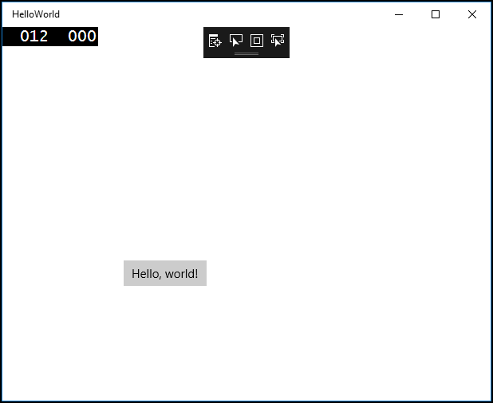

# <a name="create-a-hello-world-app-xaml"></a>Criar um app "Hello, world" (XAML)

Este tutorial ensina a usar XAML e c# para criar um simples "Hello, world" aplicativo para plataforma Universal do Windows (UWP) no Windows 10. Com um único projeto no Microsoft Visual Studio, você pode criar um aplicativo que é executado em qualquer dispositivo Windows 10.

Aqui, você aprenderá a:

-   Crie um novo projeto do **Visual Studio 2017** direcionado ao **Windows 10** e a **UWP**.
-   Escrever XAML para alterar a interface do usuário em sua página inicial.
-   Executar o projeto na área de trabalho local no Visual Studio.
-   Usar um SpeechSynthesizer para fazer o app falar quando você pressiona um botão.


## <a name="before-you-start"></a>Antes de começar...

-   [O que é um aplicativo Universal do Windows?](universal-application-platform-guide.md)
-   [Baixar o Visual Studio 2017 (e o Windows 10)](https://developer.microsoft.com/windows/downloads). Se você precisar de ajuda, saiba como [preparar-se](get-set-up.md).
-   Também pressupomos que você esteja usando o layout de janela padrão no Visual Studio. Se você alterar o layout padrão, poderá redefini-lo no menu **Janela** usando o comando **Redefinir Layout da Janela**.

> [!NOTE]
> Este tutorial usa o Visual Studio Community 2017. Se você estiver usando uma versão diferente do Visual Studio, ele pode ter uma aparência um pouco diferente.

## <a name="video-summary"></a>Resumo do vídeo

<iframe src="https://channel9.msdn.com/Blogs/One-Dev-Minute/Writing-Your-First-Windows-10-App/player" width="640" height="360" allowFullScreen frameBorder="0"></iframe>


## <a name="step-1-create-a-new-project-in-visual-studio"></a>Etapa 1: crie um novo projeto no Visual Studio.

1.  Inicie o Visual Studio 2017.

2.  No menu **arquivo** , selecione **Novo > projeto** para abrir a caixa de diálogo *Novo projeto* .

3.  Na lista de modelos no lado esquerdo, escolha **instalado > Visual c# > Universal do Windows** para ver a lista de modelos de projeto UWP.

    (Se você não vir nenhum modelo universal, talvez faltem componentes para a criação de aplicativos UWP. Você pode repetir o processo de instalação e adicionar suporte para UWP, clicando em **Abrir Instalador do Visual Studio** na caixa de diálogo *Novo Projeto*. Consulte [Prepare-se](get-set-up.md).)

    

4.  Escolha o modelo **Aplicativo em Branco (Universal do Windows)** e insira "HelloWorld" como **Nome**. Clique em **OK**.

    

> [!NOTE]
> Se esta foi a primeira vez em que usou o Visual Studio, você poderá ver uma caixa de diálogo Configurações solicitando que você habilite o **Modo de desenvolvedor**. O modo de desenvolvedor é uma configuração especial que habilita determinados recursos, como a permissão para executar apps diretamente, em vez de apenas da Store. Para obter mais informações, leia [Habilitar seu dispositivo para desenvolvimento](enable-your-device-for-development.md). Para continuar com este guia, selecione **Modo de desenvolvedor**, clique em **Sim** e feche a caixa de diálogo.

 

5.  A caixa de diálogo de versão pretendida/versão mínima é exibida. As configurações padrão são adequadas para este tutorial, então selecione **OK** para criar o projeto.

    

6.  Quando o seu novo projeto é aberto, seus arquivos são exibidos no painel do **Gerenciador de soluções** à direita. Talvez seja necessário escolher a guia **Gerenciador de soluções** em vez da guia **Propriedades** para ver seus arquivos.

    

Apesar de ser um modelo básico, **Aplicativo em Branco (Universal do Windows)** contém vários arquivos. Esses arquivos são essenciais para todos os aplicativos UWP em C#. Eles fazem parte de todos os projetos criados no Visual Studio.


### <a name="whats-in-the-files"></a>O que os arquivos incluem?

Para exibir e editar um arquivo no projeto, clique duas vezes no arquivo no **Gerenciador de Soluções**. Expanda um arquivo XAML como se fosse uma pasta para ver o arquivo de código associado. Os arquivos XAML são abertos em um modo divisão que mostra a área de design e o editor de XAML.
> [!NOTE]
> O que é XAML? Extensible Application Markup Language (XAML) é a linguagem usada para definir a interface do usuário do seu aplicativo. Ela pode ser inserida manualmente ou criada usando as ferramentas de design do Visual Studio. Um arquivo .xaml tem um arquivo .xaml.cs code-behind que contém a lógica. Juntos, o XAML e o code-behind compõem uma classe completa. Para saber mais, consulte [Visão geral de XAML](https://msdn.microsoft.com/library/windows/apps/Mt185595).

*App.xaml e App.xaml.cs*

-   App.xaml é onde você declara os recursos que serão usados em todo o aplicativo.
-   App.xaml.cs é o arquivo code-behind de App.xaml. Como todas as páginas code-behind, ele contém um construtor que chama o método `InitializeComponent`. Não é você quem cria o método `InitializeComponent`. Ele é gerado pelo Visual Studio e sua principal finalidade é inicializar os elementos declarados no arquivo XAML.
-   App.xaml.cs é o ponto de entrada do aplicativo.
-   App.XAML.cs também contém métodos para manipular a [ativação](../launch-resume/activate-an-app.md) e [suspensão](../launch-resume/suspend-an-app.md) do aplicativo.

*MainPage.xaml*

-   Em MainPage.xaml, você define a interface do usuário do aplicativo. É possível adicionar elementos usando diretamente a marcação XAML ou usar as ferramentas de design fornecidas pelo Visual Studio.
-   MainPage.xaml.cs é a página code-behind de MainPage.xaml. É onde você adiciona a lógica e os manipuladores de eventos do aplicativo.
-   Juntos, esses dois arquivos definem uma nova classe chamada `MainPage`, que herda de [**Page**](https://msdn.microsoft.com/library/windows/apps/BR227503), no namespace `HelloWorld`.

*Package.appxmanifest*
-   Um arquivo de manifesto que descreve seu aplicativo: nome, descrição, bloco, página de início, etc.
-   Inclui uma lista de dependências, recursos e os arquivos que ele contém.

*Um conjunto de imagens de logotipo*
-   Assets/Square150x150Logo.scale-200.png e Wide310x150Logo.scale 200.png representam seu aplicativo (tamanho médio ou todo o) no menu Iniciar.
-   Assets/Square44x44Logo.png representa seu aplicativo na lista de aplicativos do menu Iniciar, barra de tarefas e Gerenciador de tarefas.
-   Assets/StoreLogo.png representa seu app na Microsoft Store.
-   Assets/SplashScreen.scale-200.png é a tela inicial que será exibida quando o aplicativo iniciar.
-   Assets/LockScreenLogo.scale-200.png pode ser usado para representar o aplicativo na tela de bloqueio, quando o sistema está bloqueado.

## <a name="step-2-adding-a-button"></a>Etapa 2: adicionando um botão

### <a name="using-the-designer-view"></a>Usando o modo de exibição de designer

Vamos adicionar um botão à nossa página. Neste tutorial, você trabalhará com apenas alguns dos arquivos mencionados anteriormente: App.xaml, MainPage.xaml e MainPage.xaml.cs.

1.  Clique duas vezes em **MainPage.xaml** para abri-lo no modo de exibição de Design.

    Você notará que há uma exibição gráfica na parte superior da tela e o modo de exibição de código XAML abaixo. Você pode fazer alterações em qualquer uma delas, mas, por enquanto, vamos usar o modo de exibição gráfico.

    

2.  Clique na guia vertical **Caixa de Ferramentas** à esquerda para abrir a lista de controles de interface do usuário. (Você pode clicar no ícone fixar na sua barra de título para manter visível).

    

3.  Expanda **Controles XAML comuns**e arraste o **Botão** para o meio da tela de design.

    

    Se você olhar para a janela de código XAML, verá que o botão foi adicionado lá também:

 ```XAML
<Button x:name="button" Content="Button" HorizontalAlignment="Left" Margin = "152,293,0,0" VerticalAlignment="Top"/>
 ```

4.  Altere o texto do botão.

    Clique no modo de exibição de código XAML e altere o conteúdo de "Botão" para "Hello, world!".

```XAML
<Button x:name="button" Content="Hello, world!" HorizontalAlignment="Left" Margin = "152,293,0,0" VerticalAlignment="Top"/>
```

Observe como o botão é exibido nas atualizações de telas de design para exibir o novo texto.


## <a name="step-3-start-the-app"></a>Etapa 3: inicie o aplicativo


Neste ponto, você criou um aplicativo muito simples. Este é um bom momento para compilar, implantar e iniciar seu aplicativo e verificar sua aparência. Você pode depurar o aplicativo no computador local, em um simulador ou emulador, ou em um dispositivo remoto. Aqui está o menu do dispositivo de destino no Visual Studio.


### <a name="start-the-app-on-a-desktop-device"></a>Inicie o aplicativo em um dispositivo da área de trabalho

Por padrão, o aplicativo é executado no computador local. O menu do dispositivo de destino fornece várias opções para depurar seu aplicativo em dispositivos da família de dispositivos da área de trabalho.

-   **Simulador**
-   **Computador local**
-   **Computador remoto**

**Para iniciar a depuração no computador local.**

1.  No menu do dispositivo de destino () na barra de ferramentas **Padrão**, verifique se **Computador Local** está selecionado. (Esta é a seleção padrão.)
2.  Clique no botão **Iniciar depuração** () na barra de ferramentas.

   –ou–

   No menu **Depurar**, clique em **Iniciar Depuração**.

   –ou–

   Pressione F5.

O aplicativo é aberto em uma janela, e uma tela inicial padrão aparece primeiro. A tela inicial é definida por uma imagem (SplashScreen.png) e uma cor da tela de fundo (especificada no arquivo de manifesto do aplicativo).

A tela inicial desaparecerá, e o aplicativo será exibido em seguida. Ele terá a aparência a seguir.



Pressione a tecla Windows para abrir o menu **Iniciar** e exibir todos os aplicativos. Observe que implantar o aplicativo localmente adiciona seu bloco ao menu **Iniciar**. Para executar o aplicativo novamente mais tarde (não no modo de depuração), toque ou clique no bloco no menu **Iniciar**.

Ele ainda não faz muita coisa, mas parabéns! Você criou seu primeiro aplicativo UWP!

**Para parar a depuração**

   Clique no botão **Parar Depuração** () na barra de ferramentas.

   –ou–

   No menu **Depurar**, clique em **Parar depuração**.

   –ou–

   Feche a janela do app.

## <a name="step-4-event-handlers"></a>Etapa 4: manipuladores de eventos

Um "manipulador de eventos" parece complicado, mas é apenas outro nome para o código que é chamado quando ocorre um evento (por exemplo, o usuário clica no botão).

1.  Pare a execução do aplicativo, caso ainda não tenha feito isso.

2.  Clique duas vezes no controle de botão na tela de design para fazer com que o Visual Studio crie um manipulador de eventos para o seu botão.

  Você pode, obviamente, criar todo o código manualmente também. Ou você pode clicar no botão para selecioná-lo e examinar o painel **Propriedades** na parte inferior direita. Se você alternar para **Eventos** (o pequeno botão de raio), poderá adicionar o nome do seu manipulador de eventos.

3.  Edite o código do manipulador de eventos em *MainPage.xaml.cs*, a página code-behind. É aqui que as coisas ficam interessantes. O manipulador de eventos padrão tem esta aparência:

```cs
private void Button_Click(object sender, RoutedEventArgs e)
{

}
```

  Vamos alterá-la para que ela tenha esta aparência:

```cs
private async void Button_Click(object sender, RoutedEventArgs e)
{
    MediaElement mediaElement = new MediaElement();
    var synth = new Windows.Media.SpeechSynthesis.SpeechSynthesizer();
    Windows.Media.SpeechSynthesis.SpeechSynthesisStream stream = await synth.SynthesizeTextToStreamAsync("Hello, World!");
    mediaElement.SetSource(stream, stream.ContentType);
    mediaElement.Play();
}
```

Verifique se a assinatura do método agora inclui a palavra-chave **async** , ou você receberá um erro ao tentar executar o aplicativo.

### <a name="what-did-we-just-do"></a>O que acabamos de fazer?

Esse código usa algumas APIs do Windows para criar um objeto de síntese de fala e concede a ele algum texto a ser dito. (Para obter mais informações sobre como usar SpeechSynthesis, consulte os [documentos de namespace SpeechSynthesis](https://msdn.microsoft.com/library/windows/apps/windows.media.speechsynthesis.aspx).)

Quando você executar o aplicativo e clicar no botão, seu computador (ou telefone) dirá literalmente "Hello, World!".


## <a name="summary"></a>Resumo

Parabéns, você criou seu primeiro aplicativo para Windows 10 e a UWP!

Para saber como usar XAML para dispor os controles que seu app usará, experimente o ([tutorial de grade](../design/layout/grid-tutorial.md) ou passe diretamente para as [Próximas Etapas](learn-more.md)?

## <a name="see-also"></a>Consulte também

* [Seu primeiro app](your-first-app.md)
* [Como publicar seu aplicativo UWP](https://developer.microsoft.com/store/publish-apps).
* [Artigos de instruções sobre como desenvolver aplicativos UWP](https://developer.microsoft.com/windows/apps/develop)
* [Amostras de código para desenvolvedores UWP](https://developer.microsoft.com/windows/samples)
* [O que é um aplicativo Universal do Windows?](universal-application-platform-guide.md)
* [Inscreva-se para a conta do Windows](sign-up.md)
