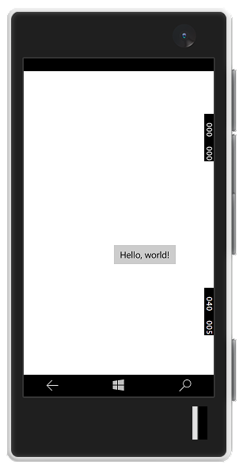

# Criar um aplicativo "Hello, world" (XAML)

Este tutorial ensina a usar XAML e C# para criar um aplicativo "Hello, world" simples para a Plataforma Universal do Windows (UWP) no Windows 10. Com um único projeto no Microsoft Visual Studio, você pode compilar um aplicativo que seja executado em qualquer dispositivo do Windows 10.

Aqui, você aprenderá a:

-   Criar um novo projeto do **Visual Studio 2015** direcionado ao **Windows 10** e à **UWP**.
-   Escreva o XAML para alterar a interface do usuário em sua página inicial.
-   Executar o projeto na área de trabalho local e no emulador do telefone no Visual Studio.
-   Use um SpeechSynthesizer para fazer o aplicativo falar quando você pressiona um botão.

## Antes de começar...

-   [O que é um aplicativo Universal do Windows](whats-a-uwp.md)?
-   [Novidades no Windows 10](https://dev.windows.com/whats-new-windows-10-dev-preview)
-   Para concluir este tutorial, você precisa do Windows 10 e do Visual Studio 2015. [Prepare-se para começar](get-set-up.md).
-   Também pressupomos que você esteja usando o layout de janela padrão no Visual Studio. Se você alterar o layout padrão, poderá redefini-lo no menu **Janela** usando o comando **Redefinir Layout da Janela**.


## Se, ao invés disso, você preferir assistir a um vídeo...

<iframe src="https://channel9.msdn.com/Blogs/One-Dev-Minute/Writing-Your-First-Windows-10-App/player" width="640" height="360" allowFullScreen frameBorder="0"></iframe>

Se você preferir uma abordagem visual em um guia passo a passo, este vídeo abrangerá o mesmo material, mas com uma trilha sonora agradável.

## Etapa 1: crie um novo projeto no Visual Studio.

1.  Inicie o Visual Studio 2015.

2.  No menu **Arquivo**, selecione **Novo > Projeto...** para abrir a caixa de diálogo *Novo Projeto*.

3.  Na lista de modelos no lado esquerdo, abra **Instalado > Modelos > Visual C# > Windows** e, em seguida, escolha **Universal** para ver a lista de modelos do projeto de UWP.

    (Se você não vir quaisquer modelos universais, talvez você não tenha o Visual Studio 2015 ou pode estar faltando componentes para a criação de aplicativos UWP. Consulte [Prepare-se para começar](get-set-up.md) para corrigir suas ferramentas.)

4.  Escolha o modelo **Aplicativo em branco (Universal Windows)** e insira "HelloWorld" como **nome**. Clique em **OK**.

    

5.  A caixa de diálogo de versão pretendida/versão mínima é exibida. Se as configurações padrão estiverem adequadas, selecione **OK** para criar o projeto.

    

6.  Quando o seu novo projeto é aberto, seus arquivos são exibidos no painel do **Gerenciador de soluções** à direita. Talvez seja necessário escolher a guia **Gerenciador de soluções** em vez da guia **Propriedades** para ver seus arquivos.

    

Apesar de ser um modelo básico, **Aplicativo em Branco (Universal do Windows)** contém vários arquivos. Esses arquivos são essenciais para todos os aplicativos UWP em C#. Eles fazem parte de todos os projetos criados no Visual Studio.


### O que os arquivos incluem?

Para exibir e editar um arquivo no projeto, clique duas vezes no arquivo no **Gerenciador de Soluções**. Expanda um arquivo XAML como se fosse uma pasta para ver o arquivo de código associado. Os arquivos XAML são abertos em um modo divisão que mostra a área de design e o editor de XAML.
> [!NOTE]
> O que é XAML? Extensible Application Markup Language (XAML) é a linguagem usada para definir a interface do usuário do seu aplicativo. Ela pode ser inserida manualmente ou criada usando as ferramentas de design do Visual Studio. Um arquivo .xaml tem um arquivo .xaml.cs code-behind que contém a lógica. Juntos, o XAML e o code-behind compõem uma classe completa. Para saber mais, consulte [Visão geral de XAML](https://msdn.microsoft.com/library/windows/apps/Mt185595).

*App.xaml e App.xaml.cs*

-   App.xaml é onde você declara os recursos que serão usados em todo o aplicativo.
-   App.xaml.cs é o arquivo code-behind de App.xaml. Como todas as páginas code-behind, ele contém um construtor que chama o método `InitializeComponent`. Não é você quem cria o método `InitializeComponent`. Ele é gerado pelo Visual Studio e sua principal finalidade é inicializar os elementos declarados no arquivo XAML.
-   App.xaml.cs é o ponto de entrada do aplicativo.
-   App.xaml.cs também contém métodos para manipular a ativação e a suspensão do aplicativo.

*MainPage.xaml*

-   Em MainPage.xaml, você define a interface do usuário do aplicativo. É possível adicionar elementos usando diretamente a marcação XAML ou usar as ferramentas de design fornecidas pelo Visual Studio.
-   MainPage.xaml.cs é a página code-behind de MainPage.xaml. É onde você adiciona a lógica e os manipuladores de eventos do aplicativo.
-   Juntos, esses dois arquivos definem uma nova classe chamada `MainPage`, que herda de [**Page**](https://msdn.microsoft.com/library/windows/apps/BR227503), no namespace `HelloWorld`.

*Package.appxmanifest*
-   Um arquivo de manifesto que descreve seu aplicativo: nome, descrição, bloco, página de início, etc.
-   Inclui uma lista dos arquivos que contêm seu aplicativo.

*Um conjunto de imagens de logotipo*
-   Assets/Square150x150Logo.scale-200.png representa seu aplicativo no menu Iniciar.
-   Assets/StoreLogo.png representa o aplicativo na Windows Store.
-   Assets/SplashScreen.scale-200.png é a tela inicial que será exibida quando o aplicativo iniciar.

## Etapa 2: adicionando um botão

### Usando o modo de exibição de designer

Vamos adicionar um botão à nossa página. Neste tutorial, você trabalhará com apenas alguns dos arquivos mencionados anteriormente: App.xaml, MainPage.xaml e MainPage.xaml.cs.

1.  Clique duas vezes em **MainPage.xaml** para abri-lo no modo de exibição de Design.

    Você notará que há uma exibição gráfica na parte superior da tela e o modo de exibição de código XAML abaixo. Você pode fazer alterações em qualquer uma delas, mas, por enquanto, vamos usar o modo de exibição gráfico.

    

2.  Clique na guia vertical **Caixa de Ferramentas** à esquerda para abrir a lista de controles de interface do usuário. (Você pode clicar no ícone fixar na sua barra de título para manter visível).

    

3.  Expanda **Controles XAML comuns**e arraste o **Botão** para o meio da tela de design.

    

    Se você olhar para a janela de código XAML, verá que o botão foi adicionado lá também:

 ```XAML
<Button x:name="button" Content="Button" HorizontalAlignment="Left" Margin = "152,293,0,0" VerticalAlignment="Top"/>
 ```

4.  Altere o texto do botão.

    Clique no modo de exibição de código XAML e altere o conteúdo de "Botão" para "Hello, world!".

```XAML
<Button x:name="button" Content="Hello, world!" HorizontalAlignment="Left" Margin = "152,293,0,0" VerticalAlignment="Top"/>
```

Observe como o botão é exibido nas atualizações de telas de design para exibir o novo texto.


## Etapa 3: inicie o aplicativo


Neste ponto, você criou um aplicativo muito simples. Este é um bom momento para compilar, implantar e iniciar seu aplicativo e verificar sua aparência. Você pode depurar o aplicativo no computador local, em um simulador ou emulador, ou em um dispositivo remoto. Aqui está o menu do dispositivo de destino no Visual Studio.


### Inicie o aplicativo em um dispositivo da área de trabalho

Por padrão, o aplicativo é executado no computador local. O menu do dispositivo de destino fornece várias opções para depurar seu aplicativo em dispositivos da família de dispositivos da área de trabalho.

-   **Simulador**
-   **Computador local**
-   **Computador remoto**

**Para iniciar a depuração no computador local.**

1.  No menu do dispositivo de destino () na barra de ferramentas **Padrão**, verifique se **Computador Local** está selecionado. (Esta é a seleção padrão.)
2.  Clique no botão **Iniciar depuração** () na barra de ferramentas.

   –ou–

   No menu **Depurar**, clique em **Iniciar Depuração**.

   –ou–

   Pressione F5.

O aplicativo é aberto em uma janela, e uma tela inicial padrão aparece primeiro. A tela inicial é definida por uma imagem (SplashScreen.png) e uma cor da tela de fundo (especificada no arquivo de manifesto do aplicativo).

A tela inicial desaparecerá, e o aplicativo será exibido em seguida. Ele terá a aparência a seguir.


Pressione a tecla Windows para abrir o menu **Iniciar** e exibir todos os aplicativos. Observe que implantar o aplicativo localmente adiciona seu bloco ao menu **Iniciar**. Para executar o aplicativo novamente mais tarde (não no modo de depuração), toque ou clique no bloco no menu **Iniciar**.

Ele ainda não faz muita coisa, mas parabéns! Você criou seu primeiro aplicativo UWP!

**Para parar a depuração**

   Clique no botão **Parar Depuração** () na barra de ferramentas.

   –ou–

   No menu **Depurar**, clique em **Parar depuração**.

   –ou–

   Feche a janela do aplicativo.

### Iniciar o aplicativo em um emulador de dispositivo móvel

Seu aplicativo é executado em qualquer dispositivo do Windows 10, portanto vamos ver sua aparência em um Windows Phone.

Além das opções para depurar em um dispositivo da área de trabalho, o Visual Studio fornece opções para implantar e depurar seu aplicativo em um dispositivo móvel físico conectado ao computador, ou em um emulador de dispositivo móvel. Você pode escolher entre emuladores para dispositivos com diferentes configurações de memória e exibição.

-   **Dispositivo**
-   **Emulador <SDK version> WVGA de 4 polegadas e 512 MB**
-   **Emulador <SDK version> WVGA de 4 polegadas e 1 GB**
-   etc. (Diversos emuladores em outras configurações)

(Não está vendo os emuladores? Consulte [Prepare-se para começar](get-set-up.md) para garantir que as Ferramentas de Desenvolvimento de Aplicativos Universais do Windows estão instaladas.)

**Para iniciar a depuração em um emulador de dispositivo móvel**

1.  É uma prática recomendada testar seu aplicativo em um dispositivo com uma tela pequena e memória limitada para que, no menu de dispositivo de destino () na barra de ferramentas **Padrão**, escolha **Emulador 10.0.14393.0 WVGA de 4 polegadas e 512MB**.

2.  Clique no botão **Iniciar depuração** () na barra de ferramentas.

   –ou–

   No menu **Depurar**, clique em **Iniciar Depuração**.

   –ou–

   Pressione F5.

O Visual Studio inicia o emulador selecionado e, em seguida, implanta e inicia o aplicativo. Isso pode demorar um pouco na primeira vez em que for iniciado. No emulador do dispositivo móvel, o aplicativo tem a seguinte aparência.



Se você tiver um Windows Phone executando o Windows 10, também poderá conectá-lo ao computador e implantar e executar o aplicativo nele diretamente (embora você precisará [habilitar o modo de desenvolvedor](enable-your-device-for-development.md) primeiro).


## Etapa 3: manipuladores de eventos

Um "manipulador de eventos" parece complicado, mas é apenas outro nome para o código que é chamado quando ocorre um evento (por exemplo, o usuário clica no botão).

1.  Pare a execução do aplicativo, caso ainda não tenha feito isso.

2.  Clique duas vezes no controle de botão na tela de design para fazer com que o Visual Studio crie um manipulador de eventos para o seu botão.

  Você pode, obviamente, criar todo o código manualmente também. Ou você pode clicar no botão para selecioná-lo e examinar o painel **Propriedades** na parte inferior direita. Se você alternar para **Eventos** (o pequeno botão de raio), poderá adicionar o nome do seu manipulador de eventos.

3.  Edite o código do manipulador de eventos em *MainPage.xaml.cs*, a página code-behind. É aqui que as coisas ficam interessantes. O manipulador de eventos padrão tem esta aparência:

```C#
private void button_Click(object sender, RouteEventArgs e)
{

}
```

  Vamos alterá-la para que ela tenha esta aparência:

```C#
private async void button_Click(object sender, RoutedEventArgs e)
        {
            MediaElement mediaElement = new MediaElement();
            var synth = new Windows.Media.SpeechSynthesis.SpeechSynthesizer();
            Windows.Media.SpeechSynthesis.SpeechSynthesisStream stream = await synth.SynthesizeTextToStreamAsync("Hello, World!");
            mediaElement.SetSource(stream, stream.ContentType);
            mediaElement.Play();
        }
```

Não deixe de incluir a palavra-chave **async** também ou você receberá um erro ao tentar executar o aplicativo.

### O que acabamos de fazer?

Esse código usa algumas APIs do Windows para criar um objeto de síntese de fala e concede a ele algum texto a ser dito. (Para obter mais informações sobre como usar SpeechSynthesis, consulte os [documentos de namespace SpeechSynthesis](https://msdn.microsoft.com/library/windows/apps/windows.media.speechsynthesis.aspx).)

Quando você executar o aplicativo e clicar no botão, seu computador (ou telefone) dirá literalmente "Hello, World!".


## Resumo


Parabéns, você criou seu primeiro aplicativo para o Windows 10 e a UWP! Pronto para a [próxima etapa](learn-more.md)?


<!--HONumber=Nov16_HO1-->


