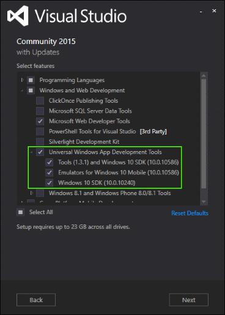

# Prepare-se para começar

É mais fácil do que pensa. Siga estas instruções e comece a criar aplicativos da Plataforma Universal do Windows (UWP) para Windows 10.

> [!NOTE]
> Você é um usuário do Mac? Ou talvez você não queira instalar nada em seu computador ainda? Experimente as [máquinas virtuais baseadas na Web configuradas para desafios de codificação do Build2016](https://developer.microsoft.com/windows/projects/events/build2016/all/codingchallenges).

## 1. Obtenha o Windows 10

Para desenvolver aplicativos UWP, você precisará da versão mais recente do Windows.

-   [Obter o Windows 10 online](http://go.microsoft.com/fwlink/p/?LinkId=619312)

Você é assinante do MSDN? É possível obter os downloads ISO aqui:

-   Obtenha o Windows 10 em [Downloads para Assinantes do MSDN](http://go.microsoft.com/fwlink/p/?LinkId=266384)

## 2. Baixe ou atualize o Visual Studio

O Microsoft Visual Studio 2015 ajuda você a projetar, codificar, testar e depurar seus aplicativos.

Se você ainda não tem o Visual Studio 2015, clique neste link para instalar o Microsoft Visual Studio Community 2015 grátis. Esse download inclui simuladores de dispositivos e telefones para testar seus aplicativos:

-   [Baixar ferramentas de desenvolvedor do Windows 10](https://go.microsoft.com/fwlink/p/?LinkID=534189)

Quando você instalar o Visual Studio, use a opção personalizada e verifique se todas as opções de ferramentas de desenvolvimento de aplicativos universais do Windows estão selecionadas, conforme mostrado aqui.

## 3. Habilitar seu dispositivo para desenvolvimento

É importante testar os aplicativos UWP em computadores e telefones reais. Antes de implantar aplicativos em seu PC ou Windows Phone, você precisa habilitá-lo para desenvolvimento.

-   Para instruções detalhadas, consulte [Enable your device for development](enable-your-device-for-development.md).

## 4. Registrar como um desenvolvedor de aplicativo

Você pode começar a desenvolver aplicativos agora, mas antes de enviá-los para a loja, você precisa de uma conta de desenvolvedor.

-   Para obter uma conta de desenvolvedor, acesse a página [Inscrever-se](sign-up.md).

## O que vem em seguida?

Após instalar as ferramentas e obtido uma licença de desenvolvedor ou uma conta de desenvolvedor, use o nosso tutorial para criar seu primeiro aplicativo:

-   Tutoriais para [Criar seu primeiro aplicativo](your-first-app.md)

## Deseja mais ferramentas e downloads?

Para obter a lista completa de ferramentas e downloads, consulte [Downloads](http://go.microsoft.com/fwlink/p/?linkid=285935).

<!--HONumber=Aug16_HO3-->

