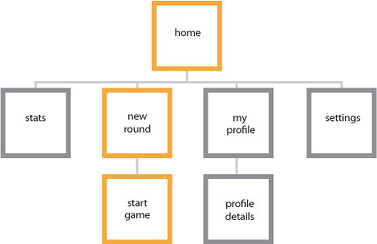

#  Compilando um app complexo da Plataforma Universal do Windows (UWP)

Nas equipes de design da Microsoft, nosso processo de criação de aplicativo consiste em cinco estágios distintos: conceito, estrutura, dinâmica, visual e protótipo. Recomendamos que você adote um processo semelhante e se divirta criando novas experiências para o mundo aproveitar.

## Conceito

**Concentre-se o seu aplicativo**

Ao planejar o seu aplicativo Plataforma Universal do Windows (UWP), você deve determinar não apenas o que ele fará e para quem é, mas também o que terá de bom nele. No núcleo de cada grande aplicativo há um conceito forte, que fornece uma base sólida.

Por exemplo, você quer criar um aplicativo de fotos. Pensando nas razões que levam os usuários a trabalhar, salvar e compartilhar suas fotos, você percebe que eles querem reviver lembranças, interagir com outras pessoas por meio das fotos e manter as fotos protegidas. E o seu aplicativo precisa fazer tudo isso da melhor maneira possível, então você usa essas metas de experiência como um guia para o restante do processo de design.

**Qual é seu aplicativo?** Comece com um conceito amplo e relacione tudo o que o seu aplicativo pode fazer pelos usuários.

Por exemplo, digamos que você queira criar um aplicativo que ajude as pessoas a planejar suas viagens. Aqui estão algumas ideias que você pode esboçar na parte de trás de um guardanapo:

-   Pegar mapas de todos os locais em um itinerário e leve-os com você na viagem.
-   Informar-se sobre eventos especiais que acontecem durante a sua estada na cidade.
-   Deixar os colegas de viagem criar listas separadas, mas compartilháveis, de atividades e atrações imperdíveis.
-   Deixar os colegas de viagem compilar todas as suas fotos e as compartilhar com os amigos e familiares.
-   Saber sobre destinos recomendados com base nos preços de voos.
-   Encontre uma lista consolidada de ofertas em restaurantes, lojas e atividades próximo ao seu destino.

**O que é excelente para seu aplicativo?** Volte uma etapa e veja a sua lista de ideias para saber se algo em especial chama a sua atenção. Experimente reduzir a lista a apenas uma situação na qual queira se concentrar. No processo, você pode eliminar muitas ideias boas, mas dizer "não" a elas é crucial para melhorar determinada situação.

Depois de escolher uma situação individual, decida como você explicaria a uma pessoa comum, descrevendo em uma frase, o que seu aplicativo faz de melhor. Por exemplo:

-   Meu aplicativo de viagens é ótimo em ajudar amigos a criar itinerários colaborativos para viagens em grupo.
-   Meu aplicativo de ginástica é ótimo em permitir que amigos acompanhem a evolução de seus exercícios e compartilhem suas conquistas entre si.
-   Meu aplicativo de compras é ótimo para ajudar famílias a coordenar as compras semanais no mercado para não duplicarem ou perderem uma compra.

Essa é declaração "o que há de bom" do seu aplicativo e pode guiar muitas decisões de design e compensações que você faz quando cria o seu aplicativo. Foque nas situações em que você quer os usuários usem o seu aplicativo. Tome cuidado para não transformar essa lista em uma lista de recursos. Ela deve ser sobre o que os seus usuários poderão fazer, em vez de o que o seu aplicativo poderá fazer.

**O funil de design**

É muito tentador—tendo pensado em uma ideia que você gostou—ir em frente e desenvolver o aplicativo; talvez, até começar de certa forma a produção. Mas digamos que você faça isso e, em seguida, uma outra ideia interessante venha à mente. É natural que você seja tentado a ficar com a ideia em que você já investiu, independentemente dos méritos relativos das duas ideias. Se você tivesse pensado na outra ideia no início do processo! Bem, o funil de design é uma técnica que ajuda a descobrir suas melhores ideias o mais cedo possível.

O termo "funil" vem de sua forma. Na extremidade ampla do funil, muitas ideias entram e cada uma é percebida como um artefato de baixíssima fidelidade do design (um esboço, talvez, ou um parágrafo de texto). Como essa coleção de ideias percorre em direção à parte mais estreita do funil, o número de ideias é diminuído, enquanto a fidelidade dos artefatos que representam as ideias aumenta. Cada artefato deve capturar apenas as informações necessárias para julgar uma ideia em relação à outra ou para responder uma pergunta em particular, como "isso é utilizável ou intuitivo?". *Não gaste mais tempo e esforço em cada fase do que isso*. Algumas ideias vão cair no esquecimento quando você testá-las, e você vai aceitar isso porque não vai investir nelas mais do que o necessário para julgar a ideia. As ideias que sobrevivem para avançar ainda mais no funil receberão sucessivamente tratamentos de alta fidelidade. No final, você terá um único artefato de design que represente a ideia vencedora. Essa é a ideia que ganhou por causa de seus méritos, e não apenas porque veio em primeiro lugar. Você terá projetado o melhor aplicativo que pôde.

## Estrutura

**Organização torna tudo mais fácil**

Quando você estiver feliz com o seu conceito, estará preparado para o próximo estágio—criar o plano gráfico do seu aplicativo. A arquitetura da informação (AI) dá ao seu conteúdo a integridade estrutural de que ele precisa. Ela ajuda a definir o modelo navegacional do seu aplicativo e, consequentemente, a identidade dele. Planejando como o seu conteúdo será organizado—e como os seus usuários descobrirão tal conteúdo—você pode ter uma ideia melhor de como vai ser a experiência dos usuários em relação com seu aplicativo.

Uma boa IA não só facilita cenários de usuários, mas ajuda você a imaginar as telas principais para começar. O aplicativo [Audible](https://go.microsoft.com/fwlink/p/?LinkID=268089) por exemplo, lança diretamente em um hub que permite o acesso à biblioteca, loja, notícias e estatísticas do usuário. A experiência é focada, para que os usuários possam obter e desfrutar de audiobooks rapidamente. Níveis mais profundos do aplicativo focam em tarefas mais específicas.

Para obter diretrizes relacionadas, veja [Noções básicas de design de navegação](../design/basics/navigation-basics.md).

## Dynamics

**Execute seu conceito**

Se a fase de concepção é sobre a definição de propósito de seu aplicativo, o estágio de dinâmica é todo sobre a execução desse propósito. Isso pode ser alcançado de muitas formas, como usar esboços para delinear os fluxos de página (como você vai de um lugar ao próximo dentro do aplicativo para chegar ao objetivo) e pensas sobre a voz e as palavras usadas na IU do seu aplicativo. Wireframes são ferramentas rápidas de baixa fidelidade que ajudam-no a tomar decisões críticas sobre o fluxo de usuários do seu aplicativo.

O fluxo de seu aplicativo deve estar diretamente relacionado à declaração de excelência e ajudar os usuários a realizar determinada situação que você quer destacar. Os ótimos aplicativos têm fluxos fáceis de aprender e requerem esforço mínimo. Comece a pensar em um nível tela-a-tela—veja seu aplicativo como se estivesse usando-o pela primeira vez. Quando identificar cenários de usuários para as páginas que você criar, você vai dar às pessoas exatamente o que elas querem, sem muitos toques de tela desnecessários. A dinâmica também tem a ver com movimento. As capacidades de movimento corretas irão determinar a fluidez e facilidade de uso de uma página para a próxima.

Técnicas comuns que ajudam a concluir esta etapa:

-   Descrever o fluxo: O que vem em primeiro lugar, o que vem em seguida?
-   O fluxo do storyboard: Como os usuários devem mover por meio de sua interface do usuário para concluir o fluxo?
-   Protótipo: Experimente o fluxo com um protótipo rápido.

**O que os usuários devem ser capazes de fazer?** Por exemplo, o aplicativo de viagens é "ótimo para ajudar amigos a criar itinerários colaborativos para viagens em grupo". Vamos listar os fluxos que queremos habilitar:

-   Criar uma viagem com informações gerais.
-   Convide amigos para participar de uma viagem.
-   Participar da viagem de um amigo.
-   Ver itinerários recomendados por outros viajantes.
-   Adicionar destinos e atividades às viagens.
-   Editar e comentar sobre destinos e atividades que os amigos adicionaram.
-   Compartilhe itinerários para amigos e parentes seguirem.

## Visual

**Fale sem palavras**

Depois de estabelecer a dinâmica do seu aplicativo, você pode fazer com que seu aplicativo brilhe com o acabamento visual correto. Ótimos visuais definem não só o visual de seu aplicativo, mas sua sensação e forma que ganha vida através da animação e movimento. Sua escolha da paleta de cores, ícone, e gráficos são apenas alguns exemplos dessa linguagem visual.

Todos os aplicativos têm a sua própria identidade original, então explore os sentidos visuais que você pode tomar com o seu aplicativo. O conteúdo deve orientar o visual; não deixe que a aparência defina o seu conteúdo.

## Protótipo

**Refinar sua obra de arte**

Criar o protótipo é um estágio no *funil de design*—uma técnica sobre a qual já falamos—em que o artefato que representa a sua ideia é desenvolvido para além do esboço, mas ainda é menos complicado que um aplicativo concluído. Um protótipo pode ser um fluxo de telas desenhadas à mão mostrado para um usuário. A pessoa que executa o teste pode responder a estímulos do usuário, colocando diferentes telas para baixo, ou colando ou descolando pequenos pedaços de IU nas páginas, para simular um aplicativo em execução. Ou, um protótipo pode ser um aplicativo muito simples que simula alguns fluxos de trabalho, desde que o operador siga um roteiro e pressione os botões certos. Nesta fase, as ideias começam a realmente ganham vida e seu trabalho duro é testado a sério. Quando prototipar áreas de seu aplicativo, leve o tempo necessário para esculpir e refinar os componentes que precisam mais.

Para novos desenvolvedores, não pode ser enfatizada suficiente: Criar ótimos aplicativos é um processo iterativo. Recomendamos que você prototipe cedo e frequentemente. Como qualquer esforço criativo, os melhores aplicativos são o produto de um processo intensivo de teste e erro.

## Decidir quais recursos serão incluídos

Quando se sabe o que os usuários querem e como ajudá-los a conseguir o que querem, você pode dar uma olhada nas ferramentas específicas na sua caixa de ferramentas. Conheça a Plataforma Universal do Windows (UWP) e associe recursos com as necessidades do seu aplicativo. Certifique-se de seguir as [diretrizes para a experiência do usuário](https://developer.microsoft.com/windows/apps/design) para cada recurso.
<!--need URL for landing page -->

Técnicas comuns:

-   Pesquisa de plataforma: Descubra quais recursos oferecidas pela plataforma e como você pode usá-los.
-   Diagramas de associação: Conecte-se seus fluxos com recursos.
-   Protótipo: Exercitar os recursos para garantir que eles fazem o que você precisa.

**{1&gt;{2&gt;contratos**  seu aplicativo pode participar de contratos de aplicativo que permitem que os fluxos de usuário amplo, entre aplicativos, entre recursos.

-   **Compartilhe**  permitem que os usuários compartilhem conteúdo de seu aplicativo com outras pessoas por meio de outros aplicativos e receber conteúdo compartilhável de outras pessoas e aplicativos, também.
-   **Reproduzir em**  permitem que seus usuários aproveitem o áudio, vídeo ou imagens transmitidas do seu aplicativo para outros dispositivos em sua rede doméstica.
-   **Seletor de arquivos e extensões de seletor de arquivo**   permitem aos usuários carregar e salvar seus arquivos do sistema de arquivos local, dispositivos de armazenamento conectados, grupo doméstico ou até mesmo outros aplicativos. Você também pode oferecer uma extensão de seletor de arquivos para que outros aplicativos possam rodar o conteúdo do seu aplicativo.

Para saber mais, consulte as [extensões e contratos de aplicativo](https://docs.microsoft.com/previous-versions/windows/apps/hh464906(v=win.10)).
<!-- Win 8 page. Should have replacement. -->

**Exibições diferentes fatores forma e as configurações de hardware**  Windows colocam os usuários em seu aplicativo em primeiro plano e de cobrança. Você provavelmente deseja que a interface do usuário do seu aplicativo chame a atenção independentemente do tipo de dispositivo, do modo de entrada, da orientação de exibição, da configuração de hardware e das circunstâncias que o usuário decida usá-lo.

**Primeiro de toque**  Windows fornece uma experiência de toque exclusiva e diferenciada que mais do que simplesmente emula a funcionalidade do mouse.

Por exemplo, zoom semântico é uma forma de toque otimizado para navegar por uma grande quantidade de conteúdo. Os usuários podem fazer movimentos panorâmicos ou rolar por categorias de conteúdo e depois ampliar essas categorias para ver informações cada vez mais detalhadas. Você pode usar isso para apresentar o seu conteúdo de forma mais prática, visual e informativa do que com a navegação tradicional e os padrões de layout, como guias.

Claro, você pode se beneficiar de inúmeras vantagens de interações de toque, como girar, aplicar panorâmica, passar o dedo, dentre outras. Saiba mais sobre [Toque e outras interações do usuário](../design/input/input-primer.md).

**Novo e envolvente**  Certifique-se de que seu aplicativo parece atualizado e interaja com os usuários com essas experiências de padrão:

-   **Animações**  usar nossa biblioteca de animações para tornar seu aplicativo rápido e fluido para seus usuários. Ajude os usuários a entenderem as alterações de contexto e vincule experiências com transições visuais. Saiba mais sobre [animações na interface do usuário](../graphics/animations-overview.md).
-   **Notificações do sistema**  permitem que os usuários saber sobre o conteúdo sensível ao tempo ou pessoal relevante por meio de notificações do sistema e convidá-los para seu aplicativo, mesmo quando seu aplicativo é fechado. Saiba mais sobre [blocos, selos e notificações do sistema](../design/shell/tiles-and-notifications/index.md).
-   **Blocos de aplicativos**  fornecer atualizações atualizadas e relevantes para convencer usuários volta a seu aplicativo. Há mais sobre isso na próxima seção. Saiba mais sobre [blocos de aplicativos](../design/shell/tiles-and-notifications/creating-tiles.md).

**Personalização**

-   **As configurações**  permitem que os usuários criar a experiência que eles querem, salvando as configurações do aplicativo. Consolide todas as suas configurações em uma tela, e então permita que os usuários configurem o seu aplicativo usando um mecanismo comum com o qual já estejam familiarizados. Saiba mais sobre [adicionar configurações de aplicativos](../design/app-settings/app-settings-and-data.md).
-   **Roaming**  criar uma experiência contínua entre dispositivos, roaming de dados que permite aos usuários escolher um direito de tarefa de onde parou e preserva a experiência do usuário que eles se preocupam mais com, independentemente do dispositivo que está sendo usada. Facilite o uso do seu aplicativo em qualquer lugar—na cozinha, no computador da família ou de trabalho, no tablet pessoal, e outros fatores forma—mantendo configurações e estados com roaming. Saiba mais sobre [gerenciamento de dados de aplicativos](../design/app-settings/store-and-retrieve-app-data.md) e consulte [Diretrizes de dados de aplicativo em roaming](https://docs.microsoft.com/windows/uwp/design/app-settings/store-and-retrieve-app-data).
-   **Blocos do usuário**    tornar seu aplicativo mais pessoal para seus usuários ao carregar sua imagem de bloco de usuário ou permitir que os usuários definir o conteúdo de seu aplicativo como seu bloco pessoal em todo o Windows.

**Recursos do dispositivo**  Certifique-se de que seu aplicativo tira total proveito dos recursos dos dispositivos atuais.

-   **Gestos de proximidade**  permitir que os usuários se conectar a dispositivos com outros usuários que estão fisicamente próximos, tocando fisicamente os dispositivos juntos (jogos com vários participantes). Saiba mais sobre [proximidade e toques](https://docs.microsoft.com/previous-versions/windows/apps/hh465229(v=win.10)).
-   **Câmeras e dispositivos de armazenamento externo**  que os usuários se conectem suas câmeras internas ou conectado para bate-papo e conferência, gravação vlogs, levando pics de perfil, documentando o mundo ao redor deles, ou qualquer atividade de seu aplicativo é excelente. Saiba mais sobre o [acesso a conteúdo em armazenamento removível](https://docs.microsoft.com/previous-versions/windows/apps/hh465189(v=win.10)).
-   **Outros sensores e acelerômetros**     dispositivos vêm com um número de sensores hoje em dia. O seu aplicativo pode esmaecer ou clarear o seu visor com base na luz ambiente, redirecionar o fluxo da IU caso o usuário girar o visor, ou reagir a qualquer movimento físico. Saiba mais sobre [sensores](../devices-sensors/sensors.md).
-   **Geolocalização**  Use informações de localização geográfica de dados padrão da web ou de sensores de localização geográfica para ajudar os usuários a resolver, localizar sua posição em um mapa ou obter avisos nas proximidades de pessoas, atividades e destinos. Saiba mais sobre [localização geográfica](https://docs.microsoft.com/previous-versions/windows/apps/hh465139(v=win.10)).

Vamos considerar o aplicativo de viagens novamente. Para ser ótimo em ajudar amigos a criar de forma colaborativa itinerários de viagens em grupo, você pode usar alguns destes recursos:

-   Compartilhamento: Os usuários compartilham viagens futuras e seus itinerários a várias redes sociais para compartilhar o entusiasmo de pré-trip com seus amigos e familiares.
-   Pesquisar: Os usuários pesquisar e localizar atividades ou destinos de outras pessoas compartilhado ou público itinerários que eles podem incluir em seus próprios viagens.
-   Notificações: Os usuários são notificados quando seus itinerários de atualização é um complemento de viagem.
-   Configurações: Os usuários configurar suas preferências, o aplicativo, como quais viagem deve abrir as notificações ou quais grupos sociais são permitidos para pesquisar roteiros dos usuários.
-   Zoom semântico: Os usuários navegam pela linha do tempo de seu roteiro e ampliar para ver mais detalhes de uma longa lista de atividades que eles já planejou.
-   Blocos do usuário: Os usuários escolher a imagem que desejam que apareça quando eles compartilham sua viagem com amigos.

## Decida como rentabilizar seu aplicativo

Você tem várias opções para ganhar dinheiro com o seu aplicativo. Se você decidir usar anúncios ou promoções, pode criar sua interface de acordo com esses recursos. Para obter mais informações, consulte o tópico sobre [planejamento para monetização](../monetize/index.md).

## Projetar a experiência do usuário do aplicativo

Isso diz respeito aos conceitos básicos corretos. Agora que você sabe o que o seu aplicativo faz de melhor e descobriu os fluxos para os quais deseja dar suporte, pode começar a pensar nos conceitos básicos do design da experiência do usuário.

**Como você deve organizar o conteúdo de interface do usuário?**   A maioria dos conteúdo do aplicativo pode ser organizado em alguma forma de agrupamentos ou hierarquias. O que você escolhe como o agrupamento de nível superior do seu conteúdo deve corresponder ao foco da sua declaração de excelência.

Usando o aplicativo de viagens como exemplo, há várias maneiras de agrupar itinerários. Se o foco do aplicativo for descobrir destinos interessantes, você pode agrupá-los com base em interesses, como aventura, diversão sob o sol ou refúgios românticos. Entretanto, como o foco do aplicativo é planejar viagens com amigos, faz mais sentido organizar itinerários baseados em círculos sociais, como familiares, amigos ou colegas de trabalho.

Escolher como você quer agrupar o conteúdo ajuda a decidir que páginas ou visualizações são necessárias no seu aplicativo. Consulte Noções básicas da interface do usuário para obter mais informações.

**Como você apresentar o conteúdo de interface do usuário?** Depois de decidir como organizar a interface do usuário, você pode definir metas de experiência do usuário que especifiquem como a interface do usuário é construída e apresentada ao usuário. Em qualquer situação, você deve garantir que o seu usuário possa continuar usando e aproveitando o seu aplicativo o mais rápido possível. Para fazer isso, decida quais partes da interface do usuário precisam ser apresentadas primeiro e verifique se essas partes estão completas antes de perder tempo construindo as partes não críticas.

No aplicativo de viagens, provavelmente, a primeira coisa que o usuário irá querer fazer no aplicativo é encontrar um itinerário de viagem específico. Para apresentar essa informação o mais rápido possível, você deve mostrar a lista de viagens primeiro, usando um controle **ListView**.

Depois de mostrar a lista de viagens, você pode começar a carregar outros recursos, como um feed de notícias sobre viagens de amigos.

**Quais comandos e superfícies de interface do usuário precisa?**   Examine os fluxos que você identificou anteriormente. Para cada fluxo, crie um esboço das etapas que os usuários devem seguir.

Vamos dar uma olhada no fluxo "Compartilhar itinerários para que amigos e familiares sigam". Vamos supor que o usuário já criou uma viagem. O compartilhamento do itinerário de uma viagem pode precisar destas etapas:

1.  O usuário abre o aplicativo e vê uma lista de viagens que ele criou.
2.  O usuário toca na viagem que quer compartilhar.
3.  Os detalhes da viagem aparecem na tela.
4.  O usuário acessa uma interface para iniciar o compartilhamento.
5.  O usuário seleciona ou insere o email ou nome do amigo com quem quer compartilhar a viagem.
6.  O usuário acessa uma interface para finalizar o compartilhamento.
7.  O seu aplicativo atualiza os detalhes da viagem com a lista de pessoas com quem o usuário compartilhou sua viagem.

Durante esse processo, você começa a ver que IU você precisa criar e os detalhes adicionais que você precisa descobrir (como escrever um texto cliché de email padrão para amigos que ainda não usam o aplicativo). Você também pode começar a eliminar etapas desnecessárias. Talvez o usuário não precise realmente ver os detalhes da viagem antes de compartilhá-la, por exemplo. Quanto mais limpo o fluxo, mais fácil usá-lo.

Para obter mais detalhes sobre como usar superfícies diferentes, dê uma olhada em <!--[Command design basics](../design/basics/commanding-basics.md)-->.

**O que o fluxo deve parecer como?** Quando definir as etapas que o usuário realizará, você pode transformar esse fluxo em metas de desempenho. Para saber mais, consulte [Planejar o desempenho](../debug-test-perf/planning-and-measuring-performance.md).

**Como organizar comandos?**    Use sua estrutura de tópicos das etapas de fluxo para identificar potenciais comandos que você precisa para criar. Depois, pense nos locais onde usar estes comandos em seu aplicativo.

-   **Sempre tente usar o conteúdo.**    Sempre que possível, permitem que os usuários manipulam diretamente o conteúdo na tela do aplicativo, em vez de adicionar comandos que atuam no conteúdo. Por exemplo, no aplicativo de viagens, permita que os usuários reorganizem seu itinerário, arrastando e soltando as atividades em uma lista na tela, em vez de selecionar a atividade e usar botões de comando Para cima ou Para baixo.
-   **Se você não pode usar o conteúdo.** Coloque comandos em uma destas superfícies de IU se você não puder usar o conteúdo:

    -   No [barra de comandos](https://docs.microsoft.com/windows/uwp/controls-and-patterns/app-bars): Você deve colocar a maioria dos comandos na barra de comandos, que normalmente é oculto até que o usuário toca para torná-la visível.
    -   Na tela do aplicativo: Se o usuário estiver em uma página ou exibição que tem uma finalidade única, você pode fornecer comandos para essa finalidade diretamente na tela. Deve haver muito pouco desses comandos presentes.
    -   Em um [menu de contexto](https://docs.microsoft.com/windows/uwp/controls-and-patterns/menus): Você pode usar os menus de contexto para ações de área de transferência (como Recortar, copiar e colar), ou para os comandos que se aplicam ao conteúdo que não pode ser selecionado (como adicionar um pin de envio por push para um local em um mapa).

**Decida como dispor do seu aplicativo em cada exibição.**    Orientações retrato e paisagem e dá suporte ao redimensionamento de aplicativos de tela inteira para uma largura mínima para qualquer largura, dá suporte ao Windows. Você quer que o seu aplicativo tenha uma boa aparência e funcione perfeitamente em qualquer site, em qualquer tela, em ambas as orientações. Isso significa que você precisa planejar o layout dos elementos da interface para diferentes tamanhos e exibições. Ao fazer isso, a IU do seu aplicativo muda de maneira fluida para atender às necessidades e preferências do usuário.

Para obter mais informações sobre a criação de diferentes tamanhos de tela, consulte [Tamanhos de tela e pontos de interrupção para um design responsivo](https://docs.microsoft.com/en-us/windows/uwp/layout/screen-sizes-and-breakpoints-for-responsive-design).

## Causar uma boa primeira impressão

Pense naquilo que você quer que os usuários pensem, sintam ou façam assim que iniciarem o seu aplicativo. Revise a sua declaração de excelência. Mesmo que você não tenha a chance de informar pessoalmente seus usuários sobre a especialidade do seu aplicativo, pode transmitir a mensagem a eles ao passar a sua primeira impressão. Tire vantagem disto:

**Bloco e notificações**    o bloco é a aparência do seu aplicativo. Entre os vários aplicativos encontrados na tela Inicial do usuário, o que vai fazer o usuário querer abrir o seu? Crie um bloco que destaque a marca do seu aplicativo e mostre o que ele tem de melhor. Use notificações de bloco para o seu aplicativo parecer sempre novo e relevantes, atraindo o usuário de volta para o seu aplicativo várias vezes.

**Tela inicial**  a tela inicial deverá ser carregado o mais rápido possível e permanecer na tela, somente quando você precisa inicializar o estado do aplicativo. O que você mostra na tela inicial deve expressar a personalidade do seu aplicativo.

**Primeiro, inicie**  antes que os usuários se inscrever para o seu serviço, faça logon em sua conta ou adicionem seu próprio conteúdo, o que eles verão? Tente demonstrar o valor do seu aplicativo antes de solicitar informações dos usuários. Considere mostrar amostra de conteúdos para que as pessoas possam dar uma olha e entender o que o seu aplicativo faz antes de você pedir a eles que confirmem.

**Home page**  a home page é onde você pode colocar os usuários sempre que iniciar seu aplicativo. O conteúdo aqui deve ter um foco claro e, imediatamente, apresentar para que o seu aplicativo foi feito. Dê um objetivo maior a essa página e confie que as pessoas explorem o restante do seu aplicativo. Concentre-se em eliminar as distrações na página de destino, e não na descoberta.

## Valide seu design

Antes de você se aprofundar muito no desenvolvimento do seu aplicativo, deve validar o seu design ou protótipo de acordo com diretrizes, impressões de usuário e exigências para evitar ter que refazer o trabalho depois. Cada recurso tem um conjunto de diretrizes de experiência do usuário para ajudá-lo a melhorar sua e um conjunto de requisitos de Store que você precisa cumprir para publicar seu aplicativo em que a Microsoft Store. Você pode usar o [Kit de Certificação de Aplicativos Windows](https://developer.microsoft.com/windows/develop/app-certification-kit) para testar a conformidade técnica com os requisitos da Loja. Você também pode usar as ferramentas de desempenho no Microsoft Visual Studio para garantir que o usuário tenha uma excelente experiência em todos os cenários.

Use as [Diretrizes detalhadas de experiência do usuário para aplicativos UWP](https://developer.microsoft.com/windows/design) para manter o foco em recursos importantes. Use as [ferramentas de desempenho do Visual Studio](https://docs.microsoft.com/visualstudio/profiling/profiling-tools?view=vs-2015) para analisar o desempenho de cada uma das situações do seu aplicativo.
