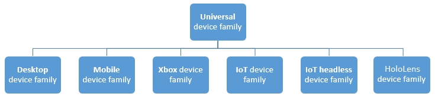
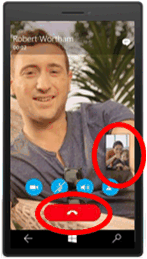

# <a name="intro-to-the-universal-windows-platform"></a>Introdução à Plataforma Universal do Windows

Neste guia, você aprenderá sobre a UWP (Plataforma Universal do Windows) e o Windows 10:

-   O que é uma família de dispositivos e como decidir qual delas escolher.
-   O que é um SDK de extensão e como ele fornece acesso a APIs específicos de uma classe de dispositivos.
-   Novos controles de interface do usuário e painéis para adaptar sua interface do usuário a diferentes tamanhos de tela ou rotações.
-   Como entender e controlar a superfície de API que está disponível para seu aplicativo.

O Windows 10 apresenta a UWP (Plataforma Universal do Windows), que fornece uma plataforma de aplicativo comum disponível em cada dispositivo que executa o Windows 10. A UWP fornece uma API básica garantida entre dispositivos. Isso significa que você pode criar um único pacote de aplicativo que pode ser instalado em uma ampla variedade de dispositivos. E, com esse pacote do aplicativo único, a Windows Store fornece um canal de distribuição unificado para acessar todos os tipos de dispositivos no qual seu aplicativo pode ser executado. Os aplicativos destinados à UWP podem chamar não apenas as APIs do WinRT que são comuns a todos os dispositivos, mas também as APIs (incluindo APIs do Win32 e .NET) que são específicas da classe de dispositivos na qual o aplicativo está sendo executado.


Como seu aplicativo UWP é executado em uma ampla variedade de dispositivos com diferentes fatores forma e tipos de entrada, você quer que ele seja adaptado para cada dispositivo e seja capaz de desbloquear os recursos exclusivos de cada dispositivo. Além da camada de API básica garantida, você pode escrever o código para acessar APIs específicas de dispositivo para que seu aplicativo incremente os recursos específicos de um tipo de dispositivo durante a apresentação de uma experiência diferente em outros dispositivos. Controles de interface do usuário adaptáveis e novos painéis de layout ajudam você a adaptar sua interface do usuário em uma ampla variedade de resoluções e tamanhos de tela de dispositivo.

## <a name="device-families"></a>Famílias de dispositivos

Para entender como o Windows 10 permite a você escolher diferentes classes de dispositivos, é útil entender um conceito chamado famílias de dispositivos. Uma família de dispositivos identifica as APIs, as características do sistema e os comportamentos esperados em uma classe de dispositivos. Ela também determina o conjunto de dispositivos nos quais seu aplicativo pode ser instalado na Loja. Uma família de dispositivos (exceto a família de dispositivos Universal) é implementada como um SDK de extensão, que abordaremos em breve. Esta é a hierarquia da família de dispositivos.



Uma família de dispositivos define um conjunto de APIs e tem controle de versão. Uma família de dispositivos é a base de um sistema operacional. Os computadores e tablets executam o sistema operacional de desktop, que é baseado em uma família de dispositivos desktop. Telefones executam o sistema operacional móvel, que é baseado na família de dispositivos móveis.

Cada família de dispositivos filho adiciona suas próprias APIs àqueles que ela herda. A união resultante de APIs de uma família de dispositivos filhos tem a garantia de estar presente no sistema operacional com base naquela família de dispositivos e em cada dispositivo executando o que o sistema operacional.

Uma vantagem da família de dispositivos universal é que seu aplicativo pode ser executado em qualquer ou até mesmo em todas as variedades de dispositivos, em telefones, tablets, computadores desktop, Surface Hubs, consoles Xbox e HoloLens. Seu aplicativo também pode usar código adaptável para detectar e usar recursos de um dispositivo que estiverem fora da família de dispositivos universais dinamicamente.

A decisão sobre qual família de dispositivos (ou famílias) será destinado seu aplicativo, é você quem deve fazer. E essa decisão afeta seu aplicativo nesses aspectos importantes. Isto determina:

-   O conjunto de APIs que seu aplicativo pode presumir que esteja presente quando ele é executado (e, portanto, pode chamar livremente).
-   O conjunto de chamadas de API que são seguras somente dentro das instruções condicionais.
-   O conjunto de dispositivos em que seu aplicativo pode ser instalado a partir da Loja (e, consequentemente, os fatores forma que você precisa considerar ao criar a interface do usuário).

Há dois consequências principais de fazer uma escolha de família de dispositivos: a superfície de API que pode ser chamada incondicionalmente pelo aplicativo e o número de dispositivos que o aplicativo pode acessar. Esses dois fatores envolvem as compensações estão inversamente relacionados. Por exemplo, um aplicativo UWP é um aplicativo especificamente direcionado à família de dispositivos universais e consequentemente está disponível para todos os dispositivos. Um aplicativo destinado à família de dispositivos universal pode pressupor a presença apenas das APIs da família de dispositivos universal. Outras APIs devem ser chamadas condicionalmente. Além disso, esse aplicativo deve ter uma interface de usuário altamente adaptável e recursos de entrada abrangentes porque ele pode ser executado em uma ampla variedade de dispositivos. Um aplicativo móvel do Windows é um aplicativo especificamente direcionado à família de dispositivo móvel e está disponível para dispositivos cujo sistema operacional é baseado na família de dispositivos móveis (o que inclui telefones, tablets e dispositivos semelhantes). Um aplicativo de família de dispositivo móvel pode pressupor a presença de todas as APIs na família de dispositivos móveis e sua interface do usuário tem que ser moderadamente adaptável. Um aplicativo destinado à família de dispositivo IoT pode ser instalado apenas em dispositivos IoT e pode pressupor a presença de todas as APIs na família de dispositivos IoT. Esse aplicativo pode ser muito especializado em sua interface do usuário e recursos de entrada porque você sabe que ele será executado apenas em um tipo específico de dispositivo.

<iframe src="https://channel9.msdn.com/Blogs/One-Dev-Minute/Introduction-to-UWP-and-Device-Families/player" width="640" height="360" allowFullScreen frameBorder="0"></iframe>

Aqui estão algumas considerações para ajudá-lo a decidir qual família de dispositivo se focar:

**Aumentar o alcance do seu aplicativo**

Para atingir a máxima variedade de dispositivos com o seu aplicativo e para que ele seja executado na maioria dos tipos de dispositivos possíveis, seu aplicativo deverá se destinar à família de dispositivos universais. Fazendo isso, o aplicativo direciona automaticamente cada família de dispositivo baseada na universal (no diagrama, todos os filhos da universal). Isso significa que o aplicativo é executado em cada sistema operacional com base nessas famílias de dispositivo e em todos os dispositivos que executam esses sistemas operacionais. A única API que têm garantia de estar disponível em todos os dispositivos é o conjunto definido pela versão específica da família de dispositivos universais desejado. Para descobrir como um aplicativo pode chamar APIs fora da versão de família de dispositivos destinada, consulte [Escrevendo código](#writing-code) mais adiante neste tópico.

**Limitando seu aplicativo a um tipo de dispositivo**

Você pode não querer que seu aplicativo seja executado em uma ampla variedade de dispositivos, talvez que seja especializado para um computador desktop ou para um console Xbox. Nesse caso, você pode optar por direcionar seu aplicativo a uma das famílias de dispositivo filho. Por exemplo, se você estiver direcionado a família de dispositivos desktops, as APIs que estarão disponíveis para o seu aplicativo incluem as APIs herdadas de família de dispositivos universais e as APIs que são específicas para a família de dispositivos desktops.

**Limitar seu aplicativo a um subconjunto de todos os dispositivos possíveis**

Em vez de se destinar à família de dispositivos universais ou visando uma das famílias de dispositivos filhos, você pode direcionar à duas (ou mais) famílias de dispositivos filhos. Direcionar a desktop e dispositivo móvel pode fazer sentido para o seu aplicativo. Ou desktop e HoloLens. Ou desktop, Xbox, Surface Hub e assim por diante.

**Excluir suporte para uma determinada versão de uma família de dispositivos**

Em casos raros, você pode querer que seu aplicativo seja executado em todos os dispositivos exceto aqueles que com determinada versão de uma família de dispositivos específica. Por exemplo, digamos que seu aplicativo se destine a versão 10.0.x.0 da família de dispositivos universais. Quando houver alterações da versão do sistema operacional no futuro, digamos que altera para 10.0.x.2, nesse ponto você poderá especificar se seu aplicativo pode ser executado em todos os dispositivos exceto 10.0.x.1 de versão para Xbox, destinando seu aplicativo para 10.0.x.0 da versão universal e 10.0.x.2 do Xbox. Seu aplicativo estará disponível para o conjunto de versões da família de dispositivos no Xbox 10.0.x.1 (inclusive) e versões anteriores.

Por padrão, o Microsoft Visual Studio especifica **Windows.Universal** como a família de dispositivos de destino no arquivo de manifesto do pacote do aplicativo. Para especificar a família ou as famílias de dispositivos para as quais seu aplicativo é oferecido na Loja, configure manualmente o elemento [**TargetDeviceFamily**](https://msdn.microsoft.com/library/windows/apps/dn986903) no arquivo Package.appxmanifest.

## <a name="extension-sdks"></a>SDKs de extensão

Depois que você tiver se decidido pela família de dispositivos ao qual seu aplicativo será destinado, adicione uma referência a SDKs de extensão que implementam as APIs dessa família de dispositivos.  Se você estiver direcionando a família de dispositivos Universal, não precisará fazer referência a um SDK de extensão. Mas, se você estiver direcionando uma família de dispositivos, além da Universal, no Visual Studio, adicionará uma referência ao SDK de extensão que corresponde à família de dispositivos que você escolheu.  Por exemplo, se você estiver direcionando a família de dispositivos móveis, adicionará uma referência às _Extensões do Windows Mobile para UWP_ no Gerenciador de Referências do Visual Studio.

A seleção de uma família de dispositivos não impede que você adicione SDKs de extensão de outros tipos de dispositivos. Você só precisará garantir que testará a presença das APIs não incluídas na família de dispositivos escolhida conforme descrito abaixo em [Escrevendo código](#writing-code).

## <a name="ui-and-universal-input"></a>Interface do usuário e entrada universal

Um aplicativo UWP pode ser executado em vários tipos diferentes de dispositivos que possuem diferentes formas de entrada, resoluções de tela, densidade de DPI e outras características exclusivas. O Windows 10 oferece novos controles universais, painéis de layout e ferramentas para ajudá-lo a adaptar a interface do usuário aos dispositivos em que o aplicativo pode ser executado. Por exemplo, você pode adaptar a interface do usuário para tirar proveito da diferença na resolução da tela quando seu aplicativo é executado em um computador desktop contra um dispositivo móvel.

Alguns aspectos da interface do usuário do seu aplicativo se adaptará automaticamente em todos os dispositivos. Controles como botões e controles deslizantes se adaptará automaticamente entre famílias de dispositivos e modos de entrada. O projeto de experiência do usuário do seu aplicativo, no entanto, talvez seja necessário adaptar-se dependendo do dispositivo que o aplicativo está sendo executado. Por exemplo, um aplicativo de fotos deve se adaptar a interface do usuário quando executado em um dispositivo pequeno, portátil para garantir que esse uso é ideal para uso com uma única mão. Quando o aplicativo de fotos é executado em um computador desktop, a interface do usuário deve se adaptar para tirar proveito do espaço adicional na tela.

O Windows ajuda a direcionar sua interface do usuário para vários dispositivos com os seguintes recursos:

-   Controles universais e painéis de layout ajudarão a otimizar sua interface do usuário para a resolução de tela do dispositivo
-   A manipulação de entrada comum permite que você receba a entrada por toque, caneta, mouse ou teclado, ou por um controlador, como o do Xbox da Microsoft
-   Ferramentas ajudam você a criar a interface do usuário que pode se adaptar a diferentes resoluções de tela
-   O dimensionamento adaptável ajusta a resolução e as diferenças de DPI entre dispositivos

### <a name="universal-controls-and-layout-panels"></a>Controles universais e painéis de layout

O Windows 10 inclui novos controles, como o calendário e o modo de exibição dividido. O controle de pivô, que estava disponível somente para o Windows Phone, agora também está disponível para a família de dispositivos universais.

Os controles foram atualizados para funcionar bem em telas maiores, adaptar-se com base no número de pixels da tela disponíveis no dispositivo e funcionar bem com vários tipos de entrada, como teclado, mouse, toque, caneta e controladores, como o controlador do Xbox.

Você pode descobrir que você precisa adaptar o layout da interface do usuário geral com base na resolução da tela do dispositivo em que seu aplicativo será executado. Por exemplo, um aplicativo de comunicação em execução em um desktop pode incluir um chamador e controles adequados à entrada do mouse no modo picture-in-picture:


No entanto, quando o aplicativo é executado em um telefone, devido ao menor tamanho da tela para execução, seu aplicativo pode eliminar o modo de exibição picture-in-picture e fazer com que o botão de chamada fique maior para facilitar a operação de uso com apenas uma das mãos:



Para ajudá-lo a adaptar o layout da interface do usuário geral com base na quantidade de espaço disponível na tela, o Windows 10 apresenta painéis adaptáveis e estados de projeto.

### <a name="design-adaptive-ui-with-adaptive-panels"></a>Projetar a interface do usuário adaptável com os painéis adaptáveis

Os painéis de layout especificam as posições e tamanhos para seus filhos, dependendo do espaço disponível. Por exemplo, o [**StackPanel**](https://msdn.microsoft.com/library/windows/apps/br209635) chama seus filhos de forma sequencial (horizontal ou verticalmente). [**Grid**](https://msdn.microsoft.com/library/windows/apps/br242704) é como uma grade CSS que coloca seus filhos em células.

O novo [**RelativePanel**](https://msdn.microsoft.com/library/windows/apps/dn879546) implementa um estilo de layout que é definido pelas relações entre os elementos filho. Ele deve ser usado na criação de layouts de aplicativo que podem se adaptar a mudanças de resolução de tela. O **RelativePanel** facilita o processo de reorganização de elementos definindo relações entre os elementos, o que permite criar uma interface do usuário mais dinâmica sem o uso de layouts aninhados.

No exemplo a seguir, **blueButton** será exibido à direita de **textBox1**, independentemente das alterações na orientação ou layout, e **orangeButton** aparecerá imediatamente abaixo e alinhado a **blueButton**, mesmo se a largura de **textBox1** alterar à medida que o texto é inserido. Isso anteriormente exigiria linhas e colunas em uma **Grid** para atingir esse efeito, mas agora pode ser feito usando muito menos marcação.


```XML
<RelativePanel>
    <TextBox x:Name="textBox1" Text="textbox" Margin="5"/>
    <Button x:Name="blueButton" Margin="5" Background="LightBlue" Content="ButtonRight" RelativePanel.RightOf="textBox1"/>
    <Button x:Name="orangeButton" Margin="5" Background="Orange" Content="ButtonBelow" RelativePanel.RightOf="textBox1" RelativePanel.Below="blueButton"/>
</RelativePanel>
```

### <a name="use-visual-state-triggers-to-build-ui-that-can-adapt-to-available-screen-space"></a>Usar gatilhos de estado visual para criar a interface do usuário que pode se adaptar ao espaço disponível na tela

Talvez seja necessário que sua interface do usuário se adapte a alterações no tamanho da janela. Estados visuais adaptáveis permitem que você altere o estado visual em resposta a mudanças no tamanho da janela.

StateTriggers define um limite em que um estado visual é ativado, que então define as propriedades de layout conforme apropriado para o tamanho da janela que disparou a alteração de estado.

No exemplo a seguir, quando o tamanho da janela é 720 pixels ou mais em largura, o estado visual denominado **wideView** é disparado, que então organiza o painel **Jogos mais votados** para aparecer à direita e alinhado à parte superior do painel **Melhores jogos gratuitos**.


Quando a janela é menor que 720 pixels, o estado visual **narrowView** é disparado porque o gatilho **wideView** não está mais satisfeito e então não possui mais efeito. O estado visual **narrowView** posiciona o painel **Jogos mais votados** abaixo e alinhado à esquerda do painel **Melhores jogos pagos**:


Aqui está o XAML dos gatilhos de estado visual descritos acima. A definição dos painéis, mencionadas por "`...`" abaixo, foi removida por questões de brevidade.

```XML
<Grid Background="{ThemeResource ApplicationPageBackgroundThemeBrush}">
    <VisualStateManager.VisualStateGroups>
        <VisualStateGroup>
            <VisualState x:Name="wideView">
                <VisualState.StateTriggers>
                    <AdaptiveTrigger MinWindowWidth="720" />
                </VisualState.StateTriggers>
                <VisualState.Setters>
                    <Setter Target="best.(RelativePanel.RightOf)" Value="free"/>
                    <Setter Target="best.(RelativePanel.AlignTopWidth)" Value="free"/>
                </VisualState.Setters>
            </VisualState>
            <VisualState x:Name="narrowView">
                <VisualState.Setters>
                    <Setter Target="best.(RelativePanel.Below)" Value="paid"/>
                    <Setter Target="best.(RelativePanel.AlignLeftWithPanel)" Value="true"/>
                </VisualState.Setters>
                <VisualState.StateTriggers>
                    <AdaptiveTrigger MinWindowWidth="0" />
                </VisualState.StateTriggers>
            </VisualState>
        </VisualStateGroup>
    </VisualStateManager.VisualStateGroups>
    ...
</Grid>
```

### <a name="tooling"></a>Ferramentas

Por padrão, você provavelmente vai querer focar na família de dispositivos mais ampla possível. Quando estiver pronto para ver como seu aplicativo se apresenta e se dispõe em um dispositivo específico, use a barra de ferramentas de visualização de dispositivo no Visual Studio para visualizar sua interface do usuário em um dispositivo móvel pequeno ou médio, em um computador ou em uma tela grande de TV. Dessa forma, você pode personalizar e testar seus estados visuais adaptáveis:


Você não precisa tomar uma decisão com antecedência sobre cada tipo de dispositivo ao qual vai dar suporte. Você pode adicionar um tamanho de dispositivo adicional ao seu projeto mais tarde.

### <a name="adaptive-scaling"></a>Dimensionamento adaptável

O Windows 10 apresenta uma evolução do modelo de dimensionamento existente. Além do dimensionamento de conteúdo com vetor, há um conjunto de fatores de escala unificado que fornece um tamanho consistente para os elementos de interface do usuário em uma variedade de tamanhos e resoluções de tela. Os fatores de escala também são compatíveis com os fatores de escala de outros sistemas operacionais, como iOS e Android. Isso torna mais fácil de compartilhar ativos entre essas plataformas.

A Loja seleciona os ativos a serem baixados com base, em parte, no DPI do dispositivo. Apenas os ativos que melhor correspondem ao dispositivo são baixados.

### <a name="common-input-handling"></a>Manipulação de entrada comum

Você pode criar um Aplicativo Universal do Windows usando controles universais que lidam com várias entradas, como mouse, teclado, toque, caneta e controlador (por exemplo, o controlador do Xbox). Tradicionalmente, a tinta foi associada somente à entrada à caneta, mas com o Windows 10, você pode usar tinta com entrada por toque em alguns dispositivos e com qualquer entrada de ponteiro. A tinta é compatível com muitos dispositivos (incluindo dispositivos móveis) e pode ser facilmente incorporada com uma apenas algumas linhas de código.

As seguintes APIs dão acesso à entrada:

-   [**CoreIndependentInputSource**](https://msdn.microsoft.com/library/windows/apps/dn298460) é uma nova API que permite consumir dados brutos no thread principal ou em um thread em segundo plano.
-   [**PointerPoint**](https://msdn.microsoft.com/library/windows/apps/br242038) unifica dados brutos de toque, mouse e caneta em um conjunto único, consistente, de interfaces e eventos que podem ser consumidos no thread principal ou no thread em segundo plano usando-se **CoreInput.**
-   [**PointerDevice**](https://msdn.microsoft.com/library/windows/apps/br225633) é uma API de dispositivo que dá suporte a recursos de dispositivo de consulta para que você possa determinar quais tipos de entrada estão disponíveis no dispositivo.
-   O novo controle XAML [**InkCanvas**](https://msdn.microsoft.com/library/windows/apps/dn858535) e as APIs do Windows Runtime [**InkPresenter**](https://msdn.microsoft.com/library/windows/apps/dn922011) permitem acessar dados de traço de tinta.

## <a name="writing-code"></a>Escrevendo código

As opções de linguagem de programação para o seu [projeto do Windows 10 no Visual Studio](https://msdn.microsoft.com/library/windows/apps/dn609832.aspx#target_win10) incluem Visual C++, C#, Visual Basic e JavaScript. Para Visual C++, C# e Visual Basic, você pode usar XAML para uma experiência de interface do usuário nativa de total fidelidade. Para Visual C++, você pode escolher DirectX ou também usar o XAML. Para JavaScript, a camada de apresentação será em HTML e, é claro, o HTML é um padrão da Web entre plataformas. Grande parte do seu código e da interface do usuário será universal e ele será executado da mesma maneira em todos os lugares. No entanto, para código adaptado para famílias de dispositivos específicos e para interface do usuário adaptada para fatores forma específicos, você terá a opção de usar código e interface do usuário adaptáveis. Vamos dar uma olhada nesses casos diferentes.

**Chamar uma API que é implementada pela família de dispositivos de destino**

Sempre que você quiser chamar uma API em um aplicativo UWP, precisará saber se a API é implementada pela família de dispositivos ao qual seu aplicativo se destina. O Visual Studio Intellisense mostra apenas as APIs que estão disponíveis para os SDKs de extensão que você escolheu. Se você não tiver selecionado um SDK de extensão, verá apenas as APIs disponíveis para a família de dispositivos Universal.

A documentação da API informa também à qual família de dispositivos uma API pertence. Se você observar a seção Requisitos, verá qual é a família de dispositivos que está implementando e em qual versão dessa família de dispositivos a API aparece.

**Chamar uma API que NÃO é implementada por sua família de dispositivos de destino**

Haverá casos em que você precisará chamar uma API no SDK de extensão que referenciou, mas essa API não faz parte da família de dispositivos que você está direcionando. Por exemplo, você pode estar direcionando a família de dispositivos universal, mas há uma API de área de trabalho que você gostaria de usar se o aplicativo estiver sendo executado em um dispositivo móvel. Nesse caso, você pode optar por escrever código adaptável para chamar essa API.

**Escrevendo código adaptável com a classe ApiInformation**

Há duas etapas para escrever código adaptável. A primeira etapa é tornar disponíveis ao seu projeto as APIs que você deseja acessar. Para fazer isso, adicione uma referência ao SDK de extensão que representa a família de dispositivos que possui as APIs que você deseja chamar condicionalmente. Consulte [SDKs de extensão](../porting/w8x-to-uwp-porting-to-a-uwp-project.md#extension-sdks).

A segunda etapa é usar a classe [**Windows.Foundation.Metadata.ApiInformation**](https://msdn.microsoft.com/library/windows/apps/dn949001) em uma condição em seu código para testar a presença da API que você deseja chamar. Essa condição será avaliada onde quer que seu aplicativo seja executado, mas só será avaliada como "true" em dispositivos em que a API esteja presente e, portanto, disponível para ser chamada.

Se você deseja chamar apenas um pequeno número de APIs, pode usar o método [**ApiInformation.IsTypePresent**](https://msdn.microsoft.com/library/windows/apps/dn949016) como este.

```csharp
    // Note: Cache the value instead of querying it more than once.
    bool isHardwareButtonsAPIPresent =
        Windows.Foundation.Metadata.ApiInformation.IsTypePresent("Windows.Phone.UI.Input.HardwareButtons");

    if (isHardwareButtonsAPIPresent)
    {
        Windows.Phone.UI.Input.HardwareButtons.CameraPressed +=
            HardwareButtons_CameraPressed;
    }
```

Nesse caso, pode ter certeza de que a presença da classe [**HardwareButtons**](https://msdn.microsoft.com/library/windows/apps/jj207557) implica a presença do evento [**CameraPressed**](https://msdn.microsoft.com/library/windows/apps/dn653805), porque a classe e o membro têm as mesmas informações de requisitos. Porém, no momento, novos membros serão adicionados às classes já introduzidas, e esses membros terão posteriormente os números de versões "introduzidas". Nesses casos, em vez de usar **IsTypePresent**, você pode testar a presença de membros individuais usando **IsEventPresent**, **IsMethodPresent**, **IsPropertyPresent** e métodos semelhantes. Aqui está um exemplo.

```csharp
    bool isHardwareButtons_CameraPressedAPIPresent =
        Windows.Foundation.Metadata.ApiInformation.IsEventPresent
            ("Windows.Phone.UI.Input.HardwareButtons", "CameraPressed");
```

O conjunto de APIs dentro de uma família de dispositivos é subdividido em subdivisões conhecidas como contratos de API. Você pode usar o método **ApiInformation.IsApiContractPresent** para testar a presença de um contrato de API. Isso é útil se você deseja testar a presença de um grande número de APIs que existem na mesma versão de um contrato de API.

```csharp
    bool isWindows_Devices_Scanners_ScannerDeviceContract_1_0Present =
        Windows.Foundation.Metadata.ApiInformation.IsApiContractPresent
            ("Windows.Devices.Scanners.ScannerDeviceContract", 1, 0);
```

**APIs do Win32 no UWP**

Um aplicativo UWP ou um componente do Tempo de Execução do Windows escrito em C++/CX tem acesso às APIs do Win32 que fazem parte da UWP. Essas APIs do Win32 são implementadas por todas as famílias de dispositivos do Windows 10. Vincule seu aplicativo com a Windowsapp.lib. Windowsapp.lib é uma biblioteca "umbrella" que fornece as exportações para as APIs da UWP. Vincular à Windowsapp.lib adicionará ao seu aplicativo dependências nas dlls que estão presentes em todas as famílias de dispositivos do Windows 10.

Para obter a lista completa de APIs do Win32 disponíveis para aplicativos UWP, consulte [Conjuntos de APIs para aplicativos UWP](https://msdn.microsoft.com/library/windows/desktop/mt186421) e [Dlls para aplicativos UWP](https://msdn.microsoft.com/library/windows/desktop/mt186422).

## <a name="user-experience"></a>Experiência do usuário

Um Aplicativo Universal do Windows permite que você aproveite os recursos exclusivos do dispositivo no qual ele é executado. Seu aplicativo pode fazer uso de todo o poder de um dispositivo desktop, da interação natural de manipulação direta de um tablet (incluindo entrada por toque e caneta), da portabilidade e conveniência de dispositivos móveis, da capacidade de colaboração do [Surface Hub](http://go.microsoft.com/fwlink/?LinkId=526365) e outros dispositivos que suportam aplicativos UWP.

Um bom [projeto](http://go.microsoft.com/fwlink/?LinkId=258848) é o processo de decisão sobre como os usuários vão interagir com seu aplicativo, bem como será sua aparência e como vai funcionar. A experiência do usuário desempenha uma função enorme em determinar o quão feliz as pessoas serão com seu aplicativo, portanto não economize nesta etapa. [Noções básicas de design](https://dev.windows.com/design) apresenta você ao design de um aplicativo Universal do Windows. Consulte a [Introdução aos aplicativos da Plataforma Universal do Windows (UWP) para os designers](https://msdn.microsoft.com/library/windows/apps/dn958439) para obter informações sobre como projetar aplicativos UWP que encantam seus usuários. Antes de começar a codificar, consulte a [cartilha de dispositivos](../input-and-devices/device-primer.md) para ajudá-lo a pensar sobre a experiência de interação quanto ao uso do seu aplicativo em todos os fatores forma diferentes de destino.


Além da interação em diferentes dispositivos, [planeje seu aplicativo](https://msdn.microsoft.com/library/windows/apps/hh465427) para adotar os benefícios de trabalhar em vários dispositivos. Por exemplo:

-   Use [serviços de nuvem](http://go.microsoft.com/fwlink/?LinkId=526377) para sincronização entre dispositivos. Saiba como [se conectar a serviços Web](https://msdn.microsoft.com/library/windows/apps/xaml/hh761504) para melhorar a experiência do aplicativo.

-   Considere como você pode dar suporte aos usuários na migração de um dispositivo para outro, selecionando onde eles pararam. Inclua [notificações](https://msdn.microsoft.com/library/windows/apps/mt187203) e [compras no aplicativo](https://msdn.microsoft.com/library/windows/apps/mt219684) em seu planejamento. Esses recursos devem funcionar em todos os dispositivos.

-   Projete o fluxo de trabalho usando [Noções básicas de design de navegação para aplicativos UWP](https://msdn.microsoft.com/library/windows/apps/dn958438) para acomodar dispositivos móveis com tela pequena e grande. [Dispor a interface do usuário](https://msdn.microsoft.com/library/windows/apps/dn958435) para responder a diferentes tamanhos de tela e resoluções.

-   Considere se há recursos do seu aplicativo que não fazem sentido em uma tela pequena de dispositivo móvel. Também pode haver áreas que não fazem sentido em um computador desktop e exigem um dispositivo móvel para se destacar. Por exemplo, a maioria dos cenários em torno de [local](https://msdn.microsoft.com/library/windows/apps/mt219698) implica em um dispositivo móvel.

-   Considere como você vai acomodar vários tipos de entrada. Consulte as [Diretrizes para interações](https://msdn.microsoft.com/library/windows/apps/dn611861) para saber como os usuários podem interagir com seu aplicativo usando [Cortana](https://msdn.microsoft.com/library/windows/apps/dn974233), [Controle por voz](https://msdn.microsoft.com/library/windows/apps/dn596121), [Interações por toque](https://msdn.microsoft.com/library/windows/apps/hh465370), o [Teclado virtual](https://msdn.microsoft.com/library/windows/apps/hh972345) e muito mais.

    Consulte as [Diretrizes para texto e entrada de texto](https://msdn.microsoft.com/library/windows/apps/dn611864) por obter mais experiências de interação tradicionais.

## <a name="submit-a-universal-windows-app-through-your-dashboard"></a>Enviar um Aplicativo Universal do Windows por meio do seu Painel


O novo painel unificado do Centro de Desenvolvimento do Windows permite que você gerencie e envie todos os seus aplicativos para dispositivos Windows em um local. Os novos recursos simplificam os processos, dando mais controle para você. Você também encontrará [relatórios de análise](https://msdn.microsoft.com/library/windows/apps/mt148522) detalhados, [detalhes de pagamento](https://msdn.microsoft.com/library/windows/apps/dn986925) combinados, formas de [promover seu aplicativo e atrair os seus clientes](https://msdn.microsoft.com/library/windows/apps/mt148526), e muito mais.

Veja [Usando o painel do Centro de Desenvolvimento do Windows unificado](../publish/using-the-windows-dev-center-dashboard.md) para aprender a enviar seus aplicativos para publicação na Windows Store.

## <a name="see-also"></a>Veja também ##
Para mais material introdutório, consulte [Windows 10 - Uma Introdução sobre Como Compilar Aplicativos para Dispositivos Windows 10](https://msdn.microsoft.com/magazine/dn973012.aspx)
