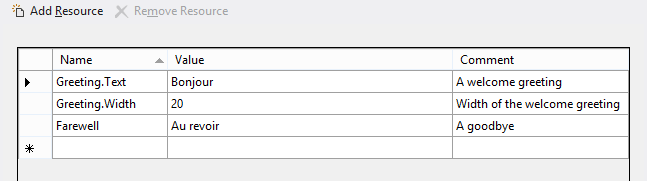

# Colocar cadeias de caracteres da interface do usuário em recursos


\[ Atualizado para aplicativos UWP no Windows 10. Para ler artigos do Windows 8.x, consulte o [arquivo morto](http://go.microsoft.com/fwlink/p/?linkid=619132) \]


**APIs importantes**

-   [**ApplicationModel.Resources.ResourceLoader**](https://msdn.microsoft.com/library/windows/apps/br206014)
-   [**WinJS.Resources.processAll**](https://msdn.microsoft.com/library/windows/apps/br211864)

Coloque recursos de cadeia de caracteres da interface do usuário em arquivos de recurso. Você poderá então referenciar essas cadeias de caracteres no código ou na marcação.

Este tópico mostra as etapas para adicionar vários recursos de cadeia de caracteres de idiomas ao seu aplicativo Universal do Windows e como testá-lo rapidamente.

## <span id="put_strings_into_resource_files__instead_of_putting_them_directly_in_code_or_markup."></span><span id="PUT_STRINGS_INTO_RESOURCE_FILES__INSTEAD_OF_PUTTING_THEM_DIRECTLY_IN_CODE_OR_MARKUP."></span>Coloque as cadeias de caracteres em arquivos de recurso em vez de colocá-las diretamente no código ou na marcação.


1.  Abra sua solução (ou crie uma nova) no Visual Studio.

2.  Abra package.appxmanifest no Visual Studio, vá até a guia **Aplicativo** e (para este exemplo) defina o idioma Padrão como "en-US". Se houver vários arquivos package.appxmanifest em sua solução, faça isso para cada um deles.
    <br>**Observação**  Isso especifica o idioma padrão do projeto. Os recursos de idioma padrão serão usados se o idioma de preferência do usuário ou os idiomas de exibição não corresponderem aos recursos de idioma fornecidos no aplicativo.
3.  Crie uma pasta para conter os arquivos de recursos.
    1.  No Gerenciador de Soluções, clique com o botão direito no projeto (o projeto Compartilhado se sua solução contiver vários projetos) e selecione **Adicionar** &gt; **Nova Pasta**.
    2.  Dê o nome "Cadeias de caracteres" à nova pasta.
    3.  Se a nova pasta não estiver visível no Gerenciador de Soluções, selecione **Projeto** &gt; **Mostrar Todos os Arquivos** no menu do Microsoft Visual Studio enquanto o projeto ainda estiver selecionado.

4.  Crie uma subpasta e um arquivo de recursos para inglês (Estados Unidos).
    1.  Clique com o botão direito na pasta de cadeias de caracteres e adicione uma nova pasta abaixo dela. Dê a esta pasta o nome "en-US". O arquivo de recursos deve ser colocado em uma pasta que tenha recebido o nome de marca de idioma [BCP-47](http://go.microsoft.com/fwlink/p/?linkid=227302). Veja [Como nomear recursos usando qualificadores](https://msdn.microsoft.com/library/windows/apps/xaml/hh965324) para saber mais sobre o qualificador de idioma e uma lista de marcas de idioma comuns.
    2.  Clique com o botão direito do mouse na pasta en-US e selecione **Adicionar** &gt; **Novo Item...**.
    3.  **XAML:** selecione "Arquivo de Recursos (.resw)".
        <br>**HTML:** selecione "Arquivo de Recursos (.resjson)".

    4.  Clique em **Adicionar**. Isso adiciona um arquivo de recursos com o nome padrão "Resources.resw" (para **XAML**) ou "resources.rejson" (para **HTML**). Recomendamos que você use esse nome de arquivo padrão. Os aplicativos podem particionar seus recursos em outros arquivos, mas você deve ter cuidado de fazer a referência a eles corretamente (veja [Como carregar recursos de cadeias de caracteres](https://msdn.microsoft.com/library/windows/apps/xaml/hh965323)).
    5.  **Apenas XAML:** se você tiver arquivos .resx apenas com recursos de cadeias de caracteres de projetos .NET anteriores, selecione **Adicionar** &gt; **Item Existente...**, adicione o arquivo .resx e renomeie-o para .resw.
    6.  Abra o arquivo e use o editor para adicionar estes recursos:

        **XAML:**

        Strings/en-US/Resources.resw
        
        Neste exemplo, "Greeting.Text" e "Farewell" identificam as cadeias de caracteres que serão exibidas. "Greeting.Width" identifica a propriedade Width da cadeia de caracteres "Greeting". Os comentários são um bom lugar para fornecer qualquer instrução especial para tradutores que localizarem as cadeias de caracteres para outros idiomas.

        **HTML:**

        O novo arquivo contém conteúdo padrão. Substitua o conteúdo pelo seguinte (que pode ser similar ao padrão):

        Strings/en-US/resources.resjson

        ```        json
        {
                "greeting"              : "Hello",
                "_greeting.comment"     : "A welcome greeting",

                "farewell"              : "Goodbye",
                "_farewell.comment"     : "A goodbye"
        }
        ```

        Essa é a sintaxe exata da cadeia de caracteres JavaScript Object Notation (JSON), onde deve ser colocada uma vírgula depois de cada par nome/valor, exceto o último. Neste exemplo, "greeting" e "farewell" identificam as cadeias de caracteres a serem exibidas. Os outros pares ("\_greeting.comment" e "\_farewell.comment") são comentários que descrevem as cadeias de caracteres. Os comentários são um bom lugar para fornecer qualquer instrução especial para tradutores que localizarem as cadeias de caracteres para outros idiomas.

## <span id="associate_controls_to_resources."></span><span id="ASSOCIATE_CONTROLS_TO_RESOURCES."></span>Associe controles a recursos.


**Somente XAML:**

Você precisa associar cada controle que necessita de texto localizado ao arquivo .resw. Para fazer isso, use o atributo **x:Uid** dos elementos XAML da seguinte forma:

```XAML
<TextBlock x:Uid="Greeting" Text="" />
```

Para o nome do recurso, você dá o valor do atributo **Uid**, e também especifica qual propriedade obterá a cadeia de caracteres traduzida (neste caso a propriedade Text). Você poderá especificar outra propriedade ou outros valores para culturas diferentes, como Greeting.Width, mas seja cauteloso com essas propriedades relacionadas ao layout. Lembre-se, você deve se esforçar para permitir que os controles sejam dispostos dinamicamente, com base na tela do dispositivo.

Observe que as propriedades anexadas são tratadas de maneira diferente em arquivos resw, como AutomationPeer.Name. Você precisa escrever explicitamente o namespace da seguinte forma:

```XAML
MediumButton.[using:Windows.UI.Xaml.Automation]AutomationProperties.Name</code></pre></td>
```

## <span id="add_string_resource_identifiers_to_code_and_markup."></span><span id="ADD_STRING_RESOURCE_IDENTIFIERS_TO_CODE_AND_MARKUP."></span>Adicione identificadores de recurso ao código e à marcação.


**XAML:**

No seu código, você pode fazer referência dinamicamente às cadeias de caracteres:

**C#**
```CSharp
var loader = new Windows.ApplicationModel.Resources.ResourceLoader();
var str = loader.GetString("Farewell");
```

**C++**
```ManagedCPlusPlus
auto loader = ref new Windows::ApplicationModel::Resources::ResourceLoader();
auto str = loader->GetString("Farewell");
```

**HTML:**

1.  Adicione referências à Biblioteca do Windows para JavaScript ao seu arquivo HTML, caso ainda não estejam lá.

    **Observação**  O seguinte código de exemplo mostra o HTML do arquivo default.html do projeto Windows que é gerado quando você cria um novo projeto JavaScript **Aplicativo em Branco (Universal do Windows)** no Visual Studio. Observe que ele já contém referências ao WinJS.

    ```    HTML
    <!-- WinJS references -->
    <link href="WinJS/css/ui-dark.css" rel="stylesheet" />
    <script src="WinJS/js/base.js"></script>
    <script src="WinJS/js/ui.js"></script>
    ```

2.  No código JavaScript que acompanha seu arquivo HTML, chame a função [**WinJS.Resources.processAll**](https://msdn.microsoft.com/library/windows/apps/br211864) quando o HTML for carregado.

    ```    JavaScript
    WinJS.Application.onloaded = function(){
        WinJS.Resources.processAll();
    }
    ```
    
    Se HTML adicional for carregado em um objeto [**WinJS.UI.Pages.PageControl**](https://msdn.microsoft.com/library/windows/apps/jj126158), chame [**WinJS.Resources.processAll**](https://msdn.microsoft.com/library/windows/apps/br211864)(*element*) no método [**IPageControlMembers.ready**](https://msdn.microsoft.com/library/windows/apps/hh770590) do controle da página, em que *element* é o elemento HTML (e seus elementos filhos) que está sendo carregado. Este exemplo é baseado no cenário 6 da [Amostra de recursos e localização de aplicativo](http://go.microsoft.com/fwlink/p/?linkid=227301):

    ```    JavaScript
    var output;
    
    var page = WinJS.UI.Pages.define("/html/scenario6.html", {
        ready: function (element, options) {
            output = element.querySelector('#output');
            WinJS.Resources.processAll(output); // Refetch string resources
            WinJS.Resources.addEventListener("contextchanged", refresh, false);
        }
        unload: function () { 
            WinJS.Resources.removeEventListener("contextchanged", refresh, false); 
        } 
    });
    ```

3.  No HTML, consulte os recursos da cadeia de caracteres usando os identificadores de recurso ('greeting' e 'farewell') dos arquivos de recurso.
    ```    HTML
    <h2><span data-win-res="{textContent: 'greeting';}"></span></h2>
    <h2><span data-win-res="{textContent: 'farewell'}"></span></h2>
    ```

4.  Consulte os recursos da cadeia de caracteres para atributos.

    ```    HTML
    <div data-win-res="{attributes: {'aria-label'; : 'String1'}}" >
    ```

    O padrão geral do atributo data-win-res para substituição de HTML é data-win-res="{*propertyname1*: '*resource ID*', *propertyname2*: '*resource ID2*'}".

    **Observação**  Se a cadeia de caracteres não contiver marcação, associe o recurso onde for possível para a propriedade textContent em vez de innerHTML. A propriedade textContent é muito mais rápida para substituir do que innerHTML.

5.  Consulte os recursos da cadeia de caracteres em JavaScript.
    <span codelanguage="JavaScript"></span>
    ```    JavaScript
    var el = element.querySelector('#header');
    var res = WinJS.Resources.getString('greeting');
    el.textContent = res.value;
    el.setAttribute('lang', res.lang);
    ```

## <span id="add_folders_and_resource_files_for_two_additional_languages."></span><span id="ADD_FOLDERS_AND_RESOURCE_FILES_FOR_TWO_ADDITIONAL_LANGUAGES."></span>Adicione pastas e arquivos de recursos para dois idiomas adicionais.


1.  Adicione outra pasta sob a pasta de Cadeias de caracteres para o idioma alemão. Dê à pasta o nome "de-DE", que representa Deutsch (alemão).
2.  Crie outro arquivo de recursos na pasta de-DE e adicione o seguinte:

    **XAML:**

    strings/de-DE/Resources.resw

    

    **HTML:**

    strings/de-DE/resources.resjson

    ```    json
    {
        "greeting"              : "Hallo",
        "_greeting.comment"     : "A welcome greeting.",

        "farewell"              : "Auf Wiedersehen",
        "_farewell.comment"     : "A goodbye."
    }
    ```

3.  Crie mais uma pasta, denominada "fr-FR", para francês (França). Crie um novo arquivo de recursos e adicione o seguinte:

    **XAML:**

    strings/fr-FR/Resources.resw
    
    **HTML:**

    strings/fr-FR/resources.resjson

    ```    json
    {
        "greeting"              : "Bonjour",
        "_greeting.comment"     : "A welcome greeting.",

        "farewell"              : "Au revoir",
        "_farewell.comment"     : "A goodbye."
    }
    ```

## <span id="build_and_run_the_app."></span><span id="BUILD_AND_RUN_THE_APP."></span>Compile e execute o aplicativo.


Teste o aplicativo no idioma de exibição padrão.

1.  Pressione F5 para compilar e executar o aplicativo.
2.  Os itens greeting e farewell são exibidos no idioma de preferência do usuário.
3.  Saia do aplicativo.

Teste o aplicativo nos outros idiomas.

1.  Ative as **Configurações** em seu dispositivo.
2.  Selecione **Hora e Idioma**.
3.  Selecione **Região e Idioma** (ou em um telefone ou emulador de telefone, **Idioma**).
4.  Observe que o idioma exibido quando você executa o aplicativo corresponde ao primeiro da lista (inglês, alemão ou francês). Se o seu idioma principal não for nenhum desses três, o aplicativo utilizará o próximo da lista de opções compatíveis.
5.  Caso nenhum desses três idiomas estejam presentes em seu computador, adicione os que estiverem faltando. Para isto, clique em **Adicionar um idioma** e adicione-os à lista.
6.  Para testar o aplicativo em outro idioma, selecione o idioma na lista e clique em **Definir como padrão** (ou em um telefone ou emulador de telefone, toque e segure o idioma na lista e, em seguida, toque em **Mover para cima** até que ele esteja na parte superior). Em seguida, execute o aplicativo.

## <span id="related_topics"></span>Tópicos relacionados


* [Como nomear recursos usando qualificadores](https://msdn.microsoft.com/library/windows/apps/xaml/hh965324)
* [Como carregar recursos de cadeias de caracteres](https://msdn.microsoft.com/library/windows/apps/xaml/hh965323)
* [A marca do idioma BCP-47](http://go.microsoft.com/fwlink/p/?linkid=227302)
 

 


<!--HONumber=Mar16_HO1-->


