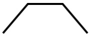

# Desenhar formas

\[ Atualizado para aplicativos UWP no Windows 10. Para ler artigos do Windows 8.x, consulte o [arquivo morto](http://go.microsoft.com/fwlink/p/?linkid=619132) \]


** APIs importantes **

-   [**Path**](https://msdn.microsoft.com/library/windows/apps/BR243355)
-   [**Namespace Windows.UI.Xaml.Shapes**](https://msdn.microsoft.com/library/windows/apps/BR243401)
-   [**Namespace Windows.UI.Xaml.Media**](https://msdn.microsoft.com/library/windows/apps/BR243045)

Aprenda a desenhar formas, como elipses, retângulos, polígonos e caminhos. A classe [**Path**](https://msdn.microsoft.com/library/windows/apps/BR243355) é uma maneira de visualizar uma linguagem de desenho baseada em vetor bastante complexa em uma interface do usuário XAML; por exemplo, você pode desenhar curvas de Bézier.

## Introdução

Dois conjuntos de classes definem uma região espacial na interface do usuário XAML: [**Shape**](https://msdn.microsoft.com/library/windows/apps/BR243377) e [**Geometry**](https://msdn.microsoft.com/library/windows/apps/BR210041). A principal diferença entre essas classes é que **Shape** é associada a um pincel e pode ser renderizada na tela, enquanto **Geometry** simplesmente define uma região espacial e não é renderizada, a menos que isso ajude a contribuir com informações para outra propriedade de interface do usuário. Pense em **Shape** como um [**UIElement**](https://msdn.microsoft.com/library/windows/apps/BR208911) com os limites definidos por **Geometry**. Este tópico abrange principalmente as classes **Shape**.

As classes [**Shape**](https://msdn.microsoft.com/library/windows/apps/BR243377) são [**Line**](https://msdn.microsoft.com/library/windows/apps/BR243345), [**Ellipse**](https://msdn.microsoft.com/library/windows/apps/BR243343), [**Rectangle**](https://msdn.microsoft.com/library/windows/apps/BR243371), [**Polygon**](https://msdn.microsoft.com/library/windows/apps/BR243359), [**Polyline**](https://msdn.microsoft.com/library/windows/apps/BR243365) e [**Path**](https://msdn.microsoft.com/library/windows/apps/BR243355). **Path** é interessante porque pode definir uma geometria arbitrária e a classe [**Geometry**](https://msdn.microsoft.com/library/windows/apps/BR210041) está envolvida aqui por causa da maneira de definir as partes de **Path**.

## Preenchimento e traços para formas

Para que uma [**Shape**](https://msdn.microsoft.com/library/windows/apps/BR243377) seja renderizada na tela do aplicativo, você deve associá-la a um [**Brush**](https://msdn.microsoft.com/library/windows/apps/BR228076). Defina a propriedade [**Fill**](https://msdn.microsoft.com/library/windows/apps/windows.ui.xaml.shapes.shape.fill) de **Shape** como o **Brush** desejado. Para saber mais sobre pincéis, consulte [Usando pincéis](using-brushes.md).

Uma [**Shape**](https://msdn.microsoft.com/library/windows/apps/BR243377) também pode ter um [**Stroke**](https://msdn.microsoft.com/library/windows/apps/windows.ui.xaml.shapes.shape.stroke), que é uma linha desenhada ao redor do perímetro da forma. Um **Stroke** também exige um [**Brush**](https://msdn.microsoft.com/library/windows/apps/BR228076) que define sua aparência e deve ter um valor diferente de zero para [**StrokeThickness**](https://msdn.microsoft.com/library/windows/apps/windows.ui.xaml.shapes.shape.strokethickness). **StrokeThickness** é uma propriedade que define a espessura do perímetro ao redor da borda da forma. Se você não especifica um valor de **Brush** para **Stroke**, ou se definir **StrokeThickness** como 0, a borda em torno da forma não será desenhada.

## Ellipse

Uma [**Elipse**](https://msdn.microsoft.com/library/windows/apps/BR243343) é uma forma com o perímetro curvado. Para criar uma **Ellipse** básica, especifique uma [**Width**](https://msdn.microsoft.com/library/windows/apps/BR208751), uma [**Height**](https://msdn.microsoft.com/library/windows/apps/BR208718) e um [**Brush**](https://msdn.microsoft.com/library/windows/apps/BR228076) para [**Fill**](https://msdn.microsoft.com/library/windows/apps/windows.ui.xaml.shapes.shape.fill).

O próximo exemplo cria uma [**Ellipse**](https://msdn.microsoft.com/library/windows/apps/BR243343) com uma [**Width**](https://msdn.microsoft.com/library/windows/apps/BR208751) de 200 e uma [**Height**](https://msdn.microsoft.com/library/windows/apps/BR208718) de 200 e usa um [**SteelBlue**](https://msdn.microsoft.com/library/windows/apps/Hh748056) colorido de [**SolidColorBrush**](https://msdn.microsoft.com/library/windows/apps/BR242962) como [**Fill**](https://msdn.microsoft.com/library/windows/apps/windows.ui.xaml.shapes.shape.fill).

```xml
<Ellipse Fill="SteelBlue" Height="200" Width="200" />
```

Veja a seguir o [**Elipse**](https://msdn.microsoft.com/library/windows/apps/BR243343) renderizado.


Neste caso, a [**Ellipse**](https://msdn.microsoft.com/library/windows/apps/BR243343) é o que a maioria das pessoas chamaria de um círculo, mas é assim que uma forma circular é declarada em XAML: use uma **Ellipse** com valores iguais para [**Width**](https://msdn.microsoft.com/library/windows/apps/BR208751) e [**Height**](https://msdn.microsoft.com/library/windows/apps/BR208718).

Quando uma [**Ellipse**](https://msdn.microsoft.com/library/windows/apps/BR243343) está posicionada em um layout de interface do usuário, seu tamanho é considerado como o mesmo de um retângulo com essa [**Width**](https://msdn.microsoft.com/library/windows/apps/BR208751) e [**Height**](https://msdn.microsoft.com/library/windows/apps/BR208718); a área fora do perímetro não tem renderização, mas faz parte do tamanho de slot do layout.

Um conjunto de seis elementos [**Ellipse**](https://msdn.microsoft.com/library/windows/apps/BR243343) faz parte do modelo de controle para o controle [**ProgressRing**](https://msdn.microsoft.com/library/windows/apps/BR227538), e dois elementos **Ellipse** concêntricos fazem parte de um [**RadioButton**](https://msdn.microsoft.com/library/windows/apps/BR227544).

## <span id="Rectangle"></span><span id="rectangle"></span><span id="RECTANGLE"></span>Rectangle

Um [**Rectangle**](https://msdn.microsoft.com/library/windows/apps/BR243371) é uma forma quadrilátera com lados opostos e iguais. Para criar um **Rectangle** básico, especifique valores para [**Width**](https://msdn.microsoft.com/library/windows/apps/BR208751), [**Height**](https://msdn.microsoft.com/library/windows/apps/BR208718) e [**Fill**](https://msdn.microsoft.com/library/windows/apps/windows.ui.xaml.shapes.shape.fill).

Você pode arredondar os cantos de um [**Rectangle**](https://msdn.microsoft.com/library/windows/apps/BR243371). Para criar cantos redondos, especifique um valor para as propriedades [**RadiusX**](https://msdn.microsoft.com/en-us/library/windows/apps/windows.ui.xaml.shapes.rectangle.radiusx.aspx) e [**RadiusY**](https://msdn.microsoft.com/library/windows/apps/windows.ui.xaml.shapes.rectangle.radiusy). Essas propriedades especificam o eixo x e o eixo y de uma elipse que define a curva dos cantos. O valor máximo de **RadiusX** é a [**Width**](https://msdn.microsoft.com/library/windows/apps/BR208751) dividida por dois e o valor máximo de **RadiusY** é a [**Height**](https://msdn.microsoft.com/library/windows/apps/BR208718) dividida por dois.

O próximo exemplo cria um [**Rectangle**](https://msdn.microsoft.com/library/windows/apps/BR243371) com uma [**Width**](https://msdn.microsoft.com/library/windows/apps/BR208751) de 200 e uma [**Height**](https://msdn.microsoft.com/library/windows/apps/BR208718) de 100. Ele usa um valor de [**Blue**](https://msdn.microsoft.com/library/windows/apps/Hh747837) de [**SolidColorBrush**](https://msdn.microsoft.com/library/windows/apps/BR242962) para seu [**Fill**](https://msdn.microsoft.com/library/windows/apps/windows.ui.xaml.shapes.shape.fill) e um valor de [**Black**](https://msdn.microsoft.com/library/windows/apps/Hh747833) de **SolidColorBrush** para seu [**Stroke**](https://msdn.microsoft.com/library/windows/apps/windows.ui.xaml.shapes.shape.stroke). Definimos a [**StrokeThickness**](https://msdn.microsoft.com/library/windows/apps/windows.ui.xaml.shapes.shape.strokethickness) como 3. Definimos a propriedade [**RadiusX**](https://msdn.microsoft.com/en-us/library/windows/apps/windows.ui.xaml.shapes.rectangle.radiusx.aspx) como 50 e a propriedade [**RadiusY**](https://msdn.microsoft.com/library/windows/apps/windows.ui.xaml.shapes.rectangle.radiusy) como 10, o que dá bordas arredondadas para **Rectangle**.

```xml
<Rectangle Fill="Blue"
           Width="200"
           Height="100"
           Stroke="Black"
           StrokeThickness="3"
           RadiusX="50"
           RadiusY="10" />
           ```

Here's the rendered [**Rectangle**](https://msdn.microsoft.com/library/windows/apps/BR243371).


**Tip**  There are some scenarios for UI definitions where instead of using a [**Rectangle**](https://msdn.microsoft.com/library/windows/apps/BR243371), a [**Border**](https://msdn.microsoft.com/library/windows/apps/BR209250) might be more appropriate. If your intention is to create a rectangle shape around other content, it might be better to use **Border** because it can have child content and will automatically size around that content, rather than using the fixed dimensions for height and width like **Rectangle** does. A **Border** also has the option of having rounded corners if you set the [**CornerRadius**](https://msdn.microsoft.com/library/windows/apps/windows.ui.xaml.controls.border.cornerradius) property.

 

On the other hand, a [**Rectangle**](https://msdn.microsoft.com/library/windows/apps/BR243371) is probably a better choice for control composition. A **Rectangle** shape is seen in many control templates because it's used as a "FocusVisual" part for focusable controls. Whenever the control is in a "Focused" visual state, this rectangle is made visible, in other states it's hidden.

## Polygon

A [**Polygon**](https://msdn.microsoft.com/library/windows/apps/BR243359) is a shape with a boundary defined by an arbitrary number of points. The boundary is created by connecting a line from one point to the next, with the last point connected to the first point. The [**Points**](https://msdn.microsoft.com/en-us/library/windows/apps/windows.ui.xaml.shapes.polygon.points.aspx) property defines the collection of points that make up the boundary. In XAML, you define the points with a comma-separated list. In code-behind you use a [**PointCollection**](https://msdn.microsoft.com/library/windows/apps/BR210220) to define the points and you add each individual point as a [**Point**](https://msdn.microsoft.com/library/windows/apps/BR225870) value to the collection.

You don't need to explicitly declare the points such that the start point and end point are both specified as the same [**Point**](https://msdn.microsoft.com/library/windows/apps/BR225870) value. The rendering logic for a [**Polygon**](https://msdn.microsoft.com/library/windows/apps/BR243359) assumes that you are defining a closed shape and will connect the end point to the start point implicitly.

The next example creates a [**Polygon**](https://msdn.microsoft.com/library/windows/apps/BR243359) with 4 points set to `(10,200)`, `(60,140)`, `(130,140)`, and `(180,200)`. It uses a [**LightBlue**](https://msdn.microsoft.com/library/windows/apps/Hh747960) value of [**SolidColorBrush**](https://msdn.microsoft.com/library/windows/apps/BR242962) for its [**Fill**](https://msdn.microsoft.com/library/windows/apps/windows.ui.xaml.shapes.shape.fill), and has no value for [**Stroke**](https://msdn.microsoft.com/library/windows/apps/windows.ui.xaml.shapes.shape.stroke) so it has no perimeter outline.

```xml
<Polygon Fill="LightBlue"
         Points="10,200,60,140,130,140,180,200" />
```

Veja a seguir o [**Polygon**](https://msdn.microsoft.com/library/windows/apps/BR243359) renderizado.


**Dica**  Um valor de [**Point**](https://msdn.microsoft.com/library/windows/apps/BR225870) costuma ser usado como um tipo em XAML para cenários que não estejam declarando os vértices de formas. Por exemplo, **Point** faz parte dos dados de evento para os eventos de toque, para que você saiba exatamente onde ocorreu a ação de toque no espaço de uma coordenada. Para saber mais sobre **Point** e como usá-lo na XAML ou no código, consulte o tópico de referência de API para [**Point**](https://msdn.microsoft.com/library/windows/apps/BR225870).

 

## Line

Uma [**Line**](https://msdn.microsoft.com/library/windows/apps/BR243345) é simplesmente uma linha desenhada entre dois pontos no espaço coordenado. Uma **Line** ignora todos os valores fornecidos para [**Fill**](https://msdn.microsoft.com/library/windows/apps/windows.ui.xaml.shapes.shape.fill), pois não possui espaço interno. Para uma **Line**, especifique os valores para as propriedades [**Stroke**](https://msdn.microsoft.com/library/windows/apps/windows.ui.xaml.shapes.shape.stroke) e [**StrokeThickness**](https://msdn.microsoft.com/library/windows/apps/windows.ui.xaml.shapes.shape.strokethickness); caso contrário, a **Line** não será renderizada.

Não use os valores [**Point**](https://msdn.microsoft.com/library/windows/apps/BR225870) para especificar uma forma de [**Line**](https://msdn.microsoft.com/library/windows/apps/BR243345), em vez disso, use valores [**Double**](https://msdn.microsoft.com/library/windows/apps/xaml/system.double.aspx) discretos para [**X1**](https://msdn.microsoft.com/en-us/library/windows/apps/windows.ui.xaml.shapes.line.x1.aspx), [**Y1**](https://msdn.microsoft.com/en-us/library/windows/apps/windows.ui.xaml.shapes.line.y1.aspx), [**X2**](https://msdn.microsoft.com/en-us/library/windows/apps/windows.ui.xaml.shapes.line.x2.aspx) e [**Y2**](https://msdn.microsoft.com/en-us/library/windows/apps/windows.ui.xaml.shapes.line.y2.aspx). Isso permite a marcação mínima para as linhas horizontais ou verticais. Por exemplo, `<Line Stroke="Red" X2="400"/>` define uma linha horizontal com comprimento de 400 pixels. Por padrão, as outras propriedades X,Y são 0, portanto, em termos de pontos, este XAML desenha uma linha de `(0,0)` a `(400,0)`. Você pode então usar [**TranslateTransform**](https://msdn.microsoft.com/library/windows/apps/BR243027) para mover **Line** na íntegra, caso queira começar em um ponto que não seja (0,0).

## <span id="_Polyline"></span><span id="_polyline"></span><span id="_POLYLINE"></span> Polyline

Uma [**Polyline**](https://msdn.microsoft.com/library/windows/apps/BR243365) é semelhante a um [**Polygon**](https://msdn.microsoft.com/library/windows/apps/BR243359) por ser delimitada por um conjunto de pontos. A única diferença é que o último ponto de uma **Polyline** não está conectado ao primeiro ponto.

**Observação**   Você pode ter pontos inicial e final idênticos de forma explícita nos [**Points**](https://msdn.microsoft.com/en-us/library/windows/apps/windows.ui.xaml.shapes.polyline.points.aspx) definidos para a [**Polyline**](https://msdn.microsoft.com/library/windows/apps/BR243365), mas nesse caso você provavelmente poderia usar um [**Polygon**](https://msdn.microsoft.com/library/windows/apps/BR243359).

 

Quando você especifica um [**Fill**](https://msdn.microsoft.com/library/windows/apps/windows.ui.xaml.shapes.shape.fill) de uma [**Polyline**](https://msdn.microsoft.com/library/windows/apps/BR243365), **Fill** pinta o espaço interior da forma, mesmo se os pontos inicial e final dos [**Points**](https://msdn.microsoft.com/en-us/library/windows/apps/windows.ui.xaml.shapes.polyline.points.aspx) definidos para a **Polyline** não fizerem interseção. Quando você não especifica um **Fill**, a **Polyline** é semelhante ao que teria sido renderizado se você tivesse especificado vários elementos [**Line**](https://msdn.microsoft.com/library/windows/apps/BR243345) individuais, com pontos iniciais e finais de linhas consecutivas em interseção.

Assim como ocorre com o [**Polygon**](https://msdn.microsoft.com/library/windows/apps/BR243359), a propriedade [**Points**](https://msdn.microsoft.com/en-us/library/windows/apps/windows.ui.xaml.shapes.polyline.points.aspx) define a coleção de pontos que formam o limite. Na XAML, os pontos são definidos por uma lista separada por vírgulas. Em code-behind, uma [**PointCollection**](https://msdn.microsoft.com/library/windows/apps/BR210220) é usada para definir os pontos e cada ponto é acrescentado como uma estrutura de [**Point**](https://msdn.microsoft.com/library/windows/apps/BR225870) à coleção.

Este exemplo cria uma [**Polyline**](https://msdn.microsoft.com/library/windows/apps/BR243365) com quatro pontos definidos como `(10,200)`, `(60,140)`, `(130,140)`e `(180,200)`. Um [**Stroke**](https://msdn.microsoft.com/library/windows/apps/windows.ui.xaml.shapes.shape.stroke) está definido, mas não um [**Fill**](https://msdn.microsoft.com/library/windows/apps/windows.ui.xaml.shapes.shape.fill).

```xml
<Polyline Stroke="Black"
        StrokeThickness="4"
        Points="10,200,60,140,130,140,180,200" />
```

Veja a seguir a [**Polyline**](https://msdn.microsoft.com/library/windows/apps/BR243365) renderizada. Observe que o primeiro e o último pontos não estão conectados pelo contorno do [**Stroke**](https://msdn.microsoft.com/library/windows/apps/windows.ui.xaml.shapes.shape.stroke) como se estivessem em um [**Polygon**](https://msdn.microsoft.com/library/windows/apps/BR243359).



## Path

Um [**Path**](https://msdn.microsoft.com/library/windows/apps/BR243355) é o objeto [**Shape**](https://msdn.microsoft.com/library/windows/apps/BR243377) mais versátil, pois pode ser usado para definir uma geometria arbitrária. Mas essa versatilidade resulta em maior complexidade. Vejamos como criar um **Path** básico em XAML.

A geometria de um caminho é definida com a propriedade [**Data**](https://msdn.microsoft.com/library/windows/apps/windows.ui.xaml.shapes.path.data). Há duas técnicas para definir **Data**:

-   Você pode definir um valor de cadeia de caracteres para [**Data**](https://msdn.microsoft.com/library/windows/apps/windows.ui.xaml.shapes.path.data) em XAML. Neste formato, o valor **Path.Data** está consumindo um formato de serialização para elementos gráficos. Você geralmente não edita o texto desse valor no formato de cadeia de caracteres depois que ele é estabelecido pela primeira vez. Em vez disso, você usa as ferramentas de design que permitem que você trabalhe em uma metáfora de design ou de desenho em uma superfície. Em seguida, você salva ou exporta a saída, e isso gera um arquivo XAML ou fragmento da cadeia de caracteres XAML com as informações de **Path.Data**.
-   Você pode definir a propriedade [**Data**](https://msdn.microsoft.com/library/windows/apps/windows.ui.xaml.shapes.path.data) como um único objeto [**Geometry**](https://msdn.microsoft.com/library/windows/apps/BR210041). Isso pode ser feito em código ou em XAML. Essa única **Geometry** é geralmente um [**GeometryGroup**](https://msdn.microsoft.com/library/windows/apps/BR210041group), que atua como um contêiner que pode compor várias definições de geometria em um único objeto para fins do modelo de objeto. A razão mais comum para fazer isso é porque você quer usar uma ou mais curvas e formas complexas que podem ser definidas como valores [**Segments**](https://msdn.microsoft.com/library/windows/apps/BR210164) de uma [**PathFigure**](https://msdn.microsoft.com/library/windows/apps/BR210143), por exemplo [**BezierSegment**](https://msdn.microsoft.com/library/windows/apps/BR228068).

Este exemplo mostra um [**Path**](https://msdn.microsoft.com/library/windows/apps/BR243355) que pode ter resultado do uso do Blend for Visual Studio para produzir apenas algumas formas vetoriais e do salvamento do resultado como XAML. O **Path** completo consiste em um segmento de curva de Bézier e um segmento de linha. O exemplo tem a principal intenção de fornecer alguns exemplos de quais elementos existem no formato de serialização do [**Path.Data**](https://msdn.microsoft.com/library/windows/apps/windows.ui.xaml.shapes.path.data) e o que os números representam.

Este [**Data**](https://msdn.microsoft.com/library/windows/apps/windows.ui.xaml.shapes.path.data) começa com o comando mover, indicado por "M", que estabelece um ponto inicial absoluto para o caminho.

O primeiro segmento é uma curva de Bézier cúbica que começa em `(100,200)` e termina em `(400,175)`, que é desenhada usando os dois pontos de controle `(100,25)` e `(400,350)`. Esse segmento é indicado pelo comando "C" na cadeia de caracteres de atributo [**Data**](https://msdn.microsoft.com/library/windows/apps/windows.ui.xaml.shapes.path.data).

O segundo segmento começa com um comando de linha horizontal absoluto "H", que especifica uma linha desenhada do ponto de extremidade do subcaminho precedente `(400,175)` até um novo ponto de extremidade `(280,175)`. Por se tratar de um comando de linha horizontal, o valor especificado é uma coordenada X.

```xml
<Path Stroke="DarkGoldenRod" 
      StrokeThickness="3"
      Data="M 100,200 C 100,25 400,350 400,175 H 280" />
      ```

Here's the rendered [**Path**](https://msdn.microsoft.com/library/windows/apps/BR243355).


The next example shows a usage of the other technique we discussed: a [**GeometryGroup**](https://msdn.microsoft.com/library/windows/apps/BR210041group) with a [**PathGeometry**](https://msdn.microsoft.com/library/windows/apps/BR210168). This example exercises some of the contributing geometry types that can be used as part of a **PathGeometry**: [**PathFigure**](https://msdn.microsoft.com/library/windows/apps/BR210143) and the various elements that can be a segment in [**PathFigure.Segments**](https://msdn.microsoft.com/library/windows/apps/BR210164).

```xml
<Path Stroke="Black" StrokeThickness="1" Fill="#CCCCFF">
            <Path.Data>
              <GeometryGroup>
                  <RectangleGeometry Rect="50,5 100,10" />
                  <RectangleGeometry Rect="5,5 95,180" />
                  <EllipseGeometry Center="100, 100" RadiusX="20" RadiusY="30"/>
                  <RectangleGeometry Rect="50,175 100,10" />
                  <PathGeometry>
                    <PathGeometry.Figures>
                      <PathFigureCollection>
                        <PathFigure IsClosed="true" StartPoint="50,50">
                          <PathFigure.Segments>
                            <PathSegmentCollection>
                              <BezierSegment Point1="75,300" Point2="125,100" Point3="150,50"/>
                              <BezierSegment Point1="125,300" Point2="75,100"  Point3="50,50"/>
                            </PathSegmentCollection>
                          </PathFigure.Segments>
                        </PathFigure>
                      </PathFigureCollection>
                    </PathGeometry.Figures>
                  </PathGeometry>               
              </GeometryGroup>
            </Path.Data>
          </Path>
```

Um motivo para usar [**PathGeometry**](https://msdn.microsoft.com/library/windows/apps/BR210168) com as várias partes é que cada uma das partes tem as propriedades **Double** e **Point** que você provavelmente direcionaria para uma animação da interface do usuário. Você não pode fazer isso com o formato de serialização de [**Path.Data**](https://msdn.microsoft.com/library/windows/apps/windows.ui.xaml.shapes.path.data). Para saber mais, consulte [Animações com storyboard](storyboarded-animations.md).

 

 


<!--HONumber=Mar16_HO1-->


