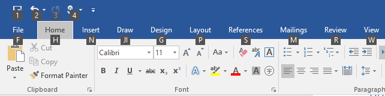

# <a name="access-keys"></a>Teclas de acesso

Os usuários que têm dificuldade de usar o mouse, como aqueles com deficiências motoras, frequentemente dependem do teclado para navegar e interagir com um app.  A estrutura XAML permite que você forneça acesso de teclado aos elementos de interface do usuário por meio da navegação por tabulação e as teclas de acesso.

- A navegação por tabulação é uma funcionalidade básica de acessibilidade de teclado (ativada por padrão) que permite aos usuários mover o foco entre elementos de interface do usuário usando as teclas de tabulação e de seta do teclado.
- As teclas de acesso são um recurso de acessibilidade complementar (que você implementa em seu aplicativo) para acesso rápido aos comandos do aplicativo usando uma combinação de modificador de teclado (tecla Alt) e uma ou mais teclas alfanuméricas (normalmente uma letra associada ao comando). As teclas de acesso comuns incluem _Alt + F_ para abrir o menu Arquivo e _Alt + AL_ para alinhar à esquerda.  

Para saber mais sobre navegação de teclado e acessibilidade, consulte [Interação por teclado](https://msdn.microsoft.com/windows/uwp/input-and-devices/keyboard-interactions) e [Acessibilidade do teclado](https://msdn.microsoft.com/windows/uwp/accessibility/keyboard-accessibility). Este artigo pressupõe que você entenda os conceitos abordados nesses artigos.

## <a name="access-key-overview"></a>Visão geral das teclas de acesso

As teclas de acesso permitem que os usuários invoquem os botões diretamente ou definam o foco com o teclado sem a necessidade de pressionar as teclas de seta e a tab. As teclas de acesso devem ser facilmente detectáveis, portanto, você deve documentá-las diretamente na interface do usuário; por exemplo, um selo flutuante sobre o controle com a tecla de acesso.



_Figura 1: Exemplo de teclas de acesso e dicas de tecla associadas no Microsoft Word._

Tecla de acesso é um ou vários caracteres alfanuméricos associados a um elemento de interface do usuário. Por exemplo, o Microsoft Word usa _H_ para a guia Início, _2_ para o botão Desfazer ou _JI_ para a guia Desenhar.

**Escopo das teclas de acesso**

Uma tecla de acesso pertence a um escopo específico. Por exemplo, na Figura 1, _F_, _H_, _N_ e _JI_ pertencem ao escopo da página.  Quando o usuário pressiona _H_, o escopo é alterado para o escopo da guia Início e suas teclas de acesso são mostradas como na Figura 2. As teclas de acesso _V_, _FP_, _FF_ e _FS_ pertencem ao escopo da guia Início.


_Figura 2: Exemplo de teclas de acesso e dicas de tecla associadas para o escopo da guia Início no Microsoft Word._

Dois elementos poderão ter as mesmas teclas de acesso se os elementos pertencerem a escopos diferentes. Por exemplo, _2_ é a tecla de acesso para Desfazer no escopo da página (Figura 1) e também para Itálico no escopo da guia Início (Figura 2). Todas as teclas de acesso pertencem ao escopo padrão, a menos que outro escopo seja especificado.

**Sequência de teclas de acesso**

As combinações de teclas de acesso normalmente são pressionadas uma tecla por vez para executar a ação em vez de pressioná-las simultaneamente. (Há uma exceção que abordaremos na próxima seção.) A sequência de teclas necessárias para executar a ação é uma _sequência de teclas de acesso_. O usuário pressiona a tecla Alt para iniciar a sequência de teclas de acesso. Uma tecla de acesso é invocada quando o usuário pressiona a tecla última em uma sequência de teclas de acesso. Por exemplo, para abrir a guia Exibir no Word, o usuário deve pressionar a sequência de teclas de acesso _Alt, W_.

Um usuário pode invocar várias teclas em uma sequência de teclas de acesso. Por exemplo, para abrir o Pincel de Formatação em um documento do Word, o usuário pressiona Alt para iniciar a sequência, pressiona _H_ para navegar até a seção Início e altera o escopo de teclas de acesso, em seguida, _F_e, por fim, _P_. _H_ e _FP_ são as teclas de acesso para a guia Início e o botão Pincel de Formatação, respectivamente.

Alguns elementos finalizam uma sequência de teclas de acesso depois que são invocados (como o botão Pincel de Formatação) e outros não (como a guia Início). Invocar uma tecla de acesso pode resultar na execução de um comando, na transferência do foco, na alteração do escopo das teclas de acesso ou alguma outra ação associada a ela.

## <a name="access-key-user-interaction"></a>Interação do usuário com as teclas de acesso

Para entender as APIs de Teclas de Acesso, é preciso primeiro entender o modelo de interação do usuário. A seguir, você encontrará um resumo do modelo de interação do usuário com as teclas de acesso:

- Quando o usuário pressiona a tecla Alt, a sequência de teclas de acesso é iniciada, mesmo quando o foco está em um controle de entrada. Em seguida, o usuário pode pressionar a tecla de acesso para invocar a ação associada. Essa interação do usuário requer que você documente as teclas de acesso disponíveis na interface do usuário com alguma funcionalidade visual, como selos flutuantes, que são mostrados quando a tecla Alt é pressionada
- Quando o usuário pressiona a tecla Alt mais a tecla de acesso ao mesmo tempo, a tecla de acesso é invocada imediatamente. Isso é semelhante a ter um atalho de teclado definido pela tecla Alt +_tecla de acesso_. Nesse caso, as funcionalidades visuais das teclas de acesso não são mostradas. No entanto, invocar uma tecla de acesso pode causar a alteração do escopo dela. Nesse caso, uma sequência de teclas de acesso é iniciada, e as funcionalidades visuais são mostradas para o novo escopo.
    > [!NOTE]
    > Somente as teclas de acesso com um caractere podem tirar proveito dessa interação do usuário. A combinação de Alt+_tecla de acesso_ não é compatível com teclas de acesso com mais de um caractere.    
- Quando há várias teclas de acesso de vários caracteres que compartilham alguns caracteres, quando o usuário pressiona um caractere compartilhado, as teclas de acesso são filtradas. Por exemplo, suponha que haja três teclas de acesso mostradas: _A1_, _A2_ e _C_. Se o usuário pressionar _A_, somente as teclas _A1_ e _A2_ serão mostradas, e a funcionalidade visual para C permanecerá oculta.
- A tecla Esc remove um nível da filtragem. Por exemplo, se houver teclas de acesso _B_, _ABC_, _ACD_ e _ABD_, e o usuário pressionar _A_, apenas _ABC_, _ACD_ e _ABD_ serão mostradas. Se o usuário pressionar _B_, apenas _ABC_ e _ABD_ serão mostradas. Se o usuário pressionar Esc, um nível de filtragem será removido, e as teclas de acesso _ABC_, _ACD_ e _ABD_ serão mostradas. Se o usuário pressionar Esc novamente, outro nível de filtragem será removido, e todas as teclas de acesso - _B_, _ABC_, _ACD_ e _ABD_ – serão habilitadas e suas funcionalidades visuais serão mostradas.
- A tecla Esc navega de volta para o escopo anterior. As teclas de acesso podem pertencer a escopos diferentes para facilitar a navegação em aplicativos que têm muitos comandos. A sequência de teclas de acesso sempre começa no escopo principal. Todas as teclas de acesso pertencem ao escopo principal, exceto as que especificam um determinado elemento de interface do usuário como o proprietário do escopo. Quando o usuário invoca a tecla de acesso de um elemento que é o proprietário de um escopo, a estrutura XAML automaticamente move o escopo para ele e o adiciona a uma pilha interna de navegação por teclas de acesso. A tecla Esc volta pela pilha de navegação por teclas de acesso.
- Há várias maneiras de ignorar a sequência de teclas de acesso:
    - O usuário pode pressionar Alt para ignorar uma sequência de teclas de acesso que está em andamento. Lembre-se de que pressionar Alt também inicia a sequência de teclas de acesso.
    - A tecla Esc ignorará a sequência de teclas de acesso se ela estiver no escopo principal e não for filtrada.
        > [!NOTE]
        > O pressionamento de tecla Esc é passado para a camada de interface do usuário para ser manipulado lá também.
- A tecla de tabulação ignora a sequência de teclas de acesso e retorna para a navegação por tabulação.
- A tecla Enter ignora a sequência de teclas de acesso e envia o pressionamento de teclas para o elemento que tem o foco.
- A tecla de seta ignora a sequência de teclas de acesso e envia o pressionamento de teclas para o elemento que tem o foco.
- Um evento de ponteiro para baixo, como um clique do mouse ou um toque, ignora a sequência de teclas de acesso.
-Por padrão, quando uma tecla de acesso é invocada, a sequência de teclas de acesso é ignorada.  No entanto, você pode substituir esse comportamento definindo a propriedade [ExitDisplayModeOnAccessKeyInvoked](https://msdn.microsoft.com/library/windows/apps/windows.ui.xaml.uielement.exitdisplaymodeonaccesskeyinvoked.aspx) como **false**.
- Colisões de teclas de acesso ocorrem quando uma automação finita determinística não é possível. Colisões de teclas de acesso não são desejáveis, mas podem ocorrer devido a um grande número de comandos, problemas de localização ou geração de tempo de execução de teclas de acesso.

 Há dois casos nos quais ocorrem colisões:
 - Quando dois elementos de interface do usuário têm o mesmo valor de tecla de acesso e pertencem ao mesmo escopo. Por exemplo, uma tecla de acesso _A1_ para um `button1` e uma tecla de acesso _A1_ para um `button2` que pertence ao escopo padrão. Nesse caso, o sistema resolve a colisão por meio do processamento da tecla de acesso do primeiro elemento adicionado à árvore visual. O restante é ignorado.
 - Quando há mais de uma opção computacional no mesmo escopo de tecla de acesso. Por exemplo, _A_ e _A1_. Quando o usuário pressiona _A_, o sistema tem duas opções: invocar a tecla _A_ ou continuar e consumir o caractere A da tecla de acesso _A1_. Nesse caso, o sistema processará somente a primeira invocação de tecla de acesso acessada pelo autômato. Por exemplo, no caso de _A_ e _A1_, o sistema invocará somente a tecla de acesso _A_.
-   Quando o usuário pressiona um valor de tecla de acesso inválido em uma sequência de teclas de acesso, nada acontece. Há duas categorias de teclas acesso consideradas válidas em uma sequência:
 - Teclas especiais para sair da sequência: Esc, Alt, as teclas de seta, Enter e tabulação.
 - Os caracteres alfanuméricos atribuídos às teclas de acesso.

## <a name="access-key-apis"></a>APIs de teclas de acesso

Para dar suporte à interação do usuário com as teclas de acesso, a estrutura XAML fornece as APIs descritas aqui.

**AccessKeyManager**

[AccessKeyManager](https://msdn.microsoft.com/library/windows/apps/windows.ui.xaml.input.accesskeymanager.aspx) é uma classe auxiliar que você pode usar para gerenciar sua interface do usuário quando as teclas de acesso são mostradas ou permanecem ocultas. O evento [IsDisplayModeEnabledChanged](https://msdn.microsoft.com/library/windows/apps/windows.ui.xaml.input.accesskeymanager.isdisplaymodeenabledchanged.aspx) é gerado sempre que o aplicativo entra e sai da sequência de teclas de acesso. Você pode consultar a propriedade [IsDisplayModeEnabled](https://msdn.microsoft.com/library/windows/apps/windows.ui.xaml.input.accesskeymanager.isdisplaymodeenabled.aspx) para determinar se as funcionalidades visuais são mostradas ou permanecem ocultas.  Você também pode chamar [ExitDisplayMode](https://msdn.microsoft.com/library/windows/apps/windows.ui.xaml.input.accesskeymanager.exitdisplaymode.aspx) para forçar o descarte de uma combinação de teclas de acesso.

> [!NOTE]
> Não há nenhuma implementação interna do elemento visual da tecla de acesso; você precisa providenciá-la.  

**AccessKey**

A propriedade [AccessKey](https://msdn.microsoft.com/library/windows/apps/windows.ui.xaml.uielement.accesskey.aspx) permite que você especifique uma tecla de acesso em um UIElement ou [TextElement](https://msdn.microsoft.com/library/windows/apps/windows.ui.xaml.documents.textelement.accesskey.aspx). Se dois elementos tiverem a mesma tecla de acesso e o mesmo escopo, apenas o primeiro elemento adicionado à árvore visual será processado.

Para garantir que a estrutura XAML processe as teclas de acesso, os elementos de interface do usuário precisam ser realizados na árvore visual. Se não houver nenhum elemento na árvore visual com uma tecla de acesso, nenhum evento de tecla de acesso será gerado.

As APIs de teclas de acesso não dão suporte a caracteres que precisam de dois pressionamentos de teclas para serem gerados. Um caractere individual deve corresponder a uma tecla no layout de teclado nativo de um idioma específico.  

**AccessKeyDisplayRequested/Dismissed**

Os eventos [AccessKeyDisplayRequested](https://msdn.microsoft.com/library/windows/apps/windows.ui.xaml.uielement.accesskeydisplayrequested.aspx) e [AccessKeyDisplayDismissed](https://msdn.microsoft.com/library/windows/apps/windows.ui.xaml.uielement.accesskeydisplaydismissed.aspx) são gerados quando um recurso visual tecla de acesso deve ser exibido ou ignorado. Esses eventos não serão gerados para elementos com a propriedade [Visibility](https://msdn.microsoft.com/library/windows/apps/windows.ui.xaml.uielement.visibility.aspx) definida como **Collapsed**. O evento AccessKeyDisplayRequested é gerado durante uma sequência de teclas de acesso sempre que o usuário pressiona um caractere que é usado pela tecla de acesso. Por exemplo, se uma tecla de acesso estiver definida como _AB_, esse evento será gerado quando o usuário pressionar a tecla Alt e novamente quando pressionar _A_. Quando o usuário pressionar _B_, o evento AccessKeyDisplayDismissed será gerado

**AccessKeyInvoked**

O evento [AccessKeyInvoked](https://msdn.microsoft.com/library/windows/apps/windows.ui.xaml.uielement.accesskeyinvoked.aspx) é gerado quando um usuário atinge o último caractere de uma tecla de acesso. Uma tecla de acesso pode ter um ou vários caracteres. Por exemplo, para as teclas de acesso _A_ e _BC_, quando um usuário pressiona _Alt, A_ ou _Alt, B, C_, o evento é gerado, mas não quando o usuário pressiona apenas _Alt, B_. Esse evento é gerado quando a tecla é pressionada, não quando ela é liberada.

**IsAccessKeyScope**

A propriedade [IsAccessKeyScope](https://msdn.microsoft.com/library/windows/apps/windows.ui.xaml.uielement.isaccesskeyscope.aspx) permite especificar que um UIElement seja a raiz de um escopo de tecla de acesso. O evento AccessKeyDisplayRequested é gerado para esse elemento, mas não para seus filhos. Quando um usuário invoca esse elemento, a estrutura XAML altera o escopo automaticamente e gera o evento AccessKeyDisplayRequested em seus filhos e o evento AccessKeyDisplayDismissed em outros elementos de interface do usuário (incluindo o pai).  A sequência de teclas de acesso não é encerrada quando o escopo é alterado.

**AccessKeyScopeOwner**

Para fazer com que um elemento participe do escopo de outro elemento (a origem) que não seja seu pai na árvore visual, você pode definir a propriedade [AccessKeyScopeOwner](https://msdn.microsoft.com/library/windows/apps/windows.ui.xaml.uielement.accesskeyscopeowner.aspx). O elemento associado à propriedade AccessKeyScopeOwner deve ter IsAccessKeyScope definido como **true**. Caso contrário, uma exceção é gerada.

**ExitDisplayModeOnAccessKeyInvoked**

Por padrão, quando uma tecla de acesso é acionada e o elemento não é um proprietário de escopo, a sequência de teclas de acesso é finalizada e o evento [AccessKeyManager.IsDisplayModeEnabledChanged](https://msdn.microsoft.com/library/windows/apps/windows.ui.xaml.input.accesskeymanager.isdisplaymodeenabledchanged.aspx) é gerado. Você pode definir a propriedade [ExitDisplayModeOnAccessKeyInvoked](https://msdn.microsoft.com/library/windows/apps/windows.ui.xaml.uielement.exitdisplaymodeonaccesskeyinvoked.aspx) **false** para substituir esse comportamento e evitar sair da sequência de teclas de acesso após sua chamada. (Essa propriedade é no [UIElement](https://msdn.microsoft.com/library/windows/apps/windows.ui.xaml.uielement.exitdisplaymodeonaccesskeyinvoked.aspx) e no [TextElement](https://msdn.microsoft.com/library/windows/apps/windows.ui.xaml.documents.textelement.exitdisplaymodeonaccesskeyinvoked.aspx)).

> [!NOTE]
> Se o elemento for um proprietário de escopo (`IsAccessKeyScope="True"`), o aplicativo entrará em um novo escopo de tecla de acesso e o evento IsDisplayModeEnabledChanged não será gerado.

**Tradução**

É possível traduzir teclas de acesso em vários idiomas e carregá-las no tempo de execução usando as APIs [ResourceLoader](https://msdn.microsoft.com/library/windows/apps/windows.applicationmodel.resources.resourceloader.aspx).

## <a name="control-patterns-used-when-an-access-key-is-invoked"></a>Padrões de controle usados quando uma tecla de acesso é invocada

Padrões de controle são implementações de interface que expõem uma funcionalidade de controle comum; por exemplo, os botões implementam o padrão de controle **Invoke** que, por sua vez, gera o evento **clique**. Quando uma tecla de acesso é invocada, a estrutura XAML verifica se o elemento invocado implementa um padrão de controle e o executa em caso afirmativo. Se o elemento tem mais de um padrão de controle, apenas um é invocado, o restante é ignorado. Os padrões de controle são pesquisados na seguinte ordem:

1.  Invocar. Por exemplo, um botão.
2.  Alternar. Por exemplo, uma caixa de seleção.
3.  Seleção. Por exemplo, um botão de opção.
4.  Expandir/recolher. Por exemplo, uma caixa de combinação.

Se um padrão de controle não for encontrado, a invocação de tecla de acesso aparecerá como não operacional e uma mensagem de depuração será registrada para ajudar na depuração dessa situação: "Nenhum padrão de automação para esse componente encontrado. Implemente o comportamento desejado no manipulador de eventos para AccessKeyInvoked. Definir a propriedade Handled como true em seu manipulador de eventos suprimirá essa mensagem."

> [!NOTE]
> Para que você veja essa mensagem, o tipo de processo de aplicativo do depurador deve ser _Misto (Gerenciado e Nativo)_ ou _Nativo_ nas configurações de depuração do Visual Studio.

Se não quiser que uma tecla de acesso execute o padrão de controle, ou se o elemento não tiver um padrão de controle, manipule os eventos [AccessKeyInvoked](https://msdn.microsoft.com/library/windows/apps/windows.ui.xaml.uielement.accesskeyinvoked.aspx) e implemente o comportamento desejado.
```csharp
private void OnAccessKeyInvoked(UIElement sender, AccessKeyInvokedEventArgs args)
{
    args.Handled = true;
    //Do something
}
```

Para saber mais sobre padrões de controle, consulte [Visão geral dos padrões de controle de automação da interface do usuário](https://msdn.microsoft.com/library/windows/desktop/ee671194.aspx).

## <a name="access-keys-and-narrator"></a>Teclas de acesso e narrador

O Windows Runtime tem provedores de automação de interface do usuário que expõem propriedades nos elementos de automação de interface do usuário da Microsoft. Essas propriedades permitem que aplicativos de cliente de automação de interface do usuário descubram informações sobre partes da interface do usuário. A propriedade [AutomationProperties.AccessKey](https://msdn.microsoft.com/library/windows/apps/hh759763) permite que os clientes, como o Narrador, descubra a tecla de acesso associada a um elemento. O Narrador lerá essa propriedade sempre que um elemento receber o foco. Se AutomationProperties é não tiver valor, a estrutura XAML retornará o valor [AccessKey](https://msdn.microsoft.com/library/windows/apps/windows.ui.xaml.uielement.accesskey.aspx) da propriedade do UIElement ou do TextElement. Você não precisará configurar AutomationProperties.AccessKey se a propriedade AccessKey já tiver um valor.

## <a name="example-access-key-for-button"></a>Exemplo: tecla de acesso para botão

Este exemplo mostra como criar uma tecla de acesso para um botão. Ele usa as dicas de ferramentas como uma funcionalidade visual para implementar um selo flutuante que contém a tecla de acesso.

> [!NOTE]
> A dica de ferramenta é usada para fins de simplicidade, mas recomendamos que você crie seu próprio controle para exibi-la usando, por exemplo, [Popup](https://msdn.microsoft.com/library/windows/apps/windows.ui.xaml.controls.primitives.popup.aspx).

A estrutura XAML automaticamente chama o manipulador para o evento Click, portanto você não precisa manipular o evento AccessKeyInvoked. O exemplo fornece funcionalidades visuais para apenas os caracteres que restam para invocar a tecla de acesso usando a propriedade [AccessKeyDisplayRequestedEventArgs.PressedKeys](https://msdn.microsoft.com/library/windows/apps/windows.ui.xaml.input.accesskeydisplayrequestedeventargs.pressedkeys.aspx). Por exemplo, se houver três teclas de acesso exibidas: _A1_, _A2_ e _C_e o usuário pressionar _A_, apenas _A1_ e _A2_ não serão filtradas e serão exibidas como _1_ e _2_ , em vez de _A1_ e _A2_.

```xaml
<StackPanel
        VerticalAlignment="Center"
        HorizontalAlignment="Center"
        Background="{ThemeResource ApplicationPageBackgroundThemeBrush}">
        <Button Content="Press"
                AccessKey="PB"
                AccessKeyDisplayDismissed="OnAccessKeyDisplayDismissed"
                AccessKeyDisplayRequested="OnAccessKeyDisplayRequested"
                Click="DoSomething" />
        <TextBlock Text="" x:Name="textBlock" />
    </StackPanel>
```

```csharp
 public sealed partial class ButtonSample : Page
    {
        public ButtonSample()
        {
            this.InitializeComponent();
        }

        private void DoSomething(object sender, RoutedEventArgs args)
        {
            textBlock.Text = "Access Key is working!";
        }

        private void OnAccessKeyDisplayRequested(UIElement sender, AccessKeyDisplayRequestedEventArgs args)
        {
            var tooltip = ToolTipService.GetToolTip(sender) as ToolTip;

            if (tooltip == null)
            {
                tooltip = new ToolTip();
                tooltip.Background = new SolidColorBrush(Windows.UI.Colors.Black);
                tooltip.Foreground = new SolidColorBrush(Windows.UI.Colors.White);
                tooltip.Padding = new Thickness(4, 4, 4, 4);
                tooltip.VerticalOffset = -20;
                tooltip.Placement = PlacementMode.Bottom;
                ToolTipService.SetToolTip(sender, tooltip);
            }

            if (string.IsNullOrEmpty(args.PressedKeys))
            {
                tooltip.Content = sender.AccessKey;
            }
            else
            {
                tooltip.Content = sender.AccessKey.Remove(0, args.PressedKeys.Length);
            }

            tooltip.IsOpen = true;
        }
        private void OnAccessKeyDisplayDismissed(UIElement sender, AccessKeyDisplayDismissedEventArgs args)
        {
            var tooltip = ToolTipService.GetToolTip(sender) as ToolTip;
            if (tooltip != null)
            {
                tooltip.IsOpen = false;
                //Fix to avoid show tooltip with mouse
                ToolTipService.SetToolTip(sender, null);
            }
        }
    }
```

## <a name="example-scoped-access-keys"></a>Exemplo: teclas de acesso com escopo

Este exemplo mostra como criar teclas de acesso com escopo definido. A propriedade IsAccessKeyScope do PivotItem impede que as teclas de acesso de elementos filho do PivotItem sejam exibidas quando o usuário pressiona Alt. Essas teclas de acesso são mostradas apenas quando o usuário invoca o PivotItem porque a estrutura XAML alterna automaticamente o escopo. A estrutura também oculta as teclas de acesso dos outros escopos.

Este exemplo também mostra como manipular o evento AccessKeyInvoked. O PivotItem não implementa nenhum padrão de controle, para que a estrutura XAML não invoque nenhuma ação por padrão. Essa implementação mostra como selecionar o PivotItem que foi invocado usando a tecla de acesso.

Por fim, o exemplo mostra o evento IsDisplayModeChanged onde você pode fazer algo quando o modo de exibição é alterado. Neste exemplo, o controle de pivô é recolhido até que o usuário pressione Alt. Quando o usuário terminar de interagir com o pivô, ele será recolhido novamente. Você pode usar IsDisplayModeEnabled para verificar se o modo de exibição de tecla de acesso está habilitado ou desabilitado.

```xaml   
<Grid Background="{ThemeResource ApplicationPageBackgroundThemeBrush}">
        <Pivot x:Name="MyPivot" VerticalAlignment="Center" HorizontalAlignment="Center" >
            <Pivot.Items>
                <PivotItem
                    x:Name="PivotItem1"
                    AccessKey="A"
                    AccessKeyInvoked="OnAccessKeyInvoked"
                    AccessKeyDisplayDismissed="OnAccessKeyDisplayDismissed"
                    AccessKeyDisplayRequested="OnAccessKeyDisplayRequested"
                    IsAccessKeyScope="True">
                    <PivotItem.Header>
                        <TextBlock Text="A Options"/>
                    </PivotItem.Header>
                    <StackPanel Orientation="Horizontal" >
                        <Button Content="ButtonAA" AccessKey="A"
                                AccessKeyDisplayDismissed="OnAccessKeyDisplayDismissed"
                                AccessKeyDisplayRequested="OnAccessKeyDisplayRequested" />
                        <Button Content="ButtonAD1" AccessKey="D1"
                                AccessKeyDisplayDismissed="OnAccessKeyDisplayDismissed"
                                AccessKeyDisplayRequested="OnAccessKeyDisplayRequested"  />
                        <Button Content="ButtonAD2" AccessKey="D2"
                                AccessKeyDisplayDismissed="OnAccessKeyDisplayDismissed"
                                AccessKeyDisplayRequested="OnAccessKeyDisplayRequested"/>
                    </StackPanel>
                </PivotItem>
                <PivotItem
                    x:Name="PivotItem2"
                    AccessKeyInvoked="OnAccessKeyInvoked"
                    AccessKeyDisplayDismissed="OnAccessKeyDisplayDismissed"
                    AccessKeyDisplayRequested="OnAccessKeyDisplayRequested"
                    AccessKey="B"
                    IsAccessKeyScope="true">
                    <PivotItem.Header>
                        <TextBlock Text="B Options"/>
                    </PivotItem.Header>
                    <StackPanel Orientation="Horizontal">
                        <Button AccessKey="B" Content="ButtonBB"
                                AccessKeyDisplayDismissed="OnAccessKeyDisplayDismissed"
                                AccessKeyDisplayRequested="OnAccessKeyDisplayRequested"  />
                        <Button AccessKey="F1" Content="ButtonBF1"
                                AccessKeyDisplayDismissed="OnAccessKeyDisplayDismissed"
                                AccessKeyDisplayRequested="OnAccessKeyDisplayRequested"  />
                        <Button AccessKey="F2" Content="ButtonBF2"  
                                AccessKeyDisplayDismissed="OnAccessKeyDisplayDismissed"
                                AccessKeyDisplayRequested="OnAccessKeyDisplayRequested"/>
                    </StackPanel>
                </PivotItem>
            </Pivot.Items>
        </Pivot>
    </Grid>
```

```csharp
public sealed partial class ScopedAccessKeys : Page
    {
        public ScopedAccessKeys()
        {
            this.InitializeComponent();
            AccessKeyManager.IsDisplayModeEnabledChanged += OnDisplayModeEnabledChanged;
            this.Loaded += OnLoaded;
        }

        void OnLoaded(object sender, object e)
        {
            //To let the framework discover the access keys, the elements should be realized
            //on the visual tree. If there are no elements in the visual
            //tree with access key, the framework won't raise the events.
            //In this sample, if you define the Pivot as collapsed on the constructor, the Pivot
            //will have a lazy loading and the access keys won't be enabled.
            //For this reason, we make it visible when creating the object
            //and we collapse it when we load the page.
            MyPivot.Visibility = Visibility.Collapsed;
        }

        void OnAccessKeyInvoked(UIElement sender, AccessKeyInvokedEventArgs args)
        {
            args.Handled = true;
            MyPivot.SelectedItem = sender as PivotItem;
        }
        void OnDisplayModeEnabledChanged(object sender, object e)
        {
            if (AccessKeyManager.IsDisplayModeEnabled)
            {
                MyPivot.Visibility = Visibility.Visible;
            }
            else
            {
                MyPivot.Visibility = Visibility.Collapsed;

            }
        }

        DependencyObject AdjustTarget(UIElement sender)
        {
            DependencyObject target = sender;
            if (sender is PivotItem)
            {
                PivotItem pivotItem = target as PivotItem;
                target = (sender as PivotItem).Header as TextBlock;
            }
            return target;
        }

        void OnAccessKeyDisplayRequested(UIElement sender, AccessKeyDisplayRequestedEventArgs args)
        {
            DependencyObject target = AdjustTarget(sender);
            var tooltip = ToolTipService.GetToolTip(target) as ToolTip;

            if (tooltip == null)
            {
                tooltip = new ToolTip();
                tooltip.Background = new SolidColorBrush(Windows.UI.Colors.Black);
                tooltip.Foreground = new SolidColorBrush(Windows.UI.Colors.White);
                tooltip.Padding = new Thickness(4, 4, 4, 4);
                tooltip.VerticalOffset = -20;
                tooltip.Placement = PlacementMode.Bottom;
                ToolTipService.SetToolTip(target, tooltip);
            }

            if (string.IsNullOrEmpty(args.PressedKeys))
            {
                tooltip.Content = sender.AccessKey;
            }
            else
            {
                tooltip.Content = sender.AccessKey.Remove(0, args.PressedKeys.Length);
            }

            tooltip.IsOpen = true;
        }
        void OnAccessKeyDisplayDismissed(UIElement sender, AccessKeyDisplayDismissedEventArgs args)
        {
            DependencyObject target = AdjustTarget(sender);

            var tooltip = ToolTipService.GetToolTip(target) as ToolTip;
            if (tooltip != null)
            {
                tooltip.IsOpen = false;
                //Fix to avoid show tooltip with mouse
                ToolTipService.SetToolTip(target, null);
            }
        }
    }
```


<!--HONumber=Dec16_HO2-->


