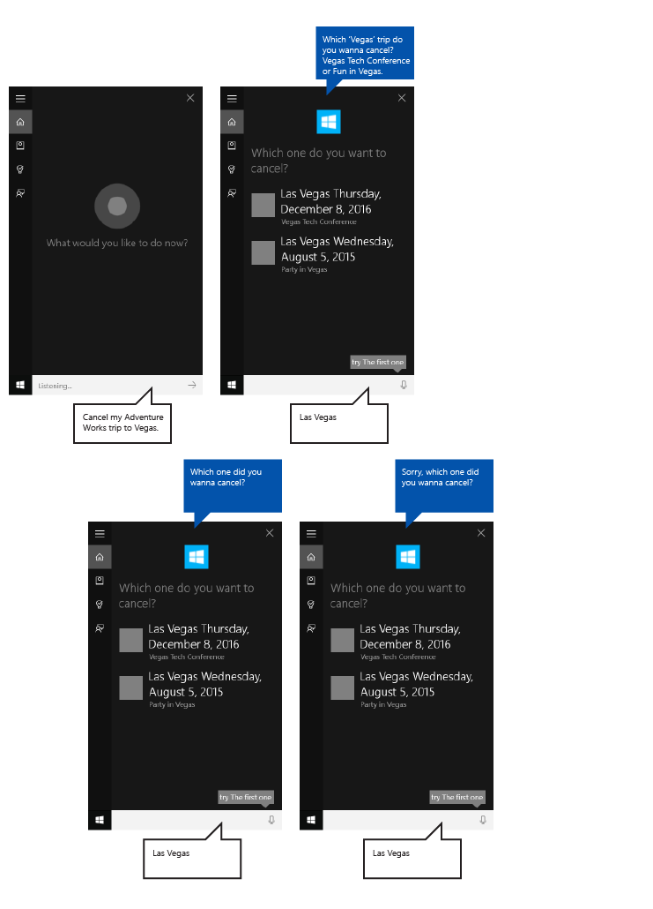

# Diretrizes para design da Cortana

\[ Atualizado para aplicativos UWP no Windows 10. Para ler artigos sobre o Windows 8.x, consulte o [arquivo morto](http://go.microsoft.com/fwlink/p/?linkid=619132) \]

Essas diretrizes e recomendações descrevem como seu aplicativo pode usar a **Cortana** da melhor forma para interagir com o usuário, ajudá-lo a realizar uma tarefa e comunicar claramente como tudo está sendo feito.

A **Cortana** permite que os aplicativos em execução em segundo plano solicitem confirmação ou desambiguação do usuário e, em troca, fornece comentários sobre o status do comando de voz. O processo é leve, rápido e não força o usuário a deixar a experiência da **Cortana** ou alternar o contexto para o aplicativo.

Embora o usuário deva achar que a **Cortana** esteja ajudando a tornar o processo o mais leve e fácil possível, provavelmente você desejará que a **Cortana** também seja explícita de que é seu aplicativo que está realizando a tarefa.

Usamos um aplicativo de planejamento e gerenciamento de viagens chamado **Adventure Works** integrado à interface do usuário da **Cortana**, exibido aqui, para demonstrar muitos dos conceitos e recursos discutidos.

## Escrita conversacional

Interações bem-sucedidas com a **Cortana** exigem que você siga alguns princípios fundamentais ao elaborar cadeias de caracteres de GUI e TTS (conversão de texto em fala).

<table>
<colgroup>
<col width="33%" />
<col width="33%" />
<col width="33%" />
</colgroup>
<thead>
<tr class="header">
<th align="left">Princípio</th>
<th align="left">Exemplo ruim</th>
<th align="left">Exemplo bom</th>
</tr>
</thead>
<tbody>
<tr class="odd">
<td align="left">

<dl>
<dt>Eficiente</dt>
<dd>
Use o mínimo de palavras possível e coloque as informações mais importantes em primeiro lugar.

</dd>
</dl></td>
<td align="left">
Claro que posso, qual filme você gostaria de procurar hoje? Temos uma grande coleção.
</td>
<td align="left">
Claro, qual filme você está procurando?
</td>
</tr>
<tr class="even">
<td align="left">

<dl>
<dt>Relevante</dt>
<dd>
Forneça informações pertinentes apenas à tarefa, ao conteúdo e ao contexto.

</dd>
</dl></td>
<td align="left">
Adicionei este item à sua playlist. Apenas para que você saiba, a bateria está ficando fraca.
</td>
<td align="left">
Adicionei este item à sua playlist.
</td>
</tr>
<tr class="odd">
<td align="left">

<dl>
<dt>Claro</dt>
<dd>
Evite ambiguidade. Use linguagem cotidiana em vez de jargão técnico.

</dd>
</dl></td>
<td align="left">
Nenhum resultado para a consulta &quot;Viagens para Las Vegas&quot;.
</td>
<td align="left">
Não encontrei nenhuma viagem para Las Vegas.
</td>
</tr>
<tr class="even">
<td align="left">

<dl>
<dt>Confiável </dt>
<dd>
Seja o mais preciso possível. Seja transparente sobre o que está acontecendo em segundo plano—se uma tarefa ainda não foi concluída, não diga que foi. Respeite a privacidade—não leia informações particulares em voz alta.

</dd>
</dl></td>
<td align="left">
Não encontrei esse filme, ele ainda não deve ter sido lançado.
</td>
<td align="left">
Não encontrei esse filme em nosso catálogo.
</td>
</tr>
</tbody>
</table>

 

Escreva como as pessoas falam. Não sobreponha a precisão gramatical ao soar com naturalidade. Por exemplo, não há problemas em usar contrações corriqueiras como "tá" ou "né" no TTS.

Use o tempo da primeira pessoa subentendido sempre que possível e soar natural. Por exemplo, "Procurando sua próxima viagem Adventure Works" sugere que alguém está à procura, mas não usa a palavra "eu" para especificar.

Use alguma variação para fazer com que seu aplicativo soe mais natural. Forneça versões diferentes das cadeias de caracteres da TTS e da GUI para dizer a mesma coisa. Por exemplo, "Qual filme você deseja assistir?" poderia ter alternativas, como "Qual filme você gostaria de assistir?". As pessoas não dizem exatamente a mesma coisa todas as vezes. Apenas certifique-se de manter suas versões TTS e GUI em sincronia.

Use frases como "OK" e "Certo" em suas respostas com ponderação. Embora elas possam fornecer confirmação e uma sensação de progresso, também podem se tornar repetitivas se usadas muitas vezes e sem variação.

**Observação**  Use frases de confirmação somente em TTS. Devido ao espaço limitado na tela da **Cortana**, não as repita nas cadeias de caracteres da GUI correspondentes.

 

Use contrações em suas respostas para interações mais naturais e economia de espaço adicional na tela da **Cortana**. Por exemplo, "Não encontrei esse filme" em vez de "Não consegui localizar esse filme". Escreva para o ouvido, não para o olho.

Use uma linguagem que o sistema compreenda. Os usuários tendem a repetir os termos aos quais são apresentados. Saiba o que você exibe.

Use alguma variação em suas respostas alternando ou selecionando aleatoriamente de uma coleção de respostas alternativas. Por exemplo, "Qual filme você deseja assistir?" e "Qual filme você gostaria de assistir?". Isso faz com que seu aplicativo soe mais natural e exclusivo.

## Localização

Para iniciar uma ação usando um comando de voz, o aplicativo deve registrar comandos de voz no idioma que o usuário selecionou no dispositivo (Configurações &gt; Sistema &gt; Fala &gt; Idioma de fala).

Você deve traduzir os comandos de voz a que seu aplicativo responde e todas as cadeias de caracteres de GUI e TTS.

Você deve evitar cadeias de caracteres de GUI longas. A tela da **Cortana** fornece três linhas para respostas e trunca cadeias de caracteres maiores.

Para obter mais informações, consulte a [seção Globalização e localização](../globalizing/globalizing-portal.md).

## Recursos de imagens e dimensionamento

Os aplicativos da Plataforma Universal do Windows (UWP) podem selecionar automaticamente a imagem de logotipo do aplicativo mais apropriada com base em configurações específicas e recursos do dispositivo (alto contraste, pixels efetivos, localidade, etc.). Tudo o que você precisa fazer é fornecer as imagens e se certificar de usar a convenção de nomenclatura apropriada e a organização de pasta dentro do projeto do aplicativo para as versões de recursos diferentes. Se você não fornecer as versões de recurso recomendadas, a acessibilidade, a localização e a qualidade da imagem poderão sofrer, dependendo das preferências do usuário, habilidades, tipo de dispositivo e local.

Para obter mais detalhes sobre os recursos de imagem dos fatores de escala e de alto contraste, consulte [Diretrizes para ativos de bloco e ícone](../controls-and-patterns/tiles-and-notifications-app-assets.md).

Você nomeia recursos usando qualificadores. Os qualificadores de recursos são modificadores de pasta e nome de arquivo que identificam o contexto em que uma determinada versão de um recurso deve ser usada.

A convenção de nomenclatura padrão é "nomedapasta/nomedoqualificador-valor\[\_nomedoqualificador-valor\]/nomedoarquivo.nomedoqualificador-valor\[\_nomedoqualificador-valor\].ext". Por exemplo: images/en-US/logo.scale-100\_contrast-white.png é simplesmente chamado no código usando a pasta raiz e o nome do arquivo: images/logo.png. Consulte [Globalização e localização](../globalizing/globalizing-portal.md) e [Como nomear recursos usando qualificadores](https://msdn.microsoft.com/library/windows/apps/xaml/hh965324).

Recomendamos marcar o idioma padrão nos arquivos de recursos de cadeia de caracteres (como "en-US\\resources.resw") e o fator de escala padrão em imagens (como "logo.scale-100.png"), mesmo que você não pretenda fornecer recursos localizados ou em várias resoluções no momento. No entanto, é recomendável, no mínimo, que você forneça ativos para os fatores de escala 100, 200 e 400.

**Importante**  
O ícone do aplicativo usado na área de título da tela da Cortana é o ícone Square44x44Logo especificado no arquivo "Package.appxmanifest". 

Você também pode especificar um ícone para cada resultado de uma consulta que é exibido na área de conteúdo da tela da Cortana. Tamanhos de imagem válidos para ícones de resultados são:

-   68(l) x 68(a)
-   68(l) x 92(a)
-   280(l) x 140(a)

## Exemplo

Este exemplo demonstra um fluxo de tarefa de ponta a ponta para um aplicativo em segundo plano na **Cortana**. Estamos usando o aplicativo **Adventure Works** para cancelar uma viagem a Las Vegas.

As etapas estão descritas na imagem a seguir:

1.  O usuário toca no microfone para iniciar a **Cortana**.
2.  O usuário diz "Cancele minha viagem Adventure Works para Vegas" para iniciar o aplicativo **Adventure Works** em segundo plano. O aplicativo usa a fala e a tela da **Cortana** para interagir com o usuário.
3.  A **Cortana** transita para uma tela de entrega que apresenta os comentários de confirmação ao usuário ("Vou resolver isso na Adventure Works."), uma barra de status e um botão Cancelar.
4.  Nesse caso, o usuário tem várias viagens que correspondem à consulta, portanto, o aplicativo apresenta uma tela de desambiguação que lista todos os resultados correspondentes e pergunta, "Qual delas você quer cancelar?"
5.  O usuário especifica o item "Conferência Vegas Tech".
6.  Como o cancelamento não pode ser desfeito, o aplicativo apresenta uma tela de confirmação que pede ao usuário que confirme sua intenção.
7.  O usuário diz: "sim".
8.  O aplicativo, em seguida, apresenta uma tela de conclusão que mostra o resultado da operação.

Exploramos essas etapas mais detalhadamente aqui.

### Entrega

|                                                                                                          |
|----------------------------------------------------------------------------------------------------------|
|               |
| Localizar viagem sem nenhuma tela de entrega                                                                              |
|  |
| Cancelar viagem com tela de entrega                                                                          |

 

Tarefas que levam menos de 500ms para o aplicativo responder e não requerem informações adicionais do usuário podem ser concluídas sem a participação adicional da **Cortana**, além da exibição da tela de conclusão.

Se o aplicativo exigir mais de 500ms para responder, a **Cortana** apresentará uma tela da entrega. O ícone e o nome do aplicativo são exibidos, e você deve fornecer as cadeias de caracteres de entrega da GUI e da TTS para indicar que o comando de voz foi reconhecido corretamente. A tela da entrega será mostrada por até 5 segundos. Se o aplicativo não responder dentro desse tempo, a **Cortana** apresentará uma tela de erro genérico.

### Diretrizes da GUI e da TTS para telas de entrega

Indique claramente que a tarefa está em andamento.

Use o tempo presente.

Use um verbo de ação que confirme que a tarefa esteja sendo iniciada e faça referência à entidade específica.

Use um verbo genérico que não confirma a ação solicitada, incompleta. Por exemplo, "Procurando sua viagem", em vez de "Cancelando sua viagem". Nesse caso, se nenhum resultado for retornado o usuário não ouvirá algo como "Cancelando sua viagem para Las Vegas... Não encontrei nenhuma viagem para Las Vegas".

Deixe claro que a tarefa ainda não terá sido executada se o aplicativo ainda precisar resolver a entidade solicitada. Por exemplo, observe como podemos dizer "Procurando sua viagem", em vez de "Cancelando sua viagem" porque pode ou não haver correspondências com alguma uma viagem, e ainda não sabemos o resultado.

As cadeias de caracteres da GUI e da TTS podem ser as mesmas, mas não precisam ser. Tente manter a cadeia de caracteres da GUI curta para evitar o truncamento e a duplicação de outros ativos visuais.

| TTS                                                    | GUI (INTERFACE GRÁFICA DO USUÁRIO)                                 |
|--------------------------------------------------------|-------------------------------------|
| Procurando sua próxima viagem Adventure Works.            | Procurando sua próxima viagem...         |
| Pesquisando sua viagem Adventure Works para Falls City. | Procurando viagem para Falls City... |

 

### Progresso

|                                                                                             |
|---------------------------------------------------------------------------------------------|
|  |
| Cancelar viagem com tela de progresso                                                            |

 

Quando uma tarefa demora um pouco entre as etapas, seu aplicativo deve intervir e atualizar o usuário sobre o que está acontecendo em uma tela de progresso. O ícone do aplicativo é exibido e você deve fornecer as cadeias de caracteres de progresso da GUI e da TTS para indicar que a tarefa está em andamento.

Você deve fornecer um link com parâmetros de inicialização ao seu aplicativo para iniciá-lo no estado apropriado. Isso permite que o usuário visualize ou conclua a tarefa por conta própria. A **Cortana** fornece o texto do link (como, "Ir para Adventure Works").

Telas de progresso serão exibidas por cinco segundos em cada uma e depois disso devem ser seguidas por outra tela ou a tarefa atingirá seu tempo limite.

Estas telas podem vir depois de uma tela de progresso:

-   Progresso
-   Confirmação (explícita, descrita posteriormente)
-   Desambiguidade
-   Conclusão

### Diretrizes de GUI e TTS para telas de progresso

Use o tempo presente.

Use um verbo de ação que confirme que a tarefa está em andamento.

**GUI**: se a entidade for mostrada, use uma referência a ela ("Cancelando essa viagem..."); se nenhuma entidade for mostrada, chame explicitamente a entidade ("Cancelando 'Conferência Vegas Tech'").

**TTS**: você deve incluir uma cadeia de caracteres TTS somente na primeira tela de progresso. Se mais telas de progresso forem necessárias, envie uma cadeia de caracteres vazia como sua cadeia de caracteres TTS ({}) e forneça apenas uma cadeia de GUI.

| Condições                                              | TTS                            | GUI (INTERFACE GRÁFICA DO USUÁRIO)                            |
|---------------------------------------------------------|--------------------------------|--------------------------------|
| ENTIDADE LIDA ANTERIORMENTE / ENTIDADE MOSTRADA NA TELA     | Cancelando essa viagem...          | Cancelando essa viagem...          |
| ENTIDADE NÃO LIDA ANTERIORMENTE / ENTIDADE MOSTRADA NA TELA | Cancelando sua viagem para Vegas... | Cancelando essa viagem...          |
| ENTIDADE NÃO LIDA ANTERIORMENTE / ENTIDADE NÃO MOSTRADA        | Cancelando sua viagem para Vegas... | Cancelando sua viagem para Vegas... |

 

### Confirmação

|                                                                                                     |
|-----------------------------------------------------------------------------------------------------|
|  |
| Cancelar viagem com tela de confirmação                                                                |

 

Algumas tarefas podem ser confirmadas implicitamente, pela natureza do comando do usuário. Outras são potencialmente mais sensíveis e exigem confirmação explícita. Aqui estão algumas diretrizes para quando usar confirmações explícitas e implícitas.

As cadeias de caracteres na tela de confirmação da GUI e da TTS são especificadas pelo seu aplicativo, e o ícone do aplicativo, se fornecido, é exibido em vez do avatar da **Cortana**.

Depois que o cliente responder à confirmação, o aplicativo deve fornecer a próxima tela dentro de 500ms para evitar a ida para uma tela de progresso.

Use a explícita quando...

-   O conteúdo deixar o usuário (como uma mensagem de texto, email ou postagem em rede social)
-   Uma ação não puder ser desfeita (como na realização de uma compra ou na exclusão de algo)
-   O resultado possa ser inconveniente (como ligar para a pessoa errada)
-   Um reconhecimento mais complexo for necessário (como na transcrição aberta)

Use a implícita quando...

-   O conteúdo for salvo somente para o usuário (como uma anotação para si próprio)
-   Houver uma maneira fácil de retroceder (como ligar ou desligar um alarme)
-   A tarefa precisar de agilidade (como capturar rapidamente uma ideia antes que se esqueça dela)
-   A precisão for alta (como um menu simples)

### Diretrizes de GUI e TTS para telas de confirmação

Use o tempo presente.

Faça uma pergunta não ambígua ao usuário, que possa ser respondida com "sim" ou "não". A pergunta deve confirmar explicitamente o que o usuário está tentando fazer e não deve haver nenhuma outra opção óbvia.

Forneça uma variação da pergunta para um nova solicitação, no caso de o comando de voz não ser entendido da primeira vez.

**GUI**: se a entidade for mostrada, use uma referência a ela. Se nenhuma entidade for mostrada, chame explicitamente a entidade.

**TTS**: por uma questão de clareza, sempre faça referência ao item ou entidade específicos, a menos que ele tenha sido lido pelo sistema anteriormente.

| Condições                                              | TTS                                        | GUI (INTERFACE GRÁFICA DO USUÁRIO)                                           |
|---------------------------------------------------------|--------------------------------------------|-----------------------------------------------|
| ENTIDADE NÃO LIDA ANTERIORMENTE / ENTIDADE MOSTRADA NA TELA | Você quer cancelar a Conferência Vegas Tech? | Cancelar essa viagem?                             |
| ENTIDADE NÃO LIDA ANTERIORMENTE / ENTIDADE NÃO MOSTRADA        | Você quer cancelar a Conferência Vegas Tech? | Cancelar Conferência Vegas Tech?                 |
| ENTIDADE NÃO LIDA ANTERIORMENTE / ENTIDADE NÃO MOSTRADA            | Você quer cancelar essa viagem?             | Cancelar essa viagem?                             |
| NOVA SOLICITAÇÃO COM ENTIDADE MOSTRADA                              | Você queria cancelar essa viagem?            | Você queria cancelar essa viagem?             |
| NOVA SOLICITAÇÃO COM ENTIDADE NÃO MOSTRADA                          | Você queria cancelar essa viagem?            | Você queria cancelar Conferência Vegas Tech? |

 

### Desambiguação

|                                                                                                        |
|--------------------------------------------------------------------------------------------------------|
|  |
| Cancelar viagem com tela de desambiguação                                                                 |

 

Algumas tarefas podem exigir que o usuário faça escolhas em uma lista de entidades para concluir a tarefa.

As cadeias de caracteres na tela de desambiguação da GUI e da TTS são especificadas pelo seu aplicativo, e o ícone do aplicativo, se fornecido, é exibido em vez do avatar da **Cortana**.

Depois que o cliente responder à pergunta de desambiguação, o aplicativo deverá fornecer a próxima tela dentro de 500ms para evitar a ida para uma tela de progresso.

### Diretrizes de GUI e TTS para telas de desambiguação

Use o tempo presente.

Faça uma pergunta não ambígua ao usuário, que possa ser respondida com o título ou a linha do texto de qualquer entidade exibida.

Até dez entidades podem ser exibidas.

Cada entidade deve ter um título exclusivo.

Forneça uma variação da pergunta para um nova solicitação, no caso de o comando de voz não ser entendido da primeira vez.

**TTS**: por uma questão de clareza, sempre faça referência ao item ou entidade específicos, a menos que tenha sido mencionado anteriormente.

**TTS**: não leia a lista de entidades, a menos que haja três ou menos itens e eles sejam curtos.

| Condições                 | TTS                                                                            | GUI (INTERFACE GRÁFICA DO USUÁRIO)                              |
|----------------------------|--------------------------------------------------------------------------------|----------------------------------|
| SOLICITAÇÃO — TRÊS OU MENOS ITENS  | Qual viagem a Vegas você quer cancelar? Conferência Vegas Tech ou Festa em Vegas? | Qual delas você quer cancelar? |
| SOLICITAÇÃO — MAIS DE TRÊS ITENS | Qual viagem a Vegas você quer cancelar?                                          | Qual delas você quer cancelar? |
| NOVA SOLICITAÇÃO                   | Qual viagem a Vegas você queria cancelar?                                         | Qual delas você quer cancelar? |

 

### Conclusão

|                                                                                                 |
|-------------------------------------------------------------------------------------------------|
|  |
| Cancelar viagem com tela de conclusão                                                              |

 

Após a conclusão bem-sucedida da tarefa, seu aplicativo deve informar ao usuário que a tarefa solicitada foi concluída com êxito.

As cadeias de caracteres na tela de conclusão da GUI e da TTS são especificadas pelo seu aplicativo, e o ícone do aplicativo, se fornecido, é exibido em vez do avatar da **Cortana**.

Você deve fornecer um link com parâmetros de inicialização ao seu aplicativo para iniciá-lo no estado apropriado. Isso permite que o usuário visualize ou conclua a tarefa por conta própria. A **Cortana** fornece o texto do link (como, "Ir para Adventure Works").

### Diretrizes de GUI e TTS para telas de conclusão

Use o tempo passado.

Use um verbo de ação para declarar explicitamente que a tarefa foi concluída.

Se a entidade for mostrada, ou se foi feita uma referência a ela anteriormente, somente faça uma referência a ela.

| Condições                                       | TTS                                             | GUI (INTERFACE GRÁFICA DO USUÁRIO)                                |
|--------------------------------------------------|-------------------------------------------------|------------------------------------|
| ENTIDADE MOSTRADA/ENTIDADE LIDA ANTERIORMENTE         | Eu cancelei essa viagem.                       | Cancelei essa viagem.               |
| ENTIDADE NÃO MOSTRADA / ENTIDADE NÃO LIDA ANTERIORMENTE | Eu cancelei sua viagem Conferência Vegas Tech. | Cancelei Conferência Vegas Tech". |

 

### Erro

|                                                                                      |
|--------------------------------------------------------------------------------------|
|  |
| Cancelar viagem com tela de erro                                                        |

 

Quando um dos seguintes erros ocorrem, a **Cortana** exibe a mesma mensagem genérica de erro.

-   O serviço do aplicativo é encerrado inesperadamente.
-   A **Cortana** falha ao se comunicar com o serviço do aplicativo.
-   O aplicativo não fornece uma tela depois que a **Cortana** mostra uma tela de entrega ou uma tela de progresso por cinco segundos.

## Artigos relacionados

* [Interações de fala](speech-interactions.md)
**Desenvolvedores**
* [Interações da Cortana](https://msdn.microsoft.com/library/windows/apps/mt185598)
* [Interações de controle por voz](https://msdn.microsoft.com/library/windows/apps/mt185614)
 

 

<!--HONumber=Mar16_HO1-->

