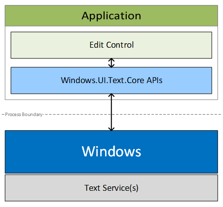
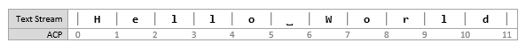

# Entrada de texto personalizado

As APIs de texto básicas no namespace [**Windows.UI.Text.Core**](https://msdn.microsoft.com/library/windows/apps/dn958238) permitem que um aplicativo UWP (Plataforma Universal do Windows) receba a entrada de texto de qualquer serviço de texto compatível em dispositivos Windows. As APIs são semelhantes às APIs [Estrutura de Serviços de Texto](https://msdn.microsoft.com/library/windows/desktop/ms629032) em que o aplicativo não precisa ter conhecimento detalhado dos serviços de texto. Isso permite que o aplicativo receba texto em qualquer idioma e de qualquer tipo de entrada, como teclado, fala ou caneta.

**APIs Importantes**

-   [**Windows.UI.Text.Core**](https://msdn.microsoft.com/library/windows/apps/dn958238)
-   [**CoreTextEditContext**](https://msdn.microsoft.com/library/windows/apps/dn958158)

## Por que usar APIs de texto básicas?

Para muitos aplicativos, os controles de caixa de texto XAML ou HTML são suficientes para entrada de texto e edição. No entanto, caso seu aplicativo manipule cenários de texto complexos, como um aplicativo de processamento de texto, talvez você precise da flexibilidade de um controle de edição de texto personalizado. Você pode usar as APIs de teclado [**CoreWindow**](https://msdn.microsoft.com/library/windows/apps/br208225) para criar o controle de edição de texto, mas elas não oferecem uma maneira de receber entrada de texto com base na composição, algo necessário para dar suporte a idiomas do leste asiático.

Em vez disso, use as APIs [**Windows.UI.Text.Core**](https://msdn.microsoft.com/library/windows/apps/dn958238) quando você precisar criar um controle de edição de texto personalizado. Essas APIs foram projetadas para dar muita flexibilidade no processamento de entrada de texto, em qualquer idioma e permitir que você ofereça a experiência de texto mais adequada ao seu aplicativo. Os controles de edição e entrada de texto criados com APIs de texto básicas podem receber entrada de texto de todos os métodos de entrada de texto em dispositivos Windows, dos Editores de Método de Entrada (IMEs) baseados na [Estrutura de Serviços de Texto](https://msdn.microsoft.com/library/windows/desktop/ms629032) e manuscrito em computadores até o teclado WordFlow (que fornece correção automática, previsão e ditado) em dispositivos móveis.

## Arquitetura

A seguir, uma representação simples do sistema de entrada de texto.

-   "Application" representa um aplicativo UWP que hospeda um controle de edição personalizado criado usando-se as APIs de texto básicas.
-   As APIs [**Windows.UI.Text.Core**](https://msdn.microsoft.com/library/windows/apps/dn958238) facilitam a comunicação com serviços de texto por meio do Windows. A comunicação entre o controle de edição de texto e os serviços de texto é manipulada principalmente por meio de um objeto [**CoreTextEditContext**](https://msdn.microsoft.com/library/windows/apps/dn958158) que fornece os métodos e os eventos para facilitar a comunicação.

## Intervalos e seleção de texto

Os controles de edição dão espaço para entrada de texto, e os usuários esperam editar texto em qualquer lugar nesse espaço. Aqui, explicamos o sistema de posicionamento de texto usado pelas APIs de texto básicas e como os intervalos e as seleções são representados nesse sistema.

### Posição do sinal de interpolação do aplicativo

Os intervalos de texto usados com as APIs de texto básicas são expressados em termos de posições de sinal de interpolação. Uma "Application Caret Position (ACP)" é um número baseado em zero que indica a contagem de caracteres desde o início do fluxo de texto pouco antes do sinal de interpolação, conforme mostrado aqui.

### Intervalos e seleção de texto

Os intervalos de texto e as seleções são representados pela estrutura [**CoreTextRange**](https://msdn.microsoft.com/library/windows/apps/dn958201) que contém dois campos:

| Campo                  | Tipo de dados                                                                 | Descrição                                                                      |
|------------------------|---------------------------------------------------------------------------|----------------------------------------------------------------------------------|
| **StartCaretPosition** | **Number** \[JavaScript\] | **System.Int32** \[.NET\] | **int32** \[C++\] | A posição inicial de um intervalo é a ACP pouco antes do primeiro caractere. |
| **EndCaretPosition**   | **Number** \[JavaScript\] | **System.Int32** \[.NET\] | **int32** \[C++\] | A posição final de um intervalo é a ACP logo depois do último caractere.     |

 

Por exemplo, no intervalo de texto mostrado anteriormente, o intervalo \[0, 5\] especifica a palavra "Hello". **StartCaretPosition** sempre deve ser menor ou igual a **EndCaretPosition**. O intervalo \[5, 0\] é inválido.

### Ponto de inserção

A posição do sinal de interpolação atual, normalmente conhecida como o ponto de inserção, é representada definindo-se **StartCaretPosition** para ser igual a **EndCaretPosition**

### Seleção não contígua

Alguns controles de edição dão suporte a seleções não contíguas. Por exemplo, os aplicativos do Microsoft Office dão suporte a seleções arbitrárias, e muitos editores de código-fonte dão suporte à seleção de coluna. No entanto, as APIs de texto básicas não dão suporte a seleções não contíguas. Os controles de edição devem informar somente uma seleção contígua única, normalmente o subintervalo ativo das seleções não contíguas.

Por exemplo, considere este fluxo de texto:

![diagrama do fluxo de texto de exemplo Há duas seleções: \[0, 1\] e \[6, 11\].

## O controle de edição deve informar somente uma delas; \[0, 1\] ou \[6, 11\].

Trabalhando com texto

A classe [**CoreTextEditContext**](https://msdn.microsoft.com/library/windows/apps/dn958158) permite o fluxo de texto entre o Windows e os controles de edição por meio do evento [**TextUpdating**](https://msdn.microsoft.com/library/windows/apps/dn958176), do evento [**TextRequested**](https://msdn.microsoft.com/library/windows/apps/dn958175) e do método [**NotifyTextChanged**](https://msdn.microsoft.com/library/windows/apps/dn958172).

O controle de edição recebe texto por meio de eventos [**TextUpdating**](https://msdn.microsoft.com/library/windows/apps/dn958176) gerados quando os usuários interagem com métodos de entrada de texto como teclados, fala ou IMEs.

Ao alterar o texto no seu controle de edição, por exemplo, colando o texto no controle, você precisa notificar o Windows chamando [**NotifyTextChanged**](https://msdn.microsoft.com/library/windows/apps/dn958172) Se o serviço de texto exigir o novo texto, um evento [**TextRequested**](https://msdn.microsoft.com/library/windows/apps/dn958175) será acionado.

### Você deve fornecer o novo texto no manipulador de eventos **TextRequested**.

Aceitando atualizações de texto O controle de edição normalmente deve aceitar solicitações de atualização de texto, porque elas representam o texto que o usuário deseja inserir.

1.  No manipulador de eventos [**TextUpdating**](https://msdn.microsoft.com/library/windows/apps/dn958176), essas ações são esperadas de seu controle de edição:
2.  Insira o texto especificado em [**CoreTextTextUpdatingEventArgs.Text**](https://msdn.microsoft.com/library/windows/apps/dn958236) na posição especificada em [**CoreTextTextUpdatingEventArgs.Range**](https://msdn.microsoft.com/library/windows/apps/dn958234)
3.  Coloque a seleção na posição especificada em [**CoreTextTextUpdatingEventArgs.NewSelection**](https://msdn.microsoft.com/library/windows/apps/dn958233)

Notifique o sistema de que a atualização foi bem-sucedida definindo [**CoreTextTextUpdatingEventArgs.Result**](https://msdn.microsoft.com/library/windows/apps/dn958235) como [**CoreTextTextUpdatingResult.Succeeded**](https://msdn.microsoft.com/library/windows/apps/dn958237) Por exemplo, esse é o estado de um controle de edição antes de o usuário digitar "d".

![O ponto de inserção está em \[10, 10\].

-   diagrama do fluxo de texto de exemplo
-   Quando o usuário digita "d", um evento [**TextUpdating**](https://msdn.microsoft.com/library/windows/apps/dn958176) é acionado com os seguintes dados [**CoreTextTextUpdatingEventArgs**](https://msdn.microsoft.com/library/windows/apps/dn958229):
-   [
              **Range**
            ](https://msdn.microsoft.com/library/windows/apps/dn958234) = \[10, 10\]

[
              **Text**
            ](https://msdn.microsoft.com/library/windows/apps/dn958236) = "d" [
              **NewSelection**
            ](https://msdn.microsoft.com/library/windows/apps/dn958233) = \[11, 11\]

 como **Succeeded**.](images/coretext/stream-4.png)
### Aqui está o estado do controle após as alterações serem aplicadas.

diagrama do fluxo de texto de exemplo Rejeitando atualizações de texto Às vezes, você não consegue aplicar atualizações de texto porque o intervalo solicitado está em uma área do controle de edição que não deve ser alterada.

Nesse caso, você não deve aplicar alterações. Em vez disso, notifique o sistema de que a atualização falhou definindo [**CoreTextTextUpdatingEventArgs.Result**](https://msdn.microsoft.com/library/windows/apps/dn958235) como [**CoreTextTextUpdatingResult.Failed**](https://msdn.microsoft.com/library/windows/apps/dn958237)

### Por exemplo, considere um controle de edição que aceita apenas um endereço de email.

Os espaços devem ser rejeitados porque endereços de email não podem conter espaços. Assim, quando eventos [**TextUpdating**](https://msdn.microsoft.com/library/windows/apps/dn958176) forem acionados para a tecla de espaço, você deverá simplesmente definir [**Result**](https://msdn.microsoft.com/library/windows/apps/dn958235) como **Failed** no seu controle de edição. Notificando alterações de texto

Às vezes, o controle de edição faz alterações no texto, como quando o texto é colado ou corrigido automaticamente. Nesses casos, você deve notificar os serviços de texto dessas alterações chamando o método [**NotifyTextChanged**](https://msdn.microsoft.com/library/windows/apps/dn958172).

![Por exemplo, esse é o estado de um controle de edição antes de o usuário colar "World".

![O ponto de inserção está em \[6, 6\].

-   diagrama do fluxo de texto de exemplo
-   O usuário executa a ação de colar e o controle de edição acaba com o seguinte texto:
-   diagrama do fluxo de texto de exemplo

Quando isso acontecer, você deverá chamar [**NotifyTextChanged**](https://msdn.microsoft.com/library/windows/apps/dn958172) usando estes argumentos:

### *modifiedRange* = \[6, 6\]

*newLength* = 5

*newSelection* = \[11, 11\] Um ou mais [**TextRequested**](https://msdn.microsoft.com/library/windows/apps/dn958175) eventos virão depois, manipulados para atualizar o texto com que os serviços de texto estão trabalhando. Substituindo atualizações de texto

![No controle de edição, convém substituir uma atualização de texto para fornecer recursos de correção automática. Por exemplo, considere um controle de edição que forneça um recurso de correção que formaliza contrações. Esse é o estado do controle de edição antes de o usuário digitar a tecla de espaço para acionar a correção. O ponto de inserção está em \[3, 3\].

 correspondente é acionado. O controle de edição aceita a atualização de texto.

![Esse é o estado do controle de edição para um breve momento antes de a correção ser concluída.

-   O ponto de inserção está em \[4, 4\].
-   diagrama do fluxo de texto de exemplo
-   Fora do manipulador de eventos [**TextUpdating**](https://msdn.microsoft.com/library/windows/apps/dn958176), o controle de edição faz a correção a seguir.

Este é o estado do controle de edição após a correção estar concluída.

### O ponto de inserção está em \[5, 5\].

diagrama do fluxo de texto de exemplo Quando isso acontecer, você deverá chamar [**NotifyTextChanged**](https://msdn.microsoft.com/library/windows/apps/dn958172) usando estes argumentos:

*modifiedRange* = \[1, 2\] *newLength* = 2 *newSelection* = \[5, 5\]

## Um ou mais [**TextRequested**](https://msdn.microsoft.com/library/windows/apps/dn958175) eventos virão depois, manipulados para atualizar o texto com que os serviços de texto estão trabalhando.

**Fornecendo texto solicitado**
* [É importante que os serviços de texto tenham o texto correto para fornecer recursos como a correção automática ou a previsão, especialmente para o texto que já existia no controle de edição, carregando um documento, por exemplo, ou texto inserido pelo controle de edição, conforme explicado nas seções anteriores.](http://go.microsoft.com/fwlink/p/?LinkID=251417)
 

 

<!--HONumber=May16_HO2-->

